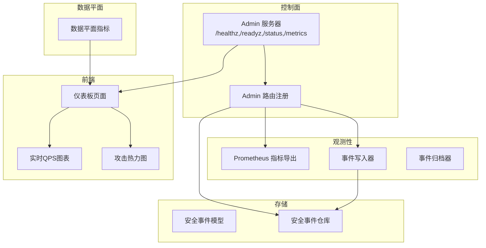
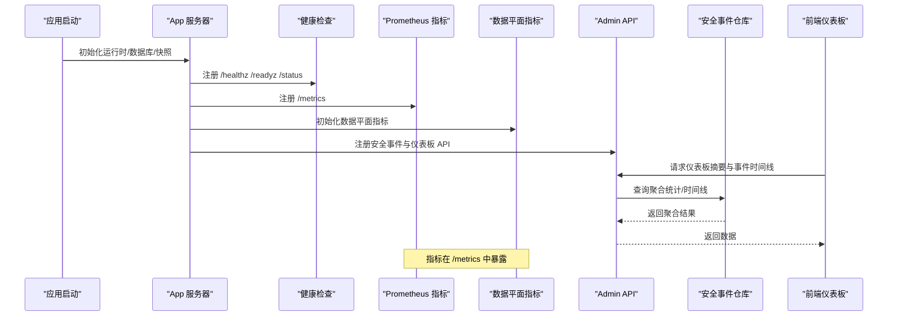
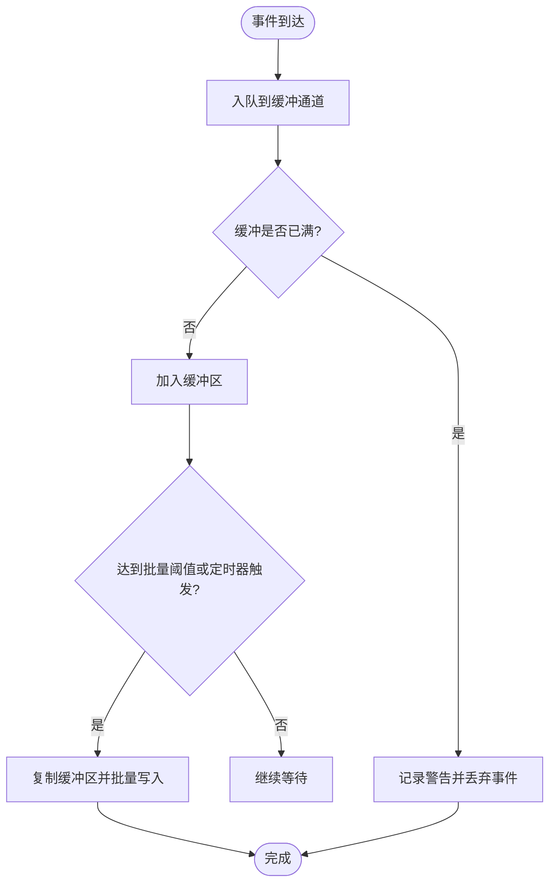
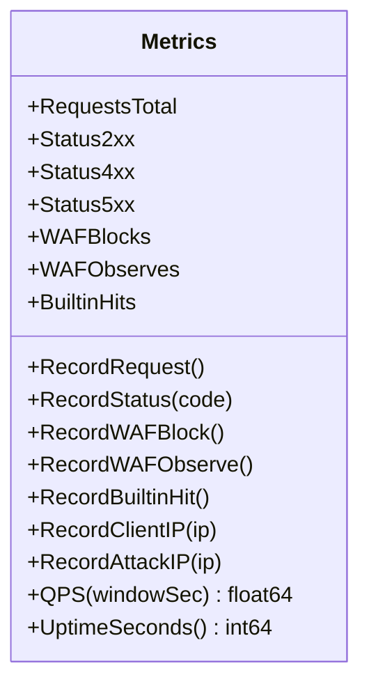
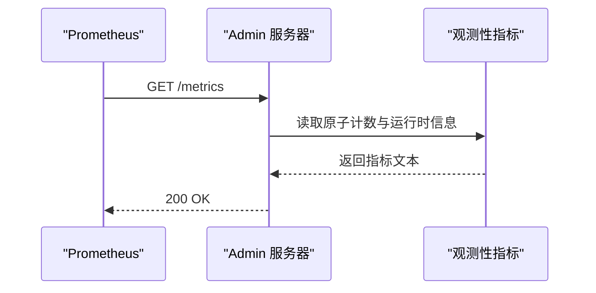
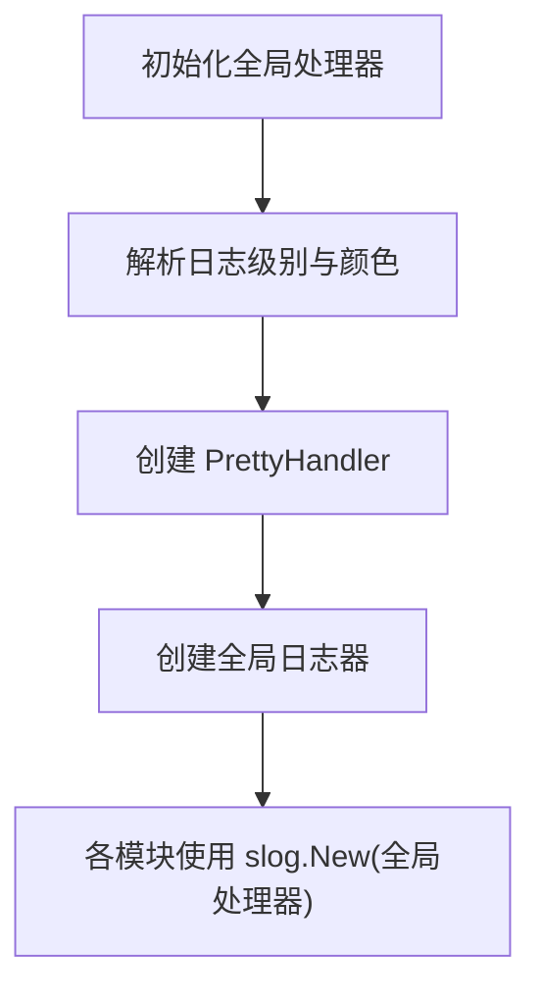
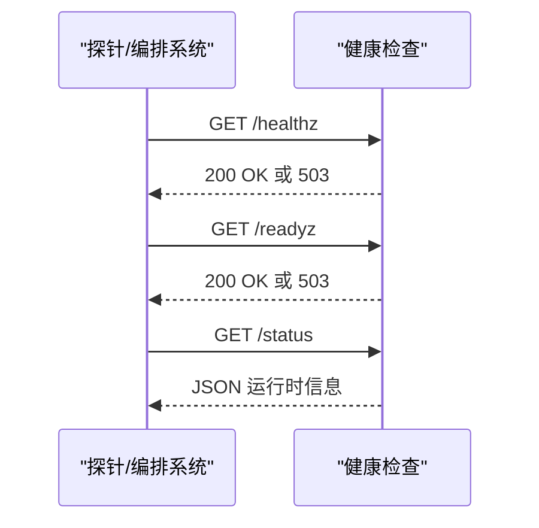
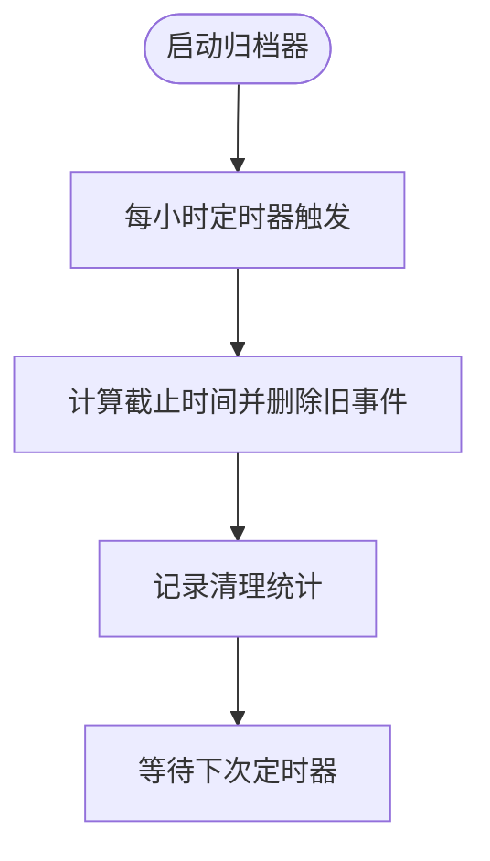
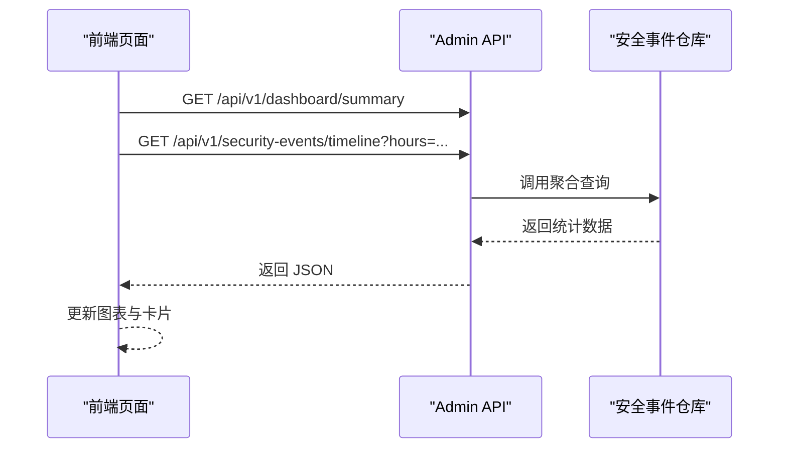
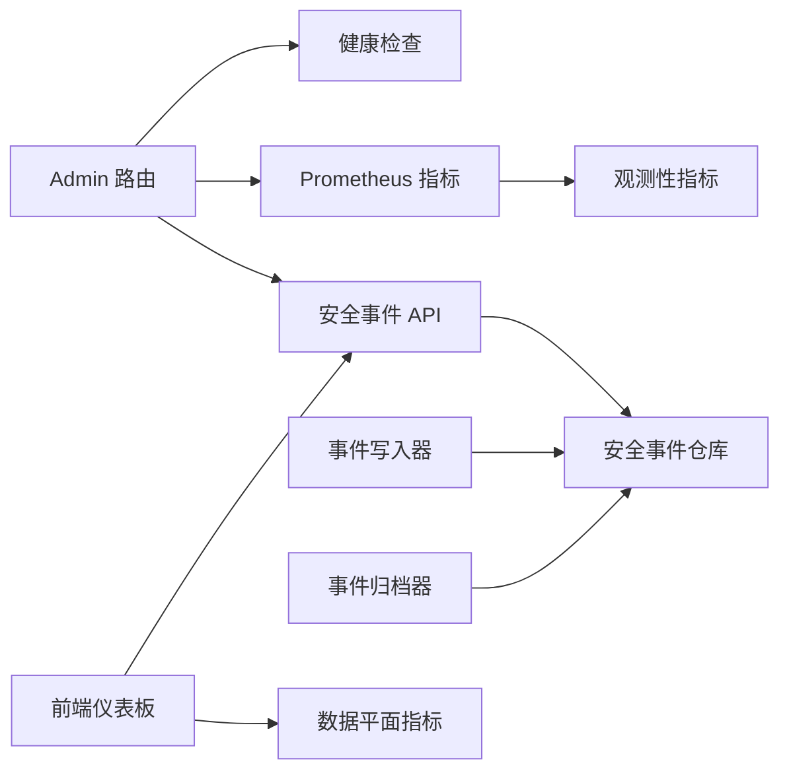

# 监控与可观测性

<cite>
**本文引用的文件**
- [cmd/main.go](file://cmd/main.go)
- [internal/app/server.go](file://internal/app/server.go)
- [internal/observability/metrics.go](file://internal/observability/metrics.go)
- [internal/observability/eventwriter.go](file://internal/observability/eventwriter.go)
- [internal/observability/archiver.go](file://internal/observability/archiver.go)
- [internal/dataplane/metrics.go](file://internal/dataplane/metrics.go)
- [internal/store/models.go](file://internal/store/models.go)
- [internal/store/repository/security_event.go](file://internal/store/repository/security_event.go)
- [internal/admin/router.go](file://internal/admin/router.go)
- [internal/admin/handler_security_event.go](file://internal/admin/handler_security_event.go)
- [internal/core/health/health.go](file://internal/core/health/health.go)
- [internal/pkg/logger/logger.go](file://internal/pkg/logger/logger.go)
- [frontend/components/charts/realtime-qps-chart.tsx](file://frontend/components/charts/realtime-qps-chart.tsx)
- [frontend/components/charts/attack-heatmap.tsx](file://frontend/components/charts/attack-heatmap.tsx)
- [frontend/app/(dashboard)/dashboard/page.tsx](file://frontend/app/(dashboard)/dashboard/page.tsx)
</cite>

## 目录
1. [简介](#简介)
2. [项目结构](#项目结构)
3. [核心组件](#核心组件)
4. [架构总览](#架构总览)
5. [详细组件分析](#详细组件分析)
6. [依赖关系分析](#依赖关系分析)
7. [性能考量](#性能考量)
8. [故障排查指南](#故障排查指南)
9. [结论](#结论)
10. [附录](#附录)

## 简介
本文件面向监控与可观测性，围绕安全事件记录系统、性能指标采集、Prometheus 集成、日志管理、健康检查、事件归档以及监控仪表板与告警配置进行系统化说明。目标是帮助运维与开发人员快速理解系统如何采集、存储、展示与告警，并提供可操作的实践建议。

## 项目结构
监控与可观测性相关代码主要分布在以下模块：
- 应用启动与路由：负责注册健康检查、Prometheus 指标端点、安全事件 API 与前端静态资源。
- 观测性子系统：包含 Prometheus 兼容指标导出、安全事件异步写入与归档。
- 数据平面指标：提供实时 QPS、状态码分布、WAF 命中等指标。
- 存储模型与仓库：定义安全事件数据模型及聚合查询接口。
- 日志系统：基于标准库 slog 的结构化日志与彩色输出。
- 前端图表与仪表板：提供实时 QPS 曲线、攻击热力图与仪表板页面。

**图表来源**
- [internal/app/server.go:245-258](file://internal/app/server.go#L245-L258)
- [internal/admin/router.go:36-137](file://internal/admin/router.go#L36-L137)
- [internal/observability/metrics.go:52-125](file://internal/observability/metrics.go#L52-L125)
- [internal/observability/eventwriter.go:27-104](file://internal/observability/eventwriter.go#L27-L104)
- [internal/observability/archiver.go:21-71](file://internal/observability/archiver.go#L21-L71)
- [internal/dataplane/metrics.go:37-135](file://internal/dataplane/metrics.go#L37-L135)
- [internal/store/models.go:211-235](file://internal/store/models.go#L211-L235)
- [internal/store/repository/security_event.go:30-153](file://internal/store/repository/security_event.go#L30-L153)
- [frontend/app/(dashboard)/dashboard/page.tsx:55-110](file://frontend/app/(dashboard)/dashboard/page.tsx#L55-L110)
- [frontend/components/charts/realtime-qps-chart.tsx:24-80](file://frontend/components/charts/realtime-qps-chart.tsx#L24-L80)
- [frontend/components/charts/attack-heatmap.tsx:25-78](file://frontend/components/charts/attack-heatmap.tsx#L25-L78)

**章节来源**
- [cmd/main.go:7-9](file://cmd/main.go#L7-L9)
- [internal/app/server.go:33-280](file://internal/app/server.go#L33-L280)

## 核心组件
- Prometheus 指标导出：提供 /metrics 接口，暴露请求总量、拦截次数、观察次数、内置规则命中、缓存命中/未命中、上游错误、运行时内存与协程数等指标。
- 安全事件记录：通过事件写入器异步批量入库，避免阻塞数据面；支持缓冲区满丢弃保护。
- 事件归档：按保留期定期清理过期事件，降低存储压力。
- 数据平面指标：统计请求总量、状态码分布、WAF 命中、内置命中、唯一 IP 与攻击 IP 数等，并提供近实时 QPS 计算。
- 健康检查：/healthz（存活）、/readyz（就绪）、/status（运行时信息）。
- 日志系统：结构化日志，支持环境变量控制级别与颜色输出。
- 前端仪表板：聚合指标并以图表展示，支持时间范围切换与实时刷新。

**章节来源**
- [internal/observability/metrics.go:14-125](file://internal/observability/metrics.go#L14-L125)
- [internal/observability/eventwriter.go:15-104](file://internal/observability/eventwriter.go#L15-L104)
- [internal/observability/archiver.go:12-71](file://internal/observability/archiver.go#L12-L71)
- [internal/dataplane/metrics.go:10-135](file://internal/dataplane/metrics.go#L10-L135)
- [internal/core/health/health.go:14-94](file://internal/core/health/health.go#L14-L94)
- [internal/pkg/logger/logger.go:53-76](file://internal/pkg/logger/logger.go#L53-L76)
- [frontend/app/(dashboard)/dashboard/page.tsx:55-110](file://frontend/app/(dashboard)/dashboard/page.tsx#L55-L110)

## 架构总览
下图展示了从应用启动到指标导出、事件写入与前端可视化的整体流程。

**图表来源**
- [internal/app/server.go:33-280](file://internal/app/server.go#L33-L280)
- [internal/admin/router.go:36-137](file://internal/admin/router.go#L36-L137)
- [internal/admin/handler_security_event.go:77-126](file://internal/admin/handler_security_event.go#L77-L126)

## 详细组件分析

### 安全事件记录系统
- 事件类型与数据模型
  - 安全事件包含请求标识、客户端 IP、主机、路径、方法、用户代理、规则 ID/字符串、阶段、动作、类别、匹配描述、地理信息与状态码等字段。
- 写入策略
  - 使用带缓冲通道的事件写入器，支持批量写入与定时刷新，缓冲满时丢弃新事件并记录警告日志。
  - 批量大小与刷新间隔为可调参数，当前实现默认批量大小与刷新周期已内建。
- 存储策略
  - 采用 GORM 批量插入，分批写入数据库，减少单次事务开销。
  - 提供删除早于指定时间的事件接口，用于归档清理。

**图表来源**
- [internal/observability/eventwriter.go:42-104](file://internal/observability/eventwriter.go#L42-L104)

**章节来源**
- [internal/store/models.go:213-235](file://internal/store/models.go#L213-L235)
- [internal/observability/eventwriter.go:15-104](file://internal/observability/eventwriter.go#L15-L104)
- [internal/store/repository/security_event.go:55-60](file://internal/store/repository/security_event.go#L55-L60)

### 性能指标采集
- 关键指标
  - 请求总量、状态码分布（2xx/4xx/5xx）、WAF 命中、内置规则命中、唯一访问 IP、攻击来源 IP。
  - 近实时 QPS（1 秒与 5 秒窗口），基于环形计数桶计算。
- 采集频率
  - 数据平面每处理一次请求即更新计数器；QPS 基于最近 10 个 1 秒桶滑动窗口计算。
- 存储方案
  - 指标为内存原子计数与环形数组，不落盘；通过 /metrics 暴露给 Prometheus 抓取。

**图表来源**
- [internal/dataplane/metrics.go:10-135](file://internal/dataplane/metrics.go#L10-L135)

**章节来源**
- [internal/dataplane/metrics.go:37-135](file://internal/dataplane/metrics.go#L37-L135)

### Prometheus 集成
- 指标暴露
  - 在控制面注册 /metrics，返回 Prometheus 文本格式指标，包含请求总量、拦截/观察次数、内置命中、缓存命中/未命中、上游错误、运行时内存与协程数等。
- 查询语法
  - 可直接使用 Prometheus 查询语言对上述指标进行聚合与告警阈值设定。
- 告警配置
  - 示例规则（概念性，非代码）：当 openwaf_blocks_total 增长速率超过阈值时触发；当 openwaf_upstream_errors_total 增长速率异常升高时触发；当 openwaf_goroutines 或 openwaf_memory_alloc_bytes 超过阈值时触发。

**图表来源**
- [internal/observability/metrics.go:52-125](file://internal/observability/metrics.go#L52-L125)
- [internal/app/server.go:245-258](file://internal/app/server.go#L245-L258)

**章节来源**
- [internal/observability/metrics.go:14-125](file://internal/observability/metrics.go#L14-L125)
- [internal/app/server.go:245-258](file://internal/app/server.go#L245-L258)

### 日志管理系统
- 日志级别
  - 支持 DEBUG/INFO/WARN/ERROR 四级，可通过环境变量设置。
- 格式标准化
  - 统一时间戳、级别徽章、分段信息与键值对属性，支持彩色输出（终端自动检测）。
- 存储策略
  - 默认输出到标准输出；生产环境建议重定向至文件或对接集中式日志系统。

**图表来源**
- [internal/pkg/logger/logger.go:31-76](file://internal/pkg/logger/logger.go#L31-L76)

**章节来源**
- [internal/pkg/logger/logger.go:53-76](file://internal/pkg/logger/logger.go#L53-L76)
- [internal/pkg/logger/logger.go:97-180](file://internal/pkg/logger/logger.go#L97-L180)

### 健康检查机制
- 端点
  - /healthz：存活探针，进程运行即视为健康。
  - /readyz：就绪探针，需满足数据库可达且快照已加载。
  - /status：返回运行时信息（版本、CPU、协程数、堆内存、站点与监听器数量等）。
- 自动恢复
  - 通过外部编排系统（如 Kubernetes）结合探针失败重启容器或重新调度实例。

**图表来源**
- [internal/core/health/health.go:40-94](file://internal/core/health/health.go#L40-L94)
- [internal/app/server.go:245-249](file://internal/app/server.go#L245-L249)

**章节来源**
- [internal/core/health/health.go:14-94](file://internal/core/health/health.go#L14-L94)
- [internal/app/server.go:245-249](file://internal/app/server.go#L245-L249)

### 事件归档系统
- 数据保留策略
  - 默认保留 30 天，可配置；启动后立即执行一次清理。
- 清理频率
  - 每小时执行一次清理任务。
- 压缩与检索优化
  - 当前未启用压缩；可通过数据库层面的分区或归档表策略优化检索与存储成本。

**图表来源**
- [internal/observability/archiver.go:21-71](file://internal/observability/archiver.go#L21-L71)

**章节来源**
- [internal/observability/archiver.go:12-71](file://internal/observability/archiver.go#L12-L71)
- [internal/store/repository/security_event.go:62-66](file://internal/store/repository/security_event.go#L62-L66)

### 监控仪表板与前端集成
- 指标来源
  - 仪表板摘要来自数据平面指标汇总；事件时间线来自安全事件仓库的聚合查询。
- 刷新策略
  - 前端定时轮询 /api/v1/dashboard/summary 与 /api/v1/security-events/timeline，实时更新图表。
- 图表组件
  - 实时 QPS 曲线与攻击热力图分别渲染近实时数据与时间序列热力图。

**图表来源**
- [frontend/app/(dashboard)/dashboard/page.tsx:75-110](file://frontend/app/(dashboard)/dashboard/page.tsx#L75-L110)
- [internal/admin/handler_security_event.go:105-126](file://internal/admin/handler_security_event.go#L105-L126)
- [internal/store/repository/security_event.go:142-153](file://internal/store/repository/security_event.go#L142-L153)

**章节来源**
- [frontend/app/(dashboard)/dashboard/page.tsx:55-110](file://frontend/app/(dashboard)/dashboard/page.tsx#L55-L110)
- [frontend/components/charts/realtime-qps-chart.tsx:24-80](file://frontend/components/charts/realtime-qps-chart.tsx#L24-L80)
- [frontend/components/charts/attack-heatmap.tsx:25-78](file://frontend/components/charts/attack-heatmap.tsx#L25-L78)
- [internal/admin/handler_security_event.go:77-126](file://internal/admin/handler_security_event.go#L77-L126)

## 依赖关系分析
- 控制面路由依赖健康检查与 Prometheus 指标导出；安全事件 API 依赖仓库层聚合查询。
- 数据平面指标被前端仪表板消费；事件写入器与归档器均依赖仓库层。
- 日志系统为全局单例，所有模块共享同一处理器。

**图表来源**
- [internal/admin/router.go:36-137](file://internal/admin/router.go#L36-L137)
- [internal/app/server.go:245-258](file://internal/app/server.go#L245-L258)
- [internal/observability/eventwriter.go:15-104](file://internal/observability/eventwriter.go#L15-L104)
- [internal/observability/archiver.go:12-71](file://internal/observability/archiver.go#L12-L71)
- [internal/store/repository/security_event.go:30-153](file://internal/store/repository/security_event.go#L30-L153)

**章节来源**
- [internal/admin/router.go:36-137](file://internal/admin/router.go#L36-L137)
- [internal/app/server.go:245-258](file://internal/app/server.go#L245-L258)

## 性能考量
- 指标导出
  - /metrics 为纯文本格式，读取内存计数器与运行时信息，开销极低。
- 事件写入
  - 异步批量写入与定时刷新，避免阻塞数据面；缓冲满丢弃策略保证稳定性。
- 归档清理
  - 每小时一次的定时清理，避免大量历史数据影响查询性能。
- 前端轮询
  - 仪表板每 5 秒轮询一次摘要，建议在高并发场景下考虑 SSE 或 WebSocket 降低轮询开销。

[本节为通用指导，无需具体文件分析]

## 故障排查指南
- 健康检查失败
  - /readyz 失败通常表示数据库不可达或快照未加载；检查数据库连接与配置加载日志。
- 指标缺失
  - 确认 /metrics 能正常访问；若 Prometheus 抓取失败，检查网络与防火墙策略。
- 事件丢失
  - 若缓冲区频繁满，事件写入器会丢弃新事件；适当增大缓冲或调整批量大小与刷新间隔。
- 日志级别
  - 通过环境变量调整日志级别以便定位问题；生产环境建议至少 INFO。

**章节来源**
- [internal/core/health/health.go:28-38](file://internal/core/health/health.go#L28-L38)
- [internal/observability/eventwriter.go:46-48](file://internal/observability/eventwriter.go#L46-L48)
- [internal/pkg/logger/logger.go:53-64](file://internal/pkg/logger/logger.go#L53-L64)

## 结论
该系统通过异步事件写入、定时归档、Prometheus 指标导出与健康检查端点，构建了完整的可观测性闭环。前端仪表板与图表组件提供了直观的可视化能力。建议在生产环境中结合告警规则与日志集中化，进一步完善监控体系。

[本节为总结，无需具体文件分析]

## 附录

### 关键指标清单与含义
- openwaf_requests_total：处理的总请求数（counter）
- openwaf_blocks_total：拦截的总请求数（counter）
- openwaf_observes_total：仅观察的检测次数（counter）
- openwaf_builtin_hits_total：内置 OWASP 规则命中次数（counter）
- openwaf_cache_hits_total：响应缓存命中次数（counter）
- openwaf_cache_misses_total：响应缓存未命中次数（counter）
- openwaf_upstream_errors_total：上游代理错误次数（counter）
- openwaf_uptime_seconds：进程运行时长（gauge）
- openwaf_goroutines：当前协程数（gauge）
- openwaf_memory_alloc_bytes：当前堆内存分配字节数（gauge）
- openwaf_memory_sys_bytes：从系统获取的总内存（gauge）
- openwaf_gc_pause_total_ns：GC 暂停累计纳秒数（counter）

**章节来源**
- [internal/observability/metrics.go:59-119](file://internal/observability/metrics.go#L59-L119)

### 告警规则配置示例（概念性）
- 高拦截率：rate(openwaf_blocks_total[5m]) / rate(openwaf_requests_total[5m]) > 阈值
- 上游错误激增：increase(openwaf_upstream_errors_total[5m]) > 阈值
- 资源紧张：openwaf_goroutines > 阈值 或 openwaf_memory_alloc_bytes > 阈值

[本节为通用指导，无需具体文件分析]