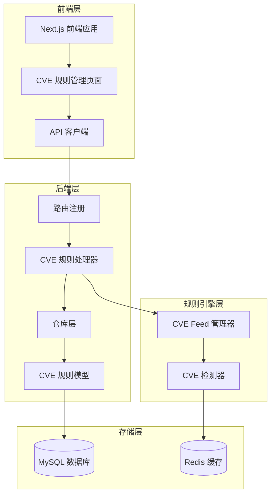
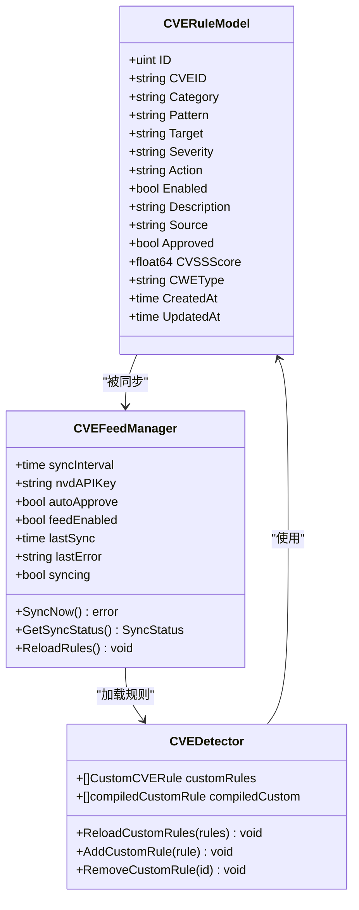
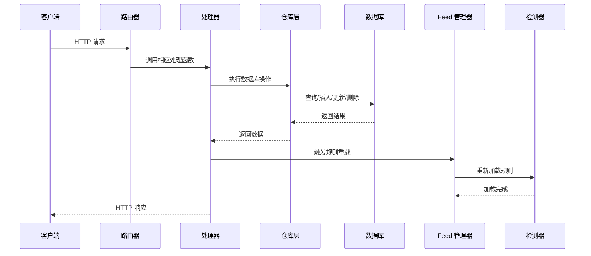
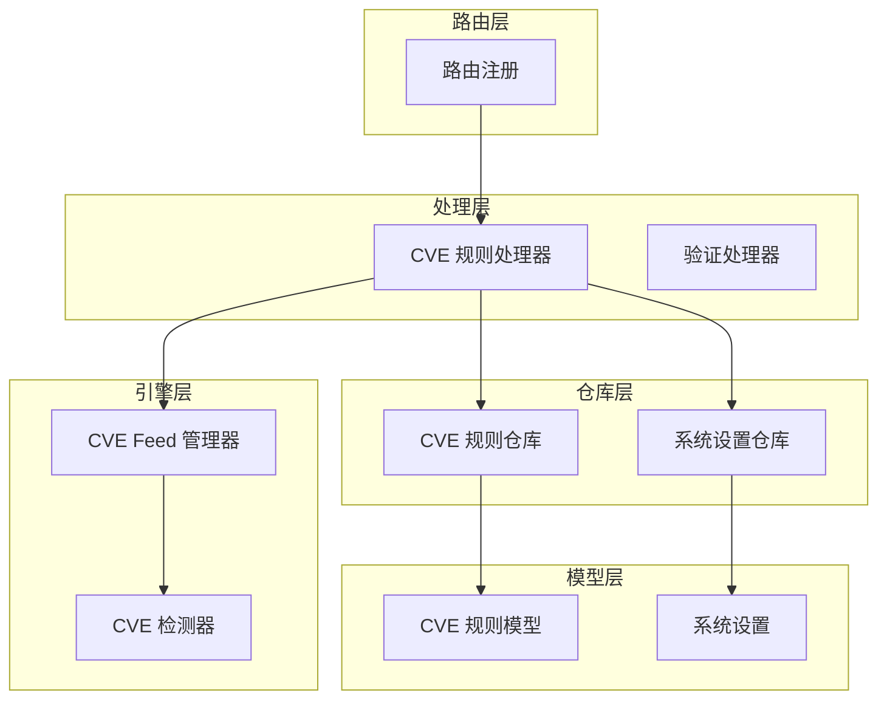
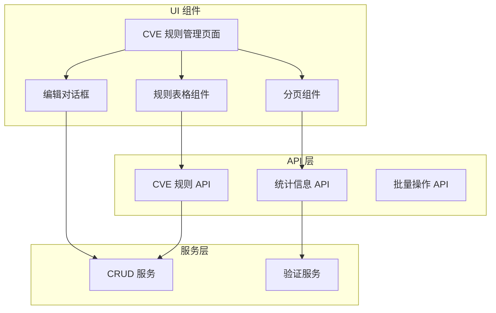

# CVE 规则管理 API

> [返回 管理 API 系统](管理 API 系统.md)

<cite>
**本文引用的文件**
- [cve.go](file://internal/admin/detect/cve.go)
- [cve_rules.go](file://internal/admin/detect/cve_rules.go)
- [router.go](file://internal/admin/router.go)
- [cve_rule.go](file://internal/store/repository/cve_rule.go)
- [cve.go](file://internal/store/cve.go)
- [feed.go](file://internal/waf/cve/feed.go)
- [helpers.go](file://internal/admin/shared/helpers.go)
- [page.tsx](file://frontend/app/(dashboard)/rules/cve/page.tsx)
- [rules-api.ts](file://frontend/lib/rules-api.ts)
- [phases.go](file://internal/core/rules/phases.go)
- [detector.go](file://internal/waf/cve/detector.go)
</cite>

## 目录
1. [简介](#简介)
2. [项目结构](#项目结构)
3. [核心组件](#核心组件)
4. [架构概览](#架构概览)
5. [详细组件分析](#详细组件分析)
6. [依赖关系分析](#依赖关系分析)
7. [性能考虑](#性能考虑)
8. [故障排除指南](#故障排除指南)
9. [结论](#结论)
10. [附录](#附录)

## 简介

CVE 规则管理 API 是 OpenWAF 项目中用于管理 CVE（Common Vulnerabilities and Exposures）检测规则的核心接口系统。该 API 提供了完整的 CRUD（创建、读取、更新、删除）操作，支持规则启用/禁用、手动同步和状态查询等功能。

OpenWAF 通过自动化的 CVE 数据同步机制，从 NVD（美国国家漏洞数据库）和 GitHub Advisory 等权威来源获取最新的漏洞信息，并将其转换为可执行的检测规则。同时，系统还支持用户自定义规则的创建和管理，为不同类型的 Web 应用程序提供针对性的安全防护。

## 项目结构

CVE 规则管理 API 采用分层架构设计，涵盖前端界面、后端处理、数据存储和规则引擎等多个层面：



**图表来源**
- [router.go:46-200](file://internal/admin/router.go#L46-L200)
- [cve.go:16-75](file://internal/admin/detect/cve.go#L16-L75)
- [cve_rule.go:10-66](file://internal/store/repository/cve_rule.go#L10-L66)

**章节来源**
- [router.go:46-200](file://internal/admin/router.go#L46-L200)
- [cve.go:16-75](file://internal/admin/detect/cve.go#L16-L75)

## 核心组件

### CVE 规则数据模型

CVE 规则模型定义了规则的基本属性和行为，支持多种检测目标和处理动作：



**图表来源**
- [cve.go:32-50](file://internal/waf/cve/feed.go#L32-L50)
- [cve.go:16-50](file://internal/waf/cve/feed.go#L16-L50)
- [cve.go:452-496](file://internal/waf/cve/detector.go#L452-L496)

### 规则来源和分类

系统支持两种主要的 CVE 规则来源：

1. **官方规则（自动同步）**：从 NVD 和 GitHub Advisory 获取的权威漏洞数据
2. **自定义规则（手动创建）**：用户根据特定需求创建的定制化规则

规则分类包括：
- general：通用漏洞检测
- java：Java 应用漏洞检测
- node：Node.js 应用漏洞检测  
- php：PHP 应用漏洞检测

**章节来源**
- [cve.go:462-491](file://internal/waf/cve/feed.go#L462-L491)
- [cve_rule.go:9-27](file://internal/store/cve.go#L9-L27)

## 架构概览

CVE 规则管理 API 遵循 RESTful 架构模式，实现了完整的请求-处理-响应流程：



**图表来源**
- [router.go:128-193](file://internal/admin/router.go#L128-L193)
- [cve.go:16-75](file://internal/admin/detect/cve.go#L16-L75)
- [helpers.go:73-78](file://internal/admin/shared/helpers.go#L73-L78)

## 详细组件分析

### 规则 CRUD 操作

#### 规则列表查询

**端点规范**
- 方法：GET
- 路径：`/api/v1/cve-rules`
- 权限：admin, operator, readonly

**查询参数**
| 参数名 | 类型 | 必填 | 描述 | 默认值 |
|--------|------|------|------|--------|
| page | int | 否 | 页码 | 1 |
| page_size | int | 否 | 页面大小 | 20 |
| category | string | 否 | 规则分类 | - |
| severity | string | 否 | 严重等级 | - |
| enabled | string | 否 | 启用状态 | - |
| source | string | 否 | 规则来源 | - |

**响应格式**
```json
{
  "items": [
    {
      "id": 1,
      "cve_id": "CVE-2024-XXXX",
      "category": "general",
      "pattern": "(?i)(union.*select)",
      "target": "all",
      "severity": "high",
      "action": "drop",
      "enabled": true,
      "description": "SQL 注入检测规则",
      "source": "nvd",
      "approved": true,
      "cvss_score": 9.0,
      "cwe_type": "CWE-89"
    }
  ],
  "total": 150
}
```

#### 规则详情查询

**端点规范**
- 方法：GET  
- 路径：`/api/v1/cve-rules/:id`
- 权限：admin, operator, readonly

**响应格式**
成功时返回完整的 CVE 规则对象，包含所有字段信息。

#### 创建规则

**端点规范**
- 方法：POST
- 路径：`/api/v1/cve-rules`
- 权限：admin, operator

**请求体参数**
| 字段名 | 类型 | 必填 | 描述 | 默认值 |
|--------|------|------|------|--------|
| cve_id | string | 否 | CVE 编号 | - |
| category | string | 是 | 规则分类 | - |
| pattern | string | 是 | 正则表达式模式 | - |
| target | string | 是 | 检测目标 | - |
| severity | string | 是 | 严重等级 | - |
| action | string | 是 | 处理动作 | - |
| description | string | 否 | 规则描述 | - |
| enabled | bool | 否 | 启用状态 | false |
| approved | bool | 否 | 审批状态 | true |
| cvss_score | float | 否 | CVSS 评分 | 0 |
| cwe_type | string | 否 | CWE 类型 | - |

**规则验证机制**
1. **正则表达式验证**：使用 Go 标准库 `regexp.Compile` 验证模式有效性
2. **动作规范化**：通过 `ValidateRuleAction` 函数标准化处理动作
3. **字段完整性**：确保必需字段的完整性和有效性

#### 更新规则

**端点规范**
- 方法：POST
- 路径：`/api/v1/cve-rules/:id/update`
- 权限：admin, operator

**请求体参数**
支持部分字段更新，包括：
- cve_id：CVE 编号
- category：规则分类  
- pattern：正则表达式模式
- target：检测目标
- severity：严重等级
- action：处理动作
- description：规则描述
- enabled：启用状态
- approved：审批状态

#### 删除规则

**端点规范**
- 方法：POST
- 路径：`/api/v1/cve-rules/:id/delete`
- 权限：admin, operator

**删除限制**
- 仅允许删除自定义创建的规则
- 官方同步规则无法直接删除

**章节来源**
- [cve.go:16-75](file://internal/admin/detect/cve.go#L16-L75)
- [cve.go:77-142](file://internal/admin/detect/cve.go#L77-L142)
- [cve.go:144-171](file://internal/admin/detect/cve.go#L144-L171)

### 规则启用/禁用和批量操作

#### 单个规则切换

**端点规范**
- 方法：POST
- 路径：`/api/v1/cve-rules/:id/toggle`
- 权限：admin, operator

**请求体参数**
```json
{
  "enabled": true
}
```

当启用规则时，系统会自动设置 `approved` 为 true。

#### 批量操作

**端点规范**
- 方法：POST  
- 路径：`/api/v1/cve-rules/batch`
- 权限：admin, operator

**请求体参数**
```json
{
  "ids": [1, 2, 3],
  "enabled": true,
  "action": "intercept"
}
```

**章节来源**
- [cve.go:173-213](file://internal/admin/detect/cve.go#L173-L213)
- [cve_rules.go:95-140](file://internal/admin/detect/cve_rules.go#L95-L140)

### 手动同步和状态查询

#### 手动同步 CVE 数据

**端点规范**
- 方法：POST
- 路径：`/api/v1/cve-rules/sync`
- 权限：admin, operator

**同步流程**
1. 检查 Feed 管理器可用性
2. 调用 `SyncNow()` 方法执行同步
3. 从 NVD 和 GitHub Advisory 获取最新数据
4. 自动批准新规则并加载到检测器

#### 同步状态查询

**端点规范**
- 方法：GET
- 路径：`/api/v1/cve-feed/status`
- 权限：admin, operator, readonly

**响应格式**
```json
{
  "last_sync": "2024-01-01T12:00:00Z",
  "last_error": "",
  "syncing": false,
  "pending_review": 5
}
```

**状态字段说明**
- last_sync：上次同步时间
- last_error：最后错误信息
- syncing：当前是否正在同步
- pending_review：待审批规则数量

**章节来源**
- [cve.go:215-251](file://internal/admin/detect/cve.go#L215-L251)

### 规则统计和监控

#### 规则统计信息

**端点规范**
- 方法：GET
- 路径：`/api/v1/cve-rules/stats`
- 权限：admin, operator, readonly

**统计内容**
- 总规则数
- 各严重等级规则分布
- 各分类规则分布
- 已启用/禁用规则数量

**响应格式**
```json
{
  "total": 150,
  "by_severity": {
    "critical": 10,
    "high": 35,
    "medium": 60,
    "low": 45
  },
  "by_category": {
    "general": 80,
    "java": 25,
    "node": 20,
    "php": 25
  },
  "enabled_count": 120,
  "disabled_count": 30
}
```

**章节来源**
- [cve_rules.go:60-93](file://internal/admin/detect/cve_rules.go#L60-L93)

## 依赖关系分析

### 后端依赖关系



**图表来源**
- [router.go:128-193](file://internal/admin/router.go#L128-L193)
- [cve.go:16-75](file://internal/admin/detect/cve.go#L16-L75)
- [cve_rule.go:10-66](file://internal/store/repository/cve_rule.go#L10-L66)

### 前端依赖关系



**图表来源**
- [page.tsx:50-315](file://frontend/app/(dashboard)/rules/cve/page.tsx#L50-L315)
- [rules-api.ts:156-172](file://frontend/lib/rules-api.ts#L156-L172)

**章节来源**
- [router.go:128-193](file://internal/admin/router.go#L128-L193)
- [page.tsx:50-315](file://frontend/app/(dashboard)/rules/cve/page.tsx#L50-L315)

## 性能考虑

### 数据库优化策略

1. **索引优化**
   - 在 `cve_rules` 表上建立适当的索引以支持高频查询
   - 优化分页查询的性能表现

2. **查询优化**
   - 使用 LIMIT 和 OFFSET 实现高效分页
   - 避免 N+1 查询问题
   - 实施查询缓存机制

3. **连接池管理**
   - 合理配置数据库连接池大小
   - 避免长时间持有数据库连接

### 规则引擎性能

1. **规则编译缓存**
   - 编译后的正则表达式缓存到检测器
   - 避免重复编译相同模式

2. **并发处理**
   - 多线程安全的规则加载机制
   - 避免规则切换时的性能瓶颈

3. **内存管理**
   - 及时清理不再使用的规则缓存
   - 监控内存使用情况

## 故障排除指南

### 常见错误及解决方案

| 错误类型 | HTTP 状态码 | 可能原因 | 解决方案 |
|----------|-------------|----------|----------|
| 参数错误 | 400 | 无效的 ID 格式或 JSON 格式错误 | 验证输入格式，检查必需字段 |
| 资源不存在 | 404 | 规则 ID 不存在 | 确认规则存在性，检查权限 |
| 权限不足 | 403 | RBAC 权限不足 | 检查用户角色，申请相应权限 |
| 会话过期 | 401 | 访问令牌过期 | 刷新访问令牌或重新登录 |
| 服务器错误 | 500 | 数据库连接失败或业务逻辑错误 | 检查服务器日志，重试操作 |
| 正则表达式错误 | 400 | 无效的正则表达式模式 | 使用有效的正则表达式语法 |

### 调试技巧

1. **日志分析**
   ```bash
   # 查看后端服务日志
   docker logs -f openwaf-backend
   
   # 查看前端应用日志  
   docker logs -f openwaf-frontend
   ```

2. **API 测试**
   ```bash
   # 测试规则创建
   curl -X POST http://localhost:8080/api/v1/cve-rules \
     -H "Content-Type: application/json" \
     -H "Authorization: Bearer YOUR_ACCESS_TOKEN" \
     -d '{
       "category": "general",
       "pattern": "(?i)(union.*select)",
       "target": "all",
       "severity": "high",
       "action": "drop",
       "description": "SQL 注入检测"
     }'
   ```

3. **数据库检查**
   ```sql
   -- 检查规则表结构
   DESCRIBE cve_rules;
   
   -- 查询最新创建的规则
   SELECT * FROM cve_rules ORDER BY id DESC LIMIT 10;
   ```

### 规则验证最佳实践

1. **正则表达式测试**
   - 在生产环境部署前进行充分的正则表达式测试
   - 使用边界案例验证模式的有效性

2. **性能影响评估**
   - 评估复杂正则表达式的执行性能
   - 避免过于复杂的模式导致性能问题

3. **规则审核流程**
   - 建立规则变更的审核机制
   - 确保规则变更的可追溯性

**章节来源**
- [cve.go:49-55](file://internal/admin/detect/cve.go#L49-L55)
- [cve.go:97-103](file://internal/admin/detect/cve.go#L97-L103)

## 结论

CVE 规则管理 API 提供了完整的漏洞规则生命周期管理能力，包括自动化同步、手动创建、批量操作和实时监控等功能。系统通过分层架构设计实现了良好的可维护性和扩展性，支持多种规则来源和分类，能够满足不同应用场景的安全防护需求。

通过完善的错误处理机制和性能优化策略，该 API 能够在高并发环境下稳定运行，为 Web 应用程序提供可靠的 CVE 漏洞防护能力。建议在实际部署中结合具体的业务场景，制定相应的规则管理策略和监控方案。

## 附录

### API 端点完整清单

| HTTP 方法 | 路径 | 功能描述 | 权限要求 |
|-----------|------|----------|----------|
| GET | /api/v1/cve-rules | 获取 CVE 规则列表 | admin, operator, readonly |
| GET | /api/v1/cve-rules/:id | 获取单个规则详情 | admin, operator, readonly |
| POST | /api/v1/cve-rules | 创建新规则 | admin, operator |
| POST | /api/v1/cve-rules/:id/update | 更新规则 | admin, operator |
| POST | /api/v1/cve-rules/:id/delete | 删除规则 | admin, operator |
| POST | /api/v1/cve-rules/:id/toggle | 切换规则启用状态 | admin, operator |
| POST | /api/v1/cve-rules/batch | 批量操作规则 | admin, operator |
| POST | /api/v1/cve-rules/sync | 手动同步 CVE 数据 | admin, operator |
| GET | /api/v1/cve-feed/status | 获取同步状态 | admin, operator, readonly |
| GET | /api/v1/cve-rules/stats | 获取规则统计信息 | admin, operator, readonly |

### 规则验证规则

1. **正则表达式格式**
   - 必须使用有效的 Go 正则表达式语法
   - 不支持的模式将导致验证失败

2. **动作类型验证**
   - 支持的动作类型：drop、intercept、observe、rate_limit
   - 自定义动作需要符合系统规范

3. **字段约束**
   - 必需字段：category、pattern、target、severity、action
   - 数值字段：cvss_score 必须为有效数字
   - 字符串字段：长度限制和字符集约束

### 前端组件集成

前端 CVE 规则管理页面提供了完整的用户交互体验，包括：
- 实时规则列表展示
- 多维度筛选和搜索
- 批量操作功能
- 实时统计信息显示
- 规则编辑对话框

**章节来源**
- [router.go:287-287](file://docs/管理 API 系统/REST API 设计规范/路由设计规范.md#L287-L287)
- [page.tsx:50-315](file://frontend/app/(dashboard)/rules/cve/page.tsx#L50-L315)
- [rules-api.ts:156-172](file://frontend/lib/rules-api.ts#L156-L172)