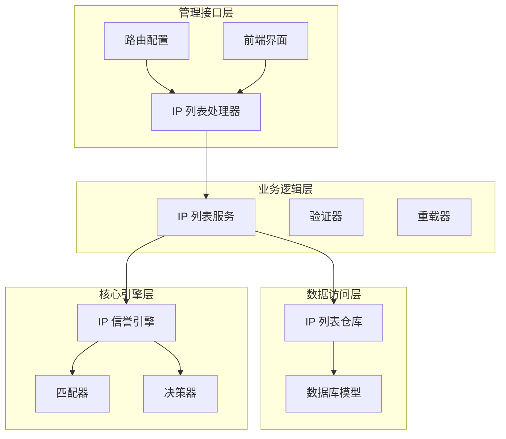
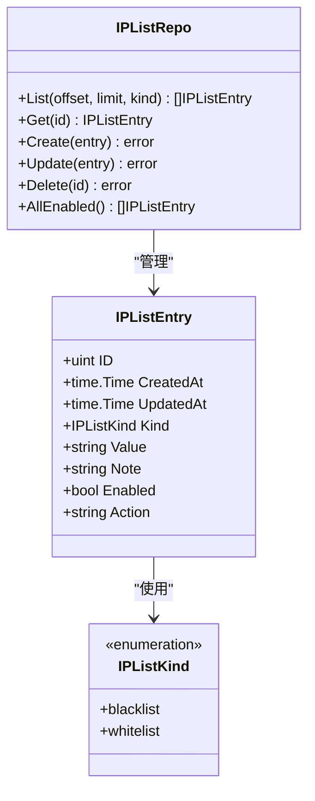
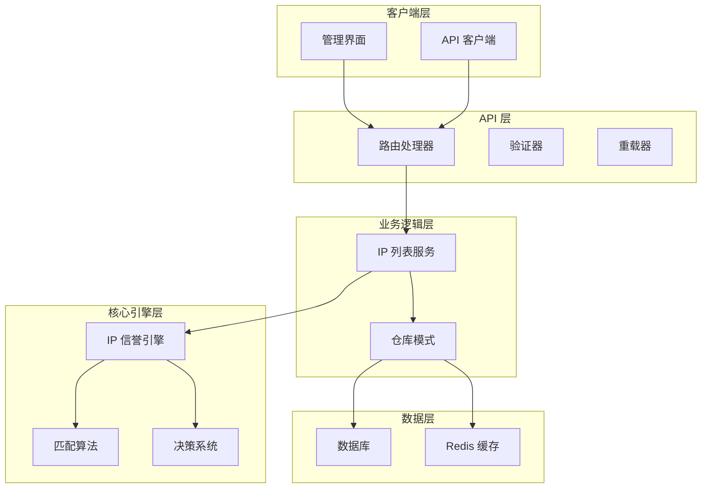
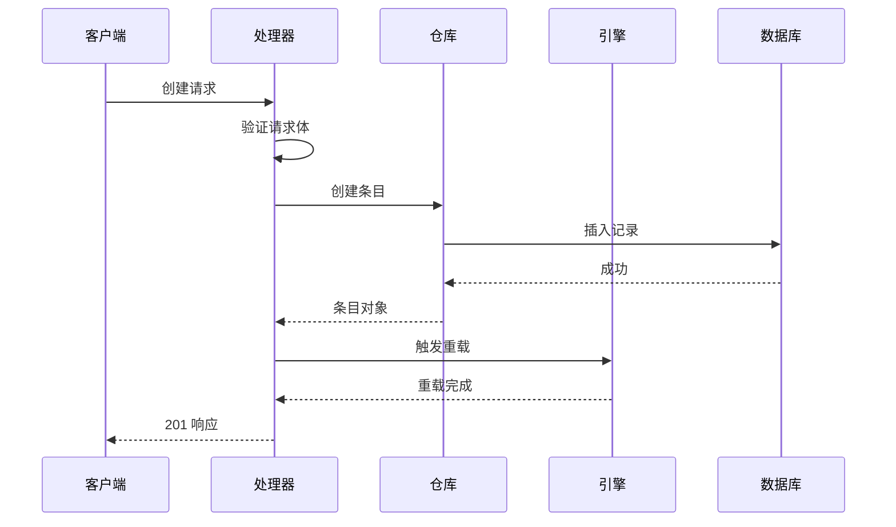
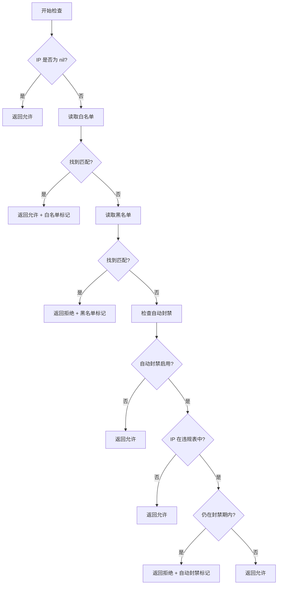
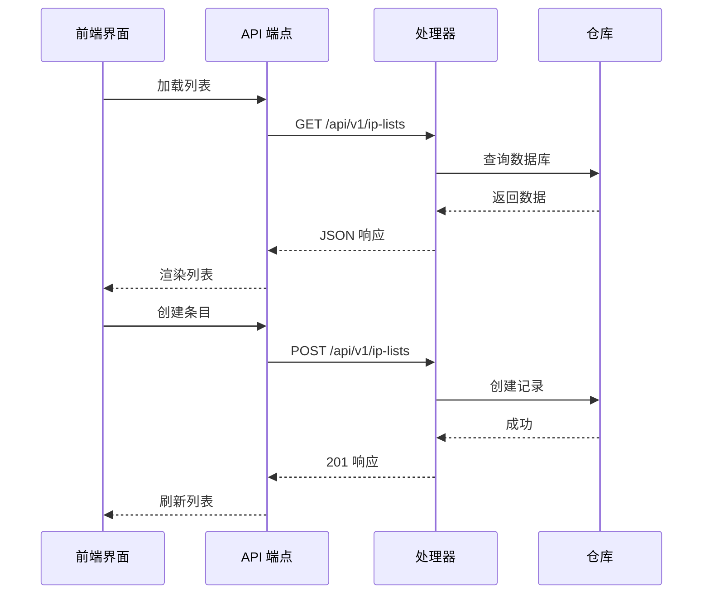
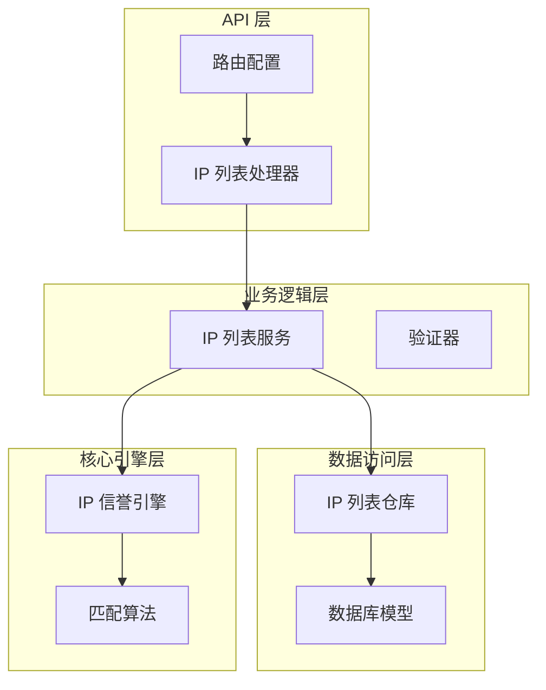

# IP 黑白名单管理 API

<cite>
**本文档引用的文件**
- [internal/admin/system/iplist.go](file://internal/admin/system/iplist.go)
- [internal/store/ip_list.go](file://internal/store/ip_list.go)
- [internal/store/repository/ip_list.go](file://internal/store/repository/ip_list.go)
- [internal/admin/router.go](file://internal/admin/router.go)
- [docs/管理 API 系统/REST API 设计规范/API 端点参考.md](file://docs/管理 API 系统/REST API 设计规范/API 端点参考.md)
- [internal/waf/iprep/iprep.go](file://internal/waf/iprep/iprep.go)
- [docs/WAF 引擎系统/处理阶段详解/IP 信誉检查阶段.md](file://docs/WAF 引擎系统/处理阶段详解/IP 信誉检查阶段.md)
- [docs/安全防护功能/IP 信誉系统.md](file://docs/安全防护功能/IP 信誉系统.md)
- [frontend/app/(dashboard)/ip-lists/page.tsx](file://frontend/app/(dashboard)/ip-lists/page.tsx)
</cite>

## 目录
1. [简介](#简介)
2. [项目结构](#项目结构)
3. [核心组件](#核心组件)
4. [架构概览](#架构概览)
5. [详细组件分析](#详细组件分析)
6. [依赖关系分析](#依赖关系分析)
7. [性能考虑](#性能考虑)
8. [故障排除指南](#故障排除指南)
9. [结论](#结论)
10. [附录](#附录)

## 简介

IP 黑白名单管理 API 是 OpenWAF 的核心安全组件，负责管理 IP 地址和 CIDR 网段的访问控制。该系统提供完整的 CRUD 操作，支持白名单优先级处理、黑名单阻断机制，以及智能的自动封禁功能。

系统的主要功能包括：
- IP 地址和 CIDR 网段的精确匹配
- 白名单优先级处理（允许通行）
- 黑名单阻断处理（拒绝访问）
- 基于违规次数的自动封禁机制
- 支持 IPv4 和 IPv6 双栈协议
- 实时配置热重载

## 项目结构

IP 黑白名单管理 API 在项目中的组织结构如下：



**图表来源**
- [internal/admin/system/iplist.go:15-146](file://internal/admin/system/iplist.go#L15-L146)
- [internal/admin/router.go:100-270](file://internal/admin/router.go#L100-L270)

**章节来源**
- [internal/admin/system/iplist.go:15-146](file://internal/admin/system/iplist.go#L15-L146)
- [internal/admin/router.go:100-270](file://internal/admin/router.go#L100-L270)

## 核心组件

### IP 列表数据模型

IPListEntry 是系统的核心数据结构，用于表示单个 IP 或 CIDR 条目：



**图表来源**
- [internal/store/ip_list.go:16-28](file://internal/store/ip_list.go#L16-L28)
- [internal/store/repository/ip_list.go:9-42](file://internal/store/repository/ip_list.go#L9-L42)

系统支持以下关键特性：
- **CIDR 支持**：通过 Value 字段支持网段匹配
- **单 IP 支持**：支持精确 IP 匹配  
- **注释功能**：Note 字段提供描述信息
- **启用状态**：Enabled 字段控制条目有效性
- **动作配置**：Action 字段支持拦截或丢弃

**章节来源**
- [internal/store/ip_list.go:16-28](file://internal/store/ip_list.go#L16-L28)
- [internal/store/repository/ip_list.go:13-42](file://internal/store/repository/ip_list.go#L13-L42)

### API 端点设计

系统提供完整的 REST API 端点，支持所有 CRUD 操作：

| 操作 | 方法 | 路径 | 权限 | 描述 |
|------|------|------|------|------|
| 列表 | GET | /api/v1/ip-lists | readonly | 获取 IP 列表，支持分页和过滤 |
| 详情 | GET | /api/v1/ip-lists/:id | readonly | 获取单个 IP 条目详情 |
| 创建 | POST | /api/v1/ip-lists | operator | 创建新的 IP 条目 |
| 更新 | POST | /api/v1/ip-lists/:id/update | operator | 更新现有 IP 条目 |
| 删除 | POST | /api/v1/ip-lists/:id/delete | operator | 删除 IP 条目 |

**章节来源**
- [docs/管理 API 系统/REST API 设计规范/API 端点参考.md:441-482](file://docs/管理 API 系统/REST API 设计规范/API 端点参考.md#L441-L482)
- [internal/admin/router.go:182-184](file://internal/admin/router.go#L182-L184)

## 架构概览

IP 黑白名单管理 API 在整个 WAF 架构中的位置：



**图表来源**
- [internal/admin/router.go:100-270](file://internal/admin/router.go#L100-L270)
- [internal/admin/system/iplist.go:15-146](file://internal/admin/system/iplist.go#L15-L146)

**章节来源**
- [internal/admin/router.go:100-270](file://internal/admin/router.go#L100-L270)
- [internal/admin/system/iplist.go:15-146](file://internal/admin/system/iplist.go#L15-L146)

## 详细组件分析

### IP 列表处理器

IP 列表处理器实现了完整的 CRUD 操作，每个操作都包含适当的验证和错误处理：



**图表来源**
- [internal/admin/system/iplist.go:47-78](file://internal/admin/system/iplist.go#L47-L78)

#### 验证机制

处理器实现了多层次的验证机制：

1. **类型验证**：确保 Kind 字段只能是 "blacklist" 或 "whitelist"
2. **值验证**：确保 Value 字段非空
3. **动作标准化**：将用户输入的动作标准化为 "intercept" 或 "drop"
4. **ID 验证**：使用 ParseUintParam 验证资源 ID

**章节来源**
- [internal/admin/system/iplist.go:47-126](file://internal/admin/system/iplist.go#L47-L126)

### IP 信誉引擎集成

IP 列表数据被 IP 信誉引擎用于实际的访问控制决策：



**图表来源**
- [internal/waf/iprep/iprep.go:94-125](file://internal/waf/iprep/iprep.go#L94-L125)

**章节来源**
- [internal/waf/iprep/iprep.go:94-125](file://internal/waf/iprep/iprep.go#L94-L125)

### 前端集成

前端界面提供了完整的 IP 黑白名单管理功能：



**图表来源**
- [frontend/app/(dashboard)/ip-lists/page.tsx:62-160](file://frontend/app/(dashboard)/ip-lists/page.tsx#L62-L160)

**章节来源**
- [frontend/app/(dashboard)/ip-lists/page.tsx:62-160](file://frontend/app/(dashboard)/ip-lists/page.tsx#L62-L160)

## 依赖关系分析

### 组件耦合度



**图表来源**
- [internal/admin/system/iplist.go:15-146](file://internal/admin/system/iplist.go#L15-L146)
- [internal/store/repository/ip_list.go:9-42](file://internal/store/repository/ip_list.go#L9-L42)

### 外部依赖

系统对外部组件的依赖关系：
- **net 包**：网络地址解析和 CIDR 操作
- **gorm**：数据库 ORM 映射
- **hertz**：Web 框架
- **sync**：并发安全的数据结构

**章节来源**
- [internal/admin/system/iplist.go:3-13](file://internal/admin/system/iplist.go#L3-L13)
- [internal/store/ip_list.go:3-7](file://internal/store/ip_list.go#L3-L7)

## 性能考虑

### 时间复杂度分析

- **IP 匹配操作**：O(n) - 需要遍历黑白名单数组
- **自动封禁检查**：O(1) - 使用 sync.Map 进行快速查找
- **内存清理**：O(m) - m 为当前活跃违规记录数量

### 内存使用优化

1. **懒加载机制**：违规记录仅在需要时创建
2. **智能清理**：定期清理过期记录，防止内存泄漏
3. **原子操作**：使用原子类型减少锁竞争
4. **并发安全**：使用 RWMutex 实现读写分离

**章节来源**
- [docs/安全防护功能/IP 信誉系统.md:397-420](file://docs/安全防护功能/IP 信誉系统.md#L397-L420)

## 故障排除指南

### 常见问题诊断

#### 1. IP 匹配不生效

**可能原因**：
- IP 地址格式错误
- CIDR 范围配置不当
- 过期条目被忽略

**解决方法**：
- 使用 `ParseIPListEntry` 函数验证格式
- 检查 `ExpireAt` 字段是否正确设置
- 确认 IP 地址与目标网络匹配

#### 2. 自动封禁不工作

**可能原因**：
- 自动封禁功能未启用
- 配置参数设置不当
- 违规计数器异常

**解决方法**：
- 检查 `ConfigureAutoBan` 方法调用
- 验证阈值、窗口和持续时间设置
- 查看 `ActiveBans()` 方法输出

#### 3. 内存泄漏问题

**症状**：系统运行时间越长，内存占用越大

**解决方法**：
- 检查清理器是否正常运行
- 验证过期时间设置是否合理
- 监控 `ActiveBans()` 输出确认记录清理

**章节来源**
- [docs/安全防护功能/IP 信誉系统.md:420-460](file://docs/安全防护功能/IP 信誉系统.md#L420-L460)

## 结论

IP 黑白名单管理 API 通过精心设计的架构和算法，提供了高效、可靠的 IP 地址管理能力。系统的主要优势包括：

1. **多层决策机制**：白名单优先、黑名单阻断、自动封禁的三层防护
2. **灵活的配置选项**：支持多种 IP 地址格式和动态配置更新
3. **智能内存管理**：自动清理过期记录，防止内存泄漏
4. **高并发性能**：采用原子操作和并发安全的数据结构
5. **完整的生命周期管理**：从创建到销毁的完整管理流程

该系统为 OpenWAF 提供了坚实的安全基础，能够有效应对各种网络威胁和攻击场景。

## 附录

### API 使用示例

#### 基本使用流程

```go
// 创建 IP 信誉实例
rep := NewIPReputation()
defer rep.Close()

// 配置自动封禁
rep.ConfigureAutoBan(true, 10, 60, 3600)

// 设置黑白名单
rep.SetLists(blacklist, whitelist)

// 检查 IP
decision := rep.Check(clientIP)
if !decision.Allowed {
    // 处理拒绝逻辑
}
```

#### 配置管理

```go
// 通过 API 管理 IP 列表
repo := NewIPListRepo(db)
entries, total, err := repo.List(offset, limit, kind)
```

### 最佳实践

#### 自动封禁配置建议

| 使用场景 | 阈值 | 窗口(秒) | 持续时间(秒) | 说明 |
|----------|------|----------|--------------|------|
| 开发环境 | 3-5 | 60 | 300 | 快速响应，便于测试 |
| 生产环境 | 10-20 | 60-120 | 3600-7200 | 平衡安全性和用户体验 |
| 高风险环境 | 5-10 | 30-60 | 7200-14400 | 更严格的防护策略 |

#### IP 地址管理建议

1. **白名单配置**：
   - 仅包含受信任的源 IP
   - 使用最小权限原则
   - 定期审查和更新

2. **黑名单配置**：
   - 基于威胁情报更新
   - 包含已知恶意 IP 和网段
   - 设置合理的过期时间

3. **CIDR 使用建议**：
   - 优先使用更精确的网段
   - 避免使用过于宽泛的网段
   - 定期优化网段范围

**章节来源**
- [docs/安全防护功能/IP 信誉系统.md:475-537](file://docs/安全防护功能/IP 信誉系统.md#L475-L537)