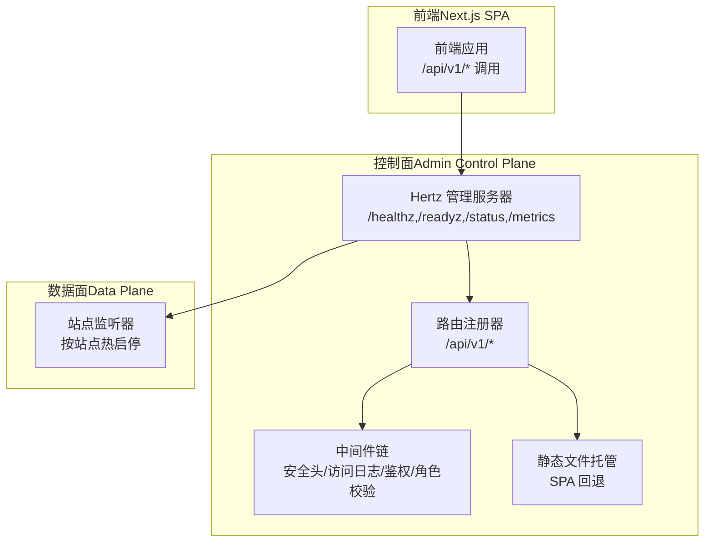
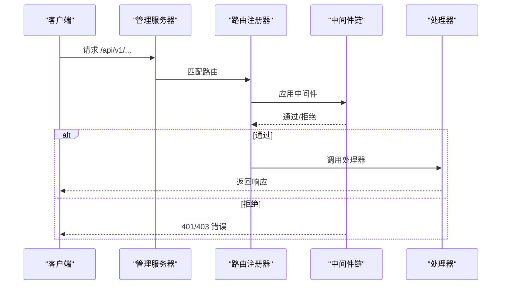
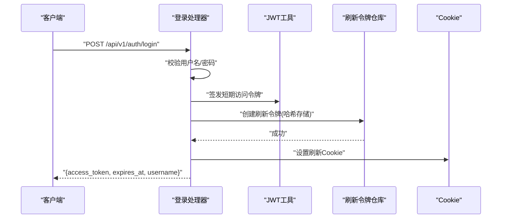
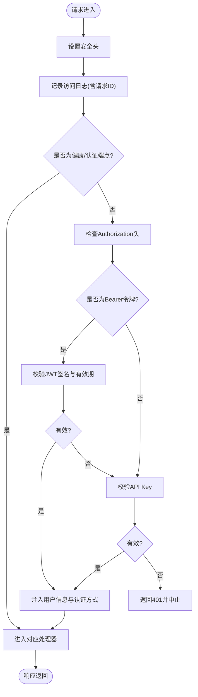
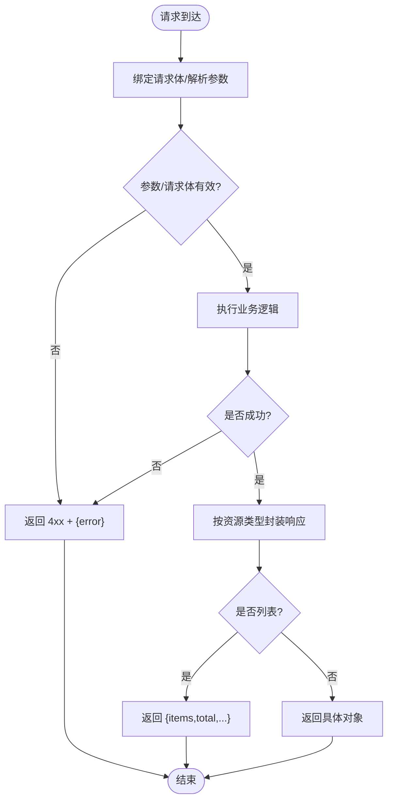
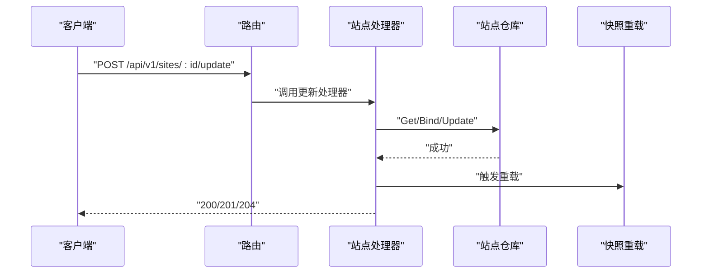
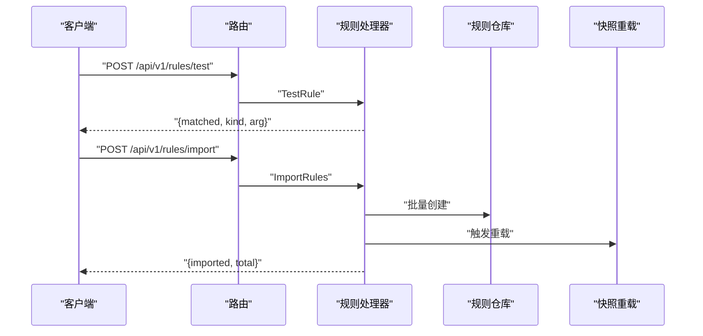
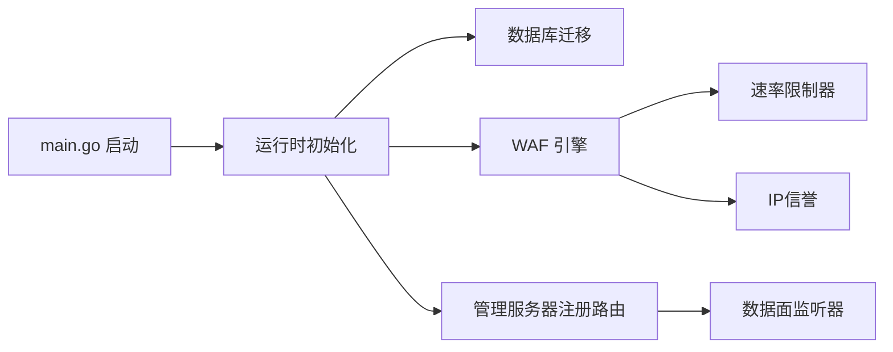

# API 端点参考

> [返回 管理 API 系统](../管理 API 系统.md)

<cite>
**本文引用的文件**
- [路由设计规范.md](file://docs/管理 API 系统/REST API 设计规范/路由设计规范.md)
- [请求响应格式规范.md](file://docs/管理 API 系统/REST API 设计规范/请求响应格式规范.md)
- [认证授权机制.md](file://docs/管理 API 系统/REST API 设计规范/认证授权机制.md)
- [管理 API 系统.md](file://docs/管理 API 系统/管理 API 系统.md)
- [规则管理 API.md](file://docs/管理 API 系统/规则管理 API/规则 CRUD 操作.md)
- [站点管理 API.md](file://docs/管理 API 系统/站点管理 API.md)
- [系统设置 API.md](file://docs/管理 API 系统/系统设置 API.md)
- [安全事件 API.md](file://docs/管理 API 系统/安全事件 API.md)
- [证书管理 API.md](file://docs/管理 API 系统/证书管理 API.md)
- [策略管理 API.md](file://docs/管理 API 系统/策略管理 API.md)
</cite>

## 目录
1. [简介](#简介)
2. [项目结构](#项目结构)
3. [核心组件](#核心组件)
4. [架构总览](#架构总览)
5. [详细组件分析](#详细组件分析)
6. [依赖关系分析](#依赖关系分析)
7. [性能考量](#性能考量)
8. [故障排查指南](#故障排查指南)
9. [结论](#结论)
10. [附录](#附录)

## 简介
本文件为 My-OpenWaf 管理 API 的完整端点参考，覆盖所有 REST API 的 HTTP 方法、URL 模式、请求参数、响应格式与错误码。文档基于实际代码实现，确保规范与实现一致，适用于开发者与运维人员进行集成与排错。

## 项目结构
后端采用 Hertz 框架，控制面（管理 API）与数据面（业务监听）分离部署。控制面负责认证、授权、系统设置、规则管理等；数据面负责业务流量防护与转发。前端通过 Next.js 构建，采用 SPA 模式，静态资源由后端统一托管。

**图表来源**
- [路由设计规范.md:38-57](file://docs/管理 API 系统/REST API 设计规范/路由设计规范.md#L38-L57)
- [路由设计规范.md:223-232](file://docs/管理 API 系统/REST API 设计规范/路由设计规范.md#L223-L232)

**章节来源**
- [路由设计规范.md:32-57](file://docs/管理 API 系统/REST API 设计规范/路由设计规范.md#L32-L57)
- [管理 API 系统.md:42-53](file://docs/管理 API 系统/管理 API 系统.md#L42-L53)

## 核心组件
- 版本控制：统一使用 `/api/v1` 前缀，便于未来版本演进与兼容性管理。
- 资源命名：采用复数名词（如 `/sites`, `/rules`, `/settings`），路径参数使用 `:id` 表示单个资源。
- 路由注册：在控制面 Hertz 实例上注册健康检查、认证、受控 API 分组、静态文件回退。
- 中间件：全局安全头设置、访问日志、认证（支持 Bearer JWT 与 API Key）、角色权限校验。
- 静态文件：SPA 回退逻辑，区分 API 与静态资源，避免 API 路径误返回静态内容。

**章节来源**
- [路由设计规范.md:67-77](file://docs/管理 API 系统/REST API 设计规范/路由设计规范.md#L67-L77)
- [路由设计规范.md:107-114](file://docs/管理 API 系统/REST API 设计规范/路由设计规范.md#L107-L114)

## 架构总览
控制面路由组织遵循"健康检查 + 认证 + 受控 API 分组 + 静态文件回退"的模式。API 分组内部按角色细分为只读、操作员、管理员三类权限组，确保最小权限原则。

**图表来源**
- [路由设计规范.md:82-99](file://docs/管理 API 系统/REST API 设计规范/路由设计规范.md#L82-L99)
- [路由设计规范.md:132-144](file://docs/管理 API 系统/REST API 设计规范/路由设计规范.md#L132-L144)

## 详细组件分析

### 认证与授权机制
- 短期访问令牌：HS256 签名，15 分钟有效期，携带用户名声明，用于后续 API 调用的 Bearer 认证。
- 长期刷新令牌：随机生成 JTI 与原始令牌，仅存储哈希值，7 天有效期；刷新时撤销旧令牌并发放新令牌，同时更新 Cookie。
- 登录：验证账户密码，签发访问令牌与刷新令牌（Cookie），返回短期令牌与过期时间。
- 刷新：从 Cookie 中解析 JTI 与原始令牌，校验哈希，轮换并返回新的短期令牌。
- 登出：撤销当前刷新令牌，清除 Cookie。
- API 密钥：作为替代认证方式，直接通过仓库校验密钥有效性。

**图表来源**
- [认证授权机制.md:190-204](file://docs/管理 API 系统/REST API 设计规范/认证授权机制.md#L190-L204)
- [认证授权机制.md:245-257](file://docs/管理 API 系统/REST API 设计规范/认证授权机制.md#L245-L257)

**章节来源**
- [认证授权机制.md:182-213](file://docs/管理 API 系统/REST API 设计规范/认证授权机制.md#L182-L213)
- [认证授权机制.md:214-249](file://docs/管理 API 系统/REST API 设计规范/认证授权机制.md#L214-L249)

### 路由系统与中间件链
- 路由注册：控制面统一在 `/api/v1` 下注册，健康检查、认证相关端点无需鉴权；其余端点统一走认证中间件。
- 中间件链：
  - 安全头：设置 X-Content-Type-Options、X-Frame-Options、Referrer-Policy、Content-Security-Policy。
  - 访问日志：记录请求 ID、方法、路径、状态码、耗时与认证方式。
  - 认证中间件：跳过健康与认证端点；校验 Bearer 令牌优先于 API Key；通过后注入用户信息与认证方式。
- 前端静态资源：未命中 `/api/` 的路由回退到前端静态文件，实现 SPA 支持。

**图表来源**
- [路由设计规范.md:222-240](file://docs/管理 API 系统/REST API 设计规范/路由设计规范.md#L222-L240)
- [路由设计规范.md:132-144](file://docs/管理 API 系统/REST API 设计规范/路由设计规范.md#L132-L144)

**章节来源**
- [路由设计规范.md:214-248](file://docs/管理 API 系统/REST API 设计规范/路由设计规范.md#L214-L248)
- [路由设计规范.md:146-170](file://docs/管理 API 系统/REST API 设计规范/路由设计规范.md#L146-L170)

### 请求响应格式与错误处理
- 成功响应
  - 一般返回 200，携带业务数据对象或数组
  - 列表接口统一使用分页包装对象：{"items":[...],"total":n,...}
  - 创建资源返回 201；删除资源返回 204（无内容）
- 错误响应
  - 使用标准 HTTP 状态码映射错误语义
  - 错误响应体为 JSON 对象，包含 "error" 字段描述错误信息
  - 特殊场景：401 未授权（含刷新失败）、403 禁止访问、429 请求过快（暴力破解锁定）

**图表来源**
- [请求响应格式规范.md:158-173](file://docs/管理 API 系统/REST API 设计规范/请求响应格式规范.md#L158-L173)
- [请求响应格式规范.md:233-249](file://docs/管理 API 系统/REST API 设计规范/请求响应格式规范.md#L233-L249)

**章节来源**
- [请求响应格式规范.md:148-185](file://docs/管理 API 系统/REST API 设计规范/请求响应格式规范.md#L148-L185)
- [请求响应格式规范.md:257-261](file://docs/管理 API 系统/REST API 设计规范/请求响应格式规范.md#L257-L261)

### 站点管理 API
- 列表/详情：支持分页查询与单条获取。
- 创建/更新：绑定请求体，持久化后触发快照重载，使变更立即生效。
- 删除：删除后重载。
- 启动/停止：内存态标记站点运行状态（演示用途）。
- 状态查询：返回站点主机与运行状态。

**图表来源**
- [站点管理 API.md:257-270](file://docs/管理 API 系统/站点管理 API.md#L257-L270)
- [站点管理 API.md:146-159](file://docs/管理 API 系统/站点管理 API.md#L146-L159)

**章节来源**
- [站点管理 API.md:250-279](file://docs/管理 API 系统/站点管理 API.md#L250-L279)
- [站点管理 API.md:172-207](file://docs/管理 API 系统/站点管理 API.md#L172-L207)

### 规则管理 API
- 列表/详情：分页与单条。
- 创建/更新/删除：持久化后触发重载。
- 测试：对自定义模式进行即时匹配测试，不落库。
- 导入/导出：批量导入 JSON 数组，导出全量规则。

**图表来源**
- [规则管理 API.md:286-301](file://docs/管理 API 系统/规则管理 API/规则 CRUD 操作.md#L286-L301)
- [规则管理 API.md:176-246](file://docs/管理 API 系统/规则管理 API/规则 CRUD 操作.md#L176-L246)

**章节来源**
- [规则管理 API.md:294-316](file://docs/管理 API 系统/规则管理 API/规则 CRUD 操作.md#L294-L316)
- [规则管理 API.md:467-535](file://docs/管理 API 系统/规则管理 API/规则 CRUD 操作.md#L467-L535)

### 系统设置 API
- 系统设置：列出、按键获取、创建、设置、删除；修改后触发重载。
- API 密钥：列出、创建（返回明文一次性令牌）、删除。
- 快照重载：手动触发重载以应用最新配置。

**章节来源**
- [系统设置 API.md:138-155](file://docs/管理 API 系统/系统设置 API.md#L138-L155)
- [系统设置 API.md:177-202](file://docs/管理 API 系统/系统设置 API.md#L177-L202)

### 安全事件 API
- 列表：支持按动作、阶段、类别、客户端 IP、主机、路径、规则 ID、时间范围过滤。
- 统计：近 N 小时的分类统计、Top IP、Top 路径、Top 规则、总量。
- 时间线：按时间桶统计事件趋势。
- 详情：按 ID 获取事件。

**章节来源**
- [安全事件 API.md:161-197](file://docs/管理 API 系统/安全事件 API.md#L161-L197)
- [安全事件 API.md:228-266](file://docs/管理 API 系统/安全事件 API.md#L228-L266)

### 证书管理 API
- 列表/详情：分页与单条。
- 创建/更新：校验证书与私钥配对有效性后再持久化，失败返回错误。
- 删除：删除后重载。

**章节来源**
- [证书管理 API.md:126-134](file://docs/管理 API 系统/证书管理 API.md#L126-L134)
- [证书管理 API.md:169-173](file://docs/管理 API 系统/证书管理 API.md#L169-L173)

### 策略管理 API
- 列表/详情：分页与单条。
- 创建/更新/删除：持久化后触发重载。

**章节来源**
- [策略管理 API.md:155-161](file://docs/管理 API 系统/策略管理 API.md#L155-L161)
- [策略管理 API.md:195-200](file://docs/管理 API 系统/策略管理 API.md#L195-L200)

## 依赖关系分析
- 控制面启动：主程序启动后构建运行时、迁移数据库、初始化事件写入与归档、指标收集、WAF 引擎、速率限制器、IP 黑名单、配置同步与 Prometheus 指标。
- 路由注册：在管理服务器上注册健康检查、认证、受控 API 与静态文件回退。
- 数据面：按站点热启停，支持 TLS 终止与 SNI 证书。

**图表来源**
- [路由设计规范.md:233-236](file://docs/管理 API 系统/REST API 设计规范/路由设计规范.md#L233-L236)
- [管理 API 系统.md:218-232](file://docs/管理 API 系统/管理 API 系统.md#L218-L232)

**章节来源**
- [管理 API 系统.md:218-240](file://docs/管理 API 系统/管理 API 系统.md#L218-L240)
- [路由设计规范.md:218-232](file://docs/管理 API 系统/REST API 设计规范/路由设计规范.md#L218-L232)

## 性能考量
- 本地缓存：响应缓存（GET 安全请求）与快照缓存（进程内），减少重复计算与 IO。
- 速率限制：本地与 Redis 双栈滑动窗口限流，支持分布式部署。
- 配置漂移检测：站点监听器指纹校验，变更时自动重启，保证一致性。
- TLS 优化：按站点配置 TLS，支持 ALPN 与 SNI，降低握手开销。
- 前端静态资源：由后端统一托管，减少跨域与额外请求。

**章节来源**
- [路由设计规范.md:241-253](file://docs/管理 API 系统/REST API 设计规范/路由设计规范.md#L241-L253)
- [管理 API 系统.md:425-431](file://docs/管理 API 系统/管理 API 系统.md#L425-L431)

## 故障排查指南
- 401 未授权：检查 Authorization 头格式（Bearer）、刷新令牌 Cookie 是否存在且有效；查看前端自动刷新逻辑与错误提示。
- 权限不足（403）：确认用户角色是否满足目标资源与动作的最低要求。
- 速率限制（429）：检查请求频率与窗口设置，必要时调整保护配置。
- 静态资源 404：确认请求路径是否为 API 路径，否则应由 SPA 回退处理。
- 日志定位：启用访问日志中间件，结合 X-Request-ID 追踪请求链路。

**章节来源**
- [路由设计规范.md:255-265](file://docs/管理 API 系统/REST API 设计规范/路由设计规范.md#L255-L265)
- [请求响应格式规范.md:383-396](file://docs/管理 API 系统/REST API 设计规范/请求响应格式规范.md#L383-L396)

## 结论
本规范以实际代码为基础，明确了版本控制、资源命名、路由注册、HTTP 方法使用、安全与性能优化策略。通过严格的中间件链与角色权限控制，确保 API 的安全性与可维护性；通过静态文件回退与前端 SPA 集成，提供良好的用户体验。建议在后续版本中逐步引入更细粒度的 RBAC 与审计日志，持续提升系统的可观测性与合规性。

## 附录

### API 路由清单（节选）
- 健康检查：GET /api/v1/health
- 认证：POST /api/v1/auth/login, POST /api/v1/auth/refresh, POST /api/v1/auth/logout
- 用户信息：GET /api/v1/auth/me
- 会话管理：GET /api/v1/auth/sessions, POST /api/v1/auth/sessions/force-logout
- 站点管理：GET/POST /api/v1/sites, GET/POST /api/v1/sites/:id/update, GET/POST /api/v1/sites/:id/delete, GET/POST /api/v1/sites/:id/start, GET/POST /api/v1/sites/:id/stop
- 证书管理：GET/POST /api/v1/certificates, GET/POST /api/v1/certificates/:id/update, GET/POST /api/v1/certificates/:id/delete
- 策略管理：GET/POST /api/v1/policies, GET/POST /api/v1/policies/:id/update, GET/POST /api/v1/policies/:id/delete
- 规则管理：GET/POST /api/v1/rules, GET/POST /api/v1/rules/:id/update, GET/POST /api/v1/rules/:id/delete, POST /api/v1/rules/test, POST /api/v1/rules/validate, POST /api/v1/rules/import, GET /api/v1/rules/templates, GET /api/v1/rules/export
- 保护设置：GET/POST /api/v1/protection-settings
- IP 名单：GET/POST /api/v1/ip-lists, GET/POST /api/v1/ip-lists/:id/update, GET/POST /api/v1/ip-lists/:id/delete
- 安全事件：GET /api/v1/security-events, GET /api/v1/security-events/stats, GET /api/v1/security-events/timeline, GET /api/v1/security-events/:id
- 仪表盘：GET /api/v1/dashboard/summary
- API Key 管理：GET /api/v1/api-keys, POST /api/v1/api-keys, POST /api/v1/api-keys/:id/delete
- Bot 设置：GET /api/v1/bot-settings, GET /api/v1/bot-scores, GET /api/v1/fingerprints
- CVE 规则：GET/POST /api/v1/cve-rules, GET/POST /api/v1/cve-rules/:id/update, GET/POST /api/v1/cve-rules/:id/delete, POST /api/v1/cve-rules/:id/toggle, POST /api/v1/cve-rules/sync, GET /api/v1/cve-feed/status
- 系统设置：GET/POST /api/v1/settings, GET/POST /api/v1/settings/:key, GET/POST /api/v1/settings/:key/update, GET/POST /api/v1/settings/:key/delete
- 重载：POST /api/v1/reload
- 下发策略：GET/POST /api/v1/drop-policy, GET /api/v1/drop-stats, GET /api/v1/drop-events

**章节来源**
- [路由设计规范.md:272-291](file://docs/管理 API 系统/REST API 设计规范/路由设计规范.md#L272-L291)
- [管理 API 系统.md:494-586](file://docs/管理 API 系统/管理 API 系统.md#L494-L586)

### 配置项参考
- 数据库与存储：驱动、DSN、数据目录、Redis 地址与密码、Admin 绑定地址、Admin 静态目录。
- Bot 检测：启用开关、GeoIP 数据库路径、阈值、高风险国家、数据中心与 VPN/代理 ASN 列表。
- Drop 策略：启用开关、Bot 阈值、CVE 自动封禁策略。
- 环境变量：MY_OPENWAF_DB_DRIVER、MY_OPENWAF_DSN/MY_OPENWAF_DB、MY_OPENWAF_DATA、MY_OPENWAF_REDIS_ADDR/PASSWORD/DB、MY_OPENWAF_ADMIN_BIND、MY_OPENWAF_ADMIN_STATIC_DIR、MY_OPENWAF_GEOIP_DB、MY_OPENWAF_BOT_THRESHOLD、MY_OPENWAF_CVE_ENABLED/FEED_ENABLED/FEED_INTERVAL/NVD_API_KEY/CVE_AUTO_APPROVE、MY_OPENWAF_DROP_ENABLED/DROP_BOT_THRESHOLD。

**章节来源**
- [路由设计规范.md:295-302](file://docs/管理 API 系统/REST API 设计规范/路由设计规范.md#L295-L302)
- [系统设置 API.md:304-322](file://docs/管理 API 系统/系统设置 API.md#L304-L322)