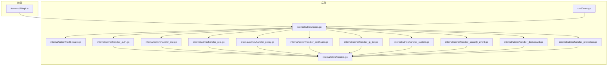
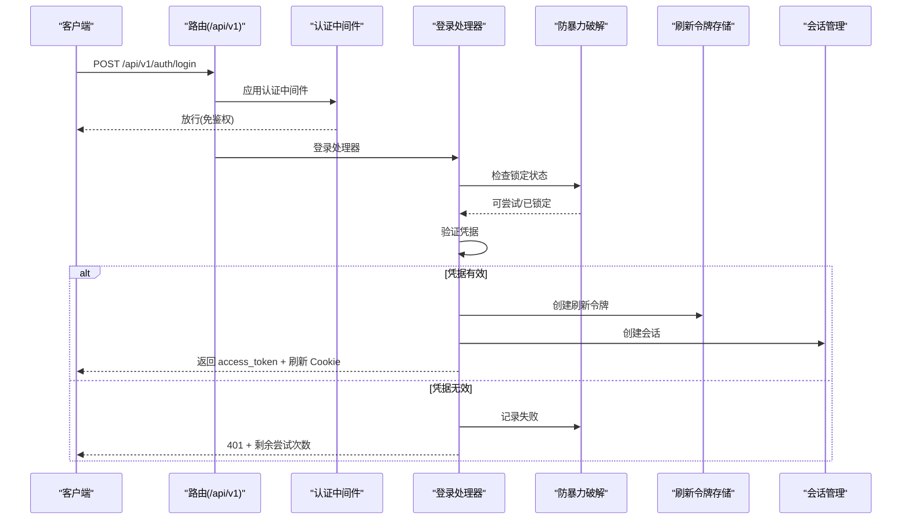
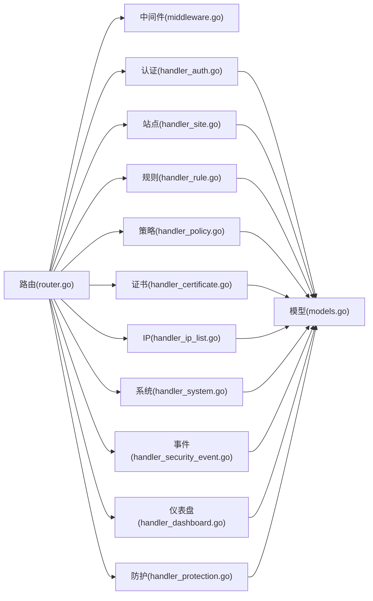

# API 端点参考

<cite>
**本文引用的文件**
- [cmd/main.go](file://cmd/main.go)
- [internal/admin/router.go](file://internal/admin/router.go)
- [internal/admin/middleware.go](file://internal/admin/middleware.go)
- [internal/admin/handler_auth.go](file://internal/admin/handler_auth.go)
- [internal/admin/handler_site.go](file://internal/admin/handler_site.go)
- [internal/admin/handler_rule.go](file://internal/admin/handler_rule.go)
- [internal/admin/handler_policy.go](file://internal/admin/handler_policy.go)
- [internal/admin/handler_certificate.go](file://internal/admin/handler_certificate.go)
- [internal/admin/handler_ip_list.go](file://internal/admin/handler_ip_list.go)
- [internal/admin/handler_system.go](file://internal/admin/handler_system.go)
- [internal/admin/handler_security_event.go](file://internal/admin/handler_security_event.go)
- [internal/admin/handler_dashboard.go](file://internal/admin/handler_dashboard.go)
- [internal/admin/handler_protection.go](file://internal/admin/handler_protection.go)
- [internal/store/models.go](file://internal/store/models.go)
- [frontend/lib/api.ts](file://frontend/lib/api.ts)
</cite>

## 目录
1. [简介](#简介)
2. [项目结构](#项目结构)
3. [核心组件](#核心组件)
4. [架构总览](#架构总览)
5. [详细端点说明](#详细端点说明)
6. [依赖关系分析](#依赖关系分析)
7. [性能与限流](#性能与限流)
8. [故障排查](#故障排查)
9. [结论](#结论)
10. [附录](#附录)

## 简介
本文件为 My-OpenWaf 后台管理 API 的完整端点参考，覆盖站点管理、规则管理、策略配置、证书管理、IP 黑白名单、系统设置、安全事件、防护设置、仪表盘统计等模块。内容包括：
- 每个端点的 HTTP 方法、路径、认证方式、权限级别
- 请求参数与响应格式（含分页与字段说明）
- 使用场景与典型用例
- 版本与兼容性说明
- 性能特征、限流策略与使用限制
- 常见问题排查建议

## 项目结构
后端基于 Hertz Web 框架，采用“路由注册 + 中间件 + 处理器”的分层设计。前端通过统一的 fetch 封装调用 API，并自动处理刷新令牌与错误码。

图表来源
- [cmd/main.go:1-10](file://cmd/main.go#L1-L10)
- [internal/admin/router.go:48-210](file://internal/admin/router.go#L48-L210)
- [internal/admin/middleware.go:16-129](file://internal/admin/middleware.go#L16-L129)
- [frontend/lib/api.ts:31-88](file://frontend/lib/api.ts#L31-L88)

章节来源
- [cmd/main.go:1-10](file://cmd/main.go#L1-L10)
- [internal/admin/router.go:48-210](file://internal/admin/router.go#L48-L210)

## 核心组件
- 路由注册：集中定义所有 /api/v1/* 端点，按角色划分只读、操作员、管理员三组。
- 认证中间件：支持 Bearer JWT 与 API Key；健康检查与登录/刷新/登出免鉴权。
- 权限中间件：基于角色的访问控制（admin、operator、readonly）。
- 处理器：各模块 CRUD、查询、统计、测试、导入导出等逻辑。
- 数据模型：站点、规则、策略、证书、IP 列表、系统设置、安全事件、防护配置等。

章节来源
- [internal/admin/router.go:44-47](file://internal/admin/router.go#L44-L47)
- [internal/admin/middleware.go:16-96](file://internal/admin/middleware.go#L16-L96)
- [internal/store/models.go:14-456](file://internal/store/models.go#L14-L456)

## 架构总览
以下序列图展示一次典型登录流程，包括防暴力破解、签发访问令牌与刷新令牌、会话记录与 Cookie 设置。

图表来源
- [internal/admin/router.go:55-67](file://internal/admin/router.go#L55-L67)
- [internal/admin/middleware.go:16-72](file://internal/admin/middleware.go#L16-L72)
- [internal/admin/handler_auth.go:32-123](file://internal/admin/handler_auth.go#L32-L123)

## 详细端点说明

### 通用约定
- 基础路径：/api/v1
- 认证方式：
  - Bearer JWT：Authorization: Bearer <token>
  - API Key：Authorization: Bearer <key>（默认视为 admin 角色）
- 全局只读端点：无需额外角色即可访问（admin/operator/readonly）
- 操作员端点：admin/operator 可访问
- 管理员端点：仅 admin 可访问
- 分页参数：page/page_size（GET 查询参数），默认 page=1、page_size=20
- 错误码：
  - 401 未授权（缺失或无效令牌）
  - 403 权限不足（RBAC）
  - 429 请求过快/账户锁定
  - 500 内部错误

章节来源
- [internal/admin/router.go:69-206](file://internal/admin/router.go#L69-L206)
- [internal/admin/middleware.go:16-96](file://internal/admin/middleware.go#L16-L96)
- [frontend/lib/api.ts:31-88](file://frontend/lib/api.ts#L31-L88)

---

### 认证与会话管理
- 登录
  - 方法：POST
  - 路径：/api/v1/auth/login
  - 认证：免鉴权
  - 请求体：{"username":"...","password":"..."}
  - 响应：{"access_token":"...","expires_at":整数,"username":"...","role":"..."}
  - 附加：设置 HttpOnly 刷新 Cookie my_openwaf_rt；防暴力破解；记录登录尝试
  - 场景：用户首次登录
  - 示例：
    - 成功：返回 access_token 与过期时间
    - 失败：401 + 剩余尝试次数提示
    - 锁定：429 + 剩余秒数

- 刷新
  - 方法：POST
  - 路径：/api/v1/auth/refresh
  - 认证：免鉴权（但需携带刷新 Cookie）
  - 请求：Cookie my_openwaf_rt
  - 响应：{"access_token":"...","expires_at":整数,"username":"...","role":"..."}
  - 场景：access_token 过期时续签
  - 示例：
    - 成功：返回新 access_token
    - 失败：401（缺失/过期/非法）

- 登出
  - 方法：POST
  - 路径：/api/v1/auth/logout
  - 认证：需要有效令牌或 API Key
  - 响应：{"status":"ok"}
  - 场景：主动退出，撤销刷新令牌与加入访问令牌黑名单
  - 示例：成功 200

- 当前用户信息
  - 方法：GET
  - 路径：/api/v1/auth/me
  - 认证：任意已登录角色
  - 响应：{"username":"...","role":"..."}

- 会话列表
  - 方法：GET
  - 路径：/api/v1/auth/sessions
  - 认证：任意已登录用户
  - 参数：all=true（仅管理员可用）列出全部会话
  - 响应：{"sessions":[...]}
  - 场景：查看当前用户会话或管理员审计

- 强制登出指定会话
  - 方法：POST
  - 路径：/api/v1/auth/sessions/force-logout
  - 认证：admin
  - 请求体：{"jti":"..."}
  - 响应：{"status":"ok"}

章节来源
- [internal/admin/router.go:55-79](file://internal/admin/router.go#L55-L79)
- [internal/admin/handler_auth.go:32-351](file://internal/admin/handler_auth.go#L32-L351)
- [internal/admin/middleware.go:16-96](file://internal/admin/middleware.go#L16-L96)

---

### 站点管理
- 列表
  - 方法：GET
  - 路径：/api/v1/sites
  - 权限：readonly
  - 响应：{"items":[...],"total":整数}

- 单个
  - 方法：GET
  - 路径：/api/v1/sites/:id
  - 权限：readonly
  - 响应：站点对象（见数据模型）

- 状态
  - 方法：GET
  - 路径：/api/v1/sites/:id/status
  - 权限：readonly
  - 响应：{"id":整数,"host":"...","status":"running|stopped"}

- 创建
  - 方法：POST
  - 路径：/api/v1/sites
  - 权限：operator
  - 请求体：站点对象（见数据模型）
  - 响应：新建站点对象
  - 行为：触发配置重载

- 更新
  - 方法：POST /api/v1/sites/:id/update
  - 权限：operator
  - 请求体：站点对象（可部分字段）
  - 响应：更新后的站点对象
  - 行为：触发配置重载

- 删除
  - 方法：POST /api/v1/sites/:id/delete
  - 权限：operator
  - 响应：204
  - 行为：触发配置重载

- 启动
  - 方法：POST /api/v1/sites/:id/start
  - 权限：operator
  - 响应：{"status":"running","message":"site started"}

- 停止
  - 方法：POST /api/v1/sites/:id/stop
  - 权限：operator
  - 响应：{"status":"stopped","message":"site stopped"}

章节来源
- [internal/admin/router.go:83-147](file://internal/admin/router.go#L83-L147)
- [internal/admin/handler_site.go:21-179](file://internal/admin/handler_site.go#L21-L179)
- [internal/store/models.go:94-148](file://internal/store/models.go#L94-L148)

---

### 规则管理
- 列表
  - 方法：GET
  - 路径：/api/v1/rules
  - 权限：readonly
  - 响应：{"items":[...],"total":整数}

- 单个
  - 方法：GET
  - 路径：/api/v1/rules/:id
  - 权限：readonly
  - 响应：规则对象（见数据模型）

- 创建
  - 方法：POST
  - 路径：/api/v1/rules
  - 权限：operator
  - 请求体：规则对象
  - 响应：新建规则对象
  - 行为：触发配置重载

- 更新
  - 方法：POST /api/v1/rules/:id/update
  - 权限：operator
  - 请求体：规则对象
  - 响应：更新后的规则对象
  - 行为：触发配置重载

- 删除
  - 方法：POST /api/v1/rules/:id/delete
  - 权限：operator
  - 响应：204
  - 行为：触发配置重载

- 测试
  - 方法：POST
  - 路径：/api/v1/rules/test
  - 权限：operator
  - 请求体：{"pattern":"...","client_ip":"...","path":"...","query":"...","headers":{"k":"v"}}
  - 响应：{"matched":布尔,"kind":"...","arg":"..."}
  - 场景：在不持久化的情况下验证规则模式

- 导出
  - 方法：GET
  - 路径：/api/v1/rules/export
  - 权限：readonly
  - 响应：{"rules":[...]}

- 导入
  - 方法：POST
  - 路径：/api/v1/rules/import
  - 权限：operator
  - 请求体：{"rules":[规则对象...]}
  - 响应：{"imported":整数,"total":整数}
  - 行为：批量创建并触发配置重载

- 模板
  - 方法：GET
  - 路径：/api/v1/rules/templates
  - 权限：readonly
  - 响应：模板列表（由后端提供）

章节来源
- [internal/admin/router.go:97-165](file://internal/admin/router.go#L97-L165)
- [internal/admin/handler_rule.go:16-197](file://internal/admin/handler_rule.go#L16-L197)
- [internal/store/models.go:79-92](file://internal/store/models.go#L79-L92)

---

### 策略管理
- 列表
  - 方法：GET
  - 路径：/api/v1/policies
  - 权限：readonly
  - 响应：{"items":[...],"total":整数}

- 单个
  - 方法：GET
  - 路径：/api/v1/policies/:id
  - 权限：readonly
  - 响应：策略对象

- 创建
  - 方法：POST
  - 路径：/api/v1/policies
  - 权限：operator
  - 请求体：策略对象
  - 响应：新建策略对象
  - 行为：触发配置重载

- 更新
  - 方法：POST /api/v1/policies/:id/update
  - 权限：operator
  - 请求体：策略对象
  - 响应：更新后的策略对象
  - 行为：触发配置重载

- 删除
  - 方法：POST /api/v1/policies/:id/delete
  - 权限：operator
  - 响应：204
  - 行为：触发配置重载

章节来源
- [internal/admin/router.go:94-157](file://internal/admin/router.go#L94-L157)
- [internal/admin/handler_policy.go:14-101](file://internal/admin/handler_policy.go#L14-L101)
- [internal/store/models.go:35-42](file://internal/store/models.go#L35-L42)

---

### 证书管理
- 列表
  - 方法：GET
  - 路径：/api/v1/certificates
  - 权限：readonly
  - 响应：{"items":[...],"total":整数}

- 单个
  - 方法：GET
  - 路径：/api/v1/certificates/:id
  - 权限：readonly
  - 响应：证书对象

- 创建
  - 方法：POST
  - 路径：/api/v1/certificates
  - 权限：operator
  - 请求体：{"name":"...","cert_pem":"...","key_pem":"..."}
  - 响应：新建证书对象
  - 行为：校验 PEM 有效性并触发配置重载

- 更新
  - 方法：POST /api/v1/certificates/:id/update
  - 权限：operator
  - 请求体：证书对象
  - 响应：更新后的证书对象
  - 行为：校验 PEM 有效性并触发配置重载

- 删除
  - 方法：POST /api/v1/certificates/:id/delete
  - 权限：operator
  - 响应：204
  - 行为：触发配置重载

章节来源
- [internal/admin/router.go:91-152](file://internal/admin/router.go#L91-L152)
- [internal/admin/handler_certificate.go:15-110](file://internal/admin/handler_certificate.go#L15-L110)
- [internal/store/models.go:14-23](file://internal/store/models.go#L14-L23)

---

### IP 黑白名单
- 列表
  - 方法：GET
  - 路径：/api/v1/ip-lists
  - 权限：readonly
  - 参数：page/page_size/kind=blacklist|whitelist
  - 响应：{"items":[...],"total":整数,"page":整数}

- 单个
  - 方法：GET
  - 路径：/api/v1/ip-lists/:id
  - 权限：readonly
  - 响应：IP 条目对象

- 创建
  - 方法：POST
  - 路径：/api/v1/ip-lists
  - 权限：operator
  - 请求体：IP 条目对象（kind 必须为 blacklist 或 whitelist，value 必填）
  - 响应：新建条目对象
  - 行为：触发配置重载

- 更新
  - 方法：POST /api/v1/ip-lists/:id/update
  - 权限：operator
  - 请求体：IP 条目对象
  - 响应：更新后的条目对象
  - 行为：触发配置重载

- 删除
  - 方法：POST /api/v1/ip-lists/:id/delete
  - 权限：operator
  - 响应：204
  - 行为：触发配置重载

章节来源
- [internal/admin/router.go:107-173](file://internal/admin/router.go#L107-L173)
- [internal/admin/handler_ip_list.go:14-113](file://internal/admin/handler_ip_list.go#L14-L113)
- [internal/store/models.go:200-210](file://internal/store/models.go#L200-L210)

---

### 系统设置与 API Key
- 列表
  - 方法：GET
  - 路径：/api/v1/settings
  - 权限：readonly
  - 响应：{"items":[{"key":"...","value":"..."}...]}

- 获取单个
  - 方法：GET
  - 路径：/api/v1/settings/:key
  - 权限：readonly
  - 响应：{"key":"...","value":"..."}

- 创建
  - 方法：POST
  - 路径：/api/v1/settings
  - 权限：admin
  - 请求体：{"key":"...","value":"..."}
  - 响应：{"key":"...","value":"..."}
  - 行为：触发配置重载

- 设置/更新
  - 方法：POST /api/v1/settings/:key 或 /api/v1/settings/:key/update
  - 权限：admin
  - 请求体：{"value":"..."}
  - 响应：{"key":"...","value":"..."}
  - 行为：触发配置重载

- 删除
  - 方法：POST /api/v1/settings/:key/delete
  - 权限：admin
  - 响应：204
  - 行为：触发配置重载

- API Key 列表（readonly）
  - 方法：GET
  - 路径：/api/v1/api-keys
  - 权限：readonly
  - 响应：{"items":[...]}

- 创建 API Key（admin）
  - 方法：POST
  - 路径：/api/v1/api-keys
  - 权限：admin
  - 请求体：{"name":"..."}
  - 响应：{"token":"...","id":整数,"name":"..."}
  - 说明：返回明文 token，仅在创建时可见

- 删除 API Key（admin）
  - 方法：POST /api/v1/api-keys/:id/delete
  - 权限：admin
  - 响应：204

- 触发重载
  - 方法：POST
  - 路径：/api/v1/reload
  - 权限：operator
  - 响应：{"status":"ok"}

- 健康检查
  - 方法：GET
  - 路径：/api/v1/health
  - 权限：免鉴权
  - 响应：{"status":"ok"}

章节来源
- [internal/admin/router.go:185-206](file://internal/admin/router.go#L185-L206)
- [internal/admin/handler_system.go:12-162](file://internal/admin/handler_system.go#L12-L162)
- [internal/store/models.go:150-189](file://internal/store/models.go#L150-L189)

---

### 安全事件
- 列表
  - 方法：GET
  - 路径：/api/v1/security-events
  - 权限：readonly
  - 参数：page/page_size/action/phase/category/client_ip/host/path/rule_id/since/until
  - 响应：{"items":[...],"total":整数,"page":整数}

- 统计
  - 方法：GET
  - 路径：/api/v1/security-events/stats
  - 权限：readonly
  - 参数：hours（默认 24）
  - 响应：聚合统计（类别分布、Top IP/Path/Rule、总量等）

- 时间线
  - 方法：GET
  - 路径：/api/v1/security-events/timeline
  - 权限：readonly
  - 参数：hours（默认 24）
  - 响应：时间分桶

- 单个
  - 方法：GET
  - 路径：/api/v1/security-events/:id
  - 权限：readonly
  - 响应：事件对象

章节来源
- [internal/admin/router.go:110-114](file://internal/admin/router.go#L110-L114)
- [internal/admin/handler_security_event.go:16-127](file://internal/admin/handler_security_event.go#L16-L127)
- [internal/store/models.go:214-236](file://internal/store/models.go#L214-L236)

---

### 仪表盘
- 摘要
  - 方法：GET
  - 路径：/api/v1/dashboard/summary
  - 权限：readonly
  - 响应：包含 QPS、请求总量、状态码分布、WAF 统计、运行时修订号、24 小时内 Bot/CVE/Drop 统计、指纹异常等

章节来源
- [internal/admin/router.go:117](file://internal/admin/router.go#L117)
- [internal/admin/handler_dashboard.go:20-92](file://internal/admin/handler_dashboard.go#L20-L92)
- [internal/store/models.go:402-442](file://internal/store/models.go#L402-L442)

---

### 防护设置
- 获取
  - 方法：GET
  - 路径：/api/v1/protection-settings
  - 权限：readonly
  - 响应：ProtectionConfig 对象（含字符串化字段如 owasp_modules/cc_rules 的展开）

- 更新
  - 方法：POST
  - 路径：/api/v1/protection-settings
  - 权限：operator
  - 请求体：ProtectionConfig 对象（可直接传对象/数组，后端自动转为字符串）
  - 响应：更新后的 ProtectionConfig
  - 行为：触发配置重载

章节来源
- [internal/admin/router.go:105-167](file://internal/admin/router.go#L105-L167)
- [internal/admin/handler_protection.go:21-107](file://internal/admin/handler_protection.go#L21-L107)
- [internal/store/models.go:247-354](file://internal/store/models.go#L247-L354)

---

### Bot 与 CVE
- Bot 设置
  - 获取：GET /api/v1/bot-settings
  - 更新：POST /api/v1/bot-settings（operator）
- Bot 分数日志
  - 获取：GET /api/v1/bot-scores（支持分页与过滤）
- 指纹统计
  - 获取：GET /api/v1/fingerprints

- CVE 规则
  - 列表：GET /api/v1/cve-rules（支持分页与过滤）
  - 创建：POST /api/v1/cve-rules（admin）
  - 更新：PUT /api/v1/cve-rules/:id（admin）
  - 删除：DELETE /api/v1/cve-rules/:id（admin）
  - 切换启用：PUT /api/v1/cve-rules/:id/toggle（operator）
  - 同步：POST /api/v1/cve-rules/sync（operator）
  - 状态：GET /api/v1/cve-feed/status

- Drop 策略与事件
  - 获取策略：GET /api/v1/drop-policy
  - 更新策略：PUT /api/v1/drop-policy（admin）
  - 统计：GET /api/v1/drop-stats
  - 事件：GET /api/v1/drop-events（支持分页与过滤）

章节来源
- [internal/admin/router.go:123-135](file://internal/admin/router.go#L123-L135)
- [frontend/lib/api.ts:251-317](file://frontend/lib/api.ts#L251-L317)
- [internal/store/models.go:402-456](file://internal/store/models.go#L402-L456)

## 依赖关系分析
- 路由到处理器：/api/v1/* 路由集中注册，按角色分组挂载中间件
- 处理器到仓库：各模块处理器依赖对应仓库进行数据访问
- 中间件链：安全头 → 访问日志 → 认证 → 角色校验
- 数据模型：统一的领域模型定义了各资源的结构与默认值

图表来源
- [internal/admin/router.go:48-210](file://internal/admin/router.go#L48-L210)
- [internal/admin/middleware.go:16-129](file://internal/admin/middleware.go#L16-L129)
- [internal/store/models.go:14-456](file://internal/store/models.go#L14-L456)

章节来源
- [internal/admin/router.go:48-210](file://internal/admin/router.go#L48-L210)
- [internal/admin/middleware.go:16-129](file://internal/admin/middleware.go#L16-L129)
- [internal/store/models.go:14-456](file://internal/store/models.go#L14-L456)

## 性能与限流
- 认证防暴力破解：登录接口对同一 IP/用户名进行失败次数与冷却时间限制，触发 429 并返回剩余秒数
- 会话活跃更新：JWT 验证成功后更新会话最后活跃时间
- 访问日志：统一记录请求 ID、方法、路径、状态、耗时与认证方式
- 配置重载：写操作（创建/更新/删除/导入/同步等）通常触发配置重载，可能带来短暂延迟
- 建议：
  - 批量导入规则时合并为单次请求
  - 控制并发写操作频率
  - 使用分页参数合理设置 page_size

章节来源
- [internal/admin/middleware.go:98-129](file://internal/admin/middleware.go#L98-L129)
- [internal/admin/handler_auth.go:44-53](file://internal/admin/handler_auth.go#L44-L53)
- [internal/admin/handler_rule.go:171-197](file://internal/admin/handler_rule.go#L171-L197)
- [internal/admin/handler_system.go:142-150](file://internal/admin/handler_system.go#L142-L150)

## 故障排查
- 401 未授权
  - 缺失 Authorization 或格式错误（非 Bearer）
  - JWT 无效或过期；尝试 /api/v1/auth/refresh
  - 刷新后仍 401：会话被强制登出或令牌加入黑名单
- 403 权限不足
  - 当前角色无权访问该端点（RBAC）
- 429 请求过快/账户锁定
  - 登录失败过多导致临时锁定；等待冷却时间或联系管理员
- 500 内部错误
  - 数据库异常、配置解析错误、PEM 校验失败等
- 常见问题定位
  - 查看访问日志中的 X-Request-ID
  - 确认刷新 Cookie 是否正确携带
  - 检查系统设置键值是否合法

章节来源
- [frontend/lib/api.ts:16-88](file://frontend/lib/api.ts#L16-L88)
- [internal/admin/middleware.go:16-96](file://internal/admin/middleware.go#L16-L96)
- [internal/admin/handler_auth.go:44-73](file://internal/admin/handler_auth.go#L44-L73)

## 结论
本参考文档覆盖了 My-OpenWaf 后台管理 API 的主要端点与行为规范。通过明确的认证与权限模型、清晰的请求/响应约定以及完善的错误处理机制，可帮助开发者与运维人员高效集成与维护系统。

## 附录

### 数据模型要点（节选）
- 站点 Site：监听地址、TLS、转发、保护等级、维护模式、块页等
- 规则 Rule：名称、所属策略、阶段、模式、动作、优先级、启用状态
- 策略 Policy：名称
- 证书 Certificate：名称、证书与私钥 PEM
- IP 列表 IPListEntry：类型（黑名单/白名单）、值（IP/CIDR）、备注、启用状态
- 系统设置 SystemSettings：键值对
- 安全事件 SecurityEvent：请求标识、客户端 IP、主机、路径、方法、UA、命中规则、阶段、动作、分类、地理信息、状态码
- 防护配置 ProtectionConfig：请求/错误限速、OWASP 敏感度、维护全局开关、Bot 检测、自动封禁、CC 保护、CVE 开关与动作、登录安全策略等

章节来源
- [internal/store/models.go:94-148](file://internal/store/models.go#L94-L148)
- [internal/store/models.go:79-92](file://internal/store/models.go#L79-L92)
- [internal/store/models.go:35-42](file://internal/store/models.go#L35-L42)
- [internal/store/models.go:14-23](file://internal/store/models.go#L14-L23)
- [internal/store/models.go:200-210](file://internal/store/models.go#L200-L210)
- [internal/store/models.go:150-189](file://internal/store/models.go#L150-L189)
- [internal/store/models.go:214-236](file://internal/store/models.go#L214-L236)
- [internal/store/models.go:247-354](file://internal/store/models.go#L247-L354)