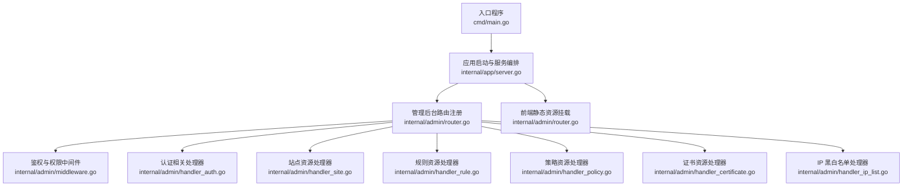
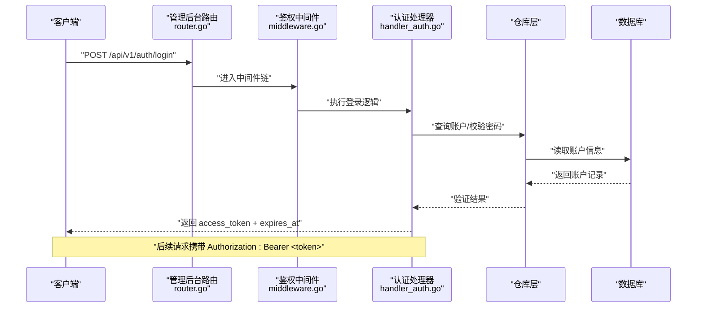
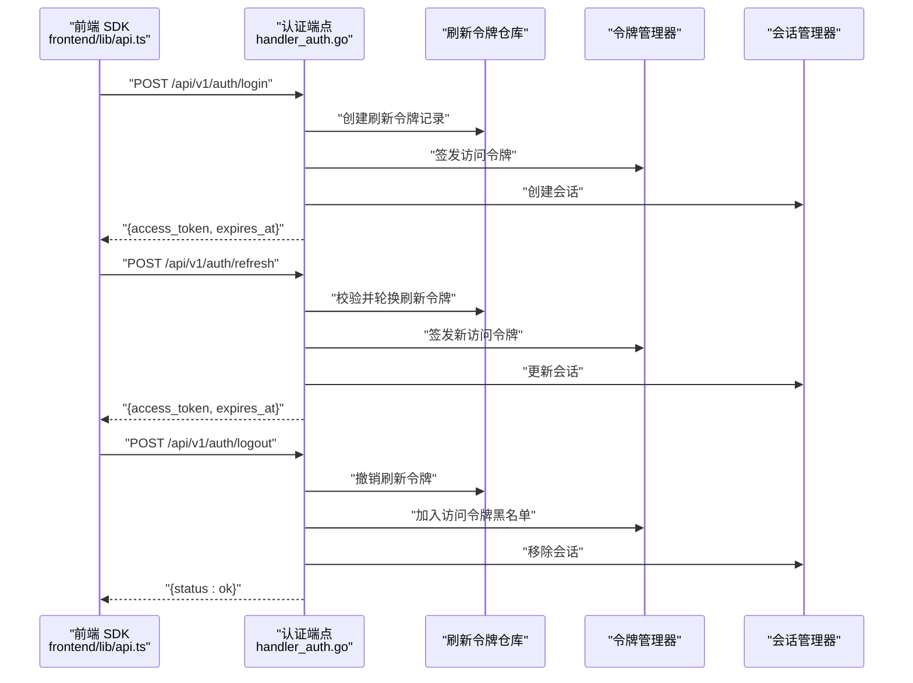
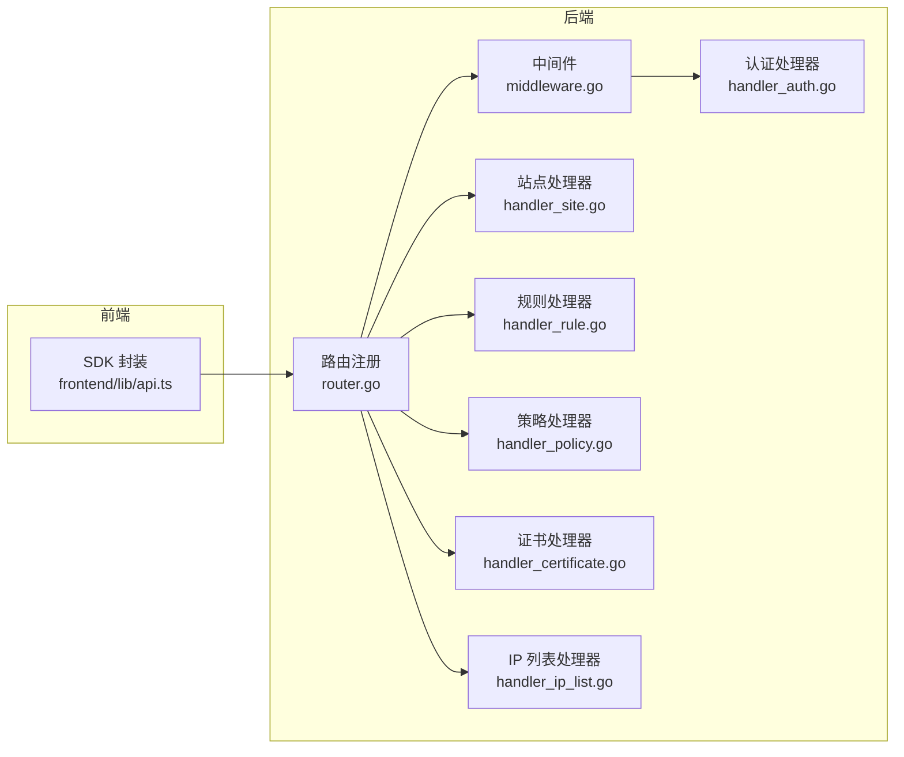

# REST API 设计规范

<cite>
**本文引用的文件**
- [main.go](file://cmd/main.go)
- [server.go](file://internal/app/server.go)
- [router.go](file://internal/admin/router.go)
- [middleware.go](file://internal/admin/middleware.go)
- [handler_auth.go](file://internal/admin/handler_auth.go)
- [handler_site.go](file://internal/admin/handler_site.go)
- [handler_rule.go](file://internal/admin/handler_rule.go)
- [handler_policy.go](file://internal/admin/handler_policy.go)
- [handler_certificate.go](file://internal/admin/handler_certificate.go)
- [handler_ip_list.go](file://internal/admin/handler_ip_list.go)
- [models.go](file://internal/store/models.go)
- [api.ts](file://frontend/lib/api.ts)
- [errors.go](file://internal/pkg/errors/errors.go)
</cite>

## 目录
1. [引言](#引言)
2. [项目结构](#项目结构)
3. [核心组件](#核心组件)
4. [架构总览](#架构总览)
5. [详细组件分析](#详细组件分析)
6. [依赖分析](#依赖分析)
7. [性能考虑](#性能考虑)
8. [故障排查指南](#故障排查指南)
9. [结论](#结论)
10. [附录：完整 API 参考](#附录完整-api-参考)

## 引言
本文件为 My-OpenWaf 控制面（管理后台）REST API 的设计规范与参考文档。内容覆盖架构设计原则、资源命名与 HTTP 方法使用、路由组织与版本控制、请求/响应格式、错误处理机制、测试策略与质量保障、以及前端 SDK 使用指南与最佳实践。目标是帮助开发者与运维人员统一理解与实现 API 行为，确保一致性与可维护性。

## 项目结构
后端采用 Go 语言与 Hertz 框架，入口程序启动应用服务，注册管理后台 API 路由，并挂载前端静态资源。API 以版本化路径组织，配合鉴权中间件与角色权限控制，实现细粒度的访问控制。

图表来源
- [main.go:1-10](file://cmd/main.go#L1-L10)
- [server.go:263-278](file://internal/app/server.go#L263-L278)
- [router.go:46-179](file://internal/admin/router.go#L46-L179)

章节来源
- [main.go:1-10](file://cmd/main.go#L1-L10)
- [server.go:35-300](file://internal/app/server.go#L35-L300)
- [router.go:33-179](file://internal/admin/router.go#L33-L179)

## 核心组件
- 版本化路由与资源组织
  - 基础路径：/api/v1
  - 资源：站点、证书、策略、规则、设置、安全事件、会话、API Key 等
  - 更新/删除通过“POST + 动态动作”语义替代 PUT/DELETE，简化反向代理与 CORS 配置
- 鉴权与权限
  - 支持 Bearer JWT 与 API Key 两种鉴权方式
  - 角色：admin、operator、readonly；不同角色可见与操作范围不同
- 中间件
  - 安全头设置、访问日志、鉴权校验、角色校验
- 数据模型
  - 统一的 JSON 字段命名与类型定义，便于前后端契约一致

章节来源
- [router.go:33-179](file://internal/admin/router.go#L33-L179)
- [middleware.go:16-129](file://internal/admin/middleware.go#L16-L129)
- [models.go:14-397](file://internal/store/models.go#L14-L397)

## 架构总览
控制面 API 由 Hertz 服务器承载，注册健康检查、认证、资源读取与变更等端点。认证成功后返回访问令牌与过期时间，前端通过 Bearer 头进行后续调用。管理员会话支持强制登出与黑名单机制，刷新令牌使用 HttpOnly Cookie 保障安全。

图表来源
- [router.go:63-65](file://internal/admin/router.go#L63-L65)
- [middleware.go:18-72](file://internal/admin/middleware.go#L18-L72)
- [handler_auth.go:32-122](file://internal/admin/handler_auth.go#L32-L122)

## 详细组件分析

### 鉴权与会话管理
- 登录：接收用户名/密码，执行暴力破解检测，成功后签发访问令牌与刷新令牌（HttpOnly Cookie），并创建会话记录
- 刷新：从 Cookie 提取刷新令牌，校验后签发新访问令牌并轮换刷新令牌
- 注销：撤销刷新令牌、加入访问令牌黑名单、移除会话
- me：返回当前用户身份与角色
- 会话列表：支持按用户或全部列出；管理员可强制登出指定会话并加入黑名单

图表来源
- [handler_auth.go:32-221](file://internal/admin/handler_auth.go#L32-L221)
- [api.ts:16-114](file://frontend/lib/api.ts#L16-L114)

章节来源
- [handler_auth.go:32-221](file://internal/admin/handler_auth.go#L32-L221)
- [api.ts:16-114](file://frontend/lib/api.ts#L16-L114)

### 资源与路由组织
- 版本控制：/api/v1
- 资源与动作
  - 站点：GET/POST（创建）、POST /:id/update、POST /:id/delete、POST /:id/start、POST /:id/stop、GET /:id/status
  - 证书：GET/POST（创建）、POST /:id/update、POST /:id/delete
  - 策略：GET/POST（创建）、POST /:id/update、POST /:id/delete
  - 规则：GET/POST（创建）、POST /:id/update、POST /:id/delete、POST /rules/test、POST /rules/validate、POST /rules/import、GET /rules/export、GET /rules/templates
  - 设置：GET /settings、GET /settings/:key、POST /settings、POST /settings/:key、POST /settings/:key/update、POST /settings/:key/delete、GET /protection-settings、POST /protection-settings
  - IP 黑白名单：GET/POST（创建）、POST /:id/update、POST /:id/delete
  - 安全事件：GET /security-events、GET /security-events/stats、GET /security-events/timeline、GET /security-events/:id
  - 仪表盘：GET /dashboard/summary
  - API Key：GET /api-keys、POST /api-keys、POST /api-keys/:id/delete
  - 会话：GET /auth/sessions、POST /auth/sessions/force-logout
  - 当前用户：GET /auth/me
- 角色权限
  - readonly：只读访问
  - operator：可管理站点、规则、策略、证书、IP 列表、保护设置
  - admin：系统设置、API Key 管理

章节来源
- [router.go:51-179](file://internal/admin/router.go#L51-L179)

### 请求与响应格式规范
- 内容类型：application/json
- 成功响应：根据业务返回对应资源对象或集合；分页接口统一返回 items 与 total
- 空响应：204 No Content 返回空体
- 错误响应：统一为 { "error": "..." } 文本消息；部分端点返回更丰富的结构（如登录失败剩余尝试次数）
- 分页：page/page_size 查询参数，offset/limit 由工具函数计算
- 字段命名：遵循模型定义的 JSON 标签（驼峰）

章节来源
- [handler_site.go:21-107](file://internal/admin/handler_site.go#L21-L107)
- [handler_rule.go:16-102](file://internal/admin/handler_rule.go#L16-L102)
- [handler_policy.go:14-100](file://internal/admin/handler_policy.go#L14-L100)
- [handler_certificate.go:15-109](file://internal/admin/handler_certificate.go#L15-L109)
- [handler_ip_list.go:14-112](file://internal/admin/handler_ip_list.go#L14-L112)
- [models.go:14-397](file://internal/store/models.go#L14-L397)

### 错误处理机制
- 状态码
  - 200：成功
  - 201：创建成功
  - 204：删除成功（无内容）
  - 400：请求体无效、参数非法
  - 401：未认证/会话失效
  - 403：权限不足
  - 404：资源不存在
  - 429：请求过于频繁/被锁定
  - 500：服务器内部错误
- 错误信息
  - 统一为 { "error": "..." } 结构
  - 登录失败可能包含剩余尝试次数
  - 刷新失败时前端会重定向到登录页
- 异常处理流程
  - 中间件在鉴权失败时直接返回 401
  - 资源不存在返回 404
  - 业务错误返回 500 并记录日志
  - 速率限制与暴力破解返回 429

章节来源
- [middleware.go:18-96](file://internal/admin/middleware.go#L18-L96)
- [handler_auth.go:32-122](file://internal/admin/handler_auth.go#L32-L122)
- [api.ts:48-87](file://frontend/lib/api.ts#L48-L87)

### 数据模型与字段定义
以下为关键资源的数据模型要点（字段名与类型均来自模型定义）：
- 站点 Site
  - host、upstream_urls、bind、network、enabled、tls_enabled、min_tls_version、max_tls_version、cipher_suites、alpn、policy_id、bot_protection_enabled、attack_protection_level、xff_mode、trusted_cidr、preserve_original_host、max_body_bytes、upstream_tls_skip_verify、upstream_tls_server_name、maintenance_enabled、maintenance_html、maintenance_status、block_html、block_status
- 策略 Policy
  - name
- 规则 Rule
  - name、policy_id、phase、pattern、action、priority、enabled
- 证书 Certificate
  - name、cert_pem、key_pem
- IP 列表条目 IPListEntry
  - kind（blacklist/whitelist）、value（IP/CIDR）、note、enabled
- 系统设置 SystemSettings
  - key、value
- 保护配置 ProtectionConfig
  - request_ratelimit_*、error_ratelimit_*、builtin_owasp_*、maintenance_global_*、bot_detection_enabled、auto_ban_*、waiting_room_enabled、cc_*、owasp_modules、cve_*、login_* 等

章节来源
- [models.go:14-397](file://internal/store/models.go#L14-L397)

### 客户端 SDK 使用指南与最佳实践
- 认证
  - 使用 login 接口获取 access_token，并持久化在内存中（避免 XSS 风险）
  - 刷新：当 401 且存在刷新能力时自动调用刷新接口
  - 注销：调用 logout 清理会话与令牌
- 请求头
  - 默认 Content-Type: application/json
  - 已认证请求附加 Authorization: Bearer <token>
- 错误处理
  - 401：跳转登录
  - 403：提示权限不足
  - 429：提示请求过于频繁
  - 其他错误：提取 error 字段作为用户可见消息
- 分页
  - 使用 page 与 page_size 查询参数

章节来源
- [api.ts:16-114](file://frontend/lib/api.ts#L16-L114)

## 依赖分析
- 控制面 API 依赖
  - 鉴权中间件依赖仓库层与令牌管理器
  - 各资源处理器依赖对应仓库与重载回调
  - 应用启动时构建依赖注入容器，注册路由并挂载静态资源
- 前端依赖
  - 通过统一的 api 封装发起请求，内置鉴权与错误处理

图表来源
- [router.go:46-179](file://internal/admin/router.go#L46-L179)
- [middleware.go:18-96](file://internal/admin/middleware.go#L18-L96)
- [handler_auth.go:32-221](file://internal/admin/handler_auth.go#L32-L221)
- [handler_site.go:21-179](file://internal/admin/handler_site.go#L21-L179)
- [handler_rule.go:16-197](file://internal/admin/handler_rule.go#L16-L197)
- [handler_policy.go:14-101](file://internal/admin/handler_policy.go#L14-L101)
- [handler_certificate.go:15-110](file://internal/admin/handler_certificate.go#L15-L110)
- [handler_ip_list.go:14-113](file://internal/admin/handler_ip_list.go#L14-L113)
- [api.ts:16-114](file://frontend/lib/api.ts#L16-L114)

## 性能考虑
- 速率限制与错误率限制：基于快照中的保护配置动态配置
- IP 黑/白名单与自动封禁：运行时加载与热更新
- 会话与令牌：支持会话列表与强制登出，降低长期会话风险
- 日志与可观测性：统一访问日志与健康检查端点

章节来源
- [server.go:94-108](file://internal/app/server.go#L94-L108)
- [server.go:215-237](file://internal/app/server.go#L215-L237)
- [middleware.go:98-129](file://internal/admin/middleware.go#L98-L129)

## 故障排查指南
- 401 未认证
  - 检查 Authorization 头是否为 Bearer <token>
  - 若使用 API Key，请确认已正确传入
  - 刷新令牌是否有效（Cookie 是否存在且未过期）
- 403 权限不足
  - 确认当前用户角色是否满足端点要求
- 404 资源不存在
  - 检查 ID 是否合法，资源是否已被删除
- 429 请求过于频繁
  - 检查是否存在暴力破解防护触发
- 500 服务器错误
  - 查看服务端日志与请求 ID（X-Request-ID）

章节来源
- [middleware.go:18-96](file://internal/admin/middleware.go#L18-L96)
- [api.ts:48-87](file://frontend/lib/api.ts#L48-L87)

## 结论
本设计规范明确了 My-OpenWaf 控制面 API 的架构原则、路由组织、鉴权与权限模型、请求/响应格式、错误处理与前端 SDK 使用方法。通过版本化路径、统一的错误与日志规范、以及细粒度的角色控制，确保了 API 的一致性与安全性。建议在后续迭代中持续完善测试与文档，保持前后端契约稳定。

## 附录：完整 API 参考

### 认证与会话
- POST /api/v1/auth/login
  - 请求体：{ username, password }
  - 成功：{ access_token, expires_at, username, role }
  - 失败：400/401/429
- POST /api/v1/auth/refresh
  - 请求：Cookie my_openwaf_rt
  - 成功：{ access_token, expires_at, username, role }
  - 失败：400/401
- POST /api/v1/auth/logout
  - 成功：{ status: "ok" }
- GET /api/v1/auth/me
  - 成功：{ username, role }
- GET /api/v1/auth/sessions
  - 查询参数：all=true（仅管理员）
  - 成功：{ sessions: [...] }
- POST /api/v1/auth/sessions/force-logout
  - 请求体：{ jti }
  - 成功：{ status: "ok" }

章节来源
- [router.go:53-76](file://internal/admin/router.go#L53-L76)
- [handler_auth.go:32-221](file://internal/admin/handler_auth.go#L32-L221)

### 站点管理
- GET /api/v1/sites?page&page_size
  - 成功：{ items, total }
- GET /api/v1/sites/:id
  - 成功：站点对象
- POST /api/v1/sites
  - 请求体：站点对象
  - 成功：201 + 站点对象
- POST /api/v1/sites/:id/update
  - 请求体：站点对象（含 id）
  - 成功：更新后的对象
- POST /api/v1/sites/:id/delete
  - 成功：204
- POST /api/v1/sites/:id/start
  - 成功：{ status: "running", message: "site started" }
- POST /api/v1/sites/:id/stop
  - 成功：{ status: "stopped", message: "site stopped" }
- GET /api/v1/sites/:id/status
  - 成功：{ id, host, status }

章节来源
- [router.go:81-131](file://internal/admin/router.go#L81-L131)
- [handler_site.go:21-179](file://internal/admin/handler_site.go#L21-L179)

### 证书管理
- GET /api/v1/certificates?page&page_size
  - 成功：{ items, total }
- GET /api/v1/certificates/:id
  - 成功：证书对象
- POST /api/v1/certificates
  - 请求体：{ name, cert_pem, key_pem }
  - 成功：201 + 证书对象
- POST /api/v1/certificates/:id/update
  - 请求体：{ name, cert_pem, key_pem }
  - 成功：更新后的对象
- POST /api/v1/certificates/:id/delete
  - 成功：204

章节来源
- [router.go:89-91](file://internal/admin/router.go#L89-L91)
- [handler_certificate.go:15-110](file://internal/admin/handler_certificate.go#L15-L110)

### 策略管理
- GET /api/v1/policies?page&page_size
  - 成功：{ items, total }
- GET /api/v1/policies/:id
  - 成功：策略对象
- POST /api/v1/policies
  - 请求体：策略对象
  - 成功：201 + 策略对象
- POST /api/v1/policies/:id/update
  - 请求体：策略对象（含 id）
  - 成功：更新后的对象
- POST /api/v1/policies/:id/delete
  - 成功：204

章节来源
- [router.go:92-94](file://internal/admin/router.go#L92-L94)
- [handler_policy.go:14-101](file://internal/admin/handler_policy.go#L14-L101)

### 规则管理
- GET /api/v1/rules?page&page_size
  - 成功：{ items, total }
- GET /api/v1/rules/:id
  - 成功：规则对象
- POST /api/v1/rules
  - 请求体：规则对象
  - 成功：201 + 规则对象
- POST /api/v1/rules/:id/update
  - 请求体：规则对象（含 id）
  - 成功：更新后的对象
- POST /api/v1/rules/:id/delete
  - 成功：204
- POST /api/v1/rules/test
  - 请求体：{ pattern, client_ip, path, query, headers }
  - 成功：{ matched, kind, arg }
- POST /api/v1/rules/validate
  - 请求体：{ pattern }
  - 成功：{ valid: true/false }
- POST /api/v1/rules/import
  - 请求体：{ rules: [...] }
  - 成功：{ imported, total }
- GET /api/v1/rules/export
  - 成功：{ rules: [...] }
- GET /api/v1/rules/templates
  - 成功：模板列表

章节来源
- [router.go:95-99](file://internal/admin/router.go#L95-L99)
- [handler_rule.go:16-197](file://internal/admin/handler_rule.go#L16-L197)

### 设置与保护
- GET /api/v1/settings
  - 成功：{ items, total }
- GET /api/v1/settings/:key
  - 成功：设置对象
- POST /api/v1/settings
  - 请求体：{ key, value }
  - 成功：201 + 设置对象
- POST /api/v1/settings/:key
  - 请求体：{ value }
  - 成功：设置对象
- POST /api/v1/settings/:key/update
  - 请求体：{ value }
  - 成功：设置对象
- POST /api/v1/settings/:key/delete
  - 成功：204
- GET /api/v1/protection-settings
  - 成功：保护配置对象
- POST /api/v1/protection-settings
  - 请求体：保护配置对象
  - 成功：设置对象

章节来源
- [router.go:100-104](file://internal/admin/router.go#L100-L104)
- [router.go:150-152](file://internal/admin/router.go#L150-L152)

### IP 黑白名单
- GET /api/v1/ip-lists?page&page_size&kind=blacklist|whitelist
  - 成功：{ items, total, page }
- GET /api/v1/ip-lists/:id
  - 成功：IP 列表条目
- POST /api/v1/ip-lists
  - 请求体：{ kind, value, note, enabled }
  - 成功：201 + 条目对象
- POST /api/v1/ip-lists/:id/update
  - 请求体：{ kind, value, note, enabled }
  - 成功：更新后的对象
- POST /api/v1/ip-lists/:id/delete
  - 成功：204

章节来源
- [router.go:105-107](file://internal/admin/router.go#L105-L107)
- [handler_ip_list.go:14-113](file://internal/admin/handler_ip_list.go#L14-L113)

### 安全事件与仪表盘
- GET /api/v1/security-events?page&page_size
  - 成功：{ items, total }
- GET /api/v1/security-events/stats
  - 成功：统计聚合
- GET /api/v1/security-events/timeline
  - 成功：时间序列
- GET /api/v1/security-events/:id
  - 成功：事件对象
- GET /api/v1/dashboard/summary
  - 成功：摘要指标

章节来源
- [router.go:108-116](file://internal/admin/router.go#L108-L116)

### API Key 管理
- GET /api/v1/api-keys
  - 成功：{ items, total }
- POST /api/v1/api-keys
  - 请求体：{ name }
  - 成功：201 + API Key 对象
- POST /api/v1/api-keys/:id/delete
  - 成功：204

章节来源
- [router.go:117-119](file://internal/admin/router.go#L117-L119)
- [router.go:172-175](file://internal/admin/router.go#L172-L175)

### 健康与元数据
- GET /api/v1/health
  - 成功：健康检查状态
- GET /healthz
  - 成功：存活探针
- GET /readyz
  - 成功：就绪探针
- GET /status
  - 成功：运行状态
- GET /metrics
  - 成功：Prometheus 指标

章节来源
- [router.go:51](file://internal/admin/router.go#L51)
- [server.go:263-267](file://internal/app/server.go#L263-L267)

## 附录：测试策略与质量保证
- 单元测试
  - 针对处理器的输入解析、鉴权与权限校验、错误分支进行覆盖
- 集成测试
  - 通过端到端请求验证路由注册、中间件链路、鉴权与权限控制
- 性能测试
  - 在高并发场景下验证速率限制、会话与令牌管理的稳定性
- 安全测试
  - 暴力破解防护、429 与 401 场景、Cookie 安全属性、CORS 与安全头
- 文档与契约
  - 基于模型定义生成 OpenAPI/Swagger，确保前后端契约一致

[本节为通用指导，不直接分析具体文件]