# REST API 设计规范

> [返回 管理 API 系统](../管理 API 系统.md)

<cite>
**本文引用的文件**
- [REST API 设计规范.md](file://docs/管理 API 系统/REST API 设计规范/REST API 设计规范.md)
- [API 端点参考.md](file://docs/管理 API 系统/REST API 设计规范/API 端点参考.md)
- [认证授权机制.md](file://docs/管理 API 系统/REST API 设计规范/认证授权机制.md)
- [请求响应格式规范.md](file://docs/管理 API 系统/REST API 设计规范/请求响应格式规范.md)
- [路由设计规范.md](file://docs/管理 API 系统/REST API 设计规范/路由设计规范.md)
- [错误处理机制.md](file://docs/管理 API 系统/REST API 设计规范/错误处理机制.md)
- [router.go](file://internal/admin/router.go)
- [middleware.go](file://internal/admin/middleware.go)
- [jwt.go](file://internal/admin/auth/jwt.go)
- [session.go](file://internal/admin/auth/session.go)
- [bruteforce.go](file://internal/admin/auth/bruteforce.go)
- [admin_api_key.go](file://internal/store/repository/admin_api_key.go)
- [refresh_token.go](file://internal/store/repository/refresh_token.go)
- [repository.go](file://internal/store/repository/repository.go)
- [api.ts](file://frontend/lib/api.ts)
</cite>

## 目录
1. [引言](#引言)
2. [项目结构](#项目结构)
3. [核心组件](#核心组件)
4. [架构总览](#架构总览)
5. [详细组件分析](#详细组件分析)
6. [依赖分析](#依赖分析)
7. [性能考虑](#性能考虑)
8. [故障排查指南](#故障排查指南)
9. [结论](#结论)
10. [附录：完整 API 参考](#附录完整-api-参考)

## 引言
本文件为 My-OpenWaf 控制面（管理后台）REST API 的设计规范与参考文档。内容覆盖架构设计原则、资源命名与 HTTP 方法使用、路由组织与版本控制、请求/响应格式、错误处理机制、测试策略与质量保障、以及前端 SDK 使用指南与最佳实践。目标是帮助开发者与运维人员统一理解与实现 API 行为，确保一致性与可维护性。

## 项目结构
后端采用 Go 语言与 Hertz 框架，入口程序启动应用服务，注册管理后台 API 路由，并挂载前端静态资源。API 以版本化路径组织，配合鉴权中间件与角色权限控制，实现细粒度的访问控制。

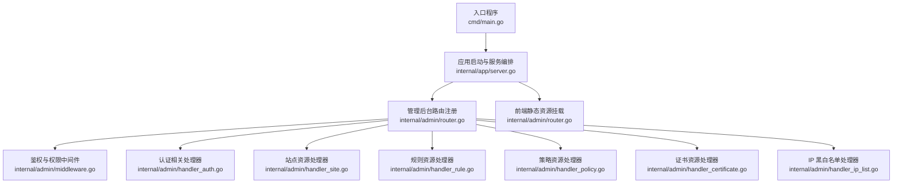
```mermaid
graph TB
A["入口程序<br/>cmd/main.go"] --> B["应用启动与服务编排<br/>internal/app/server.go"]
B --> C["管理后台路由注册<br/>internal/admin/router.go"]
C --> D["鉴权与权限中间件<br/>internal/admin/middleware.go"]
C --> E["认证相关处理器<br/>internal/admin/handler_auth.go"]
C --> F["站点资源处理器<br/>internal/admin/handler_site.go"]
C --> G["规则资源处理器<br/>internal/admin/handler_rule.go"]
C --> H["策略资源处理器<br/>internal/admin/handler_policy.go"]
C --> I["证书资源处理器<br/>internal/admin/handler_certificate.go"]
C --> J["IP 黑白名单处理器<br/>internal/admin/handler_ip_list.go"]
B --> K["前端静态资源挂载<br/>internal/admin/router.go"]
```

图表来源
- [router.go:46-179](file://internal/admin/router.go#L46-L179)
- [middleware.go:16-129](file://internal/admin/middleware.go#L16-L129)

章节来源
- [router.go:33-179](file://internal/admin/router.go#L33-L179)
- [middleware.go:16-129](file://internal/admin/middleware.go#L16-L129)

## 核心组件
- 版本化路由与资源组织
  - 基础路径：/api/v1
  - 资源：站点、证书、策略、规则、设置、安全事件、会话、API Key 等
  - 更新/删除通过"POST + 动态动作"语义替代 PUT/DELETE，简化反向代理与 CORS 配置
- 鉴权与权限
  - 支持 Bearer JWT 与 API Key 两种鉴权方式
  - 角色：admin、operator、readonly；不同角色可见与操作范围不同
- 中间件
  - 安全头设置、访问日志、鉴权校验、角色校验
- 数据模型
  - 统一的 JSON 字段命名与类型定义，便于前后端契约一致

章节来源
- [router.go:33-179](file://internal/admin/router.go#L33-L179)
- [middleware.go:16-129](file://internal/admin/middleware.go#L16-L129)

## 架构总览
控制面 API 由 Hertz 服务器承载，注册健康检查、认证、资源读取与变更等端点。认证成功后返回访问令牌与过期时间，前端通过 Bearer 头进行后续调用。管理员会话支持强制登出与黑名单机制，刷新令牌使用 HttpOnly Cookie 保障安全。

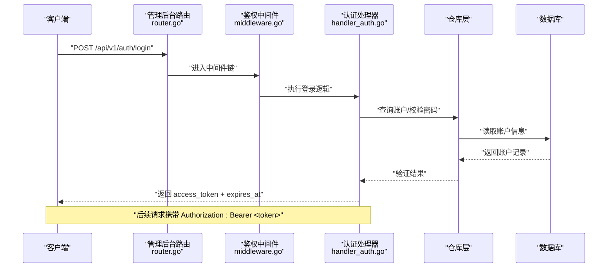
```mermaid
sequenceDiagram
participant Client as "客户端"
participant Admin as "管理后台路由<br/>router.go"
participant MW as "鉴权中间件<br/>middleware.go"
participant Auth as "认证处理器<br/>handler_auth.go"
participant Repo as "仓库层"
participant DB as "数据库"
Client->>Admin : "POST /api/v1/auth/login"
Admin->>MW : "进入中间件链"
MW->>Auth : "执行登录逻辑"
Auth->>Repo : "查询账户/校验密码"
Repo->>DB : "读取账户信息"
DB-->>Repo : "返回账户记录"
Repo-->>Auth : "验证结果"
Auth-->>Client : "返回 access_token + expires_at"
Note over Client,Auth : "后续请求携带 Authorization : Bearer <token>"
```

图表来源
- [router.go:63-65](file://internal/admin/router.go#L63-L65)
- [middleware.go:18-72](file://internal/admin/middleware.go#L18-L72)

## 详细组件分析

### 鉴权与会话管理
- 登录：接收用户名/密码，执行暴力破解检测，成功后签发访问令牌与刷新令牌（HttpOnly Cookie），并创建会话记录
- 刷新：从 Cookie 提取刷新令牌，校验后签发新访问令牌并轮换刷新令牌
- 注销：撤销刷新令牌、加入访问令牌黑名单、移除会话
- me：返回当前用户身份与角色
- 会话列表：支持按用户或全部列出；管理员可强制登出指定会话并加入黑名单

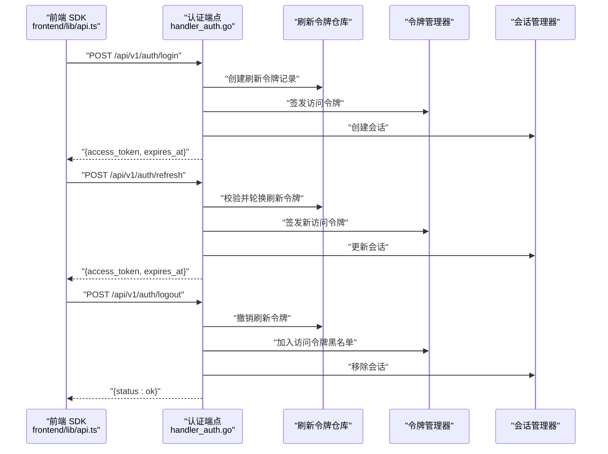
```mermaid
sequenceDiagram
participant FE as "前端 SDK<br/>frontend/lib/api.ts"
participant API as "认证端点<br/>handler_auth.go"
participant RT as "刷新令牌仓库"
participant TM as "令牌管理器"
participant SM as "会话管理器"
FE->>API : "POST /api/v1/auth/login"
API->>RT : "创建刷新令牌记录"
API->>TM : "签发访问令牌"
API->>SM : "创建会话"
API-->>FE : "{access_token, expires_at}"
FE->>API : "POST /api/v1/auth/refresh"
API->>RT : "校验并轮换刷新令牌"
API->>TM : "签发新访问令牌"
API->>SM : "更新会话"
API-->>FE : "{access_token, expires_at}"
FE->>API : "POST /api/v1/auth/logout"
API->>RT : "撤销刷新令牌"
API->>TM : "加入访问令牌黑名单"
API->>SM : "移除会话"
API-->>FE : "{status : ok}"
```

图表来源
- [api.ts:16-114](file://frontend/lib/api.ts#L16-L114)

章节来源
- [api.ts:16-114](file://frontend/lib/api.ts#L16-L114)

### 资源与路由组织
- 版本控制：/api/v1
- 资源与动作
  - 站点：GET/POST（创建）、POST /:id/update、POST /:id/delete、POST /:id/start、POST /:id/stop、GET /:id/status
  - 证书：GET/POST（创建）、POST /:id/update、POST /:id/delete
  - 策略：GET/POST（创建）、POST /:id/update、POST /:id/delete
  - 规则：GET/POST（创建）、POST /:id/update、POST /:id/delete、POST /rules/test、POST /rules/validate、POST /rules/import、GET /rules/export、GET /rules/templates
  - 设置：GET /settings、GET /settings/:key、POST /settings、POST /settings/:key、POST /settings/:key/update、POST /settings/:key/delete、GET /protection-settings、POST /protection-settings
  - IP 黑白名单：GET/POST（创建）、POST /:id/update、POST /:id/delete
  - 安全事件：GET /security-events、GET /security-events/stats、GET /security-events/timeline、GET /security-events/:id
  - 仪表盘：GET /dashboard/summary
  - API Key：GET /api-keys、POST /api-keys、POST /api-keys/:id/delete
  - 会话：GET /auth/sessions、POST /auth/sessions/force-logout
  - 当前用户：GET /auth/me
- 角色权限
  - readonly：只读访问
  - operator：可管理站点、规则、策略、证书、IP 列表、保护设置
  - admin：系统设置、API Key 管理

章节来源
- [router.go:51-179](file://internal/admin/router.go#L51-L179)

### 请求与响应格式规范
- 内容类型：application/json
- 成功响应：根据业务返回对应资源对象或集合；分页接口统一返回 items 与 total
- 空响应：204 No Content 返回空体
- 错误响应：统一为 { "error": "..." } 文本消息；部分端点返回更丰富的结构（如登录失败剩余尝试次数）
- 分页：page/page_size 查询参数，offset/limit 由工具函数计算
- 字段命名：遵循模型定义的 JSON 标签（驼峰）

章节来源
- [router.go:51-179](file://internal/admin/router.go#L51-L179)

### 错误处理机制
- 状态码
  - 200：成功
  - 201：创建成功
  - 204：删除成功（无内容）
  - 400：请求体无效、参数非法
  - 401：未认证/会话失效
  - 403：权限不足
  - 404：资源不存在
  - 429：请求过于频繁/被锁定
  - 500：服务器内部错误
- 错误信息
  - 统一为 { "error": "..." } 结构
  - 登录失败可能包含剩余尝试次数
  - 刷新失败时前端会重定向到登录页
- 异常处理流程
  - 中间件在鉴权失败时直接返回 401
  - 资源不存在返回 404
  - 业务错误返回 500 并记录日志
  - 速率限制与暴力破解返回 429

章节来源
- [middleware.go:18-96](file://internal/admin/middleware.go#L18-L96)

### 数据模型与字段定义
以下为关键资源的数据模型要点（字段名与类型均来自模型定义）：
- 站点 Site
  - host、upstream_urls、upstream_host、bind、network、enabled、tls_enabled、min_tls_version、max_tls_version、cipher_suites、alpn、policy_id、bot_protection_enabled、attack_protection_level、xff_mode、trusted_cidr、preserve_original_host、max_body_bytes、upstream_tls_skip_verify、upstream_tls_server_name、maintenance_enabled、maintenance_html、maintenance_status、block_html、block_status
- 策略 Policy
  - name
- 规则 Rule
  - name、policy_id、phase、pattern、action、priority、enabled
- 证书 Certificate
  - name、cert_pem、key_pem
- IP 列表条目 IPListEntry
  - kind（blacklist/whitelist）、value（IP/CIDR）、note、enabled
- 系统设置 SystemSettings
  - key、value
- 保护配置 ProtectionConfig
  - request_ratelimit_*、error_ratelimit_*、builtin_owasp_*、maintenance_global_*、bot_detection_enabled、auto_ban_*、waiting_room_enabled、cc_*、owasp_modules、cve_* 等

章节来源
- [router.go:51-179](file://internal/admin/router.go#L51-L179)

### 客户端 SDK 使用指南与最佳实践
- 认证
  - 使用 login 接口获取 access_token，并持久化在内存中（避免 XSS 风险）
  - 刷新：当 401 且存在刷新能力时自动调用刷新接口
  - 注销：调用 logout 清理会话与令牌
- 请求头
  - 默认 Content-Type: application/json
  - 已认证请求附加 Authorization: Bearer <token>
- 错误处理
  - 401：跳转登录
  - 403：提示权限不足
  - 429：提示请求过于频繁
  - 其他错误：提取 error 字段作为用户可见消息
- 分页
  - 使用 page 与 page_size 查询参数

章节来源
- [api.ts:16-114](file://frontend/lib/api.ts#L16-L114)

## 依赖分析
- 控制面 API 依赖
  - 鉴权中间件依赖仓库层与令牌管理器
  - 各资源处理器依赖对应仓库与重载回调
  - 应用启动时构建依赖注入容器，注册路由并挂载静态资源
- 前端依赖
  - 通过统一的 api 封装发起请求，内置鉴权与错误处理

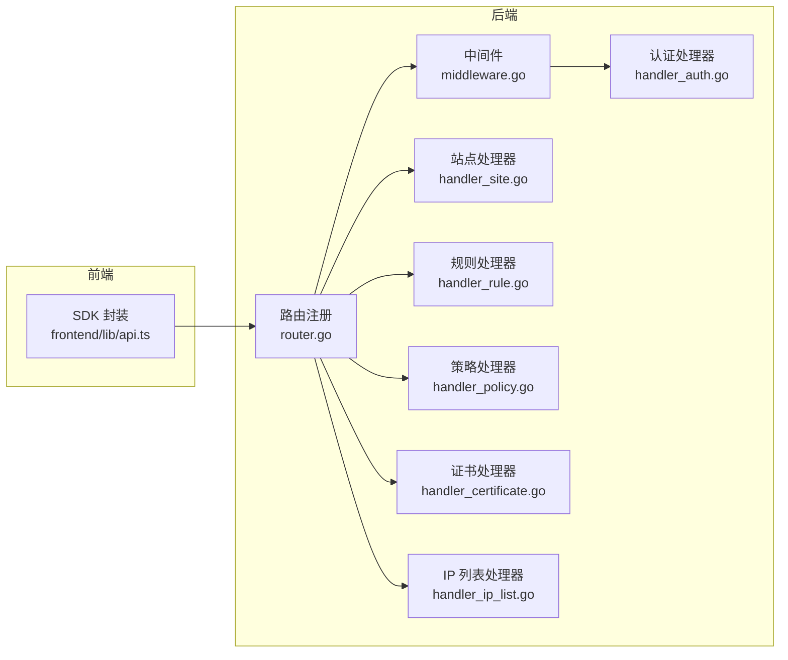
```mermaid
graph LR
subgraph "后端"
R["路由注册<br/>router.go"]
M["中间件<br/>middleware.go"]
HAuth["认证处理器<br/>handler_auth.go"]
HS["站点处理器<br/>handler_site.go"]
HR["规则处理器<br/>handler_rule.go"]
HP["策略处理器<br/>handler_policy.go"]
HC["证书处理器<br/>handler_certificate.go"]
HI["IP 列表处理器<br/>handler_ip_list.go"]
end
subgraph "前端"
FE["SDK 封装<br/>frontend/lib/api.ts"]
end
FE --> R
R --> M
M --> HAuth
R --> HS
R --> HR
R --> HP
R --> HC
R --> HI
```

图表来源
- [router.go:46-179](file://internal/admin/router.go#L46-L179)
- [middleware.go:18-96](file://internal/admin/middleware.go#L18-L96)
- [api.ts:16-114](file://frontend/lib/api.ts#L16-L114)

## 性能考虑
- 速率限制与错误率限制：基于快照中的保护配置动态配置
- IP 黑/白名单与自动封禁：运行时加载与热更新
- 会话与令牌：支持会话列表与强制登出，降低长期会话风险
- 日志与可观测性：统一访问日志与健康检查端点

章节来源
- [router.go:51-179](file://internal/admin/router.go#L51-L179)

## 故障排查指南
- 401 未认证
  - 检查 Authorization 头是否为 Bearer <token>
  - 若使用 API Key，请确认已正确传入
  - 刷新令牌是否有效（Cookie 是否存在且未过期）
- 403 权限不足
  - 确认当前用户角色是否满足端点要求
- 404 资源不存在
  - 检查 ID 是否合法，资源是否已被删除
- 429 请求过于频繁
  - 检查是否存在暴力破解防护触发
- 500 服务器错误
  - 查看服务端日志与请求 ID（X-Request-ID）

章节来源
- [middleware.go:18-96](file://internal/admin/middleware.go#L18-L96)
- [api.ts:48-87](file://frontend/lib/api.ts#L48-L87)

## 结论
本设计规范明确了 My-OpenWaf 控制面 API 的架构原则、路由组织、鉴权与权限模型、请求/响应格式、错误处理与前端 SDK 使用方法。通过版本化路径、统一的错误与日志规范、以及细粒度的角色控制，确保了 API 的一致性与安全性。建议在后续迭代中持续完善测试与文档，保持前后端契约稳定。

## 附录：完整 API 参考

### 认证与会话
- POST /api/v1/auth/login
  - 请求体：{ username, password }
  - 成功：{ access_token, expires_at, username, role }
  - 失败：400/401/429
- POST /api/v1/auth/refresh
  - 请求：Cookie my_openwaf_rt
  - 成功：{ access_token, expires_at, username, role }
  - 失败：400/401
- POST /api/v1/auth/logout
  - 成功：{ status: "ok" }
- GET /api/v1/auth/me
  - 成功：{ username, role }
- GET /api/v1/auth/sessions
  - 查询参数：all=true（仅管理员）
  - 成功：{ sessions: [...] }
- POST /api/v1/auth/sessions/force-logout
  - 请求体：{ jti }
  - 成功：{ status: "ok" }

章节来源
- [router.go:53-76](file://internal/admin/router.go#L53-L76)

### 站点管理
- GET /api/v1/sites?page&page_size
  - 成功：{ items, total }
- GET /api/v1/sites/:id
  - 成功：站点对象
- POST /api/v1/sites
  - 请求体：站点对象
  - 成功：201 + 站点对象
- POST /api/v1/sites/:id/update
  - 请求体：站点对象（含 id）
  - 成功：更新后的对象
- POST /api/v1/sites/:id/delete
  - 成功：204
- POST /api/v1/sites/:id/start
  - 成功：{ status: "running", message: "site started" }
- POST /api/v1/sites/:id/stop
  - 成功：{ status: "stopped", message: "site stopped" }
- GET /api/v1/sites/:id/status
  - 成功：{ id, host, status }

章节来源
- [router.go:81-131](file://internal/admin/router.go#L81-L131)

### 证书管理
- GET /api/v1/certificates?page&page_size
  - 成功：{ items, total }
- GET /api/v1/certificates/:id
  - 成功：证书对象
- POST /api/v1/certificates
  - 请求体：{ name, cert_pem, key_pem }
  - 成功：201 + 证书对象
- POST /api/v1/certificates/:id/update
  - 请求体：{ name, cert_pem, key_pem }
  - 成功：更新后的对象
- POST /api/v1/certificates/:id/delete
  - 成功：204

章节来源
- [router.go:89-91](file://internal/admin/router.go#L89-L91)

### 策略管理
- GET /api/v1/policies?page&page_size
  - 成功：{ items, total }
- GET /api/v1/policies/:id
  - 成功：策略对象
- POST /api/v1/policies
  - 请求体：策略对象
  - 成功：201 + 策略对象
- POST /api/v1/policies/:id/update
  - 请求体：策略对象（含 id）
  - 成功：更新后的对象
- POST /api/v1/policies/:id/delete
  - 成功：204

章节来源
- [router.go:92-94](file://internal/admin/router.go#L92-L94)

### 规则管理
- GET /api/v1/rules?page&page_size
  - 成功：{ items, total }
- GET /api/v1/rules/:id
  - 成功：规则对象
- POST /api/v1/rules
  - 请求体：规则对象
  - 成功：201 + 规则对象
- POST /api/v1/rules/:id/update
  - 请求体：规则对象（含 id）
  - 成功：更新后的对象
- POST /api/v1/rules/:id/delete
  - 成功：204
- POST /api/v1/rules/test
  - 请求体：{ pattern, client_ip, path, query, headers }
  - 成功：{ matched, kind, arg }
- POST /api/v1/rules/validate
  - 请求体：{ pattern }
  - 成功：{ valid: true/false }
- POST /api/v1/rules/import
  - 请求体：{ rules: [...] }
  - 成功：{ imported, total }
- GET /api/v1/rules/export
  - 成功：{ rules: [...] }
- GET /api/v1/rules/templates
  - 成功：模板列表

章节来源
- [router.go:95-99](file://internal/admin/router.go#L95-L99)

### 设置与保护
- GET /api/v1/settings
  - 成功：{ items, total }
- GET /api/v1/settings/:key
  - 成功：设置对象
- POST /api/v1/settings
  - 请求体：{ key, value }
  - 成功：201 + 设置对象
- POST /api/v1/settings/:key
  - 请求体：{ value }
  - 成功：设置对象
- POST /api/v1/settings/:key/update
  - 请求体：{ value }
  - 成功：设置对象
- POST /api/v1/settings/:key/delete
  - 成功：204
- GET /api/v1/protection-settings
  - 成功：保护配置对象
- POST /api/v1/protection-settings
  - 请求体：保护配置对象
  - 成功：设置对象

章节来源
- [router.go:100-104](file://internal/admin/router.go#L100-L104)

### IP 黑白名单
- GET /api/v1/ip-lists?page&page_size&kind=blacklist|whitelist
  - 成功：{ items, total, page }
- GET /api/v1/ip-lists/:id
  - 成功：IP 列表条目
- POST /api/v1/ip-lists
  - 请求体：{ kind, value, note, enabled }
  - 成功：201 + 条目对象
- POST /api/v1/ip-lists/:id/update
  - 请求体：{ kind, value, note, enabled }
  - 成功：更新后的对象
- POST /api/v1/ip-lists/:id/delete
  - 成功：204

章节来源
- [router.go:105-107](file://internal/admin/router.go#L105-L107)

### 安全事件与仪表盘
- GET /api/v1/security-events?page&page_size
  - 成功：{ items, total }
- GET /api/v1/security-events/stats
  - 成功：统计聚合
- GET /api/v1/security-events/timeline
  - 成功：时间序列
- GET /api/v1/security-events/:id
  - 成功：事件对象
- GET /api/v1/dashboard/summary
  - 成功：摘要指标

章节来源
- [router.go:108-116](file://internal/admin/router.go#L108-L116)

### API Key 管理
- GET /api/v1/api-keys
  - 成功：{ items, total }
- POST /api/v1/api-keys
  - 请求体：{ name }
  - 成功：201 + API Key 对象
- POST /api/v1/api-keys/:id/delete
  - 成功：204

章节来源
- [router.go:117-119](file://internal/admin/router.go#L117-L119)

### 健康与元数据
- GET /api/v1/health
  - 成功：健康检查状态
- GET /healthz
  - 成功：存活探针
- GET /readyz
  - 成功：就绪探针
- GET /status
  - 成功：运行状态
- GET /metrics
  - 成功：Prometheus 指标

章节来源
- [router.go:51](file://internal/admin/router.go#L51)

## 附录：测试策略与质量保证
- 单元测试
  - 针对处理器的输入解析、鉴权与权限校验、错误分支进行覆盖
- 集成测试
  - 通过端到端请求验证路由注册、中间件链路、鉴权与权限控制
- 性能测试
  - 在高并发场景下验证速率限制、会话与令牌管理的稳定性
- 安全测试
  - 暴力破解防护、429 与 401 场景、Cookie 安全属性、CORS 与安全头
- 文档与契约
  - 基于模型定义生成 OpenAPI/Swagger，确保前后端契约一致

## 附录：认证与授权机制

### JWT 令牌机制
- 令牌结构：包含注册声明与自定义字段（用户名、角色、IP 设备指纹等），默认 15 分钟有效期
- 签发与验证：使用 HS256 签名，支持主密钥与次密钥（轮换过渡期）
- 黑名单：基于 JTI 的内存与数据库持久化黑名单，定期清理过期条目
- 安全特性：IP 与设备指纹短哈希写入令牌，降低重放风险

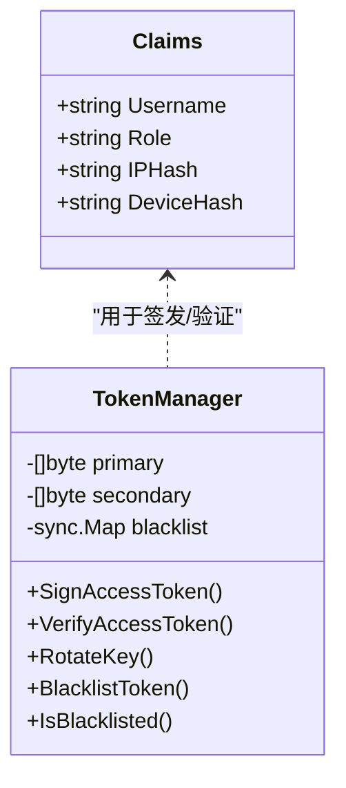
```mermaid
classDiagram
class Claims {
+string Username
+string Role
+string IPHash
+string DeviceHash
}
class TokenManager {
-[]byte primary
-[]byte secondary
-sync.Map blacklist
+SignAccessToken()
+VerifyAccessToken()
+RotateKey()
+BlacklistToken()
+IsBlacklisted()
}
Claims <.. TokenManager : "用于签发/验证"
```

图表来源
- [jwt.go:24-52](file://internal/admin/auth/jwt.go#L24-L52)
- [jwt.go:84-135](file://internal/admin/auth/jwt.go#L84-L135)
- [jwt.go:198-253](file://internal/admin/auth/jwt.go#L198-L253)

章节来源
- [jwt.go:1-295](file://internal/admin/auth/jwt.go#L1-L295)

### 刷新令牌与会话管理
- 刷新令牌：随机生成 JTI 与原始令牌，仅保存 SHA-256 哈希；每次刷新轮换并撤销旧令牌
- 会话管理：内存中维护活跃会话，包含登录时间、最后活跃时间与过期时间；支持按用户或全局查询、强制登出与清理
- 注销流程：撤销刷新令牌、加入访问令牌 JTI 黑名单、删除会话

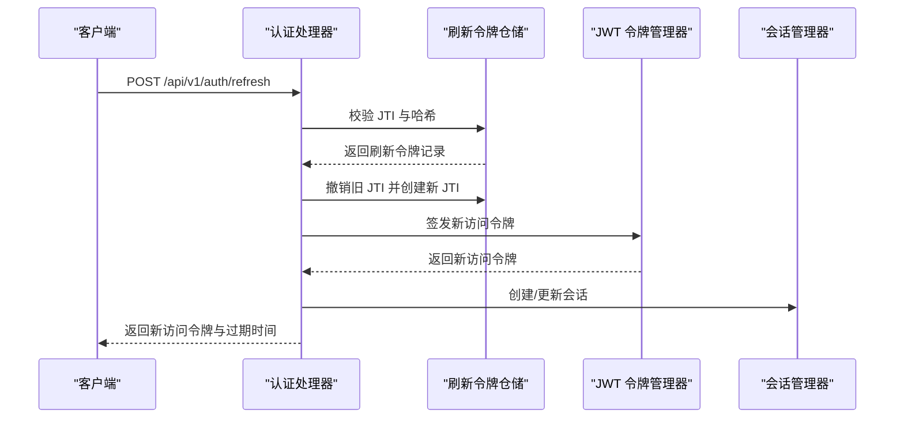
```mermaid
sequenceDiagram
participant C as "客户端"
participant H as "认证处理器"
participant RT as "刷新令牌仓储"
participant TM as "JWT 令牌管理器"
participant SM as "会话管理器"
C->>H : POST /api/v1/auth/refresh
H->>RT : 校验 JTI 与哈希
RT-->>H : 返回刷新令牌记录
H->>RT : 撤销旧 JTI 并创建新 JTI
H->>TM : 签发新访问令牌
TM-->>H : 返回新访问令牌
H->>SM : 创建/更新会话
H-->>C : 返回新访问令牌与过期时间
```

图表来源
- [api.ts:16-114](file://frontend/lib/api.ts#L16-L114)

章节来源
- [api.ts:16-114](file://frontend/lib/api.ts#L16-L114)

### API 密钥认证
- 生成：一次性显示明文密钥，后台仅存储 bcrypt 哈希；适合自动化脚本与服务间调用
- 验证：遍历所有密钥进行哈希比对，命中后更新最后使用时间

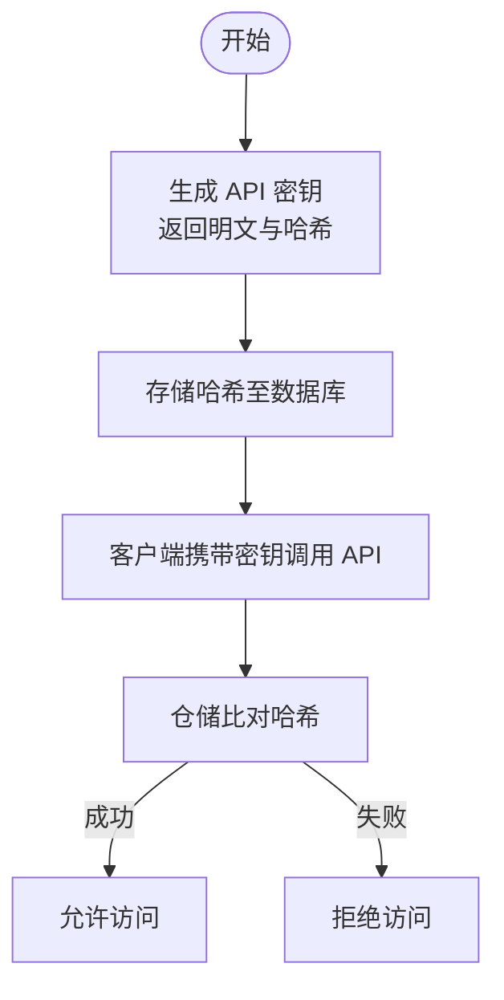
```mermaid
flowchart TD
Start(["开始"]) --> Gen["生成 API 密钥<br/>返回明文与哈希"]
Gen --> Store["存储哈希至数据库"]
Store --> Use["客户端携带密钥调用 API"]
Use --> Verify["仓储比对哈希"]
Verify --> |成功| Allow["允许访问"]
Verify --> |失败| Deny["拒绝访问"]
```

图表来源
- [admin_api_key.go:30-63](file://internal/store/repository/admin_api_key.go#L30-L63)

章节来源
- [admin_api_key.go:1-68](file://internal/store/repository/admin_api_key.go#L1-L68)

### 认证中间件与权限检查
- 统一认证中间件：跳过健康检查与认证接口；优先尝试 JWT 验证，失败则回退到 API 密钥验证；设置认证上下文（用户名、方法、角色、JTI）
- 权限中间件：基于角色白名单的访问控制，支持多角色
- 访问日志与安全头：统一记录请求信息与设置安全响应头

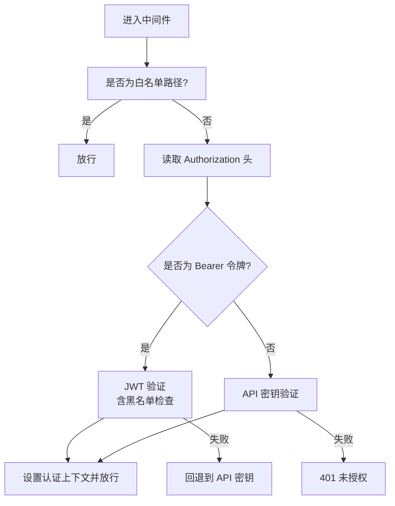
```mermaid
flowchart TD
A["进入中间件"] --> W["是否为白名单路径?"]
W --> |是| Next["放行"]
W --> |否| Auth["读取 Authorization 头"]
Auth --> HasBearer{"是否为 Bearer 令牌?"}
HasBearer --> |是| VerifyJWT["JWT 验证<br/>含黑名单检查"]
HasBearer --> |否| VerifyAPI["API 密钥验证"]
VerifyJWT --> OK["设置认证上下文并放行"]
VerifyAPI --> OK
VerifyJWT --> |失败| Fallback["回退到 API 密钥"]
VerifyAPI --> |失败| Abort["401 未授权"]
```

图表来源
- [middleware.go:18-72](file://internal/admin/middleware.go#L18-L72)

章节来源
- [middleware.go:1-130](file://internal/admin/middleware.go#L1-L130)

### 授权策略与访问控制
- 角色常量：管理员、操作员、只读
- 权限中间件：以角色白名单方式限制访问，支持多角色匹配
- 当前实现：API 密钥默认赋予管理员角色

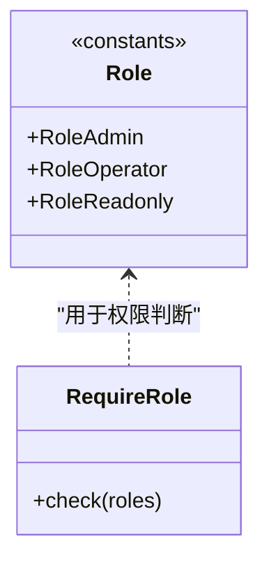
```mermaid
classDiagram
class Role {
<<constants>>
+RoleAdmin
+RoleOperator
+RoleReadonly
}
class RequireRole {
+check(roles)
}
Role <.. RequireRole : "用于权限判断"
```

图表来源
- [middleware.go:74-96](file://internal/admin/middleware.go#L74-L96)

章节来源
- [middleware.go:74-96](file://internal/admin/middleware.go#L74-L96)

### 暴力破解防护
- 记录结构：按 IP 与 IP+用户名分别统计失败次数与最后失败时间
- 锁定逻辑：超过阈值后进入锁定期，期间拒绝登录；锁定期结束后自动清理
- 清理循环：定期清理长时间无活动的记录

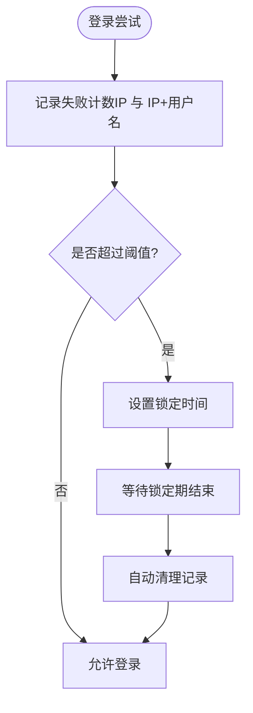
```mermaid
flowchart TD
Start(["登录尝试"]) --> Inc["记录失败计数IP 与 IP+用户名"]
Inc --> Check{"是否超过阈值?"}
Check --> |否| Allow["允许登录"]
Check --> |是| Lock["设置锁定时间"]
Lock --> Wait["等待锁定期结束"]
Wait --> Clean["自动清理记录"]
Clean --> Allow
```

图表来源
- [bruteforce.go:45-72](file://internal/admin/auth/bruteforce.go#L45-L72)
- [bruteforce.go:140-154](file://internal/admin/auth/bruteforce.go#L140-L154)

章节来源
- [bruteforce.go:1-154](file://internal/admin/auth/bruteforce.go#L1-L154)

### 前端认证集成
- 令牌存储：访问令牌存储于模块级变量，避免持久化到 sessionStorage 以降低 XSS 风险
- 自动刷新：401 时自动调用刷新接口，成功后重试原请求；刷新失败则跳转登录页
- 登录与登出：登录成功设置访问令牌；登出时调用后端注销接口并清除本地令牌
- 鉴权守卫：检查本地是否存在访问令牌，否则跳转登录页并支持提示信息

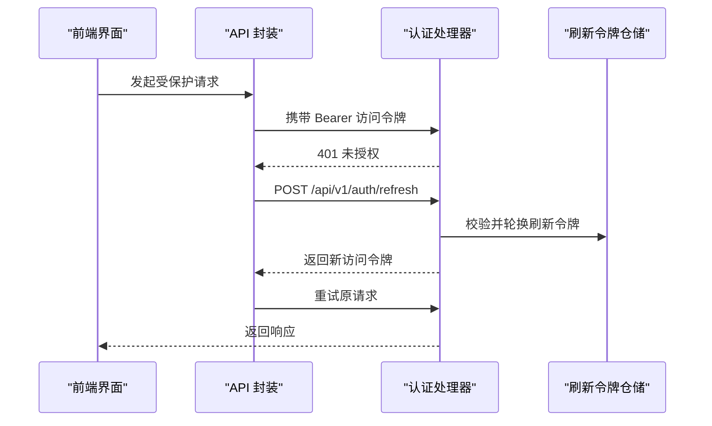
```mermaid
sequenceDiagram
participant UI as "前端界面"
participant API as "API 封装"
participant AUTH as "认证处理器"
participant RT as "刷新令牌仓储"
UI->>API : 发起受保护请求
API->>AUTH : 携带 Bearer 访问令牌
AUTH-->>API : 401 未授权
API->>AUTH : POST /api/v1/auth/refresh
AUTH->>RT : 校验并轮换刷新令牌
AUTH-->>API : 返回新访问令牌
API->>AUTH : 重试原请求
AUTH-->>UI : 返回响应
```

图表来源
- [api.ts:16-88](file://frontend/lib/api.ts#L16-L88)

章节来源
- [api.ts:1-317](file://frontend/lib/api.ts#L1-L317)

## 附录：依赖关系分析

### 认证处理器依赖
- 认证处理器依赖：账户仓储、刷新令牌仓储、JWT 令牌管理器、暴力破解检测器、会话管理器、数据库连接
- 仓储聚合：集中管理各实体仓储，便于注入与复用
- 数据模型：定义管理员账户、API 密钥、刷新令牌、活跃会话、令牌黑名单等实体

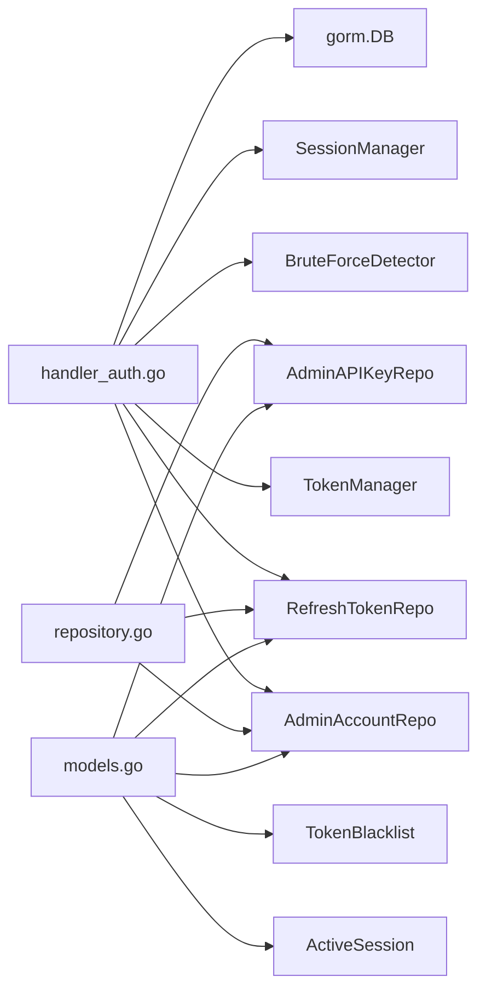
```mermaid
graph LR
H["handler_auth.go"] --> AR["AdminAccountRepo"]
H --> RR["RefreshTokenRepo"]
H --> TM["TokenManager"]
H --> BF["BruteForceDetector"]
H --> SM["SessionManager"]
H --> DB["gorm.DB"]
Repo["repository.go"] --> AR
Repo --> RR
Repo --> AK["AdminAPIKeyRepo"]
Models["models.go"] --> AR
Models --> RR
Models --> AK
Models --> AS["ActiveSession"]
Models --> TB["TokenBlacklist"]
```

图表来源
- [repository.go:24-42](file://internal/store/repository/repository.go#L24-L42)

章节来源
- [repository.go:1-43](file://internal/store/repository/repository.go#L1-L43)

## 附录：性能考量
- 内存与数据库结合：令牌黑名单与活跃会话采用内存缓存 + 定期清理，减少数据库压力
- 并发安全：使用互斥锁保护共享状态，保证高并发下的正确性
- 过期清理：定时任务清理过期条目，避免无限增长
- 建议优化：
  - 对频繁查询的表添加合适索引（如 JTI、用户名、过期时间）
  - 在高并发场景下考虑引入 Redis 缓存黑名单与会话，进一步降低数据库负载
  - 刷新令牌轮换时批量清理过期记录，避免碎片化

## 附录：故障排除指南
- 401 未授权
  - 前端：若本地存在访问令牌且刷新失败，将清除令牌并跳转登录页；检查刷新接口是否正常返回新令牌
  - 后端：确认 JWT 验证通过、JTI 未被加入黑名单；检查 API 密钥是否有效
- 403 禁止访问
  - 检查当前用户角色是否满足所需权限；权限中间件基于角色白名单进行判定
- 429 请求过多
  - 暴力破解防护触发，检查 IP 与用户名组合的失败次数与锁定剩余时间
- 刷新失败
  - 确认刷新令牌 Cookie 是否存在且格式正确；核对 JTI 与哈希是否匹配；检查仓储中是否已撤销或过期
- 注销无效
  - 确认刷新令牌已被撤销；访问令牌 JTI 已加入黑名单；会话已移除

## 附录：请求与响应格式规范

### 统一响应格式与错误处理
- 成功响应
  - 一般返回 200，携带业务数据对象或数组
  - 列表接口统一使用分页包装对象：{"items":[...],"total":n,...}
  - 创建资源返回 201；删除资源返回 204（无内容）
- 错误响应
  - 使用标准 HTTP 状态码映射错误语义
  - 错误响应体为 JSON 对象，包含 "error" 字段描述错误信息
  - 特殊场景：401 未授权（含刷新失败）、403 禁止访问、429 请求过快（暴力破解锁定）

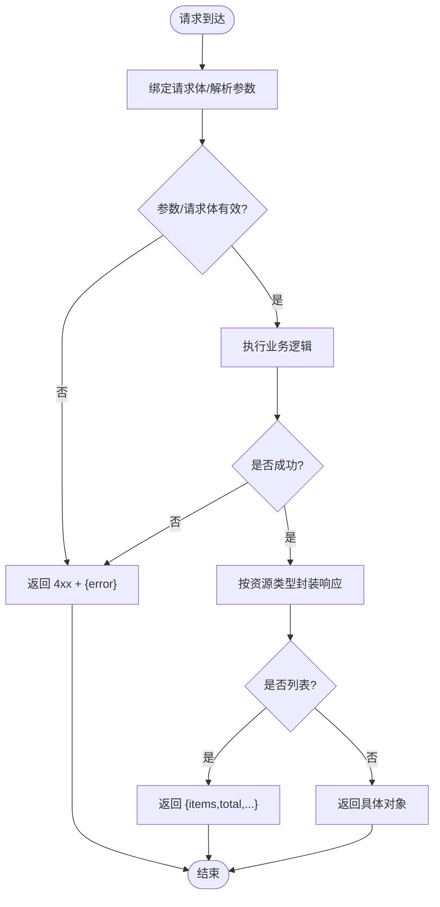
```mermaid
flowchart TD
Start(["请求到达"]) --> Bind["绑定请求体/解析参数"]
Bind --> Valid{"参数/请求体有效?"}
Valid --> |否| ErrResp["返回 4xx + {error}"]
Valid --> |是| Biz["执行业务逻辑"]
Biz --> Result{"是否成功?"}
Result --> |否| ErrResp
Result --> |是| Wrap["按资源类型封装响应"]
Wrap --> List{"是否列表?"}
List --> |是| Page["返回 {items,total,...}"]
List --> |否| Item["返回具体对象"]
Page --> End(["结束"])
Item --> End
ErrResp --> End
```

图表来源
- [router.go:51-179](file://internal/admin/router.go#L51-L179)

章节来源
- [router.go:51-179](file://internal/admin/router.go#L51-L179)

### 请求参数传递方式
- 查询参数（GET）
  - 列表接口通用分页参数：page、page_size
  - 其他筛选参数：如安全事件接口支持 action、phase、category、client_ip、host、path、rule_id、since、until
- 路径参数（GET/POST）
  - 资源 ID：/sites/:id、/rules/:id 等
- 请求体（POST/PUT）
  - JSON 结构体，遵循各资源模型字段定义
  - 验证失败时返回 400 与错误信息

章节来源
- [router.go:51-179](file://internal/admin/router.go#L51-L179)

### 数据类型定义与验证规则
- 基础类型
  - 数值：整型（uint、int）；时间：RFC3339 字符串；布尔：true/false
  - 字符串：长度约束见模型定义；枚举值见模型常量
- 字段约束与必填
  - 必填字段：模型注解中带 not null 的字段
  - 默认值：模型注解中带 default 的字段
  - 枚举值：如 RuleAction、RulePhase、IPListKind 等
- 验证规则
  - 路由层参数解析：非法 ID 返回 400
  - 规则模式：ValidateRule 校验模式前缀与复合 JSON 结构
  - 客户端类型：前端定义了分页与查询参数接口类型，确保调用一致性

章节来源
- [router.go:51-179](file://internal/admin/router.go#L51-L179)

### 分页机制与排序规则
- 分页参数
  - page：默认 1，最小 1
  - page_size：默认 20，最小 1，最大 200
- 计算逻辑
  - offset = (page - 1) × page_size
  - limit = page_size
- 排序规则
  - 列表接口通常按 id 升序排序
- 响应结构
  - 列表统一返回 {items:[...], total:n, ...}，其中 total 为总数

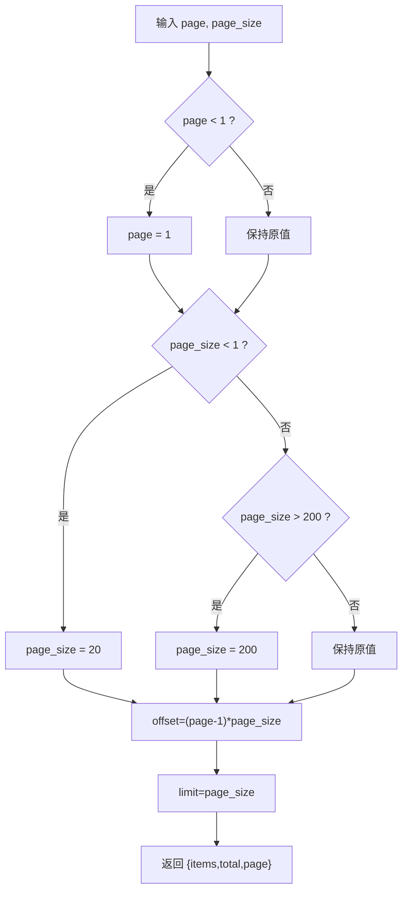
```mermaid
flowchart TD
A["输入 page, page_size"] --> B{"page < 1 ?"}
B --> |是| C["page = 1"]
B --> |否| D["保持原值"]
C --> E{"page_size < 1 ?"}
D --> E
E --> |是| F["page_size = 20"]
E --> |否| G{"page_size > 200 ?"}
G --> |是| H["page_size = 200"]
G --> |否| I["保持原值"]
F --> J["offset=(page-1)*page_size"]
H --> J
I --> J
J --> K["limit=page_size"]
K --> L["返回 {items,total,page}"]
```

图表来源
- [router.go:51-179](file://internal/admin/router.go#L51-L179)

章节来源
- [router.go:51-179](file://internal/admin/router.go#L51-L179)

### 认证与会话管理
- 登录：POST /api/v1/auth/login，返回 access_token、expires_at、username、role
- 刷新：POST /api/v1/auth/refresh，使用 HttpOnly Cookie 刷新令牌
- 登出：POST /api/v1/auth/logout，撤销刷新令牌与加入访问令牌黑名单
- 当前用户：GET /api/v1/auth/me
- 会话管理：GET /api/v1/auth/sessions；管理员强制登出指定会话

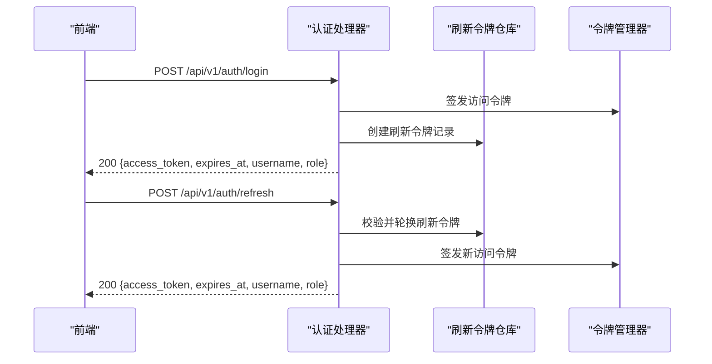
```mermaid
sequenceDiagram
participant FE as "前端"
participant AUTH as "认证处理器"
participant RT as "刷新令牌仓库"
participant TM as "令牌管理器"
FE->>AUTH : POST /api/v1/auth/login
AUTH->>TM : 签发访问令牌
AUTH->>RT : 创建刷新令牌记录
AUTH-->>FE : 200 {access_token, expires_at, username, role}
FE->>AUTH : POST /api/v1/auth/refresh
AUTH->>RT : 校验并轮换刷新令牌
AUTH->>TM : 签发新访问令牌
AUTH-->>FE : 200 {access_token, expires_at, username, role}
```

图表来源
- [api.ts:16-114](file://frontend/lib/api.ts#L16-L114)

章节来源
- [api.ts:16-114](file://frontend/lib/api.ts#L16-L114)

### 资源操作（示例：站点、规则、安全事件）
- 站点
  - 列表：GET /api/v1/sites（支持分页与总数）
  - 获取：GET /api/v1/sites/:id
  - 新增：POST /api/v1/sites
  - 更新：POST /api/v1/sites/:id/update
  - 删除：POST /api/v1/sites/:id/delete
  - 启停：POST /api/v1/sites/:id/start, /:id/stop
- 规则
  - 列表：GET /api/v1/rules（支持分页与总数）
  - 获取：GET /api/v1/rules/:id
  - 新增/更新/删除：POST /api/v1/rules/:id/{create|update|delete}
  - 测试：POST /api/v1/rules/test（请求体包含 pattern、client_ip、path、query、headers）
  - 导入/导出：POST /api/v1/rules/import、/rules/export
- 安全事件
  - 列表：GET /api/v1/security-events（支持多维过滤与分页）
  - 统计：GET /api/v1/security-events/stats
  - 时间线：GET /api/v1/security-events/timeline

章节来源
- [router.go:51-179](file://internal/admin/router.go#L51-L179)

### 健康检查与重载
- 健康检查：GET /api/v1/health
- 重载快照：POST /api/v1/reload

章节来源
- [router.go:51-179](file://internal/admin/router.go#L51-L179)

## 附录：路由设计规范

### 版本控制策略
- 统一前缀：所有受控 API 使用 `/api/v1` 前缀，便于未来升级到 `/api/v2`
- 健康检查：独立于 `/api/v1`，便于外部探针快速判断服务状态
- 数据面：独立于控制面，按站点热启停，不参与控制面路由

章节来源
- [router.go:52-53](file://internal/admin/router.go#L52-L53)

### 资源命名约定与路径设计原则
- 资源集合：使用复数形式，如 `/sites`, `/rules`, `/settings`
- 单个资源：使用 `/:id`，如 `/sites/:id`
- 动作扩展：对于不常用或需要简化代理配置的场景，采用 POST 动作模拟更新/删除，如 `/sites/:id/update`, `/sites/:id/delete`
- 导出/导入/同步：使用动词短语，如 `/rules/export`, `/rules/import`, `/cve-rules/sync`
- 统计/聚合：使用名词短语，如 `/security-events/stats`, `/security-events/timeline`

章节来源
- [router.go:83-206](file://internal/admin/router.go#L83-L206)

### 路由注册机制
- 全局中间件：在管理服务器实例上挂载安全头与访问日志中间件
- 认证路由：无需鉴权，直接注册登录、刷新、登出接口
- 受控 API 分组：使用 `/api/v1` 分组，并在组内应用鉴权与角色中间件
- 静态文件处理：通过 NoRoute 回退，区分 API 与静态资源，SPA 路由交由前端处理

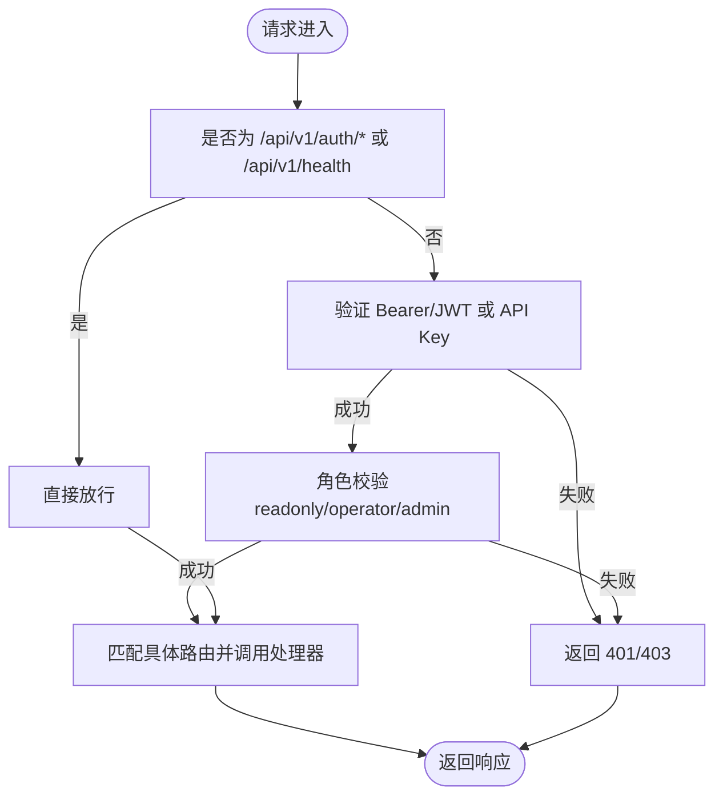
```mermaid
flowchart TD
Start(["请求进入"]) --> CheckAuth["是否为 /api/v1/auth/* 或 /api/v1/health"]
CheckAuth --> |是| Pass["直接放行"]
CheckAuth --> |否| Auth["验证 Bearer/JWT 或 API Key"]
Auth --> |失败| Deny["返回 401/403"]
Auth --> |成功| Role["角色校验readonly/operator/admin"]
Role --> |失败| Deny
Role --> |成功| Route["匹配具体路由并调用处理器"]
Pass --> Route
Route --> End(["返回响应"])
Deny --> End
```

图表来源
- [router.go:69-210](file://internal/admin/router.go#L69-L210)

章节来源
- [router.go:48-210](file://internal/admin/router.go#L48-L210)

### HTTP 方法使用规范
- GET：用于查询列表、详情、统计、聚合等只读操作
- POST：用于创建、更新、删除、刷新令牌、强制登出等写入或动作型操作
- PUT/DELETE：未在控制面路由中使用，避免复杂代理与 CORS 配置
- 特殊操作：更新/删除通过 POST + 路径动作（如 `/update`, `/delete`）表达，保持简洁

章节来源
- [router.go:37-42](file://internal/admin/router.go#L37-L42)
- [router.go:142-182](file://internal/admin/router.go#L142-L182)

### 路由安全考虑
- 安全头：统一设置 X-Content-Type-Options、X-Frame-Options、Referrer-Policy、Content-Security-Policy
- 认证：支持 Bearer JWT 与 API Key，白名单跳过健康检查与认证接口
- 会话管理：基于 HttpOnly Cookie 的刷新令牌，支持强制登出与会话列表
- 角色权限：readonly/operator/admin 三级角色，精确到资源与动作
- 前端集成：前端通过 Bearer 头传递访问令牌，刷新令牌使用 Cookie

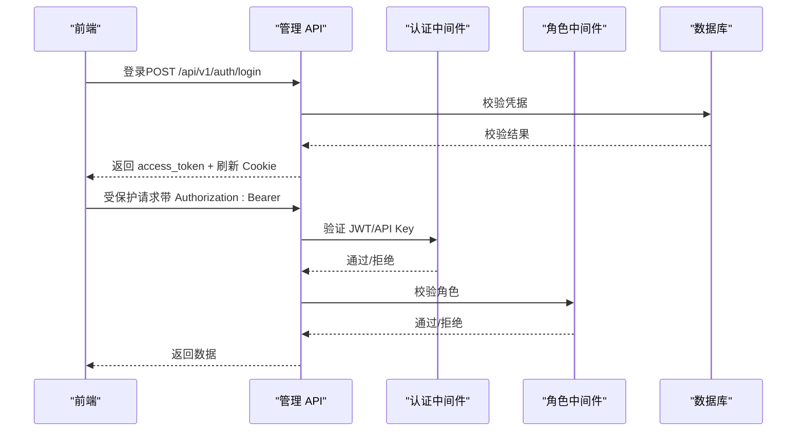
```mermaid
sequenceDiagram
participant FE as "前端"
participant API as "管理 API"
participant Auth as "认证中间件"
participant Role as "角色中间件"
participant DB as "数据库"
FE->>API : 登录POST /api/v1/auth/login
API->>DB : 校验凭据
DB-->>API : 校验结果
API-->>FE : 返回 access_token + 刷新 Cookie
FE->>API : 受保护请求带 Authorization : Bearer
API->>Auth : 验证 JWT/API Key
Auth-->>API : 通过/拒绝
API->>Role : 校验角色
Role-->>API : 通过/拒绝
API-->>FE : 返回数据
```

图表来源
- [api.ts:90-114](file://frontend/lib/api.ts#L90-L114)

章节来源
- [middleware.go:121-129](file://internal/admin/middleware.go#L121-L129)
- [api.ts:31-88](file://frontend/lib/api.ts#L31-L88)

### 静态文件处理与 SPA 回退
- 静态文件解析：根据请求路径尝试多种候选文件，优先返回 index.html 实现 SPA 路由
- 内容类型映射：根据文件扩展名设置合适的 Content-Type
- 回退策略：NoRoute 将非 API 路径交由静态文件处理器，API 路径返回 404

章节来源
- [router.go:208-235](file://internal/admin/router.go#L208-L235)

### 前端路由与认证流程
- 前端通过 api.ts 统一封装请求，自动处理 401 自动刷新与错误提示
- AuthGuard 在客户端进行登录态校验与重定向
- 前端仅调用受控 API，静态资源由后端托管

章节来源
- [api.ts:16-88](file://frontend/lib/api.ts#L16-L88)

## 附录：错误处理机制

### 错误类型与错误码分类
- 业务错误
  - 登录失败、账户锁定、权限不足、会话过期等，通过 HTTP 状态码与统一错误字段表达
  - 示例：登录处理器对暴力破解进行临时锁定并返回剩余尝试次数；权限不足返回明确错误信息
- 系统错误
  - 令牌生成失败、存储失败、初始化失败等，通常映射为 500 并记录详细错误
- 网络错误
  - 前端对 401/403/429 进行特殊处理，429 可能来自上游或内置速率限制器

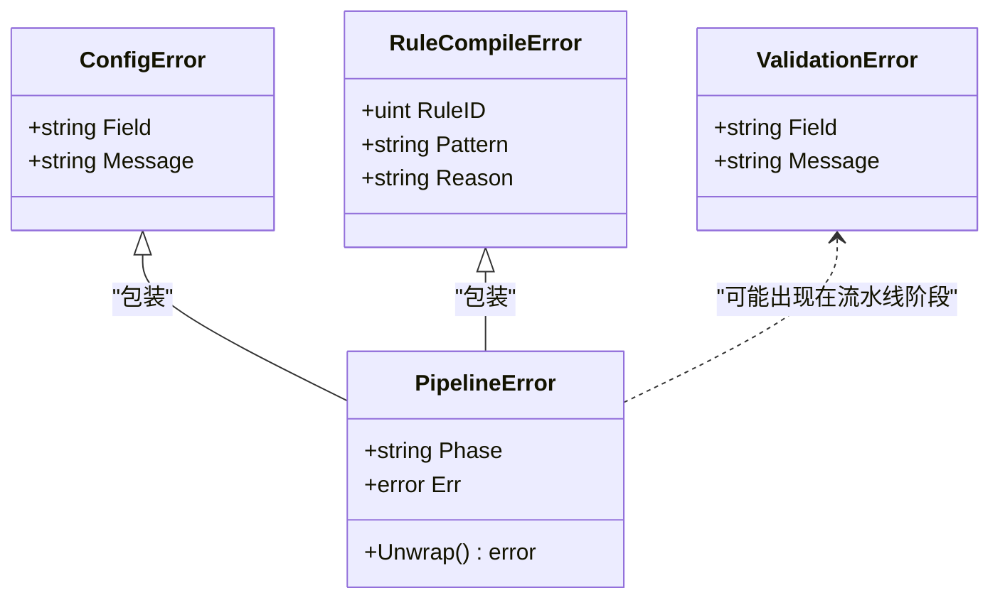
```mermaid
classDiagram
class ConfigError {
+string Field
+string Message
}
class RuleCompileError {
+uint RuleID
+string Pattern
+string Reason
}
class PipelineError {
+string Phase
+error Err
+Unwrap() error
}
class ValidationError {
+string Field
+string Message
}
ConfigError <|-- PipelineError : "包装"
RuleCompileError <|-- PipelineError : "包装"
ValidationError <.. PipelineError : "可能出现在流水线阶段"
```

图表来源
- [jwt.go:160-177](file://internal/admin/auth/jwt.go#L160-L177)
- [jwt.go:179-194](file://internal/admin/auth/jwt.go#L179-L194)

章节来源
- [jwt.go:160-194](file://internal/admin/auth/jwt.go#L160-L194)

### 错误响应格式与异常处理流程
- 统一错误字段
  - error：字符串形式的错误描述；部分场景包含 retry_after_secs、remaining_attempts 等上下文字段
  - 前端解析 JSON 并抛出可读错误，避免直接显示内部细节
- 异常处理流程
  - 前端：401 自动刷新令牌并重试；401 刷新失败则清空本地令牌并跳转登录；403/429 抛出错误供 UI 显示
  - 后端：中间件设置 X-Request-ID 并记录访问日志；处理器按业务逻辑返回 4xx/5xx 并携带统一错误字段

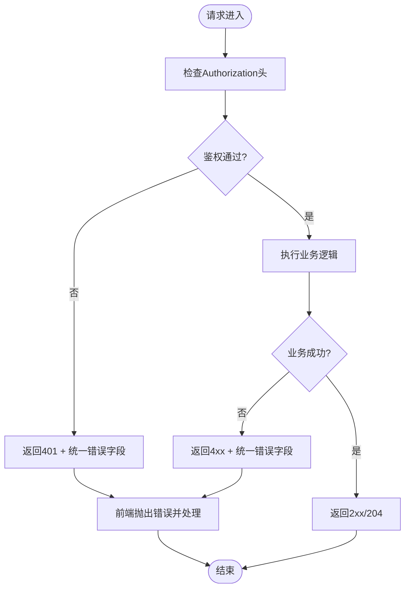
```mermaid
flowchart TD
Start(["请求进入"]) --> CheckAuth["检查Authorization头"]
CheckAuth --> AuthOK{"鉴权通过?"}
AuthOK --> |否| Return401["返回401 + 统一错误字段"]
AuthOK --> |是| HandleBiz["执行业务逻辑"]
HandleBiz --> BizOK{"业务成功?"}
BizOK --> |否| Return4xx["返回4xx + 统一错误字段"]
BizOK --> |是| Return200["返回2xx/204"]
Return401 --> FEThrow["前端抛出错误并处理"]
Return4xx --> FEThrow
Return200 --> End(["结束"])
FEThrow --> End
```

图表来源
- [middleware.go:1-130](file://internal/admin/middleware.go#L1-L130)

章节来源
- [middleware.go:1-130](file://internal/admin/middleware.go#L1-L130)

### 错误日志记录
- 日志级别与输出
  - 通过环境变量控制级别（DEBUG/INFO/WARN/ERROR），默认 INFO；支持彩色输出与终端检测
- 上下文信息
  - 所有日志包含模块 section、请求 ID、方法、路径、状态码、耗时等，便于关联追踪
- 敏感数据保护
  - 日志系统不包含明文密码、令牌等敏感信息；错误响应也仅返回通用错误描述

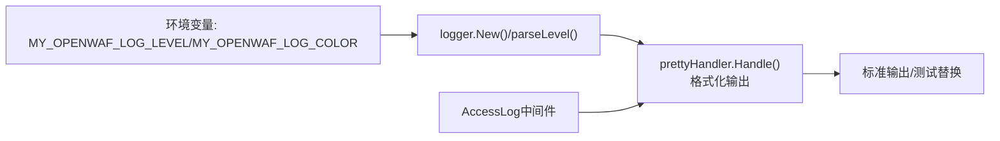
```mermaid
graph LR
ENV["环境变量: MY_OPENWAF_LOG_LEVEL/MY_OPENWAF_LOG_COLOR"] --> Logger["logger.New()/parseLevel()"]
Logger --> Pretty["prettyHandler.Handle()<br/>格式化输出"]
AccessLog["AccessLog中间件"] --> Pretty
Pretty --> Output["标准输出/测试替换"]
```

图表来源
- [middleware.go:98-119](file://internal/admin/middleware.go#L98-L119)

章节来源
- [middleware.go:98-119](file://internal/admin/middleware.go#L98-L119)

### 错误恢复策略
- 重试机制
  - 前端对 401 场景尝试刷新令牌并重试一次；若刷新失败则清空本地令牌并引导登录
- 降级处理
  - 事件写入器采用异步批处理与缓冲队列，避免阻塞热路径；当缓冲满时记录警告并丢弃事件，保证系统稳定
  - 响应缓存采用分片互斥与 LRU-like 结构，降低锁竞争并支持 TTL 过期清理
- 故障转移
  - 应用启动时根据快照动态增删站点监听器，检测配置漂移并自动重启受影响实例，确保服务连续性
  - 速率限制器与 IP 黑名单/白名单在保护配置变更时热更新，实现动态防护

```mermaid
sequenceDiagram
participant FE as "前端API客户端"
participant AuthH as "认证处理器"
participant TM as "令牌管理器"
participant DB as "数据库"
FE->>AuthH : 请求(带Authorization)
AuthH->>TM : 验证访问令牌
TM-->>AuthH : 失败
FE->>AuthH : 刷新接口
AuthH->>DB : 查询刷新令牌
DB-->>AuthH : 返回
AuthH->>TM : 生成新访问令牌
TM-->>AuthH : 成功
AuthH-->>FE : 返回新令牌
FE->>AuthH : 重试原请求
AuthH-->>FE : 正常响应
```

图表来源
- [api.ts:16-88](file://frontend/lib/api.ts#L16-L88)

章节来源
- [api.ts:1-317](file://frontend/lib/api.ts#L1-L317)

### 客户端错误处理最佳实践与调试技巧
- 最佳实践
  - 使用统一的 API 客户端封装，集中处理 401/403/429 与非 2xx 场景
  - 将错误信息转换为用户可读提示，避免暴露内部实现细节
  - 在 UI 中展示请求 ID，便于用户反馈与后台检索
- 调试技巧
  - 前端页面提供"诊断信息"区域，包含请求 ID 等字段，指导用户提供准确线索
  - 后端中间件设置 X-Request-ID 并记录访问日志，结合数据库安全事件表进行交叉验证

章节来源
- [api.ts:1-317](file://frontend/lib/api.ts#L1-L317)
- [middleware.go:98-119](file://internal/admin/middleware.go#L98-L119)

## 附录：错误码与语义建议
- 400：请求体绑定失败、参数非法（统一返回 error 字段）
- 401：缺少/无效/过期令牌（前端自动刷新，刷新失败则清空令牌并跳转登录）
- 403：权限不足（RBAC 不足）
- 404：资源不存在
- 409：资源冲突
- 429：请求/错误频率过高（返回 retry_after_secs 或 remaining_attempts）
- 500：系统内部错误（记录详细错误并返回通用描述）
