# 认证授权机制

<cite>
**本文档引用的文件**
- [jwt.go](file://internal/admin/auth/jwt.go)
- [middleware.go](file://internal/admin/middleware.go)
- [handler_auth.go](file://internal/admin/handler_auth.go)
- [models.go](file://internal/store/models.go)
- [admin_account.go](file://internal/store/repository/admin_account.go)
- [admin_api_key.go](file://internal/store/repository/admin_api_key.go)
- [refresh_token.go](file://internal/store/repository/refresh_token.go)
- [repository.go](file://internal/store/repository/repository.go)
- [session.go](file://internal/admin/auth/session.go)
- [bruteforce.go](file://internal/admin/auth/bruteforce.go)
- [api.ts](file://frontend/lib/api.ts)
- [auth-guard.tsx](file://frontend/components/auth-guard.tsx)
- [page.tsx](file://frontend/app/login/page.tsx)
- [main.go](file://cmd/main.go)
</cite>

## 目录
1. [简介](#简介)
2. [项目结构](#项目结构)
3. [核心组件](#核心组件)
4. [架构总览](#架构总览)
5. [详细组件分析](#详细组件分析)
6. [依赖关系分析](#依赖关系分析)
7. [性能考量](#性能考量)
8. [故障排除指南](#故障排除指南)
9. [结论](#结论)
10. [附录](#附录)

## 简介
本文件系统性阐述 My-OpenWaf 的双重认证体系与授权策略，涵盖以下要点：
- 双重认证：基于 JWT 的短期访问令牌与基于刷新令牌的会话续期机制；同时支持 API 密钥认证（用于自动化场景）。
- 完整流程：登录、刷新令牌、注销与用户信息查询。
- 授权策略：基于角色的访问控制（RBAC），包含管理员、操作员与只读角色。
- 中间件实现：统一认证中间件、权限检查中间件与会话管理。
- 安全最佳实践：令牌存储、传输加密、安全配置与防护措施。
- 客户端集成：前端如何处理令牌、自动刷新与错误处理。

## 项目结构
认证相关代码主要分布在后端 internal 目录与前端 frontend 目录：
- 后端
  - 认证核心：internal/admin/auth（JWT、会话、暴力破解检测）
  - 认证路由与处理器：internal/admin（登录、刷新、注销、会话管理）
  - 数据模型与仓库：internal/store（数据库实体与仓储层）
  - 前端集成：frontend/lib（API 封装）、frontend/components（鉴权守卫）、frontend/app/login（登录页）
- 入口程序：cmd/main.go 调用应用启动

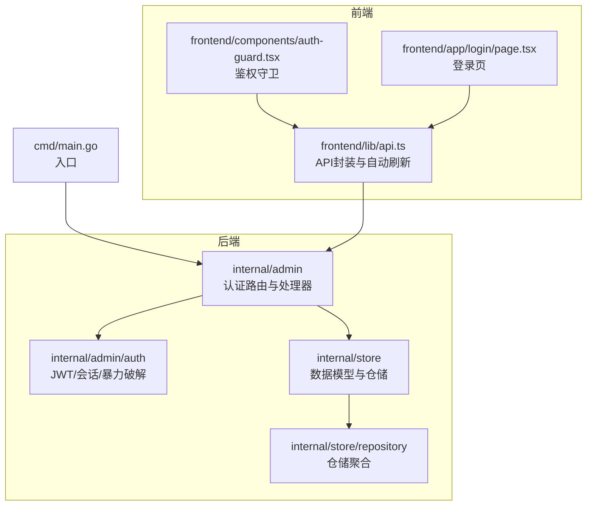

**图表来源**
- [main.go:1-10](file://cmd/main.go#L1-L10)
- [handler_auth.go:1-351](file://internal/admin/handler_auth.go#L1-L351)
- [jwt.go:1-295](file://internal/admin/auth/jwt.go#L1-L295)
- [models.go:1-456](file://internal/store/models.go#L1-L456)
- [repository.go:1-43](file://internal/store/repository/repository.go#L1-L43)
- [api.ts:1-317](file://frontend/lib/api.ts#L1-L317)
- [auth-guard.tsx:1-40](file://frontend/components/auth-guard.tsx#L1-L40)
- [page.tsx:1-76](file://frontend/app/login/page.tsx#L1-L76)

**章节来源**
- [main.go:1-10](file://cmd/main.go#L1-L10)
- [handler_auth.go:1-351](file://internal/admin/handler_auth.go#L1-L351)
- [jwt.go:1-295](file://internal/admin/auth/jwt.go#L1-L295)
- [models.go:1-456](file://internal/store/models.go#L1-L456)
- [repository.go:1-43](file://internal/store/repository/repository.go#L1-L43)
- [api.ts:1-317](file://frontend/lib/api.ts#L1-L317)
- [auth-guard.tsx:1-40](file://frontend/components/auth-guard.tsx#L1-L40)
- [page.tsx:1-76](file://frontend/app/login/page.tsx#L1-L76)

## 核心组件
- JWT 令牌管理器：负责签发短期访问令牌、验证令牌、密钥轮换与令牌黑名单。
- 刷新令牌：使用哈希存储在数据库，支持轮换与撤销。
- API 密钥：面向自动化场景，一次性展示明文密钥，后续仅能通过哈希校验。
- 会话管理器：内存中维护活跃会话，并持久化到数据库，支持按用户或全局列出、强制登出与清理。
- 暴力破解防护：基于 IP 与 IP+用户名的失败计数与锁定时间。
- 认证中间件：统一处理 Bearer JWT 与 API 密钥认证，跳过健康检查与认证接口。
- 权限中间件：基于角色的访问控制，支持多角色白名单。
- 前端 API 封装：模块级内存存储访问令牌，自动刷新与错误处理。

**章节来源**
- [jwt.go:1-295](file://internal/admin/auth/jwt.go#L1-L295)
- [handler_auth.go:1-351](file://internal/admin/handler_auth.go#L1-L351)
- [admin_api_key.go:1-68](file://internal/store/repository/admin_api_key.go#L1-L68)
- [refresh_token.go:1-43](file://internal/store/repository/refresh_token.go#L1-L43)
- [session.go:1-208](file://internal/admin/auth/session.go#L1-L208)
- [bruteforce.go:1-154](file://internal/admin/auth/bruteforce.go#L1-L154)
- [middleware.go:1-130](file://internal/admin/middleware.go#L1-L130)
- [api.ts:1-317](file://frontend/lib/api.ts#L1-L317)

## 架构总览
整体认证架构采用“双因子”设计：
- 用户名/密码登录 → 生成短期 JWT 访问令牌 + 刷新令牌 Cookie
- 访问令牌过期 → 使用刷新令牌轮换新的访问令牌
- 注销 → 撤销刷新令牌、加入访问令牌 JTI 黑名单、删除会话
- API 密钥认证：直接使用一次性密钥进行 API 调用
- RBAC 授权：中间件根据角色限制访问

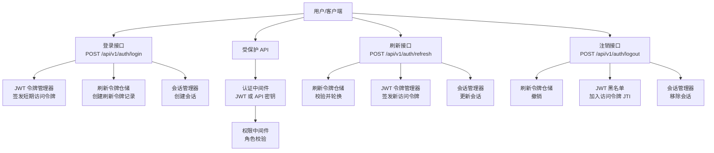

**图表来源**
- [handler_auth.go:32-122](file://internal/admin/handler_auth.go#L32-L122)
- [handler_auth.go:125-192](file://internal/admin/handler_auth.go#L125-L192)
- [handler_auth.go:195-221](file://internal/admin/handler_auth.go#L195-L221)
- [jwt.go:84-135](file://internal/admin/auth/jwt.go#L84-L135)
- [refresh_token.go:15-32](file://internal/store/repository/refresh_token.go#L15-L32)
- [session.go:44-74](file://internal/admin/auth/session.go#L44-L74)
- [middleware.go:18-72](file://internal/admin/middleware.go#L18-L72)

## 详细组件分析

### JWT 令牌机制
- 令牌结构：包含注册声明与自定义字段（用户名、角色、IP 设备指纹等），默认 15 分钟有效期。
- 签发与验证：使用 HS256 签名，支持主密钥与次密钥（轮换过渡期）。
- 黑名单：基于 JTI 的内存与数据库持久化黑名单，定期清理过期条目。
- 安全特性：IP 与设备指纹短哈希写入令牌，降低重放风险。

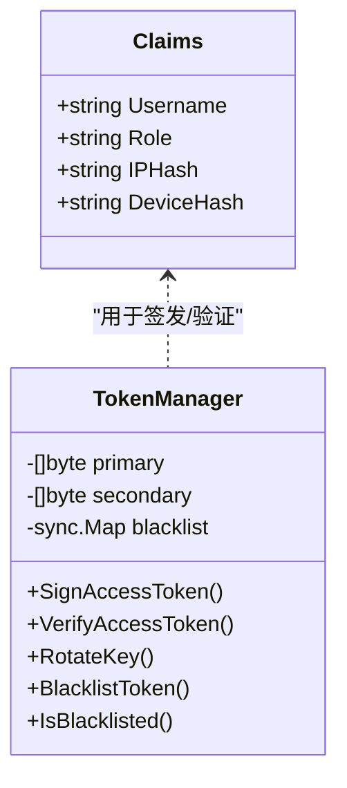

**图表来源**
- [jwt.go:24-52](file://internal/admin/auth/jwt.go#L24-L52)
- [jwt.go:84-135](file://internal/admin/auth/jwt.go#L84-L135)
- [jwt.go:198-253](file://internal/admin/auth/jwt.go#L198-L253)

**章节来源**
- [jwt.go:1-295](file://internal/admin/auth/jwt.go#L1-L295)

### 刷新令牌与会话管理
- 刷新令牌：随机生成 JTI 与原始令牌，仅保存 SHA-256 哈希；每次刷新轮换并撤销旧令牌。
- 会话管理：内存中维护活跃会话，包含登录时间、最后活跃时间与过期时间；支持按用户或全局查询、强制登出与清理。
- 注销流程：撤销刷新令牌、加入访问令牌 JTI 黑名单、删除会话。

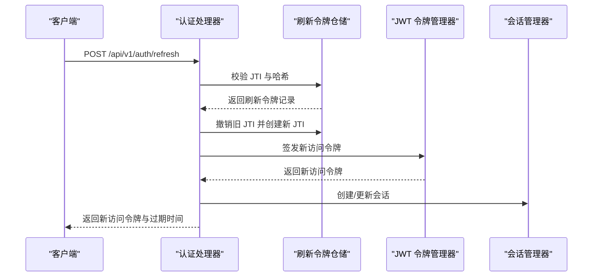

**图表来源**
- [handler_auth.go:125-192](file://internal/admin/handler_auth.go#L125-L192)
- [refresh_token.go:24-32](file://internal/store/repository/refresh_token.go#L24-L32)
- [jwt.go:84-109](file://internal/admin/auth/jwt.go#L84-L109)
- [session.go:44-74](file://internal/admin/auth/session.go#L44-L74)

**章节来源**
- [handler_auth.go:125-192](file://internal/admin/handler_auth.go#L125-L192)
- [refresh_token.go:1-43](file://internal/store/repository/refresh_token.go#L1-L43)
- [session.go:1-208](file://internal/admin/auth/session.go#L1-L208)

### API 密钥认证
- 生成：一次性显示明文密钥，后台仅存储 bcrypt 哈希；适合自动化脚本与服务间调用。
- 验证：遍历所有密钥进行哈希比对，命中后更新最后使用时间。

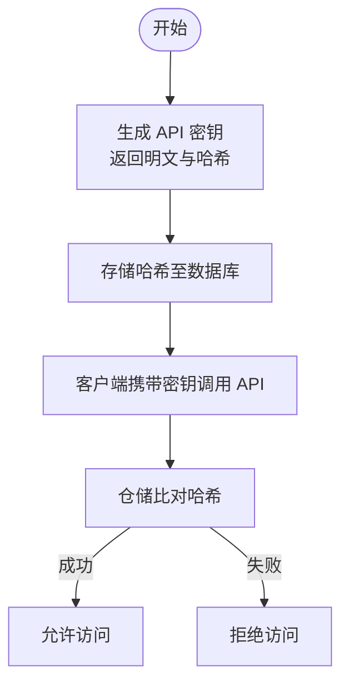

**图表来源**
- [admin_api_key.go:30-63](file://internal/store/repository/admin_api_key.go#L30-L63)

**章节来源**
- [admin_api_key.go:1-68](file://internal/store/repository/admin_api_key.go#L1-L68)

### 认证中间件与权限检查
- 统一认证中间件：跳过健康检查与认证接口；优先尝试 JWT 验证，失败则回退到 API 密钥验证；设置认证上下文（用户名、方法、角色、JTI）。
- 权限中间件：基于角色白名单的访问控制，支持多角色。
- 访问日志与安全头：统一记录请求信息与设置安全响应头。

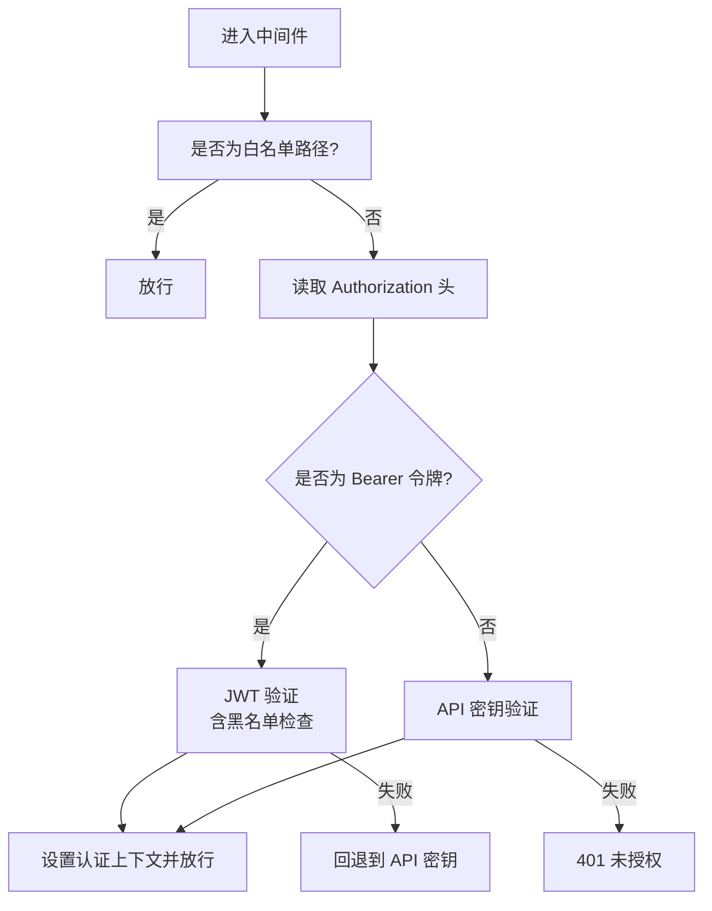

**图表来源**
- [middleware.go:18-72](file://internal/admin/middleware.go#L18-L72)

**章节来源**
- [middleware.go:1-130](file://internal/admin/middleware.go#L1-L130)

### 授权策略与访问控制
- 角色常量：管理员、操作员、只读。
- 权限中间件：以角色白名单方式限制访问，支持多角色匹配。
- 当前实现：API 密钥默认赋予管理员角色。

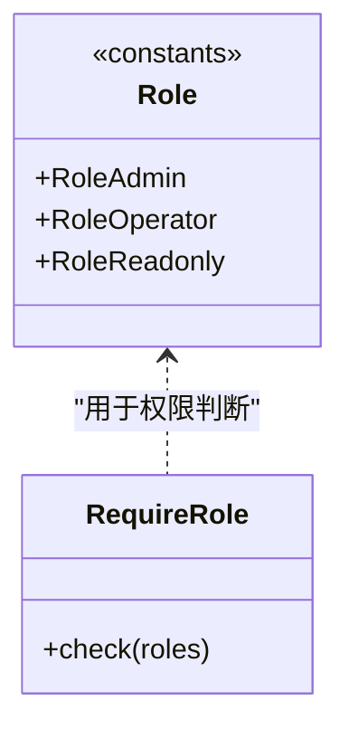

**图表来源**
- [models.go:391-397](file://internal/store/models.go#L391-L397)
- [middleware.go:74-96](file://internal/admin/middleware.go#L74-L96)

**章节来源**
- [models.go:391-397](file://internal/store/models.go#L391-L397)
- [middleware.go:74-96](file://internal/admin/middleware.go#L74-L96)

### 暴力破解防护
- 记录结构：按 IP 与 IP+用户名分别统计失败次数与最后失败时间。
- 锁定逻辑：超过阈值后进入锁定期，期间拒绝登录；锁定期结束后自动清理。
- 清理循环：定期清理长时间无活动的记录。

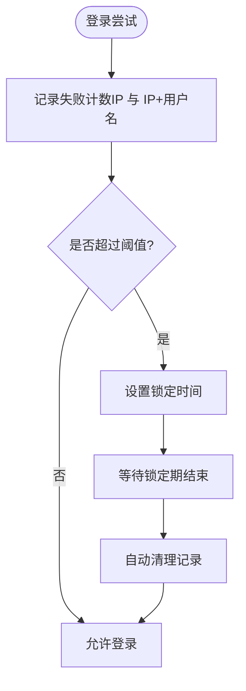

**图表来源**
- [bruteforce.go:45-72](file://internal/admin/auth/bruteforce.go#L45-L72)
- [bruteforce.go:140-154](file://internal/admin/auth/bruteforce.go#L140-L154)

**章节来源**
- [bruteforce.go:1-154](file://internal/admin/auth/bruteforce.go#L1-L154)

### 前端认证集成
- 令牌存储：访问令牌存储于模块级变量，避免持久化到 sessionStorage 以降低 XSS 风险。
- 自动刷新：401 时自动调用刷新接口，成功后重试原请求；刷新失败则跳转登录页。
- 登录与登出：登录成功设置访问令牌；登出时调用后端注销接口并清除本地令牌。
- 鉴权守卫：检查本地是否存在访问令牌，否则跳转登录页并支持提示信息。

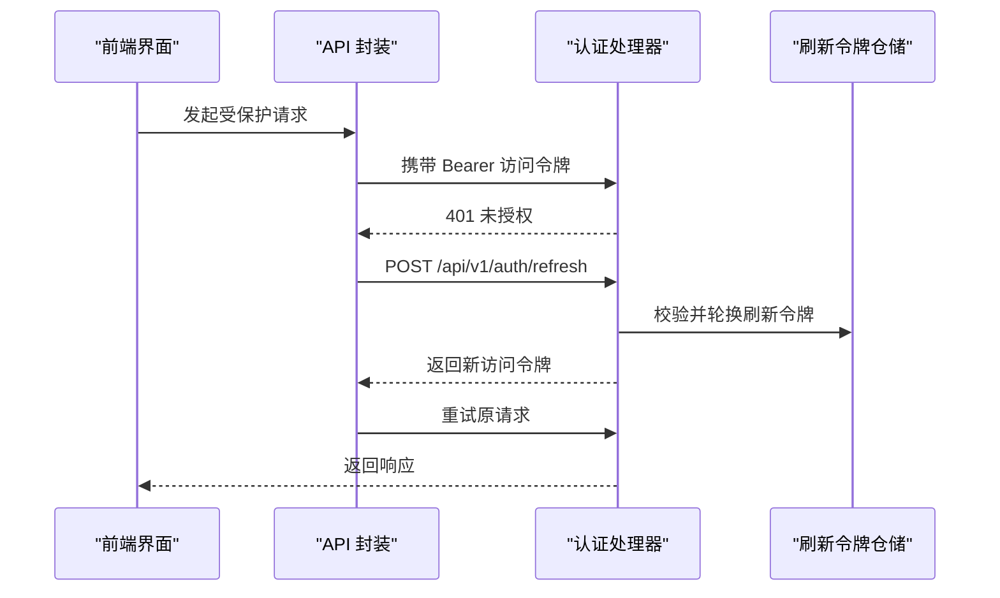

**图表来源**
- [api.ts:16-88](file://frontend/lib/api.ts#L16-L88)
- [handler_auth.go:125-192](file://internal/admin/handler_auth.go#L125-L192)

**章节来源**
- [api.ts:1-317](file://frontend/lib/api.ts#L1-L317)
- [auth-guard.tsx:1-40](file://frontend/components/auth-guard.tsx#L1-L40)
- [page.tsx:1-76](file://frontend/app/login/page.tsx#L1-L76)

## 依赖关系分析
- 认证处理器依赖：账户仓储、刷新令牌仓储、JWT 令牌管理器、暴力破解检测器、会话管理器、数据库连接。
- 仓储聚合：集中管理各实体仓储，便于注入与复用。
- 数据模型：定义管理员账户、API 密钥、刷新令牌、活跃会话、令牌黑名单等实体。

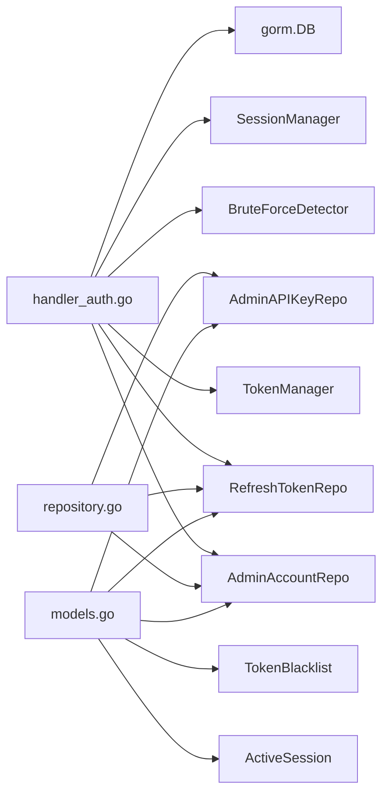

**图表来源**
- [handler_auth.go:17-25](file://internal/admin/handler_auth.go#L17-L25)
- [repository.go:24-42](file://internal/store/repository/repository.go#L24-L42)
- [models.go:170-189](file://internal/store/models.go#L170-L189)
- [models.go:377-389](file://internal/store/models.go#L377-L389)
- [models.go:356-364](file://internal/store/models.go#L356-L364)

**章节来源**
- [handler_auth.go:1-351](file://internal/admin/handler_auth.go#L1-L351)
- [repository.go:1-43](file://internal/store/repository/repository.go#L1-L43)
- [models.go:1-456](file://internal/store/models.go#L1-L456)

## 性能考量
- 内存与数据库结合：令牌黑名单与活跃会话采用内存缓存 + 定期清理，减少数据库压力。
- 并发安全：使用互斥锁保护共享状态，保证高并发下的正确性。
- 过期清理：定时任务清理过期条目，避免无限增长。
- 建议优化：
  - 对频繁查询的表添加合适索引（如 JTI、用户名、过期时间）。
  - 在高并发场景下考虑引入 Redis 缓存黑名单与会话，进一步降低数据库负载。
  - 刷新令牌轮换时批量清理过期记录，避免碎片化。

[本节为通用建议，无需特定文件来源]

## 故障排除指南
- 401 未授权
  - 前端：若本地存在访问令牌且刷新失败，将清除令牌并跳转登录页；检查刷新接口是否正常返回新令牌。
  - 后端：确认 JWT 验证通过、JTI 未被加入黑名单；检查 API 密钥是否有效。
- 403 禁止访问
  - 检查当前用户角色是否满足所需权限；权限中间件基于角色白名单进行判定。
- 429 请求过多
  - 暴力破解防护触发，检查 IP 与用户名组合的失败次数与锁定剩余时间。
- 刷新失败
  - 确认刷新令牌 Cookie 是否存在且格式正确；核对 JTI 与哈希是否匹配；检查仓储中是否已撤销或过期。
- 注销无效
  - 确认刷新令牌已被撤销；访问令牌 JTI 已加入黑名单；会话已移除。

**章节来源**
- [api.ts:48-88](file://frontend/lib/api.ts#L48-L88)
- [handler_auth.go:44-73](file://internal/admin/handler_auth.go#L44-L73)
- [middleware.go:74-96](file://internal/admin/middleware.go#L74-L96)
- [bruteforce.go:45-72](file://internal/admin/auth/bruteforce.go#L45-L72)

## 结论
该认证体系通过 JWT 短期令牌 + 刷新令牌的组合实现了安全高效的会话管理，配合 API 密钥认证满足自动化需求；RBAC 与中间件确保了细粒度的访问控制；前端通过模块级内存存储与自动刷新机制提升了用户体验与安全性。建议在生产环境中启用 HTTPS、合理配置安全头、定期轮换密钥并监控异常登录行为。

[本节为总结，无需特定文件来源]

## 附录

### 认证流程图（登录/刷新/注销）
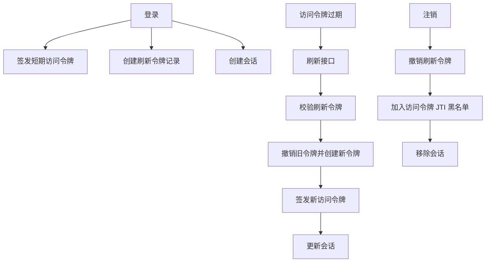

**图表来源**
- [handler_auth.go:32-122](file://internal/admin/handler_auth.go#L32-L122)
- [handler_auth.go:125-192](file://internal/admin/handler_auth.go#L125-L192)
- [handler_auth.go:195-221](file://internal/admin/handler_auth.go#L195-L221)
- [jwt.go:198-253](file://internal/admin/auth/jwt.go#L198-L253)
- [refresh_token.go:24-32](file://internal/store/repository/refresh_token.go#L24-L32)
- [session.go:76-85](file://internal/admin/auth/session.go#L76-L85)