# 认证授权机制

> [返回 管理 API 系统](../管理 API 系统.md)

<cite>
**本文引用的文件**
- [jwt.go](file://internal/admin/auth/jwt.go)
- [session.go](file://internal/admin/auth/session.go)
- [middleware.go](file://internal/admin/middleware.go)
- [admin_api_key.go](file://internal/store/repository/admin_api_key.go)
- [refresh_token.go](file://internal/store/repository/refresh_token.go)
- [apikey.go](file://internal/admin/system/apikey.go)
- [bruteforce.go](file://internal/admin/auth/bruteforce.go)
- [JWT 认证机制.md](file://docs/安全机制/JWT 认证机制.md)
- [API 密钥管理.md](file://docs/安全机制/API 密钥管理.md)
- [会话管理.md](file://docs/安全机制/会话管理.md)
</cite>

## 目录
1. [简介](#简介)
2. [项目结构](#项目结构)
3. [核心组件](#核心组件)
4. [架构概览](#架构概览)
5. [详细组件分析](#详细组件分析)
6. [依赖关系分析](#依赖关系分析)
7. [性能考虑](#性能考虑)
8. [故障排除指南](#故障排除指南)
9. [结论](#结论)
10. [附录](#附录)

## 简介

My-OpenWaf 项目实现了完整的认证授权机制，采用多层安全防护设计。系统同时支持基于 JWT 的短期访问令牌和基于 API 密钥的认证方式，提供了企业级的安全保障。

**核心特性：**
- 基于 HMAC 的对称加密 JWT 认证
- 短期访问令牌（15分钟）和长期刷新令牌（7天）
- 多重安全验证机制
- 密钥轮换支持
- 令牌黑名单管理
- 会话管理功能
- 暴力破解防护
- 基于角色的访问控制（RBAC）

## 项目结构

认证授权机制在项目中的组织结构：

```mermaid
graph TB
subgraph "认证核心"
A[jwt.go<br/>JWT 核心实现]
B[session.go<br/>会话管理]
C[bruteforce.go<br/>暴力破解防护]
D[middleware.go<br/>认证中间件]
end
subgraph "API 密钥管理"
E[admin_api_key.go<br/>API 密钥仓库]
F[apikey.go<br/>API 密钥控制器]
end
subgraph "数据存储"
G[refresh_token.go<br/>刷新令牌仓库]
H[models.go<br/>数据模型]
end
subgraph "前端集成"
I[frontend/lib/api.ts<br/>API 客户端]
J[frontend/app/login/page.tsx<br/>登录页面]
K[frontend/app/(dashboard)/api-keys/page.tsx<br/>API 密钥页面]
end
A --> D
B --> D
D --> E
E --> G
F --> E
I --> D
J --> I
K --> I
```

**图表来源**
- [jwt.go:1-295](file://internal/admin/auth/jwt.go#L1-L295)
- [session.go:1-209](file://internal/admin/auth/session.go#L1-L209)
- [middleware.go:1-130](file://internal/admin/middleware.go#L1-L130)
- [admin_api_key.go:1-68](file://internal/store/repository/admin_api_key.go#L1-L68)
- [apikey.go:1-60](file://internal/admin/system/apikey.go#L1-L60)

## 核心组件

### JWT Claims 结构

JWT 令牌的声明结构包含了标准声明和自定义声明：

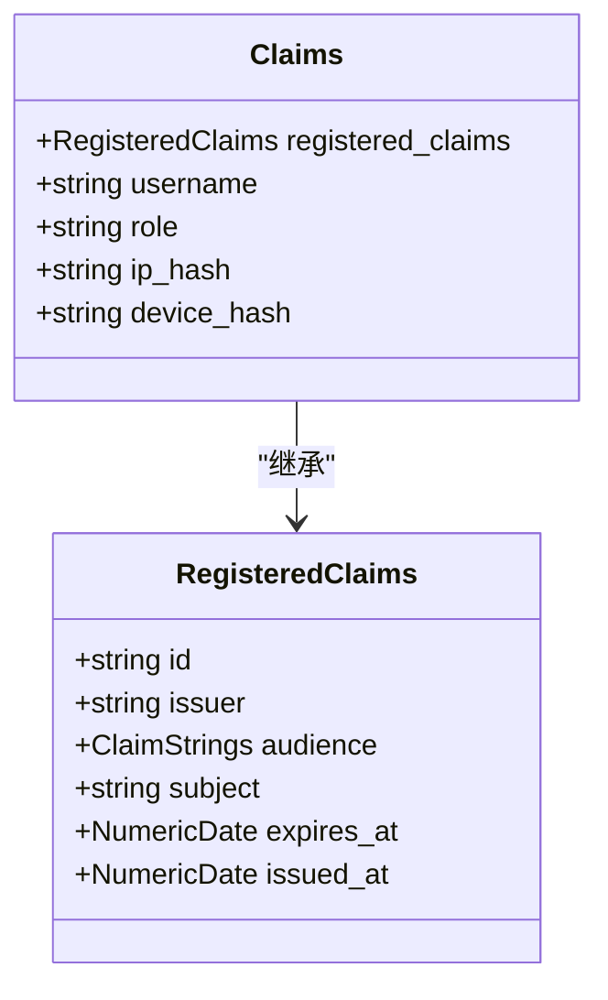

**图表来源**
- [jwt.go:24-31](file://internal/admin/auth/jwt.go#L24-L31)

### TokenManager 类

TokenManager 是 JWT 认证的核心管理器，负责令牌的签名、验证、密钥轮换和黑名单管理：

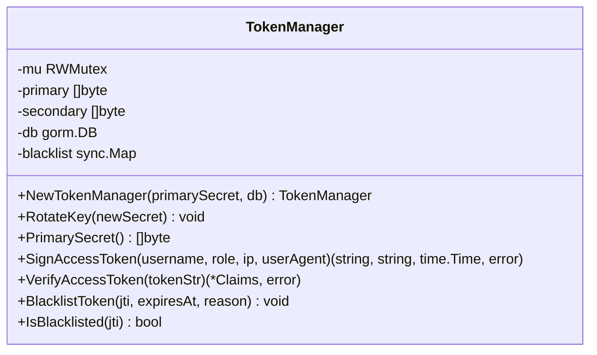

**图表来源**
- [jwt.go:43-80](file://internal/admin/auth/jwt.go#L43-L80)

**章节来源**
- [jwt.go:24-80](file://internal/admin/auth/jwt.go#L24-L80)

## 架构概览

JWT 认证系统的整体架构设计：

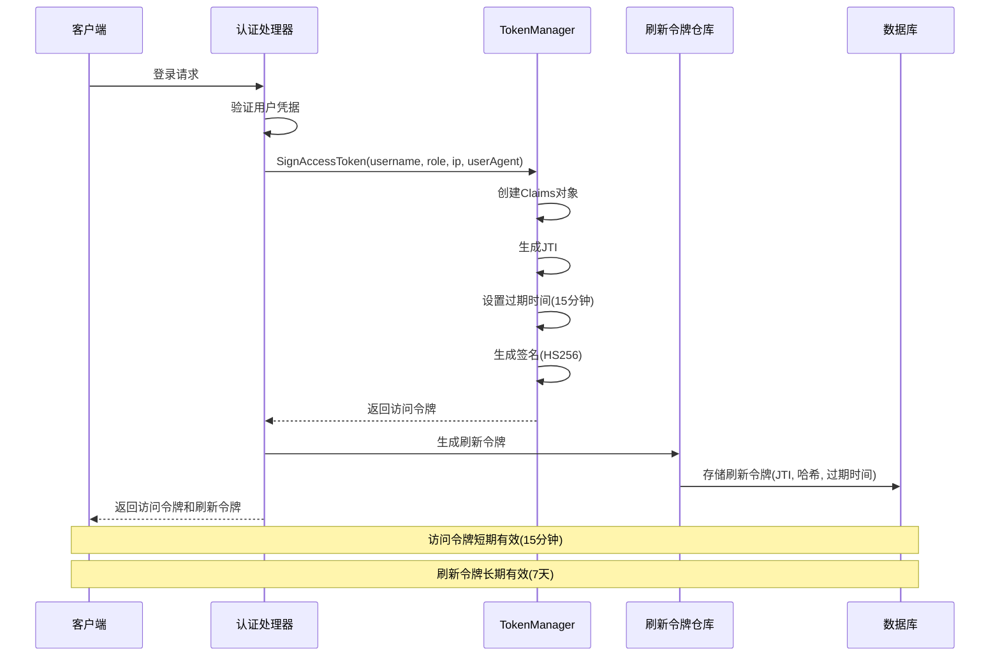

**图表来源**
- [jwt.go:84-109](file://internal/admin/auth/jwt.go#L84-L109)
- [refresh_token.go:15-32](file://internal/store/repository/refresh_token.go#L15-L32)

## 详细组件分析

### 访问令牌生成流程

访问令牌的生成过程包含以下关键步骤：

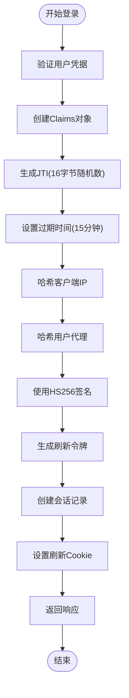

**图表来源**
- [jwt.go:84-109](file://internal/admin/auth/jwt.go#L84-L109)

### 令牌验证机制

令牌验证过程支持多重验证和安全检查：

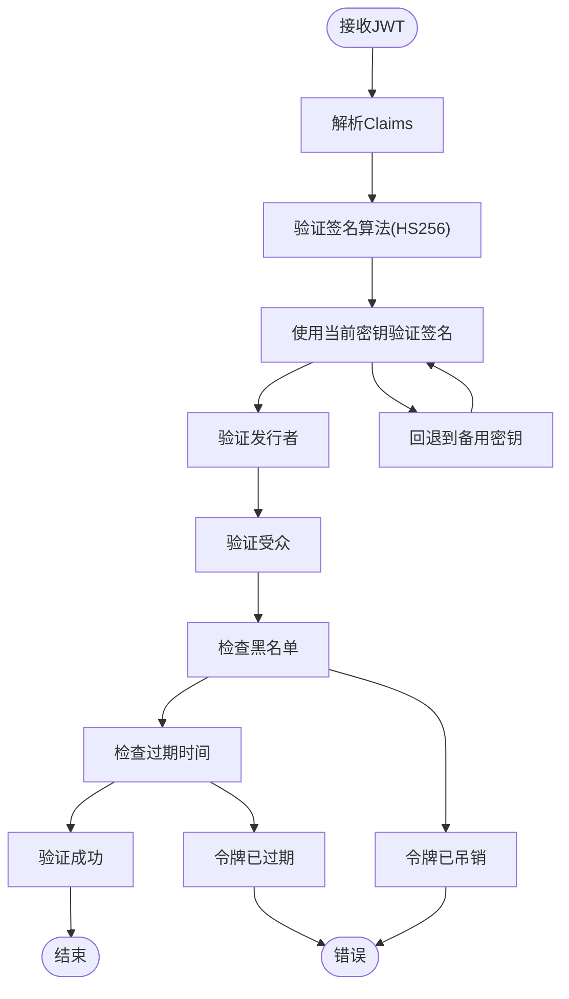

**图表来源**
- [jwt.go:111-154](file://internal/admin/auth/jwt.go#L111-L154)
- [middleware.go:44-57](file://internal/admin/middleware.go#L44-L57)

### 刷新令牌机制

刷新令牌提供了长期访问能力的安全管理：

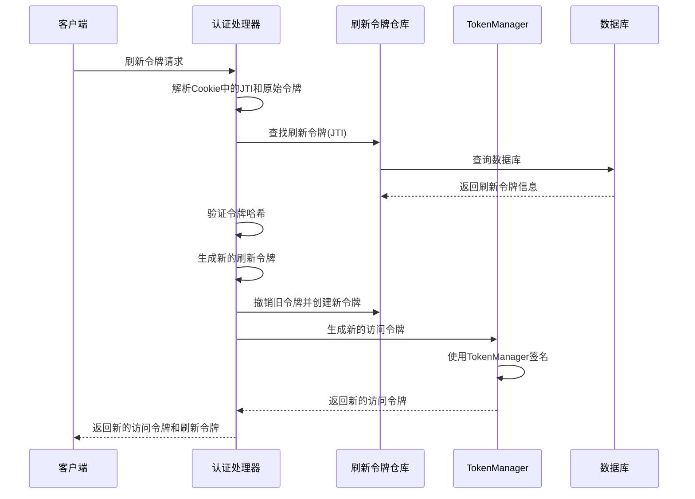

**图表来源**
- [refresh_token.go:15-32](file://internal/store/repository/refresh_token.go#L15-L32)

### 中间件认证流程

认证中间件处理请求的完整流程：

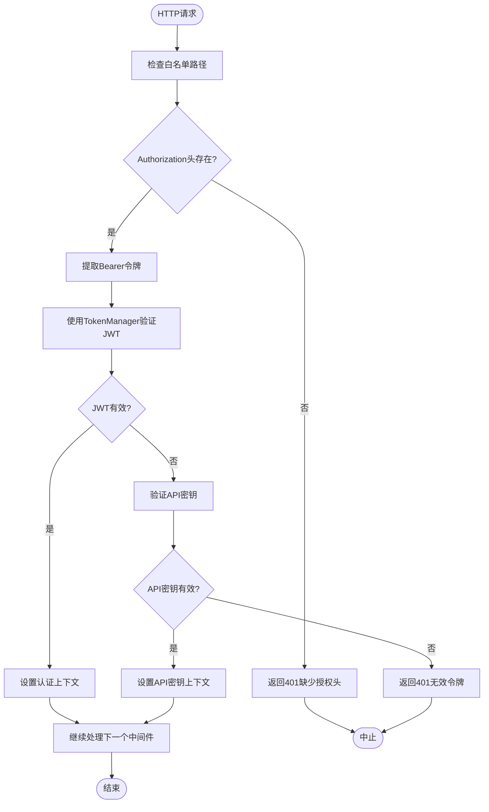

**图表来源**
- [middleware.go:18-72](file://internal/admin/middleware.go#L18-L72)

### 会话管理系统

会话管理提供了用户活动跟踪和强制登出功能：

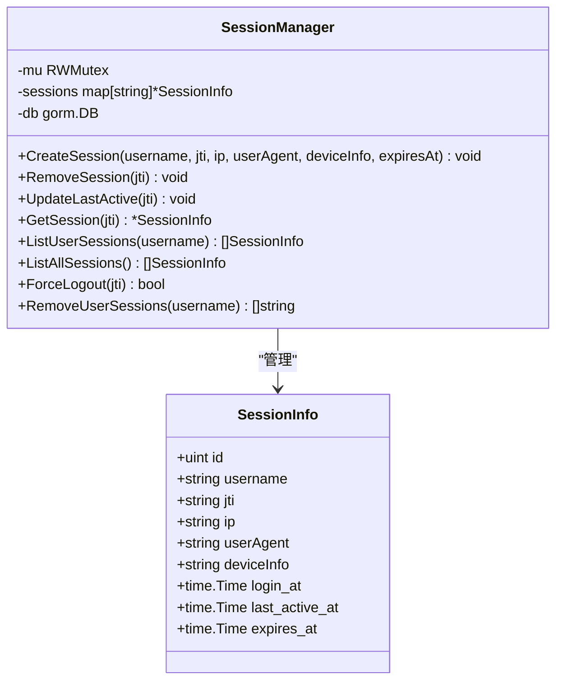

**图表来源**
- [session.go:25-41](file://internal/admin/auth/session.go#L25-L41)

**章节来源**
- [session.go:25-167](file://internal/admin/auth/session.go#L25-L167)

### API 密钥管理机制

API 密钥管理提供了基于 Bearer Token 的认证方式：

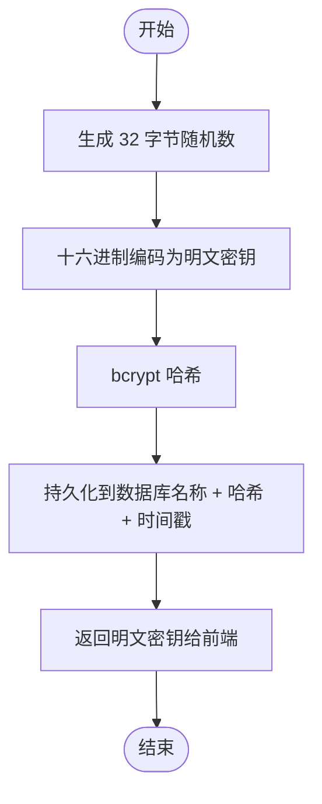

**图表来源**
- [admin_api_key.go:30-46](file://internal/store/repository/admin_api_key.go#L30-L46)

**章节来源**
- [admin_api_key.go:30-46](file://internal/store/repository/admin_api_key.go#L30-L46)

### 暴力破解防护

系统实现了智能的暴力破解防护机制：

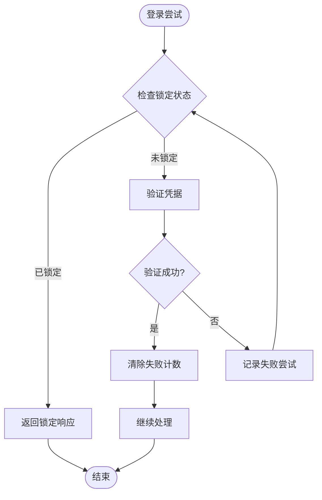

**图表来源**
- [bruteforce.go:64-91](file://internal/admin/auth/bruteforce.go#L64-L91)

**章节来源**
- [bruteforce.go:64-91](file://internal/admin/auth/bruteforce.go#L64-L91)

## 依赖关系分析

JWT 认证机制的依赖关系图：

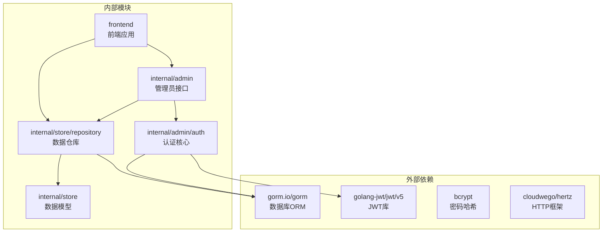

**图表来源**
- [jwt.go:3-15](file://internal/admin/auth/jwt.go#L3-L15)
- [admin_api_key.go:3-14](file://internal/store/repository/admin_api_key.go#L3-L14)

**章节来源**
- [jwt.go:3-15](file://internal/admin/auth/jwt.go#L3-L15)
- [admin_api_key.go:3-14](file://internal/store/repository/admin_api_key.go#L3-L14)

## 性能考虑

JWT 认证机制在性能方面的优化措施：

### 内存缓存策略
- 令牌黑名单使用 sync.Map 实现高性能查找
- 会话信息内存存储减少数据库查询
- 清理循环定期清理过期数据

### 并发安全
- 使用 RWMutex 确保读写操作的线程安全
- 无锁读取优化常见场景的性能
- 原子操作保证状态一致性

### 资源管理
- 定期清理 goroutine 避免内存泄漏
- 连接池管理数据库连接
- 缓存策略平衡内存使用和性能

## 故障排除指南

### 常见问题诊断

**令牌验证失败**
- 检查 JWT 密钥是否正确配置
- 验证发行者和受众声明
- 确认令牌未被加入黑名单

**刷新令牌失效**
- 检查刷新令牌是否过期
- 验证令牌哈希是否匹配
- 确认令牌未被撤销

**认证中间件异常**
- 检查 Authorization 头格式
- 验证 Bearer 令牌前缀
- 确认白名单路径配置正确

**API 密钥验证失败**
- 检查 API 密钥是否正确创建
- 验证 bcrypt 哈希比对
- 确认密钥未被删除或过期

**章节来源**
- [middleware.go:29-71](file://internal/admin/middleware.go#L29-L71)
- [admin_api_key.go:48-63](file://internal/store/repository/admin_api_key.go#L48-L63)

### 安全最佳实践

**密钥管理**
- 使用强随机密钥（至少 256 位）
- 定期轮换 JWT 密钥
- 在环境变量中安全存储密钥

**令牌安全**
- 启用 HTTPS 传输
- 设置适当的 Cookie 属性
- 实施令牌黑名单机制
- 使用短生命周期访问令牌

**会话管理**
- 实施会话超时机制
- 提供强制登出功能
- 监控异常登录行为
- 定期清理过期会话

**章节来源**
- [jwt.go:397-418](file://docs/安全机制/JWT 认证机制.md#L397-L418)
- [API 密钥管理.md:397-418](file://docs/安全机制/API 密钥管理.md#L397-418)

## 结论

My-OpenWaf 的认证授权机制提供了一个完整、安全且高效的认证解决方案。通过短期访问令牌和长期刷新令牌的结合，系统在保证安全性的同时提供了良好的用户体验。

**关键优势包括：**
- 多层安全验证机制
- 支持密钥轮换和令牌黑名单
- 完善的会话管理功能
- 暴力破解防护机制
- 基于角色的访问控制（RBAC）
- 优化的性能和资源管理

该实现为生产环境提供了可靠的认证基础设施，可以根据具体需求进行进一步定制和扩展。

## 附录

### API 端点定义

**JWT 认证端点**
- POST `/api/v1/auth/login` - 用户登录
- POST `/api/v1/auth/refresh` - 刷新访问令牌
- POST `/api/v1/auth/logout` - 用户登出

**API 密钥管理端点**
- POST `/api/v1/api-keys` - 创建 API 密钥
- GET `/api/v1/api-keys` - 列出 API 密钥
- POST `/api/v1/api-keys/:id/delete` - 删除 API 密钥

**章节来源**
- [apikey.go:27-59](file://internal/admin/system/apikey.go#L27-L59)

### 配置选项

**JWT 配置**
- AccessTTL: 15分钟（访问令牌有效期）
- RefreshTTL: 7天（刷新令牌有效期）
- Issuer: "my-openwaf"（令牌发行者）
- Audience: "my-openwaf-admin"（令牌受众）

**暴力破解防护配置**
- 最大失败次数: 5次
- 锁定时长: 15分钟
- 清理周期: 5分钟

**章节来源**
- [jwt.go:33-39](file://internal/admin/auth/jwt.go#L33-L39)
- [bruteforce.go:23-58](file://internal/admin/auth/bruteforce.go#L23-L58)