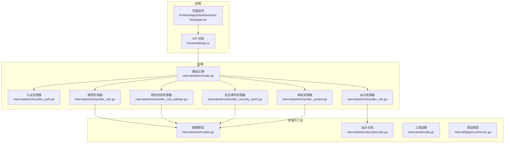
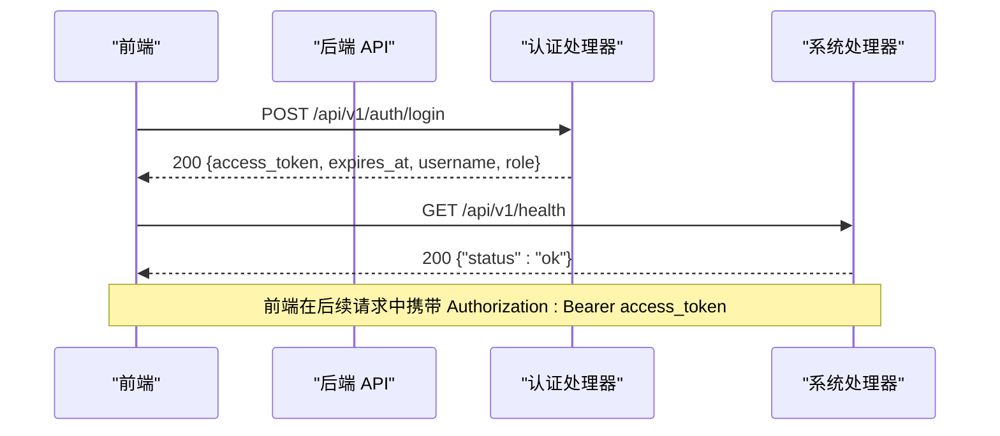
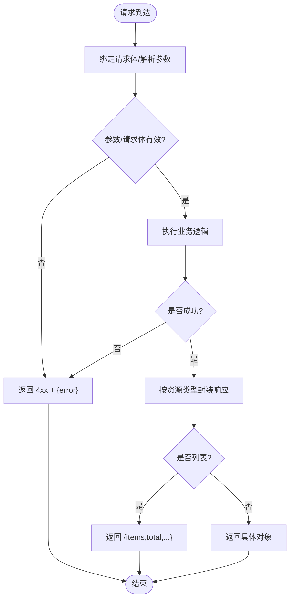
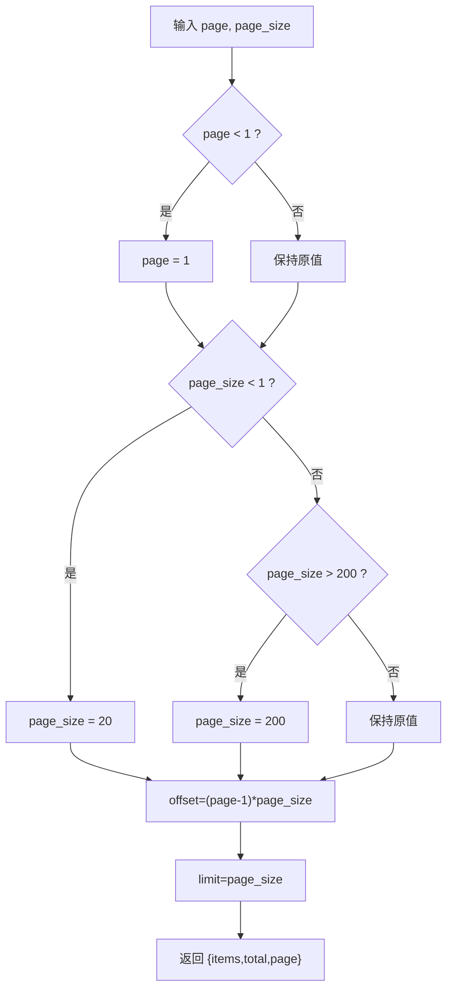
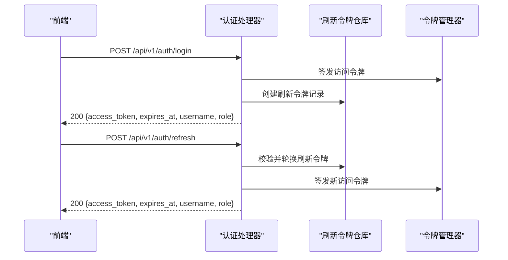
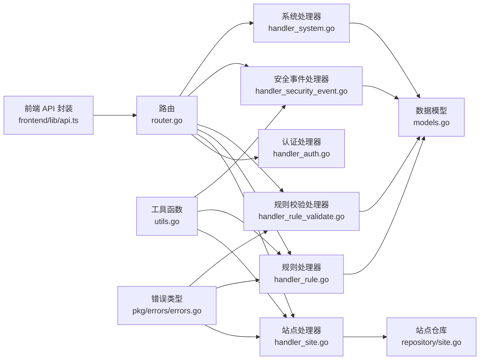

# 请求响应格式规范

<cite>
**本文引用的文件**
- [internal/admin/router.go](file://internal/admin/router.go)
- [internal/admin/handler_auth.go](file://internal/admin/handler_auth.go)
- [internal/admin/handler_site.go](file://internal/admin/handler_site.go)
- [internal/admin/handler_rule.go](file://internal/admin/handler_rule.go)
- [internal/admin/handler_rule_validate.go](file://internal/admin/handler_rule_validate.go)
- [internal/admin/handler_security_event.go](file://internal/admin/handler_security_event.go)
- [internal/admin/handler_system.go](file://internal/admin/handler_system.go)
- [internal/store/models.go](file://internal/store/models.go)
- [internal/store/repository/site.go](file://internal/store/repository/site.go)
- [internal/utils/utils.go](file://internal/utils/utils.go)
- [internal/pkg/errors/errors.go](file://internal/pkg/errors/errors.go)
- [frontend/lib/api.ts](file://frontend/lib/api.ts)
- [frontend/app/(dashboard)/ip-lists/page.tsx](file://frontend/app/(dashboard)/ip-lists/page.tsx)
</cite>

## 目录
1. [简介](#简介)
2. [项目结构与接口范围](#项目结构与接口范围)
3. [核心组件与职责](#核心组件与职责)
4. [架构总览](#架构总览)
5. [详细组件分析](#详细组件分析)
6. [依赖关系分析](#依赖关系分析)
7. [性能与可扩展性考量](#性能与可扩展性考量)
8. [故障排查指南](#故障排查指南)
9. [结论](#结论)
10. [附录：响应示例与错误码对照](#附录响应示例与错误码对照)

## 简介
本规范定义了 My-OpenWaf 后端服务的统一请求与响应格式，覆盖以下方面：
- 统一的 JSON 响应结构（成功与错误）
- 数据字段命名规范与类型约定
- 请求参数传递方式（查询参数、路径参数、请求体）
- 数据类型定义与验证规则
- 分页机制与排序规则
- 完整响应示例与错误码对照
- 客户端数据处理最佳实践与兼容性建议

## 项目结构与接口范围
- 接口版本：/api/v1
- 路由注册与中间件：认证、访问日志、安全头、RBAC 角色控制
- 主要资源：站点、证书、策略、规则、系统设置、IP 黑白名单、安全事件、会话管理等
- 客户端：前端通过 fetch 封装进行 API 调用，支持自动刷新令牌与错误处理

**图表来源**
- [internal/admin/router.go:35-210](file://internal/admin/router.go#L35-L210)
- [internal/admin/handler_auth.go:32-232](file://internal/admin/handler_auth.go#L32-L232)
- [internal/admin/handler_site.go:21-179](file://internal/admin/handler_site.go#L21-L179)
- [internal/admin/handler_rule.go:16-197](file://internal/admin/handler_rule.go#L16-L197)
- [internal/admin/handler_rule_validate.go:32-98](file://internal/admin/handler_rule_validate.go#L32-L98)
- [internal/admin/handler_security_event.go:16-127](file://internal/admin/handler_security_event.go#L16-L127)
- [internal/admin/handler_system.go:142-156](file://internal/admin/handler_system.go#L142-L156)
- [internal/store/models.go:14-456](file://internal/store/models.go#L14-L456)
- [internal/store/repository/site.go:13-45](file://internal/store/repository/site.go#L13-L45)
- [internal/utils/utils.go:10-21](file://internal/utils/utils.go#L10-L21)
- [internal/pkg/errors/errors.go:5-27](file://internal/pkg/errors/errors.go#L5-L27)
- [frontend/lib/api.ts:31-88](file://frontend/lib/api.ts#L31-L88)
- [frontend/app/(dashboard)/ip-lists/page.tsx:271-296](file://frontend/app/(dashboard)/ip-lists/page.tsx#L271-L296)

**章节来源**
- [internal/admin/router.go:35-210](file://internal/admin/router.go#L35-L210)

## 核心组件与职责
- 路由与中间件：负责挂载 /api/v1 下所有端点，并应用安全头、访问日志、认证与 RBAC 中间件
- 认证模块：登录、刷新、登出、当前用户信息、会话列表与强制登出
- 资源模块：站点、规则、证书、系统设置、IP 列表、安全事件、保护设置等
- 工具与模型：分页计算、参数解析、数据模型定义与字段约束
- 前端封装：统一的 fetch 封装，自动携带 Authorization 头与刷新令牌，集中错误处理

**章节来源**
- [internal/admin/router.go:35-210](file://internal/admin/router.go#L35-L210)
- [internal/admin/handler_auth.go:32-232](file://internal/admin/handler_auth.go#L32-L232)
- [internal/admin/handler_site.go:21-179](file://internal/admin/handler_site.go#L21-L179)
- [internal/admin/handler_rule.go:16-197](file://internal/admin/handler_rule.go#L16-L197)
- [internal/admin/handler_rule_validate.go:32-98](file://internal/admin/handler_rule_validate.go#L32-L98)
- [internal/admin/handler_security_event.go:16-127](file://internal/admin/handler_security_event.go#L16-L127)
- [internal/utils/utils.go:10-21](file://internal/utils/utils.go#L10-L21)
- [internal/store/models.go:14-456](file://internal/store/models.go#L14-L456)
- [frontend/lib/api.ts:31-88](file://frontend/lib/api.ts#L31-L88)

## 架构总览
后端基于 Hertz 框架，采用分层设计：
- 表现层：路由与处理器
- 领域层：业务逻辑（如规则编译、测试、导入导出）
- 存储层：GORM 仓库模式，提供 CRUD 与过滤统计
- 前端：统一 API 封装，自动处理鉴权、刷新与错误

**图表来源**
- [internal/admin/router.go:55-70](file://internal/admin/router.go#L55-L70)
- [internal/admin/handler_auth.go:32-122](file://internal/admin/handler_auth.go#L32-L122)
- [internal/admin/handler_system.go:152-156](file://internal/admin/handler_system.go#L152-L156)
- [frontend/lib/api.ts:31-88](file://frontend/lib/api.ts#L31-L88)

## 详细组件分析

### 统一响应格式与错误处理
- 成功响应
  - 一般返回 200，携带业务数据对象或数组
  - 列表接口统一使用分页包装对象：{"items":[...],"total":n,...}
  - 创建资源返回 201；删除资源返回 204（无内容）
- 错误响应
  - 使用标准 HTTP 状态码映射错误语义
  - 错误响应体为 JSON 对象，包含 "error" 字段描述错误信息
  - 特殊场景：401 未授权（含刷新失败）、403 禁止访问、429 请求过快（暴力破解锁定）

**图表来源**
- [internal/admin/handler_site.go:21-106](file://internal/admin/handler_site.go#L21-L106)
- [internal/admin/handler_rule.go:16-102](file://internal/admin/handler_rule.go#L16-L102)
- [internal/admin/handler_auth.go:32-122](file://internal/admin/handler_auth.go#L32-L122)
- [internal/admin/handler_security_event.go:16-56](file://internal/admin/handler_security_event.go#L16-L56)

**章节来源**
- [internal/admin/handler_site.go:21-106](file://internal/admin/handler_site.go#L21-L106)
- [internal/admin/handler_rule.go:16-102](file://internal/admin/handler_rule.go#L16-L102)
- [internal/admin/handler_auth.go:32-122](file://internal/admin/handler_auth.go#L32-L122)
- [internal/admin/handler_security_event.go:16-56](file://internal/admin/handler_security_event.go#L16-L56)

### 请求参数传递方式
- 查询参数（GET）
  - 列表接口通用分页参数：page、page_size
  - 其他筛选参数：如安全事件接口支持 action、phase、category、client_ip、host、path、rule_id、since、until
- 路径参数（GET/POST）
  - 资源 ID：/sites/:id、/rules/:id 等
- 请求体（POST/PUT）
  - JSON 结构体，遵循各资源模型字段定义
  - 验证失败时返回 400 与错误信息

**章节来源**
- [internal/admin/handler_site.go:21-48](file://internal/admin/handler_site.go#L21-L48)
- [internal/admin/handler_rule.go:16-44](file://internal/admin/handler_rule.go#L16-L44)
- [internal/admin/handler_security_event.go:16-56](file://internal/admin/handler_security_event.go#L16-L56)
- [internal/admin/handler_rule_validate.go:32-98](file://internal/admin/handler_rule_validate.go#L32-L98)

### 数据类型定义与验证规则
- 基础类型
  - 数值：整型（uint、int）；时间：RFC3339 字符串；布尔：true/false
  - 字符串：长度约束见模型定义；枚举值见模型常量
- 字段约束与必填
  - 必填字段：模型注解中带 not null 的字段
  - 默认值：模型注解中带 default 的字段
  - 枚举值：如 RuleAction、RulePhase、IPListKind 等
- 验证规则
  - 路由层参数解析：非法 ID 返回 400
  - 规则模式：ValidateRule 校验模式前缀与复合 JSON 结构
  - 客户端类型：前端定义了分页与查询参数接口类型，确保调用一致性

**章节来源**
- [internal/store/models.go:14-456](file://internal/store/models.go#L14-L456)
- [internal/admin/handler_rule_validate.go:32-98](file://internal/admin/handler_rule_validate.go#L32-L98)
- [frontend/lib/api.ts:118-156](file://frontend/lib/api.ts#L118-L156)

### 分页机制与排序规则
- 分页参数
  - page：默认 1，最小 1
  - page_size：默认 20，最小 1，最大 200
- 计算逻辑
  - offset = (page - 1) × page_size
  - limit = page_size
- 排序规则
  - 列表接口通常按 id 升序排序
- 响应结构
  - 列表统一返回 {items:[...], total:n, ...}，其中 total 为总数

**图表来源**
- [internal/utils/utils.go:10-21](file://internal/utils/utils.go#L10-L21)
- [internal/admin/handler_site.go:21-33](file://internal/admin/handler_site.go#L21-L33)
- [internal/admin/handler_rule.go:16-28](file://internal/admin/handler_rule.go#L16-L28)
- [internal/admin/handler_security_event.go:16-56](file://internal/admin/handler_security_event.go#L16-L56)

**章节来源**
- [internal/utils/utils.go:10-21](file://internal/utils/utils.go#L10-L21)
- [internal/admin/handler_site.go:21-33](file://internal/admin/handler_site.go#L21-L33)
- [internal/admin/handler_rule.go:16-28](file://internal/admin/handler_rule.go#L16-L28)
- [internal/admin/handler_security_event.go:16-56](file://internal/admin/handler_security_event.go#L16-L56)

### 认证与会话管理
- 登录：POST /api/v1/auth/login，返回 access_token、expires_at、username、role
- 刷新：POST /api/v1/auth/refresh，使用 HttpOnly Cookie 刷新令牌
- 登出：POST /api/v1/auth/logout，撤销刷新令牌与加入访问令牌黑名单
- 当前用户：GET /api/v1/auth/me
- 会话管理：GET /api/v1/auth/sessions；管理员强制登出指定会话

**图表来源**
- [internal/admin/handler_auth.go:32-192](file://internal/admin/handler_auth.go#L32-L192)
- [frontend/lib/api.ts:16-29](file://frontend/lib/api.ts#L16-L29)

**章节来源**
- [internal/admin/handler_auth.go:32-192](file://internal/admin/handler_auth.go#L32-L192)
- [frontend/lib/api.ts:16-29](file://frontend/lib/api.ts#L16-L29)

### 资源操作（示例：站点、规则、安全事件）
- 站点
  - 列表：GET /api/v1/sites（支持分页与总数）
  - 获取：GET /api/v1/sites/:id
  - 新增：POST /api/v1/sites
  - 更新：POST /api/v1/sites/:id/update
  - 删除：POST /api/v1/sites/:id/delete
  - 启停：POST /api/v1/sites/:id/start, /:id/stop
- 规则
  - 列表：GET /api/v1/rules（支持分页与总数）
  - 获取：GET /api/v1/rules/:id
  - 新增/更新/删除：POST /api/v1/rules/:id/{create|update|delete}
  - 测试：POST /api/v1/rules/test（请求体包含 pattern、client_ip、path、query、headers）
  - 导入/导出：POST /api/v1/rules/import、/rules/export
- 安全事件
  - 列表：GET /api/v1/security-events（支持多维过滤与分页）
  - 统计：GET /api/v1/security-events/stats
  - 时间线：GET /api/v1/security-events/timeline

**章节来源**
- [internal/admin/handler_site.go:21-179](file://internal/admin/handler_site.go#L21-L179)
- [internal/admin/handler_rule.go:16-197](file://internal/admin/handler_rule.go#L16-L197)
- [internal/admin/handler_security_event.go:16-127](file://internal/admin/handler_security_event.go#L16-L127)

### 健康检查与重载
- 健康检查：GET /api/v1/health
- 重载快照：POST /api/v1/reload

**章节来源**
- [internal/admin/handler_system.go:142-156](file://internal/admin/handler_system.go#L142-L156)

## 依赖关系分析
- 路由层依赖处理器与中间件，处理器依赖仓库与工具函数
- 仓库层依赖 GORM 模型，模型定义字段约束与默认值
- 前端 API 封装依赖后端接口契约，统一错误处理与鉴权头

**图表来源**
- [internal/admin/router.go:35-210](file://internal/admin/router.go#L35-L210)
- [internal/admin/handler_auth.go:32-192](file://internal/admin/handler_auth.go#L32-L192)
- [internal/admin/handler_site.go:21-179](file://internal/admin/handler_site.go#L21-L179)
- [internal/admin/handler_rule.go:16-197](file://internal/admin/handler_rule.go#L16-L197)
- [internal/admin/handler_rule_validate.go:32-98](file://internal/admin/handler_rule_validate.go#L32-L98)
- [internal/admin/handler_security_event.go:16-127](file://internal/admin/handler_security_event.go#L16-L127)
- [internal/admin/handler_system.go:142-156](file://internal/admin/handler_system.go#L142-L156)
- [internal/store/repository/site.go:13-45](file://internal/store/repository/site.go#L13-L45)
- [internal/store/models.go:14-456](file://internal/store/models.go#L14-L456)
- [internal/utils/utils.go:10-21](file://internal/utils/utils.go#L10-L21)
- [internal/pkg/errors/errors.go:5-27](file://internal/pkg/errors/errors.go#L5-L27)
- [frontend/lib/api.ts:31-88](file://frontend/lib/api.ts#L31-L88)

**章节来源**
- [internal/admin/router.go:35-210](file://internal/admin/router.go#L35-L210)
- [internal/store/models.go:14-456](file://internal/store/models.go#L14-L456)
- [internal/utils/utils.go:10-21](file://internal/utils/utils.go#L10-L21)
- [frontend/lib/api.ts:31-88](file://frontend/lib/api.ts#L31-L88)

## 性能与可扩展性考量
- 分页上限：page_size 最大 200，避免一次性返回过多数据
- 过滤与索引：安全事件接口支持多维过滤，建议数据库建立相应索引以提升查询性能
- 缓存：可结合响应缓存层减少重复查询（仓库层已具备缓存能力）
- 并发：站点运行状态使用互斥锁保护，避免并发写入冲突

**章节来源**
- [internal/utils/utils.go:10-21](file://internal/utils/utils.go#L10-L21)
- [internal/admin/handler_security_event.go:16-56](file://internal/admin/handler_security_event.go#L16-L56)
- [internal/admin/handler_site.go:15-19](file://internal/admin/handler_site.go#L15-L19)

## 故障排查指南
- 400 错误
  - 请求体无效或参数为空：检查请求体 JSON 与必填字段
- 401 未授权
  - 访问令牌失效或被拉黑：尝试刷新令牌；若刷新失败，引导重新登录
- 403 禁止访问
  - RBAC 权限不足：确认角色与所需权限
- 404 资源不存在
  - 路径参数 ID 无效或资源不存在：检查 ID 与资源状态
- 429 请求过快
  - 暴力破解防护触发：等待锁定时间结束后重试
- 500 服务器内部错误
  - 数据库异常或业务逻辑错误：查看后端日志并重试

**章节来源**
- [internal/admin/handler_auth.go:44-72](file://internal/admin/handler_auth.go#L44-L72)
- [frontend/lib/api.ts:68-84](file://frontend/lib/api.ts#L68-L84)

## 结论
本规范统一了 My-OpenWaf 的请求与响应格式，明确了参数传递方式、数据类型与验证规则、分页与排序机制，并提供了错误处理与客户端最佳实践。遵循该规范可确保前后端交互一致、可维护性强且具备良好的扩展性。

## 附录：响应示例与错误码对照

### 统一响应结构
- 成功响应（200）
  - 资源对象：返回具体资源字段
  - 列表：返回 {"items":[...],"total":n,"page":p,...}
  - 创建：返回 201 与新建对象
  - 删除：返回 204（无内容）
- 错误响应（4xx/5xx）
  - 返回 {"error":"描述信息"}

**章节来源**
- [internal/admin/handler_site.go:21-106](file://internal/admin/handler_site.go#L21-L106)
- [internal/admin/handler_rule.go:16-102](file://internal/admin/handler_rule.go#L16-L102)
- [internal/admin/handler_security_event.go:16-56](file://internal/admin/handler_security_event.go#L16-L56)

### 错误码对照
- 200 OK：请求成功
- 201 Created：创建成功
- 204 No Content：删除成功
- 400 Bad Request：请求体或参数无效
- 401 Unauthorized：未授权或令牌失效
- 403 Forbidden：权限不足
- 404 Not Found：资源不存在
- 429 Too Many Requests：请求过快/账户锁定
- 500 Internal Server Error：服务器内部错误

**章节来源**
- [internal/admin/handler_auth.go:44-72](file://internal/admin/handler_auth.go#L44-L72)
- [internal/admin/handler_system.go:142-156](file://internal/admin/handler_system.go#L142-L156)
- [frontend/lib/api.ts:68-84](file://frontend/lib/api.ts#L68-L84)

### 客户端数据处理最佳实践
- 自动携带 Authorization 头与 Cookie（刷新令牌）
- 401 时优先尝试刷新，失败则跳转登录
- 403、429、400 统一弹窗提示并记录日志
- 列表分页使用 page/page_size，避免一次性加载过多数据
- 前端类型与后端模型保持一致，减少联调成本

**章节来源**
- [frontend/lib/api.ts:31-88](file://frontend/lib/api.ts#L31-L88)
- [frontend/app/(dashboard)/ip-lists/page.tsx:271-296](file://frontend/app/(dashboard)/ip-lists/page.tsx#L271-L296)