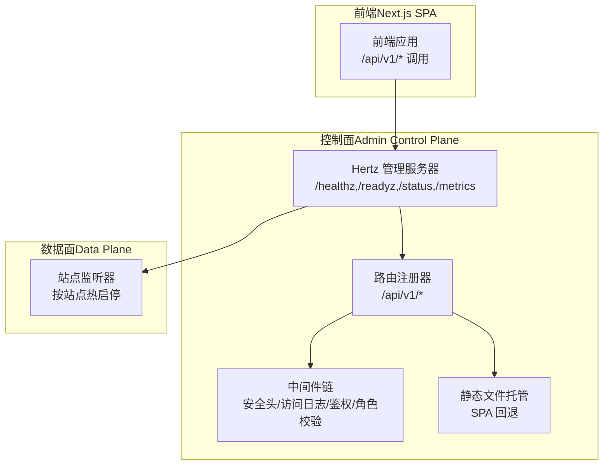
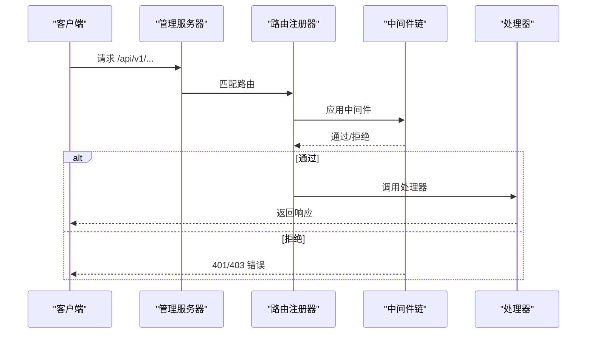
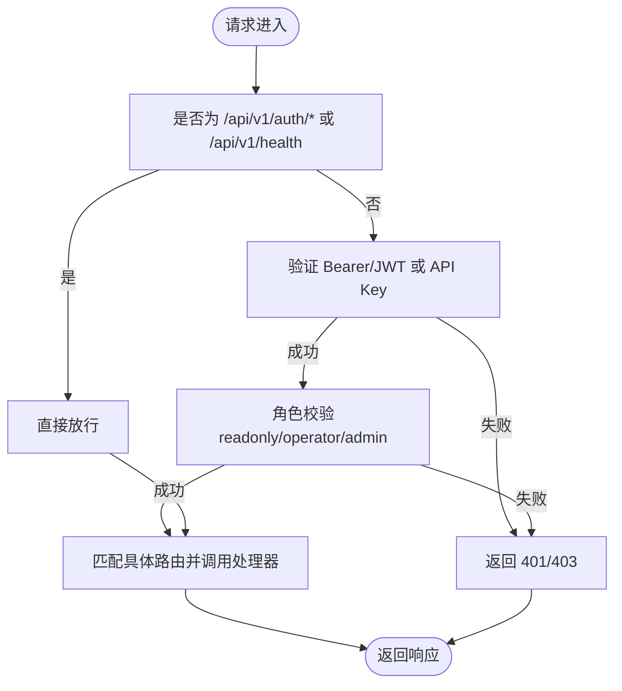
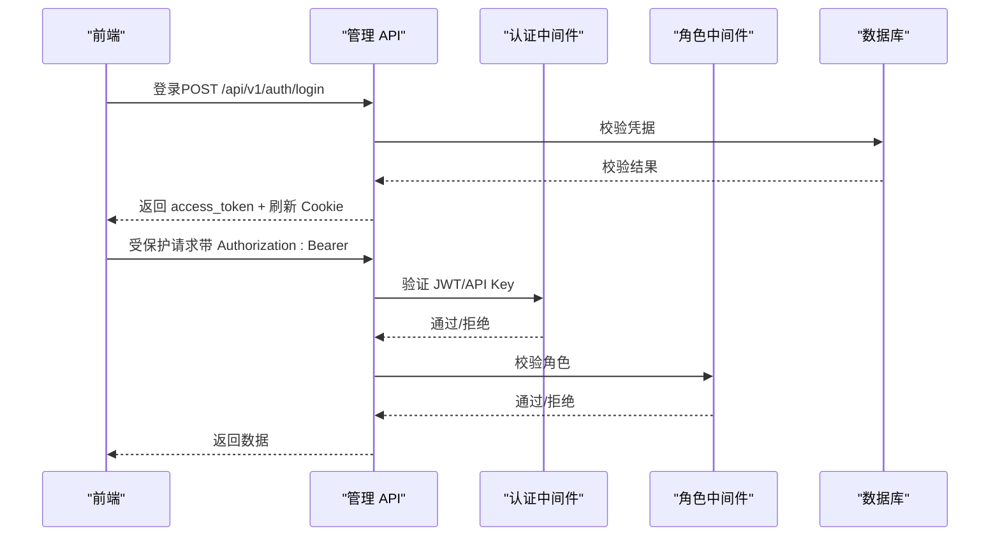
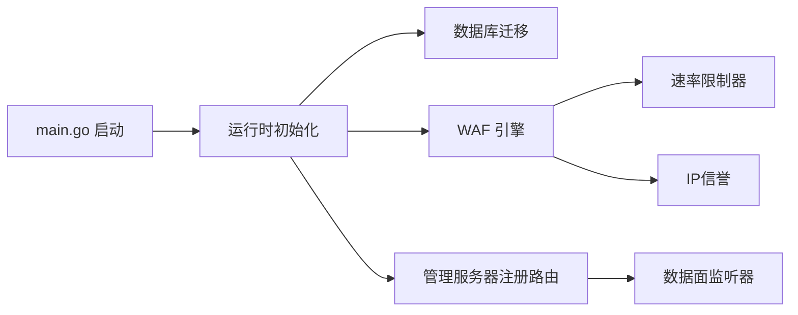

# 路由设计规范

<cite>
**本文档引用的文件**
- [router.go](file://internal/admin/router.go)
- [middleware.go](file://internal/admin/middleware.go)
- [jwt.go](file://internal/admin/auth/jwt.go)
- [session.go](file://internal/admin/auth/session.go)
- [bruteforce.go](file://internal/admin/auth/bruteforce.go)
- [auth.go](file://internal/admin/auth.go)
- [site.go](file://internal/admin/site/site.go)
- [settings.go](file://internal/admin/system/settings.go)
- [route.go](file://internal/admin/rule/route.go)
- [clientip.go](file://internal/security/clientip.go)
- [response_cache.go](file://internal/cache/response_cache.go)
- [ratelimit.go](file://internal/waf/ratelimit.go)
- [ratelimit_redis.go](file://internal/waf/ratelimit_redis.go)
- [server.go](file://internal/app/server.go)
- [api.ts](file://frontend/lib/api.ts)
- [auth-guard.tsx](file://frontend/components/auth-guard.tsx)
- [static.go](file://internal/core/adminweb/static.go)
- [路由设计规范.md](file://docs/管理 API 系统/REST API 设计规范/路由设计规范.md)
</cite>

## 目录
1. [引言](#引言)
2. [项目结构](#项目结构)
3. [核心组件](#核心组件)
4. [架构总览](#架构总览)
5. [详细组件分析](#详细组件分析)
6. [依赖关系分析](#依赖关系分析)
7. [性能考量](#性能考量)
8. [故障排查指南](#故障排查指南)
9. [结论](#结论)
10. [附录](#附录)

## 引言
本规范旨在为 My-OpenWaf 的路由设计提供系统化、可执行的指导，覆盖版本控制策略、资源命名约定、路由注册机制、HTTP 方法使用规范、安全考虑、测试策略与调试方法，以及性能优化建议。文档以实际代码为依据，确保规范与实现一致。

## 项目结构
后端采用 Hertz 框架，控制面（管理 API）与数据面（业务监听）分离部署。控制面负责认证、授权、系统设置、规则管理等；数据面负责业务流量防护与转发。前端通过 Next.js 构建，采用 SPA 模式，静态资源由后端统一托管。

图表来源
- [server.go:268-305](file://internal/app/server.go#L268-L305)
- [router.go:48-210](file://internal/admin/router.go#L48-L210)

章节来源
- [server.go:35-305](file://internal/app/server.go#L35-L305)

## 核心组件
- 版本控制：统一使用 `/api/v1` 前缀，便于未来版本演进与兼容性管理。
- 资源命名：采用复数名词（如 `/sites`, `/rules`, `/settings`），路径参数使用 `:id` 表示单个资源。
- 路由注册：在控制面 Hertz 实例上注册健康检查、认证、受控 API 分组、静态文件回退。
- 中间件：全局安全头设置、访问日志、认证（支持 Bearer JWT 与 API Key）、角色权限校验。
- 静态文件：SPA 回退逻辑，区分 API 与静态资源，避免 API 路径误返回静态内容。

章节来源
- [router.go:35-50](file://internal/admin/router.go#L35-L50)
- [router.go:69-210](file://internal/admin/router.go#L69-L210)
- [middleware.go:16-129](file://internal/admin/middleware.go#L16-L129)

## 架构总览
控制面路由组织遵循"健康检查 + 认证 + 受控 API 分组 + 静态文件回退"的模式。API 分组内部按角色细分为只读、操作员、管理员三类权限组，确保最小权限原则。

图表来源
- [router.go:48-210](file://internal/admin/router.go#L48-L210)
- [middleware.go:16-96](file://internal/admin/middleware.go#L16-L96)

## 详细组件分析

### 版本控制策略
- 统一前缀：所有受控 API 使用 `/api/v1` 前缀，便于未来升级到 `/api/v2`。
- 健康检查：独立于 `/api/v1`，便于外部探针快速判断服务状态。
- 数据面：独立于控制面，按站点热启停，不参与控制面路由。

章节来源
- [router.go:52-53](file://internal/admin/router.go#L52-L53)
- [server.go:268-272](file://internal/app/server.go#L268-L272)

### 资源命名约定与路径设计原则
- 资源集合：使用复数形式，如 `/sites`, `/rules`, `/settings`。
- 单个资源：使用 `/:id`，如 `/sites/:id`。
- 动作扩展：对于不常用或需要简化代理配置的场景，采用 POST 动作模拟更新/删除，如 `/sites/:id/update`, `/sites/:id/delete`。
- 导出/导入/同步：使用动词短语，如 `/rules/export`, `/rules/import`, `/cve-rules/sync`。
- 统计/聚合：使用名词短语，如 `/security-events/stats`, `/security-events/timeline`。

章节来源
- [router.go:83-206](file://internal/admin/router.go#L83-L206)

### 路由注册机制
- 全局中间件：在管理服务器实例上挂载安全头与访问日志中间件。
- 认证路由：无需鉴权，直接注册登录、刷新、登出接口。
- 受控 API 分组：使用 `/api/v1` 分组，并在组内应用鉴权与角色中间件。
- 静态文件处理：通过 NoRoute 回退，区分 API 与静态资源，SPA 路由交由前端处理。

图表来源
- [router.go:69-210](file://internal/admin/router.go#L69-L210)
- [middleware.go:16-96](file://internal/admin/middleware.go#L16-L96)

章节来源
- [router.go:48-210](file://internal/admin/router.go#L48-L210)
- [middleware.go:16-129](file://internal/admin/middleware.go#L16-L129)

### HTTP 方法使用规范
- GET：用于查询列表、详情、统计、聚合等只读操作。
- POST：用于创建、更新、删除、刷新令牌、强制登出等写入或动作型操作。
- PUT/DELETE：未在控制面路由中使用，避免复杂代理与 CORS 配置。
- 特殊操作：更新/删除通过 POST + 路径动作（如 `/update`, `/delete`）表达，保持简洁。

章节来源
- [router.go:37-42](file://internal/admin/router.go#L37-L42)
- [router.go:142-182](file://internal/admin/router.go#L142-L182)

### 路由安全考虑
- 安全头：统一设置 X-Content-Type-Options、X-Frame-Options、Referrer-Policy、Content-Security-Policy。
- 认证：支持 Bearer JWT 与 API Key，白名单跳过健康检查与认证接口。
- 会话管理：基于 HttpOnly Cookie 的刷新令牌，支持强制登出与会话列表。
- 角色权限：readonly/operator/admin 三级角色，精确到资源与动作。
- 前端集成：前端通过 Bearer 头传递访问令牌，刷新令牌使用 Cookie。

图表来源
- [auth.go:97-232](file://internal/admin/auth.go#L97-L232)
- [middleware.go:16-96](file://internal/admin/middleware.go#L16-L96)
- [api.ts:90-114](file://frontend/lib/api.ts#L90-L114)

章节来源
- [middleware.go:121-129](file://internal/admin/middleware.go#L121-L129)
- [auth.go:295-303](file://internal/admin/auth.go#L295-L303)
- [api.ts:31-88](file://frontend/lib/api.ts#L31-L88)

### 静态文件处理与 SPA 回退
- 静态文件解析：根据请求路径尝试多种候选文件，优先返回 index.html 实现 SPA 路由。
- 内容类型映射：根据文件扩展名设置合适的 Content-Type。
- 回退策略：NoRoute 将非 API 路径交由静态文件处理器，API 路径返回 404。

章节来源
- [static.go:19-52](file://internal/core/adminweb/static.go#L19-L52)
- [router.go:208-235](file://internal/admin/router.go#L208-L235)

### 前端路由与认证流程
- 前端通过 api.ts 统一封装请求，自动处理 401 自动刷新与错误提示。
- AuthGuard 在客户端进行登录态校验与重定向。
- 前端仅调用受控 API，静态资源由后端托管。

章节来源
- [api.ts:16-88](file://frontend/lib/api.ts#L16-L88)
- [auth-guard.tsx:7-39](file://frontend/components/auth-guard.tsx#L7-L39)

## 依赖关系分析
- 控制面启动：主程序启动后构建运行时、迁移数据库、初始化事件写入与归档、指标收集、WAF 引擎、速率限制器、IP 黑名单、配置同步与 Prometheus 指标。
- 路由注册：在管理服务器上注册健康检查、认证、受控 API 与静态文件回退。
- 数据面：按站点热启停，支持 TLS 终止与 SNI 证书。

图表来源
- [server.go:35-305](file://internal/app/server.go#L35-L305)

章节来源
- [server.go:35-305](file://internal/app/server.go#L35-L305)

## 性能考量
- 本地缓存：响应缓存（GET 安全请求）与快照缓存（进程内），减少重复计算与 IO。
- 速率限制：本地与 Redis 双栈滑动窗口限流，支持分布式部署。
- 配置漂移检测：站点监听器指纹校验，变更时自动重启，保证一致性。
- TLS 优化：按站点配置 TLS，支持 ALPN 与 SNI，降低握手开销。
- 前端静态资源：由后端统一托管，减少跨域与额外请求。

章节来源
- [response_cache.go:25-162](file://internal/cache/response_cache.go#L25-L162)
- [ratelimit.go:56-116](file://internal/waf/ratelimit.go#L56-L116)
- [ratelimit_redis.go:12-88](file://internal/waf/ratelimit_redis.go#L12-L88)
- [server.go:459-482](file://internal/app/server.go#L459-L482)
- [server.go:378-455](file://internal/app/server.go#L378-L455)

## 故障排查指南
- 认证失败（401）：检查 Authorization 头格式（Bearer）、刷新令牌 Cookie 是否存在且有效；查看前端自动刷新逻辑与错误提示。
- 权限不足（403）：确认用户角色是否满足目标资源与动作的最低要求。
- 速率限制（429）：检查请求频率与窗口设置，必要时调整保护配置。
- 静态资源 404：确认请求路径是否为 API 路径，否则应由 SPA 回退处理。
- 日志定位：启用访问日志中间件，结合 X-Request-ID 追踪请求链路。

章节来源
- [middleware.go:98-129](file://internal/admin/middleware.go#L98-L129)
- [api.ts:48-84](file://frontend/lib/api.ts#L48-L84)
- [auth.go:43-73](file://internal/admin/auth.go#L43-L73)

## 结论
本规范以实际代码为基础，明确了版本控制、资源命名、路由注册、HTTP 方法使用、安全与性能优化策略。通过严格的中间件链与角色权限控制，确保 API 的安全性与可维护性；通过静态文件回退与前端 SPA 集成，提供良好的用户体验。建议在后续版本中逐步引入更细粒度的 RBAC 与审计日志，持续提升系统的可观测性与合规性。

## 附录

### API 路由清单（节选）
- 健康检查：GET /api/v1/health
- 认证：POST /api/v1/auth/login, POST /api/v1/auth/refresh, POST /api/v1/auth/logout
- 用户信息：GET /api/v1/auth/me
- 会话管理：GET /api/v1/auth/sessions, POST /api/v1/auth/sessions/force-logout
- 站点管理：GET/POST /api/v1/sites, GET/POST /api/v1/sites/:id/update, GET/POST /api/v1/sites/:id/delete, GET/POST /api/v1/sites/:id/start, GET/POST /api/v1/sites/:id/stop
- 证书管理：GET/POST /api/v1/certificates, GET/POST /api/v1/certificates/:id/update, GET/POST /api/v1/certificates/:id/delete
- 策略管理：GET/POST /api/v1/policies, GET/POST /api/v1/policies/:id/update, GET/POST /api/v1/policies/:id/delete
- 规则管理：GET/POST /api/v1/rules, GET/POST /api/v1/rules/:id/update, GET/POST /api/v1/rules/:id/delete, POST /api/v1/rules/test, POST /api/v1/rules/validate, POST /api/v1/rules/import, GET /api/v1/rules/templates, GET /api/v1/rules/export
- 保护设置：GET/POST /api/v1/protection-settings
- IP 名单：GET/POST /api/v1/ip-lists, GET/POST /api/v1/ip-lists/:id/update, GET/POST /api/v1/ip-lists/:id/delete
- 安全事件：GET /api/v1/security-events, GET /api/v1/security-events/stats, GET /api/v1/security-events/timeline, GET /api/v1/security-events/:id
- 仪表盘：GET /api/v1/dashboard/summary
- API Key 管理：GET /api/v1/api-keys, POST /api/v1/api-keys, POST /api/v1/api-keys/:id/delete
- Bot 设置：GET /api/v1/bot-settings, GET /api/v1/bot-scores, GET /api/v1/fingerprints
- CVE 规则：GET/POST /api/v1/cve-rules, GET/POST /api/v1/cve-rules/:id/update, GET/POST /api/v1/cve-rules/:id/delete, POST /api/v1/cve-rules/:id/toggle, POST /api/v1/cve-rules/sync, GET /api/v1/cve-feed/status
- 系统设置：GET/POST /api/v1/settings, GET/POST /api/v1/settings/:key, GET/POST /api/v1/settings/:key/update, GET/POST /api/v1/settings/:key/delete
- 重载：POST /api/v1/reload
- 下发策略：GET/POST /api/v1/drop-policy, GET /api/v1/drop-stats, GET /api/v1/drop-events

章节来源
- [router.go:83-206](file://internal/admin/router.go#L83-L206)

### 配置项参考
- 数据库与存储：驱动、DSN、数据目录、Redis 地址与密码、Admin 绑定地址、Admin 静态目录。
- Bot 检测：启用开关、GeoIP 数据库路径、阈值、高风险国家、数据中心与 VPN/代理 ASN 列表。
- Drop 策略：启用开关、Bot 阈值、CVE 自动封禁策略。
- 环境变量：MY_OPENWAF_DB_DRIVER、MY_OPENWAF_DSN/MY_OPENWAF_DB、MY_OPENWAF_DATA、MY_OPENWAF_REDIS_ADDR/PASSWORD/DB、MY_OPENWAF_ADMIN_BIND、MY_OPENWAF_ADMIN_STATIC_DIR、MY_OPENWAF_GEOIP_DB、MY_OPENWAF_BOT_THRESHOLD、MY_OPENWAF_CVE_ENABLED/FEED_ENABLED/FEED_INTERVAL/NVD_API_KEY/CVE_AUTO_APPROVE、MY_OPENWAF_DROP_ENABLED/DROP_BOT_THRESHOLD。

章节来源
- [config.go:75-182](file://internal/core/config.go#L75-L182)