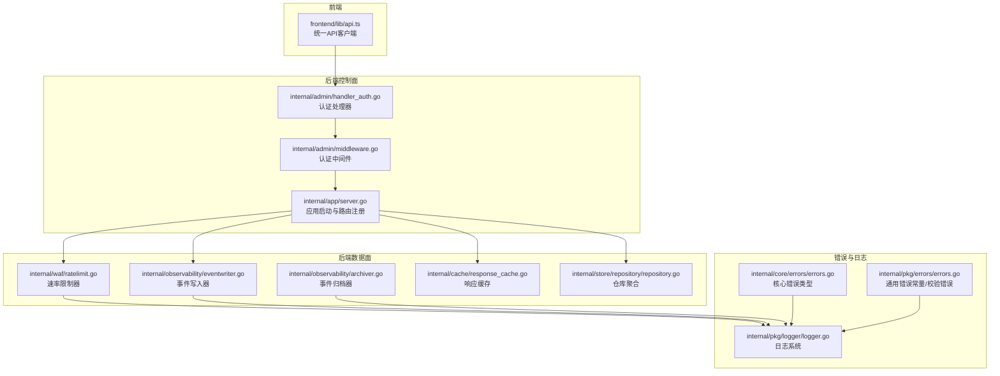
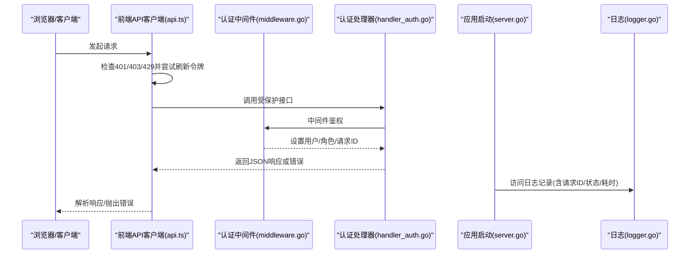
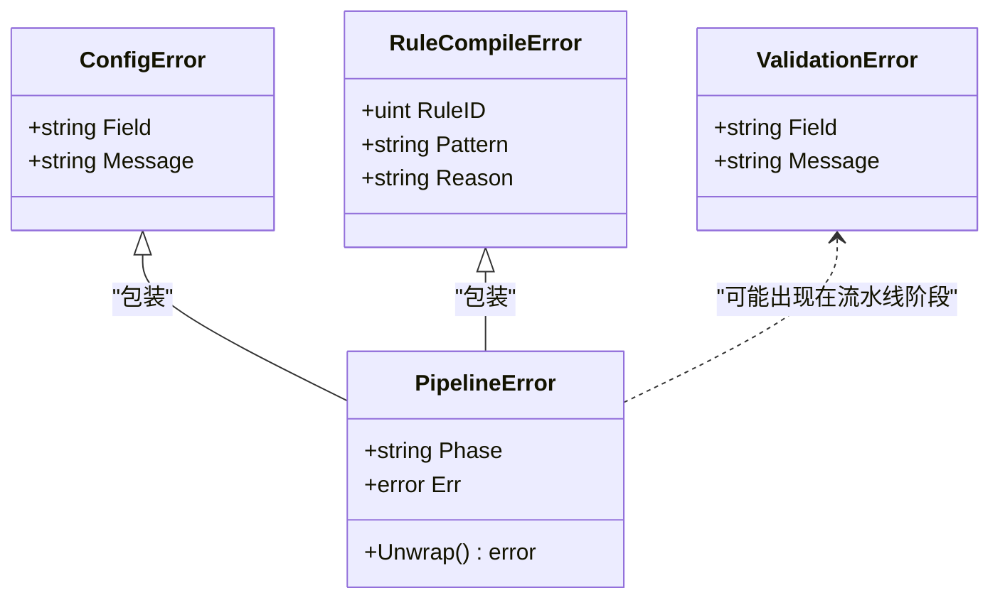
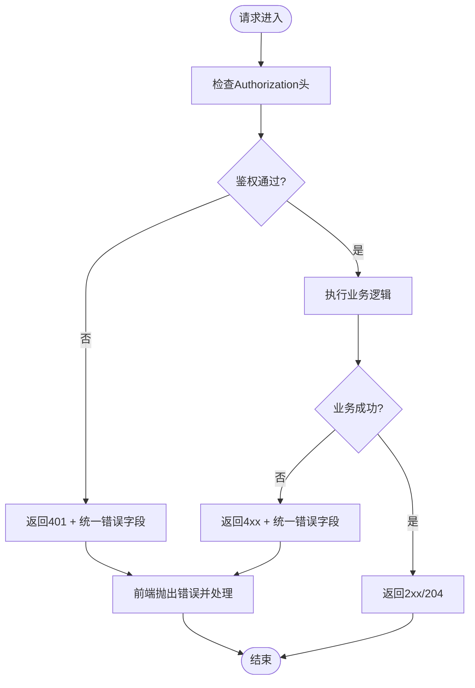
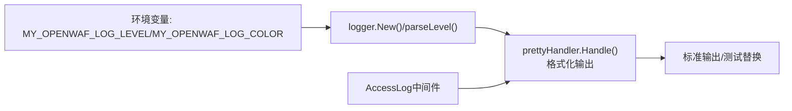
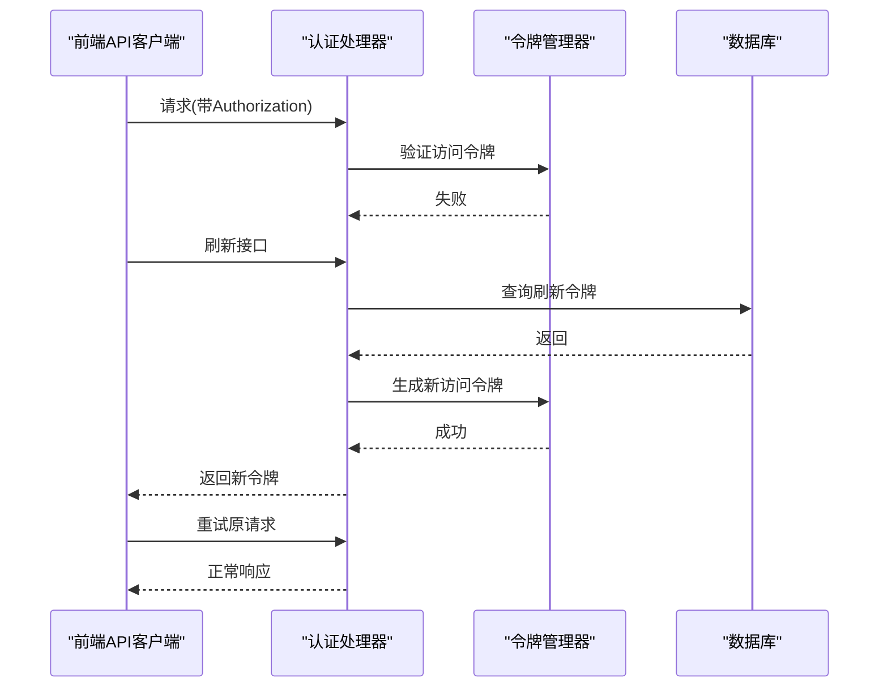
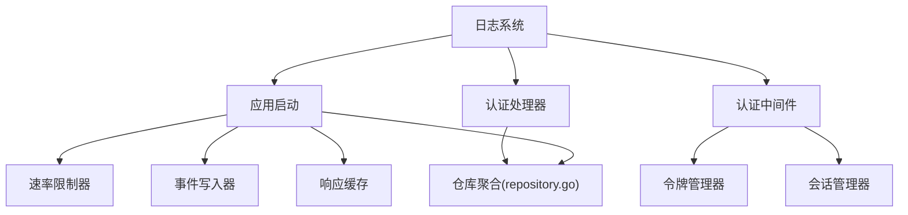

# 错误处理机制

<cite>
**本文档引用的文件**
- [errors.go](file://internal/core/errors/errors.go)
- [errors.go](file://internal/pkg/errors/errors.go)
- [logger.go](file://internal/pkg/logger/logger.go)
- [api.ts](file://frontend/lib/api.ts)
- [middleware.go](file://internal/admin/middleware.go)
- [server.go](file://internal/app/server.go)
- [ratelimit.go](file://internal/waf/ratelimit.go)
- [eventwriter.go](file://internal/observability/eventwriter.go)
- [archiver.go](file://internal/observability/archiver.go)
- [response_cache.go](file://internal/cache/response_cache.go)
- [repository.go](file://internal/store/repository/repository.go)
- [block.go](file://internal/waf/pages/block.go)
- [page.tsx](file://frontend/app/(dashboard)/settings/page.tsx)
- [page.tsx](file://frontend/app/(dashboard)/cc-protection/page.tsx)
- [access_log.go](file://internal/store/repository/access_log.go)
- [events.go](file://internal/store/events.go)
- [accesslog_writer.go](file://internal/observability/accesslog_writer.go)
- [handler_system.go](file://internal/admin/handler_system.go)
- [handler_auth.go](file://internal/admin/handler_auth.go)
</cite>

## 目录
1. [简介](#简介)
2. [项目结构](#项目结构)
3. [核心组件](#核心组件)
4. [架构总览](#架构总览)
5. [详细组件分析](#详细组件分析)
6. [依赖分析](#依赖分析)
7. [性能考虑](#性能考虑)
8. [故障排查指南](#故障排查指南)
9. [结论](#结论)
10. [附录](#附录)

## 简介
本文件系统化梳理 My-OpenWaf 的错误处理机制，覆盖错误类型定义、错误响应格式、日志记录规范、错误恢复策略（重试、降级、故障转移）以及客户端错误处理最佳实践与调试技巧。目标是帮助开发者与运维人员快速理解并正确使用统一的错误处理架构。

## 项目结构
围绕错误处理的关键模块分布如下：
- 后端 Go 语言层
  - 核心错误类型：internal/core/errors
  - 通用错误常量与校验错误：internal/pkg/errors
  - 日志系统：internal/pkg/logger
  - 认证与鉴权中间件：internal/admin
  - 应用启动与运行时：internal/app
  - WAF 速率限制与事件写入：internal/waf、internal/observability
  - 缓存与仓库聚合：internal/cache、internal/store/repository
- 前端 TypeScript 层
  - 统一 API 客户端与错误处理：frontend/lib/api.ts

**图表来源**
- [api.ts:1-317](file://frontend/lib/api.ts#L1-L317)
- [middleware.go:1-130](file://internal/admin/middleware.go#L1-L130)
- [handler_auth.go:1-351](file://internal/admin/handler_auth.go#L1-L351)
- [server.go:1-490](file://internal/app/server.go#L1-L490)
- [ratelimit.go:1-117](file://internal/waf/ratelimit.go#L1-L117)
- [eventwriter.go:1-105](file://internal/observability/eventwriter.go#L1-L105)
- [archiver.go:1-72](file://internal/observability/archiver.go#L1-L72)
- [response_cache.go:1-54](file://internal/cache/response_cache.go#L1-L54)
- [repository.go:1-43](file://internal/store/repository/repository.go#L1-L43)
- [errors.go:1-46](file://internal/core/errors/errors.go#L1-L46)
- [errors.go:1-27](file://internal/pkg/errors/errors.go#L1-L27)
- [logger.go:1-286](file://internal/pkg/logger/logger.go#L1-L286)

**章节来源**
- [server.go:1-490](file://internal/app/server.go#L1-L490)
- [logger.go:1-286](file://internal/pkg/logger/logger.go#L1-L286)

## 核心组件
- 错误类型与常量
  - 核心错误类型：配置错误、规则编译错误、流水线错误等，便于定位具体阶段与原因。
  - 通用错误常量：未找到、冲突、验证错误、未授权、禁止访问等，便于统一处理。
  - 验证错误结构体：包含字段与消息，支持序列化为标准错误响应。
- 日志系统
  - 全局单例 Handler，支持环境变量控制日志级别与颜色输出。
  - 结构化日志，统一包含时间戳、级别、模块、请求 ID、方法、路径、状态码、耗时等。
- 前端 API 客户端
  - 统一处理 401/403/429 与非 2xx 响应，自动刷新访问令牌并抛出可读错误。
  - 对分页与复杂对象进行类型约束，提升调试体验。

**章节来源**
- [errors.go:1-46](file://internal/core/errors/errors.go#L1-L46)
- [errors.go:1-27](file://internal/pkg/errors/errors.go#L1-L27)
- [logger.go:1-286](file://internal/pkg/logger/logger.go#L1-L286)
- [api.ts:1-317](file://frontend/lib/api.ts#L1-L317)

## 架构总览
统一错误处理架构由“前端 API 客户端 → 控制面中间件/处理器 → 数据面引擎与组件 → 日志系统”构成，形成从入口到落盘的完整闭环。

**图表来源**
- [api.ts:1-317](file://frontend/lib/api.ts#L1-L317)
- [middleware.go:1-130](file://internal/admin/middleware.go#L1-L130)
- [handler_auth.go:1-351](file://internal/admin/handler_auth.go#L1-L351)
- [server.go:1-490](file://internal/app/server.go#L1-L490)
- [logger.go:1-286](file://internal/pkg/logger/logger.go#L1-L286)

## 详细组件分析

### 错误类型与错误码分类
- 业务错误
  - 登录失败、账户锁定、权限不足、会话过期等，通过 HTTP 状态码与统一错误字段表达。
  - 示例：登录处理器对暴力破解进行临时锁定并返回剩余尝试次数；权限不足返回明确错误信息。
- 系统错误
  - 令牌生成失败、存储失败、初始化失败等，通常映射为 500 并记录详细错误。
- 网络错误
  - 前端对 401/403/429 进行特殊处理，429 可能来自上游或内置速率限制器。

**图表来源**
- [errors.go:1-46](file://internal/core/errors/errors.go#L1-L46)
- [errors.go:1-27](file://internal/pkg/errors/errors.go#L1-L27)

**章节来源**
- [handler_auth.go:1-351](file://internal/admin/handler_auth.go#L1-L351)
- [errors.go:1-46](file://internal/core/errors/errors.go#L1-L46)
- [errors.go:1-27](file://internal/pkg/errors/errors.go#L1-L27)

### 错误响应格式与异常处理流程
- 统一错误字段
  - error：字符串形式的错误描述；部分场景包含 retry_after_secs、remaining_attempts 等上下文字段。
  - 前端解析 JSON 并抛出可读错误，避免直接显示内部细节。
- 异常处理流程
  - 前端：401 自动刷新令牌并重试；401 刷新失败则清空本地令牌并跳转登录；403/429 抛出错误供 UI 显示。
  - 后端：中间件设置 X-Request-ID 并记录访问日志；处理器按业务逻辑返回 4xx/5xx 并携带统一错误字段。

**图表来源**
- [middleware.go:1-130](file://internal/admin/middleware.go#L1-L130)
- [handler_auth.go:1-351](file://internal/admin/handler_auth.go#L1-L351)
- [api.ts:1-317](file://frontend/lib/api.ts#L1-L317)

**章节来源**
- [middleware.go:1-130](file://internal/admin/middleware.go#L1-L130)
- [handler_auth.go:1-351](file://internal/admin/handler_auth.go#L1-L351)
- [api.ts:1-317](file://frontend/lib/api.ts#L1-L317)

### 错误日志记录
- 日志级别与输出
  - 通过环境变量控制级别（DEBUG/INFO/WARN/ERROR），默认 INFO；支持彩色输出与终端检测。
- 上下文信息
  - 所有日志包含模块 section、请求 ID、方法、路径、状态码、耗时等，便于关联追踪。
- 敏感数据保护
  - 日志系统不包含明文密码、令牌等敏感信息；错误响应也仅返回通用错误描述。

**图表来源**
- [logger.go:1-286](file://internal/pkg/logger/logger.go#L1-L286)
- [middleware.go:98-119](file://internal/admin/middleware.go#L98-L119)

**章节来源**
- [logger.go:1-286](file://internal/pkg/logger/logger.go#L1-L286)
- [middleware.go:98-119](file://internal/admin/middleware.go#L98-L119)

### 错误恢复策略
- 重试机制
  - 前端对 401 场景尝试刷新令牌并重试一次；若刷新失败则清空本地令牌并引导登录。
- 降级处理
  - 事件写入器采用异步批处理与缓冲队列，避免阻塞热路径；当缓冲满时记录警告并丢弃事件，保证系统稳定。
  - 响应缓存采用分片互斥与 LRU-like 结构，降低锁竞争并支持 TTL 过期清理。
- 故障转移
  - 应用启动时根据快照动态增删站点监听器，检测配置漂移并自动重启受影响实例，确保服务连续性。
  - 速率限制器与 IP 黑名单/白名单在保护配置变更时热更新，实现动态防护。

**图表来源**
- [api.ts:16-88](file://frontend/lib/api.ts#L16-L88)
- [handler_auth.go:125-193](file://internal/admin/handler_auth.go#L125-L193)
- [middleware.go:18-72](file://internal/admin/middleware.go#L18-L72)

**章节来源**
- [api.ts:1-317](file://frontend/lib/api.ts#L1-L317)
- [handler_auth.go:1-351](file://internal/admin/handler_auth.go#L1-L351)
- [eventwriter.go:1-105](file://internal/observability/eventwriter.go#L1-L105)
- [response_cache.go:1-54](file://internal/cache/response_cache.go#L1-L54)
- [server.go:220-260](file://internal/app/server.go#L220-L260)

### 客户端错误处理最佳实践与调试技巧
- 最佳实践
  - 使用统一的 API 客户端封装，集中处理 401/403/429 与非 2xx 场景。
  - 将错误信息转换为用户可读提示，避免暴露内部实现细节。
  - 在 UI 中展示请求 ID，便于用户反馈与后台检索。
- 调试技巧
  - 前端页面提供“诊断信息”区域，包含请求 ID 等字段，指导用户提供准确线索。
  - 后端中间件设置 X-Request-ID 并记录访问日志，结合数据库安全事件表进行交叉验证。

**章节来源**
- [api.ts:1-317](file://frontend/lib/api.ts#L1-L317)
- [middleware.go:98-119](file://internal/admin/middleware.go#L98-L119)
- [eventwriter.go:1-105](file://internal/observability/eventwriter.go#L1-L105)

## 依赖分析
- 组件耦合
  - 认证中间件依赖令牌管理器与会话管理器，处理器依赖仓库与数据库。
  - 应用启动器聚合各子系统（速率限制、事件写入、缓存、仓库），并负责热重载与监听器协调。
- 外部依赖
  - 日志系统基于标准库 slog；前端使用 fetch 与浏览器 Cookie；后端使用 Hertz Web 框架。

**图表来源**
- [middleware.go:1-130](file://internal/admin/middleware.go#L1-L130)
- [handler_auth.go:1-351](file://internal/admin/handler_auth.go#L1-L351)
- [server.go:1-490](file://internal/app/server.go#L1-L490)
- [repository.go:1-43](file://internal/store/repository/repository.go#L1-L43)
- [logger.go:1-286](file://internal/pkg/logger/logger.go#L1-L286)

**章节来源**
- [server.go:1-490](file://internal/app/server.go#L1-L490)
- [repository.go:1-43](file://internal/store/repository/repository.go#L1-L43)

## 性能考虑
- 事件写入器采用异步批处理与定时刷新，避免阻塞热路径；缓冲区满时记录告警并丢弃事件，防止雪崩。
- 响应缓存使用分片互斥减少锁竞争，TTL 过期清理释放内存。
- 速率限制器固定窗口计数，配合清理协程定期回收过期窗口，降低内存占用。

**章节来源**
- [eventwriter.go:1-105](file://internal/observability/eventwriter.go#L1-L105)
- [response_cache.go:1-54](file://internal/cache/response_cache.go#L1-L54)
- [ratelimit.go:1-117](file://internal/waf/ratelimit.go#L1-L117)

## 故障排查指南
- 常见问题定位
  - 401 未授权：检查 Authorization 头格式与令牌有效性；确认刷新流程是否成功。
  - 403 权限不足：确认用户角色与所需权限；检查 RBAC 规则。
  - 429 频率限制：检查请求/错误速率限制配置；关注错误响应中的 retry_after_secs 或 remaining_attempts 字段。
  - 500 系统错误：查看应用日志中的错误堆栈与上下文信息，定位具体模块。
- 日志检索
  - 使用 X-Request-ID 在访问日志与安全事件中进行关联查询。
  - 关注事件写入器与归档器的日志，确认事件持久化状态与清理情况。

**章节来源**
- [handler_auth.go:1-351](file://internal/admin/handler_auth.go#L1-L351)
- [middleware.go:1-130](file://internal/admin/middleware.go#L1-L130)
- [eventwriter.go:1-105](file://internal/observability/eventwriter.go#L1-L105)
- [archiver.go:1-72](file://internal/observability/archiver.go#L1-L72)

## 结论
本项目通过“统一错误类型 + 标准化响应 + 结构化日志 + 异步降级 + 热更新”的组合，构建了高可用、可观测且易维护的错误处理体系。前端与后端协同，既保障用户体验，又便于运维排障与持续演进。

## 附录
- 错误码与语义建议
  - 400：请求体绑定失败、参数非法（统一返回 error 字段）
  - 401：缺少/无效/过期令牌（前端自动刷新，刷新失败则清空令牌并跳转登录）
  - 403：权限不足（RBAC 不足）
  - 404：资源不存在
  - 409：资源冲突
  - 429：请求/错误频率过高（返回 retry_after_secs 或 remaining_attempts）
  - 500：系统内部错误（记录详细错误并返回通用描述）

- 数据平面错误页面与自定义模板
  - 数据平面在处理阶段遇到错误时，会根据状态码生成相应的错误页面，支持国际化标题与消息。
  - 管理界面允许为不同状态码配置自定义 HTML 模板，模板变量支持状态码、消息、客户端 IP、请求 ID 等。

**章节来源**
- [block.go:145-174](file://internal/waf/pages/block.go#L145-L174)
- [page.tsx:742-760](file://frontend/app/(dashboard)/settings/page.tsx#L742-L760)
- [page.tsx:597-620](file://frontend/app/(dashboard)/cc-protection/page.tsx#L597-L620)