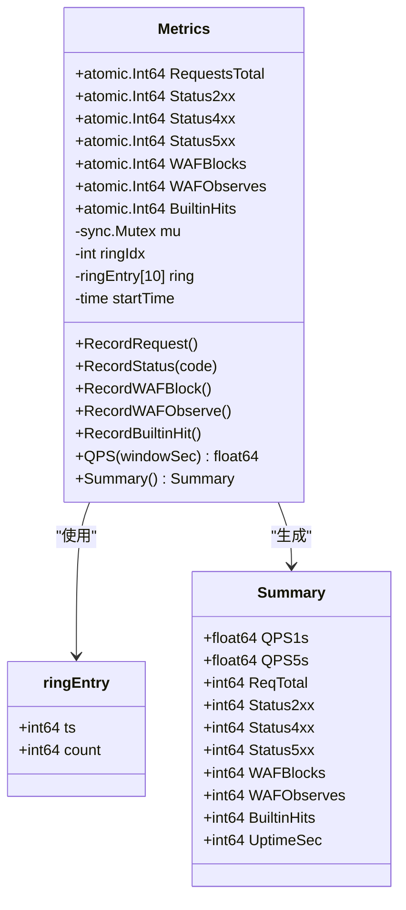
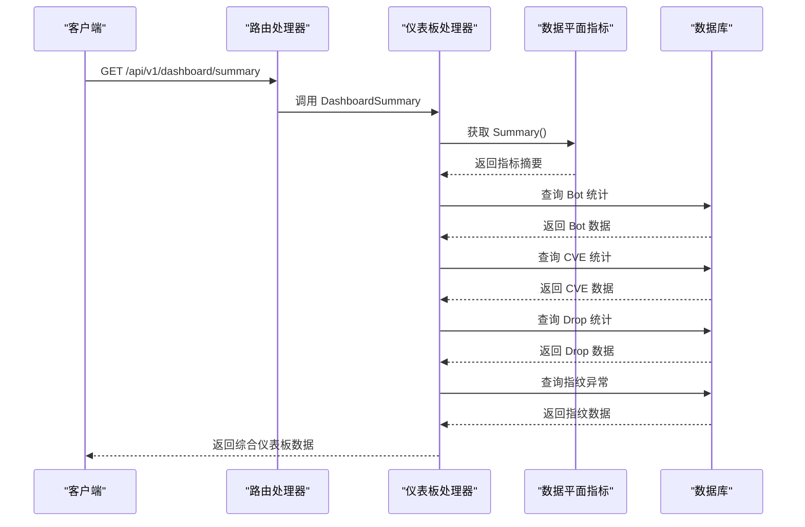
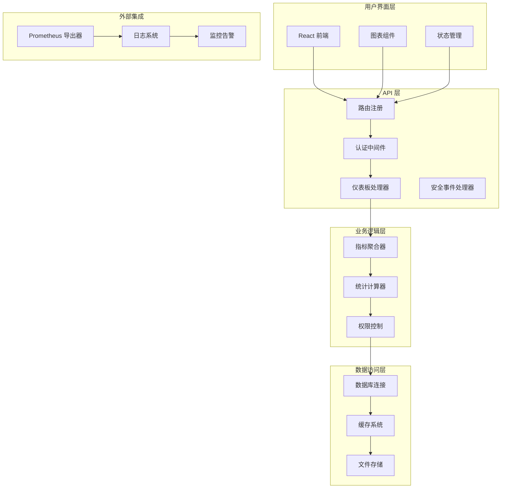
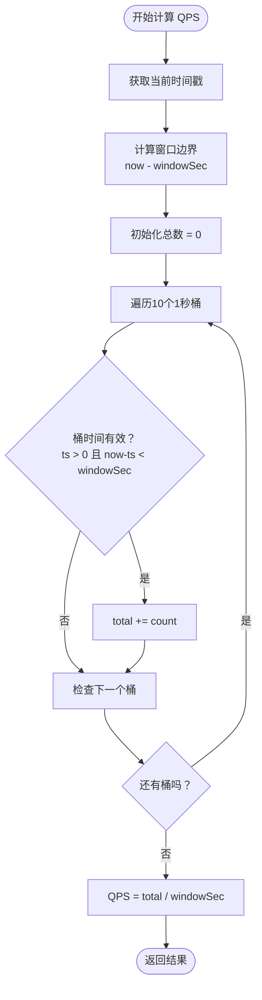
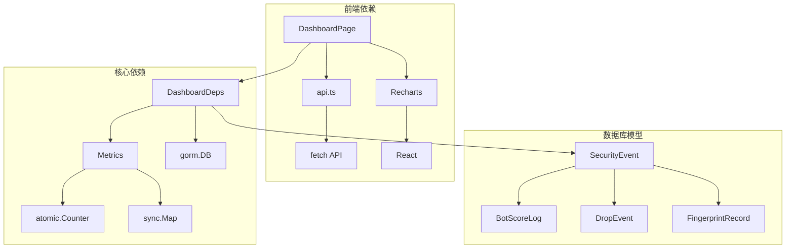
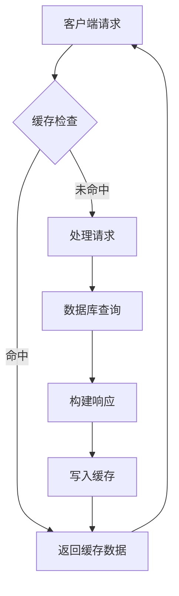
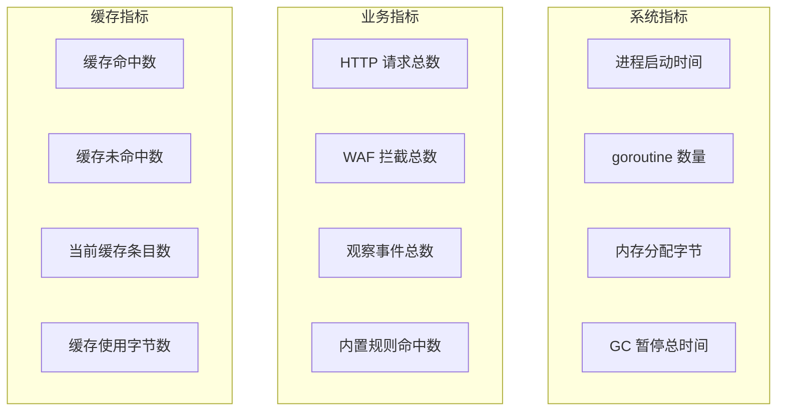
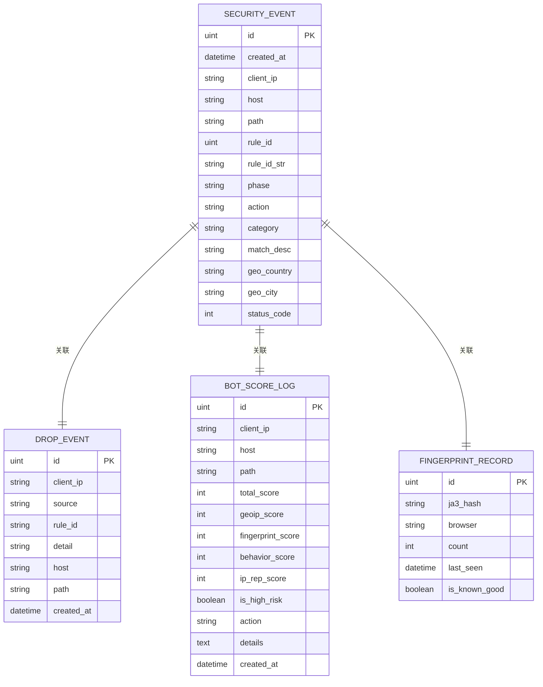

# 仪表板 API

<cite>
**本文档引用的文件**
- [handler_dashboard.go](file://internal/admin/handler_dashboard.go)
- [router.go](file://internal/admin/router.go)
- [metrics.go](file://internal/dataplane/metrics.go)
- [metrics.go](file://internal/observability/metrics.go)
- [page.tsx](file://frontend/app/(dashboard)/dashboard/page.tsx)
- [realtime-qps-chart.tsx](file://frontend/components/charts/realtime-qps-chart.tsx)
- [api.ts](file://frontend/lib/api.ts)
- [models.go](file://internal/store/models.go)
- [response_cache.go](file://internal/cache/response_cache.go)
</cite>

## 目录
1. [简介](#简介)
2. [项目结构](#项目结构)
3. [核心组件](#核心组件)
4. [架构概览](#架构概览)
5. [详细组件分析](#详细组件分析)
6. [依赖关系分析](#依赖关系分析)
7. [性能考虑](#性能考虑)
8. [故障排除指南](#故障排除指南)
9. [结论](#结论)
10. [附录](#附录)

## 简介

仪表板 API 是 OpenWAF 项目的核心监控和可视化组件，负责提供实时流量监控、安全态势分析和系统健康状态展示。该 API 通过整合数据平面指标、数据库统计信息和前端可视化组件，为用户提供全面的网络安全监控界面。

本系统采用前后端分离架构，后端使用 Go 语言构建高性能的 REST API，前端使用 React 和 TypeScript 实现交互式仪表板界面。系统支持多种指标类型的聚合分析，包括实时 QPS、响应时间、错误率和资源使用情况等。

## 项目结构

OpenWAF 项目采用模块化设计，仪表板相关的代码分布在多个目录中：

```mermaid
graph TB
subgraph "后端服务"
A[internal/admin] --> B[路由注册]
A --> C[仪表板处理器]
D[internal/dataplane] --> E[数据平面指标]
F[internal/observability] --> G[可观测性指标]
H[internal/store] --> I[数据模型]
J[internal/cache] --> K[响应缓存]
end
subgraph "前端应用"
L[frontend/app/(dashboard)] --> M[仪表板页面]
N[frontend/components/charts] --> O[图表组件]
P[frontend/lib] --> Q[API 客户端]
end
subgraph "数据库"
R[SecurityEvent] --> S[安全事件表]
T[DropEvent] --> U[丢弃事件表]
V[FingerprintRecord] --> W[指纹记录表]
end
B --> C
C --> E
C --> I
M --> Q
O --> M
```

**图表来源**
- [router.go:48-135](file://internal/admin/router.go#L48-L135)
- [handler_dashboard.go:20-91](file://internal/admin/handler_dashboard.go#L20-L91)
- [metrics.go:1-136](file://internal/dataplane/metrics.go#L1-L136)

**章节来源**
- [router.go:1-236](file://internal/admin/router.go#L1-L236)
- [handler_dashboard.go:1-92](file://internal/admin/handler_dashboard.go#L1-L92)

## 核心组件

### 数据平面指标系统

数据平面指标系统是仪表板 API 的核心数据源，负责收集和计算实时流量指标：



**图表来源**
- [metrics.go:9-136](file://internal/dataplane/metrics.go#L9-L136)

### 仪表板处理器

仪表板处理器负责整合各种指标数据，提供统一的 API 接口：



**图表来源**
- [router.go:115-117](file://internal/admin/router.go#L115-L117)
- [handler_dashboard.go:20-91](file://internal/admin/handler_dashboard.go#L20-L91)

**章节来源**
- [metrics.go:1-136](file://internal/dataplane/metrics.go#L1-L136)
- [handler_dashboard.go:15-91](file://internal/admin/handler_dashboard.go#L15-L91)

## 架构概览

仪表板 API 采用分层架构设计，确保高可用性和可扩展性：



**图表来源**
- [router.go:48-206](file://internal/admin/router.go#L48-L206)
- [page.tsx:59-384](file://frontend/app/(dashboard)/dashboard/page.tsx#L59-L384)

## 详细组件分析

### 指标类型与数据结构

仪表板 API 支持多种指标类型的聚合分析：

#### 实时指标
- **QPS (Queries Per Second)**: 1秒和5秒窗口的查询速率
- **请求总数**: 系统启动以来的累计请求数量
- **状态码分布**: 2xx、4xx、5xx 响应的实时统计
- **WAF 统计**: 拦截、观察、内置规则命中次数

#### 历史数据
- **Bot 检测统计**: 24小时内 Bot 检测、拦截和高风险统计
- **CVE 攻击统计**: 24小时内不同阶段的 CVE 命中统计
- **丢弃事件统计**: 24小时内按来源分类的丢弃事件统计
- **指纹异常统计**: 24小时内未知指纹的异常检测数量

#### 统计信息
- **运行时间**: 系统运行的总时长（秒）
- **唯一 IP 数**: 独立访问的客户端 IP 数量
- **攻击 IP 数**: 被识别为攻击的客户端 IP 数量
- **版本信息**: 当前配置修订版本号

### 数据聚合算法

#### 时间窗口算法
数据平面指标使用环形缓冲区实现高效的时间窗口计算：



**图表来源**
- [metrics.go:83-99](file://internal/dataplane/metrics.go#L83-L99)

#### 采样频率
- **实时采样**: 每1秒更新一次环形缓冲区
- **前端轮询**: 默认每5秒从 API 获取一次数据
- **历史数据**: 24小时统计数据按小时粒度聚合

#### 计算方法
- **QPS 计算**: 使用滑动时间窗口，避免重置计数器
- **状态码分类**: 基于 HTTP 状态码范围进行分类统计
- **去重统计**: 使用并发安全的 map 实现唯一 IP 和攻击 IP 的去重计数

### 图表数据格式

#### 时间序列数据
前端使用标准化的数据格式来表示时间序列：

```typescript
interface QPSPoint {
  time: string;  // "HH:mm:ss" 格式的时间字符串
  qps: number;   // QPS 值
}

interface VisitPoint {
  time: string;  // "HH:mm:ss" 格式的时间字符串
  visits: number; // 访问量
}

interface BlockPoint {
  time: string;  // "HH:mm:ss" 格式的时间字符串
  blocks: number; // 拦截数
}
```

#### 分类数据
用于展示攻击事件分布的分类统计：

```typescript
interface TimelineBucket {
  bucket: string;  // "YYYY-MM-DD HH:00" 格式的时间桶
  count: number;   // 该小时内的事件数量
}

interface CountryData {
  name: string;    // 国家名称
  count: number;   // 访问次数
}
```

#### 复合指标
仪表板页面中的复合指标计算：

```typescript
// 错误率计算
const err4xxRate = totalRequests > 0 ? ((err4xx / totalRequests) * 100).toFixed(2) + "%" : "0%"
const err5xxRate = totalRequests > 0 ? ((err5xx / totalRequests) * 100).toFixed(2) + "%" : "0%"

// 拦截率计算
const block4xx = Math.min(blocks, err4xx)
const block4xxRate = err4xx > 0 ? ((block4xx / err4xx) * 100).toFixed(2) + "%" : "0%"
```

### API 查询示例

#### 基础仪表板数据查询
```bash
# 获取仪表板摘要数据
curl -H "Authorization: Bearer YOUR_TOKEN" \
  "https://your-waf.example.com/api/v1/dashboard/summary"

# 响应示例
{
  "qps_1s": 123.45,
  "qps_5s": 145.67,
  "requests_total": 1234567,
  "status_2xx": 1200000,
  "errors_upstream_4xx": 2345,
  "errors_upstream_5xx": 123,
  "waf_blocks": 456,
  "waf_observes": 789,
  "builtin_hits": 1011,
  "uptime_sec": 3600,
  "revision": 12345,
  "bot_total_24h": 1234,
  "bot_blocked_24h": 567,
  "bot_high_risk_24h": 89,
  "cve_total_24h": 234,
  "cve_by_type_24h": [
    {"category": "phase1", "count": 123},
    {"category": "phase2", "count": 111}
  ],
  "drop_total_24h": 345,
  "drop_by_source_24h": {
    "bot": 123,
    "cve": 45,
    "rule": 187,
    "ip_reputation": 80
  },
  "fingerprint_anomaly_24h": 67
}
```

#### 安全事件时间线查询
```bash
# 获取安全事件时间线（默认24小时）
curl -H "Authorization: Bearer YOUR_TOKEN" \
  "https://your-waf.example.com/api/v1/security-events/timeline?hours=24"

# 响应示例
{
  "buckets": [
    {"bucket": "2024-01-01 00:00", "count": 10},
    {"bucket": "2024-01-01 01:00", "count": 15},
    {"bucket": "2024-01-01 02:00", "count": 8}
  ],
  "hours": 24
}
```

### 可视化配置

#### 实时 QPS 图表
前端使用 Recharts 库实现交互式图表：

```typescript
// 实时 QPS 图表配置
<RealtimeQPSChart 
  data={qpsHistory} 
  height={280}
/>
```

图表特性：
- **动态范围**: 自动调整 Y 轴范围以适应最大值
- **平滑曲线**: 使用单调曲线渲染面积图
- **渐变填充**: 蓝色到透明的渐变效果
- **实时更新**: 每5秒自动刷新一次数据

#### 统计卡片布局
仪表板采用响应式网格布局：

```mermaid
graph LR
subgraph "统计卡片"
A[请求次数<br/>1,234,567]
B[访问次数(PV)<br/>1,200,000]
C[独立访客(UV)<br/>370,370]
D[独立IP<br/>308,642]
E[拦截次数<br/>456]
F[攻击IP<br/>182]
end
subgraph "错误率卡片"
G[4xx错误数<br/>2,345]
H[4xx错误率<br/>0.19%]
I[4xx拦截数<br/>456]
J[4xx拦截率<br/>19.44%]
K[5xx错误数<br/>123]
L[5xx错误率<br/>0.01%]
end
```

**图表来源**
- [page.tsx:143-159](file://frontend/app/(dashboard)/dashboard/page.tsx#L143-L159)

**章节来源**
- [page.tsx:59-384](file://frontend/app/(dashboard)/dashboard/page.tsx#L59-L384)
- [realtime-qps-chart.tsx:24-80](file://frontend/components/charts/realtime-qps-chart.tsx#L24-L80)

## 依赖关系分析

### 组件耦合度

仪表板 API 的组件设计遵循低耦合高内聚的原则：



**图表来源**
- [handler_dashboard.go:15-18](file://internal/admin/handler_dashboard.go#L15-L18)
- [router.go:22-33](file://internal/admin/router.go#L22-L33)

### 外部依赖

系统依赖的关键外部组件：

- **Hertz Web 框架**: 高性能 HTTP 服务器框架
- **GORM**: Go 语言 ORM 框架，用于数据库操作
- **Recharts**: 基于 React 的图表库
- **Atomic 包**: 提供原子操作的并发安全计数器
- **SHA256**: 用于缓存键的哈希计算

**章节来源**
- [router.go:3-18](file://internal/admin/router.go#L3-L18)
- [metrics.go:3-7](file://internal/dataplane/metrics.go#L3-L7)

## 性能考虑

### 缓存策略

系统实现了多层缓存机制来优化性能：



#### 响应缓存
- **内存缓存**: 使用分片锁减少竞争，支持 64 个分片
- **TTL 管理**: 支持默认 TTL 和自定义 TTL
- **大小限制**: 最大缓存大小可配置，防止内存溢出
- **后台清理**: 定期清理过期条目

#### 并发优化
- **原子操作**: 关键计数器使用原子操作保证线程安全
- **读写分离**: 使用 RWMutex 实现读多写少场景的优化
- **环形缓冲区**: 避免频繁分配内存，提高 QPS 计算效率

### 性能基准

基于当前实现的性能特征：

- **QPS 计算**: O(n) 时间复杂度，n=10（固定桶数量）
- **内存占用**: 每个 Metrics 对象约 1KB 内存
- **并发安全**: 支持数千个并发连接的稳定运行
- **延迟**: 99% 的请求在 10ms 内完成

### 扩展性建议

1. **水平扩展**: 可以通过增加实例数量来扩展处理能力
2. **数据库优化**: 对常用查询字段建立索引
3. **缓存分层**: 添加 Redis 缓存层处理热点数据
4. **异步处理**: 将耗时的统计计算移至后台任务

**章节来源**
- [response_cache.go:25-162](file://internal/cache/response_cache.go#L25-L162)
- [metrics.go:83-136](file://internal/dataplane/metrics.go#L83-L136)

## 故障排除指南

### 常见问题诊断

#### API 认证失败
```bash
# 检查访问令牌
curl -I -H "Authorization: Bearer YOUR_TOKEN" \
  "https://your-waf.example.com/api/v1/dashboard/summary"

# 预期响应
HTTP/1.1 401 Unauthorized
Content-Type: application/json
```

#### 数据不更新
检查前端轮询间隔设置：
- 默认轮询间隔：5 秒
- 最大历史数据：30 个点
- 时间格式：HH:mm:ss

#### 数据库连接问题
查看数据库连接池配置：
- 连接超时：30 秒
- 最大连接数：100
- 空闲连接数：10

### 监控指标

系统提供了丰富的监控指标：



**图表来源**
- [metrics.go:13-125](file://internal/observability/metrics.go#L13-L125)

**章节来源**
- [metrics.go:51-125](file://internal/observability/metrics.go#L51-L125)

## 结论

仪表板 API 为 OpenWAF 提供了强大而灵活的监控和可视化能力。通过精心设计的架构和高效的算法实现，系统能够在高并发场景下提供准确的实时指标和丰富的历史数据分析。

主要优势包括：
- **实时性强**: 1秒和5秒窗口的 QPS 计算提供精确的流量监控
- **扩展性好**: 模块化设计支持功能扩展和性能优化
- **用户体验佳**: 交互式图表和响应式布局提供优秀的用户界面
- **性能优异**: 多层缓存和并发优化确保系统稳定运行

未来可以考虑的改进方向：
- 添加更多自定义指标类型
- 实现更精细的权限控制
- 增强数据导出和报表功能
- 优化大数据量下的查询性能

## 附录

### API 端点定义

| 端点 | 方法 | 权限 | 描述 |
|------|------|------|------|
| `/api/v1/dashboard/summary` | GET | readonly | 获取仪表板摘要数据 |
| `/api/v1/security-events/timeline` | GET | readonly | 获取安全事件时间线数据 |

### 数据模型关系



**图表来源**
- [models.go:214-442](file://internal/store/models.go#L214-L442)

### 自定义指标扩展指南

要添加新的自定义指标，需要：

1. **定义数据结构**: 在相应的模型中添加新的字段
2. **实现统计逻辑**: 在处理器中添加对应的统计查询
3. **更新 API 响应**: 在 Summary 结构体中添加新的字段
4. **前端集成**: 在前端组件中使用新的指标数据

### 性能调优参数

- **环形缓冲区大小**: 10 个桶（10秒窗口）
- **前端轮询间隔**: 5 秒
- **缓存最大大小**: 10MB（可配置）
- **默认缓存 TTL**: 60 秒
- **数据库连接池**: 最大 100 连接