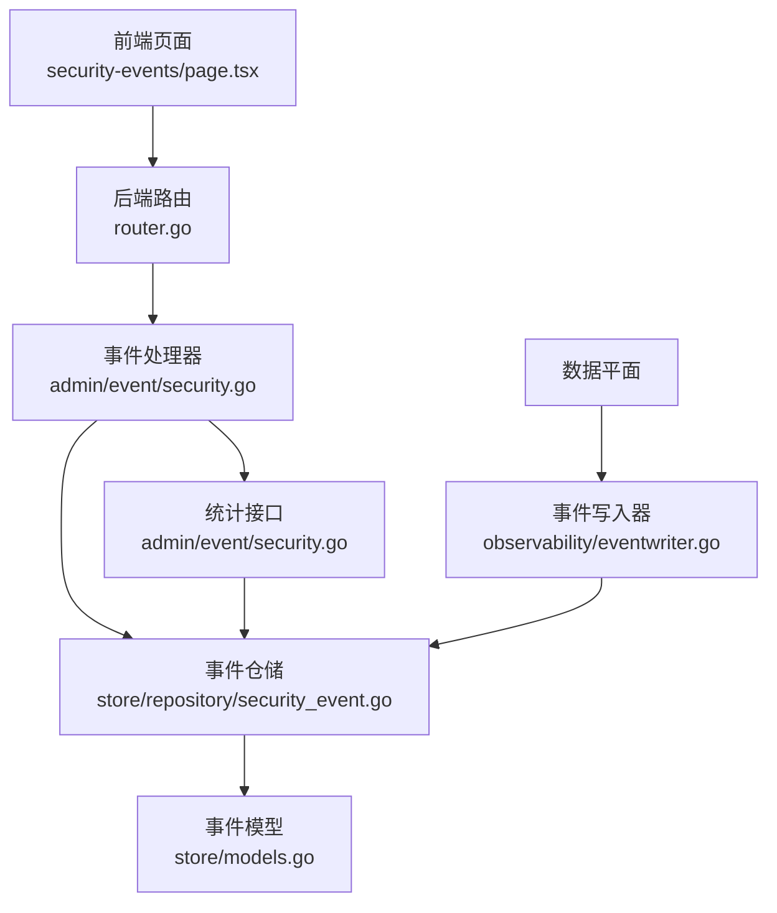
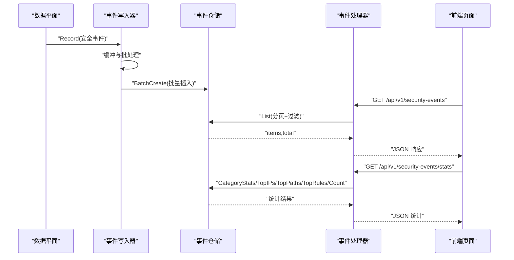
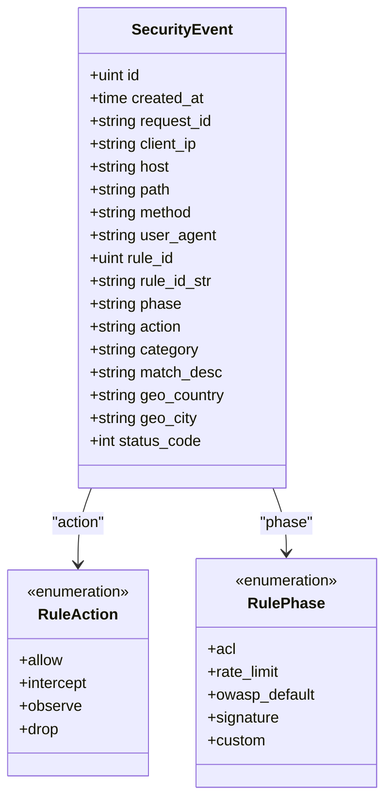
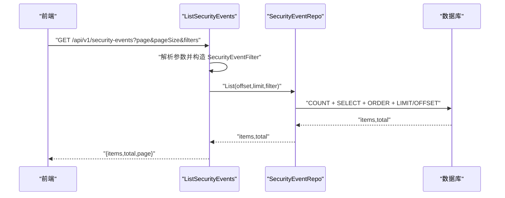
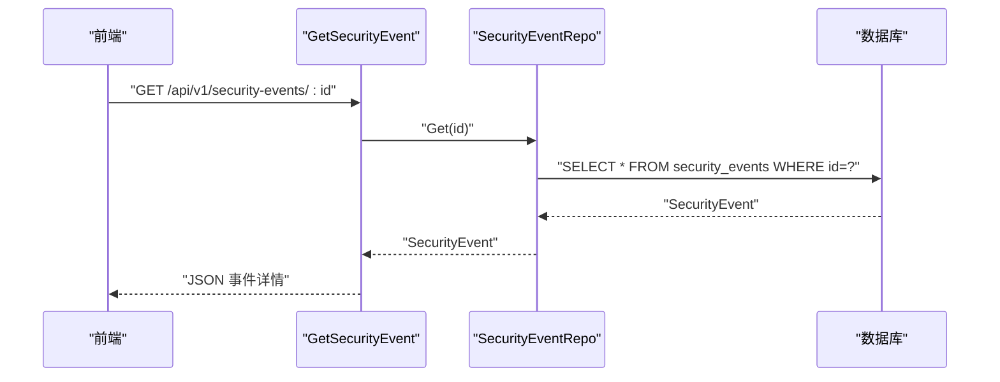
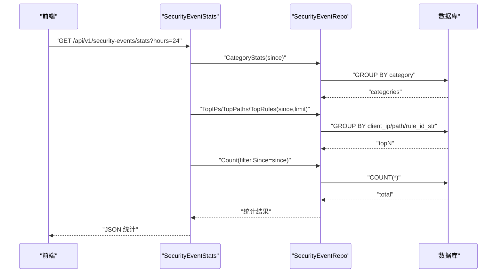
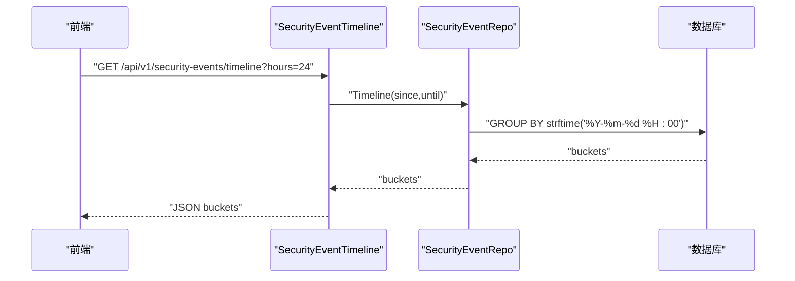
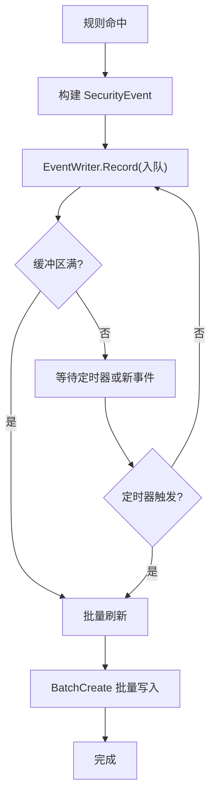
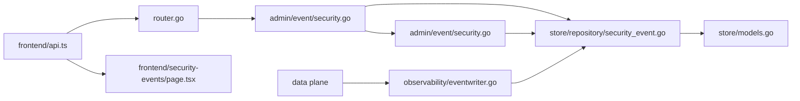

# 安全事件 API

<cite>
**本文档引用的文件**
- [安全事件 API.md](file://docs/管理 API 系统/安全事件 API.md)
- [security.go](file://internal/admin/event/security.go)
- [security_event.go](file://internal/store/repository/security_event.go)
- [router.go](file://internal/admin/router.go)
- [eventwriter.go](file://internal/observability/eventwriter.go)
- [page.tsx](file://frontend/app/(dashboard)/security-events/page.tsx)
- [api.ts](file://frontend/lib/api.ts)
</cite>

## 目录
1. [简介](#简介)
2. [项目结构](#项目结构)
3. [核心组件](#核心组件)
4. [架构总览](#架构总览)
5. [详细组件分析](#详细组件分析)
6. [依赖关系分析](#依赖关系分析)
7. [性能考量](#性能考量)
8. [故障排查指南](#故障排查指南)
9. [结论](#结论)
10. [附录](#附录)

## 简介
本文件为安全事件 API 的权威技术文档，覆盖事件类型、严重级别与分类标准；事件查询接口（时间范围过滤、事件类型筛选、分页查询）；事件统计分析（趋势、分布统计、聚合分析）；事件详情展示（元数据、上下文信息、关联分析）；完整查询示例与分析报告；事件告警机制与通知策略；以及事件溯源与取证分析能力说明。文档面向开发者与运维人员，既提供代码级细节，也提供可视化架构图与流程图，帮助快速理解与落地。

## 项目结构
后端采用 Go 语言实现，前端使用 Next.js（React）。安全事件 API 由路由注册、处理器、仓储层与模型定义组成，并通过事件写入器异步持久化到数据库。前端页面负责筛选、分页、统计与详情展示，并支持导出 CSV。

图表来源
- [router.go:104-112](file://internal/admin/router.go#L104-L112)
- [security.go:17-229](file://internal/admin/event/security.go#L17-L229)
- [security_event.go:11-293](file://internal/store/repository/security_event.go#L11-L293)
- [eventwriter.go:19-164](file://internal/observability/eventwriter.go#L19-L164)

章节来源
- [router.go:104-112](file://internal/admin/router.go#L104-L112)
- [page.tsx:60-259](file://frontend/app/(dashboard)/security-events/page.tsx#L60-L259)

## 核心组件
- 路由与权限：后端路由统一挂载在 /api/v1 下，安全事件相关接口通过认证中间件保护，支持只读角色访问。
- 处理器：提供事件列表、详情、统计与时间线接口，解析查询参数并调用仓储层。
- 仓储层：封装 GORM 查询，提供分页、过滤、聚合与时间线统计。
- 模型：定义安全事件字段（请求标识、客户端 IP、Host、路径、方法、用户代理、规则 ID、阶段、动作、类别、匹配描述、地理信息、状态码等）。
- 事件写入器：缓冲与批处理写入，避免数据面阻塞。
- 前端页面：筛选器、分页、统计卡片、事件表格、详情弹窗与 CSV 导出。

章节来源
- [router.go:104-112](file://internal/admin/router.go#L104-L112)
- [security.go:17-229](file://internal/admin/event/security.go#L17-L229)
- [security_event.go:11-293](file://internal/store/repository/security_event.go#L11-L293)
- [eventwriter.go:19-164](file://internal/observability/eventwriter.go#L19-L164)
- [page.tsx:60-259](file://frontend/app/(dashboard)/security-events/page.tsx#L60-L259)

## 架构总览
下图展示从数据平面到事件写入器、再到仓储层与 API 的整体链路，以及前端如何调用后端接口。

图表来源
- [eventwriter.go:118-139](file://internal/observability/eventwriter.go#L118-L139)
- [security_event.go:32-46](file://internal/store/repository/security_event.go#L32-L46)
- [security.go:17-229](file://internal/admin/event/security.go#L17-L229)
- [page.tsx:89-115](file://frontend/app/(dashboard)/security-events/page.tsx#L89-L115)

## 详细组件分析

### 事件类型、严重级别与分类标准
- 事件类型（类别）：来源于规则匹配时的分类，如 SQL 注入、XSS、路径遍历、Webshell、反弹 Shell、SSRF、命令注入、XXE、LDAP 注入、NoSQL 注入、模板注入、文件上传、协议违规、恶意 Bot、可疑 Bot、速率限制等。前端选择器中列举了常见类别，便于筛选与统计。
- 动作（Action）：允许（allow）、拦截（intercept）、观察（observe）、丢弃（drop）。其中 drop 为最高优先级，直接关闭 TCP 连接且不返回响应。
- 阶段（Phase）：规则执行阶段，如 acl、rate_limit、owasp_default、signature、custom。
- 严重级别：当前代码未定义独立“严重级别”字段，但可通过动作与类别组合进行风险分级（例如拦截类事件优先级更高）。

图表来源
- [security_event.go:11-30](file://internal/store/repository/security_event.go#L11-L30)
- [security_event.go:96-149](file://internal/store/repository/security_event.go#L96-L149)

章节来源
- [page.tsx:210-259](file://frontend/app/(dashboard)/security-events/page.tsx#L210-L259)
- [security_event.go:11-30](file://internal/store/repository/security_event.go#L11-L30)

### 事件查询接口
- 接口路径：GET /api/v1/security-events
- 查询参数：
  - 分页：page（页码）、page_size（每页条数）
  - 过滤：action（动作）、phase（阶段）、category（类别）、client_ip（客户端 IP）、host（主机）、path（路径）、rule_id（规则 ID）
  - 时间范围：since（起始时间 RFC3339）、until（结束时间 RFC3339）
- 返回：
  - items：事件数组
  - total：满足条件的总条数
  - page：当前页码
- 分页算法：offset = (page - 1) × page_size，limit = page_size

图表来源
- [security.go:17-59](file://internal/admin/event/security.go#L17-L59)
- [security_event.go:32-46](file://internal/store/repository/security_event.go#L32-L46)
- [page.tsx:89-115](file://frontend/app/(dashboard)/security-events/page.tsx#L89-L115)

章节来源
- [security.go:17-59](file://internal/admin/event/security.go#L17-L59)
- [security_event.go:17-30](file://internal/store/repository/security_event.go#L17-L30)
- [security_event.go:32-46](file://internal/store/repository/security_event.go#L32-L46)
- [page.tsx:76-115](file://frontend/app/(dashboard)/security-events/page.tsx#L76-L115)

### 事件详情展示
- 接口路径：GET /api/v1/security-events/:id
- 返回字段：包含事件元数据（请求 ID、时间、客户端 IP、Host、方法、路径、User-Agent）、规则信息（ID 或字符串标识）、阶段、动作、类别、匹配描述、地理信息（国家/城市）、状态码等。
- 前端展示：点击表格行打开详情弹窗，显示上述字段与格式化后的本地时间。

图表来源
- [security.go:61-75](file://internal/admin/event/security.go#L61-L75)
- [security_event.go:53-56](file://internal/store/repository/security_event.go#L53-L56)
- [page.tsx:348-397](file://frontend/app/(dashboard)/security-events/page.tsx#L348-L397)

章节来源
- [security.go:61-75](file://internal/admin/event/security.go#L61-L75)
- [security_event.go:53-56](file://internal/store/repository/security_event.go#L53-L56)
- [page.tsx:348-397](file://frontend/app/(dashboard)/security-events/page.tsx#L348-L397)

### 事件统计分析
- 接口路径：GET /api/v1/security-events/stats
- 参数：hours（统计时长，默认 24 小时）
- 返回：
  - total：指定时间段内的事件总数
  - hours：统计时长
  - categories：类别分布（降序）
  - top_ips：来源 IP 排行（前 N）
  - top_paths：触发路径排行（前 N）
  - top_rules：触发规则排行（前 N）

图表来源
- [security.go:179-205](file://internal/admin/event/security.go#L179-L205)
- [security_event.go:101-138](file://internal/store/repository/security_event.go#L101-L138)

章节来源
- [security.go:179-205](file://internal/admin/event/security.go#L179-L205)
- [security_event.go:96-138](file://internal/store/repository/security_event.go#L96-L138)
- [page.tsx:100-107](file://frontend/app/(dashboard)/security-events/page.tsx#L100-L107)

### 事件趋势与时间线
- 接口路径：GET /api/v1/security-events/timeline
- 参数：hours（默认 24 小时）
- 返回：按小时聚合的时间桶（bucket）与计数（count），用于绘制事件趋势图。

图表来源
- [security.go:207-229](file://internal/admin/event/security.go#L207-L229)
- [security_event.go:215-235](file://internal/store/repository/security_event.go#L215-L235)

章节来源
- [security.go:207-229](file://internal/admin/event/security.go#L207-L229)
- [security_event.go:215-235](file://internal/store/repository/security_event.go#L215-L235)

### 事件写入与持久化
- 数据平面在规则命中后生成安全事件，通过事件写入器异步缓冲与批处理写入数据库，避免阻塞数据面热路径。
- 写入器具备缓冲区大小与刷新间隔配置，支持优雅关闭时清空剩余事件。

图表来源
- [eventwriter.go:64-139](file://internal/observability/eventwriter.go#L64-L139)
- [security_event.go:68-75](file://internal/store/repository/security_event.go#L68-L75)

章节来源
- [eventwriter.go:19-164](file://internal/observability/eventwriter.go#L19-L164)
- [security_event.go:68-75](file://internal/store/repository/security_event.go#L68-L75)

### 前端交互与导出
- 前端页面支持：
  - 动作与类别筛选器、IP 精确筛选
  - 分页控件与总页数计算
  - 实时统计卡片（24 小时事件总数、类别分布、Top 攻击来源 IP、Top 触发规则）
  - 事件表格与详情弹窗
  - CSV 导出（含转义与 BOM）
- API 封装：自动携带 Authorization 头，处理 401 刷新令牌、403 权限不足、429 限流等错误。

章节来源
- [page.tsx:60-259](file://frontend/app/(dashboard)/security-events/page.tsx#L60-L259)
- [api.ts:72-121](file://frontend/lib/api.ts#L72-L121)

## 依赖关系分析
- 路由层依赖仓储层；处理器依赖仓储层与工具函数；仓储层依赖 GORM；模型定义事件字段；前端通过封装的 api.ts 调用后端接口。
- 事件写入器与仓储层解耦，通过缓冲通道与批处理降低数据库压力。

图表来源
- [router.go:104-112](file://internal/admin/router.go#L104-L112)
- [security.go:17-229](file://internal/admin/event/security.go#L17-L229)
- [security_event.go:11-293](file://internal/store/repository/security_event.go#L11-L293)
- [eventwriter.go:19-164](file://internal/observability/eventwriter.go#L19-L164)
- [api.ts:72-121](file://frontend/lib/api.ts#L72-L121)
- [page.tsx:60-259](file://frontend/app/(dashboard)/security-events/page.tsx#L60-L259)

章节来源
- [router.go:104-112](file://internal/admin/router.go#L104-L112)
- [security.go:17-229](file://internal/admin/event/security.go#L17-L229)
- [security_event.go:11-293](file://internal/store/repository/security_event.go#L11-L293)
- [eventwriter.go:19-164](file://internal/observability/eventwriter.go#L19-L164)
- [api.ts:72-121](file://frontend/lib/api.ts#L72-L121)
- [page.tsx:60-259](file://frontend/app/(dashboard)/security-events/page.tsx#L60-L259)

## 性能考量
- 异步写入：事件写入器使用缓冲通道与定时器，批量写入数据库，避免阻塞数据面热路径。
- 分页与索引：列表接口使用 OFFSET/LIMIT 并基于多个字段建立索引（如 created_at、client_ip、host、rule_id 等），提升查询性能。
- 聚合查询：统计接口使用 GROUP BY 与 COUNT，建议在 category、rule_id_str、path、client_ip 等字段上建立合适索引以优化 TopN 统计。
- 前端轮询：前端定时轮询统计接口（默认 30 秒），可根据场景调整频率以平衡实时性与服务器负载。

## 故障排查指南
- 认证与权限
  - 401 未授权：检查访问令牌是否有效，必要时触发刷新；若刷新失败，需重新登录。
  - 403 禁止访问：确认当前账号角色是否具备只读权限。
  - 429 请求过多：触发防暴力破解限流，稍后再试。
- 查询异常
  - 500 服务器错误：检查处理器中的错误返回与仓储层异常处理。
  - 参数非法：确保时间参数符合 RFC3339 格式，页码与大小为正整数。
- 数据一致性
  - 若发现事件缺失：检查事件写入器缓冲区是否溢出（缓冲满会丢弃事件），适当增大缓冲或降低写入速率。
- 前端问题
  - 加载失败：查看错误提示与网络面板，确认接口可达与返回体结构正确。

章节来源
- [api.ts:72-121](file://frontend/lib/api.ts#L72-L121)
- [security.go:48-50](file://internal/admin/event/security.go#L48-L50)
- [eventwriter.go:64-72](file://internal/observability/eventwriter.go#L64-L72)

## 结论
本安全事件 API 提供了完整的事件采集、存储、查询、统计与展示能力。通过异步写入与分页查询保障高并发下的稳定性；通过丰富的筛选与统计维度满足运营与安全部门的日常需求。建议结合实际业务场景优化索引与轮询频率，并在生产环境完善告警与审计策略。

## 附录

### API 定义与示例

- 事件列表
  - 方法：GET
  - 路径：/api/v1/security-events
  - 查询参数：
    - page：页码（默认 1）
    - page_size：每页条数（默认 20）
    - action：动作（intercept/observe/allow/drop）
    - phase：阶段（acl/rate_limit/owasp_default/signature/custom）
    - category：类别（如 sqli/xss/path_traversal 等）
    - client_ip：客户端 IP
    - host：主机
    - path：路径（模糊匹配）
    - rule_id：规则 ID
    - since：起始时间（RFC3339）
    - until：结束时间（RFC3339）
  - 响应：
    - items：事件数组
    - total：总数
    - page：当前页

- 事件详情
  - 方法：GET
  - 路径：/api/v1/security-events/:id
  - 响应：事件对象（包含元数据、上下文与地理信息）

- 事件统计
  - 方法：GET
  - 路径：/api/v1/security-events/stats
  - 查询参数：hours（默认 24）
  - 响应：
    - total：事件总数
    - hours：统计时长
    - categories：类别分布
    - top_ips：Top 来源 IP
    - top_paths：Top 触发路径
    - top_rules：Top 触发规则

- 事件时间线
  - 方法：GET
  - 路径：/api/v1/security-events/timeline
  - 查询参数：hours（默认 24）
  - 响应：按小时聚合的 buckets 数组

- 示例请求
  - 获取最近 24 小时的拦截事件，分页为第 1 页，每页 20 条：
    - GET /api/v1/security-events?action=intercept&hours=24&page=1&page_size=20
  - 获取某规则触发的事件：
    - GET /api/v1/security-events?rule_id=123&page=1&page_size=20
  - 获取某 IP 的事件并导出 CSV：
    - GET /api/v1/security-events?client_ip=1.2.3.4&page=1&page_size=100
    - 在前端点击导出按钮生成 CSV 文件

章节来源
- [security.go:17-229](file://internal/admin/event/security.go#L17-L229)
- [page.tsx:89-115](file://frontend/app/(dashboard)/security-events/page.tsx#L89-L115)

### 事件告警机制与通知策略
- 当前代码未内置告警引擎或通知服务。建议在以下场景引入告警：
  - 阈值告警：如单位时间内拦截事件数超过阈值、某类别占比异常升高、Top IP 触发次数激增。
  - 通知渠道：邮件、Webhook、IM 机器人（如企业微信、钉钉、Slack）。
  - 集成方式：在处理器或定时任务中调用告警服务，或通过消息队列异步处理。
- 取证分析：事件详情包含 Request ID、客户端 IP、Host、路径、User-Agent、规则 ID、匹配描述、地理信息与状态码，可用于回溯与证据留存。

章节来源
- [security_event.go:53-56](file://internal/store/repository/security_event.go#L53-L56)
- [security.go:61-75](file://internal/admin/event/security.go#L61-L75)

### 事件溯源与取证分析
- 溯源要点：
  - 使用 Request ID 关联日志与事件，定位原始请求上下文。
  - 结合 Host、Path、Method、User-Agent 还原攻击路径与特征。
  - 利用地理信息（国家/城市）辅助判断来源地域与异常流量。
- 取证建议：
  - 保留事件原始 JSON 与导出 CSV，作为审计证据。
  - 对高危事件（拦截类）建立专项调查流程，结合上游日志与 WAF 命中详情。

章节来源
- [page.tsx:348-397](file://frontend/app/(dashboard)/security-events/page.tsx#L348-L397)
- [security_event.go:53-56](file://internal/store/repository/security_event.go#L53-L56)