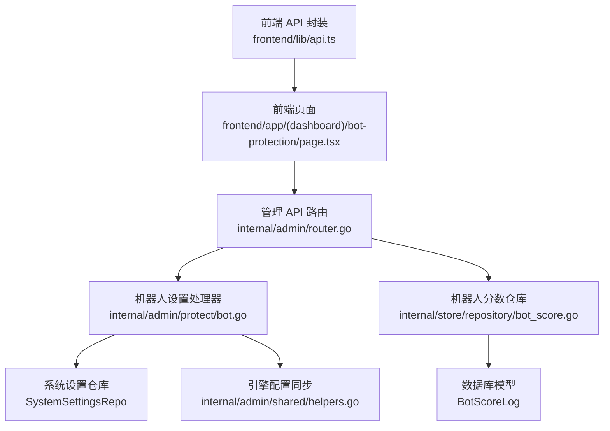
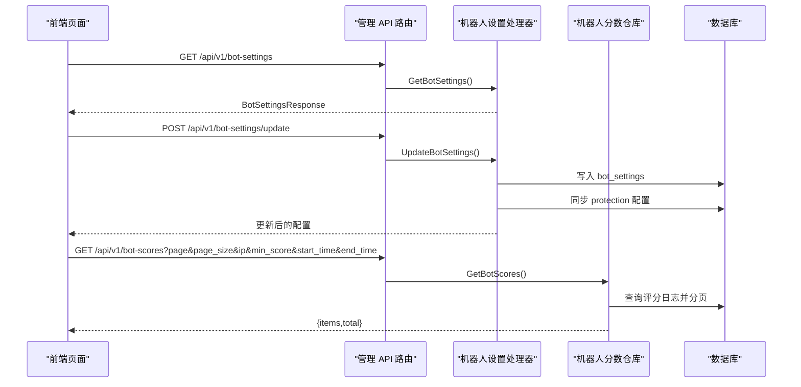
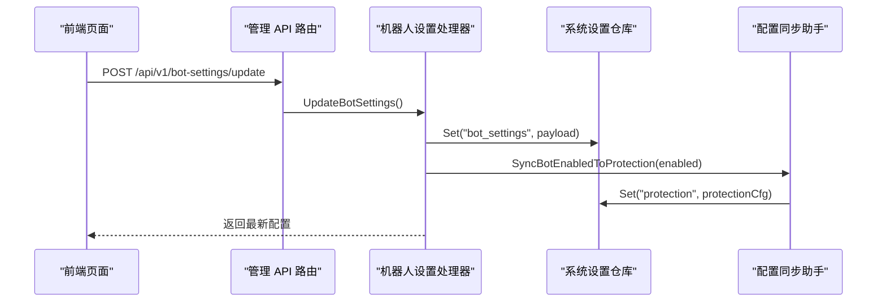
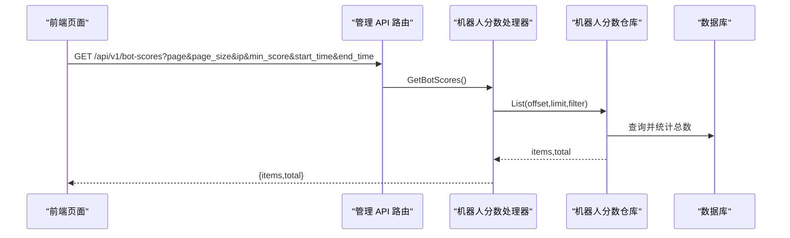
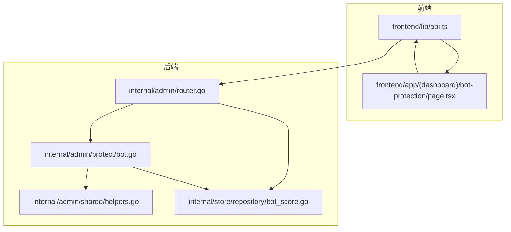

# 机器人保护 API

<cite>
**本文引用的文件**
- [router.go](file://internal/admin/router.go)
- [bot.go](file://internal/admin/protect/bot.go)
- [helpers.go](file://internal/admin/shared/helpers.go)
- [api.ts](file://frontend/lib/api.ts)
- [page.tsx](file://frontend/app/(dashboard)/bot-protection/page.tsx)
- [bot_score.go](file://internal/store/repository/bot_score.go)
- [bot.go](file://internal/waf/bot/bot.go)
- [phases.go](file://internal/core/rules/phases.go)
- [机器人检测.md](file://docs/安全防护功能/机器人检测.md)
- [处理阶段详解.md](file://docs/WAF 引擎系统/处理阶段详解/机器人检测阶段.md)
- [监控与可观测性.md](file://docs/监控与可观测性/监控与可观测性.md)
- [系统设置 API.md](file://docs/管理 API 系统/系统设置 API.md)
- [fingerprints/page.tsx](file://frontend/app/(dashboard)/fingerprints/page.tsx)
</cite>

## 目录
1. [简介](#简介)
2. [项目结构](#项目结构)
3. [核心组件](#核心组件)
4. [架构总览](#架构总览)
5. [详细组件分析](#详细组件分析)
6. [依赖关系分析](#依赖关系分析)
7. [性能考量](#性能考量)
8. [故障排查指南](#故障排查指南)
9. [结论](#结论)
10. [附录](#附录)

## 简介
本文件为“机器人保护 API”的权威技术文档，覆盖以下内容：
- 机器人检测配置管理的完整 API 规范：获取配置、更新配置
- 机器人分数查询 API：按 IP、分数范围、时间范围过滤与分页
- 机器人保护策略配置与站点级策略
- 机器人检测参数说明：分数阈值、高风险国家列表、数据中心与 VPN/代理 ASN 配置
- 机器人检测最佳实践与误报处理指南
- 指纹统计相关现状说明与替代方案

## 项目结构
机器人保护 API 位于管理后台路由层，与前端页面、系统设置仓库、评分日志仓库以及 WAF 引擎紧密协作。

**图表来源**
- [router.go:125-126](file://internal/admin/router.go#L125-L126)
- [bot.go:26-46](file://internal/admin/protect/bot.go#L26-L46)
- [bot_score.go:38-52](file://internal/store/repository/bot_score.go#L38-L52)
- [helpers.go:80-108](file://internal/admin/shared/helpers.go#L80-L108)
- [api.ts:845-859](file://frontend/lib/api.ts#L845-L859)

**章节来源**
- [router.go:125-126](file://internal/admin/router.go#L125-L126)
- [api.ts:845-859](file://frontend/lib/api.ts#L845-L859)

## 核心组件
- 管理 API 路由注册：提供机器人设置与评分查询的只读与操作端点
- 机器人设置处理器：负责读取与更新“bot_settings”系统设置，并同步到“protection”配置
- 机器人分数仓库：提供评分日志的分页查询、过滤与聚合统计
- 前端 API 封装：统一的 GET/POST 方法封装，便于页面调用
- 前端页面：提供配置编辑、ASN 管理、评分日志查询与分页展示

**章节来源**
- [router.go:125-126](file://internal/admin/router.go#L125-L126)
- [bot.go:26-46](file://internal/admin/protect/bot.go#L26-L46)
- [bot_score.go:38-52](file://internal/store/repository/bot_score.go#L38-L52)
- [api.ts:845-859](file://frontend/lib/api.ts#L845-L859)
- [page.tsx:28-126](file://frontend/app/(dashboard)/bot-protection/page.tsx#L28-L126)

## 架构总览
机器人保护 API 的调用链路如下：

**图表来源**
- [router.go:125-126](file://internal/admin/router.go#L125-L126)
- [bot.go:26-46](file://internal/admin/protect/bot.go#L26-L46)
- [bot.go:102-140](file://internal/admin/protect/bot.go#L102-L140)
- [bot_score.go:38-52](file://internal/store/repository/bot_score.go#L38-L52)

## 详细组件分析

### 1) 机器人设置 API
- 端点
  - GET /api/v1/bot-settings：获取当前机器人检测配置
  - POST /api/v1/bot-settings/update：更新机器人检测配置
- 请求体（更新）
  - enabled: 是否启用机器人检测
  - score_threshold: 评分阈值
  - high_risk_countries: 高风险国家列表
  - datacenter_asns: 数据中心 ASN 列表
  - vpn_proxy_asns: VPN/代理 ASN 列表
  - geoip_db_path: GeoIP 数据库路径（可选）
- 返回体
  - BotSettingsResponse：包含上述字段
- 同步机制
  - 更新配置后，同步写入“protection”配置中的 BotDetectionEnabled 字段，保证引擎侧一致性

**图表来源**
- [bot.go:48-100](file://internal/admin/protect/bot.go#L48-L100)
- [helpers.go:80-108](file://internal/admin/shared/helpers.go#L80-L108)

**章节来源**
- [bot.go:16-24](file://internal/admin/protect/bot.go#L16-L24)
- [bot.go:26-46](file://internal/admin/protect/bot.go#L26-L46)
- [bot.go:48-100](file://internal/admin/protect/bot.go#L48-L100)
- [helpers.go:80-108](file://internal/admin/shared/helpers.go#L80-L108)
- [api.ts:845-854](file://frontend/lib/api.ts#L845-L854)

### 2) 机器人分数查询 API
- 端点
  - GET /api/v1/bot-scores
- 查询参数
  - page: 页码（默认 1）
  - page_size: 每页条数（默认 20）
  - ip: 按客户端 IP 过滤
  - min_score/max_score: 按总分范围过滤
  - start_time/end_time: 按时间范围过滤（RFC3339）
- 返回体
  - items: BotScoreLog 数组
  - total: 符合条件的总数
- 数据模型（BotScoreLog）
  - 客户端 IP、主机、路径、总分、各项评分（GeoIP、指纹、行为、IP信誉）、是否高风险、动作、详情、创建时间

**图表来源**
- [router.go:126](file://internal/admin/router.go#L126)
- [bot.go:102-140](file://internal/admin/protect/bot.go#L102-L140)
- [bot_score.go:17-24](file://internal/store/repository/bot_score.go#L17-L24)
- [bot_score.go:38-52](file://internal/store/repository/bot_score.go#L38-L52)

**章节来源**
- [bot.go:102-140](file://internal/admin/protect/bot.go#L102-L140)
- [bot_score.go:17-24](file://internal/store/repository/bot_score.go#L17-L24)
- [bot_score.go:38-52](file://internal/store/repository/bot_score.go#L38-L52)
- [api.ts:856-858](file://frontend/lib/api.ts#L856-L858)
- [page.tsx:28-126](file://frontend/app/(dashboard)/bot-protection/page.tsx#L28-L126)

### 3) 机器人保护策略配置与站点级策略
- 全局策略
  - 通过“bot_settings”系统设置控制全局开关、阈值与高风险列表
- 站点级策略
  - 支持站点维度的 BotProtectionConfig：enabled、level（low/medium/high）、action（intercept/observe）
  - 前端保护策略页面支持“跟随全局配置/使用自定义配置”，便于差异化治理

**章节来源**
- [protection.go:254-267](file://internal/store/protection.go#L254-L267)
- [page.tsx](file://frontend/app/(dashboard)/sites/[id]/client.tsx#L939-L968)

### 4) 指纹统计功能说明
- 当前现状
  - 前端指纹分析页面存在，但已重定向至仪表盘，表示指纹统计功能不再直接暴露在该路由
- 替代方案
  - 通过机器人评分日志与安全事件统计，结合前端仪表盘进行趋势观察
  - 评分日志包含指纹相关评分与详情，可用于定位异常指纹模式

**章节来源**
- [fingerprints/page.tsx](file://frontend/app/(dashboard)/fingerprints/page.tsx#L1-L16)
- [监控与可观测性.md:306-330](file://docs/监控与可观测性/监控与可观测性.md#L306-L330)

## 依赖关系分析
机器人保护 API 的关键依赖关系如下：

**图表来源**
- [router.go:125-126](file://internal/admin/router.go#L125-L126)
- [bot.go:26-46](file://internal/admin/protect/bot.go#L26-L46)
- [bot.go:102-140](file://internal/admin/protect/bot.go#L102-L140)
- [helpers.go:80-108](file://internal/admin/shared/helpers.go#L80-L108)
- [bot_score.go:38-52](file://internal/store/repository/bot_score.go#L38-L52)
- [api.ts:845-859](file://frontend/lib/api.ts#L845-L859)

**章节来源**
- [router.go:125-126](file://internal/admin/router.go#L125-L126)
- [bot.go:26-46](file://internal/admin/protect/bot.go#L26-L46)
- [bot.go:102-140](file://internal/admin/protect/bot.go#L102-L140)
- [helpers.go:80-108](file://internal/admin/shared/helpers.go#L80-L108)
- [bot_score.go:38-52](file://internal/store/repository/bot_score.go#L38-L52)
- [api.ts:845-859](file://frontend/lib/api.ts#L845-L859)

## 性能考量
- 两阶段检测显著降低深度评分的触发频率，提升吞吐
- 指纹评分器复用默认实例，减少分配开销
- GeoIP 与 IP 信誉采用哈希集合与原子计数，查询/更新均为常数级复杂度
- 评分日志查询支持分页与多维过滤，建议合理设置 page_size 与过滤条件
- 建议
  - 将高成本指纹评分置于预筛选命中后再执行
  - 合理设置阈值与高风险清单，避免过度误报
  - 定期更新指纹数据库，保持检测准确性

**章节来源**
- [机器人检测.md:507-519](file://docs/安全防护功能/机器人检测.md#L507-L519)

## 故障排查指南
- 常见问题
  - 指纹库未命中但声明浏览器不一致：检查上游是否正确透传 JA3/JA4 与 TLS 信息
  - GeoIP 数据库加载失败：确认路径与权限，查看日志警告并降级处理
  - 自动封禁频繁误伤：降低阈值或延长窗口/封禁时长，或加入白名单
  - 速率限制误杀：调整窗口与上限，区分 4xx/5xx 计数策略
  - 指纹统计页面无数据：检查评分日志表与数据库连接
  - 浏览器环境一致性检查误报：调整 Accept-Language 和 Accept-Encoding 格式
- 排查步骤
  - 查看 BotVerdict 的 Reason 与 Details，定位具体触发项（UA、GeoIP、指纹、IP 信誉）
  - 结合系统事件与安全事件记录，核对规则 ID 与命中描述
  - 使用测试用例验证指纹与 UA 规则的行为预期
  - 检查指纹数据库完整性，验证指纹匹配逻辑
  - 查看评分日志，识别异常指纹模式

**章节来源**
- [机器人检测.md:520-534](file://docs/安全防护功能/机器人检测.md#L520-L534)

## 结论
机器人保护 API 提供了从全局配置到站点级策略的完整管理能力，配合评分日志查询与安全事件统计，能够有效评估策略效果并持续优化。指纹统计功能虽不再直接暴露，但通过评分日志与仪表盘仍可实现对指纹模式的监控与告警。

## 附录

### A. API 端点一览
- GET /api/v1/bot-settings
  - 功能：获取机器人检测配置
  - 权限：只读
- POST /api/v1/bot-settings/update
  - 功能：更新机器人检测配置
  - 权限：运维/管理员
- GET /api/v1/bot-scores
  - 功能：查询机器人评分日志（支持分页与多维过滤）
  - 权限：只读

**章节来源**
- [router.go:125-126](file://internal/admin/router.go#L125-L126)
- [api.ts:845-859](file://frontend/lib/api.ts#L845-L859)

### B. 机器人检测参数说明
- enabled：是否启用机器人检测
- score_threshold：评分阈值（整数）
- high_risk_countries：高风险国家列表（字符串数组）
- datacenter_asns：数据中心 ASN 列表（整数数组）
- vpn_proxy_asns：VPN/代理 ASN 列表（整数数组）
- geoip_db_path：GeoIP 数据库路径（字符串）

**章节来源**
- [bot.go:16-24](file://internal/admin/protect/bot.go#L16-L24)
- [bot.go:26-46](file://internal/admin/protect/bot.go#L26-L46)

### C. 评分日志字段说明
- 客户端 IP、主机、路径、总分、各项评分（GeoIP、指纹、行为、IP信誉）、是否高风险、动作、详情、创建时间

**章节来源**
- [bot_score.go:17-24](file://internal/store/repository/bot_score.go#L17-L24)

### D. 机器人检测最佳实践与误报处理
- 误报率控制
  - 降低阈值或减少指纹评分权重；加入白名单与已知合法 UA；缩小高风险国家/ASN 列表
  - 调整浏览器环境一致性检查的严格程度
- 漏报率优化
  - 提升阈值或增加指纹评分权重；扩大高风险国家/ASN 列表；启用更严格的 TLS/HTTP2 一致性检查
  - 定期更新指纹数据库，添加新的恶意工具指纹
- 策略建议
  - 从默认阈值开始，结合业务流量特征逐步微调；优先优化误报，再考虑漏报
  - 对高频但低风险来源（如搜索引擎）建立白名单；对高风险地区/ASN 保持严格策略
  - 监控指纹统计分析，识别新的攻击模式和指纹变异

**章节来源**
- [机器人检测.md:547-561](file://docs/安全防护功能/机器人检测.md#L547-L561)
- [机器人检测.md:599-615](file://docs/安全防护功能/机器人检测.md#L599-L615)