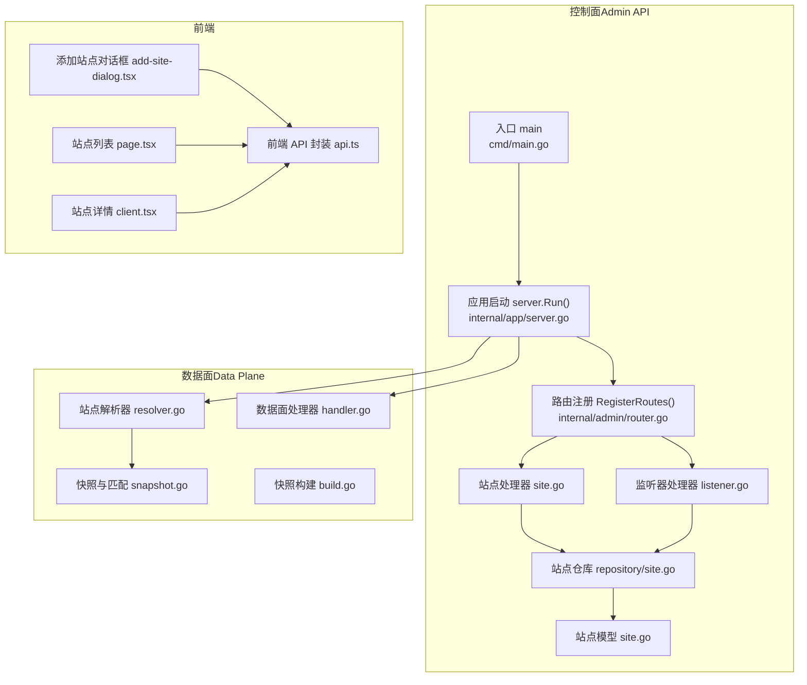
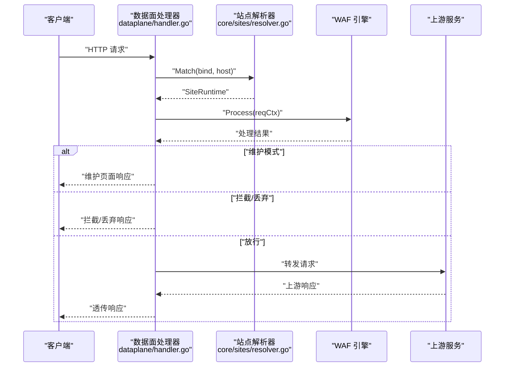
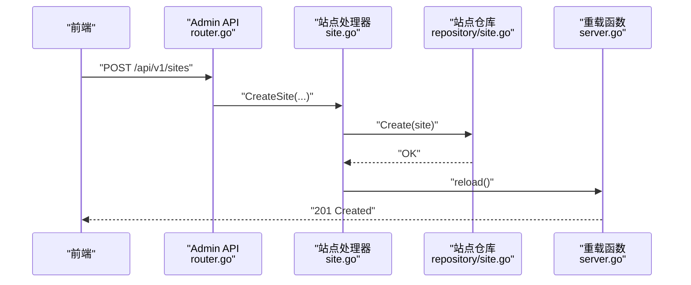
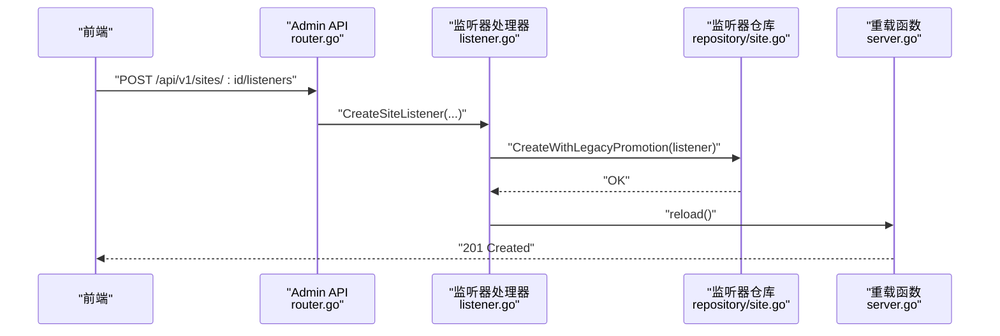
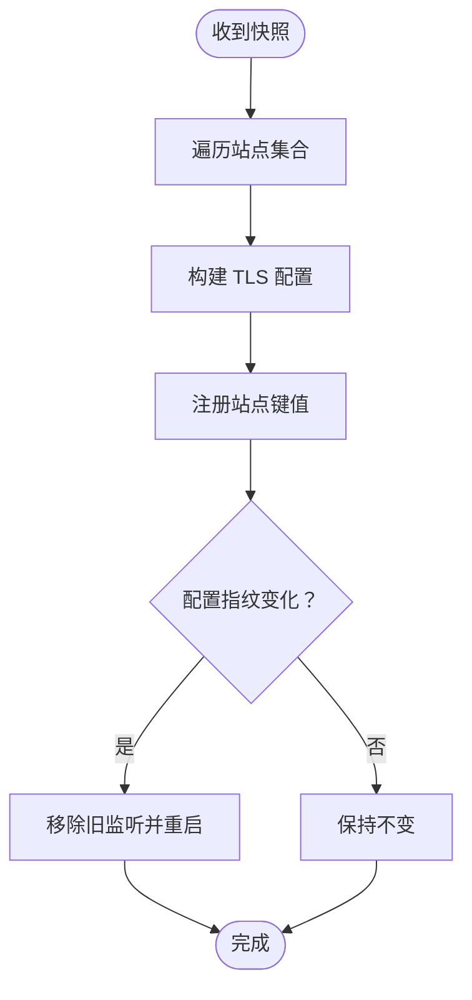
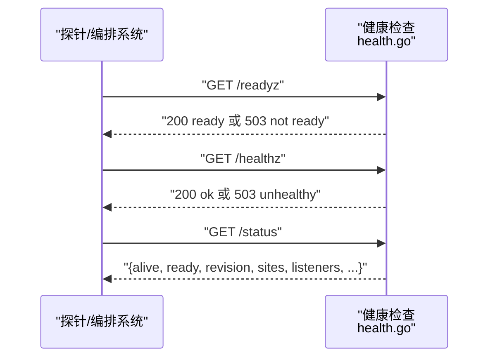
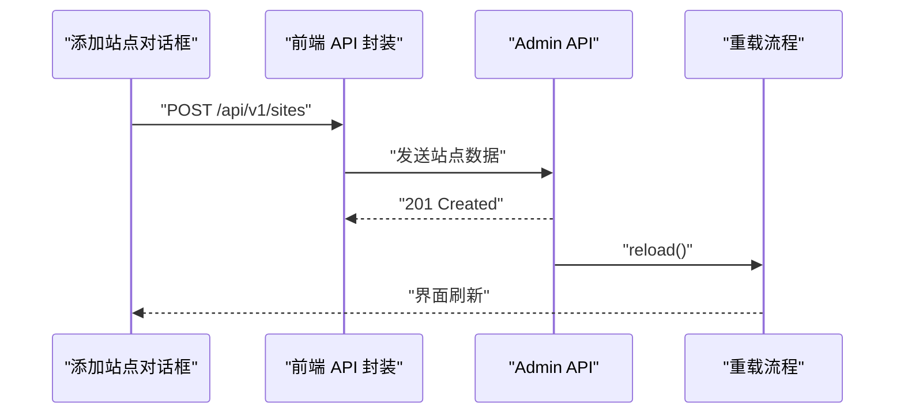
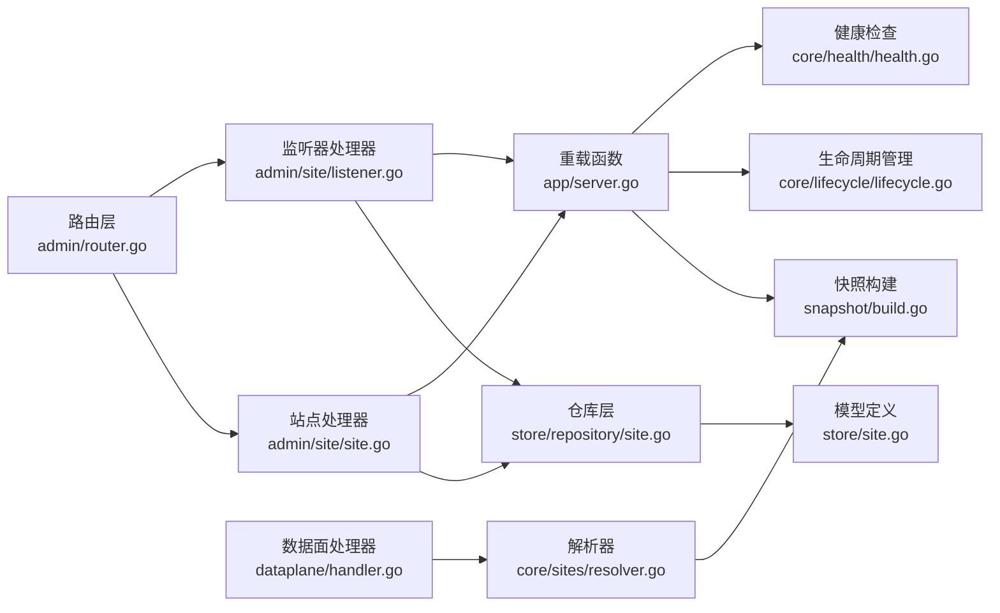

# 站点管理 API

<cite>
**本文档引用的文件**
- [main.go](file://cmd/main.go)
- [server.go](file://internal/app/server.go)
- [router.go](file://internal/admin/router.go)
- [site.go](file://internal/admin/site/site.go)
- [listener.go](file://internal/admin/site/listener.go)
- [site.go](file://internal/store/site.go)
- [site.go](file://internal/store/repository/site.go)
- [resolver.go](file://internal/core/sites/resolver.go)
- [snapshot.go](file://internal/snapshot/snapshot.go)
- [build.go](file://internal/snapshot/build.go)
- [handler.go](file://internal/dataplane/handler.go)
- [health.go](file://internal/core/health/health.go)
- [lifecycle.go](file://internal/core/lifecycle/lifecycle.go)
- [observability.go](file://internal/admin/site/observability.go)
- [api.ts](file://frontend/lib/api.ts)
- [add-site-dialog.tsx](file://frontend/components/add-site-dialog.tsx)
- [page.tsx](file://frontend/app/(dashboard)/sites/page.tsx)
- [client.tsx](file://frontend/app/(dashboard)/sites/[id]/client.tsx)
</cite>

## 目录
1. [简介](#简介)
2. [项目结构](#项目结构)
3. [核心组件](#核心组件)
4. [架构总览](#架构总览)
5. [详细组件分析](#详细组件分析)
6. [依赖分析](#依赖分析)
7. [性能考虑](#性能考虑)
8. [故障排除指南](#故障排除指南)
9. [结论](#结论)
10. [附录](#附录)

## 简介
本文件面向站点管理 API 的使用者与维护者，系统性阐述站点生命周期管理（创建、配置、启动、停止、删除）、配置参数（域名绑定、监听端口、上游配置、安全设置）、状态监控（运行状态检查、健康检查、故障诊断）、多站点支持架构（站点隔离、资源配置、负载均衡），并提供配置示例、最佳实践、迁移与备份恢复策略以及故障排除与性能优化建议。

## 项目结构
My-OpenWaf 采用控制面（Admin API）与数据面（Data Plane）分离的架构：控制面通过 Hertz 提供 REST API，负责站点的增删改查、启停与全局重载；数据面为每个站点构建独立监听器，按站点维度进行热启停与配置漂移检测，实现强隔离与高可用。

**图表来源**
- [main.go:1-10](file://cmd/main.go#L1-L10)
- [server.go:35-305](file://internal/app/server.go#L35-L305)
- [router.go:81-270](file://internal/admin/router.go#L81-L270)
- [site.go:109-182](file://internal/admin/site/site.go#L109-L182)
- [listener.go:50-113](file://internal/admin/site/listener.go#L50-L113)
- [site.go:9-45](file://internal/store/repository/site.go#L9-L45)
- [site.go:16-107](file://internal/store/site.go#L16-L107)
- [resolver.go:7-32](file://internal/core/sites/resolver.go#L7-L32)
- [snapshot.go:52-96](file://internal/snapshot/snapshot.go#L52-L96)
- [build.go:52-143](file://internal/snapshot/build.go#L52-L143)
- [handler.go:37-310](file://internal/dataplane/handler.go#L37-L310)
- [add-site-dialog.tsx:1-68](file://frontend/components/add-site-dialog.tsx#L1-L68)
- [api.ts:682-704](file://frontend/lib/api.ts#L682-L704)
- [page.tsx:35-79](file://frontend/app/(dashboard)/sites/page.tsx#L35-L79)
- [client.tsx:693-696](file://frontend/app/(dashboard)/sites/[id]/client.tsx#L693-L696)

**章节来源**
- [main.go:1-10](file://cmd/main.go#L1-L10)
- [server.go:35-305](file://internal/app/server.go#L35-L305)
- [router.go:81-270](file://internal/admin/router.go#L81-L270)

## 核心组件
- 控制面入口与启动流程：应用启动时初始化运行时、数据库迁移、种子数据、快照、事件写入器、指标收集器、健康检查、生命周期管理器，并挂载 Admin API 路由与静态资源。
- 站点管理处理器：提供站点列表、详情、创建、更新、删除、启动、停止、状态查询等接口。
- 监听器管理处理器：提供站点监听器的增删改查接口，支持多监听端口配置与 TLS 证书绑定。
- 数据面监听与路由：基于快照的站点解析器，按 (bind, host) 匹配站点，每个站点拥有独立监听器实例，支持热启停与配置漂移重启。
- 前端交互：提供"添加站点"对话框，调用 Admin API 完成站点创建。

**章节来源**
- [server.go:35-305](file://internal/app/server.go#L35-L305)
- [site.go:109-182](file://internal/admin/site/site.go#L109-L182)
- [listener.go:50-113](file://internal/admin/site/listener.go#L50-L113)
- [resolver.go:18-31](file://internal/core/sites/resolver.go#L18-L31)
- [add-site-dialog.tsx:67-102](file://frontend/components/add-site-dialog.tsx#L67-L102)

## 架构总览
下图展示从请求进入数据面到站点处理的全链路：请求经数据面处理器解析站点，交由 WAF 引擎处理，再根据结果决定拦截、维护模式或转发至上游。

**图表来源**
- [handler.go:38-310](file://internal/dataplane/handler.go#L38-L310)
- [resolver.go:18-26](file://internal/core/sites/resolver.go#L18-L26)

**章节来源**
- [handler.go:38-310](file://internal/dataplane/handler.go#L38-L310)
- [resolver.go:18-26](file://internal/core/sites/resolver.go#L18-L26)

## 详细组件分析

### 控制面：站点管理 API
- 路由注册：Admin API 使用分组与中间件实现认证与权限控制，站点相关路由包括列出、查询、创建、更新、删除、启动、停止、状态查询。
- 处理器职责：
  - 列表/详情：读取仓库并返回分页数据或单个站点。
  - 创建/更新/删除：持久化变更后触发全局快照重载，使数据面热生效。
  - 启动/停止：维护内存中的站点运行状态映射，用于状态查询。
  - 状态查询：结合仓库与内存状态返回站点运行态。
- 重载机制：每次变更后调用 reload，更新配置修订号、重建快照、刷新速率限制与 IP 黑名单、热重载数据面监听器，并通过 Redis 广播通知其他节点。

**图表来源**
- [router.go:156-158](file://internal/admin/router.go#L156-L158)
- [site.go:109-130](file://internal/admin/site/site.go#L109-L130)
- [site.go:9-45](file://internal/store/repository/site.go#L9-L45)
- [server.go:220-242](file://internal/app/server.go#L220-L242)

**章节来源**
- [router.go:81-160](file://internal/admin/router.go#L81-L160)
- [site.go:109-182](file://internal/admin/site/site.go#L109-L182)
- [server.go:220-260](file://internal/app/server.go#L220-L260)

### 监听器管理 API
- 监听器列表：返回站点的所有监听器配置，若无显式监听器则合成一个来自遗留配置的虚拟条目。
- 创建监听器：首次显式创建监听器时，会迁移遗留的单绑定配置，确保后续不再使用遗留路径。
- 更新监听器：支持修改监听器的绑定地址、网络协议、TLS 设置等。
- 删除监听器：删除指定监听器并触发重载。

**图表来源**
- [router.go:161-163](file://internal/admin/router.go#L161-L163)
- [listener.go:50-113](file://internal/admin/site/listener.go#L50-L113)
- [site.go:9-45](file://internal/store/repository/site.go#L9-L45)
- [server.go:220-242](file://internal/app/server.go#L220-L242)

**章节来源**
- [listener.go:18-186](file://internal/admin/site/listener.go#L18-186)
- [router.go:155-163](file://internal/admin/router.go#L155-L163)

### 数据面：站点解析与监听
- 快照与解析：
  - 快照持有者以原子指针保存当前配置视图，支持热切换。
  - 解析器基于 (bind, host) 进行精确匹配，随后尝试通配符匹配，最后回退到同 bind 下任意站点。
- 监听器管理：
  - 每个站点在快照中启用且配置有效时，会为其创建独立 Hertz 监听器。
  - 通过配置指纹检测配置漂移（如监听地址、TLS 开关、证书变更），自动移除旧监听并启动新监听。
- TLS 终止：
  - 支持站点证书与 SNI 证书组合，解析最小/最大 TLS 版本与 ALPN 协议。
- 上游转发：
  - 支持 HTTP、WebSocket、Server-Sent Events 三种模式，轮询选择上游地址。

**图表来源**
- [snapshot.go:52-96](file://internal/snapshot/snapshot.go#L52-L96)
- [resolver.go:18-31](file://internal/core/sites/resolver.go#L18-L31)
- [server.go:156-218](file://internal/app/server.go#L156-L218)
- [server.go:354-376](file://internal/app/server.go#L354-L376)
- [server.go:380-439](file://internal/app/server.go#L380-L439)

**章节来源**
- [snapshot.go:52-96](file://internal/snapshot/snapshot.go#L52-L96)
- [resolver.go:18-31](file://internal/core/sites/resolver.go#L18-L31)
- [server.go:156-218](file://internal/app/server.go#L156-L218)
- [server.go:354-439](file://internal/app/server.go#L354-L439)

### 健康检查与状态监控
- 健康检查：
  - /healthz：存活探针，进程可达即健康。
  - /readyz：就绪探针，需满足数据库连通与快照已加载。
  - /status：返回运行时信息（修订号、站点数、监听器数、内存与 CPU 等）。
- 生命周期管理：
  - 统一管理多个 Hertz 服务器的启动、停止与信号处理，支持优雅关闭与超时控制。

**图表来源**
- [health.go:40-94](file://internal/core/health/health.go#L40-L94)
- [lifecycle.go:138-178](file://internal/core/lifecycle/lifecycle.go#L138-L178)

**章节来源**
- [health.go:25-94](file://internal/core/health/health.go#L25-L94)
- [lifecycle.go:30-178](file://internal/core/lifecycle/lifecycle.go#L30-L178)

### 前端交互与站点创建
- 添加站点对话框：
  - 支持域名、监听端口/协议（HTTP/HTTPS）、证书选择、上游服务器列表、应用名称等字段。
  - 提交时调用 /api/v1/sites，创建站点并触发重载。
- 认证与错误处理：
  - 前端 API 封装统一处理 401、403、429 等错误，必要时刷新访问令牌或跳转登录。

**图表来源**
- [add-site-dialog.tsx:67-102](file://frontend/components/add-site-dialog.tsx#L67-L102)
- [api.ts:690-695](file://frontend/lib/api.ts#L690-L695)
- [router.go:156-158](file://internal/admin/router.go#L156-L158)
- [server.go:220-242](file://internal/app/server.go#L220-L242)

**章节来源**
- [add-site-dialog.tsx:67-102](file://frontend/components/add-site-dialog.tsx#L67-L102)
- [api.ts:690-695](file://frontend/lib/api.ts#L690-L695)

### 站点监控与可观测性
- 访问日志：支持按站点过滤的访问日志查询，包含时间范围、客户端 IP、路径、方法、WAF 动作等筛选条件。
- 拦截事件：提供站点级拦截事件的分页查询与 24 小时统计。
- 安全事件：支持站点级安全事件的分类统计、Top IP、Top 路径、Top 规则等分析。
- 指标数据：前端 API 定义了丰富的指标接口，包括请求总量、状态码分布、WAF 拦截数、机器人防护统计等。

**章节来源**
- [observability.go:15-104](file://internal/admin/site/observability.go#L15-104)
- [api.ts:320-374](file://frontend/lib/api.ts#L320-L374)

## 依赖分析
- 控制面依赖：
  - 路由层依赖仓库层与重载函数。
  - 仓库层依赖 GORM 数据库连接。
  - 重载函数依赖快照构建、速率限制器、IP 黑名单、生命周期管理器与 Redis 分布式通知。
- 数据面依赖：
  - 解析器依赖快照持有者。
  - 处理器依赖引擎、指标、事件写入器与快照解析。
- 前端依赖：
  - 通过封装的 API 工具与后端交互，处理认证与错误。

**图表来源**
- [router.go:78-160](file://internal/admin/router.go#L78-L160)
- [site.go:109-182](file://internal/admin/site/site.go#L109-L182)
- [listener.go:50-113](file://internal/admin/site/listener.go#L50-L113)
- [site.go:9-45](file://internal/store/repository/site.go#L9-L45)
- [site.go:16-107](file://internal/store/site.go#L16-L107)
- [server.go:220-260](file://internal/app/server.go#L220-L260)
- [build.go:52-143](file://internal/snapshot/build.go#L52-L143)
- [lifecycle.go:30-178](file://internal/core/lifecycle/lifecycle.go#L30-L178)
- [health.go:14-94](file://internal/core/health/health.go#L14-L94)
- [handler.go:38-310](file://internal/dataplane/handler.go#L38-L310)
- [resolver.go:18-31](file://internal/core/sites/resolver.go#L18-L31)

**章节来源**
- [router.go:78-160](file://internal/admin/router.go#L78-L160)
- [site.go:109-182](file://internal/admin/site/site.go#L109-L182)
- [listener.go:50-113](file://internal/admin/site/listener.go#L50-L113)
- [server.go:220-260](file://internal/app/server.go#L220-L260)

## 性能考虑
- 热重载与配置漂移检测：通过监听器指纹快速识别变更并仅重启受影响站点，避免全量重启带来的抖动。
- 内存与 GC：数据面处理器复用请求上下文池，限制 WAF 扫描体大小，减少 GC 压力。
- 负载均衡：上游转发采用轮询策略，简单高效；可结合外部负载均衡器实现更复杂的调度策略。
- 指标与可观测性：内置指标记录请求、拦截、攻击 IP、状态码分布等，便于性能分析与容量规划。
- TLS 优化：支持 ALPN 与版本范围配置，合理设置最小版本与密码套件，兼顾安全与性能。

## 故障排除指南
- 无法访问站点：
  - 检查站点是否启用、监听端口是否正确、证书是否有效。
  - 查看数据面日志中"no site match"或"unknown virtual host"的提示。
- 站点启停异常：
  - 启动/停止接口仅更新内存状态，不影响实际监听器；确认快照重载是否成功，监听器指纹是否发生变化。
- 健康检查失败：
  - /readyz 失败通常表示数据库不可达或快照未加载；检查数据库连接与种子数据流程。
- 维护模式：
  - 若命中维护模式，检查站点维护开关与自定义维护页面内容。
- 速率限制与拦截：
  - 观察拦截事件与指标，确认规则命中与动作类型；必要时调整保护配置。

**章节来源**
- [handler.go:57-72](file://internal/dataplane/handler.go#L57-L72)
- [health.go:28-38](file://internal/core/health/health.go#L28-L38)
- [server.go:156-218](file://internal/app/server.go#L156-L218)

## 结论
My-OpenWaf 的站点管理 API 通过清晰的控制面与数据面分离、基于快照的热重载与站点级监听器，实现了对多站点的强隔离与高可用管理。配合完善的健康检查、状态监控与前端交互，用户可以高效地完成站点的全生命周期运维。

## 附录

### 站点配置参数清单
- 基础信息
  - 主机名（host）：站点域名或子域名。
  - 上游地址（upstream_urls）：逗号分隔的上游服务地址列表。
- 监听配置
  - 绑定地址（bind）：形如 ":80" 或 "0.0.0.0:443"。
  - 网络协议（network）：默认 tcp。
  - 启用状态（enabled）：默认 true。
- TLS 配置
  - 启用 TLS（tls_enabled）：默认 false。
  - 证书 ID（cert_id）：关联证书表。
  - 最小/最大 TLS 版本（min_tls_version, max_tls_version）：默认 TLS12/TLS13。
  - 密码套件（cipher_suites）：可选。
  - ALPN 协议（alpn）：默认 "h2,http/1.1"。
- 保护配置
  - 策略 ID（policy_id）：可选。
  - 机器人防护（bot_protection_enabled, bot_protection_level）：默认关闭，级别 medium。
  - 攻击防护（attack_protection_level）：默认 medium。
- 转发配置
  - X-Forwarded-For 模式（xff_mode）：默认 strip_all_and_set_remote。
  - 可信 CIDR（trusted_cidr）：可选。
  - 保留原始 Host（preserve_original_host）：默认 false。
- 上游与请求体
  - 最大请求体字节数（max_body_bytes）：默认 10MB。
  - 跳过上游 TLS 校验（upstream_tls_skip_verify）：默认 false。
  - 上游 TLS SNI（upstream_tls_server_name）：可选。
- 维护模式
  - 启用维护（maintenance_enabled）：默认 false。
  - 维护页面 HTML（maintenance_html）：可选。
  - 维护状态码（maintenance_status）：默认 503。
- 拦截页面
  - 自定义拦截页面 HTML（block_html）：为空则使用全局默认。
  - 拦截状态码（block_status）：默认 403。

**章节来源**
- [site.go:16-107](file://internal/store/site.go#L16-L107)

### API 接口定义
- 获取站点列表
  - 方法：GET
  - 路径：/api/v1/sites
  - 查询参数：page, page_size
  - 响应：items, total
- 获取站点详情
  - 方法：GET
  - 路径：/api/v1/sites/:id
  - 响应：站点对象
- 创建站点
  - 方法：POST
  - 路径：/api/v1/sites
  - 请求体：站点对象（含 host, upstream_urls, bind 等）
  - 响应：创建后的站点对象
- 更新站点
  - 方法：POST
  - 路径：/api/v1/sites/:id/update
  - 请求体：部分字段更新
  - 响应：更新后的站点对象
- 删除站点
  - 方法：POST
  - 路径：/api/v1/sites/:id/delete
  - 响应：204 No Content
- 启动站点
  - 方法：POST
  - 路径：/api/v1/sites/:id/start
  - 响应：{status: "running", message: "site started"}
- 停止站点
  - 方法：POST
  - 路径：/api/v1/sites/:id/stop
  - 响应：{status: "stopped", message: "site stopped"}
- 获取站点状态
  - 方法：GET
  - 路径：/api/v1/sites/:id/status
  - 响应：{id, host, status}
- 获取站点监听器列表
  - 方法：GET
  - 路径：/api/v1/sites/:id/listeners
  - 响应：监听器数组
- 创建监听器
  - 方法：POST
  - 路径：/api/v1/sites/:id/listeners
  - 请求体：监听器对象
  - 响应：创建后的监听器对象
- 更新监听器
  - 方法：POST
  - 路径：/api/v1/sites/:id/listeners/:lid/update
  - 请求体：监听器对象
  - 响应：更新后的监听器对象
- 删除监听器
  - 方法：POST
  - 路径：/api/v1/sites/:id/listeners/:lid/delete
  - 响应：204 No Content

**章节来源**
- [router.go:81-216](file://internal/admin/router.go#L81-L216)
- [site.go:109-182](file://internal/admin/site/site.go#L109-L182)
- [listener.go:50-186](file://internal/admin/site/listener.go#L50-L186)

### 多站点支持与隔离
- 站点隔离：每个站点拥有独立监听器实例，解析器按 (bind, host) 精确匹配，支持通配符与回退策略。
- 资源配置：站点级 TLS、转发、维护与拦截页面均独立配置。
- 负载均衡：数据面采用轮询方式在多上游间分配请求。

**章节来源**
- [resolver.go:18-31](file://internal/core/sites/resolver.go#L18-L31)
- [handler.go:260-272](file://internal/dataplane/handler.go#L260-L272)

### 站点迁移与备份恢复
- 快照与重载：通过 bump revision 与 reload 流程实现配置迁移与热生效。
- 数据库迁移：启动时执行 AutoMigrate，确保表结构与种子数据就绪。
- 分布式通知：Redis Pub/Sub 用于跨节点同步重载事件，保证一致性。

**章节来源**
- [server.go:46-49](file://internal/app/server.go#L46-L49)
- [server.go:220-242](file://internal/app/server.go#L220-L242)
- [server.go:244-260](file://internal/app/server.go#L244-L260)

### 最佳实践
- 站点命名与绑定：为每个站点明确 host 与 bind，避免冲突。
- TLS 配置：启用 HTTPS 时提供有效证书，合理设置 TLS 版本与 ALPN。
- 上游健康：为每个站点配置多个上游地址，结合外部 LB 实现高可用。
- 保护策略：根据业务风险调整机器人与攻击防护级别，定期评估拦截率与误报。
- 监控告警：关注健康检查、拦截事件与指标，建立告警阈值。