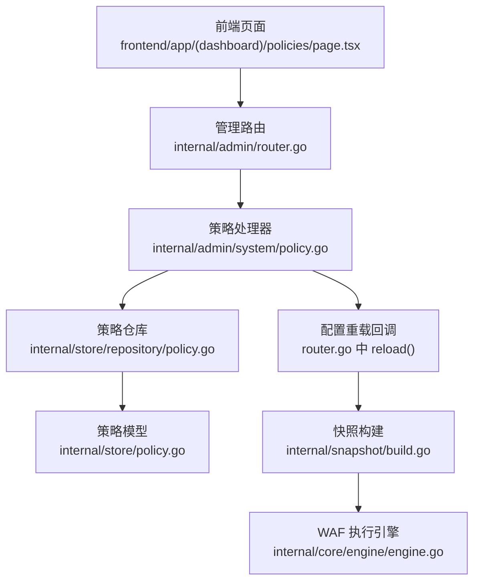
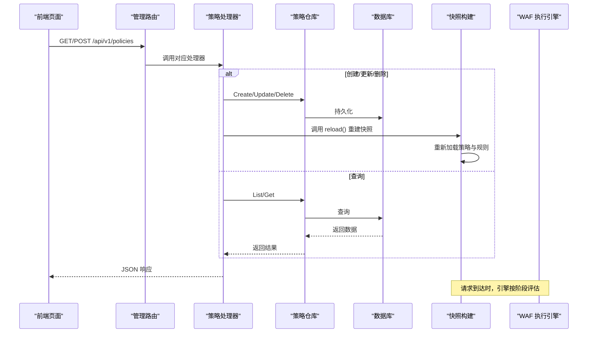
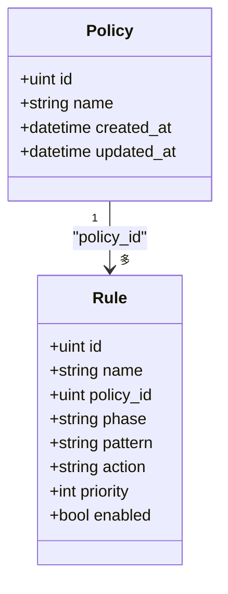
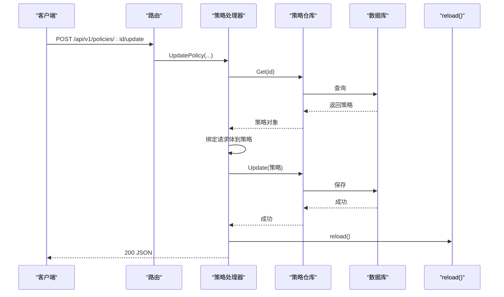
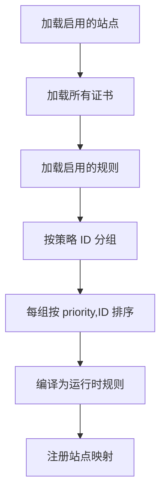
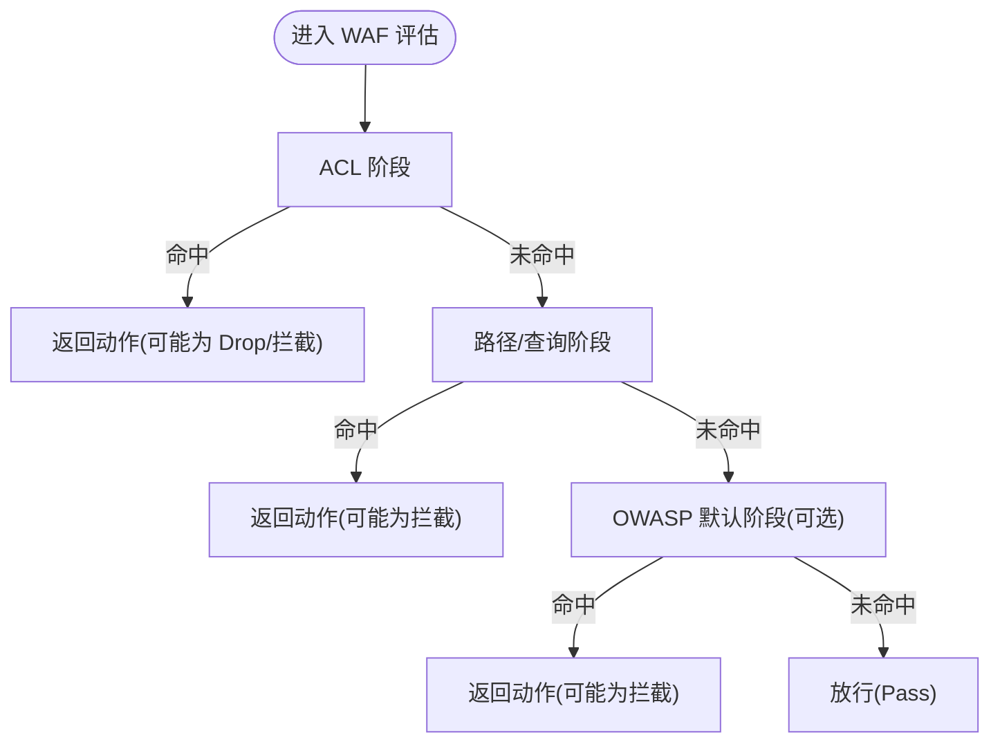
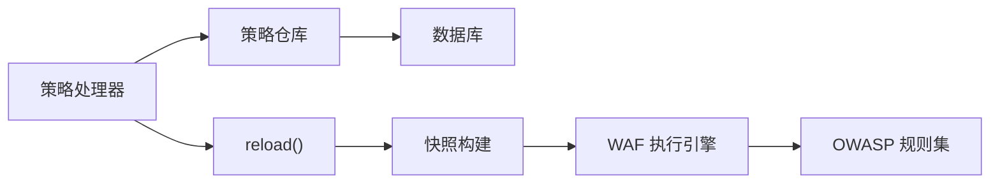

# 策略管理 API

> [返回 管理 API 系统](管理 API 系统.md)

<cite>
**本文引用的文件**
- [router.go](file://internal/admin/router.go)
- [policy.go](file://internal/admin/system/policy.go)
- [policy_repo.go](file://internal/store/repository/policy.go)
- [store_policy.go](file://internal/store/policy.go)
- [rule_repo.go](file://internal/store/repository/rule.go)
- [snapshot_build.go](file://internal/snapshot/build.go)
- [engine.go](file://internal/core/engine/engine.go)
- [policies_page.tsx](file://frontend/app/(dashboard)/policies/page.tsx)
- [api_endpoint_ref.md](file://docs/管理 API 系统/REST API 设计规范/API 端点参考.md)
- [policy_doc.md](file://docs/管理 API 系统/策略管理 API.md)
</cite>

## 目录
1. [简介](#简介)
2. [项目结构](#项目结构)
3. [核心组件](#核心组件)
4. [架构总览](#架构总览)
5. [详细组件分析](#详细组件分析)
6. [依赖分析](#依赖分析)
7. [性能考虑](#性能考虑)
8. [故障排除指南](#故障排除指南)
9. [结论](#结论)
10. [附录](#附录)

## 简介
本文件为策略管理 API 的权威文档，面向策略管理员、平台运维与开发者，系统性阐述策略（Policy）与规则（Rule）的设计与实现，覆盖策略类型、优先级与继承关系、CRUD 操作、应用场景（OWASP 标准、自定义策略、组合策略）、执行机制（匹配、优先级排序、冲突处理）、配置示例与最佳实践、效果评估与性能影响分析，以及调试与故障排除方法。

## 项目结构
策略管理 API 位于后端 admin 子系统，前端通过 SPA 页面进行策略的增删改查操作。核心数据模型在 store 层定义，持久化由 GORM 提供；运行时由快照构建器聚合策略与规则，WAF 执行引擎按阶段评估请求。

图表来源
- [policies_page.tsx](file://frontend/app/(dashboard)/policies/page.tsx#L1-L16)
- [router.go:94-156](file://internal/admin/router.go#L94-L156)
- [policy.go:14-109](file://internal/admin/system/policy.go#L14-L109)
- [policy_repo.go:13-34](file://internal/store/repository/policy.go#L13-L34)
- [store_policy.go:10-17](file://internal/store/policy.go#L10-L17)
- [snapshot_build.go:14-143](file://internal/snapshot/build.go#L14-L143)
- [engine.go:104-198](file://internal/core/engine/engine.go#L104-L198)

章节来源
- [router.go:94-156](file://internal/admin/router.go#L94-L156)
- [policy.go:14-109](file://internal/admin/system/policy.go#L14-L109)
- [policy_repo.go:13-34](file://internal/store/repository/policy.go#L13-L34)
- [store_policy.go:10-17](file://internal/store/policy.go#L10-L17)
- [snapshot_build.go:14-143](file://internal/snapshot/build.go#L14-L143)
- [engine.go:104-198](file://internal/core/engine/engine.go#L104-L198)
- [policies_page.tsx](file://frontend/app/(dashboard)/policies/page.tsx#L1-L16)

## 核心组件
- 策略（Policy）：用于分组管理规则，绑定到站点后生效。策略本身不直接包含规则，规则通过 PolicyID 关联到策略。
- 规则（Rule）：定义具体的安全检测与处置动作，支持多阶段（如 ACL、签名、自定义；rate_limit、owasp_default 属于内置/配置驱动阶段）。
- 快照（Snapshot）：从数据库构建的只读运行时视图，包含站点、证书、规则编译结果与保护配置。
- 执行引擎（WAF Eval）：按阶段顺序评估请求，支持 ACL、路径/查询匹配、OWASP 默认规则、自定义规则等。
- OWASP 规则集：内置的攻击检测规则库，支持多种攻击类型的识别与评分。

章节来源
- [store_policy.go:10-17](file://internal/store/policy.go#L10-L17)
- [rule_repo.go:13-28](file://internal/store/repository/rule.go#L13-L28)
- [snapshot_build.go:14-143](file://internal/snapshot/build.go#L14-L143)
- [engine.go:104-198](file://internal/core/engine/engine.go#L104-L198)

## 架构总览
策略管理 API 的调用链路如下：

图表来源
- [router.go:94-156](file://internal/admin/router.go#L94-L156)
- [policy.go:44-109](file://internal/admin/system/policy.go#L44-L109)
- [policy_repo.go:13-34](file://internal/store/repository/policy.go#L13-L34)
- [snapshot_build.go:14-143](file://internal/snapshot/build.go#L14-L143)

## 详细组件分析

### 策略模型与规则模型
- 策略（Policy）：包含自增 ID、创建/更新时间、名称等字段。
- 规则（Rule）：包含名称、所属策略 ID、阶段、模式（DSL）、动作、优先级、启用状态等。
- 规则阶段（RulePhase）：模型枚举包含 acl、rate_limit、owasp_default、signature、custom；规则 CRUD 可保存的自定义规则阶段为 acl、signature、custom，rate_limit、owasp_default 属于内置/配置驱动阶段。
- 规则动作（RuleAction）：持久化规则支持 allow、intercept、observe、drop、challenge、captcha_challenge、shield_challenge、chain_challenge、redirect、rate_limit，并兼容历史别名 block、log_only；allow 仅允许用于 acl，tag 不支持持久化规则。

图表来源
- [store_policy.go:10-17](file://internal/store/policy.go#L10-L17)
- [store_policy.go:62-77](file://internal/store/policy.go#L62-L77)

章节来源
- [store_policy.go:10-17](file://internal/store/policy.go#L10-L17)
- [store_policy.go:62-77](file://internal/store/policy.go#L62-L77)

### 策略 CRUD 处理器
- 列表与分页：支持分页参数，返回 items 与 total。
- 获取详情：按 ID 获取策略。
- 创建：绑定请求体为策略对象并持久化，随后触发 reload。
- 更新：先获取再绑定请求体，设置 ID 后保存，随后触发 reload。
- 删除：按 ID 删除，随后触发 reload。

图表来源
- [router.go:154-156](file://internal/admin/router.go#L154-L156)
- [policy.go:63-89](file://internal/admin/system/policy.go#L63-L89)
- [policy_repo.go:25-33](file://internal/store/repository/policy.go#L25-L33)

章节来源
- [policy.go:14-109](file://internal/admin/system/policy.go#L14-L109)
- [router.go:94-156](file://internal/admin/router.go#L94-L156)
- [policy_repo.go:13-34](file://internal/store/repository/policy.go#L13-L34)

### 规则仓库与优先级排序
- 规则列表默认按 priority 升序、ID 升序排序，确保相同优先级内稳定排序。
- 按策略 ID 查询规则时同样遵循该排序规则。

章节来源
- [rule_repo.go:13-28](file://internal/store/repository/rule.go#L13-L28)

### 快照构建与策略继承
- 快照构建时，按站点启用状态加载站点与证书，按策略 ID 聚合规则并排序，编译为运行时规则。
- 站点绑定策略后，其规则集即为该策略下的规则集合，形成“策略继承”语义：站点继承策略中的规则集。

图表来源
- [snapshot_build.go:14-143](file://internal/snapshot/build.go#L14-L143)

章节来源
- [snapshot_build.go:14-143](file://internal/snapshot/build.go#L14-L143)

### 策略执行机制
- 阶段顺序：IPReputation → AntiReplay → ACL → OWASP → CVE → BotDetection → RequestRateLimit → Signature → Custom；缺少对应管理器或关闭配置时跳过相关阶段。
- 匹配逻辑：ACL 使用 IP/CIDR 匹配；路径/查询匹配支持前缀与包含两种简单模式；OWASP 默认规则在高灵敏度下更严格。
- 冲突处理：一旦某规则命中并产生终端动作（如拦截、丢弃），立即短路返回；观察（observe）命中仅记录，不终止后续阶段。

图表来源
- [engine.go:104-198](file://internal/core/engine/engine.go#L104-L198)

章节来源
- [engine.go:104-198](file://internal/core/engine/engine.go#L104-L198)

### OWASP 标准规则与灵敏度
- 内置 OWASP 规则集覆盖 SQL 注入、XSS、命令注入、WebShell、路径穿越、SSRF、XXE、LDAP 注入、NoSQL 注入、模板注入、JNDI/Log4Shell、CRLF 注入、表达式语言注入、反序列化攻击等。
- 灵敏度阈值：low/high/mid 对应不同阈值，影响规则命中概率与误报率。
- 危险路径检测：针对常见漏洞利用的已知路径进行快速识别。

章节来源
- [engine.go:104-198](file://internal/core/engine/engine.go#L104-L198)

### 自定义策略与组合策略
- 自定义策略：通过创建策略并添加规则实现，规则模式采用 DSL，支持简单与复合两种形式。
- 组合策略：通过复合规则（JSON 结构）将多个条件以 AND/OR/NOT 组合，实现复杂匹配逻辑。

章节来源
- [store_policy.go:62-77](file://internal/store/policy.go#L62-L77)
- [snapshot_build.go:179-201](file://internal/snapshot/build.go#L179-L201)

### 前端策略页面与交互
- 前端页面通过 CRUD 组件与后端 API 交互，展示策略列表与基本字段（名称），并调用 /api/v1/policies 进行增删改查。

章节来源
- [policies_page.tsx](file://frontend/app/(dashboard)/policies/page.tsx#L1-L16)

## 依赖分析
- 策略处理器依赖策略仓库与 reload 回调，确保变更后即时生效。
- 快照构建依赖数据库，按站点与策略聚合规则并排序。
- 执行引擎依赖快照中的编译规则与保护配置。

图表来源
- [policy.go:44-57](file://internal/admin/system/policy.go#L44-L57)
- [policy_repo.go:13-34](file://internal/store/repository/policy.go#L13-L34)
- [snapshot_build.go:14-143](file://internal/snapshot/build.go#L14-L143)
- [engine.go:104-198](file://internal/core/engine/engine.go#L104-L198)

章节来源
- [policy.go:44-57](file://internal/admin/system/policy.go#L44-L57)
- [policy_repo.go:13-34](file://internal/store/repository/policy.go#L13-L34)
- [snapshot_build.go:14-143](file://internal/snapshot/build.go#L14-L143)
- [engine.go:104-198](file://internal/core/engine/engine.go#L104-L198)

## 性能考虑
- 规则排序：按 priority 与 ID 排序，避免规则遍历顺序不确定性带来的性能抖动。
- 正则扫描优化：OWASP 规则在命中阈值前采用快速判定与目标长度限制，降低正则爆炸风险。
- 快照缓存：快照构建完成后，执行阶段直接使用编译后的规则，减少解析开销。
- 建议：合理设置规则优先级，避免过多高成本正则；在高并发场景下，优先使用简单匹配（如路径前缀）替代复杂正则。

## 故障排除指南
- 400 错误（无效 ID 或请求体）：检查请求参数与 JSON 格式是否正确。
- 404 错误（资源不存在）：确认策略或规则 ID 是否有效。
- 500 错误（内部错误）：检查数据库连接与权限，确认 reload 是否成功触发。
- 规则未生效：确认规则处于启用状态且优先级设置合理；检查站点是否绑定了正确的策略。
- OWASP 命中异常：调整灵敏度阈值或模块灵敏度配置，减少误报。

章节来源
- [policy.go:20-24](file://internal/admin/system/policy.go#L20-L24)
- [policy.go:32-38](file://internal/admin/system/policy.go#L32-L38)
- [policy.go:47-49](file://internal/admin/system/policy.go#L47-L49)
- [snapshot_build.go:14-143](file://internal/snapshot/build.go#L14-L143)

## 结论
策略管理 API 通过清晰的数据模型与分层架构，实现了策略与规则的灵活组合与高效执行。结合快照构建与阶段化评估，既能满足 OWASP 标准防护，也能支持自定义与组合策略。建议在生产环境中合理规划规则优先级与灵敏度，持续监控命中与误报情况，以获得最佳的防护效果与性能表现。

## 附录

### API 定义（策略）
- 列表策略
  - 方法：GET
  - 路径：/api/v1/policies
  - 查询参数：page、page_size
  - 响应：items（数组）、total（整数）
- 获取策略
  - 方法：GET
  - 路径：/api/v1/policies/:id
  - 响应：策略对象
- 创建策略
  - 方法：POST
  - 路径：/api/v1/policies
  - 请求体：策略对象（名称等）
  - 响应：创建的策略对象（201）
- 更新策略
  - 方法：POST
  - 路径：/api/v1/policies/:id/update
  - 请求体：策略对象（含 ID）
  - 响应：更新后的策略对象（200）
- 删除策略
  - 方法：POST
  - 路径：/api/v1/policies/:id/delete
  - 响应：空（204）

章节来源
- [router.go:94-156](file://internal/admin/router.go#L94-L156)
- [policy.go:14-109](file://internal/admin/system/policy.go#L14-L109)
- [api_endpoint_ref.md:359-392](file://docs/管理 API 系统/REST API 设计规范/API 端点参考.md#L359-L392)

### 策略应用场景与最佳实践
- OWASP 标准：启用内置 OWASP 规则，根据业务场景选择灵敏度（low/mid/high），并结合模块灵敏度进行精细化控制。
- 自定义策略：针对特定业务场景编写规则，优先使用简单匹配（如 block_path、block_query_contains），避免复杂正则。
- 组合策略：使用复合规则（AND/OR/NOT）组合多个条件，提升匹配精度。
- 最佳实践：
  - 将高频规则置于较高优先级，减少后续匹配成本。
  - 定期审查命中日志，动态调整灵敏度与规则。
  - 在测试环境验证规则后再上线，避免误伤正常流量。

### 策略效果评估
- 命中统计：通过安全事件与统计数据评估规则命中数量与趋势。
- 误报率：对比实际业务流量与规则命中，计算误报率并优化规则。
- 性能指标：关注请求延迟、CPU/内存占用与规则匹配耗时，确保在高负载下仍保持稳定。
