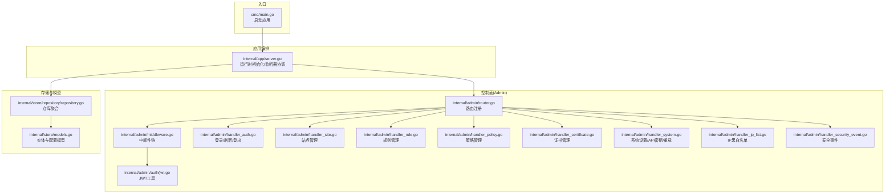
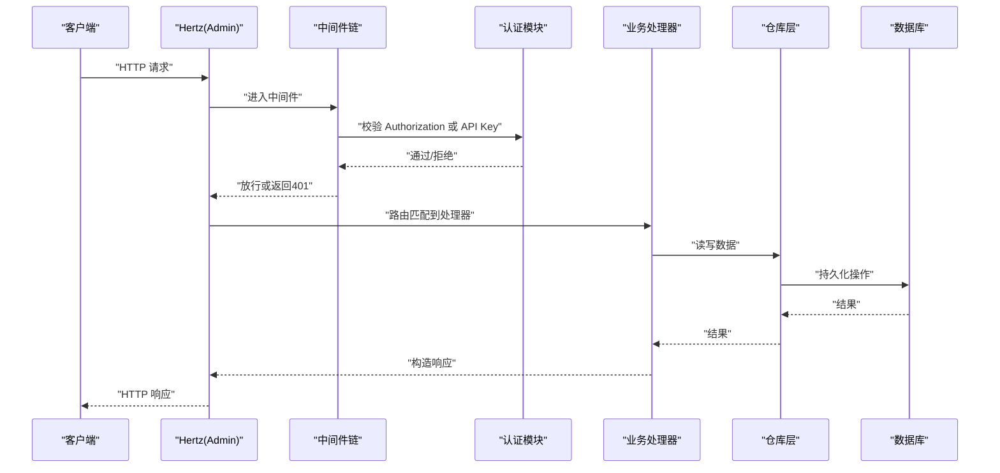
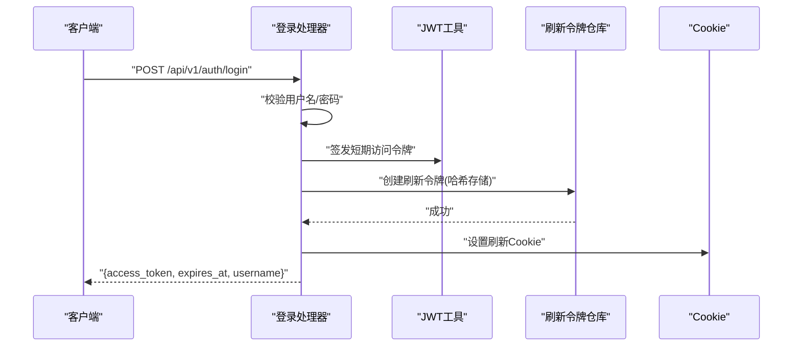
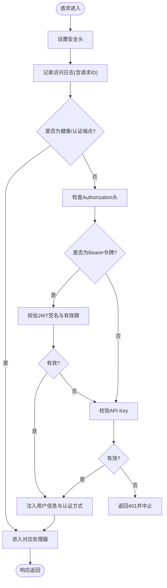
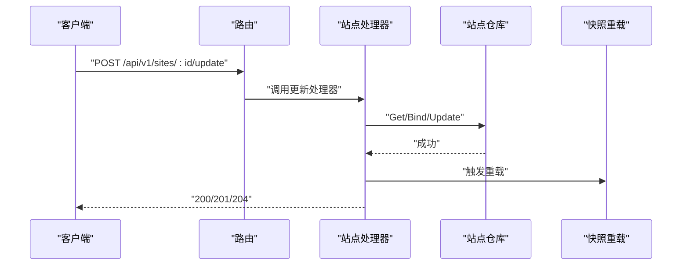
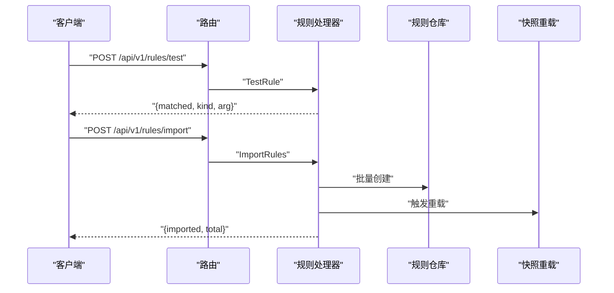
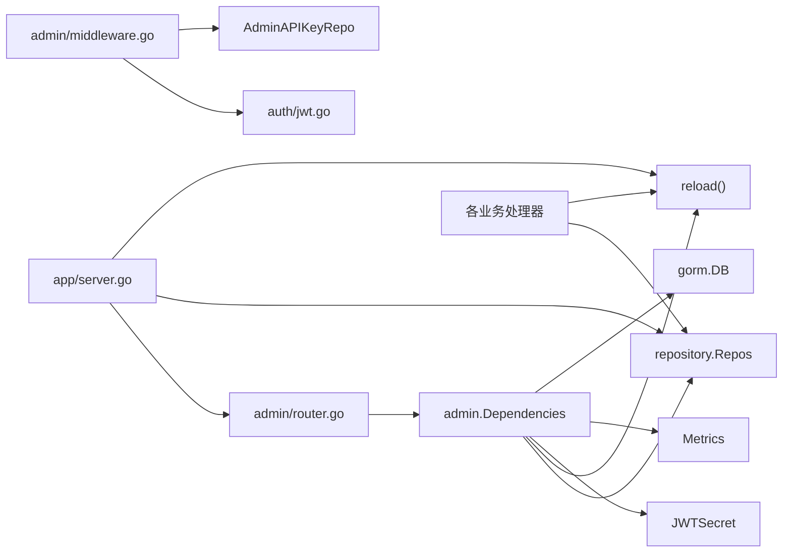

# 管理 API 系统

<cite>
**本文引用的文件**
- [cmd/main.go](file://cmd/main.go)
- [internal/app/server.go](file://internal/app/server.go)
- [internal/admin/router.go](file://internal/admin/router.go)
- [internal/admin/middleware.go](file://internal/admin/middleware.go)
- [internal/admin/auth/jwt.go](file://internal/admin/auth/jwt.go)
- [internal/admin/handler_auth.go](file://internal/admin/handler_auth.go)
- [internal/admin/handler_site.go](file://internal/admin/handler_site.go)
- [internal/admin/handler_rule.go](file://internal/admin/handler_rule.go)
- [internal/admin/handler_policy.go](file://internal/admin/handler_policy.go)
- [internal/admin/handler_certificate.go](file://internal/admin/handler_certificate.go)
- [internal/admin/handler_system.go](file://internal/admin/handler_system.go)
- [internal/admin/handler_ip_list.go](file://internal/admin/handler_ip_list.go)
- [internal/admin/handler_security_event.go](file://internal/admin/handler_security_event.go)
- [internal/store/models.go](file://internal/store/models.go)
- [internal/store/repository/repository.go](file://internal/store/repository/repository.go)
</cite>

## 目录
1. [简介](#简介)
2. [项目结构](#项目结构)
3. [核心组件](#核心组件)
4. [架构总览](#架构总览)
5. [详细组件分析](#详细组件分析)
6. [依赖分析](#依赖分析)
7. [性能考虑](#性能考虑)
8. [故障排查指南](#故障排查指南)
9. [结论](#结论)
10. [附录：API 参考与最佳实践](#附录api-参考与最佳实践)

## 简介
本文件为管理 API 系统的权威技术文档，面向开发者与运维人员，系统化阐述 RESTful API 的设计原则与实现细节；深入解析认证授权机制（JWT 令牌、API 密钥、会话 Cookie）；详解路由注册、中间件链与请求处理流程；覆盖站点管理、规则管理、策略配置、证书管理、系统设置、安全事件、IP 黑白名单等全部管理接口；提供完整的 API 参考（请求参数、响应格式、错误码与示例路径）、版本控制与向后兼容策略，以及客户端集成指南与最佳实践。

## 项目结构
系统采用分层与职责分离的组织方式：
- 入口程序负责启动应用生命周期与服务编排
- 控制面（Admin）通过 Hertz 路由暴露 REST API，并挂载前端静态资源
- 数据面（Dataplane）按站点维度热启监听器，执行 WAF 引擎与指标采集
- 存储层以 GORM 模型与仓库模式抽象数据访问
- 安全模块提供 JWT 与 API Key 认证、刷新与登出流程
- 观测性模块提供事件写入、归档与指标导出

图表来源
- [cmd/main.go:1-10](file://cmd/main.go#L1-L10)
- [internal/app/server.go:33-280](file://internal/app/server.go#L33-L280)
- [internal/admin/router.go:36-137](file://internal/admin/router.go#L36-L137)
- [internal/admin/middleware.go:18-63](file://internal/admin/middleware.go#L18-L63)
- [internal/admin/auth/jwt.go:24-55](file://internal/admin/auth/jwt.go#L24-L55)
- [internal/admin/handler_auth.go:25-132](file://internal/admin/handler_auth.go#L25-L132)
- [internal/admin/handler_site.go:21-179](file://internal/admin/handler_site.go#L21-L179)
- [internal/admin/handler_rule.go:16-197](file://internal/admin/handler_rule.go#L16-L197)
- [internal/admin/handler_policy.go:14-101](file://internal/admin/handler_policy.go#L14-L101)
- [internal/admin/handler_certificate.go:15-110](file://internal/admin/handler_certificate.go#L15-L110)
- [internal/admin/handler_system.go:12-162](file://internal/admin/handler_system.go#L12-L162)
- [internal/admin/handler_ip_list.go:14-113](file://internal/admin/handler_ip_list.go#L14-L113)
- [internal/admin/handler_security_event.go:16-127](file://internal/admin/handler_security_event.go#L16-L127)
- [internal/store/repository/repository.go:5-33](file://internal/store/repository/repository.go#L5-L33)
- [internal/store/models.go:14-350](file://internal/store/models.go#L14-L350)

章节来源
- [cmd/main.go:1-10](file://cmd/main.go#L1-L10)
- [internal/app/server.go:33-280](file://internal/app/server.go#L33-L280)
- [internal/admin/router.go:36-137](file://internal/admin/router.go#L36-L137)

## 核心组件
- 应用运行时与监听器协调：负责数据库迁移、默认凭据生成、快照加载、WAF 引擎与速率限制器初始化、IP 名单与自动封禁配置、Redis 分布式通知、控制面与数据面服务启动与热重启。
- 控制面路由与中间件：统一的安全头、访问日志、认证中间件（支持 Bearer JWT 与 API Key），以及所有管理接口的路由注册。
- 认证与授权：基于 HS256 的短期访问令牌与长期刷新令牌（含哈希存储与轮换），支持 Cookie 刷新与登出。
- 数据访问层：以仓库模式聚合各实体（站点、证书、策略、规则、系统设置、API Key、安全事件、IP 名单）的 CRUD 操作。
- 管理接口：覆盖站点、规则、策略、证书、系统设置、安全事件、IP 黑白名单等全量管理能力，并提供规则测试、导入导出、快照重载等高级功能。

章节来源
- [internal/app/server.go:33-280](file://internal/app/server.go#L33-L280)
- [internal/admin/router.go:36-137](file://internal/admin/router.go#L36-L137)
- [internal/admin/middleware.go:18-63](file://internal/admin/middleware.go#L18-L63)
- [internal/admin/auth/jwt.go:24-55](file://internal/admin/auth/jwt.go#L24-L55)
- [internal/store/repository/repository.go:5-33](file://internal/store/repository/repository.go#L5-L33)

## 架构总览
控制面 Admin 通过 Hertz 提供 REST API，中间件链在进入业务处理器前完成认证与审计；认证支持两种路径：短效 JWT（Bearer）与 API Key；刷新令牌使用 Cookie 并进行哈希校验与轮换；路由按资源域划分（站点、规则、策略、证书、系统设置、安全事件、IP 名单），并提供 SPA 前端回退与静态资源托管。

图表来源
- [internal/admin/middleware.go:18-63](file://internal/admin/middleware.go#L18-L63)
- [internal/admin/auth/jwt.go:24-55](file://internal/admin/auth/jwt.go#L24-L55)
- [internal/admin/router.go:36-137](file://internal/admin/router.go#L36-L137)

## 详细组件分析

### 认证与授权机制
- 短期访问令牌：HS256 签名，15 分钟有效期，携带用户名声明，用于后续 API 调用的 Bearer 认证。
- 长期刷新令牌：随机生成 JTI 与原始令牌，仅存储哈希值，7 天有效期；刷新时撤销旧令牌并发放新令牌，同时更新 Cookie。
- 登录：验证账户密码，签发访问令牌与刷新令牌（Cookie），返回短期令牌与过期时间。
- 刷新：从 Cookie 中解析 JTI 与原始令牌，校验哈希，轮换并返回新的短期令牌。
- 登出：撤销当前刷新令牌，清除 Cookie。
- API 密钥：作为替代认证方式，直接通过仓库校验密钥有效性。

图表来源
- [internal/admin/handler_auth.go:25-61](file://internal/admin/handler_auth.go#L25-L61)
- [internal/admin/auth/jwt.go:24-55](file://internal/admin/auth/jwt.go#L24-L55)

章节来源
- [internal/admin/auth/jwt.go:13-79](file://internal/admin/auth/jwt.go#L13-L79)
- [internal/admin/handler_auth.go:25-132](file://internal/admin/handler_auth.go#L25-L132)

### 路由系统与中间件链
- 路由注册：控制面统一在 /api/v1 下注册，健康检查、认证相关端点无需鉴权；其余端点统一走认证中间件。
- 中间件链：
  - 安全头：设置 X-Content-Type-Options、X-Frame-Options、Referrer-Policy、Content-Security-Policy。
  - 访问日志：记录请求 ID、方法、路径、状态码、耗时与认证方式。
  - 认证中间件：跳过健康与认证端点；校验 Bearer 令牌优先于 API Key；通过后注入用户信息与认证方式。
- 前端静态资源：未命中 /api/ 的路由回退到前端静态文件，实现 SPA 支持。

图表来源
- [internal/admin/middleware.go:18-63](file://internal/admin/middleware.go#L18-L63)
- [internal/admin/router.go:36-137](file://internal/admin/router.go#L36-L137)

章节来源
- [internal/admin/router.go:36-137](file://internal/admin/router.go#L36-L137)
- [internal/admin/middleware.go:18-97](file://internal/admin/middleware.go#L18-L97)

### 站点管理
- 列表/详情：支持分页查询与单条获取。
- 创建/更新：绑定请求体，持久化后触发快照重载，使变更立即生效。
- 删除：删除后重载。
- 启动/停止：内存态标记站点运行状态（演示用途）。
- 状态查询：返回站点主机与运行状态。

图表来源
- [internal/admin/handler_site.go:67-91](file://internal/admin/handler_site.go#L67-L91)
- [internal/admin/router.go:62-70](file://internal/admin/router.go#L62-L70)

章节来源
- [internal/admin/handler_site.go:21-179](file://internal/admin/handler_site.go#L21-L179)
- [internal/store/models.go:95-147](file://internal/store/models.go#L95-L147)

### 规则管理
- 列表/详情：分页与单条。
- 创建/更新/删除：持久化后触发重载。
- 测试：对自定义模式进行即时匹配测试，不落库。
- 导入/导出：批量导入 JSON 数组，导出全量规则。

图表来源
- [internal/admin/handler_rule.go:115-156](file://internal/admin/handler_rule.go#L115-L156)
- [internal/admin/handler_rule.go:171-196](file://internal/admin/handler_rule.go#L171-L196)
- [internal/admin/router.go:86-96](file://internal/admin/router.go#L86-L96)

章节来源
- [internal/admin/handler_rule.go:16-197](file://internal/admin/handler_rule.go#L16-L197)
- [internal/store/models.go:78-91](file://internal/store/models.go#L78-L91)

### 策略管理
- 列表/详情：分页与单条。
- 创建/更新/删除：持久化后触发重载。

章节来源
- [internal/admin/handler_policy.go:14-101](file://internal/admin/handler_policy.go#L14-L101)
- [internal/store/models.go:35-42](file://internal/store/models.go#L35-L42)

### 证书管理
- 列表/详情：分页与单条。
- 创建/更新：校验证书与私钥配对有效性后再持久化，失败返回错误。
- 删除：删除后重载。

章节来源
- [internal/admin/handler_certificate.go:15-110](file://internal/admin/handler_certificate.go#L15-L110)
- [internal/store/models.go:14-23](file://internal/store/models.go#L14-L23)

### 系统设置与 API 密钥
- 系统设置：列出、按键获取、创建、设置、删除；修改后触发重载。
- API 密钥：列出、创建（返回明文一次性令牌）、删除。
- 快照重载：手动触发重载以应用最新配置。

章节来源
- [internal/admin/handler_system.go:12-162](file://internal/admin/handler_system.go#L12-L162)
- [internal/store/models.go:151-188](file://internal/store/models.go#L151-L188)

### 安全事件
- 列表：支持按动作、阶段、类别、客户端 IP、主机、路径、规则 ID、时间范围过滤。
- 统计：近 N 小时的分类统计、Top IP、Top 路径、Top 规则、总量。
- 时间线：按时间桶统计事件趋势。
- 详情：按 ID 获取事件。

章节来源
- [internal/admin/handler_security_event.go:16-127](file://internal/admin/handler_security_event.go#L16-L127)
- [internal/store/models.go:213-235](file://internal/store/models.go#L213-L235)

### IP 黑白名单
- 列表/详情：分页与单条。
- 创建/更新/删除：校验类型与值后持久化，失败返回错误；变更后触发重载。

章节来源
- [internal/admin/handler_ip_list.go:14-113](file://internal/admin/handler_ip_list.go#L14-L113)
- [internal/store/models.go:199-209](file://internal/store/models.go#L199-L209)

## 依赖分析
- 控制面路由依赖仓库聚合与运行时依赖（JWT 秘钥、度量、数据库、重载函数）。
- 认证中间件依赖 JWT 工具与 API Key 仓库。
- 业务处理器依赖各自仓库与重载回调。
- 应用编排层负责构建仓库、初始化 WAF 引擎与速率限制器、协调数据面监听器、订阅分布式重载通知。

图表来源
- [internal/admin/router.go:19-27](file://internal/admin/router.go#L19-L27)
- [internal/admin/middleware.go:18-63](file://internal/admin/middleware.go#L18-L63)
- [internal/admin/auth/jwt.go:24-55](file://internal/admin/auth/jwt.go#L24-L55)
- [internal/app/server.go:251-258](file://internal/app/server.go#L251-L258)

章节来源
- [internal/admin/router.go:19-27](file://internal/admin/router.go#L19-L27)
- [internal/store/repository/repository.go:5-33](file://internal/store/repository/repository.go#L5-L33)
- [internal/app/server.go:251-258](file://internal/app/server.go#L251-L258)

## 性能考虑
- 认证与日志：中间件开销极低，建议在反向代理层开启缓存与限流，避免重复认证。
- 重载与热重启：变更触发快照重载与数据面监听器热重启，注意批量化变更以减少重启次数。
- 速率限制与 IP 名单：根据保护配置动态调整，建议结合上游负载均衡与 CDN 缓存。
- 数据库：分页查询与索引字段（如系统设置键、事件时间戳、IP 名单值）可显著降低查询成本。
- 前端静态资源：SPA 回退与静态文件服务适合内网或受控环境，公网建议配合 CDN 与缓存策略。

## 故障排查指南
- 401 未授权：
  - 检查 Authorization 头格式是否为 Bearer <token>。
  - 确认 JWT 未过期，或使用有效的刷新令牌轮换。
  - 若使用 API Key，请确认密钥存在且未过期。
- 404 资源不存在：
  - 确认资源 ID 是否正确，路径参数与查询参数格式是否符合要求。
- 500 服务器错误：
  - 查看访问日志中的请求 ID，定位具体处理器与仓库操作。
  - 关注数据库约束与证书/密钥配对校验失败场景。
- 重载无效：
  - 手动调用重载端点确认返回状态。
  - 检查分布式重载订阅是否正常，确认 Redis 连通性。

章节来源
- [internal/admin/middleware.go:18-63](file://internal/admin/middleware.go#L18-L63)
- [internal/admin/handler_system.go:142-150](file://internal/admin/handler_system.go#L142-L150)

## 结论
本系统以清晰的分层与职责分离实现了高可用的管理 API：控制面通过统一中间件链保障安全与可观测性，认证机制兼顾短期令牌与 API Key；路由设计简洁明确，便于扩展；业务处理器围绕仓库模式实现一致的数据访问体验；快照重载与数据面热重启确保配置变更的即时生效。建议在生产环境中结合反向代理、CDN 与监控告警体系，持续优化性能与可靠性。

## 附录：API 参考与最佳实践

### API 版本控制与向后兼容
- 版本前缀：/api/v1，遵循语义化版本控制约定，新增端点不破坏现有契约。
- 向后兼容：字段新增与默认值设定遵循兼容策略；动作枚举保留历史值映射（如 block/log_only 映射为 intercept/observe）。

章节来源
- [internal/admin/router.go:36-137](file://internal/admin/router.go#L36-L137)
- [internal/store/models.go:66-76](file://internal/store/models.go#L66-L76)

### 客户端集成指南与最佳实践
- 认证：
  - 短期令牌：在 Authorization 头中使用 Bearer 方案。
  - 刷新令牌：使用 Cookie 保存与传输，刷新后替换。
  - API 密钥：适用于自动化脚本与 CI/CD，建议最小权限与定期轮换。
- 错误处理：
  - 对 401 统一触发重新登录或刷新流程。
  - 对 500 记录请求 ID 并重试，必要时降级。
- 批量操作：
  - 使用规则导入端点进行批量创建，减少多次往返。
  - 批量变更后统一触发一次重载。
- 安全：
  - 严格限制 API Key 权限范围，避免在公共代码库中泄露。
  - 使用 HTTPS 传输，Cookie 设置 HttpOnly 与 SameSite 策略。

### 管理接口一览（按资源域）
- 认证与用户
  - POST /api/v1/auth/login：用户名密码登录，返回短期令牌与过期时间。
  - POST /api/v1/auth/refresh：刷新短期令牌。
  - POST /api/v1/auth/logout：登出并撤销刷新令牌。
  - GET /api/v1/auth/me：获取当前认证主体。
- 站点管理
  - GET /api/v1/sites：分页列表。
  - GET /api/v1/sites/:id：详情。
  - POST /api/v1/sites：创建。
  - POST /api/v1/sites/:id/update：更新。
  - POST /api/v1/sites/:id/delete：删除。
  - POST /api/v1/sites/:id/start：启动（演示）。
  - POST /api/v1/sites/:id/stop：停止（演示）。
  - GET /api/v1/sites/:id/status：状态。
- 规则管理
  - GET /api/v1/rules：分页列表。
  - GET /api/v1/rules/:id：详情。
  - POST /api/v1/rules：创建。
  - POST /api/v1/rules/:id/update：更新。
  - POST /api/v1/rules/:id/delete：删除。
  - POST /api/v1/rules/test：测试模式匹配（不落库）。
  - POST /api/v1/rules/import：批量导入。
  - GET /api/v1/rules/export：导出全量规则。
  - GET /api/v1/rules/templates：规则模板（占位）。
- 策略管理
  - GET /api/v1/policies：分页列表。
  - GET /api/v1/policies/:id：详情。
  - POST /api/v1/policies：创建。
  - POST /api/v1/policies/:id/update：更新。
  - POST /api/v1/policies/:id/delete：删除。
- 证书管理
  - GET /api/v1/certificates：分页列表。
  - GET /api/v1/certificates/:id：详情。
  - POST /api/v1/certificates：创建（校验证书/密钥配对）。
  - POST /api/v1/certificates/:id/update：更新（校验配对）。
  - POST /api/v1/certificates/:id/delete：删除。
- 系统设置与 API 密钥
  - GET /api/v1/settings：列出所有设置。
  - GET /api/v1/settings/:key：按键获取。
  - POST /api/v1/settings：创建设置。
  - POST /api/v1/settings/:key：设置值。
  - POST /api/v1/settings/:key/update：设置值（同上）。
  - POST /api/v1/settings/:key/delete：删除设置。
  - GET /api/v1/api-keys：列出 API Key。
  - POST /api/v1/api-keys：创建 API Key（返回一次性令牌）。
  - POST /api/v1/api-keys/:id/delete：删除 API Key。
- 安全事件
  - GET /api/v1/security-events：列表（支持多维过滤）。
  - GET /api/v1/security-events/stats：统计（N 小时）。
  - GET /api/v1/security-events/timeline：时间线。
  - GET /api/v1/security-events/:id：详情。
- IP 黑白名单
  - GET /api/v1/ip-lists：分页列表（支持 kind 过滤）。
  - GET /api/v1/ip-lists/:id：详情。
  - POST /api/v1/ip-lists：创建（校验类型与值）。
  - POST /api/v1/ip-lists/:id/update：更新。
  - POST /api/v1/ip-lists/:id/delete：删除。
- 快照与健康
  - POST /api/v1/reload：手动重载。
  - GET /api/v1/health：健康检查。

章节来源
- [internal/admin/router.go:41-137](file://internal/admin/router.go#L41-L137)
- [internal/admin/handler_auth.go:25-132](file://internal/admin/handler_auth.go#L25-L132)
- [internal/admin/handler_site.go:21-179](file://internal/admin/handler_site.go#L21-L179)
- [internal/admin/handler_rule.go:16-197](file://internal/admin/handler_rule.go#L16-L197)
- [internal/admin/handler_policy.go:14-101](file://internal/admin/handler_policy.go#L14-L101)
- [internal/admin/handler_certificate.go:15-110](file://internal/admin/handler_certificate.go#L15-L110)
- [internal/admin/handler_system.go:12-162](file://internal/admin/handler_system.go#L12-L162)
- [internal/admin/handler_security_event.go:16-127](file://internal/admin/handler_security_event.go#L16-L127)
- [internal/admin/handler_ip_list.go:14-113](file://internal/admin/handler_ip_list.go#L14-L113)