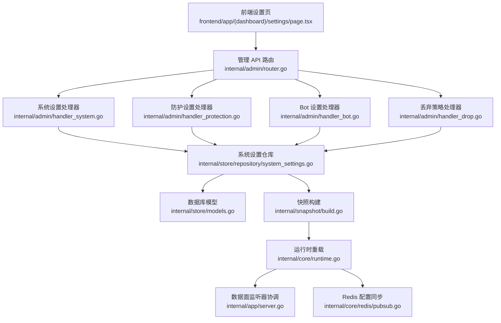
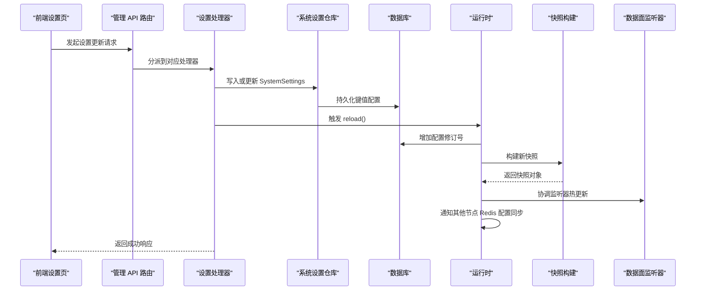
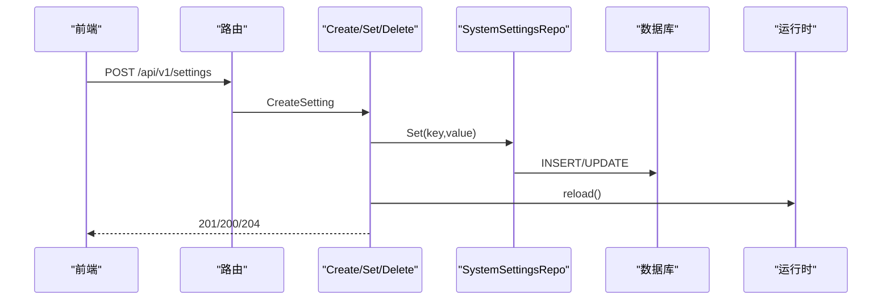
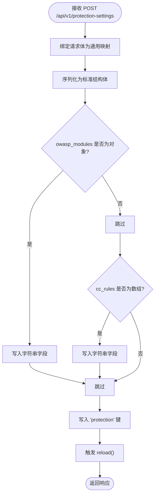
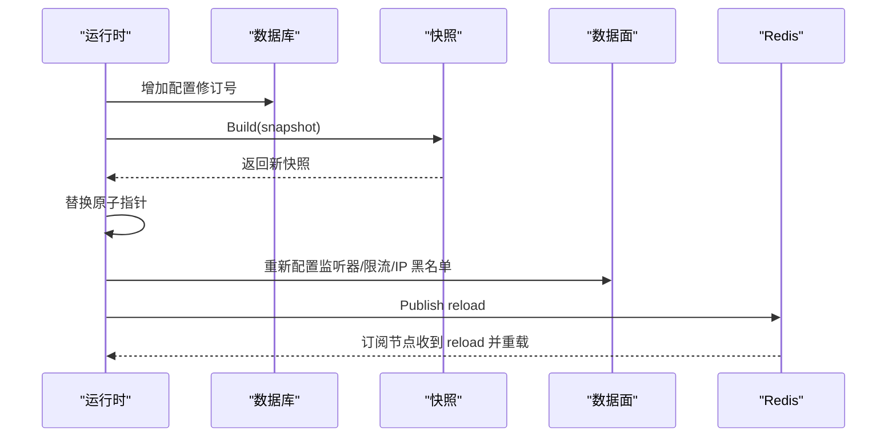
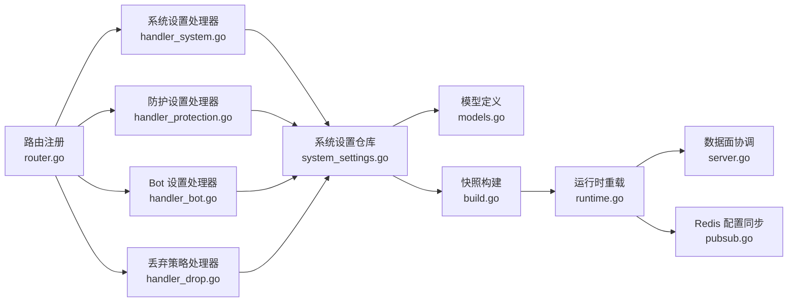

# 系统设置 API

<cite>
**本文档引用的文件**
- [handler_system.go](file://internal/admin/handler_system.go)
- [router.go](file://internal/admin/router.go)
- [system_settings.go](file://internal/store/repository/system_settings.go)
- [models.go](file://internal/store/models.go)
- [config.go](file://internal/core/config.go)
- [config_validate.go](file://internal/core/config_validate.go)
- [runtime.go](file://internal/core/runtime.go)
- [server.go](file://internal/app/server.go)
- [pubsub.go](file://internal/core/redis/pubsub.go)
- [handler_protection.go](file://internal/admin/handler_protection.go)
- [handler_bot.go](file://internal/admin/handler_bot.go)
- [handler_drop.go](file://internal/admin/handler_drop.go)
- [snapshot.go](file://internal/snapshot/snapshot.go)
- [build.go](file://internal/snapshot/build.go)
- [page.tsx](file://frontend/app/(dashboard)/settings/page.tsx)
</cite>

## 目录
1. [简介](#简介)
2. [项目结构](#项目结构)
3. [核心组件](#核心组件)
4. [架构总览](#架构总览)
5. [详细组件分析](#详细组件分析)
6. [依赖关系分析](#依赖关系分析)
7. [性能考虑](#性能考虑)
8. [故障排除指南](#故障排除指南)
9. [结论](#结论)
10. [附录](#附录)

## 简介
本文件系统性梳理 My-OpenWaf 的系统设置 API，覆盖全局设置、功能开关与性能参数的管理。重点说明设置项分类（安全设置、监控设置、日志设置、网络配置）、设置值验证机制、设置生效机制（热更新/重启要求/回滚策略）、配置示例与推荐设置、备份与恢复能力、配置变更影响分析与最佳实践。

## 项目结构
系统设置 API 由后端路由层、处理器层、存储仓库层与前端界面共同组成，配合运行时快照与热重载机制实现配置的持久化与动态生效。

**图表来源**
- [router.go:48-210](file://internal/admin/router.go#L48-L210)
- [handler_system.go:12-91](file://internal/admin/handler_system.go#L12-L91)
- [handler_protection.go:21-106](file://internal/admin/handler_protection.go#L21-L106)
- [handler_bot.go:35-102](file://internal/admin/handler_bot.go#L35-L102)
- [handler_drop.go:41-98](file://internal/admin/handler_drop.go#L41-L98)
- [system_settings.go:9-43](file://internal/store/repository/system_settings.go#L9-L43)
- [models.go:150-156](file://internal/store/models.go#L150-L156)
- [build.go:14-56](file://internal/snapshot/build.go#L14-L56)
- [runtime.go:82-111](file://internal/core/runtime.go#L82-L111)
- [server.go:220-260](file://internal/app/server.go#L220-L260)
- [pubsub.go:52-76](file://internal/core/redis/pubsub.go#L52-L76)

**章节来源**
- [router.go:48-210](file://internal/admin/router.go#L48-L210)
- [handler_system.go:12-91](file://internal/admin/handler_system.go#L12-L91)
- [handler_protection.go:21-106](file://internal/admin/handler_protection.go#L21-L106)
- [handler_bot.go:35-102](file://internal/admin/handler_bot.go#L35-L102)
- [handler_drop.go:41-98](file://internal/admin/handler_drop.go#L41-L98)
- [system_settings.go:9-43](file://internal/store/repository/system_settings.go#L9-L43)
- [models.go:150-156](file://internal/store/models.go#L150-L156)
- [build.go:14-56](file://internal/snapshot/build.go#L14-L56)
- [runtime.go:82-111](file://internal/core/runtime.go#L82-L111)
- [server.go:220-260](file://internal/app/server.go#L220-L260)
- [pubsub.go:52-76](file://internal/core/redis/pubsub.go#L52-L76)

## 核心组件
- 系统设置 API：提供设置项的增删改查与批量读取，支持热重载触发。
- 防护设置 API：集中管理请求/错误限流、OWASP 敏感度、维护模式、Bot/CVE/CC 等保护策略。
- Bot 设置 API：管理 Bot 检测开关、阈值、高风险国家、数据中心/VPN ASN 白名单等。
- 丢弃策略 API：控制 TCP 连接丢弃策略（基于 Bot/CVE 触发）。
- 存储与模型：SystemSettings 表用于键值型配置；ProtectionConfig/BotProtectionConfig 等结构体用于复杂配置序列化存储。
- 快照与热重载：通过快照构建与运行时重载，实现配置变更的原子切换与跨节点同步。

**章节来源**
- [handler_system.go:12-91](file://internal/admin/handler_system.go#L12-L91)
- [handler_protection.go:21-106](file://internal/admin/handler_protection.go#L21-L106)
- [handler_bot.go:35-102](file://internal/admin/handler_bot.go#L35-L102)
- [handler_drop.go:41-98](file://internal/admin/handler_drop.go#L41-L98)
- [system_settings.go:9-43](file://internal/store/repository/system_settings.go#L9-L43)
- [models.go:150-156](file://internal/store/models.go#L150-L156)
- [runtime.go:82-111](file://internal/core/runtime.go#L82-L111)

## 架构总览
系统设置 API 的调用链路如下：

**图表来源**
- [router.go:185-206](file://internal/admin/router.go#L185-L206)
- [handler_system.go:28-91](file://internal/admin/handler_system.go#L28-L91)
- [system_settings.go:23-34](file://internal/store/repository/system_settings.go#L23-L34)
- [runtime.go:82-111](file://internal/core/runtime.go#L82-L111)
- [build.go:14-56](file://internal/snapshot/build.go#L14-L56)
- [server.go:220-260](file://internal/app/server.go#L220-L260)
- [pubsub.go:52-76](file://internal/core/redis/pubsub.go#L52-L76)

## 详细组件分析

### 系统设置 API（键值型）
- 接口能力
  - 列出所有设置项
  - 获取单个设置项
  - 新增/更新设置项
  - 删除设置项
- 请求与响应
  - 列表：GET /api/v1/settings
  - 获取：GET /api/v1/settings/:key
  - 新增/更新：POST /api/v1/settings 或 /api/v1/settings/:key
  - 删除：POST /api/v1/settings/:key/delete
- 错误处理
  - 参数校验失败返回 400
  - 未找到返回 404
  - 其他错误返回 500
- 生效机制
  - 写入后调用 reload()，触发快照重建与热重载

**图表来源**
- [router.go:189-193](file://internal/admin/router.go#L189-L193)
- [handler_system.go:28-91](file://internal/admin/handler_system.go#L28-L91)
- [system_settings.go:23-34](file://internal/store/repository/system_settings.go#L23-L34)

**章节来源**
- [handler_system.go:12-91](file://internal/admin/handler_system.go#L12-L91)
- [router.go:189-193](file://internal/admin/router.go#L189-L193)
- [system_settings.go:9-43](file://internal/store/repository/system_settings.go#L9-L43)

### 防护设置 API（复杂结构）
- 设置项分类
  - 请求/错误限流：窗口、阈值、动作
  - OWASP：内置规则集开关与敏感度、命中动作
  - 维护模式：全局状态码与 HTML
  - Bot 检测：开关
  - IP 自动封禁：阈值、窗口、时长
  - CC 保护：等待室、自定义规则
  - 模块级 OWASP 敏感度：按模块键映射
  - CVE 检测：开关与动作
  - 登录安全策略：密码最小长度、最大尝试次数、锁定时长
- 接口
  - 获取：GET /api/v1/protection-settings
  - 更新：POST /api/v1/protection-settings
- 特殊处理
  - 前端可能以对象/数组形式传入，后端会转换为字符串字段再入库
  - 响应时将字符串字段反序列化为对象/数组返回给前端

**图表来源**
- [handler_protection.go:60-106](file://internal/admin/handler_protection.go#L60-L106)
- [models.go:245-318](file://internal/store/models.go#L245-L318)

**章节来源**
- [handler_protection.go:21-106](file://internal/admin/handler_protection.go#L21-L106)
- [models.go:245-318](file://internal/store/models.go#L245-L318)

### Bot 设置 API
- 设置项
  - 开关、评分阈值、高风险国家列表、数据中心/VPN ASN 列表、GeoIP 库路径
- 接口
  - 获取：GET /api/v1/bot-settings
  - 更新：POST /api/v1/bot-settings/update
- 生效机制
  - 更新后写入 bot_settings 键并触发 reload()

**章节来源**
- [handler_bot.go:35-102](file://internal/admin/handler_bot.go#L35-L102)
- [router.go:177-178](file://internal/admin/router.go#L177-L178)

### 丢弃策略 API
- 设置项
  - 开关、Bot 评分阈值、CVE 自动丢弃（严重/高）
- 接口
  - 获取：GET /api/v1/drop-policy
  - 更新：POST /api/v1/drop-policy/update
- 生效机制
  - 更新后写入 drop_policy 键并触发 reload()

**章节来源**
- [handler_drop.go:41-98](file://internal/admin/handler_drop.go#L41-L98)
- [router.go:199-200](file://internal/admin/router.go#L199-L200)

### 设置值验证机制
- 后端启动时的环境变量配置验证
  - 数据库驱动必须为 sqlite/mysql/postgres
  - DSN 不可为空
  - 管理端绑定地址需为有效的 host:port
  - Redis 地址若提供则需为有效的 host:port
  - 提供常见误配警告（如 sqlite 驱动却使用 MySQL/PG DSN）
- 设置项写入层面
  - 系统设置键值 API 对 key 的存在性进行基础校验
  - 复杂结构（如防护设置）在入库前进行 JSON 格式校验与字段转换

**章节来源**
- [config_validate.go:11-47](file://internal/core/config_validate.go#L11-L47)
- [config.go:113-182](file://internal/core/config.go#L113-L182)
- [handler_system.go:35-42](file://internal/admin/handler_system.go#L35-L42)
- [handler_protection.go:64-75](file://internal/admin/handler_protection.go#L64-L75)

### 设置生效机制
- 热更新
  - 所有写入操作完成后调用 reload()，增加配置修订号并重建快照
  - 将新快照原子替换旧快照，并根据新配置重新配置限流、IP 黑名单与数据面监听器
  - 通过 Redis 配置同步通道向其他节点广播“重载”事件，确保多节点一致
- 重启要求
  - 当前实现主要通过热重载完成，无需进程重启
- 回滚策略
  - 代码未实现自动回滚；可通过恢复历史快照或回退到上一个有效配置键值实现手动回滚

**图表来源**
- [runtime.go:82-111](file://internal/core/runtime.go#L82-L111)
- [server.go:220-260](file://internal/app/server.go#L220-L260)
- [pubsub.go:52-76](file://internal/core/redis/pubsub.go#L52-L76)

**章节来源**
- [runtime.go:82-111](file://internal/core/runtime.go#L82-L111)
- [server.go:220-260](file://internal/app/server.go#L220-L260)
- [pubsub.go:52-76](file://internal/core/redis/pubsub.go#L52-L76)

### 配置示例与推荐设置
- 环境变量（启动时）
  - MY_OPENWAF_DB_DRIVER：数据库驱动（sqlite/mysql/postgres）
  - MY_OPENWAF_DSN/MY_OPENWAF_DB：数据库连接串
  - MY_OPENWAF_DATA：数据目录（sqlite 默认使用）
  - MY_OPENWAF_ADMIN_BIND：管理端绑定地址（默认 :9443）
  - MY_OPENWAF_REDIS_ADDR/PASSWORD/DB：Redis 连接信息
  - MY_OPENWAF_GEOIP_DB：GeoIP 库路径
  - MY_OPENWAF_BOT_THRESHOLD：Bot 评分阈值
  - MY_OPENWAF_CVE_ENABLED/FEED_ENABLED/FEED_INTERVAL/NVD_API_KEY/AUTO_APPROVE：CVE 功能开关与同步间隔、密钥、自动审批
  - MY_OPENWAF_DROP_ENABLED/DROP_BOT_THRESHOLD：丢弃策略开关与阈值
- 前端设置页
  - 通用设置页包含“防护配置”、“控制台管理”、“系统日志”三大标签页
  - “防护配置”支持证书管理、拦截页面与日志清理策略
  - “控制台管理”支持 API 密钥与登录安全策略（密码长度、最大尝试次数、锁定时长）

**章节来源**
- [config.go:113-182](file://internal/core/config.go#L113-L182)
- [page.tsx](file://frontend/app/(dashboard)/settings/page.tsx#L650-L696)

### 配置备份与恢复
- 备份
  - SystemSettings 表记录了所有键值型配置，可直接导出该表作为配置备份
  - 防护设置等复杂结构以 JSON 字符串形式存储于 protection/bot_settings/drop_policy 等键下
- 恢复
  - 通过导入相同键值即可恢复配置
  - 若需要回滚，可先写入历史版本的键值，然后触发 reload() 生效

**章节来源**
- [models.go:150-156](file://internal/store/models.go#L150-L156)
- [system_settings.go:15-43](file://internal/store/repository/system_settings.go#L15-L43)

### 配置变更的影响分析与最佳实践
- 影响分析
  - 防护设置：直接影响限流、OWASP、Bot/CVE/CC 等策略，变更后需关注 QPS、误判率与合规性
  - Bot 设置：调整阈值与 ASN 列表会影响 Bot 识别准确率与误伤
  - 丢弃策略：影响异常流量处置策略，需结合业务容忍度评估
  - 热更新：变更即刻生效，建议在低峰期执行并观察指标
- 最佳实践
  - 变更前先在测试环境验证
  - 使用“保存但不立即上线”的流程，逐步放量
  - 结合日志与告警监控变更后的效果
  - 对关键参数（如 Bot 阈值、限流窗口/阈值）建立基线与回退预案

## 依赖关系分析

**图表来源**
- [router.go:48-210](file://internal/admin/router.go#L48-L210)
- [handler_system.go:12-91](file://internal/admin/handler_system.go#L12-L91)
- [handler_protection.go:21-106](file://internal/admin/handler_protection.go#L21-L106)
- [handler_bot.go:35-102](file://internal/admin/handler_bot.go#L35-L102)
- [handler_drop.go:41-98](file://internal/admin/handler_drop.go#L41-L98)
- [system_settings.go:9-43](file://internal/store/repository/system_settings.go#L9-L43)
- [models.go:150-156](file://internal/store/models.go#L150-L156)
- [build.go:14-56](file://internal/snapshot/build.go#L14-L56)
- [runtime.go:82-111](file://internal/core/runtime.go#L82-L111)
- [server.go:220-260](file://internal/app/server.go#L220-L260)
- [pubsub.go:52-76](file://internal/core/redis/pubsub.go#L52-L76)

**章节来源**
- [router.go:48-210](file://internal/admin/router.go#L48-L210)
- [handler_system.go:12-91](file://internal/admin/handler_system.go#L12-L91)
- [handler_protection.go:21-106](file://internal/admin/handler_protection.go#L21-L106)
- [handler_bot.go:35-102](file://internal/admin/handler_bot.go#L35-L102)
- [handler_drop.go:41-98](file://internal/admin/handler_drop.go#L41-L98)
- [system_settings.go:9-43](file://internal/store/repository/system_settings.go#L9-L43)
- [models.go:150-156](file://internal/store/models.go#L150-L156)
- [build.go:14-56](file://internal/snapshot/build.go#L14-L56)
- [runtime.go:82-111](file://internal/core/runtime.go#L82-L111)
- [server.go:220-260](file://internal/app/server.go#L220-L260)
- [pubsub.go:52-76](file://internal/core/redis/pubsub.go#L52-L76)

## 性能考虑
- 快照缓存：本地进程内缓存提升快照访问性能，避免重复构建
- 热重载成本：快照构建与监听器重建有一定 CPU/内存开销，建议在低峰期执行
- Redis 同步：跨节点同步通过发布订阅实现，注意网络抖动对同步延迟的影响
- 查询优化：系统设置查询按 key 精确匹配，复杂结构解析仅在写入/读取时发生

**章节来源**
- [runtime.go:82-111](file://internal/core/runtime.go#L82-L111)
- [server.go:220-260](file://internal/app/server.go#L220-L260)
- [pubsub.go:52-76](file://internal/core/redis/pubsub.go#L52-L76)

## 故障排除指南
- 常见错误
  - 400：请求体格式错误或必填字段缺失
  - 404：设置项不存在
  - 500：数据库写入失败或 reload 失败
- 排查步骤
  - 检查请求体是否符合 JSON 格式
  - 确认 key 是否正确
  - 查看后端日志中的 reload 失败原因
  - 如涉及 Redis 同步，检查 Redis 连接与频道订阅状态
- 回滚方法
  - 通过恢复历史键值或回退到上一版本配置

**章节来源**
- [handler_system.go:35-42](file://internal/admin/handler_system.go#L35-L42)
- [handler_protection.go:72-75](file://internal/admin/handler_protection.go#L72-L75)
- [handler_bot.go:60-63](file://internal/admin/handler_bot.go#L60-L63)
- [handler_drop.go:59-63](file://internal/admin/handler_drop.go#L59-L63)

## 结论
系统设置 API 提供了从键值型到复杂结构化的统一配置管理能力，结合热重载与跨节点同步，实现了配置的即时生效与一致性保障。建议在生产环境中遵循“小步快跑、可观测、可回滚”的原则，确保变更可控、可追踪。

## 附录
- 设置项分类速览
  - 安全设置：Bot 设置、丢弃策略、登录安全策略
  - 监控设置：防护设置（限流/OWASP/维护模式/CC/CVE）
  - 日志设置：日志保留策略（通过前端设置页配置）
  - 网络配置：管理端绑定地址、Redis 连接（环境变量）
- 快照与配置结构
  - 快照包含站点、TLS、防护配置等，防护配置来源于 SystemSettings 中的 protection 键

**章节来源**
- [snapshot.go:52-64](file://internal/snapshot/snapshot.go#L52-L64)
- [build.go:203-213](file://internal/snapshot/build.go#L203-L213)
- [models.go:245-318](file://internal/store/models.go#L245-L318)