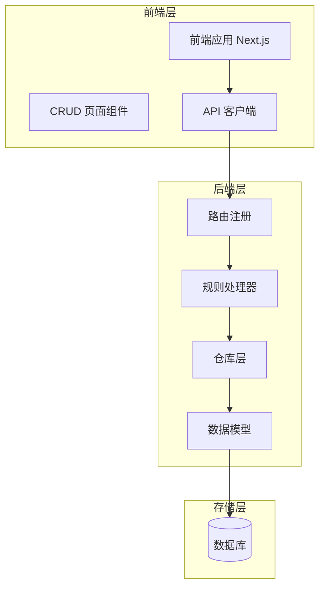
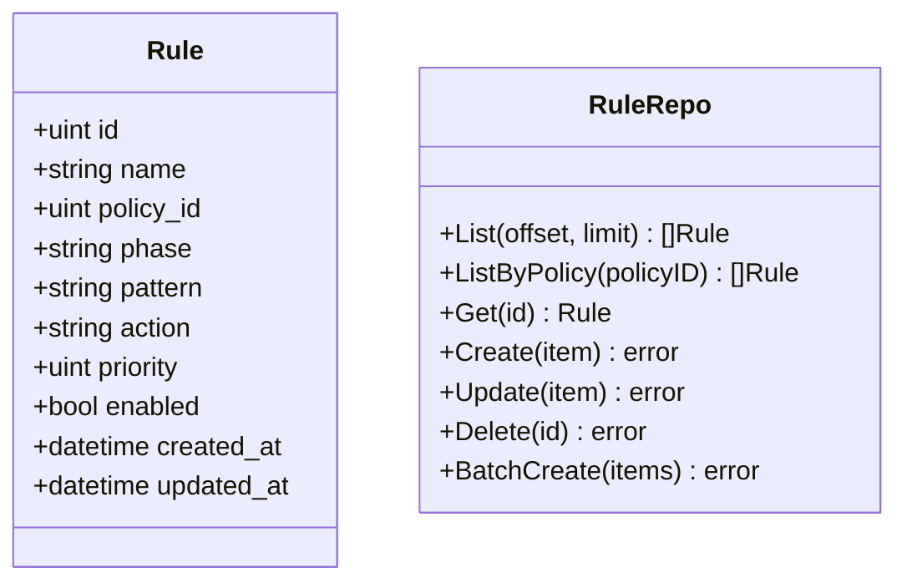
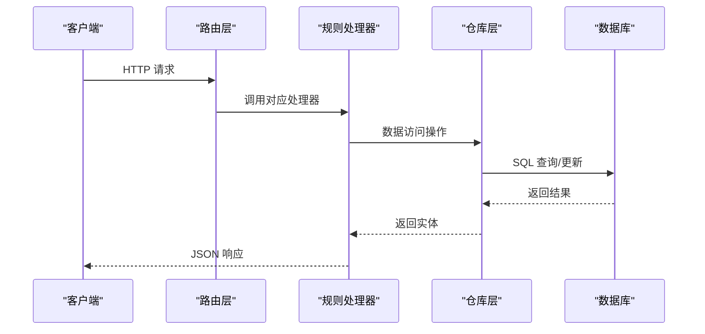
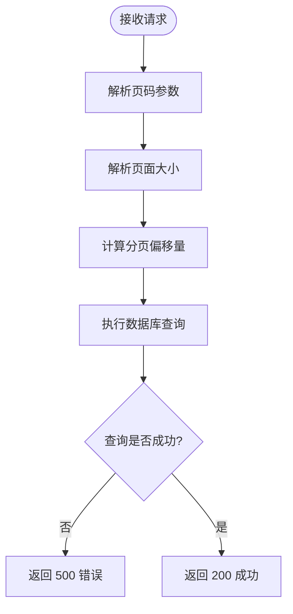
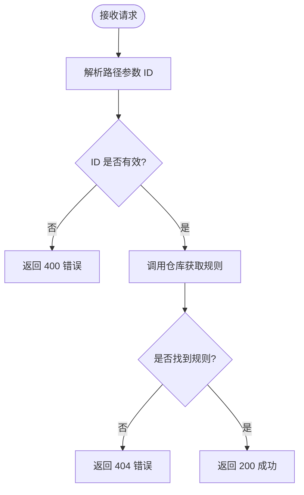
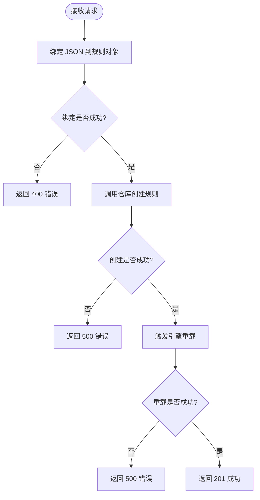
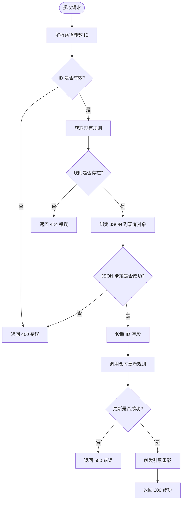
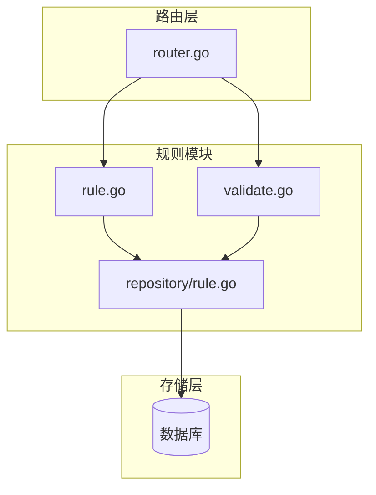
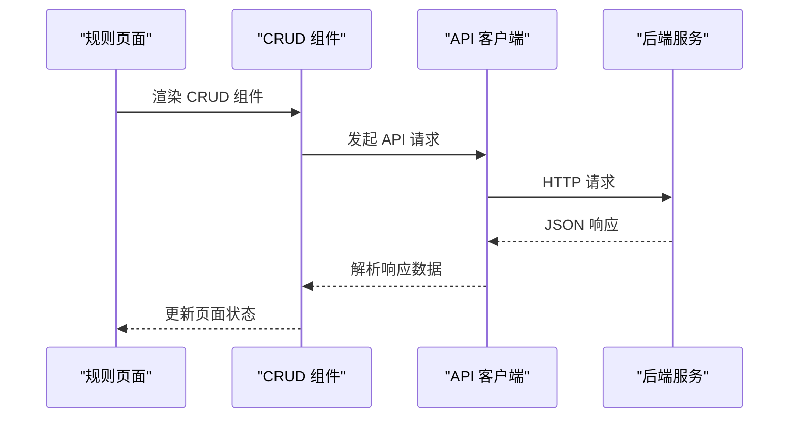

# 规则 CRUD 操作

> [返回 管理 API 系统](../管理 API 系统.md)

<cite>
**本文引用的文件**
- [rule.go](file://internal/admin/rule/rule.go)
- [validate.go](file://internal/admin/rule/validate.go)
- [rule.go](file://internal/store/repository/rule.go)
- [policy.go](file://internal/store/policy.go)
- [router.go](file://internal/admin/router.go)
- [规则 CRUD 操作.md](file://docs/管理 API 系统/规则管理 API/规则 CRUD 操作.md)
- [API 端点参考.md](file://docs/管理 API 系统/REST API 设计规范/API 端点参考.md)
- [规则管理 API.md](file://docs/管理 API 系统/规则管理 API/规则管理 API.md)
- [page.tsx](file://frontend/app/(dashboard)/rules/page.tsx)
- [crud-page.tsx](file://frontend/components/crud-page.tsx)
- [api.ts](file://frontend/lib/api.ts)
</cite>

## 目录
1. [简介](#简介)
2. [项目结构](#项目结构)
3. [核心组件](#核心组件)
4. [架构概览](#架构概览)
5. [详细组件分析](#详细组件分析)
6. [依赖关系分析](#依赖关系分析)
7. [性能考虑](#性能考虑)
8. [故障排除指南](#故障排除指南)
9. [结论](#结论)
10. [附录](#附录)

## 简介

本文档详细描述了 OpenWAF 项目中规则 CRUD（创建、读取、更新、删除）操作的完整实现。规则是 WAF（Web 应用防火墙）系统的核心组件，用于定义安全策略和防护逻辑。本文档涵盖了从后端 API 实现到前端用户界面的所有方面，包括 HTTP 方法、URL 路径、请求参数、响应格式、错误处理机制以及分页查询机制。

## 项目结构

OpenWAF 采用前后端分离的架构设计，规则 CRUD 功能分布在多个层次中：



**图表来源**
- [rule.go:18-138](file://internal/admin/rule/rule.go#L18-L138)
- [rule.go:1-51](file://internal/store/repository/rule.go#L1-L51)

**章节来源**
- [rule.go:18-138](file://internal/admin/rule/rule.go#L18-L138)
- [rule.go:1-51](file://internal/store/repository/rule.go#L1-L51)

## 核心组件

### 规则数据模型

规则模型定义了 WAF 系统中的核心数据结构：



**图表来源**
- [policy.go:61](file://internal/store/policy.go#L61)
- [rule.go:9-51](file://internal/store/repository/rule.go#L9-L51)

### 规则处理器

规则处理器提供了完整的 CRUD 操作接口：

- **列表查询**：支持分页和排序
- **单条查询**：按 ID 获取规则详情
- **创建规则**：支持批量创建
- **更新规则**：支持部分字段更新
- **删除规则**：级联删除关联资源

**章节来源**
- [rule.go:18-138](file://internal/admin/rule/rule.go#L18-L138)
- [rule.go:24-51](file://internal/store/repository/rule.go#L24-L51)

## 架构概览



**图表来源**
- [rule.go:18-138](file://internal/admin/rule/rule.go#L18-L138)
- [rule.go:24-51](file://internal/store/repository/rule.go#L24-L51)

## 详细组件分析

### 列表查询 API

#### API 端点规范

| 属性 | 值 |
|------|-----|
| HTTP 方法 | GET |
| URL 路径 | `/api/v1/rules` |
| 认证要求 | 需要有效令牌 |
| RBAC 权限 | readonly |

#### 查询参数

| 字段名 | 类型 | 必填 | 描述 | 默认值 |
|--------|------|------|------|-----|
| page | int | 否 | 页码 | 1 |
| page_size | int | 否 | 每页大小 | 20 |

#### 响应格式

**成功响应 (200 OK)**:
```json
{
  "items": [
    {
      "id": 1,
      "name": "示例规则",
      "policy_id": 1,
      "phase": "acl",
      "pattern": "block_ip:192.168.1.100",
      "action": "intercept",
      "priority": 100,
      "enabled": true,
      "created_at": "2024-01-01T00:00:00Z",
      "updated_at": "2024-01-01T00:00:00Z"
    }
  ],
  "total": 1
}
```

#### 后端实现流程



**图表来源**
- [rule.go:18-30](file://internal/admin/rule/rule.go#L18-L30)

**章节来源**
- [rule.go:18-30](file://internal/admin/rule/rule.go#L18-L30)

### 读取规则 API

#### API 端点规范

| 属性 | 值 |
|------|-----|
| HTTP 方法 | GET |
| URL 路径 | `/api/v1/rules/:id` |
| 参数 | id: 规则 ID (路径参数) |
| 认证要求 | 需要有效令牌 |
| RBAC 权限 | readonly |

#### 请求参数

| 字段名 | 类型 | 必填 | 描述 |
|--------|------|------|------|
| id | uint | 是 | 规则唯一标识符 |

#### 响应格式

**成功响应 (200 OK)**:
```json
{
  "id": 1,
  "name": "示例规则",
  "policy_id": 1,
  "phase": "acl",
  "pattern": "block_ip:192.168.1.100",
  "action": "intercept",
  "priority": 100,
  "enabled": true,
  "created_at": "2024-01-01T00:00:00Z",
  "updated_at": "2024-01-00T00:00:00Z"
}
```

**错误响应 (400 Bad Request)**:
```json
{
  "error": "invalid id"
}
```

**错误响应 (404 Not Found)**:
```json
{
  "error": "not found"
}
```

#### 后端实现流程



**图表来源**
- [rule.go:57-71](file://internal/admin/rule/rule.go#L57-L71)

**章节来源**
- [rule.go:57-71](file://internal/admin/rule/rule.go#L57-L71)

### 创建规则 API

#### API 端点规范

| 属性 | 值 |
|------|-----|
| HTTP 方法 | POST |
| URL 路径 | `/api/v1/rules` |
| 认证要求 | 需要有效令牌 |
| RBAC 权限 | operator |
| 行为 | 触发配置重载 |

#### 请求参数

请求体包含完整的规则对象，字段定义与响应格式相同。

#### 响应格式

**成功响应 (201 Created)**:
```json
{
  "id": 1,
  "name": "新创建的规则",
  "policy_id": 1,
  "phase": "acl",
  "pattern": "block_ip:192.168.1.100",
  "action": "intercept",
  "priority": 100,
  "enabled": true,
  "created_at": "2024-01-01T00:00:00Z",
  "updated_at": "2024-01-01T00:00:00Z"
}
```

**错误响应 (400 Bad Request)**:
```json
{
  "error": "JSON 绑定错误或验证失败"
}
```

**错误响应 (500 Internal Server Error)**:
```json
{
  "error": "保存成功但配置重载失败"
}
```

#### 后端实现流程



**图表来源**
- [rule.go:73-90](file://internal/admin/rule/rule.go#L73-L90)

**章节来源**
- [rule.go:73-90](file://internal/admin/rule/rule.go#L73-L90)

### 更新规则 API

#### API 端点规范

| 属性 | 值 |
|------|-----|
| HTTP 方法 | POST |
| URL 路径 | `/api/v1/rules/:id/update` |
| 参数 | id: 规则 ID (路径参数) |
| 认证要求 | 需要有效令牌 |
| RBAC 权限 | operator |
| 行为 | 触发配置重载 |

#### 请求参数

| 字段名 | 类型 | 必填 | 描述 |
|--------|------|------|------|
| id | uint | 是 | 规则唯一标识符 |
| 其他字段 | - | 可选 | 与创建规则相同的字段 |

#### 响应格式

**成功响应 (200 OK)**:
```json
{
  "id": 1,
  "name": "更新后的规则名称",
  "policy_id": 1,
  "phase": "acl",
  "pattern": "block_ip:192.168.1.100",
  "action": "intercept",
  "priority": 100,
  "enabled": true,
  "created_at": "2024-01-01T00:00:00Z",
  "updated_at": "2024-01-01T00:00:00Z"
}
```

**错误响应 (400 Bad Request)**:
```json
{
  "error": "invalid id 或 JSON 绑定错误"
}
```

**错误响应 (404 Not Found)**:
```json
{
  "error": "not found"
}
```

**错误响应 (500 Internal Server Error)**:
```json
{
  "error": "服务器内部错误"
}
```

#### 后端实现流程



**图表来源**
- [rule.go:92-119](file://internal/admin/rule/rule.go#L92-L119)

**章节来源**
- [rule.go:92-119](file://internal/admin/rule/rule.go#L92-L119)

### 删除规则 API

#### API 端点规范

| 属性 | 值 |
|------|-----|
| HTTP 方法 | POST |
| URL 路径 | `/api/v1/rules/:id/delete` |
| 参数 | id: 规则 ID (路径参数) |
| 认证要求 | 需要有效令牌 |
| RBAC 权限 | operator |
| 行为 | 触发配置重载 |

#### 请求参数

| 字段名 | 类型 | 必填 | 描述 |
|--------|------|------|------|
| id | uint | 是 | 规则唯一标识符 |

#### 响应格式

**成功响应 (204 No Content)**:
```json
null
```

**错误响应 (400 Bad Request)**:
```json
{
  "error": "invalid id"
}
```

**错误响应 (500 Internal Server Error)**:
```json
{
  "error": "服务器内部错误"
}
```

#### 后端实现流程


**图表来源**
- [rule.go:121-138](file://internal/admin/rule/rule.go#L121-L138)

**章节来源**
- [rule.go:121-138](file://internal/admin/rule/rule.go#L121-L138)

### 规则验证 API

#### API 端点规范

| 属性 | 值 |
|------|-----|
| HTTP 方法 | POST |
| URL 路径 | `/api/v1/rules/validate` |
| 认证要求 | 需要有效令牌 |
| RBAC 权限 | operator |

#### 请求参数

```json
{
  "pattern": "block_ip:192.168.1.100"
}
```

#### 响应格式

**成功响应 (200 OK)**:
```json
{
  "valid": true,
  "message": "pattern is valid",
  "kind": "block_ip",
  "arg": "192.168.1.100"
}
```

**错误响应 (400 Bad Request)**:
```json
{
  "valid": false,
  "message": "pattern cannot be empty"
}
```

**章节来源**
- [validate.go:32-98](file://internal/admin/rule/validate.go#L32-L98)

### 规则测试 API

#### API 端点规范

| 属性 | 值 |
|------|-----|
| HTTP 方法 | POST |
| URL 路径 | `/api/v1/rules/test` |
| 认证要求 | 需要有效令牌 |
| RBAC 权限 | operator |

#### 请求参数

```json
{
  "pattern": "block_ip:192.168.1.100",
  "client_ip": "10.0.0.1",
  "path": "/test",
  "query": "param=value",
  "headers": {
    "User-Agent": "test"
  }
}
```

#### 响应格式

**成功响应 (200 OK)**:
```json
{
  "matched": true,
  "kind": "block_ip",
  "arg": "192.168.1.100"
}
```

**章节来源**
- [rule.go:149-192](file://internal/admin/rule/rule.go#L149-L192)

## 依赖关系分析



**图表来源**
- [router.go:97-165](file://internal/admin/router.go#L97-L165)
- [rule.go:18-138](file://internal/admin/rule/rule.go#L18-L138)
- [validate.go:32-98](file://internal/admin/rule/validate.go#L32-L98)

**章节来源**
- [router.go:97-165](file://internal/admin/router.go#L97-L165)
- [rule.go:18-138](file://internal/admin/rule/rule.go#L18-L138)
- [validate.go:32-98](file://internal/admin/rule/validate.go#L32-L98)

## 性能考虑

### 分页查询优化

- 使用数据库原生分页查询，避免一次性加载大量数据
- 支持自定义每页大小，默认 20 条记录
- 提供总记录数统计，便于前端分页显示

### 排序策略

- 默认按优先级升序、ID 升序排列
- 确保规则执行顺序的一致性

### 批量操作

- 支持批量创建规则，减少数据库连接开销
- 使用事务确保数据一致性

## 故障排除指南

### 常见错误类型

| 错误代码 | 可能原因 | 解决方案 |
|----------|----------|----------|
| 400 | 无效的 ID 参数 | 检查 URL 参数格式 |
| 400 | JSON 绑定错误 | 验证请求体格式 |
| 404 | 规则不存在 | 确认规则 ID 是否正确 |
| 500 | 数据库操作失败 | 检查数据库连接状态 |
| 500 | 配置重载失败 | 查看引擎日志 |

### 调试建议

1. **前端调试**：使用浏览器开发者工具查看网络请求
2. **后端日志**：检查服务器日志输出
3. **数据库检查**：验证数据表结构和索引
4. **权限验证**：确认用户具有相应操作权限

**章节来源**
- [rule.go:18-138](file://internal/admin/rule/rule.go#L18-L138)
- [validate.go:32-98](file://internal/admin/rule/validate.go#L32-L98)

## 结论

OpenWAF 的规则 CRUD 操作实现了完整的生命周期管理，包括：

- **完整的 CRUD 支持**：提供创建、读取、更新、删除的完整 API
- **灵活的查询能力**：支持分页查询和条件过滤
- **强大的验证机制**：内置规则模式验证和测试功能
- **可靠的错误处理**：完善的错误响应和状态码管理
- **高效的性能设计**：优化的数据库查询和分页机制

该实现为 WAF 系统提供了稳定、可扩展的规则管理基础，支持复杂的 Web 应用安全防护需求。

## 附录

### API 端点完整列表

- 获取规则列表：GET /api/v1/rules
- 获取规则详情：GET /api/v1/rules/:id
- 创建规则：POST /api/v1/rules
- 更新规则：POST /api/v1/rules/:id/update
- 删除规则：POST /api/v1/rules/:id/delete
- 验证规则：POST /api/v1/rules/validate
- 测试规则：POST /api/v1/rules/test
- 导出规则：GET /api/v1/rules/export
- 导入规则：POST /api/v1/rules/import
- 获取规则模板：GET /api/v1/rules/templates

### 前端集成示例

前端组件通过统一的 API 客户端进行集成：



**图表来源**
- [page.tsx](file://frontend/app/(dashboard)/rules/page.tsx)
- [crud-page.tsx](file://frontend/components/crud-page.tsx)
- [api.ts](file://frontend/lib/api.ts)

**章节来源**
- [API 端点参考.md:290-358](file://docs/管理 API 系统/REST API 设计规范/API 端点参考.md#L290-L358)
- [规则管理 API.md:430-440](file://docs/管理 API 系统/规则管理 API/规则管理 API.md#L430-L440)
- [page.tsx](file://frontend/app/(dashboard)/rules/page.tsx)
- [crud-page.tsx](file://frontend/components/crud-page.tsx)
- [api.ts](file://frontend/lib/api.ts)
