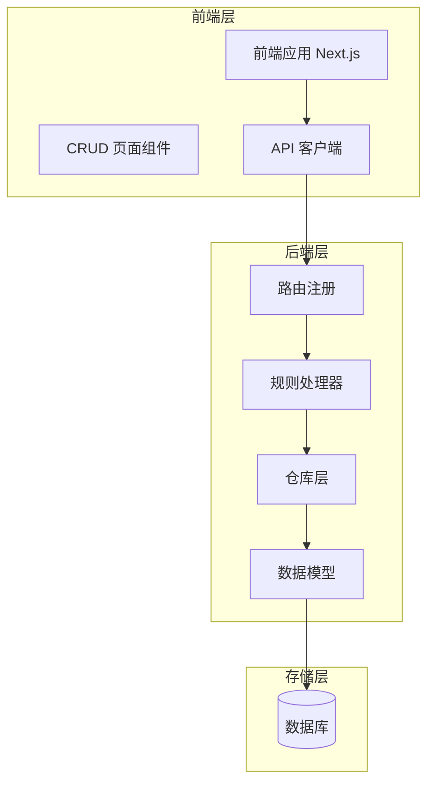
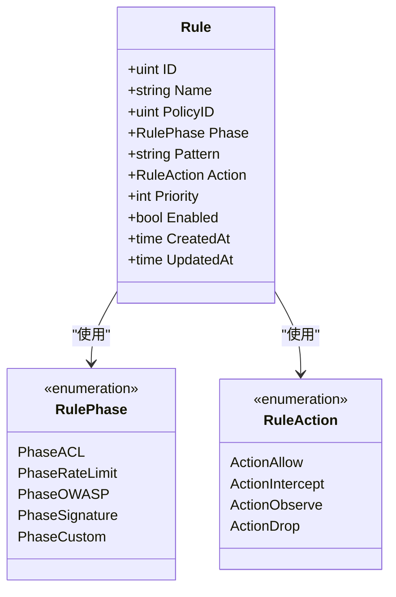
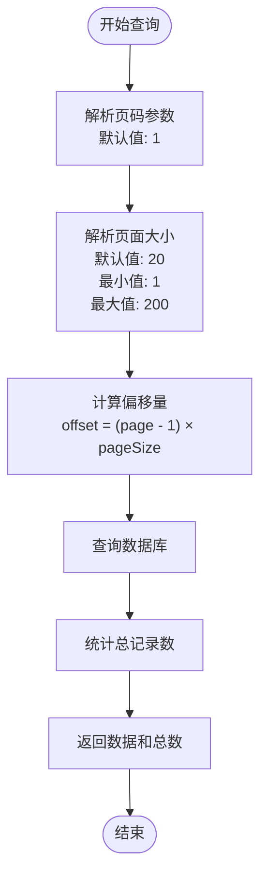
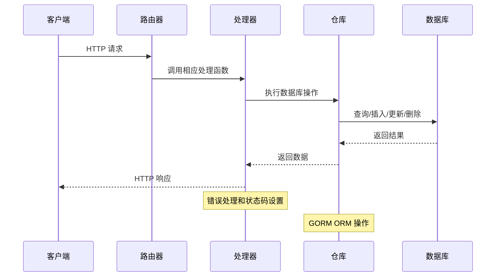
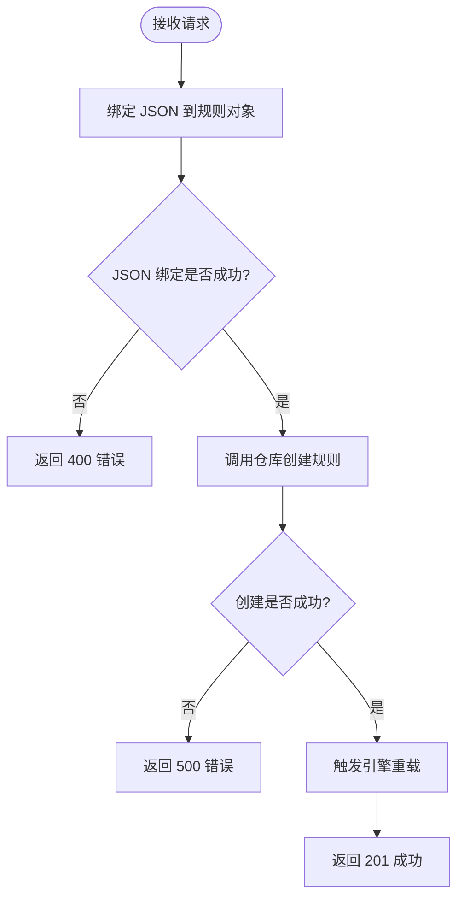
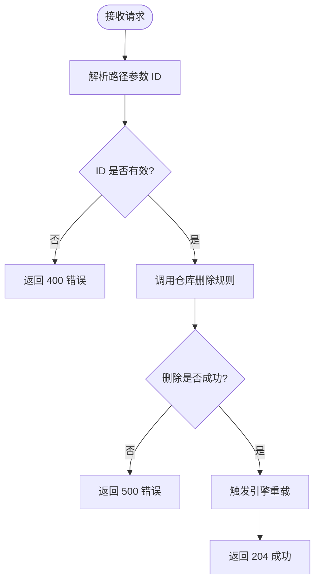
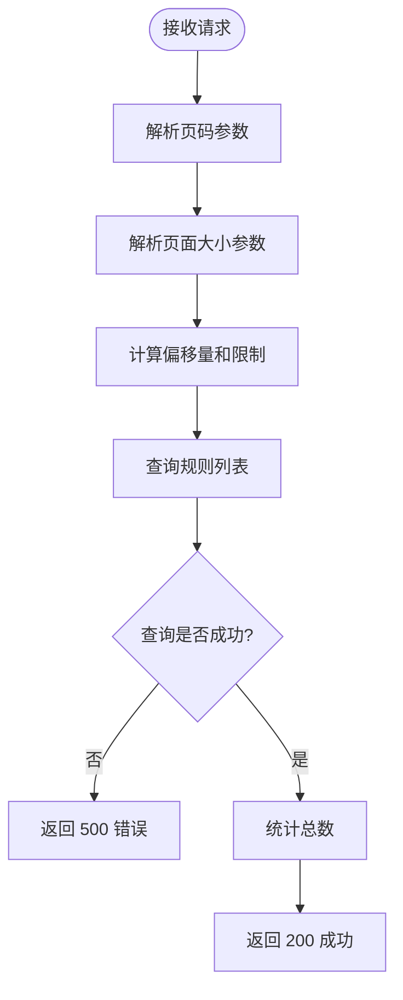
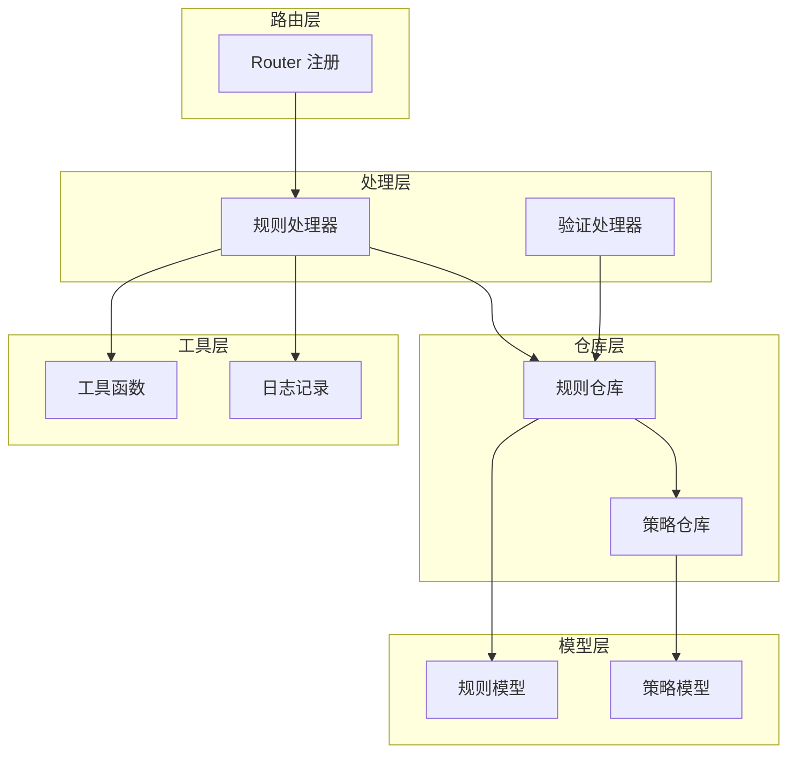
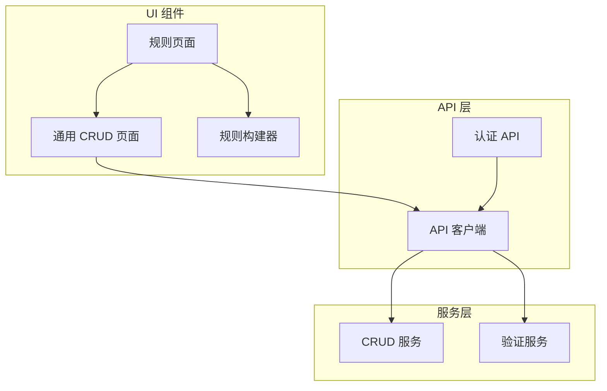

# 规则 CRUD 操作

<cite>
**本文档引用的文件**
- [handler_rule.go](file://internal/admin/handler_rule.go)
- [router.go](file://internal/admin/router.go)
- [rule.go](file://internal/store/repository/rule.go)
- [models.go](file://internal/store/models.go)
- [utils.go](file://internal/utils/utils.go)
- [page.tsx](file://frontend/app/(dashboard)/rules/page.tsx)
- [crud-page.tsx](file://frontend/components/crud-page.tsx)
- [api.ts](file://frontend/lib/api.ts)
- [handler_rule_validate.go](file://internal/admin/handler_rule_validate.go)
</cite>

## 目录
1. [简介](#简介)
2. [项目结构](#项目结构)
3. [核心组件](#核心组件)
4. [架构概览](#架构概览)
5. [详细组件分析](#详细组件分析)
6. [依赖关系分析](#依赖关系分析)
7. [性能考虑](#性能考虑)
8. [故障排除指南](#故障排除指南)
9. [结论](#结论)

## 简介

本文件详细介绍了 OpenWAF 项目中规则 CRUD（创建、读取、更新、删除）操作的完整实现。规则是 WAF（Web 应用防火墙）系统的核心组件，用于定义安全策略和防护逻辑。本文档涵盖了从后端 API 实现到前端用户界面的所有方面，包括 HTTP 方法、URL 路径、请求参数、响应格式、错误处理机制以及分页查询机制。

## 项目结构

OpenWAF 采用前后端分离的架构设计，规则 CRUD 功能分布在多个层次中：



**图表来源**
- [router.go:48-210](file://internal/admin/router.go#L48-L210)
- [handler_rule.go:16-102](file://internal/admin/handler_rule.go#L16-L102)
- [rule.go:9-40](file://internal/store/repository/rule.go#L9-L40)

**章节来源**
- [router.go:48-210](file://internal/admin/router.go#L48-L210)
- [handler_rule.go:16-102](file://internal/admin/handler_rule.go#L16-L102)

## 核心组件

### 规则数据模型

规则数据模型定义了规则的基本属性和行为：



**图表来源**
- [models.go:79-92](file://internal/store/models.go#L79-L92)
- [models.go:44-65](file://internal/store/models.go#L44-L65)

规则模型包含以下关键字段：
- **ID**: 规则唯一标识符
- **Name**: 规则名称，最大长度 128 字符
- **PolicyID**: 所属策略的外键
- **Phase**: 规则执行阶段（ACL、签名、自定义等）
- **Pattern**: 匹配模式，支持多种 DSL 格式
- **Action**: 处理动作（允许、拦截、观察、丢弃）
- **Priority**: 优先级，数值越小优先级越高
- **Enabled**: 启用状态，默认为 true

**章节来源**
- [models.go:79-92](file://internal/store/models.go#L79-L92)
- [models.go:44-65](file://internal/store/models.go#L44-L65)

### 分页查询机制

系统实现了标准的分页查询机制，支持自定义页面大小和偏移量：



**图表来源**
- [utils.go:10-21](file://internal/utils/utils.go#L10-L21)
- [rule.go:13-22](file://internal/store/repository/rule.go#L13-L22)

**章节来源**
- [utils.go:10-21](file://internal/utils/utils.go#L10-L21)
- [rule.go:13-22](file://internal/store/repository/rule.go#L13-L22)

## 架构概览

规则 CRUD 操作遵循 MVC（Model-View-Controller）架构模式：



**图表来源**
- [router.go:97-164](file://internal/admin/router.go#L97-L164)
- [handler_rule.go:16-102](file://internal/admin/handler_rule.go#L16-L102)
- [rule.go:13-40](file://internal/store/repository/rule.go#L13-L40)

## 详细组件分析

### 创建规则 (Create Rule)

#### API 端点规范

| 属性 | 值 |
|------|-----|
| HTTP 方法 | POST |
| URL 路径 | `/api/v1/rules` |
| 认证要求 | 需要有效令牌 |
| RBAC 权限 | admin, operator |

#### 请求参数

创建规则的请求体包含完整的规则对象：

| 字段名 | 类型 | 必填 | 描述 | 默认值 |
|--------|------|------|------|--------|
| name | string | 否 | 规则名称 | 空字符串 |
| policy_id | uint | 是 | 所属策略 ID | - |
| phase | string | 是 | 执行阶段 | "acl" |
| pattern | string | 是 | 匹配模式 DSL | - |
| action | string | 是 | 处理动作 | "block" |
| priority | int | 否 | 优先级 | 100 |
| enabled | bool | 否 | 启用状态 | true |

#### 响应格式

**成功响应 (201 Created)**:
```json
{
  "id": 1,
  "name": "示例规则",
  "policy_id": 1,
  "phase": "acl",
  "pattern": "block_ip:192.168.1.100",
  "action": "block",
  "priority": 100,
  "enabled": true,
  "created_at": "2024-01-01T00:00:00Z",
  "updated_at": "2024-01-01T00:00:00Z"
}
```

**错误响应 (400 Bad Request)**:
```json
{
  "error": "请求参数无效或格式不正确"
}
```

**错误响应 (500 Internal Server Error)**:
```json
{
  "error": "服务器内部错误"
}
```

#### 后端实现流程



**图表来源**
- [handler_rule.go:46-60](file://internal/admin/handler_rule.go#L46-L60)

**章节来源**
- [handler_rule.go:46-60](file://internal/admin/handler_rule.go#L46-L60)

### 读取规则 (Get Rule)

#### API 端点规范

| 属性 | 值 |
|------|-----|
| HTTP 方法 | GET |
| URL 路径 | `/api/v1/rules/:id` |
| 参数 | id: 规则 ID (路径参数) |
| 认证要求 | 需要有效令牌 |
| RBAC 权限 | admin, operator, readonly |

#### 请求参数

| 字段名 | 类型 | 必填 | 描述 |
|--------|------|------|------|
| id | uint | 是 | 规则唯一标识符 |

#### 响应格式

**成功响应 (200 OK)**:
```json
{
  "id": 1,
  "name": "示例规则",
  "policy_id": 1,
  "phase": "acl",
  "pattern": "block_ip:192.168.1.100",
  "action": "block",
  "priority": 100,
  "enabled": true,
  "created_at": "2024-01-01T00:00:00Z",
  "updated_at": "2024-01-01T00:00:00Z"
}
```

**错误响应 (400 Bad Request)**:
```json
{
  "error": "invalid id"
}
```

**错误响应 (404 Not Found)**:
```json
{
  "error": "not found"
}
```

#### 后端实现流程


**图表来源**
- [handler_rule.go:30-44](file://internal/admin/handler_rule.go#L30-L44)

**章节来源**
- [handler_rule.go:30-44](file://internal/admin/handler_rule.go#L30-L44)

### 更新规则 (Update Rule)

#### API 端点规范

| 属性 | 值 |
|------|-----|
| HTTP 方法 | POST |
| URL 路径 | `/api/v1/rules/:id/update` |
| 参数 | id: 规则 ID (路径参数) |
| 认证要求 | 需要有效令牌 |
| RBAC 权限 | admin, operator |

#### 请求参数

| 字段名 | 类型 | 必填 | 描述 |
|--------|------|------|------|
| id | uint | 是 | 规则唯一标识符 |
| 其他字段 | - | 可选 | 与创建规则相同的字段 |

#### 响应格式

**成功响应 (200 OK)**:
```json
{
  "id": 1,
  "name": "更新后的规则名称",
  "policy_id": 1,
  "phase": "acl",
  "pattern": "block_ip:192.168.1.100",
  "action": "block",
  "priority": 100,
  "enabled": true,
  "created_at": "2024-01-01T00:00:00Z",
  "updated_at": "2024-01-01T00:00:00Z"
}
```

**错误响应 (400 Bad Request)**:
```json
{
  "error": "invalid id 或 JSON 绑定错误"
}
```

**错误响应 (404 Not Found)**:
```json
{
  "error": "not found"
}
```

**错误响应 (500 Internal Server Error)**:
```json
{
  "error": "服务器内部错误"
}
```

#### 后端实现流程


**图表来源**
- [handler_rule.go:62-86](file://internal/admin/handler_rule.go#L62-L86)

**章节来源**
- [handler_rule.go:62-86](file://internal/admin/handler_rule.go#L62-L86)

### 删除规则 (Delete Rule)

#### API 端点规范

| 属性 | 值 |
|------|-----|
| HTTP 方法 | POST |
| URL 路径 | `/api/v1/rules/:id/delete` |
| 参数 | id: 规则 ID (路径参数) |
| 认证要求 | 需要有效令牌 |
| RBAC 权限 | admin, operator |

#### 请求参数

| 字段名 | 类型 | 必填 | 描述 |
|--------|------|------|------|
| id | uint | 是 | 规则唯一标识符 |

#### 响应格式

**成功响应 (204 No Content)**:
```json
null
```

**错误响应 (400 Bad Request)**:
```json
{
  "error": "invalid id"
}
```

**错误响应 (500 Internal Server Error)**:
```json
{
  "error": "服务器内部错误"
}
```

#### 后端实现流程



**图表来源**
- [handler_rule.go:88-102](file://internal/admin/handler_rule.go#L88-L102)

**章节来源**
- [handler_rule.go:88-102](file://internal/admin/handler_rule.go#L88-L102)

### 分页查询 (List Rules)

#### API 端点规范

| 属性 | 值 |
|------|-----|
| HTTP 方法 | GET |
| URL 路径 | `/api/v1/rules` |
| 认证要求 | 需要有效令牌 |
| RBAC 权限 | admin, operator, readonly |

#### 查询参数

| 参数名 | 类型 | 必填 | 描述 | 默认值 | 最大值 |
|--------|------|------|------|--------|--------|
| page | int | 否 | 页码 | 1 | - |
| page_size | int | 否 | 页面大小 | 20 | 200 |

#### 响应格式

**成功响应 (200 OK)**:
```json
{
  "items": [
    {
      "id": 1,
      "name": "规则1",
      "policy_id": 1,
      "phase": "acl",
      "pattern": "block_ip:192.168.1.100",
      "action": "block",
      "priority": 100,
      "enabled": true,
      "created_at": "2024-01-01T00:00:00Z",
      "updated_at": "2024-01-01T00:00:00Z"
    }
  ],
  "total": 150
}
```

**错误响应 (500 Internal Server Error)**:
```json
{
  "error": "服务器内部错误"
}
```

#### 后端实现流程



**图表来源**
- [handler_rule.go:16-28](file://internal/admin/handler_rule.go#L16-L28)
- [utils.go:10-21](file://internal/utils/utils.go#L10-L21)

**章节来源**
- [handler_rule.go:16-28](file://internal/admin/handler_rule.go#L16-L28)
- [utils.go:10-21](file://internal/utils/utils.go#L10-L21)

### 规则验证 (Validate Rule)

#### API 端点规范

| 属性 | 值 |
|------|-----|
| HTTP 方法 | POST |
| URL 路径 | `/api/v1/rules/validate` |
| 认证要求 | 需要有效令牌 |
| RBAC 权限 | admin, operator |

#### 请求参数

| 字段名 | 类型 | 必填 | 描述 |
|--------|------|------|------|
| pattern | string | 是 | 规则模式 DSL |

#### 响应格式

**成功响应 (200 OK)**:
```json
{
  "valid": true,
  "message": "pattern is valid",
  "kind": "block_ip",
  "arg": "192.168.1.100"
}
```

**错误响应 (400 Bad Request)**:
```json
{
  "valid": false,
  "message": "pattern cannot be empty",
  "errors": []
}
```

**章节来源**
- [handler_rule_validate.go:32-98](file://internal/admin/handler_rule_validate.go#L32-L98)

### 规则测试 (Test Rule)

#### API 端点规范

| 属性 | 值 |
|------|-----|
| HTTP 方法 | POST |
| URL 路径 | `/api/v1/rules/test` |
| 认证要求 | 需要有效令牌 |
| RBAC 权限 | admin, operator |

#### 请求参数

| 字段名 | 类型 | 必填 | 描述 |
|--------|------|------|------|
| pattern | string | 是 | 规则模式 DSL |
| client_ip | string | 否 | 客户端 IP 地址 |
| path | string | 否 | 请求路径 |
| query | string | 否 | 查询参数 |
| headers | map[string]string | 否 | 请求头 |

#### 响应格式

**成功响应 (200 OK)**:
```json
{
  "matched": true,
  "kind": "block_ip",
  "arg": "192.168.1.100"
}
```

**错误响应 (400 Bad Request)**:
```json
{
  "error": "invalid pattern"
}
```

**章节来源**
- [handler_rule.go:115-156](file://internal/admin/handler_rule.go#L115-L156)

## 依赖关系分析

### 后端依赖关系



**图表来源**
- [router.go:80-164](file://internal/admin/router.go#L80-L164)
- [handler_rule.go:16-102](file://internal/admin/handler_rule.go#L16-L102)
- [rule.go:9-40](file://internal/store/repository/rule.go#L9-L40)

### 前端依赖关系



**图表来源**
- [page.tsx:5-76](file://frontend/app/(dashboard)/rules/page.tsx#L5-L76)
- [crud-page.tsx:60-111](file://frontend/components/crud-page.tsx#L60-L111)
- [api.ts:31-88](file://frontend/lib/api.ts#L31-L88)

**章节来源**
- [router.go:80-164](file://internal/admin/router.go#L80-L164)
- [page.tsx:5-76](file://frontend/app/(dashboard)/rules/page.tsx#L5-L76)
- [crud-page.tsx:60-111](file://frontend/components/crud-page.tsx#L60-L111)

## 性能考虑

### 数据库优化

1. **索引策略**:
   - 规则表在 `policy_id` 和 `priority` 字段上建立索引
   - 支持高效的分页查询和优先级排序

2. **查询优化**:
   - 使用 `LIMIT` 和 `OFFSET` 实现分页
   - 按优先级和 ID 排序确保稳定的执行顺序

3. **连接池管理**:
   - GORM 自动管理数据库连接池
   - 避免长时间持有数据库连接

### 缓存策略

1. **响应缓存**:
   - 对只读查询结果进行短期缓存
   - 减少重复查询数据库的开销

2. **配置缓存**:
   - 缓存系统配置和规则集
   - 在规则更新时失效相关缓存

### 并发处理

1. **请求并发**:
   - 使用 goroutine 处理独立的请求
   - 避免阻塞其他请求的处理

2. **资源竞争**:
   - 数据库操作使用事务保证一致性
   - 避免竞态条件影响数据完整性

## 故障排除指南

### 常见错误及解决方案

| 错误类型 | HTTP 状态码 | 可能原因 | 解决方案 |
|----------|-------------|----------|----------|
| 参数错误 | 400 | 无效的 ID 格式或 JSON 格式错误 | 验证输入格式，检查必需字段 |
| 资源不存在 | 404 | 规则 ID 不存在 | 确认规则存在性，检查权限 |
| 权限不足 | 403 | RBAC 权限不足 | 检查用户角色，申请相应权限 |
| 会话过期 | 401 | 访问令牌过期 | 刷新访问令牌或重新登录 |
| 服务器错误 | 500 | 数据库连接失败或业务逻辑错误 | 检查服务器日志，重试操作 |

### 调试技巧

1. **日志分析**:
   ```bash
   # 查看后端服务日志
   docker logs -f openwaf-backend
   
   # 查看前端应用日志
   docker logs -f openwaf-frontend
   ```

2. **API 测试**:
   ```bash
   # 测试规则创建
   curl -X POST http://localhost:8080/api/v1/rules \
     -H "Content-Type: application/json" \
     -H "Authorization: Bearer YOUR_ACCESS_TOKEN" \
     -d '{
       "name": "Test Rule",
       "policy_id": 1,
       "phase": "acl",
       "pattern": "block_ip:192.168.1.100",
       "action": "block",
       "priority": 100,
       "enabled": true
     }'
   ```

3. **数据库检查**:
   ```sql
   -- 检查规则表结构
   DESCRIBE rules;
   
   -- 查询最新创建的规则
   SELECT * FROM rules ORDER BY id DESC LIMIT 10;
   ```

### 性能监控

1. **响应时间监控**:
   - 监控 CRUD 操作的平均响应时间
   - 设置性能阈值告警

2. **数据库性能**:
   - 监控慢查询数量
   - 分析查询执行计划

3. **内存使用**:
   - 监控应用内存使用情况
   - 检查内存泄漏问题

**章节来源**
- [handler_rule.go:16-102](file://internal/admin/handler_rule.go#L16-L102)
- [router.go:48-210](file://internal/admin/router.go#L48-L210)

## 结论

OpenWAF 的规则 CRUD 操作实现了完整的 RESTful API 设计，具有以下特点：

1. **标准化接口**: 遵循 RESTful 设计原则，使用标准的 HTTP 方法和状态码
2. **完善的错误处理**: 提供清晰的错误信息和适当的 HTTP 状态码
3. **灵活的数据模型**: 支持多种规则类型和复杂的匹配模式
4. **高效的数据访问**: 实现了优化的分页查询和索引策略
5. **安全的权限控制**: 基于 RBAC 的细粒度权限管理
6. **用户友好的前端**: 提供直观的图形化界面和实时验证功能

该实现为 WAF 系统提供了强大的规则管理能力，支持复杂的安全策略配置和动态调整。通过合理的架构设计和性能优化，确保了系统的稳定性和可扩展性。