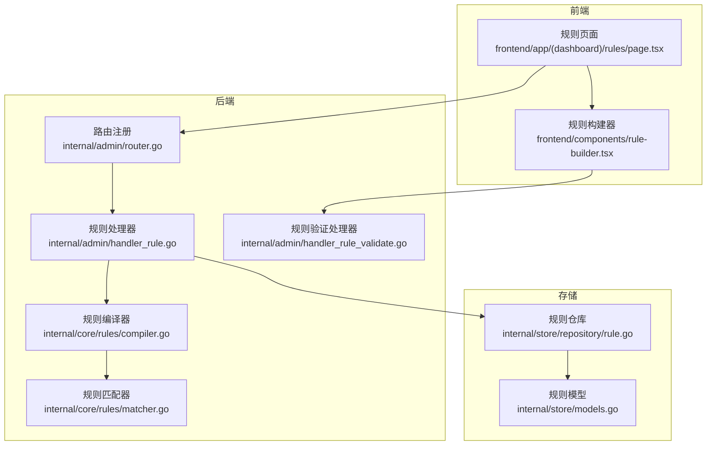
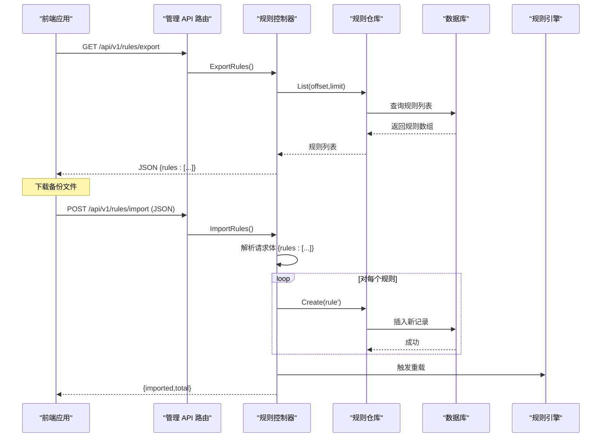
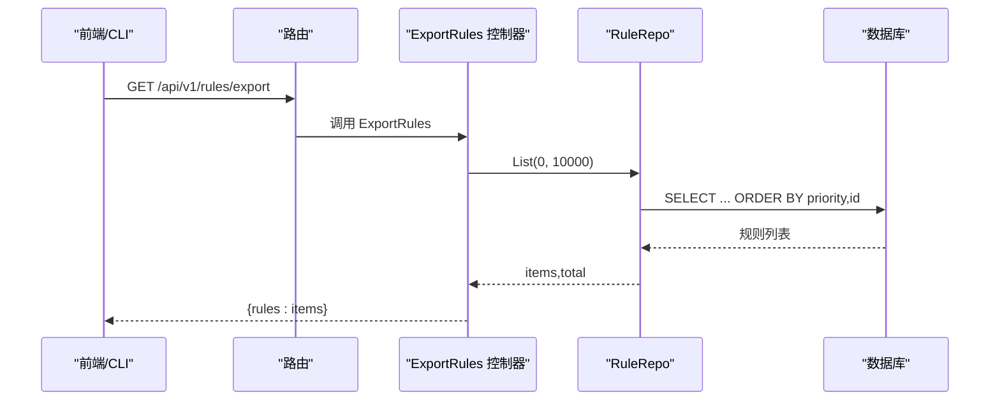
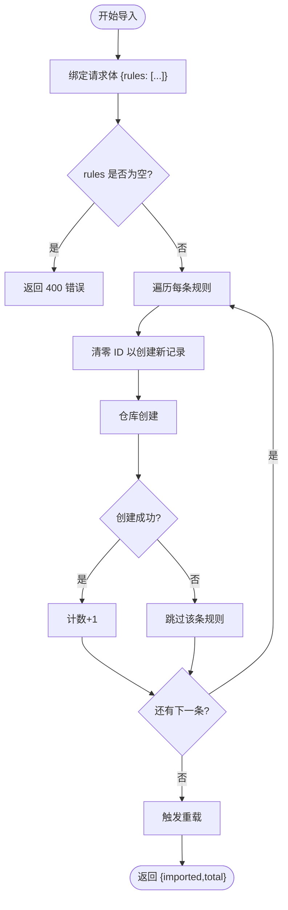
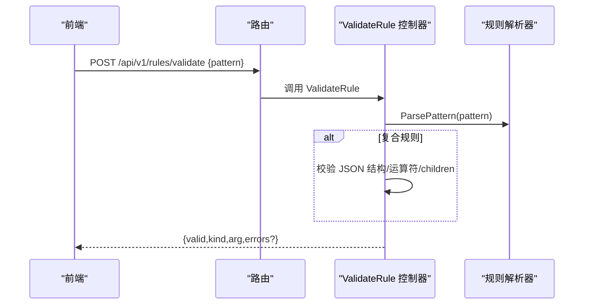
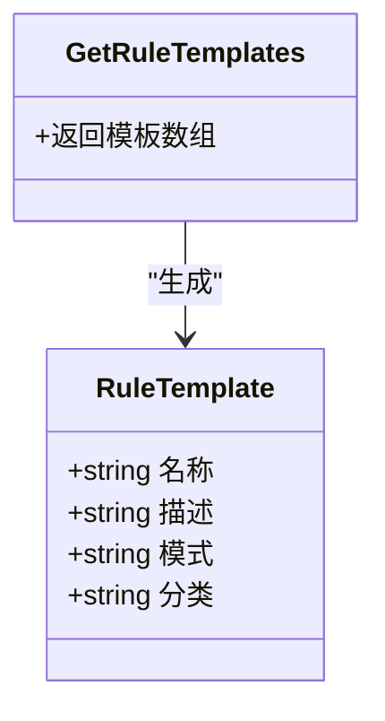
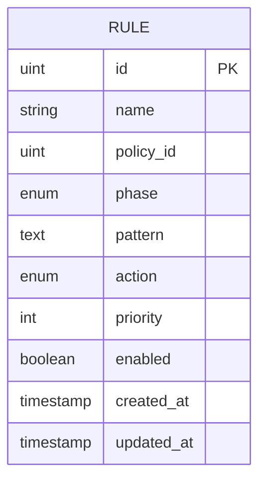
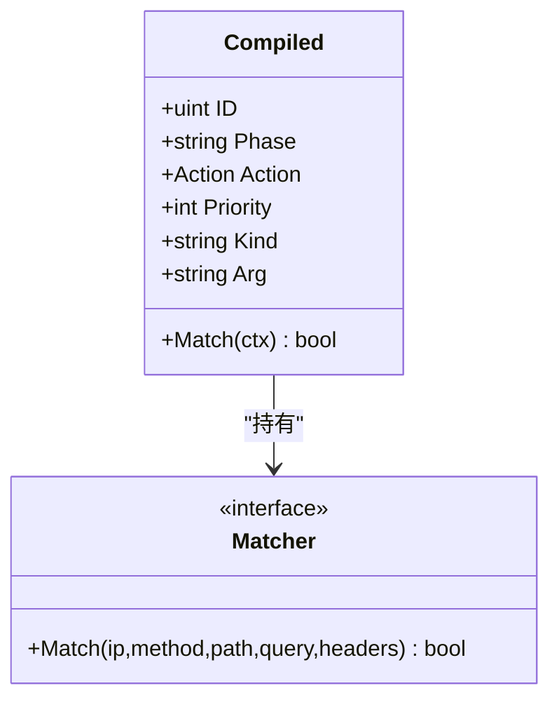
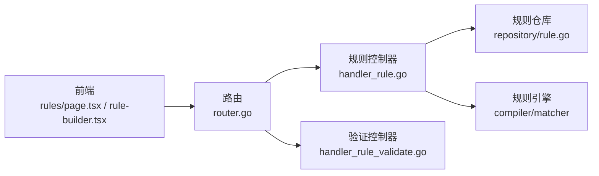

# 规则导入导出

<cite>
**本文引用的文件**
- [cmd/main.go](file://cmd/main.go)
- [internal/admin/router.go](file://internal/admin/router.go)
- [internal/admin/handler_rule.go](file://internal/admin/handler_rule.go)
- [internal/admin/handler_rule_validate.go](file://internal/admin/handler_rule_validate.go)
- [internal/store/repository/rule.go](file://internal/store/repository/rule.go)
- [internal/store/models.go](file://internal/store/models.go)
- [internal/core/rules/compiler.go](file://internal/core/rules/compiler.go)
- [internal/core/rules/matcher.go](file://internal/core/rules/matcher.go)
- [internal/observability/eventwriter.go](file://internal/observability/eventwriter.go)
- [internal/observability/archiver.go](file://internal/observability/archiver.go)
- [frontend/app/(dashboard)/rules/page.tsx](file://frontend/app/(dashboard)/rules/page.tsx)
- [frontend/components/rule-builder.tsx](file://frontend/components/rule-builder.tsx)
</cite>

## 目录
1. [简介](#简介)
2. [项目结构](#项目结构)
3. [核心组件](#核心组件)
4. [架构总览](#架构总览)
5. [详细组件分析](#详细组件分析)
6. [依赖分析](#依赖分析)
7. [性能考虑](#性能考虑)
8. [故障排查指南](#故障排查指南)
9. [结论](#结论)
10. [附录：导入导出示例与规范](#附录导入导出示例与规范)

## 简介
本文件聚焦于 OpenWAF 的“规则导入导出”能力，覆盖以下主题：
- 规则备份与完整规则集导出
- 导入流程（批量创建、重复检测与错误处理）
- 数据格式规范（字段映射、版本兼容性与迁移路径）
- 规则模板系统（预定义模板库、自定义模板创建与管理）
- 完整示例（从其他 WAF 系统迁移、跨环境配置同步）
- 数据验证规则与错误恢复机制
- 规则版本管理与配置审计

## 项目结构
OpenWAF 的规则导入导出由后端 API、存储层与前端界面协同完成。后端通过路由注册导入导出接口；存储层负责持久化；前端提供可视化规则构建器与模板库。

**图表来源**
- [internal/admin/router.go:96-164](file://internal/admin/router.go#L96-L164)
- [internal/admin/handler_rule.go:158-196](file://internal/admin/handler_rule.go#L158-L196)
- [internal/admin/handler_rule_validate.go:32-98](file://internal/admin/handler_rule_validate.go#L32-L98)
- [internal/store/repository/rule.go:9-39](file://internal/store/repository/rule.go#L9-L39)
- [internal/store/models.go:79-92](file://internal/store/models.go#L79-L92)
- [internal/core/rules/compiler.go:27-55](file://internal/core/rules/compiler.go#L27-L55)
- [internal/core/rules/matcher.go:167-261](file://internal/core/rules/matcher.go#L167-L261)

**章节来源**
- [cmd/main.go:1-10](file://cmd/main.go#L1-L10)
- [internal/admin/router.go:48-210](file://internal/admin/router.go#L48-L210)

## 核心组件
- 后端路由与控制器
  - 导出接口：GET /api/v1/rules/export
  - 导入接口：POST /api/v1/rules/import
  - 验证接口：POST /api/v1/rules/validate
  - 模板接口：GET /api/v1/rules/templates
- 存储层
  - 规则仓库 RuleRepo 提供 List/Create/Update/Delete 等操作
  - 规则模型 Rule 定义字段与枚举值
- 规则引擎
  - 编译器 Compile 将规则模型转换为运行时可匹配的 Compiled 切片
  - 匹配器 buildMatcher 根据 kind:arg 构建具体匹配逻辑
- 前端
  - 规则页面展示与 CRUD
  - 规则构建器提供可视化与高级 DSL 输入，并调用验证接口

**章节来源**
- [internal/admin/router.go:96-164](file://internal/admin/router.go#L96-L164)
- [internal/admin/handler_rule.go:158-196](file://internal/admin/handler_rule.go#L158-L196)
- [internal/admin/handler_rule_validate.go:100-200](file://internal/admin/handler_rule_validate.go#L100-L200)
- [internal/store/repository/rule.go:9-39](file://internal/store/repository/rule.go#L9-L39)
- [internal/store/models.go:44-92](file://internal/store/models.go#L44-L92)
- [internal/core/rules/compiler.go:27-55](file://internal/core/rules/compiler.go#L27-L55)
- [internal/core/rules/matcher.go:167-261](file://internal/core/rules/matcher.go#L167-L261)
- [frontend/app/(dashboard)/rules/page.tsx:1-40](file://frontend/app/(dashboard)/rules/page.tsx#L1-L40)
- [frontend/components/rule-builder.tsx:208-226](file://frontend/components/rule-builder.tsx#L208-L226)

## 架构总览
规则导入导出的端到端流程如下：

**图表来源**
- [internal/admin/router.go:96-164](file://internal/admin/router.go#L96-L164)
- [internal/admin/handler_rule.go:158-196](file://internal/admin/handler_rule.go#L158-L196)
- [internal/store/repository/rule.go:13-39](file://internal/store/repository/rule.go#L13-L39)
- [internal/core/rules/compiler.go:27-55](file://internal/core/rules/compiler.go#L27-L55)

## 详细组件分析

### 组件一：规则导出（ExportRules）
- 功能要点
  - 列出所有规则并以 JSON 数组返回，便于备份与迁移
  - 使用较大的分页上限以确保完整导出
- 输出结构
  - 外层对象包含键 rules，其值为规则数组
  - 数组中每个元素对应一个 Rule 模型实例
- 典型用途
  - 定期全量备份
  - 跨环境配置同步
  - 迁移至其他 WAF 系统前的数据准备

**图表来源**
- [internal/admin/handler_rule.go:158-167](file://internal/admin/handler_rule.go#L158-L167)
- [internal/store/repository/rule.go:13-23](file://internal/store/repository/rule.go#L13-L23)

**章节来源**
- [internal/admin/handler_rule.go:158-167](file://internal/admin/handler_rule.go#L158-L167)
- [internal/store/repository/rule.go:13-23](file://internal/store/repository/rule.go#L13-L23)

### 组件二：规则导入（ImportRules）
- 功能要点
  - 接收 JSON 请求体，包含键 rules 的数组
  - 对每个规则执行 Create 操作，ID 设为 0 以强制生成新 ID
  - 统计成功导入数量并返回结果
- 错误处理
  - 请求体解析失败返回 400
  - 未提供规则数组返回 400
  - 单条规则插入失败不影响整体流程（继续下一个）
  - 最终触发重载以使新规则生效
- 并发与性能
  - 逐条插入，适合批量导入
  - 可结合前端分批上传以控制单次导入规模

**图表来源**
- [internal/admin/handler_rule.go:170-196](file://internal/admin/handler_rule.go#L170-L196)
- [internal/store/repository/rule.go:35](file://internal/store/repository/rule.go#L35)

**章节来源**
- [internal/admin/handler_rule.go:170-196](file://internal/admin/handler_rule.go#L170-L196)
- [internal/store/repository/rule.go:35](file://internal/store/repository/rule.go#L35)

### 组件三：规则验证（ValidateRule）
- 功能要点
  - 校验规则 DSL 或复合 JSON 条件
  - 返回是否有效、kind、arg 以及错误详情
- 复合规则校验
  - 校验 JSON 结构与运算符（and/or/not）
  - 校验 children 数组存在性
- 前端集成
  - 规则构建器在用户输入时调用此接口进行实时校验

**图表来源**
- [internal/admin/handler_rule_validate.go:32-98](file://internal/admin/handler_rule_validate.go#L32-L98)
- [internal/core/rules/compiler.go:57-82](file://internal/core/rules/compiler.go#L57-L82)

**章节来源**
- [internal/admin/handler_rule_validate.go:32-98](file://internal/admin/handler_rule_validate.go#L32-L98)
- [internal/core/rules/compiler.go:57-82](file://internal/core/rules/compiler.go#L57-L82)

### 组件四：规则模板（GetRuleTemplates）
- 功能要点
  - 提供一组预定义规则模板，涵盖常见场景（IP、路径、查询、头、方法、内容类型、UA、复合条件等）
  - 支持前端快速选择与复制使用
- 自定义模板
  - 可基于现有模板扩展，或通过导入接口批量添加

**图表来源**
- [internal/admin/handler_rule_validate.go:100-200](file://internal/admin/handler_rule_validate.go#L100-L200)

**章节来源**
- [internal/admin/handler_rule_validate.go:100-200](file://internal/admin/handler_rule_validate.go#L100-L200)

### 组件五：规则模型与字段映射
- 关键字段
  - id、name、policy_id、phase、pattern、action、priority、enabled
- 枚举与规范化
  - phase：acl、rate_limit、owasp_default、signature、custom
  - action：allow、intercept、observe、drop、legacy block/log_only 已规范化
- 字段约束
  - priority 默认 100，启用排序
  - enabled 默认 true

**图表来源**
- [internal/store/models.go:44-92](file://internal/store/models.go#L44-L92)

**章节来源**
- [internal/store/models.go:44-92](file://internal/store/models.go#L44-L92)

### 组件六：规则编译与匹配
- 编译过程
  - Compile 将启用的规则按 priority 与 id 排序，生成 Compiled 列表
  - ParsePattern 解析 DSL 前缀或复合 JSON
- 匹配器
  - buildMatcher 根据 kind:arg 构建具体匹配器（IP、路径、正则、头、方法、内容类型、UA、body、参数、复合）
  - 复合条件支持 and/or/not 递归组合

**图表来源**
- [internal/core/rules/compiler.go:11-55](file://internal/core/rules/compiler.go#L11-L55)
- [internal/core/rules/matcher.go:11-14](file://internal/core/rules/matcher.go#L11-L14)

**章节来源**
- [internal/core/rules/compiler.go:11-55](file://internal/core/rules/compiler.go#L11-L55)
- [internal/core/rules/matcher.go:167-261](file://internal/core/rules/matcher.go#L167-L261)

## 依赖分析
- 路由到控制器
  - /api/v1/rules/export → ExportRules
  - /api/v1/rules/import → ImportRules
  - /api/v1/rules/validate → ValidateRule
  - /api/v1/rules/templates → GetRuleTemplates
- 控制器到存储
  - ExportRules/ImportRules/GetRule/UpdateRule/DeleteRule → RuleRepo
- 控制器到引擎
  - ImportRules/ExportRules → 触发重载（reload）
  - TestRule → Compile/Match
- 前端到后端
  - 规则页面与构建器通过 /api/v1/rules* 与后端交互

**图表来源**
- [internal/admin/router.go:96-164](file://internal/admin/router.go#L96-L164)
- [internal/admin/handler_rule.go:158-196](file://internal/admin/handler_rule.go#L158-L196)
- [internal/admin/handler_rule_validate.go:32-98](file://internal/admin/handler_rule_validate.go#L32-L98)
- [internal/store/repository/rule.go:9-39](file://internal/store/repository/rule.go#L9-L39)
- [internal/core/rules/compiler.go:27-55](file://internal/core/rules/compiler.go#L27-L55)
- [internal/core/rules/matcher.go:167-261](file://internal/core/rules/matcher.go#L167-L261)

**章节来源**
- [internal/admin/router.go:96-164](file://internal/admin/router.go#L96-L164)

## 性能考虑
- 导出性能
  - 导出接口使用较大分页上限，确保一次性导出全部规则，避免多次往返
- 导入性能
  - 导入采用逐条插入，适合批量导入；如需更高吞吐，可在前端分批上传或后端引入事务批量插入
- 规则编译
  - 编译时按 priority/id 排序，匹配时优先级稳定；正则表达式使用缓存减少重复编译开销
- 事件写入
  - 安全事件写入采用异步缓冲与批处理，避免阻塞热路径

**章节来源**
- [internal/admin/handler_rule.go:158-167](file://internal/admin/handler_rule.go#L158-L167)
- [internal/admin/handler_rule.go:170-196](file://internal/admin/handler_rule.go#L170-L196)
- [internal/core/rules/matcher.go:278-296](file://internal/core/rules/matcher.go#L278-L296)
- [internal/observability/eventwriter.go:27-93](file://internal/observability/eventwriter.go#L27-L93)

## 故障排查指南
- 导入失败
  - 检查请求体是否为合法 JSON，且包含 rules 数组
  - 若部分规则导入失败，其余规则仍会成功导入；可检查日志定位失败原因
- 导出不完整
  - 确认网络与权限；若规则量很大，建议分页导出或离线备份
- 规则验证失败
  - 使用 /api/v1/rules/validate 获取具体错误信息
  - 复合规则需满足 JSON 结构与运算符要求
- 规则不生效
  - 导入后需触发重载；确认 reload 已执行
- 事件积压
  - 查看事件写入缓冲区状态与批处理间隔；必要时调整批次大小与刷新频率

**章节来源**
- [internal/admin/handler_rule.go:170-196](file://internal/admin/handler_rule.go#L170-L196)
- [internal/admin/handler_rule_validate.go:32-98](file://internal/admin/handler_rule_validate.go#L32-L98)
- [internal/observability/eventwriter.go:27-93](file://internal/observability/eventwriter.go#L27-L93)

## 结论
OpenWAF 的规则导入导出功能以简洁的 JSON 格式为核心，配合完善的验证与模板系统，实现了从备份、迁移、同步到批量部署的全链路能力。通过编译与匹配器的解耦设计，系统在保证灵活性的同时兼顾了性能与稳定性。建议在生产环境中结合分批导入、重载策略与事件归档，确保变更可控与可观测。

## 附录：导入导出示例与规范

### 数据格式规范
- 导出格式
  - 外层对象包含键 rules，其值为规则数组
  - 每个规则对象包含字段：id、name、policy_id、phase、pattern、action、priority、enabled、created_at、updated_at
- 导入格式
  - 请求体为 JSON 对象，包含键 rules，其值为规则数组
  - 导入时将每条规则的 id 置为 0，以创建新记录
- 版本兼容性
  - action 字段支持 legacy 值（block、log_only），系统会自动规范化
  - phase 支持新增 custom 等阶段
- 迁移路径
  - 从其他 WAF 系统迁移时，需将目标系统的规则 DSL 映射到本系统的 pattern 语法
  - 复合规则需转换为 JSON 结构并满足运算符与 children 要求

**章节来源**
- [internal/admin/handler_rule.go:158-167](file://internal/admin/handler_rule.go#L158-L167)
- [internal/admin/handler_rule.go:170-196](file://internal/admin/handler_rule.go#L170-L196)
- [internal/store/models.go:56-77](file://internal/store/models.go#L56-L77)
- [internal/admin/handler_rule_validate.go:59-89](file://internal/admin/handler_rule_validate.go#L59-L89)

### 规则模板系统
- 预定义模板
  - IP 过滤、路径过滤、查询过滤、头过滤、方法过滤、内容类型过滤、User-Agent 过滤、复合规则等
- 自定义模板
  - 基于现有模板扩展，或通过导入接口批量添加
- 模板管理
  - 通过 /api/v1/rules/templates 获取模板库，前端可直接选择使用

**章节来源**
- [internal/admin/handler_rule_validate.go:100-200](file://internal/admin/handler_rule_validate.go#L100-L200)
- [frontend/components/rule-builder.tsx:208-226](file://frontend/components/rule-builder.tsx#L208-L226)

### 完整导入导出示例
- 从其他 WAF 系统迁移
  - 步骤
    1) 在源系统导出规则清单
    2) 将规则 DSL 映射到本系统 pattern 语法
    3) 准备 JSON 文件，包含 rules 数组
    4) 通过 /api/v1/rules/import 批量导入
    5) 使用 /api/v1/rules/validate 校验关键规则
    6) 触发重载并验证效果
- 跨环境配置同步
  - 步骤
    1) 在生产环境执行 /api/v1/rules/export 导出完整规则集
    2) 将导出文件作为基线版本保存
    3) 在开发/测试环境执行 /api/v1/rules/import 导入
    4) 通过 /api/v1/rules/templates 快速补充常用模板
    5) 触发重载并进行回归测试

**章节来源**
- [internal/admin/router.go:96-164](file://internal/admin/router.go#L96-L164)
- [internal/admin/handler_rule.go:158-196](file://internal/admin/handler_rule.go#L158-L196)
- [internal/admin/handler_rule_validate.go:100-200](file://internal/admin/handler_rule_validate.go#L100-L200)

### 数据验证规则与错误恢复
- 验证规则
  - 非空校验、DSL 前缀校验、复合规则 JSON 结构校验、运算符合法性校验
- 错误恢复
  - 导入失败的单条规则不会影响整体流程，可单独修复后重新导入
  - 导出失败时检查网络与权限，必要时分页导出
  - 规则不生效时检查重载是否执行

**章节来源**
- [internal/admin/handler_rule_validate.go:32-98](file://internal/admin/handler_rule_validate.go#L32-L98)
- [internal/admin/handler_rule.go:170-196](file://internal/admin/handler_rule.go#L170-L196)

### 规则版本管理与配置审计
- 版本管理
  - 规则模型包含 created_at/updated_at 时间戳，可用于追踪变更
  - 建议在导入前后记录快照，以便回滚
- 配置审计
  - 安全事件写入采用异步批处理，支持事件归档与保留策略
  - 可通过事件统计接口查看规则命中情况，辅助审计

**章节来源**
- [internal/store/models.go:79-92](file://internal/store/models.go#L79-L92)
- [internal/observability/eventwriter.go:27-93](file://internal/observability/eventwriter.go#L27-L93)
- [internal/observability/archiver.go:21-71](file://internal/observability/archiver.go#L21-L71)