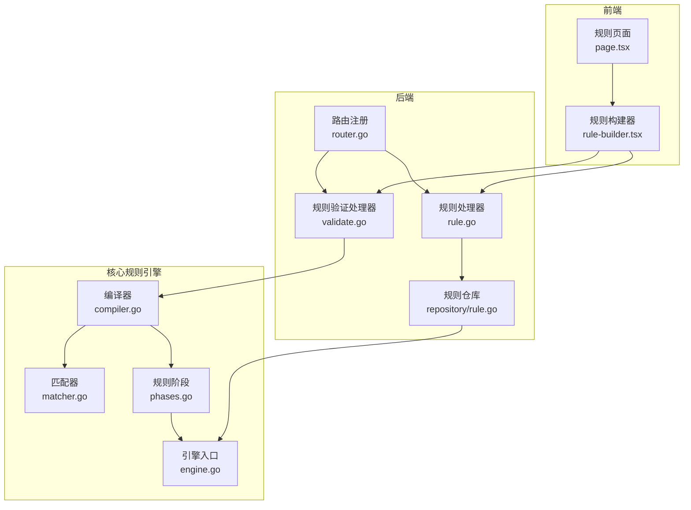
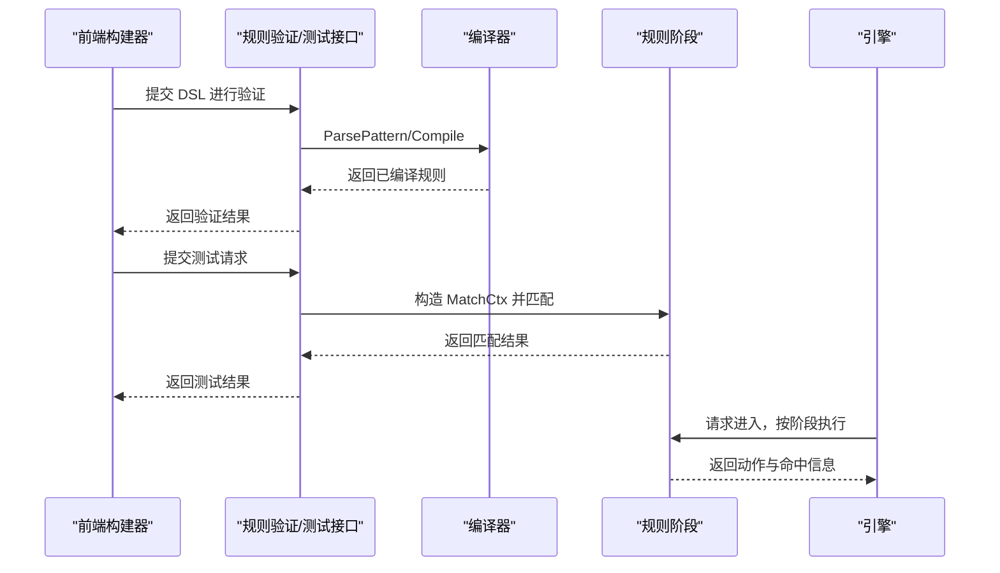
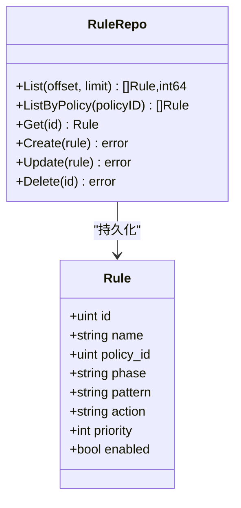
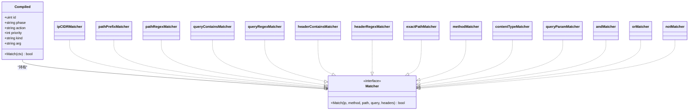
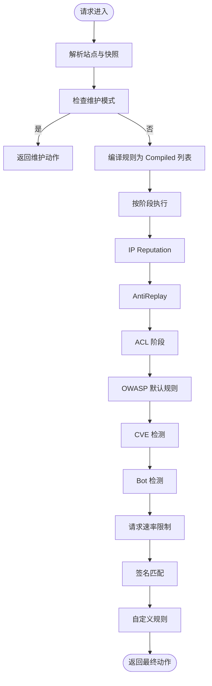
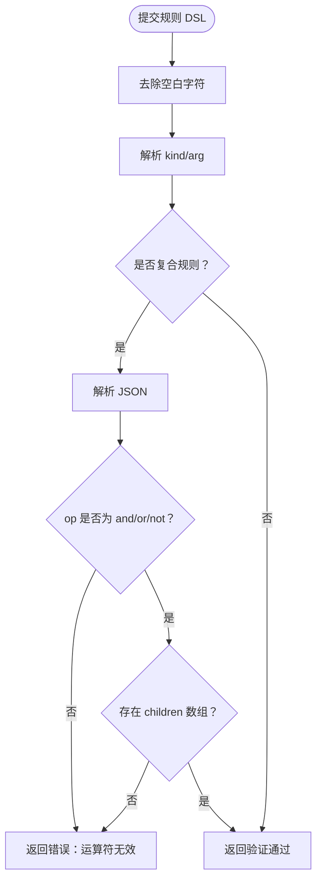
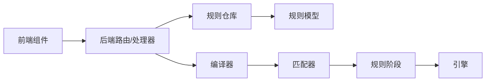
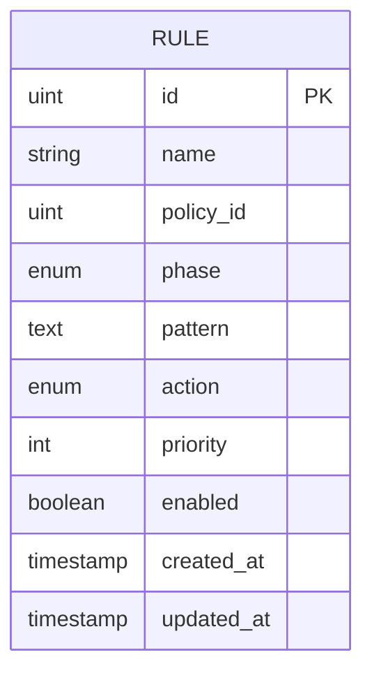
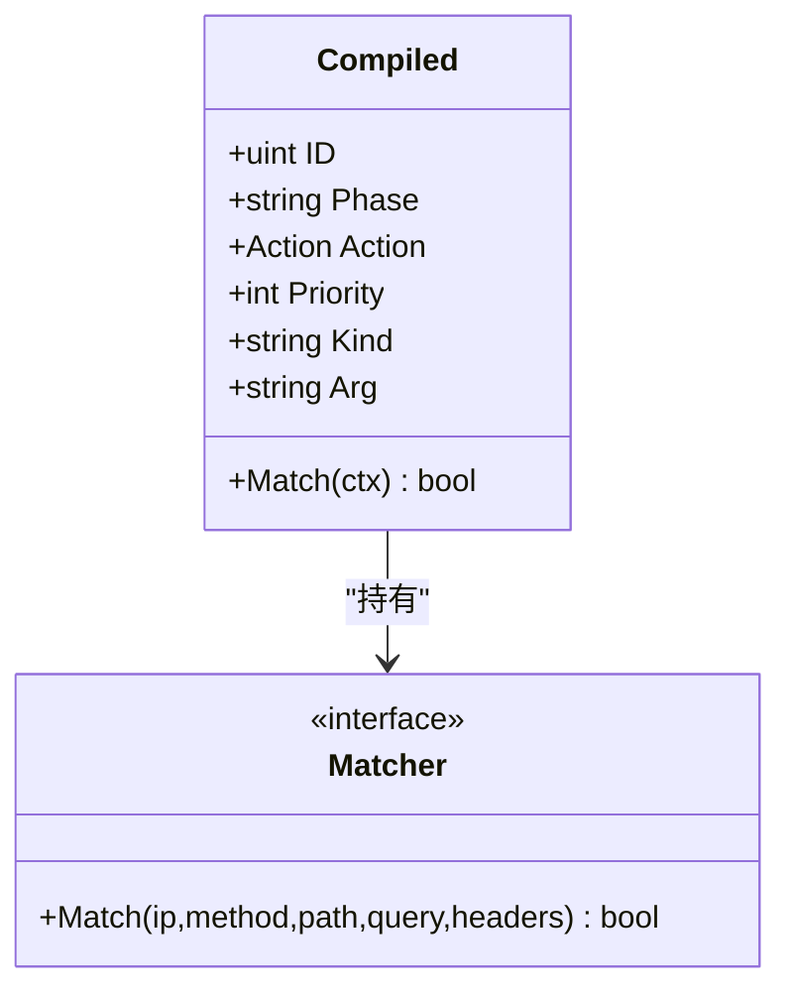

# 规则管理 API

<cite>
**本文档引用的文件**
- [规则管理 API.md](file://docs/管理 API 系统/规则管理 API/规则管理 API.md)
- [规则 CRUD 操作.md](file://docs/管理 API 系统/规则管理 API/规则 CRUD 操作.md)
- [规则导入导出.md](file://docs/管理 API 系统/规则管理 API/规则导入导出.md)
- [规则验证与测试.md](file://docs/管理 API 系统/规则管理 API/规则验证与测试.md)
- [rule.go](file://internal/admin/rule/rule.go)
- [validate.go](file://internal/admin/rule/validate.go)
- [router.go](file://internal/admin/router.go)
- [rule.go](file://internal/store/repository/rule.go)
- [compiler.go](file://internal/core/rules/compiler.go)
- [matcher.go](file://internal/core/rules/matcher.go)
- [phases.go](file://internal/core/rules/phases.go)
- [engine.go](file://internal/core/engine/engine.go)
- [rule-builder.tsx](file://frontend/components/rule-builder.tsx)
- [page.tsx](file://frontend/app/(dashboard)/rules/page.tsx)
</cite>

## 目录
1. [简介](#简介)
2. [项目结构](#项目结构)
3. [核心组件](#核心组件)
4. [架构总览](#架构总览)
5. [详细组件分析](#详细组件分析)
6. [依赖关系分析](#依赖关系分析)
7. [性能考量](#性能考量)
8. [故障排查指南](#故障排查指南)
9. [结论](#结论)
10. [附录](#附录)

## 简介
本文件面向规则管理 API 的使用者与维护者，系统性阐述规则系统的架构设计、规则语法、匹配引擎与执行流程，覆盖规则的增删改查、验证、测试、导入导出、模板系统以及前端可视化构建器。文档同时提供调试与性能分析方法，帮助快速定位问题并优化规则效果。

## 项目结构
规则管理 API 由后端路由与处理器、规则编译与匹配引擎、存储仓库层以及前端可视化构建器组成。后端通过 Hertz 路由暴露 REST 接口；规则 DSL 解析与编译在核心规则包中完成；存储层负责规则的持久化；前端提供可视化规则构建器与表格页面。

图表来源
- [router.go:48-210](file://internal/admin/router.go#L48-L210)
- [rule.go:16-197](file://internal/admin/rule/rule.go#L16-L197)
- [validate.go:32-98](file://internal/admin/rule/validate.go#L32-L98)
- [rule.go:9-40](file://internal/store/repository/rule.go#L9-L40)
- [compiler.go:27-55](file://internal/core/rules/compiler.go#L27-L55)
- [matcher.go:167-261](file://internal/core/rules/matcher.go#L167-L261)
- [phases.go:34-94](file://internal/core/rules/phases.go#L34-L94)
- [engine.go:57-129](file://internal/core/engine/engine.go#L57-L129)

章节来源
- [router.go:48-210](file://internal/admin/router.go#L48-L210)
- [rule.go:16-197](file://internal/admin/rule/rule.go#L16-L197)
- [validate.go:32-98](file://internal/admin/rule/validate.go#L32-L98)
- [rule.go:9-40](file://internal/store/repository/rule.go#L9-L40)
- [compiler.go:27-55](file://internal/core/rules/compiler.go#L27-L55)
- [matcher.go:167-261](file://internal/core/rules/matcher.go#L167-L261)
- [phases.go:34-94](file://internal/core/rules/phases.go#L34-L94)
- [engine.go:57-129](file://internal/core/engine/engine.go#L57-L129)

## 核心组件
- 后端路由与处理器：提供规则列表、详情、创建、更新、删除、测试、验证、导入导出等接口。
- 规则模型与仓库：定义规则数据结构与数据库访问层。
- 规则编译与匹配：解析 DSL、构建匹配器、排序执行。
- 规则阶段：将规则按阶段组织，驱动引擎流水线。
- 引擎入口：整合站点解析、阶段执行与结果汇总。
- 前端构建器：可视化构建规则、语法验证、本地测试与 DSL 预览。

章节来源
- [rule.go:16-197](file://internal/admin/rule/rule.go#L16-L197)
- [validate.go:32-98](file://internal/admin/rule/validate.go#L32-L98)
- [rule.go:9-40](file://internal/store/repository/rule.go#L9-L40)
- [compiler.go:27-55](file://internal/core/rules/compiler.go#L27-L55)
- [matcher.go:167-261](file://internal/core/rules/matcher.go#L167-L261)
- [phases.go:34-94](file://internal/core/rules/phases.go#L34-L94)
- [engine.go:57-129](file://internal/core/engine/engine.go#L57-L129)
- [rule-builder.tsx:114-556](file://frontend/components/rule-builder.tsx#L114-L556)
- [page.tsx:5-76](file://frontend/app/(dashboard)/rules/page.tsx#L5-L76)

## 架构总览
规则从"DSL 文本"到"运行时匹配"的完整链路如下：
- 前端规则构建器生成 DSL（简单或复合 JSON），并通过验证接口进行语法检查。
- 后端处理器接收请求，调用编译器将规则转换为可执行的 Compiled 结构，并按优先级排序。
- 执行阶段根据请求上下文（客户端 IP、方法、路径、查询、头部）逐个匹配规则。
- 引擎将规则阶段串联为流水线；ACL 阶段的 allow 可短路后续阶段，最终返回动作。

图表来源
- [validate.go:32-98](file://internal/admin/rule/validate.go#L32-L98)
- [rule.go:115-156](file://internal/admin/rule/rule.go#L115-L156)
- [compiler.go:27-55](file://internal/core/rules/compiler.go#L27-L55)
- [matcher.go:167-261](file://internal/core/rules/matcher.go#L167-L261)
- [phases.go:34-94](file://internal/core/rules/phases.go#L34-L94)
- [engine.go:57-129](file://internal/core/engine/engine.go#L57-L129)

## 详细组件分析

### 规则模型与仓库
- 规则模型包含名称、策略 ID、阶段、模式（DSL）、动作、优先级、启用状态等字段。
- 仓库提供分页列表、按策略过滤、获取、创建、更新、删除等操作，并按优先级与 ID 排序。

图表来源
- [rule.go:13-39](file://internal/store/repository/rule.go#L13-L39)

章节来源
- [rule.go:13-39](file://internal/store/repository/rule.go#L13-L39)

### 规则语法与 DSL
- 支持两类规则：
  - 简单规则：kind:arg 形式，如 block_ip:192.168.1.0/24、block_path:/admin、block_user_agent_regex:.*bot.*
  - 复合规则：JSON 格式 {"op":"and|or|not","children":[{...}]}
- 解析器会识别 kind 与 arg，并对复合规则进行结构校验（op、children）。

章节来源
- [compiler.go:57-82](file://internal/core/rules/compiler.go#L57-L82)
- [validate.go:32-98](file://internal/admin/rule/validate.go#L32-L98)

### 编译与匹配引擎
- 编译器将规则转换为 Compiled 结构，构建具体匹配器（如 IP CIDR、路径前缀/正则、查询包含/正则、请求头包含/正则、精确路径、方法、内容类型、查询参数等），并按优先级排序。
- 匹配器采用缓存正则编译，避免重复开销。
- 复合规则通过 and/or/not 组合子规则，支持递归嵌套。

图表来源
- [compiler.go:11-55](file://internal/core/rules/compiler.go#L11-L55)
- [matcher.go:11-261](file://internal/core/rules/matcher.go#L11-L261)

章节来源
- [compiler.go:11-55](file://internal/core/rules/compiler.go#L11-L55)
- [matcher.go:11-261](file://internal/core/rules/matcher.go#L11-L261)

### 规则阶段与执行流程
- 运行时阶段按代码装配顺序执行：IP Reputation → AntiReplay → ACL → OWASP → CVE → Bot → 请求速率限制 → 签名 → 自定义；缺少对应管理器或关闭配置时跳过相关阶段。
- ACL 阶段允许（allow）可短路跳过后续阶段；其他阶段按顺序匹配并返回动作。
- 引擎将规则转换为 Compiled 并注入对应阶段，最终输出动作与命中信息。

图表来源
- [engine.go:57-129](file://internal/core/engine/engine.go#L57-L129)
- [phases.go:34-94](file://internal/core/rules/phases.go#L34-L94)

章节来源
- [engine.go:57-129](file://internal/core/engine/engine.go#L57-L129)
- [phases.go:34-94](file://internal/core/rules/phases.go#L34-L94)

### 规则 CRUD 与 API
- 列表与详情：GET /api/v1/rules、GET /api/v1/rules/:id
- 创建：POST /api/v1/rules
- 更新：POST /api/v1/rules/:id/update
- 删除：POST /api/v1/rules/:id/delete
- 导入：POST /api/v1/rules/import
- 导出：GET /api/v1/rules/export
- 验证：POST /api/v1/rules/validate
- 测试：POST /api/v1/rules/test

章节来源
- [router.go:97-165](file://internal/admin/router.go#L97-L165)
- [rule.go:16-197](file://internal/admin/rule/rule.go#L16-L197)

### 规则验证机制
- 语法检查：ParsePattern 识别 kind/arg，复合规则校验 JSON 结构与运算符。
- 逻辑验证：对非法正则、无效 IP/CIDR 等场景返回错误信息。
- 性能评估：编译器对正则进行缓存，匹配器按优先级排序，减少不必要的匹配。

图表来源
- [validate.go:32-98](file://internal/admin/rule/validate.go#L32-L98)
- [compiler.go:57-82](file://internal/core/rules/compiler.go#L57-L82)

章节来源
- [validate.go:32-98](file://internal/admin/rule/validate.go#L32-L98)
- [compiler.go:57-82](file://internal/core/rules/compiler.go#L57-L82)

### 规则模板系统
- 内置模板：提供常见规则模板（IP 封禁/放行、路径匹配、查询匹配、请求头匹配、方法/内容类型/用户代理匹配、复合规则 AND/OR）。
- 使用方式：前端规则页面可加载模板列表，便于快速选择与修改。

章节来源
- [validate.go:100-200](file://internal/admin/rule/validate.go#L100-L200)
- [page.tsx:5-76](file://frontend/app/(dashboard)/rules/page.tsx#L5-L76)

### 规则导入导出
- 导出：GET /api/v1/rules/export 返回所有规则数组，用于备份与迁移。
- 导入：POST /api/v1/rules/import 接收规则数组，批量创建并触发重载。

章节来源
- [rule.go:158-196](file://internal/admin/rule/rule.go#L158-L196)

### 规则调试与测试
- 在线验证：POST /api/v1/rules/validate 对规则进行语法与结构验证。
- 在线测试：POST /api/v1/rules/test 提供合成请求（路径、方法、IP、头部、查询）进行快速匹配测试。
- 前端本地测试：规则构建器内置简单测试逻辑，支持基本规则类型的即时反馈。

章节来源
- [validate.go:32-98](file://internal/admin/rule/validate.go#L32-L98)
- [rule.go:115-156](file://internal/admin/rule/rule.go#L115-L156)
- [rule-builder.tsx:208-293](file://frontend/components/rule-builder.tsx#L208-L293)

### 前端规则构建器
- 可视化模式：支持简单规则与复合规则（AND/OR/NOT）的图形化构建。
- 高级模式：直接编辑 DSL（kind:arg 或 JSON）。
- 语法验证与测试：集成后端验证与测试接口，实时反馈。
- 表格页面：规则列表页集成构建器，支持字段渲染与友好展示。

章节来源
- [rule-builder.tsx:114-556](file://frontend/components/rule-builder.tsx#L114-L556)
- [page.tsx:5-76](file://frontend/app/(dashboard)/rules/page.tsx#L5-L76)

## 依赖关系分析

图表来源
- [router.go:48-210](file://internal/admin/router.go#L48-L210)
- [rule.go:16-197](file://internal/admin/rule/rule.go#L16-L197)
- [rule.go:9-40](file://internal/store/repository/rule.go#L9-L40)
- [compiler.go:27-55](file://internal/core/rules/compiler.go#L27-L55)
- [matcher.go:167-261](file://internal/core/rules/matcher.go#L167-L261)
- [phases.go:34-94](file://internal/core/rules/phases.go#L34-L94)
- [engine.go:57-129](file://internal/core/engine/engine.go#L57-L129)

章节来源
- [router.go:48-210](file://internal/admin/router.go#L48-L210)
- [rule.go:16-197](file://internal/admin/rule/rule.go#L16-L197)
- [rule.go:9-40](file://internal/store/repository/rule.go#L9-L40)
- [compiler.go:27-55](file://internal/core/rules/compiler.go#L27-L55)
- [matcher.go:167-261](file://internal/core/rules/matcher.go#L167-L261)
- [phases.go:34-94](file://internal/core/rules/phases.go#L34-L94)
- [engine.go:57-129](file://internal/core/engine/engine.go#L57-L129)

## 性能考量
- 正则缓存：匹配器对正则表达式进行缓存，避免重复编译带来的性能损耗。
- 优先级排序：规则按优先级与 ID 排序；ACL allow 动作可短路后续阶段，减少后续匹配成本。
- 复合规则：合理使用 AND/OR/NOT，避免过深嵌套导致匹配复杂度上升。
- 速率限制与维护模式：在早期阶段短路，降低后续阶段压力。
- 建议：对高频正则与复杂条件进行基准测试，必要时拆分为多条规则以提升可读性与性能。

章节来源
- [matcher.go:278-296](file://internal/core/rules/matcher.go#L278-L296)
- [compiler.go:48-54](file://internal/core/rules/compiler.go#L48-L54)
- [engine.go:88-120](file://internal/core/engine/engine.go#L88-L120)

## 故障排查指南
- 规则验证失败
  - 现象：POST /api/v1/rules/validate 返回错误。
  - 排查：确认 DSL 格式是否为 kind:arg 或合法 JSON；复合规则的 op 是否为 and/or/not；children 是否存在。
- 规则测试不匹配
  - 现象：POST /api/v1/rules/test 返回未命中。
  - 排查：核对测试请求中的路径、方法、IP、头部、查询参数是否符合预期；正则表达式是否正确。
- 导入失败
  - 现象：POST /api/v1/rules/import 返回 400 或 500。
  - 排查：检查规则数组中每条规则的 phase、pattern、action 与优先级是否有效；导入是整体事务语义，任一规则无效或优先级冲突都不会创建新规则。
- 规则未生效
  - 现象：规则创建/更新后未生效。
  - 排查：确认是否触发了重载；规则优先级是否过高导致被更早规则覆盖；阶段设置是否正确。

章节来源
- [validate.go:32-98](file://internal/admin/rule/validate.go#L32-L98)
- [rule.go:115-156](file://internal/admin/rule/rule.go#L115-L156)
- [rule.go:171-196](file://internal/admin/rule/rule.go#L171-L196)

## 结论
规则管理 API 通过清晰的 DSL 语法、严谨的编译与匹配流程、完善的验证与测试能力，以及可视化的前端构建器，提供了高效、易用、可扩展的规则治理方案。结合阶段化执行与性能优化策略，可在保障安全的同时维持良好的系统性能。

## 附录

### API 定义概览
- 获取规则列表：GET /api/v1/rules
- 获取规则详情：GET /api/v1/rules/:id
- 创建规则：POST /api/v1/rules
- 更新规则：POST /api/v1/rules/:id/update
- 删除规则：POST /api/v1/rules/:id/delete
- 验证规则：POST /api/v1/rules/validate
- 测试规则：POST /api/v1/rules/test
- 导出规则：GET /api/v1/rules/export
- 导入规则：POST /api/v1/rules/import

章节来源
- [router.go:97-165](file://internal/admin/router.go#L97-L165)

### 规则 CRUD 操作详细规范

#### 创建规则 (Create Rule)
- HTTP 方法：POST
- URL 路径：/api/v1/rules
- 认证要求：需要有效令牌
- RBAC 权限：admin, operator
- 请求参数：完整的规则对象（name、policy_id、phase、pattern、action、priority、enabled）
- 成功响应：201 Created，返回创建的规则对象
- 错误响应：400 Bad Request（请求参数无效或格式不正确）、500 Internal Server Error（服务器内部错误）

#### 读取规则 (Get Rule)
- HTTP 方法：GET
- URL 路径：/api/v1/rules/:id
- 参数：id: 规则 ID (路径参数)
- 认证要求：需要有效令牌
- RBAC 权限：admin, operator, readonly
- 成功响应：200 OK，返回规则对象
- 错误响应：400 Bad Request（invalid id）、404 Not Found（not found）

#### 更新规则 (Update Rule)
- HTTP 方法：POST
- URL 路径：/api/v1/rules/:id/update
- 参数：id: 规则 ID (路径参数)
- 认证要求：需要有效令牌
- RBAC 权限：admin, operator
- 请求参数：规则对象（可包含任意字段）
- 成功响应：200 OK，返回更新后的规则对象
- 错误响应：400 Bad Request（invalid id 或 JSON 绑定错误）、404 Not Found（not found）、500 Internal Server Error（服务器内部错误）

#### 删除规则 (Delete Rule)
- HTTP 方法：POST
- URL 路径：/api/v1/rules/:id/delete
- 参数：id: 规则 ID (路径参数)
- 认证要求：需要有效令牌
- RBAC 权限：admin, operator
- 成功响应：204 No Content
- 错误响应：400 Bad Request（invalid id）、500 Internal Server Error（服务器内部错误）

#### 分页查询 (List Rules)
- HTTP 方法：GET
- URL 路径：/api/v1/rules
- 认证要求：需要有效令牌
- RBAC 权限：admin, operator, readonly
- 查询参数：page（页码，默认值：1）、page_size（页面大小，默认值：20，最小值：1，最大值：200）
- 成功响应：200 OK，返回 {items: [], total: 0}
- 错误响应：500 Internal Server Error（服务器内部错误）

#### 规则验证 (Validate Rule)
- HTTP 方法：POST
- URL 路径：/api/v1/rules/validate
- 认证要求：需要有效令牌
- RBAC 权限：admin, operator
- 请求参数：{pattern: 规则模式 DSL}
- 成功响应：200 OK，返回 {valid: true, message: "pattern is valid", kind: "block_ip", arg: "192.168.1.100"}
- 错误响应：400 Bad Request（pattern 无法解析）

#### 规则测试 (Test Rule)
- HTTP 方法：POST
- URL 路径：/api/v1/rules/test
- 认证要求：需要有效令牌
- RBAC 权限：admin, operator
- 请求参数：{pattern: 规则模式 DSL, client_ip: 客户端 IP 地址, path: 请求路径, query: 查询参数, headers: 请求头映射}
- 成功响应：200 OK，返回 {matched: true, kind: "block_ip", arg: "192.168.1.100"}
- 错误响应：400 Bad Request（invalid pattern）

#### 规则导入 (Import Rules)
- HTTP 方法：POST
- URL 路径：/api/v1/rules/import
- 认证要求：需要有效令牌
- RBAC 权限：admin, operator
- 请求参数：{rules: 规则数组}
- 成功响应：200 OK，返回 {imported: 100, total: 100}
- 错误响应：400 Bad Request（请求体解析失败或无规则提供）、500 Internal Server Error（导入失败）

#### 规则导出 (Export Rules)
- HTTP 方法：GET
- URL 路径：/api/v1/rules/export
- 认证要求：需要有效令牌
- RBAC 权限：admin, operator, readonly
- 成功响应：200 OK，返回 {rules: []}
- 错误响应：500 Internal Server Error（服务器内部错误）

章节来源
- [rule.go:16-197](file://internal/admin/rule/rule.go#L16-L197)
- [validate.go:32-98](file://internal/admin/rule/validate.go#L32-L98)

### 规则模型与字段映射
- 关键字段
  - id、name、policy_id、phase、pattern、action、priority、enabled
- 枚举与规范化
  - 可通过规则 CRUD 与导入接口保存的 phase：acl、signature、custom
  - 模型枚举中的 rate_limit、owasp_default 属于内置/配置驱动阶段，不通过自定义规则 CRUD 创建
  - 可持久化 action：allow、intercept、observe、drop、challenge、captcha_challenge、shield_challenge、chain_challenge、redirect、rate_limit
  - allow 仅允许用于 acl 阶段；tag 不支持持久化规则
  - legacy block/log_only 会规范化为 intercept/observe
- 字段约束
  - priority 默认 100，启用排序
  - enabled 默认 true

图表来源
- [rule.go:13-39](file://internal/store/repository/rule.go#L13-L39)

章节来源
- [rule.go:13-39](file://internal/store/repository/rule.go#L13-L39)

### 规则编译与匹配
- 编译过程
  - Compile 将启用的规则按 priority 与 id 排序，生成 Compiled 列表
  - ParsePattern 解析 DSL 前缀或复合 JSON
- 匹配器
  - buildMatcher 根据 kind 创建具体匹配器（IP、路径、正则、头、方法、内容类型、UA、body、参数、复合）
  - 复合条件支持 and/or/not 递归组合

图表来源
- [compiler.go:11-55](file://internal/core/rules/compiler.go#L11-L55)
- [matcher.go:11-14](file://internal/core/rules/matcher.go#L11-L14)

章节来源
- [compiler.go:11-55](file://internal/core/rules/compiler.go#L11-L55)
- [matcher.go:167-261](file://internal/core/rules/matcher.go#L167-L261)
