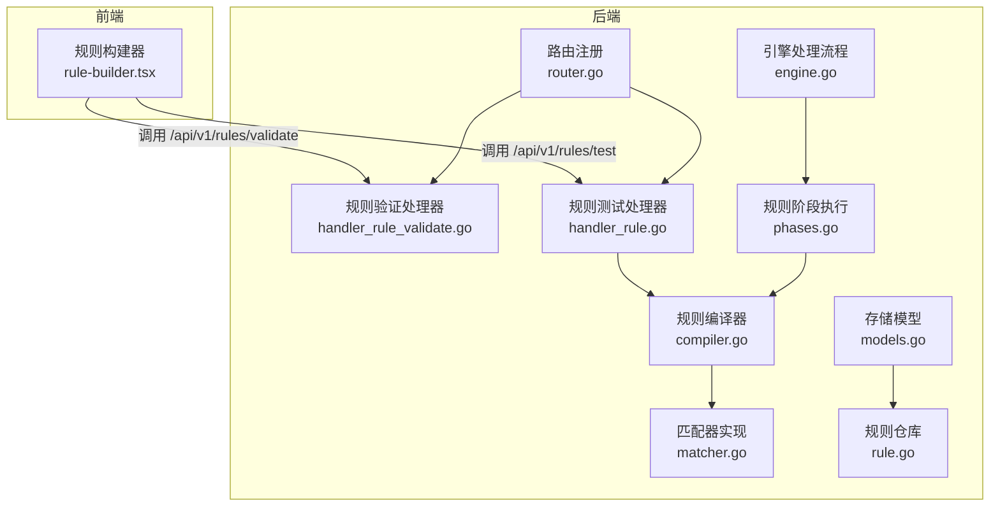
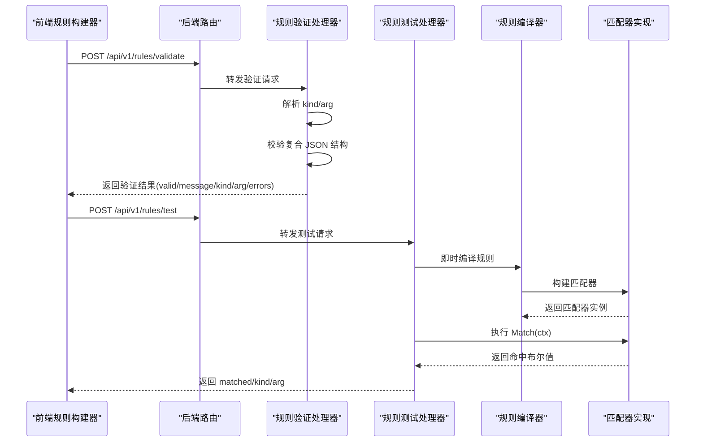
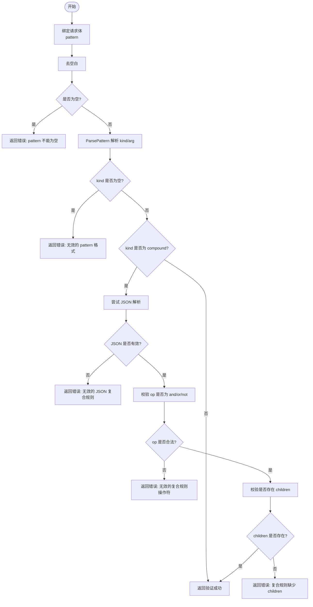
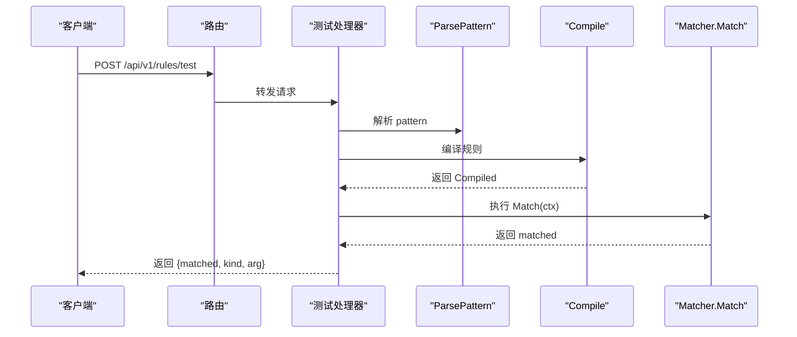
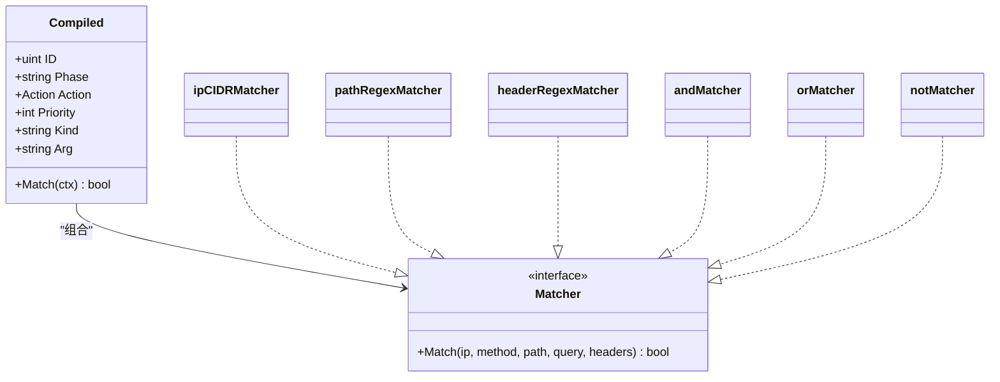
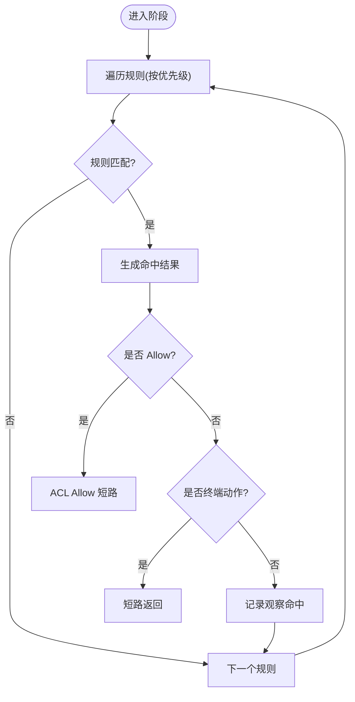
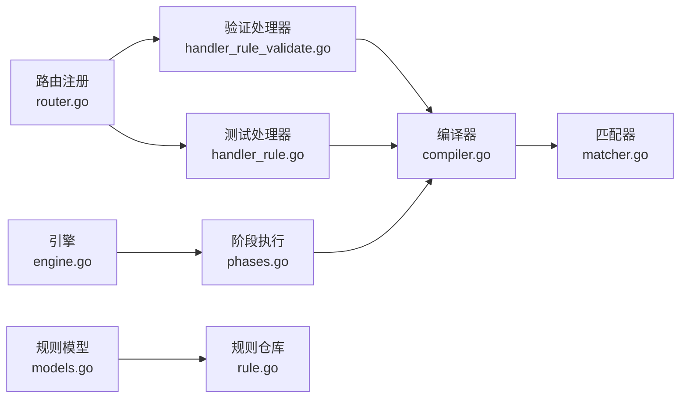

# 规则验证与测试

<cite>
**本文引用的文件**
- [main.go](file://cmd/main.go)
- [router.go](file://internal/admin/router.go)
- [handler_rule_validate.go](file://internal/admin/handler_rule_validate.go)
- [handler_rule.go](file://internal/admin/handler_rule.go)
- [rule-builder.tsx](file://frontend/components/rule-builder.tsx)
- [compiler.go](file://internal/core/rules/compiler.go)
- [matcher.go](file://internal/core/rules/matcher.go)
- [phases.go](file://internal/core/rules/phases.go)
- [engine.go](file://internal/core/engine/engine.go)
- [models.go](file://internal/store/models.go)
- [rule.go](file://internal/store/repository/rule.go)
- [compiler_test.go](file://internal/core/rules/compiler_test.go)
- [matcher_test.go](file://internal/core/rules/matcher_test.go)
</cite>

## 目录
1. [简介](#简介)
2. [项目结构](#项目结构)
3. [核心组件](#核心组件)
4. [架构总览](#架构总览)
5. [详细组件分析](#详细组件分析)
6. [依赖分析](#依赖分析)
7. [性能考虑](#性能考虑)
8. [故障排除指南](#故障排除指南)
9. [结论](#结论)
10. [附录](#附录)

## 简介
本文件聚焦于 OpenWAF 的“规则验证与测试”能力，涵盖以下方面：
- 规则语法验证机制：正则表达式检查、逻辑完整性验证、JSON 结构校验与错误收集。
- 规则测试 API 使用：测试请求格式、模拟请求参数与结果解读。
- 规则编译过程：语法解析、AST 构建（复合规则）、字节码生成（匹配器缓存）。
- 规则匹配算法：模式匹配、优先级排序、执行流程与短路策略。
- 规则调试与故障排除：常见错误定位、日志与可观测性建议。
- 性能基准与优化：正则缓存、扫描范围限制、匹配顺序优化。

## 项目结构
OpenWAF 将规则验证与测试能力分布在后端路由层、规则引擎与前端 UI 组件中：
- 后端路由层提供规则验证与测试接口，并注册在统一的路由表中。
- 规则引擎负责规则解析、编译与匹配执行。
- 前端规则构建器提供可视化与高级模式，支持本地简单测试与后端验证。

图表来源
- [router.go:162-163](file://internal/admin/router.go#L162-L163)
- [handler_rule_validate.go:32-98](file://internal/admin/handler_rule_validate.go#L32-L98)
- [handler_rule.go:115-156](file://internal/admin/handler_rule.go#L115-L156)
- [engine.go:57-129](file://internal/core/engine/engine.go#L57-L129)
- [phases.go:34-94](file://internal/core/rules/phases.go#L34-L94)
- [compiler.go:27-55](file://internal/core/rules/compiler.go#L27-L55)
- [matcher.go:167-261](file://internal/core/rules/matcher.go#L167-L261)
- [models.go:79-92](file://internal/store/models.go#L79-L92)
- [rule.go:13-28](file://internal/store/repository/rule.go#L13-L28)

章节来源
- [router.go:162-163](file://internal/admin/router.go#L162-L163)
- [handler_rule_validate.go:32-98](file://internal/admin/handler_rule_validate.go#L32-L98)
- [handler_rule.go:115-156](file://internal/admin/handler_rule.go#L115-L156)
- [engine.go:57-129](file://internal/core/engine/engine.go#L57-L129)
- [phases.go:34-94](file://internal/core/rules/phases.go#L34-L94)
- [compiler.go:27-55](file://internal/core/rules/compiler.go#L27-L55)
- [matcher.go:167-261](file://internal/core/rules/matcher.go#L167-L261)
- [models.go:79-92](file://internal/store/models.go#L79-L92)
- [rule.go:13-28](file://internal/store/repository/rule.go#L13-L28)

## 核心组件
- 规则验证处理器：接收规则 DSL 字符串，解析 kind/arg，对复合 JSON 规则进行结构与字段校验，返回验证结果与错误列表。
- 规则测试处理器：接收模拟请求体，即时编译规则并执行匹配，返回是否命中及 kind/arg。
- 规则编译器：从持久化规则模型提取 DSL，解析 kind/arg，构建运行时匹配器，并按优先级排序。
- 匹配器实现：内置多种匹配器（CIDR、前缀、正则、头部、方法、内容类型等），复合规则通过递归构建 AST 并执行。
- 规则阶段执行：按阶段顺序执行（ACL、签名、自定义等），支持短路与终端动作。
- 前端规则构建器：提供可视化与高级模式，支持本地简单测试与后端验证。

章节来源
- [handler_rule_validate.go:32-98](file://internal/admin/handler_rule_validate.go#L32-L98)
- [handler_rule.go:115-156](file://internal/admin/handler_rule.go#L115-L156)
- [compiler.go:27-55](file://internal/core/rules/compiler.go#L27-L55)
- [matcher.go:167-261](file://internal/core/rules/matcher.go#L167-L261)
- [phases.go:34-94](file://internal/core/rules/phases.go#L34-L94)
- [rule-builder.tsx:208-226](file://frontend/components/rule-builder.tsx#L208-L226)

## 架构总览
规则验证与测试的端到端流程如下：

图表来源
- [router.go:162-163](file://internal/admin/router.go#L162-L163)
- [handler_rule_validate.go:32-98](file://internal/admin/handler_rule_validate.go#L32-L98)
- [handler_rule.go:115-156](file://internal/admin/handler_rule.go#L115-L156)
- [compiler.go:27-55](file://internal/core/rules/compiler.go#L27-L55)
- [matcher.go:167-261](file://internal/core/rules/matcher.go#L167-L261)

## 详细组件分析

### 规则验证机制
- 输入：请求体包含 pattern 字段。
- 解析：ParsePattern 提取 kind 与 arg；支持简单规则与 JSON 复合规则。
- 结构校验（复合规则）：
  - 必须包含合法操作符 op（and/or/not）。
  - children 数组必须存在。
  - JSON 可被正确解析。
- 输出：返回 valid、message、kind、arg；若失败返回错误列表。

图表来源
- [handler_rule_validate.go:32-98](file://internal/admin/handler_rule_validate.go#L32-L98)
- [compiler.go:57-82](file://internal/core/rules/compiler.go#L57-L82)

章节来源
- [handler_rule_validate.go:32-98](file://internal/admin/handler_rule_validate.go#L32-L98)
- [compiler.go:57-82](file://internal/core/rules/compiler.go#L57-L82)

### 规则测试 API
- 接口：POST /api/v1/rules/test
- 请求体字段：
  - pattern：规则 DSL（支持简单规则与 JSON 复合规则）
  - client_ip：客户端 IP（可选）
  - path：请求路径
  - query：查询字符串
  - headers：请求头映射
- 处理流程：
  - ParsePattern 解析。
  - 即时 Compile 生成 Compiled 规则。
  - 构造 MatchCtx 并执行 Match。
  - 返回 matched、kind、arg。
- 响应解读：
  - matched：true 表示规则匹配当前模拟请求。
  - kind/arg：用于确认解析结果与原始 DSL。

图表来源
- [handler_rule.go:115-156](file://internal/admin/handler_rule.go#L115-L156)
- [compiler.go:27-55](file://internal/core/rules/compiler.go#L27-L55)
- [matcher.go:167-261](file://internal/core/rules/matcher.go#L167-L261)

章节来源
- [handler_rule.go:104-156](file://internal/admin/handler_rule.go#L104-L156)

### 规则编译过程
- 从持久化 Rule 模型中读取规则，过滤已禁用规则。
- ParsePattern 提取 kind/arg。
- buildMatcher 根据 kind 创建具体匹配器：
  - IP/CIDR：解析 IP/CIDR，非法输入返回永不匹配。
  - 正则类：cachedCompile 缓存正则，非法正则返回永不匹配。
  - 复合规则：parseCompoundJSON -> buildCompound 递归构建 AST。
- Compile 对规则按优先级排序（优先级相同时按 ID 升序）。

图表来源
- [compiler.go:11-25](file://internal/core/rules/compiler.go#L11-L25)
- [matcher.go:11-14](file://internal/core/rules/matcher.go#L11-L14)
- [matcher.go:48-52](file://internal/core/rules/matcher.go#L48-L52)
- [matcher.go:60-64](file://internal/core/rules/matcher.go#L60-L64)
- [matcher.go:89-101](file://internal/core/rules/matcher.go#L89-L101)
- [matcher.go:18-27](file://internal/core/rules/matcher.go#L18-L27)
- [matcher.go:29-38](file://internal/core/rules/matcher.go#L29-L38)
- [matcher.go:40-44](file://internal/core/rules/matcher.go#L40-L44)

章节来源
- [compiler.go:27-55](file://internal/core/rules/compiler.go#L27-L55)
- [matcher.go:167-261](file://internal/core/rules/matcher.go#L167-L261)

### 规则匹配算法
- 执行阶段：ACL → 签名 → 自定义（以及其它阶段）。
- 匹配顺序：按优先级升序，同优先级按 ID 升序。
- 短路策略：
  - ACL 阶段命中 Allow 动作时立即短路，跳过后续阶段。
  - 其他阶段命中终端动作（如拦截/丢弃）时短路。
- 复合规则：
  - and：所有子条件满足才命中。
  - or：任一子条件满足即命中。
  - not：对子条件取反。
- 正则缓存：cachedCompile 使用全局互斥锁保护的缓存表，避免重复编译。

图表来源
- [phases.go:34-52](file://internal/core/rules/phases.go#L34-L52)
- [phases.go:544-568](file://internal/core/rules/phases.go#L544-L568)
- [matcher.go:279-296](file://internal/core/rules/matcher.go#L279-L296)

章节来源
- [phases.go:34-52](file://internal/core/rules/phases.go#L34-L52)
- [phases.go:544-568](file://internal/core/rules/phases.go#L544-L568)
- [matcher.go:279-296](file://internal/core/rules/matcher.go#L279-L296)

### 规则测试示例
以下示例基于单元测试与前端本地测试逻辑，展示成功与失败场景的要点（不直接展示代码内容）：
- 成功匹配（IP 黑名单）：客户端 IP 属于规则 CIDR，命中 ACL 阶段 Allow，触发短路。
- 失败匹配（IP 白名单）：客户端 IP 不在规则范围内，未命中。
- 成功匹配（路径正则）：路径匹配正则，命中签名或自定义阶段。
- 失败匹配（路径不匹配）：路径不满足正则，未命中。
- 复合规则（AND/OR）：AND 需要所有子条件满足；OR 任一满足即可。
- 正则缓存：相同正则多次编译返回同一实例，命中缓存提升性能。

章节来源
- [compiler_test.go:11-27](file://internal/core/rules/compiler_test.go#L11-L27)
- [compiler_test.go:29-46](file://internal/core/rules/compiler_test.go#L29-L46)
- [compiler_test.go:48-62](file://internal/core/rules/compiler_test.go#L48-L62)
- [compiler_test.go:64-75](file://internal/core/rules/compiler_test.go#L64-L75)
- [compiler_test.go:77-87](file://internal/core/rules/compiler_test.go#L77-L87)
- [matcher_test.go:30-66](file://internal/core/rules/matcher_test.go#L30-L66)
- [matcher_test.go:68-88](file://internal/core/rules/matcher_test.go#L68-L88)
- [matcher_test.go:90-110](file://internal/core/rules/matcher_test.go#L90-L110)
- [matcher_test.go:112-129](file://internal/core/rules/matcher_test.go#L112-L129)
- [matcher_test.go:131-148](file://internal/core/rules/matcher_test.go#L131-L148)
- [matcher_test.go:150-167](file://internal/core/rules/matcher_test.go#L150-L167)
- [matcher_test.go:169-186](file://internal/core/rules/matcher_test.go#L169-L186)
- [matcher_test.go:188-207](file://internal/core/rules/matcher_test.go#L188-L207)
- [matcher_test.go:209-220](file://internal/core/rules/matcher_test.go#L209-L220)
- [rule-builder.tsx:228-293](file://frontend/components/rule-builder.tsx#L228-L293)

### 规则调试与故障排除
- 常见问题与定位：
  - pattern 为空：验证接口会返回明确错误。
  - 无效的 pattern 格式：检查是否以合法前缀开头或为合法 JSON。
  - 复合规则结构错误：确保 op 存在且为 and/or/not，children 数组存在。
  - 正则非法：cachedCompile 会返回永不匹配，检查正则语法。
  - 测试未命中：核对模拟请求参数（IP、路径、查询、头部）与规则期望是否一致。
- 日志与可观测性建议：
  - 在前端规则构建器中使用“验证规则”按钮快速反馈。
  - 对复杂正则建议先在验证接口中确认可编译。
  - 对复合规则，建议分步构建并在测试接口中逐步验证。

章节来源
- [handler_rule_validate.go:32-98](file://internal/admin/handler_rule_validate.go#L32-L98)
- [matcher.go:279-296](file://internal/core/rules/matcher.go#L279-L296)
- [rule-builder.tsx:208-226](file://frontend/components/rule-builder.tsx#L208-L226)

## 依赖分析
- 路由层依赖：将规则验证与测试接口注册到统一路由组。
- 处理器依赖：验证处理器依赖规则解析与 JSON 校验；测试处理器依赖编译器与匹配器。
- 引擎依赖：引擎在运行时将规则编译并按阶段执行，ACL 阶段支持 Allow 短路。
- 存储依赖：规则模型与仓库提供规则的持久化与查询。

图表来源
- [router.go:162-163](file://internal/admin/router.go#L162-L163)
- [handler_rule_validate.go:32-98](file://internal/admin/handler_rule_validate.go#L32-L98)
- [handler_rule.go:115-156](file://internal/admin/handler_rule.go#L115-L156)
- [compiler.go:27-55](file://internal/core/rules/compiler.go#L27-L55)
- [matcher.go:167-261](file://internal/core/rules/matcher.go#L167-L261)
- [engine.go:57-129](file://internal/core/engine/engine.go#L57-L129)
- [phases.go:34-94](file://internal/core/rules/phases.go#L34-L94)
- [models.go:79-92](file://internal/store/models.go#L79-L92)
- [rule.go:13-28](file://internal/store/repository/rule.go#L13-L28)

章节来源
- [router.go:162-163](file://internal/admin/router.go#L162-L163)
- [engine.go:57-129](file://internal/core/engine/engine.go#L57-L129)
- [phases.go:34-94](file://internal/core/rules/phases.go#L34-L94)
- [models.go:79-92](file://internal/store/models.go#L79-L92)
- [rule.go:13-28](file://internal/store/repository/rule.go#L13-L28)

## 性能考虑
- 正则缓存：cachedCompile 使用全局互斥锁保护缓存表，避免重复编译，显著降低 CPU 开销。
- 匹配顺序优化：按优先级与 ID 排序，使高优先级规则优先执行，减少不必要的匹配。
- 短路策略：Allow 动作在 ACL 阶段短路，减少后续阶段开销。
- 复合规则：递归构建 AST，尽量保持 children 数量合理，避免深层嵌套导致的匹配成本上升。
- 建议：
  - 对高频正则尽量复用，避免重复构造。
  - 控制复合规则的深度与广度，必要时拆分为多个简单规则。
  - 使用 Allow 规则进行早期短路，减少整体匹配时间。

章节来源
- [matcher.go:279-296](file://internal/core/rules/matcher.go#L279-L296)
- [phases.go:34-52](file://internal/core/rules/phases.go#L34-L52)
- [compiler.go:48-55](file://internal/core/rules/compiler.go#L48-L55)

## 故障排除指南
- 验证失败：
  - 检查 pattern 是否为空或格式错误。
  - 对复合规则检查 op 与 children 字段。
  - 对正则规则检查语法是否正确。
- 测试未命中：
  - 确认模拟请求参数与规则期望一致（IP、路径、查询、头部）。
  - 对正则规则使用在线正则验证工具辅助调试。
- 运行期未生效：
  - 检查规则是否启用、优先级设置是否合理。
  - 确认规则所在阶段是否参与当前流量处理链。

章节来源
- [handler_rule_validate.go:32-98](file://internal/admin/handler_rule_validate.go#L32-L98)
- [handler_rule.go:115-156](file://internal/admin/handler_rule.go#L115-L156)
- [phases.go:34-52](file://internal/core/rules/phases.go#L34-L52)

## 结论
OpenWAF 的规则验证与测试体系通过“前端可视化 + 后端即时编译 + 匹配器缓存”的组合，提供了高效、易用且可扩展的规则开发体验。验证接口覆盖了语法与结构校验，测试接口支持快速迭代与回归验证。编译器与匹配器的正则缓存与短路策略进一步保障了运行时性能。建议在实际使用中结合单元测试与前端验证工具，持续优化规则结构与正则表达式，以获得最佳的匹配效果与性能表现。

## 附录
- 规则模型与阶段常量参考：[models.go:44-77](file://internal/store/models.go#L44-L77)
- 规则仓库查询与排序：[rule.go:13-28](file://internal/store/repository/rule.go#L13-L28)
- 引擎入口与阶段装配：[engine.go:57-129](file://internal/core/engine/engine.go#L57-L129)