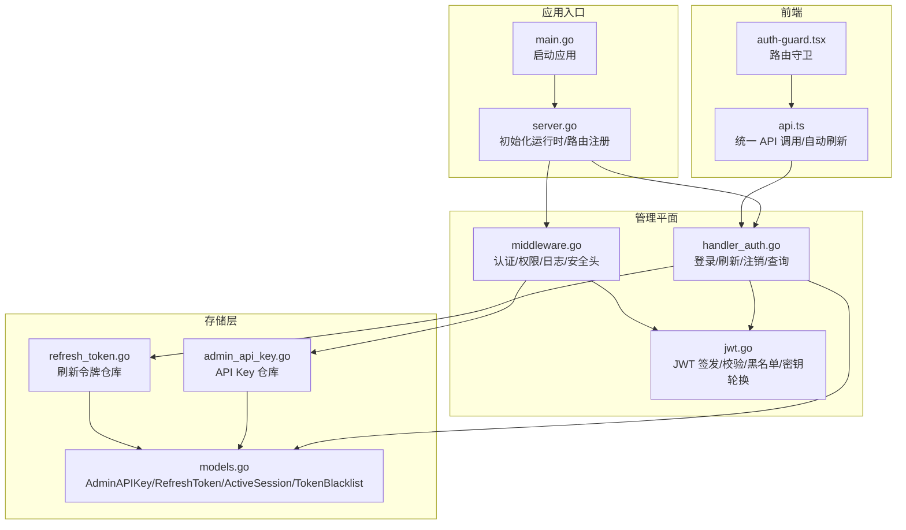
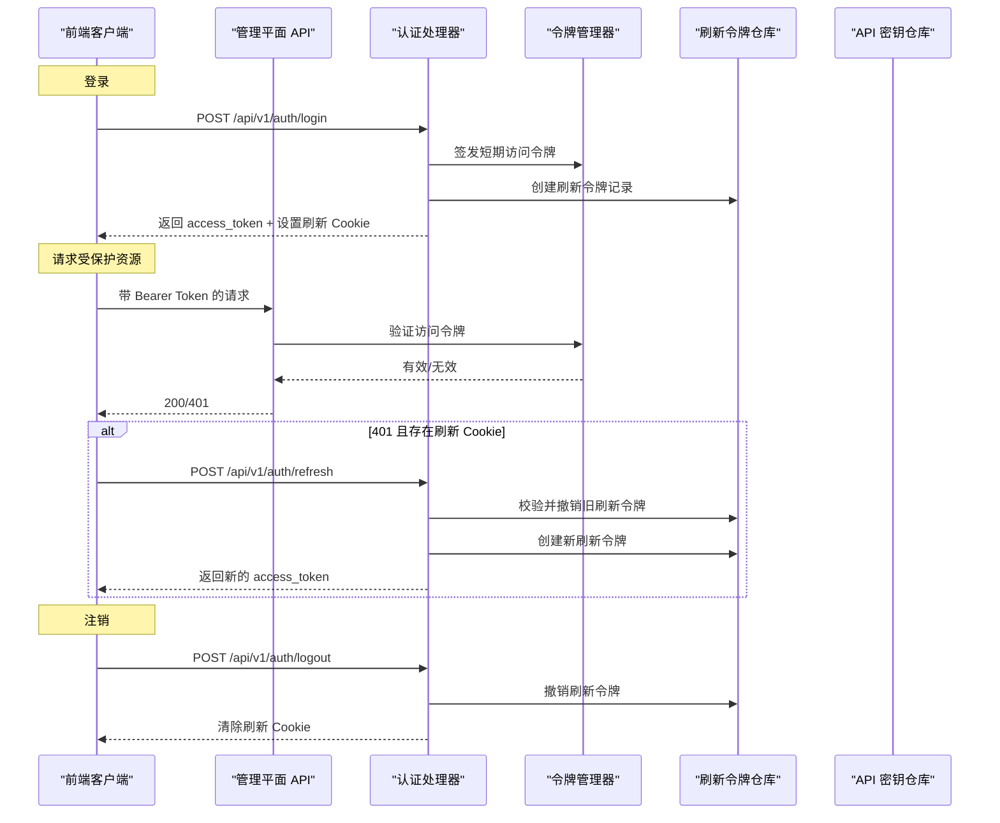
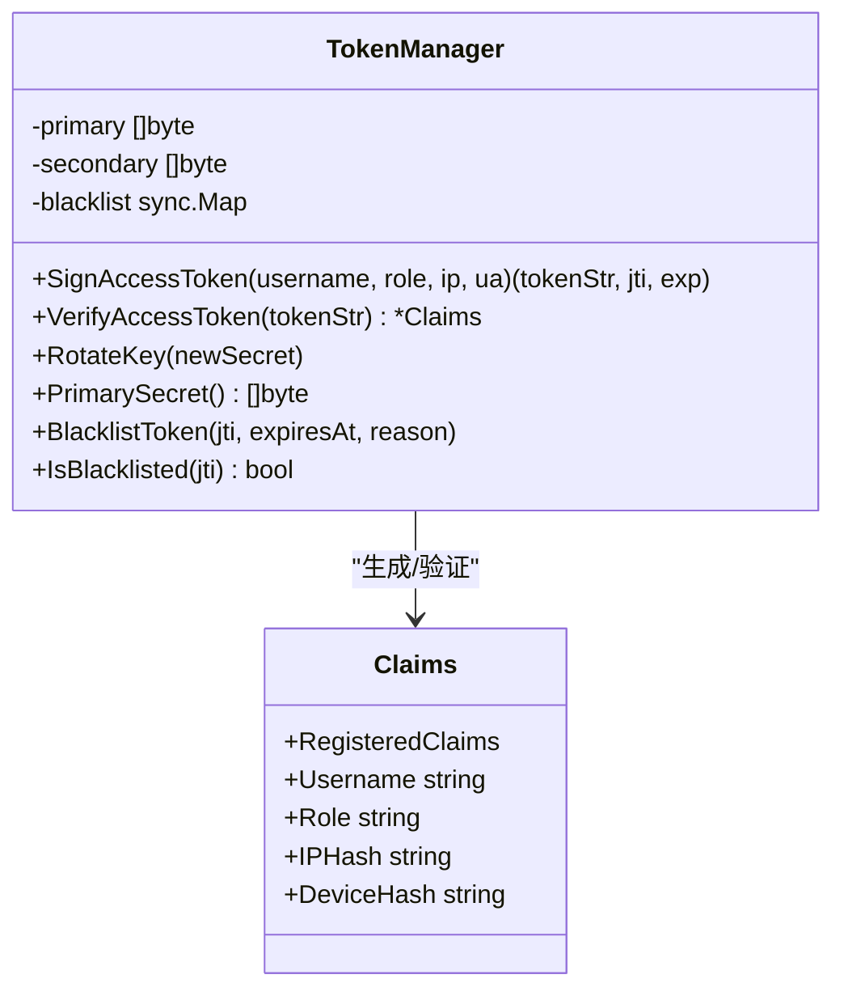
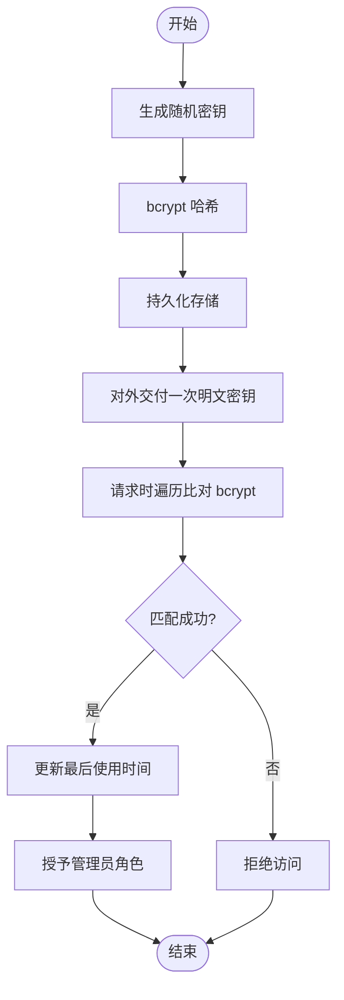
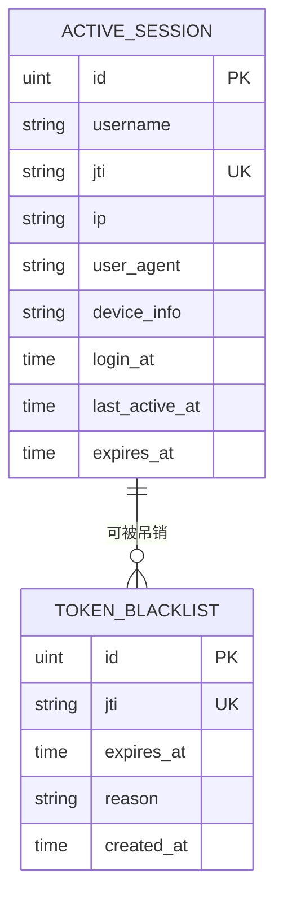
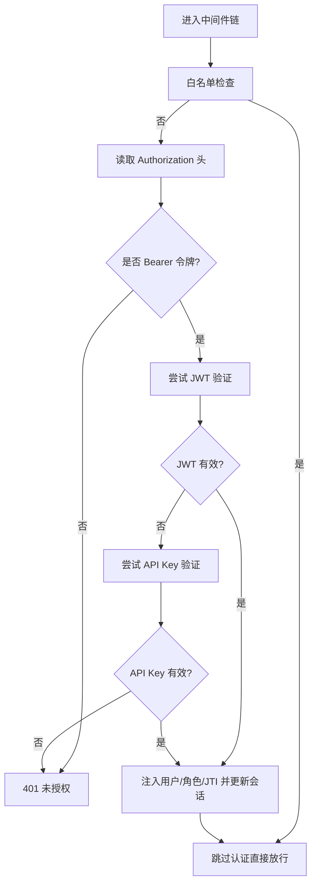
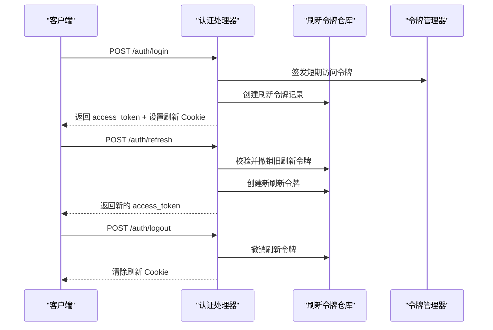
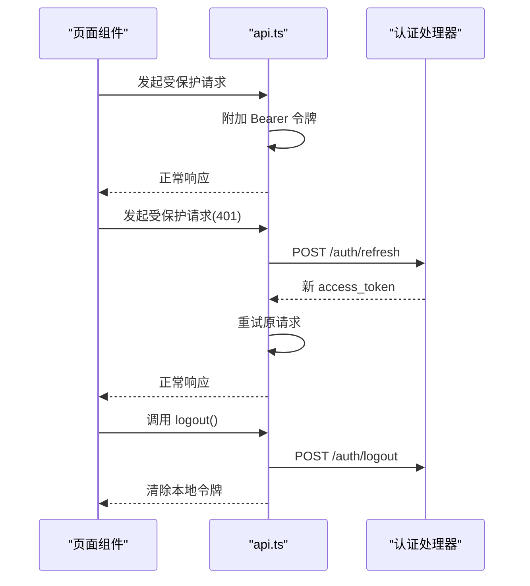
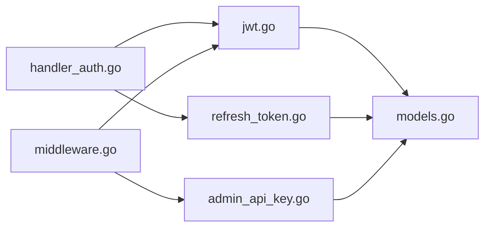

# 认证与授权机制

<cite>
**本文档引用的文件**
- [jwt.go](file://internal/admin/auth/jwt.go)
- [middleware.go](file://internal/admin/middleware.go)
- [handler_auth.go](file://internal/admin/handler_auth.go)
- [admin_api_key.go](file://internal/store/repository/admin_api_key.go)
- [refresh_token.go](file://internal/store/repository/refresh_token.go)
- [models.go](file://internal/store/models.go)
- [server.go](file://internal/app/server.go)
- [api.ts](file://frontend/lib/api.ts)
- [auth-guard.tsx](file://frontend/components/auth-guard.tsx)
</cite>

## 目录
1. [简介](#简介)
2. [项目结构](#项目结构)
3. [核心组件](#核心组件)
4. [架构总览](#架构总览)
5. [详细组件分析](#详细组件分析)
6. [依赖分析](#依赖分析)
7. [性能考虑](#性能考虑)
8. [故障排除指南](#故障排除指南)
9. [结论](#结论)
10. [附录](#附录)

## 简介
本文件系统性阐述 My-OpenWaf 的认证与授权机制，覆盖以下要点：
- JWT 令牌系统：令牌生成、验证、刷新与吊销
- API 密钥认证：密钥创建、权限管理与轮换策略
- 会话管理：登录状态维护与强制注销
- 中间件链：认证中间件、权限检查与请求预处理
- 安全最佳实践：令牌存储、传输加密与防重放
- 客户端集成指南与常见问题

## 项目结构
后端采用分层设计：
- 应用入口负责初始化运行时、数据库迁移与路由注册
- 管理平面（Admin）提供认证与授权相关接口
- 存储层定义模型与仓库，支撑认证数据持久化
- 前端通过统一 API 封装完成认证交互

**图表来源**
- [server.go:251-258](file://internal/app/server.go#L251-L258)
- [handler_auth.go:25-61](file://internal/admin/handler_auth.go#L25-L61)
- [middleware.go:18-72](file://internal/admin/middleware.go#L18-L72)
- [jwt.go:44-80](file://internal/admin/auth/jwt.go#L44-L80)
- [admin_api_key.go:16-46](file://internal/store/repository/admin_api_key.go#L16-L46)
- [refresh_token.go:11-32](file://internal/store/repository/refresh_token.go#L11-L32)
- [models.go:159-188](file://internal/store/models.go#L159-L188)
- [api.ts:34-78](file://frontend/lib/api.ts#L34-L78)
- [auth-guard.tsx:7-21](file://frontend/components/auth-guard.tsx#L7-L21)

**章节来源**
- [server.go:33-280](file://internal/app/server.go#L33-L280)
- [handler_auth.go:14-61](file://internal/admin/handler_auth.go#L14-L61)
- [middleware.go:16-72](file://internal/admin/middleware.go#L16-L72)
- [jwt.go:44-80](file://internal/admin/auth/jwt.go#L44-L80)
- [admin_api_key.go:16-46](file://internal/store/repository/admin_api_key.go#L16-L46)
- [refresh_token.go:11-32](file://internal/store/repository/refresh_token.go#L11-L32)
- [models.go:159-188](file://internal/store/models.go#L159-L188)
- [api.ts:34-78](file://frontend/lib/api.ts#L34-L78)
- [auth-guard.tsx:7-21](file://frontend/components/auth-guard.tsx#L7-L21)

## 核心组件
- 令牌管理器（TokenManager）
  - 负责 HS256 签发与验证、密钥轮换、令牌黑名单与清理
  - 支持主/备密钥验证以平滑过渡
- 认证处理器（Auth Handlers）
  - 登录签发短期访问令牌与刷新令牌（服务端 Cookie）
  - 刷新接口轮换刷新令牌并签发新的短期访问令牌
  - 注销撤销刷新令牌并清除 Cookie
- 权限中间件（AuthMiddleware/RequireRole）
  - 统一从 Authorization 头解析 Bearer 令牌
  - 支持 API Key 回退认证
  - 角色级权限控制
- API 密钥仓库（AdminAPIKeyRepo）
  - 一次性返回明文密钥，后续仅以哈希比对
  - 记录最后使用时间
- 刷新令牌仓库（RefreshTokenRepo）
  - 按 JTI 存取、撤销与过期清理
- 模型（Models）
  - AdminAPIKey、RefreshToken、ActiveSession、TokenBlacklist
- 前端 API 封装（api.ts）
  - 自动携带 Bearer 令牌
  - 401 时尝试刷新并重试
  - 登出清除本地令牌

**章节来源**
- [jwt.go:44-80](file://internal/admin/auth/jwt.go#L44-L80)
- [handler_auth.go:25-125](file://internal/admin/handler_auth.go#L25-L125)
- [middleware.go:18-96](file://internal/admin/middleware.go#L18-L96)
- [admin_api_key.go:30-63](file://internal/store/repository/admin_api_key.go#L30-L63)
- [refresh_token.go:15-42](file://internal/store/repository/refresh_token.go#L15-L42)
- [models.go:159-188](file://internal/store/models.go#L159-L188)
- [api.ts:34-103](file://frontend/lib/api.ts#L34-L103)

## 架构总览
下图展示认证与授权的整体交互流程。

**图表来源**
- [handler_auth.go:25-125](file://internal/admin/handler_auth.go#L25-L125)
- [jwt.go:84-135](file://internal/admin/auth/jwt.go#L84-L135)
- [refresh_token.go:24-32](file://internal/store/repository/refresh_token.go#L24-L32)
- [api.ts:80-102](file://frontend/lib/api.ts#L80-L102)

## 详细组件分析

### JWT 令牌系统
- 令牌类型与有效期
  - 短期访问令牌（AccessTTL）：默认 15 分钟
  - 刷新令牌（RefreshTTL）：默认 7 天
- Claims 内容
  - 注册字段：iss/auid/exp/iat/sub
  - 自定义字段：username、role、ip_hash、device_hash
- 签发流程
  - 生成唯一 JTI，设置过期时间，填充 Claims
  - 使用当前主密钥进行 HS256 签发
- 验证流程
  - 优先使用主密钥验证；失败则回退到备密钥（密钥轮换过渡）
  - 校验通过后检查 JTI 是否在内存黑名单中
- 黑名单与清理
  - 内存黑名单（jti -> 过期时间），支持持久化至数据库
  - 后台定时清理过期条目并同步数据库
- 密钥轮换
  - RotateKey 将旧主密钥置为备密钥，新密钥成为主密钥
  - 验证阶段同时尝试主/备密钥，确保平滑过渡

**图表来源**
- [jwt.go:44-80](file://internal/admin/auth/jwt.go#L44-L80)
- [jwt.go:24-31](file://internal/admin/auth/jwt.go#L24-L31)

**章节来源**
- [jwt.go:33-39](file://internal/admin/auth/jwt.go#L33-L39)
- [jwt.go:84-135](file://internal/admin/auth/jwt.go#L84-L135)
- [jwt.go:198-253](file://internal/admin/auth/jwt.go#L198-L253)
- [jwt.go:67-80](file://internal/admin/auth/jwt.go#L67-L80)

### API 密钥认证
- 密钥生成
  - 生成 32 字节随机明文密钥，仅首次可见
  - 以 bcrypt 哈希持久化存储
- 密钥验证
  - 遍历所有已存密钥，使用 bcrypt 比对
  - 成功后更新最后使用时间
- 权限与角色
  - API Key 默认授予管理员角色
- 轮换策略
  - 删除旧密钥后重新创建新密钥
  - 建议定期轮换并审计使用情况

**图表来源**
- [admin_api_key.go:30-63](file://internal/store/repository/admin_api_key.go#L30-L63)

**章节来源**
- [admin_api_key.go:30-63](file://internal/store/repository/admin_api_key.go#L30-L63)
- [middleware.go:59-71](file://internal/admin/middleware.go#L59-L71)

### 会话管理
- 会话跟踪
  - ActiveSession 记录用户名、JTI、IP、UA、设备信息、登录与最后活跃时间、过期时间
- 会话生命周期
  - 登录成功创建会话记录
  - 每次 JWT 验证成功更新最后活跃时间
  - 后台清理过期会话
- 强制注销
  - 可按 JTI 或用户名强制移除会话
  - 注销时可将对应访问令牌加入黑名单

**图表来源**
- [models.go:374-384](file://internal/store/models.go#L374-L384)
- [models.go:353-359](file://internal/store/models.go#L353-L359)

**章节来源**
- [models.go:374-384](file://internal/store/models.go#L374-L384)

### 中间件链设计
- 认证中间件（AuthMiddleware）
  - 白名单路径跳过（健康检查、认证相关接口）
  - 从 Authorization 头提取 Bearer 令牌
  - 优先 JWT 验证，失败则回退 API Key
  - 成功后注入用户信息与角色，更新会话活跃时间
- 权限中间件（RequireRole）
  - 基于上下文中的角色进行许可检查
- 日志与安全头
  - AccessLog 统一日志格式与请求 ID
  - SecurityHeaders 设置常见安全响应头

**图表来源**
- [middleware.go:18-72](file://internal/admin/middleware.go#L18-L72)

**章节来源**
- [middleware.go:18-129](file://internal/admin/middleware.go#L18-L129)

### 认证处理器（登录/刷新/注销/查询）
- 登录
  - 校验账户凭据，签发短期访问令牌
  - 生成刷新令牌（JTI、原始值、SHA-256 哈希），持久化
  - 设置安全 Cookie（刷新令牌）
- 刷新
  - 读取 Cookie，解析 JTI 与原始值
  - 校验哈希与有效性，撤销旧刷新令牌
  - 生成新刷新令牌与新的短期访问令牌，更新 Cookie
- 注销
  - 撤销刷新令牌，清除 Cookie
- 查询当前用户
  - 从上下文读取已认证用户名

**图表来源**
- [handler_auth.go:25-125](file://internal/admin/handler_auth.go#L25-L125)
- [refresh_token.go:24-32](file://internal/store/repository/refresh_token.go#L24-L32)
- [jwt.go:84-109](file://internal/admin/auth/jwt.go#L84-L109)

**章节来源**
- [handler_auth.go:25-125](file://internal/admin/handler_auth.go#L25-L125)
- [refresh_token.go:15-42](file://internal/store/repository/refresh_token.go#L15-L42)

### 前端集成与客户端流程
- 令牌存储
  - 使用 sessionStorage 保存短期访问令牌
- 请求拦截
  - 自动在请求头添加 Bearer 令牌
- 自动刷新
  - 401 时尝试刷新，成功后重试原请求
- 登录/登出
  - 登录成功保存 access_token
  - 登出调用后端注销接口并清除本地令牌
- 路由守卫
  - 未持有令牌时跳转登录页

**图表来源**
- [api.ts:34-103](file://frontend/lib/api.ts#L34-L103)
- [auth-guard.tsx:7-21](file://frontend/components/auth-guard.tsx#L7-L21)

**章节来源**
- [api.ts:34-103](file://frontend/lib/api.ts#L34-L103)
- [auth-guard.tsx:7-21](file://frontend/components/auth-guard.tsx#L7-L21)

## 依赖分析
- 组件耦合
  - 认证处理器依赖令牌管理器与刷新令牌仓库
  - 认证中间件依赖令牌管理器与 API 密钥仓库
  - 会话管理器与令牌管理器相互协作（会话活跃时间更新）
- 外部依赖
  - JWT 库用于签名与验证
  - GORM 用于数据持久化
  - bcrypt 用于 API Key 哈希
- 潜在循环依赖
  - 当前模块划分清晰，未见循环导入

**图表来源**
- [handler_auth.go:14-18](file://internal/admin/handler_auth.go#L14-L18)
- [middleware.go:12-13](file://internal/admin/middleware.go#L12-L13)
- [jwt.go:14](file://internal/admin/auth/jwt.go#L14)
- [refresh_token.go:6](file://internal/store/repository/refresh_token.go#L6)
- [admin_api_key.go:11](file://internal/store/repository/admin_api_key.go#L11)

**章节来源**
- [handler_auth.go:14-18](file://internal/admin/handler_auth.go#L14-L18)
- [middleware.go:12-13](file://internal/admin/middleware.go#L12-L13)
- [jwt.go:14](file://internal/admin/auth/jwt.go#L14)
- [refresh_token.go:6](file://internal/store/repository/refresh_token.go#L6)
- [admin_api_key.go:11](file://internal/store/repository/admin_api_key.go#L11)

## 性能考虑
- 令牌验证
  - HS256 验证开销极低，建议保持
  - 黑名单内存查找为 O(1)，并发安全使用 sync.Map
- 刷新令牌
  - JTI 唯一索引，查询与撤销均高效
- 会话清理
  - 后台定时任务批量清理过期会话，避免频繁 I/O
- 前端重试
  - 401 自动刷新与重试需谨慎，避免风暴式重试

[本节为通用指导，无需特定文件来源]

## 故障排除指南
- 401 未授权
  - 检查 Authorization 头格式是否为 Bearer
  - 确认短期访问令牌未过期
  - 若使用 API Key，请确认密钥有效且未被撤销
- 刷新失败
  - 检查刷新 Cookie 是否存在且格式正确（jti:raw）
  - 核对哈希一致性与是否已撤销/过期
- 注销后仍可访问
  - 确认刷新令牌已被撤销
  - 如启用会话黑名单，确认访问令牌 JTI 已加入黑名单
- 前端无法登录
  - 检查跨域与 Cookie 安全属性（SameSite/Lax/Secure）
  - 确保后端设置了正确的 Cookie 作用域与路径

**章节来源**
- [handler_auth.go:63-125](file://internal/admin/handler_auth.go#L63-L125)
- [middleware.go:18-72](file://internal/admin/middleware.go#L18-L72)
- [api.ts:80-103](file://frontend/lib/api.ts#L80-L103)

## 结论
该认证体系以 JWT 为核心，结合刷新令牌与 API Key 提供多通道认证能力；通过中间件链实现统一鉴权与权限控制；配合会话管理与黑名单机制提升安全性与可观测性。前端通过统一 API 封装实现透明的令牌刷新与错误处理。建议在生产环境强化传输加密、令牌存储与密钥轮换策略，并持续审计 API Key 使用情况。

[本节为总结性内容，无需特定文件来源]

## 附录

### 安全最佳实践
- 传输加密
  - 所有认证与敏感操作必须通过 HTTPS
- 令牌存储
  - 前端短期访问令牌使用 sessionStorage，避免 localStorage
  - 刷新令牌使用 HttpOnly Cookie，设置 SameSite/Lax/Secure
- 防重放与防篡改
  - 使用 HS256 并妥善保管密钥
  - 启用 JTI 与黑名单，支持强制注销与密钥轮换
- 密钥管理
  - JWT 秘钥通过环境变量或数据库配置项注入
  - 定期轮换密钥，验证阶段兼容主/备密钥
- API Key 管理
  - 严格限制 API Key 权限范围
  - 定期轮换并审计使用日志

[本节为通用指导，无需特定文件来源]