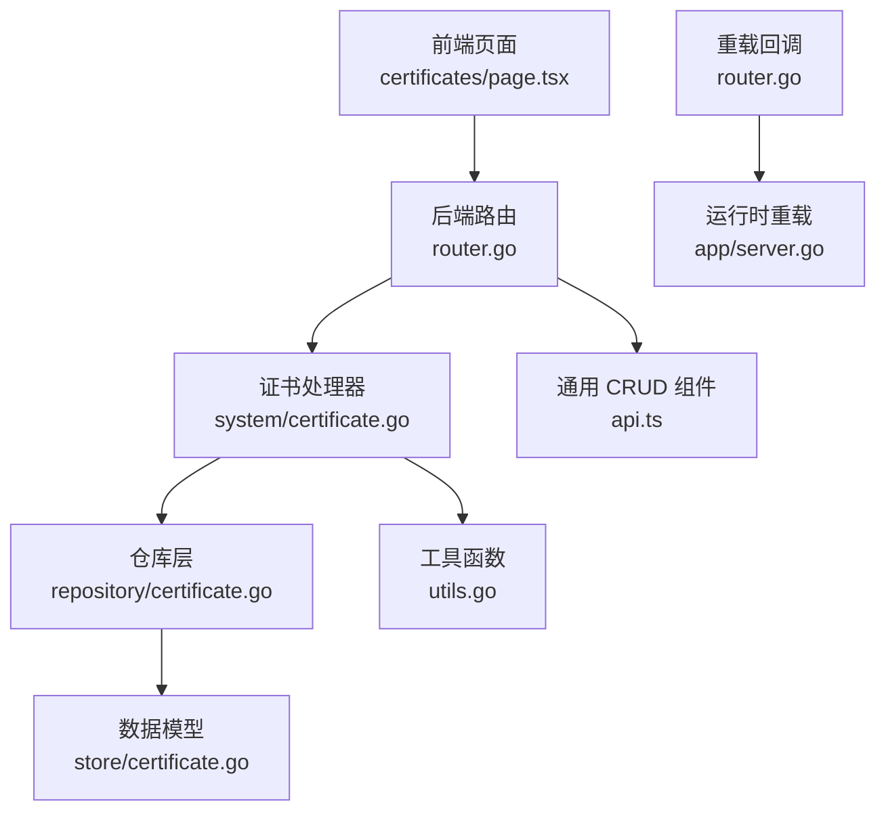
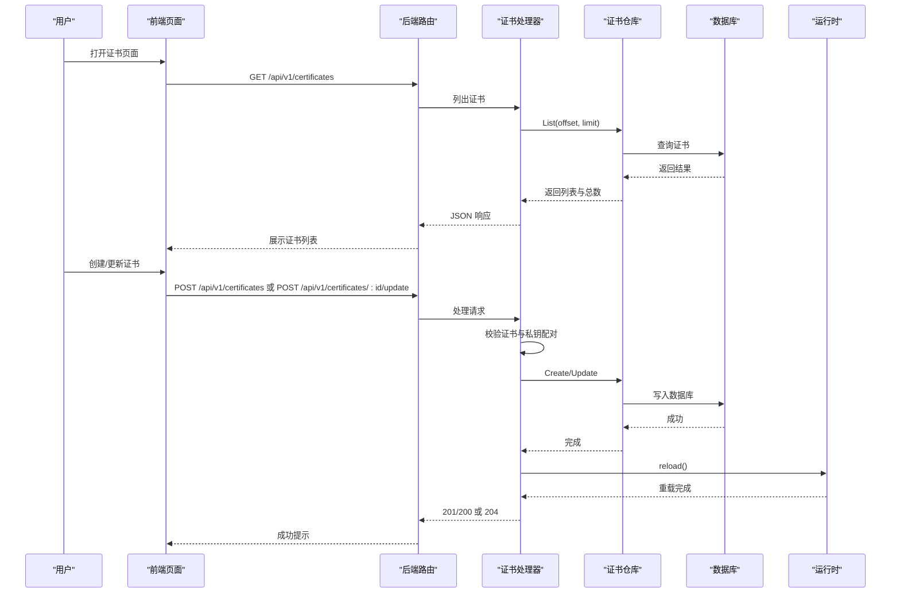
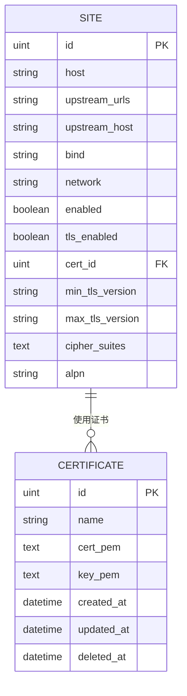
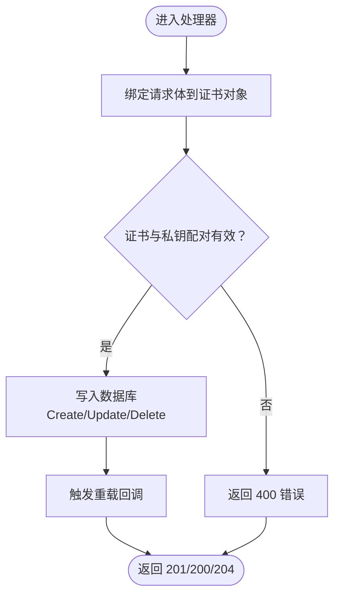
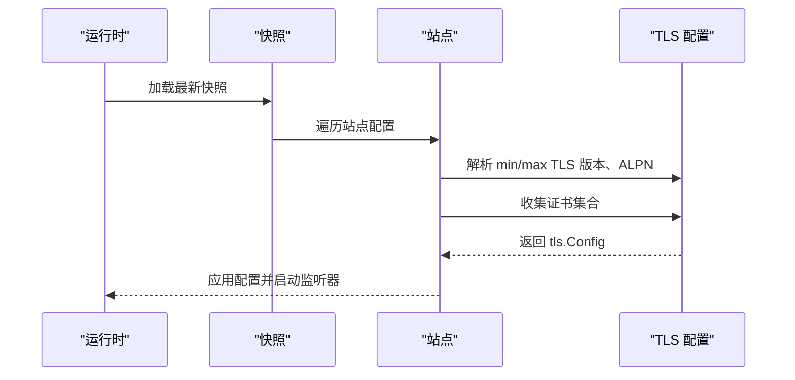
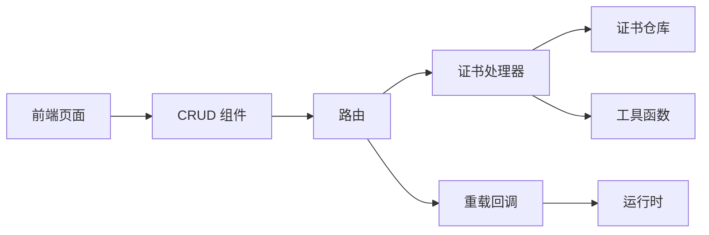

# 证书管理 API

<cite>
**本文引用的文件**
- [internal/admin/system/certificate.go](file://internal/admin/system/certificate.go)
- [internal/admin/router.go](file://internal/admin/router.go)
- [internal/store/repository/certificate.go](file://internal/store/repository/certificate.go)
- [internal/store/certificate.go](file://internal/store/certificate.go)
- [internal/utils/utils.go](file://internal/utils/utils.go)
- [frontend/app/(dashboard)/certificates/page.tsx](file://frontend/app/(dashboard)/certificates/page.tsx)
- [frontend/lib/api.ts](file://frontend/lib/api.ts)
- [internal/app/server.go](file://internal/app/server.go)
- [internal/store/migrations/v2_single_site.go](file://internal/store/migrations/v2_single_site.go)
- [internal/store/site.go](file://internal/store/site.go)
- [cmd/main.go](file://cmd/main.go)
</cite>

## 目录
1. [简介](#简介)
2. [项目结构](#项目结构)
3. [核心组件](#核心组件)
4. [架构总览](#架构总览)
5. [详细组件分析](#详细组件分析)
6. [依赖分析](#依赖分析)
7. [性能考虑](#性能考虑)
8. [故障排除指南](#故障排除指南)
9. [结论](#结论)
10. [附录](#附录)

## 简介
本文件面向证书管理 API 的使用者与维护者，系统化阐述证书系统的架构设计、数据模型、CRUD 接口、验证流程、证书链管理策略、配置示例与部署要点，并补充轮换与自动续期建议、故障排除与安全最佳实践。读者无需深入 Go 或前端源码即可理解如何正确使用与运维该证书体系。

## 项目结构
证书管理 API 由后端路由与处理器、数据访问层、数据模型、前端 CRUD 页面以及运行时服务组成。核心交互路径如下：
- 前端通过页面组件发起请求到后端 REST API
- 后端路由注册与鉴权中间件处理请求
- 处理器调用仓库层进行数据库读写
- 运行时在证书变更后触发重载，使新证书生效

**图表来源**
- [internal/admin/router.go:48-210](file://internal/admin/router.go#L48-L210)
- [internal/admin/system/certificate.go:15-119](file://internal/admin/system/certificate.go#L15-L119)
- [internal/store/repository/certificate.go:9-37](file://internal/store/repository/certificate.go#L9-L37)
- [internal/store/certificate.go:9-20](file://internal/store/certificate.go#L9-L20)
- [internal/utils/utils.go:10-26](file://internal/utils/utils.go#L10-L26)
- [frontend/app/(dashboard)/certificates/page.tsx:4-17](file://frontend/app/(dashboard)/certificates/page.tsx#L4-L17)
- [frontend/lib/api.ts:173-193](file://frontend/lib/api.ts#L173-L193)
- [internal/app/server.go:313-349](file://internal/app/server.go#L313-L349)

**章节来源**
- [internal/admin/router.go:48-210](file://internal/admin/router.go#L48-L210)
- [frontend/app/(dashboard)/certificates/page.tsx:4-17](file://frontend/app/(dashboard)/certificates/page.tsx#L4-L17)
- [frontend/lib/api.ts:173-193](file://frontend/lib/api.ts#L173-L193)

## 核心组件
- 证书数据模型：包含证书名称、证书 PEM、私钥 PEM 字段，持久化于数据库。
- 证书仓库：封装分页查询、按 ID 获取、创建、更新、删除等数据库操作。
- 证书处理器：提供列表、详情、创建、更新、删除接口；在创建/更新时执行证书与私钥配对校验。
- 路由与鉴权：统一注册 /api/v1/certificates 相关端点，要求有效 JWT 或 API Key。
- 前端页面：基于通用 CRUD 组件渲染证书列表与表单，提交到后端 API。
- 运行时重载：证书变更后触发重载，使监听器加载新的证书集合。

**章节来源**
- [internal/store/certificate.go:9-20](file://internal/store/certificate.go#L9-L20)
- [internal/store/repository/certificate.go:13-36](file://internal/store/repository/certificate.go#L13-L36)
- [internal/admin/system/certificate.go:15-119](file://internal/admin/system/certificate.go#L15-L119)
- [internal/admin/router.go:91-151](file://internal/admin/router.go#L91-L151)
- [frontend/app/(dashboard)/certificates/page.tsx:4-17](file://frontend/app/(dashboard)/certificates/page.tsx#L4-L17)
- [internal/app/server.go:313-349](file://internal/app/server.go#L313-L349)

## 架构总览
证书管理 API 的控制流围绕“前端 → 路由 → 处理器 → 仓库 → 数据库”的主干展开，同时在证书变更后通过重载回调触发运行时更新。

**图表来源**
- [internal/admin/router.go:91-151](file://internal/admin/router.go#L91-L151)
- [internal/admin/system/certificate.go:45-109](file://internal/admin/system/certificate.go#L45-L109)
- [internal/store/repository/certificate.go:13-36](file://internal/store/repository/certificate.go#L13-L36)
- [internal/app/server.go:313-349](file://internal/app/server.go#L313-L349)

## 详细组件分析

### 证书数据模型与存储
- 数据模型定义了证书实体的字段：名称、证书 PEM、私钥 PEM；并包含标准的时间戳与软删除字段。
- 仓库层提供分页查询、按 ID 获取、创建、更新、删除方法，底层使用 GORM ORM。
- 迁移脚本为站点模型增加 TLS 监听相关字段，支持证书绑定与 TLS 参数配置。

**图表来源**
- [internal/store/certificate.go:9-20](file://internal/store/certificate.go#L9-L20)
- [internal/store/site.go:16-81](file://internal/store/site.go#L16-L81)
- [internal/store/migrations/v2_single_site.go:52-82](file://internal/store/migrations/v2_single_site.go#L52-L82)

**章节来源**
- [internal/store/certificate.go:9-20](file://internal/store/certificate.go#L9-L20)
- [internal/store/repository/certificate.go:9-37](file://internal/store/repository/certificate.go#L9-L37)
- [internal/store/migrations/v2_single_site.go:52-82](file://internal/store/migrations/v2_single_site.go#L52-L82)

### 证书处理器与验证流程
- 列表与详情：分页查询与按 ID 获取，错误返回 JSON。
- 创建与更新：先将请求体绑定到证书对象，再使用标准库 TLS 包校验证书与私钥是否匹配；通过后再写入数据库；最后触发重载回调。
- 删除：按 ID 删除，删除成功后触发重载。

**图表来源**
- [internal/admin/system/certificate.go:45-109](file://internal/admin/system/certificate.go#L45-L109)

**章节来源**
- [internal/admin/system/certificate.go:15-119](file://internal/admin/system/certificate.go#L15-L119)
- [internal/utils/utils.go:23-26](file://internal/utils/utils.go#L23-L26)

### 路由与权限控制
- 路由组 /api/v1 下挂载认证与授权中间件，要求有效令牌。
- 证书相关端点：
  - GET /api/v1/certificates：列出证书
  - GET /api/v1/certificates/:id：获取证书详情
  - POST /api/v1/certificates：创建证书
  - POST /api/v1/certificates/:id/update：更新证书
  - POST /api/v1/certificates/:id/delete：删除证书
- 更新与删除采用 POST 方式以简化反向代理与 CORS 配置。

**章节来源**
- [internal/admin/router.go:91-151](file://internal/admin/router.go#L91-L151)

### 前端集成与表单
- 证书页面使用通用 CRUD 组件，字段包括名称、证书 PEM、私钥 PEM。
- 表单提交至后端 API，成功后自动刷新列表并提示“配置已自动生效”。

**章节来源**
- [frontend/app/(dashboard)/certificates/page.tsx:4-17](file://frontend/app/(dashboard)/certificates/page.tsx#L4-L17)
- [frontend/lib/api.ts:173-193](file://frontend/lib/api.ts#L173-L193)

### 证书链与 TLS 配置联动
- 站点模型包含 TLS 相关字段：启用开关、证书 ID、最小/最大 TLS 版本、密码套件、ALPN 协议等。
- 运行时根据站点配置构建 TLS 配置，解析版本与 ALPN，并从内存中加载证书集合。
- 监听器根据站点配置与证书映射动态启停，证书变更会触发监听器重启。

**图表来源**
- [internal/app/server.go:401-457](file://internal/app/server.go#L401-L457)
- [internal/store/site.go:16-81](file://internal/store/site.go#L16-L81)
- [internal/store/migrations/v2_single_site.go:52-82](file://internal/store/migrations/v2_single_site.go#L52-L82)

**章节来源**
- [internal/app/server.go:401-457](file://internal/app/server.go#L401-L457)
- [internal/store/site.go:16-81](file://internal/store/site.go#L16-L81)

## 依赖分析
- 处理器依赖仓库层与工具函数，负责业务逻辑与输入校验。
- 路由层注入重载回调，确保证书变更后运行时即时生效。
- 前端页面依赖通用 CRUD 组件，统一表单行为与提示。

**图表来源**
- [internal/admin/system/certificate.go:15-119](file://internal/admin/system/certificate.go#L15-L119)
- [internal/admin/router.go:91-151](file://internal/admin/router.go#L91-L151)
- [frontend/lib/api.ts:173-193](file://frontend/lib/api.ts#L173-L193)

**章节来源**
- [internal/admin/system/certificate.go:15-119](file://internal/admin/system/certificate.go#L15-L119)
- [internal/admin/router.go:91-151](file://internal/admin/router.go#L91-L151)
- [frontend/lib/api.ts:173-193](file://frontend/lib/api.ts#L173-L193)

## 性能考虑
- 分页查询：处理器使用工具函数计算偏移与限制，避免一次性加载大量证书。
- 数据库访问：仓库层使用 GORM 的分页与排序能力，减少内存占用。
- 重载触发：证书变更仅触发必要的运行时重载，避免全局重启。

**章节来源**
- [internal/admin/system/certificate.go:17-26](file://internal/admin/system/certificate.go#L17-L26)
- [internal/utils/utils.go:10-21](file://internal/utils/utils.go#L10-L21)
- [internal/store/repository/certificate.go:13-22](file://internal/store/repository/certificate.go#L13-L22)

## 故障排除指南
- 证书与私钥不匹配
  - 现象：创建或更新证书返回 400。
  - 原因：PEM 格式不正确或证书与私钥不对应。
  - 处理：核对 PEM 文本，确保为完整链路且与私钥匹配。
- 无效 ID
  - 现象：获取、更新、删除证书返回 400。
  - 原因：路径参数非数值。
  - 处理：确认传入的证书 ID 为正整数。
- 未找到资源
  - 现象：获取或更新证书返回 404。
  - 原因：ID 不存在。
  - 处理：先查询列表确认存在性。
- 数据库错误
  - 现象：创建或更新返回 500。
  - 原因：数据库约束冲突或连接异常。
  - 处理：检查数据库状态与约束，重试操作。
- 重载未生效
  - 现象：更新证书后监听器仍使用旧证书。
  - 原因：重载回调未被调用或运行时未感知变更。
  - 处理：确认路由层已注入重载回调并触发；检查运行时日志。

**章节来源**
- [internal/admin/system/certificate.go:45-109](file://internal/admin/system/certificate.go#L45-L109)
- [internal/utils/utils.go:23-26](file://internal/utils/utils.go#L23-L26)

## 结论
证书管理 API 提供了简洁可靠的证书生命周期管理能力：支持 PEM 格式的证书与私钥配对校验、标准的 CRUD 接口、与运行时的无缝集成。通过前端通用 CRUD 组件，用户可以直观地完成证书的创建、更新与删除。结合站点级 TLS 配置，系统实现了灵活的证书链管理与监听器热更新。

## 附录

### 证书类型与格式支持
- 类型：服务器证书（PEM 格式）
- 私钥：与证书对应的 PEM 格式私钥
- 验证：处理器在创建/更新时使用标准库 TLS 包进行配对校验

**章节来源**
- [internal/admin/system/certificate.go:52-55](file://internal/admin/system/certificate.go#L52-L55)

### 存储机制
- 数据模型：证书实体包含名称、证书 PEM、私钥 PEM 与时间戳字段
- 仓库层：提供分页、查询、创建、更新、删除
- 迁移：站点模型扩展 TLS 监听相关字段，支持证书绑定

**章节来源**
- [internal/store/certificate.go:9-20](file://internal/store/certificate.go#L9-L20)
- [internal/store/repository/certificate.go:13-36](file://internal/store/repository/certificate.go#L13-L36)
- [internal/store/migrations/v2_single_site.go:52-82](file://internal/store/migrations/v2_single_site.go#L52-L82)

### 证书 CRUD 操作
- 列表与分页：GET /api/v1/certificates?page&page_size
- 详情：GET /api/v1/certificates/:id
- 创建：POST /api/v1/certificates（请求体包含名称、证书 PEM、私钥 PEM）
- 更新：POST /api/v1/certificates/:id/update（请求体为部分字段）
- 删除：POST /api/v1/certificates/:id/delete

**章节来源**
- [internal/admin/router.go:91-151](file://internal/admin/router.go#L91-L151)
- [internal/admin/system/certificate.go:15-119](file://internal/admin/system/certificate.go#L15-L119)

### 证书验证流程
- 输入绑定：将请求体绑定到证书对象
- 格式与配对校验：使用标准库 TLS 包验证证书与私钥是否匹配
- 数据持久化：创建或更新成功后写入数据库
- 生效：触发重载回调，运行时重新加载证书

**章节来源**
- [internal/admin/system/certificate.go:45-109](file://internal/admin/system/certificate.go#L45-L109)

### 证书链管理
- 根证书与中间证书：当前模型为单一证书实体，建议在 PEM 中包含完整链路（服务器证书 + 中间证书），以便客户端验证
- 服务器证书：通过站点模型中的证书 ID 关联到证书实体
- TLS 参数：站点模型支持最小/最大 TLS 版本、密码套件、ALPN 协议等配置

**章节来源**
- [internal/store/certificate.go:9-20](file://internal/store/certificate.go#L9-L20)
- [internal/store/site.go:16-81](file://internal/store/site.go#L16-L81)
- [internal/store/migrations/v2_single_site.go:52-82](file://internal/store/migrations/v2_single_site.go#L52-L82)

### 配置示例与部署指南
- 环境变量（示例）
  - MY_OPENWAF_DB_DRIVER=sqlite
  - MY_OPENWAF_DSN=/var/lib/my-openwaf/waf.db
  - MY_OPENWAF_DATA=/var/lib/my-openwaf
  - MY_OPENWAF_ADMIN_BIND=:9443
- 启动入口
  - 程序入口调用应用运行函数，完成初始化、迁移、种子数据、快照构建与监听器协调

**章节来源**
- [cmd/main.go:7-9](file://cmd/main.go#L7-L9)
- [internal/app/server.go:35-75](file://internal/app/server.go#L35-L75)

### 证书轮换与自动续期机制
- 轮换流程
  - 在证书到期前生成新证书与私钥
  - 通过 API 创建新证书记录
  - 更新站点配置指向新证书 ID
  - 触发重载，使监听器加载新证书
- 自动续期建议
  - 使用外部 ACME 客户端（如 acme-dns、lego）定期签发/更新证书
  - 将新证书写入数据库并更新站点配置
  - 通过重载回调使新证书生效
  - 监控证书到期时间并在到期前告警

**章节来源**
- [internal/admin/system/certificate.go:45-109](file://internal/admin/system/certificate.go#L45-L109)
- [internal/app/server.go:313-349](file://internal/app/server.go#L313-L349)

### 安全最佳实践
- 传输安全：管理员 API 通过反向代理启用 TLS，避免明文传输
- 访问控制：所有 /api/v1 路径需有效 JWT 或 API Key
- 密钥保护：私钥仅以 PEM 文本形式存储，避免导出明文私钥
- 最小权限：仅授予操作角色所需的证书管理权限
- 日志审计：开启访问日志与安全事件记录，定期审查

**章节来源**
- [internal/admin/router.go:69-71](file://internal/admin/router.go#L69-L71)
- [internal/admin/router.go:44-47](file://internal/admin/router.go#L44-L47)
