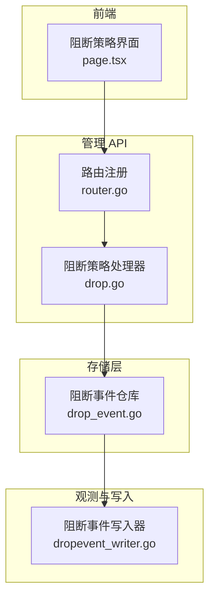
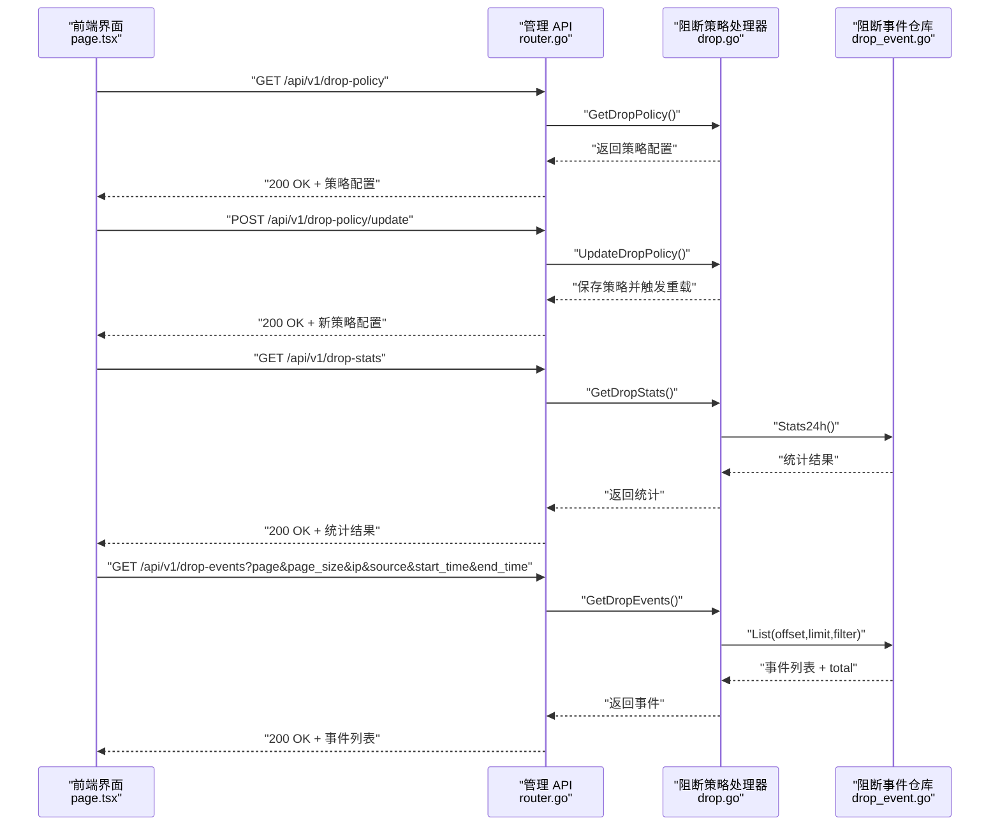
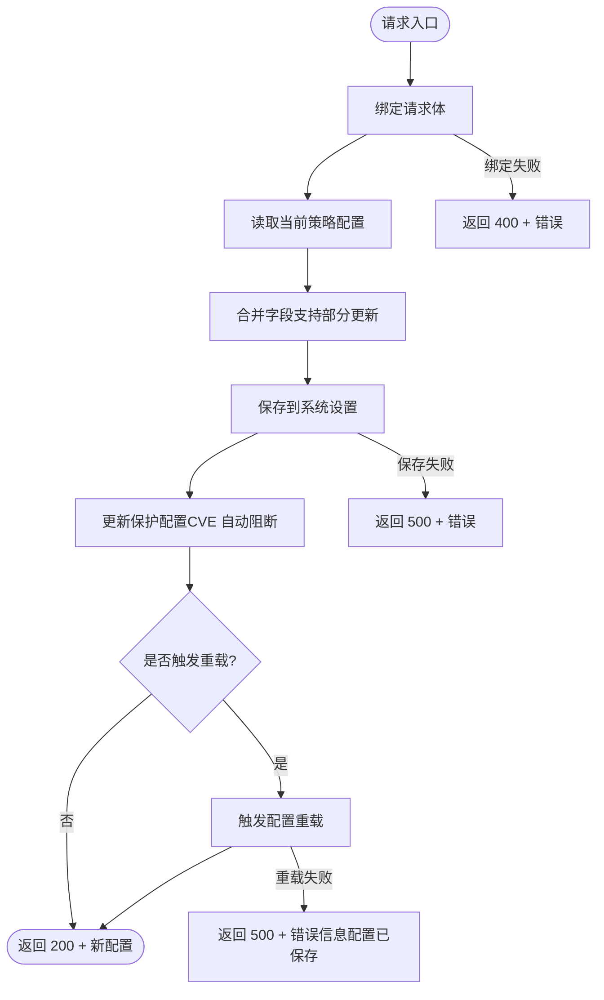
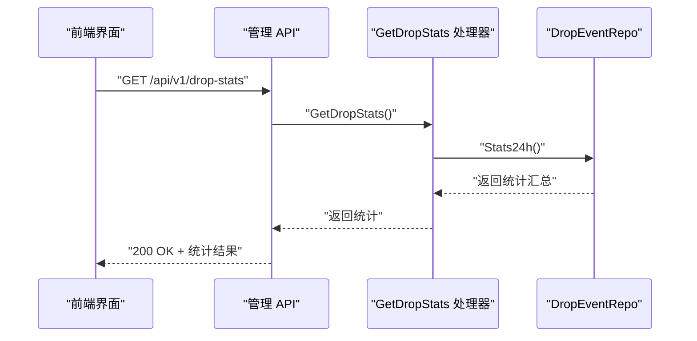
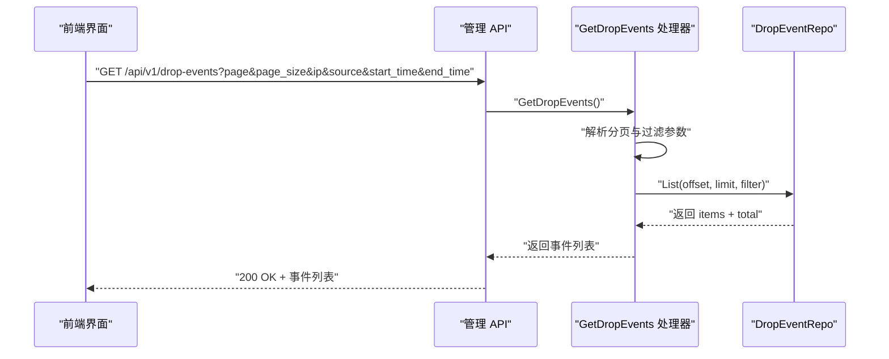
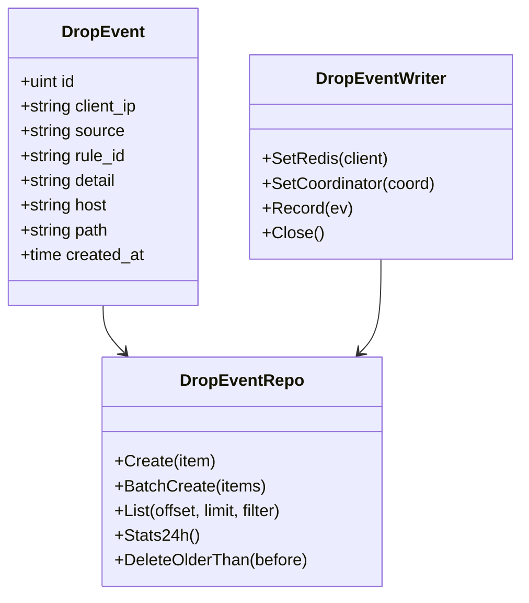
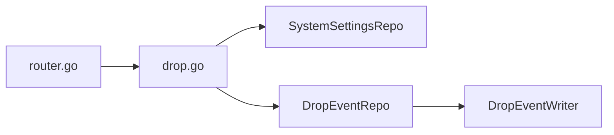

# 阻断策略 API

> [返回 管理 API 系统](管理 API 系统.md)

<cite>
**本文引用的文件**
- [drop.go](file://internal/admin/protect/drop.go)
- [router.go](file://internal/admin/router.go)
- [drop_event.go](file://internal/store/repository/drop_event.go)
- [drop.go](file://internal/waf/drop/drop.go)
- [dropevent_writer.go](file://internal/observability/dropevent_writer.go)
- [page.tsx](file://frontend/app/(dashboard)/drop-policy/page.tsx)
- [阻断机制.md](file://docs/安全防护功能/阻断机制.md)
- [API 端点参考.md](file://docs/管理 API 系统/REST API 设计规范/API 端点参考.md)
</cite>

## 目录
1. [简介](#简介)
2. [项目结构](#项目结构)
3. [核心组件](#核心组件)
4. [架构总览](#架构总览)
5. [详细组件分析](#详细组件分析)
6. [依赖分析](#依赖分析)
7. [性能考虑](#性能考虑)
8. [故障排除指南](#故障排除指南)
9. [结论](#结论)
10. [附录](#附录)

## 简介
本文件为阻断策略 API 的完整技术文档，涵盖阻断策略配置的获取与更新、阻断统计查询与阻断事件查询的 API 规范。阻断策略参数包括：启用状态、机器人分数阈值、CVE 自动阻断设置（Critical 和 High）。阻断统计提供 24 小时阻断总量与按来源（Bot、CVE、规则、IP 信誉）的分类统计；阻断事件查询支持按 IP、来源、时间范围过滤与分页。

## 项目结构
阻断策略 API 位于管理后台路由中，通过系统设置仓库持久化策略，并在更新后触发配置重载。阻断事件通过事件写入器异步落库，支持按来源与时间范围过滤查询。

**图示来源**
- [router.go:148-151](file://internal/admin/router.go#L148-L151)
- [drop.go:32-151](file://internal/admin/protect/drop.go#L32-L151)
- [drop_event.go:11-103](file://internal/store/repository/drop_event.go#L11-L103)
- [dropevent_writer.go:17-124](file://internal/observability/dropevent_writer.go#L17-L124)
- [page.tsx:12-43](file://frontend/app/(dashboard)/drop-policy/page.tsx#L12-L43)

**章节来源**
- [router.go:148-151](file://internal/admin/router.go#L148-L151)
- [drop.go:32-151](file://internal/admin/protect/drop.go#L32-L151)
- [drop_event.go:11-103](file://internal/store/repository/drop_event.go#L11-L103)
- [dropevent_writer.go:17-124](file://internal/observability/dropevent_writer.go#L17-L124)
- [page.tsx:12-43](file://frontend/app/(dashboard)/drop-policy/page.tsx#L12-L43)

## 核心组件
- 阻断策略处理器：提供获取与更新阻断策略配置的接口，支持部分字段更新。
- 阻断统计接口：提供 24 小时阻断统计与按来源分类统计。
- 阻断事件查询接口：支持按 IP、来源、时间范围过滤与分页查询。
- 阻断事件写入器：异步批量写入阻断事件，支持 Redis 双写与序列化写入协调。

**章节来源**
- [drop.go:32-151](file://internal/admin/protect/drop.go#L32-L151)
- [drop_event.go:11-103](file://internal/store/repository/drop_event.go#L11-L103)
- [dropevent_writer.go:17-124](file://internal/observability/dropevent_writer.go#L17-L124)

## 架构总览
阻断策略 API 的调用链路如下：前端通过管理 API 发起请求，路由将请求转发至阻断策略处理器；处理器读取或更新系统设置中的阻断策略配置，并在需要时触发配置重载；阻断事件通过写入器异步落库，供统计与事件查询接口使用。

**图示来源**
- [router.go:148-151](file://internal/admin/router.go#L148-L151)
- [drop.go:32-151](file://internal/admin/protect/drop.go#L32-L151)
- [drop_event.go:38-66](file://internal/store/repository/drop_event.go#L38-L66)

## 详细组件分析

### 阻断策略配置 API
- 获取策略配置
  - 方法：GET
  - 路径：/api/v1/drop-policy
  - 权限：readonly
  - 响应：包含启用状态、机器人分数阈值、CVE 自动阻断 Critical 与 High 设置的对象
  - 默认值：启用状态为 true，机器人分数阈值为 80，CVE 自动阻断 Critical 与 High 均为 true
- 更新策略配置
  - 方法：POST /api/v1/drop-policy/update
  - 权限：admin
  - 请求体：可选字段对象（enabled、bot_score_threshold、cve_auto_drop_critical、cve_auto_drop_high）
  - 行为：合并当前配置与请求体，保存到系统设置并触发配置重载；若重载失败，返回错误信息但已保存的配置仍生效

**图示来源**
- [drop.go:58-110](file://internal/admin/protect/drop.go#L58-L110)

**章节来源**
- [drop.go:32-110](file://internal/admin/protect/drop.go#L32-L110)
- [router.go:148-151](file://internal/admin/router.go#L148-L151)

### 阻断统计 API
- 24 小时阻断统计
  - 方法：GET
  - 路径：/api/v1/drop-stats
  - 权限：readonly
  - 响应：包含 total_24h 与按来源分类的统计（by_bot、by_cve、by_rule、by_ip_reputation）

**图示来源**
- [drop.go:112-121](file://internal/admin/protect/drop.go#L112-L121)
- [drop_event.go:83-102](file://internal/store/repository/drop_event.go#L83-L102)

**章节来源**
- [drop.go:112-121](file://internal/admin/protect/drop.go#L112-L121)
- [drop_event.go:83-102](file://internal/store/repository/drop_event.go#L83-L102)

### 阻断事件查询 API
- 阻断事件列表
  - 方法：GET
  - 路径：/api/v1/drop-events
  - 查询参数：
    - page：页码（默认 1）
    - page_size：每页条数（默认 20）
    - ip：按客户端 IP 过滤
    - source：按来源过滤（bot、cve、rule、ip_reputation）
    - start_time：开始时间（RFC3339）
    - end_time：结束时间（RFC3339）
  - 权限：readonly
  - 响应：items（事件列表）、total（总数）

**图示来源**
- [drop.go:123-151](file://internal/admin/protect/drop.go#L123-L151)
- [drop_event.go:38-66](file://internal/store/repository/drop_event.go#L38-L66)

**章节来源**
- [drop.go:123-151](file://internal/admin/protect/drop.go#L123-L151)
- [drop_event.go:17-66](file://internal/store/repository/drop_event.go#L17-L66)

### 阻断事件数据模型与写入
- 阻断事件模型包含：客户端 IP、来源（bot/cve/rule/ip_reputation）、规则 ID、详细描述、主机、路径、创建时间等字段
- 事件写入器支持：
  - 批量写入数据库（缓冲 + 定时刷新）
  - 可选 Redis 双写（用于实时消费）
  - 序列化写入协调（避免并发写入冲突）

**图示来源**
- [drop_event.go:17-102](file://internal/store/repository/drop_event.go#L17-L102)
- [dropevent_writer.go:17-124](file://internal/observability/dropevent_writer.go#L17-L124)

**章节来源**
- [drop_event.go:17-102](file://internal/store/repository/drop_event.go#L17-L102)
- [dropevent_writer.go:17-124](file://internal/observability/dropevent_writer.go#L17-L124)

## 依赖分析
- 路由依赖：/api/v1/drop-policy、/api/v1/drop-stats、/api/v1/drop-events 由路由注册映射到阻断策略处理器
- 处理器依赖：阻断策略处理器依赖系统设置仓库；阻断事件处理器依赖阻断事件仓库
- 事件写入：阻断事件写入器与阻断事件仓库协作，支持异步批量写入与可选 Redis 双写

**图示来源**
- [router.go:148-151](file://internal/admin/router.go#L148-L151)
- [drop.go:32-151](file://internal/admin/protect/drop.go#L32-L151)
- [drop_event.go:11-103](file://internal/store/repository/drop_event.go#L11-L103)
- [dropevent_writer.go:17-124](file://internal/observability/dropevent_writer.go#L17-L124)

**章节来源**
- [router.go:148-151](file://internal/admin/router.go#L148-L151)
- [drop.go:32-151](file://internal/admin/protect/drop.go#L32-L151)
- [drop_event.go:11-103](file://internal/store/repository/drop_event.go#L11-L103)
- [dropevent_writer.go:17-124](file://internal/observability/dropevent_writer.go#L17-L124)

## 性能考虑
- 异步批量写入：阻断事件写入器采用缓冲与定时刷新，批量写入数据库，避免阻塞热路径
- Redis 双写：可选的 Redis 列表推送，用于实时消费外部系统
- 原子统计：阻断执行器使用原子计数器，保证并发环境下的统计准确性
- 分页与过滤：事件查询支持分页与多条件过滤，避免一次性返回大量数据

**章节来源**
- [dropevent_writer.go:36-124](file://internal/observability/dropevent_writer.go#L36-L124)
- [drop.go:10-99](file://internal/waf/drop/drop.go#L10-L99)
- [drop_event.go:38-66](file://internal/store/repository/drop_event.go#L38-L66)

## 故障排除指南
- 获取策略失败
  - 检查系统设置仓库是否可用；若为空或解析失败，返回默认策略配置
- 更新策略失败
  - 绑定请求体失败返回 400；保存或重载失败返回 500；重载失败时配置仍会被保存
- 统计查询失败
  - 仓库查询异常返回 500；检查数据库连接与权限
- 事件查询失败
  - 解析时间参数失败时忽略该过滤条件；查询异常返回 500
- 事件未入库
  - 检查事件写入器缓冲区是否溢出；适当增大缓冲或批量大小

**章节来源**
- [drop.go:32-110](file://internal/admin/protect/drop.go#L32-L110)
- [drop.go:112-151](file://internal/admin/protect/drop.go#L112-L151)
- [dropevent_writer.go:63-124](file://internal/observability/dropevent_writer.go#L63-L124)

## 结论
阻断策略 API 提供了完整的阻断策略配置、统计与事件查询能力，支持实时监控与动态调整。通过异步事件写入与原子统计，系统在高并发场景下保持稳定与高效。建议结合业务流量特征合理配置阈值与页面，配合日志与监控体系进行持续优化。

## 附录
- API 定义（策略）
  - 获取策略：GET /api/v1/drop-policy
  - 更新策略：POST /api/v1/drop-policy/update
- API 定义（统计与事件）
  - 24 小时统计：GET /api/v1/drop-stats
  - 阻断事件列表：GET /api/v1/drop-events?page&page_size&ip&source&start_time&end_time
- 策略参数说明
  - enabled：启用全局阻断策略
  - bot_score_threshold：机器人自动阻断阈值
  - cve_auto_drop_critical：Critical 级别 CVE 自动断连
  - cve_auto_drop_high：High 级别 CVE 自动断连
- 事件来源
  - bot：机器人检测
  - cve：CVE 漏洞检测
  - rule：自定义规则
  - ip_reputation：IP 信誉

**章节来源**
- [API 端点参考.md:322-347](file://docs/管理 API 系统/REST API 设计规范/API 端点参考.md#L322-L347)
- [阻断机制.md:245-288](file://docs/安全防护功能/阻断机制.md#L245-L288)