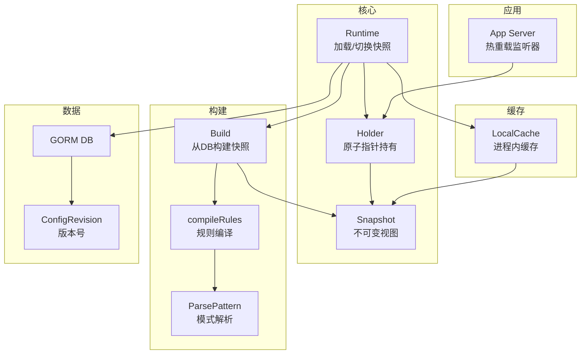
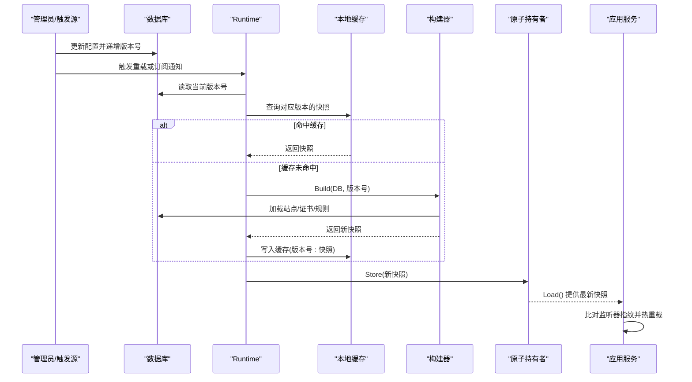
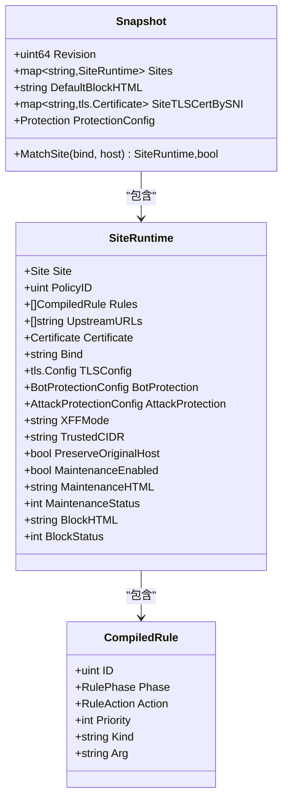
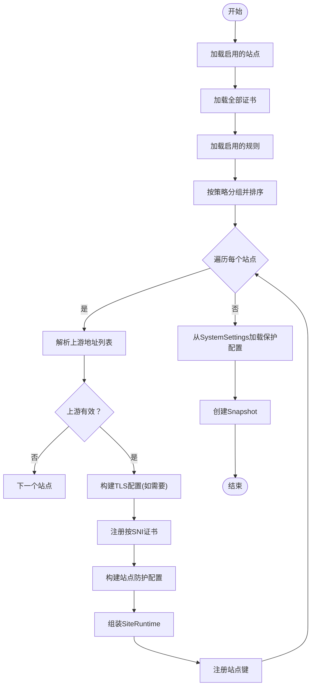
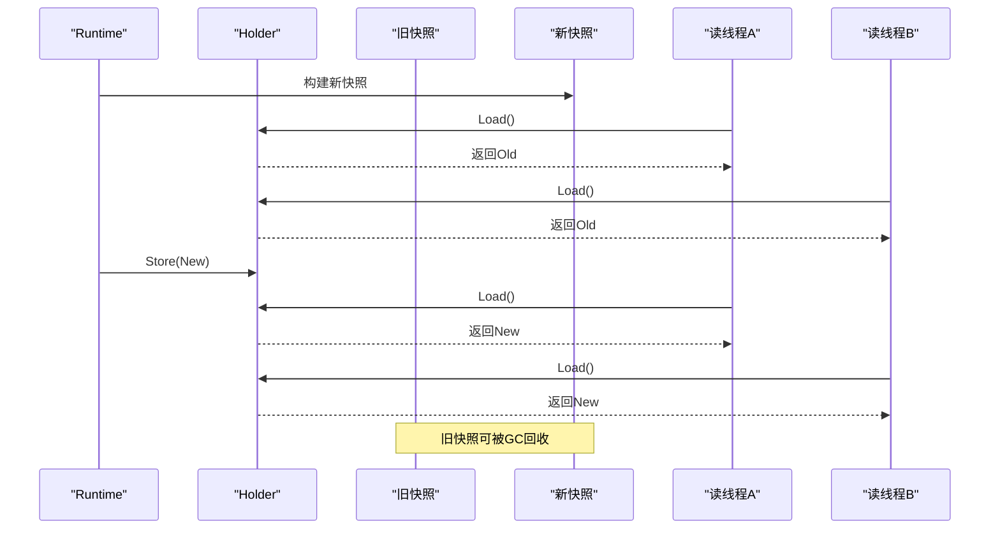
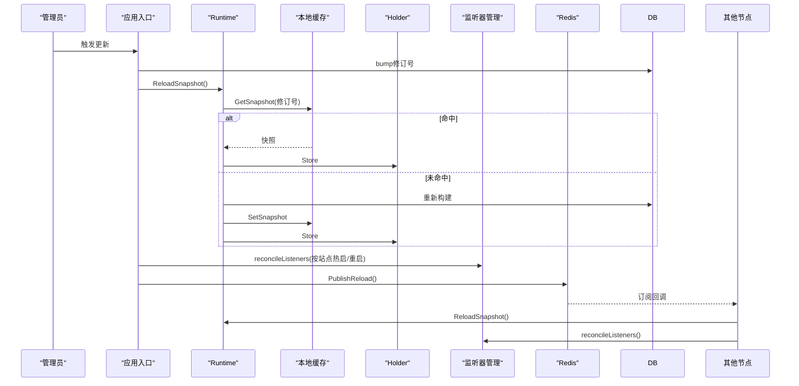
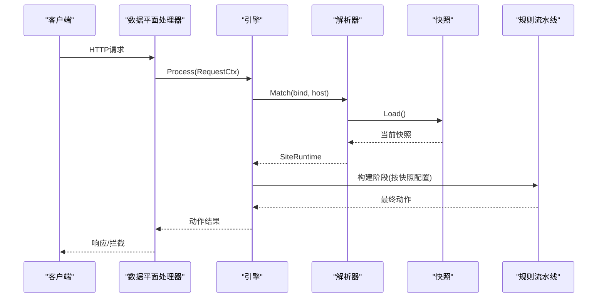
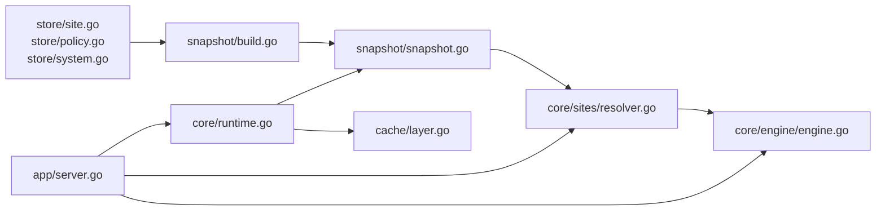

# 快照机制

<cite>
**本文引用的文件**
- [internal/snapshot/snapshot.go](file://internal/snapshot/snapshot.go)
- [internal/snapshot/build.go](file://internal/snapshot/build.go)
- [internal/core/runtime.go](file://internal/core/runtime.go)
- [internal/core/engine/engine.go](file://internal/core/engine/engine.go)
- [internal/core/sites/resolver.go](file://internal/core/sites/resolver.go)
- [internal/app/server.go](file://internal/app/server.go)
- [internal/store/site.go](file://internal/store/site.go)
- [internal/store/policy.go](file://internal/store/policy.go)
- [internal/store/system.go](file://internal/store/system.go)
- [internal/store/migrate.go](file://internal/store/migrate.go)
- [internal/cache/layer.go](file://internal/cache/layer.go)
- [internal/snapshot/snapshot_test.go](file://internal/snapshot/snapshot_test.go)
- [docs/架构设计/快照模式实现.md](file://docs/架构设计/快照模式实现.md)
- [docs/配置管理系统/配置快照机制.md](file://docs/配置管理系统/配置快照机制.md)
</cite>

## 目录
1. [引言](#引言)
2. [项目结构](#项目结构)
3. [核心组件](#核心组件)
4. [架构总览](#架构总览)
5. [详细组件分析](#详细组件分析)
6. [依赖分析](#依赖分析)
7. [性能考量](#性能考量)
8. [故障排查指南](#故障排查指南)
9. [结论](#结论)
10. [附录](#附录)

## 引言
本文件系统性阐述 My-OpenWaf 的“配置快照机制”。该机制通过不可变配置对象与原子指针切换，实现零停机配置更新与平滑过渡；通过版本号（revision）与本地缓存，确保高并发下的安全一致性；通过数据库驱动的快照构建流程，完成从规则、站点、证书到保护策略的完整序列化与校验。

## 项目结构
围绕配置快照的关键模块分布如下：
- 快照定义与匹配：internal/snapshot/snapshot.go
- 快照构建与规则编译：internal/snapshot/build.go
- 进程内快照缓存：internal/cache/layer.go
- 运行时加载与原子切换：internal/core/runtime.go
- 应用启动与监听器热重载：internal/app/server.go
- 数据模型与版本控制：internal/store/site.go、internal/store/policy.go、internal/store/system.go、internal/store/migrate.go
- 引擎与解析器：internal/core/engine/engine.go、internal/core/sites/resolver.go
- 测试与文档：internal/snapshot/snapshot_test.go、docs/架构设计/快照模式实现.md、docs/配置管理系统/配置快照机制.md

图表来源
- [internal/core/runtime.go:82-99](file://internal/core/runtime.go#L82-L99)
- [internal/snapshot/build.go:14-143](file://internal/snapshot/build.go#L14-L143)
- [internal/snapshot/snapshot.go:52-105](file://internal/snapshot/snapshot.go#L52-L105)
- [internal/cache/layer.go:19-64](file://internal/cache/layer.go#L19-L64)
- [internal/store/migrate.go:35-51](file://internal/store/migrate.go#L35-L51)
- [internal/app/server.go:139-200](file://internal/app/server.go#L139-L200)

章节来源
- [internal/snapshot/snapshot.go:1-105](file://internal/snapshot/snapshot.go#L1-L105)
- [internal/snapshot/build.go:1-214](file://internal/snapshot/build.go#L1-L214)
- [internal/cache/layer.go:1-65](file://internal/cache/layer.go#L1-L65)
- [internal/core/runtime.go:17-127](file://internal/core/runtime.go#L17-L127)
- [internal/app/server.go:1-200](file://internal/app/server.go#L1-L200)
- [internal/store/site.go:16-81](file://internal/store/site.go#L16-L81)
- [internal/store/policy.go:61-78](file://internal/store/policy.go#L61-L78)
- [internal/store/system.go:3-15](file://internal/store/system.go#L3-L15)
- [internal/store/migrate.go:1-60](file://internal/store/migrate.go#L1-L60)

## 核心组件
- 不可变快照对象：包含站点映射、默认封禁页、按 SNI 的证书映射以及全局保护配置。该对象在构建完成后不再修改，保证读路径的线程安全与高性能。
- 原子持有者：通过原子指针保存当前快照，任何读取方均可无锁安全访问。
- 构建器：从数据库加载启用的站点、证书与规则，编译为轻量运行时规则，并生成快照。
- 进程内缓存：以版本号为键缓存快照，避免重复构建。
- 版本管理：通过配置修订表维护递增版本号，作为快照键与缓存键的一部分。
- 运行时：负责数据库连接、可选 Redis、缓存层初始化，并提供 ReloadSnapshot 接口。
- 引擎与解析器：基于快照进行站点解析与规则链执行，实现零锁争用的读路径。

章节来源
- [internal/snapshot/snapshot.go:52-105](file://internal/snapshot/snapshot.go#L52-L105)
- [internal/snapshot/build.go:14-143](file://internal/snapshot/build.go#L14-L143)
- [internal/cache/layer.go:40-64](file://internal/cache/layer.go#L40-L64)
- [internal/store/migrate.go:35-51](file://internal/store/migrate.go#L35-L51)
- [internal/core/runtime.go:82-99](file://internal/core/runtime.go#L82-L99)
- [internal/core/engine/engine.go:56-128](file://internal/core/engine/engine.go#L56-L128)
- [internal/core/sites/resolver.go:18-31](file://internal/core/sites/resolver.go#L18-L31)

## 架构总览
下图展示从数据库到快照再到应用的数据流与控制流：

图表来源
- [internal/core/runtime.go:82-99](file://internal/core/runtime.go#L82-L99)
- [internal/cache/layer.go:50-59](file://internal/cache/layer.go#L50-L59)
- [internal/snapshot/build.go:14-143](file://internal/snapshot/build.go#L14-L143)
- [internal/app/server.go:139-200](file://internal/app/server.go#L139-L200)

## 详细组件分析

### 不可变快照与站点运行时
- Snapshot：包含站点映射、默认拦截页、按 SNI 的证书映射、全局保护配置。这些字段构成一个整体的只读视图，适合多 goroutine 并发读取。
- SiteRuntime：将数据库模型转换为运行时视图，包含规则数组、上游地址、TLS 配置、防护参数、转发设置、维护与封禁页面等。这些字段均来自数据库的持久化结构，构建后保持不变。
- 匹配逻辑：提供基于绑定地址与 Host 的精确匹配、通配符匹配与回退匹配，确保路由决策稳定可靠。

图表来源
- [internal/snapshot/snapshot.go:52-96](file://internal/snapshot/snapshot.go#L52-L96)
- [internal/store/site.go:16-81](file://internal/store/site.go#L16-L81)

章节来源
- [internal/snapshot/snapshot.go:11-105](file://internal/snapshot/snapshot.go#L11-L105)
- [internal/store/site.go:16-81](file://internal/store/site.go#L16-L81)

### 快照构建器：验证、编译与一致性
- 数据加载：查询启用的站点、所有证书、启用的规则，并按策略分组排序。
- 规则排序：优先按优先级升序，其次按 ID 升序。
- 规则编译：解析 DSL 形式的 Pattern，生成轻量规则对象。
- TLS 处理：根据站点证书生成 tls.Config，并注册按 SNI 的证书键。
- 保护配置：从 SystemSettings 中加载全局保护配置。
- 一致性检查：站点上游地址非空才纳入；证书存在才注册；规则按策略与优先级组织。

图表来源
- [internal/snapshot/build.go:14-143](file://internal/snapshot/build.go#L14-L143)
- [internal/store/site.go:16-81](file://internal/store/site.go#L16-L81)

章节来源
- [internal/snapshot/build.go:14-143](file://internal/snapshot/build.go#L14-L143)
- [internal/store/site.go:16-81](file://internal/store/site.go#L16-L81)

### 原子指针切换机制
- 快照持有者 Holder 使用原子指针保存 Snapshot 指针。
- 读路径：Resolver/Engine 通过 Load 获取当前快照，无需锁。
- 写路径：Runtime 在构建完成后 Store 新快照，旧快照由 GC 回收。
- CAS 语义：保证切换期间读操作不会看到部分写入的中间状态。
- 零停机：切换瞬间完成，无请求等待或阻塞。

图表来源
- [internal/snapshot/snapshot.go:98-105](file://internal/snapshot/snapshot.go#L98-L105)
- [internal/core/sites/resolver.go:28-31](file://internal/core/sites/resolver.go#L28-L31)
- [internal/core/engine/engine.go:56-61](file://internal/core/engine/engine.go#L56-L61)

章节来源
- [internal/snapshot/snapshot.go:98-105](file://internal/snapshot/snapshot.go#L98-L105)
- [internal/core/sites/resolver.go:28-31](file://internal/core/sites/resolver.go#L28-L31)
- [internal/core/engine/engine.go:56-61](file://internal/core/engine/engine.go#L56-L61)

### 热重载机制：监听器协调与跨节点同步
- 修订号驱动：每次更新前 bump 配置修订号，触发重建。
- 本地缓存命中：若同一修订号已构建过快照，直接复用。
- 原子替换：构建完成后写入缓存并 Store 到 Holder。
- 监听器协调：按站点维度重建监听器，检测配置漂移（绑定、TLS、证书变更）并热重启受影响实例。
- 跨节点同步：通过 Redis 发布订阅通知其他节点，各自从 DB 重载并应用。

图表来源
- [internal/app/server.go:215-255](file://internal/app/server.go#L215-L255)
- [internal/cache/layer.go:40-64](file://internal/cache/layer.go#L40-L64)
- [internal/core/runtime.go:82-99](file://internal/core/runtime.go#L82-L99)

章节来源
- [internal/app/server.go:145-255](file://internal/app/server.go#L145-L255)
- [internal/cache/layer.go:40-64](file://internal/cache/layer.go#L40-L64)
- [internal/core/runtime.go:82-99](file://internal/core/runtime.go#L82-L99)

### 请求处理流水线与站点解析
- 引擎在每次请求中获取当前快照，解析站点，执行多阶段规则链（IP信誉、ACL、机器人检测、速率限制、OWASP、CVE、签名、自定义）。
- 维护模式与站点拦截页：若开启维护或站点拦截页，则直接返回拦截动作。
- 规则编译：将快照中的规则转换为内部可执行形式。

图表来源
- [internal/core/engine/engine.go:56-128](file://internal/core/engine/engine.go#L56-L128)
- [internal/core/sites/resolver.go:18-31](file://internal/core/sites/resolver.go#L18-L31)

章节来源
- [internal/core/engine/engine.go:56-128](file://internal/core/engine/engine.go#L56-L128)
- [internal/core/sites/resolver.go:18-31](file://internal/core/sites/resolver.go#L18-L31)

## 依赖分析
- 组件耦合
  - Runtime 依赖数据库、本地缓存与快照持有者，负责版本号读取与原子切换。
  - 快照构建器依赖数据库与规则解析工具，输出不可变快照。
  - 应用层依赖快照持有者进行路由与监听器管理。
- 外部依赖
  - 数据库：GORM 访问站点、证书、规则与系统设置。
  - 缓存：Ristretto 提供进程内键值缓存。
  - TLS：标准库证书处理与配置。

图表来源
- [internal/store/site.go:16-81](file://internal/store/site.go#L16-L81)
- [internal/store/policy.go:61-78](file://internal/store/policy.go#L61-L78)
- [internal/store/system.go:3-15](file://internal/store/system.go#L3-L15)
- [internal/snapshot/build.go:14-143](file://internal/snapshot/build.go#L14-L143)
- [internal/snapshot/snapshot.go:52-96](file://internal/snapshot/snapshot.go#L52-L96)
- [internal/core/sites/resolver.go:18-31](file://internal/core/sites/resolver.go#L18-L31)
- [internal/core/engine/engine.go:26-36](file://internal/core/engine/engine.go#L26-L36)
- [internal/core/runtime.go:82-99](file://internal/core/runtime.go#L82-L99)
- [internal/cache/layer.go:40-64](file://internal/cache/layer.go#L40-L64)
- [internal/app/server.go:145-255](file://internal/app/server.go#L145-L255)

章节来源
- [internal/store/site.go:16-81](file://internal/store/site.go#L16-L81)
- [internal/store/policy.go:61-78](file://internal/store/policy.go#L61-L78)
- [internal/store/system.go:3-15](file://internal/store/system.go#L3-L15)
- [internal/snapshot/build.go:14-143](file://internal/snapshot/build.go#L14-L143)
- [internal/snapshot/snapshot.go:52-96](file://internal/snapshot/snapshot.go#L52-L96)
- [internal/core/sites/resolver.go:18-31](file://internal/core/sites/resolver.go#L18-L31)
- [internal/core/engine/engine.go:26-36](file://internal/core/engine/engine.go#L26-L36)
- [internal/core/runtime.go:82-99](file://internal/core/runtime.go#L82-L99)
- [internal/cache/layer.go:40-64](file://internal/cache/layer.go#L40-L64)
- [internal/app/server.go:145-255](file://internal/app/server.go#L145-L255)

## 性能考量
- 读路径优化
  - 不可变快照与原子指针切换避免锁竞争，读取开销极低。
  - 本地缓存命中后直接返回，避免数据库与构建开销。
- 写路径优化
  - 构建过程批量加载与排序，减少多次往返。
  - 规则编译采用轻量结构，降低内存占用。
- 缓存策略
  - 进程内缓存使用 Ristretto，具备高效的键值存储与淘汰策略。
  - 建议结合业务流量特征调整缓存容量与计数器规模。
- 其他参考
  - 响应缓存（非快照）采用分片与后台清理，可作为缓存治理参考。

章节来源
- [internal/cache/layer.go:27-38](file://internal/cache/layer.go#L27-L38)
- [internal/cache/response_cache.go:25-54](file://internal/cache/response_cache.go#L25-L54)
- [internal/cache/response_cache.go:142-162](file://internal/cache/response_cache.go#L142-L162)

## 故障排查指南
- 快照构建失败
  - 检查数据库连接与权限，确认站点、证书与规则表存在且可读。
  - 关注构建器中的错误返回路径，定位具体加载阶段。
  - 参考路径：[internal/snapshot/build.go:14-143](file://internal/snapshot/build.go#L14-L143)
- 版本号异常
  - 确认配置修订表存在且可 FirstOrCreate 成功，必要时手动初始化。
  - 参考路径：[internal/store/migrate.go:35-51](file://internal/store/migrate.go#L35-L51)
- 监听器未热重载
  - 检查应用层的监听器重建逻辑是否执行，确认指纹比较与标签更新正确。
  - 参考路径：[internal/app/server.go:139-200](file://internal/app/server.go#L139-L200)
- 缓存未命中
  - 确认版本号是否递增，缓存键格式是否一致，以及缓存是否被意外清空。
  - 参考路径：[internal/cache/layer.go:40-64](file://internal/cache/layer.go#L40-L64)

章节来源
- [internal/snapshot/build.go:14-143](file://internal/snapshot/build.go#L14-L143)
- [internal/store/migrate.go:35-51](file://internal/store/migrate.go#L35-L51)
- [internal/app/server.go:139-200](file://internal/app/server.go#L139-L200)
- [internal/cache/layer.go:40-64](file://internal/cache/layer.go#L40-L64)

## 结论
该配置快照机制通过“不可变对象 + 原子指针 + 版本号 + 本地缓存”的组合，实现了高可用、零停机的配置更新与平滑过渡。构建流程严谨，覆盖站点、证书、规则与保护策略，满足生产环境对一致性与性能的要求。建议在生产环境中结合监控与告警，持续观察缓存命中率与构建耗时，以进一步优化性能与稳定性。

## 附录
- 全局配置项与默认值
  - 参考路径：[internal/core/config.go:56-78](file://internal/core/config.go#L56-L78)
- 数据模型与保护配置
  - 参考路径：[internal/store/site.go:16-81](file://internal/store/site.go#L16-L81)
  - 参考路径：[internal/store/policy.go:61-78](file://internal/store/policy.go#L61-L78)
  - 参考路径：[internal/store/system.go:3-15](file://internal/store/system.go#L3-L15)
  - 参考路径：[internal/store/migrate.go:35-51](file://internal/store/migrate.go#L35-L51)
- API 使用示例（路径指引）
  - 创建/刷新快照
    - 触发重载：调用运行时重载方法，内部会先读取当前版本号，再尝试从缓存获取，若未命中则构建新快照并写入缓存，最后原子切换。
    - 参考路径：[internal/core/runtime.go:82-99](file://internal/core/runtime.go#L82-L99)
  - 查询当前快照
    - 读取当前快照：通过原子持有者加载最新快照，随后可进行站点匹配与路由决策。
    - 参考路径：[internal/snapshot/snapshot.go:103-105](file://internal/snapshot/snapshot.go#L103-L105)
  - 销毁/失效缓存
    - 清空本地缓存：清空整个本地快照缓存，强制后续请求重新构建。
    - 参考路径：[internal/cache/layer.go:61-64](file://internal/cache/layer.go#L61-L64)
- 快照构建的完整流程图与相关代码实现细节
  - 快照构建流程图已在“详细组件分析”部分以流程图形式呈现。
  - 相关实现细节参考以下文件：
    - 快照构建：[internal/snapshot/build.go:14-143](file://internal/snapshot/build.go#L14-L143)
    - 快照持有者与原子切换：[internal/snapshot/snapshot.go:98-105](file://internal/snapshot/snapshot.go#L98-L105)
    - 运行时热重载：[internal/core/runtime.go:82-99](file://internal/core/runtime.go#L82-L99)
    - 引擎请求处理：[internal/core/engine/engine.go:56-128](file://internal/core/engine/engine.go#L56-L128)
    - 监听器协调与跨节点同步：[internal/app/server.go:145-255](file://internal/app/server.go#L145-L255)
    - 存储模型与保护配置：[internal/store/site.go:16-81](file://internal/store/site.go#L16-L81)
    - 本地快照缓存：[internal/cache/layer.go:40-64](file://internal/cache/layer.go#L40-L64)
    - 启动入口：[cmd/main.go:7-9](file://cmd/main.go#L7-L9)