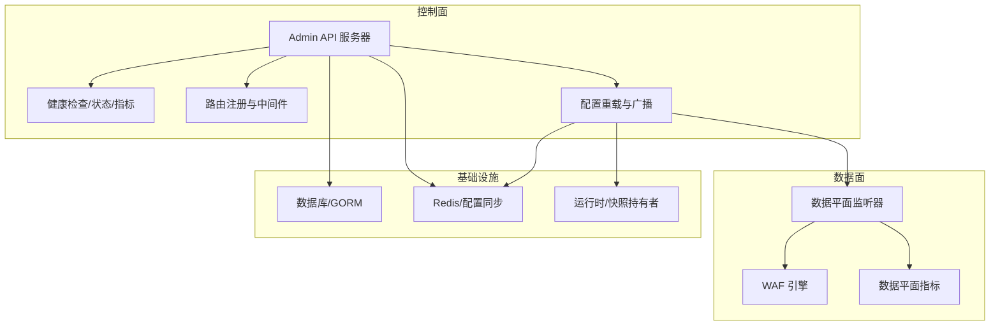
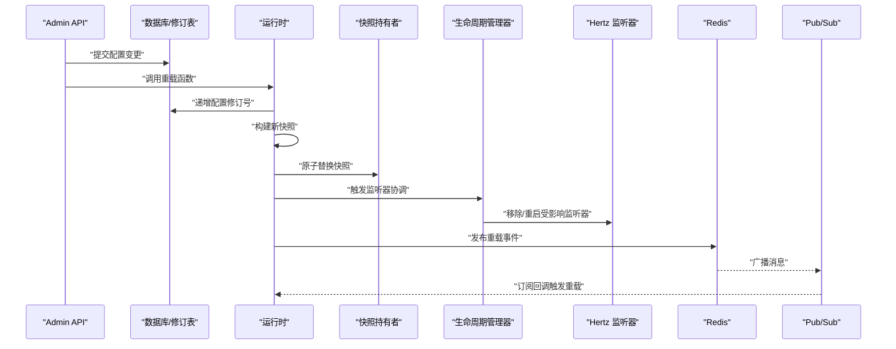
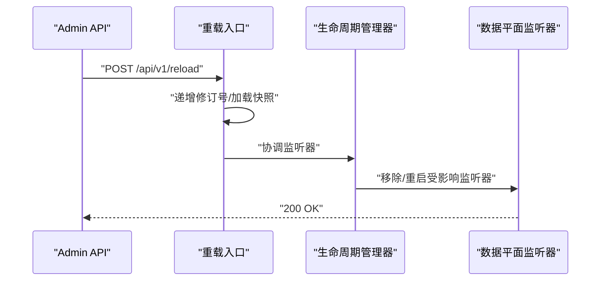
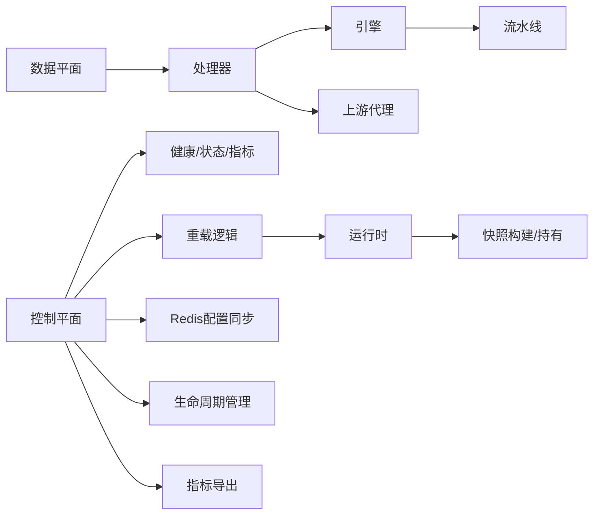

# 控制面设计

> [返回 系统架构设计](系统架构设计.md)

<cite>
**本文引用的文件**
- [cmd/main.go](file://cmd/main.go)
- [internal/app/server.go](file://internal/app/server.go)
- [internal/admin/router.go](file://internal/admin/router.go)
- [internal/admin/middleware.go](file://internal/admin/middleware.go)
- [internal/core/health/health.go](file://internal/core/health/health.go)
- [internal/core/lifecycle/lifecycle.go](file://internal/core/lifecycle/lifecycle.go)
- [internal/observability/metrics.go](file://internal/observability/metrics.go)
- [internal/admin/system/settings.go](file://internal/admin/system/settings.go)
- [internal/admin/system/dashboard.go](file://internal/admin/system/dashboard.go)
- [internal/dataplane/metrics.go](file://internal/dataplane/metrics.go)
- [internal/admin/system/apikey.go](file://internal/admin/system/apikey.go)
- [internal/dataplane/handler.go](file://internal/dataplane/handler.go)
</cite>

## 目录
1. [简介](#简介)
2. [项目结构](#项目结构)
3. [核心组件](#核心组件)
4. [架构总览](#架构总览)
5. [详细组件分析](#详细组件分析)
6. [依赖关系分析](#依赖关系分析)
7. [性能考量](#性能考量)
8. [故障排查指南](#故障排查指南)
9. [结论](#结论)
10. [附录](#附录)

## 简介
本文件面向 My-OpenWaf 的控制面设计，系统性阐述控制面的核心职责、架构与实现细节，重点覆盖以下方面：
- 管理端口与健康/就绪/状态/指标接口的设计与实现
- 路由注册机制与中间件体系
- 生命周期管理与优雅停机
- 配置变更协调与热重载流程
- 控制面与数据面的交互模式与统一控制
- 最佳实践与常见问题排查

## 项目结构
控制面位于应用入口之后，由 Hertz 服务器承载，提供管理 API、健康检查、状态查询与指标导出等能力。其核心职责包括：
- 提供受控的管理接口（认证、授权、审计）
- 暴露健康/就绪/状态/指标端点
- 协调配置变更与数据面热重载
- 统一生命周期管理与信号处理

**图表来源**
- [internal/app/server.go:351-396](file://internal/app/server.go#L351-L396)
- [internal/admin/router.go:46-244](file://internal/admin/router.go#L46-L244)
- [internal/core/health/health.go:14-96](file://internal/core/health/health.go#L14-L96)
- [internal/observability/metrics.go:51-125](file://internal/observability/metrics.go#L51-L125)

**章节来源**
- [cmd/main.go:1-10](file://cmd/main.go#L1-L10)
- [internal/app/server.go:52-396](file://internal/app/server.go#L52-L396)

## 核心组件
- 控制面服务器与路由注册
  - 在应用启动时创建 Hertz 服务器，注册健康/就绪/状态/指标端点，并委托 admin 包完成业务路由注册。
  - 参考路径：[internal/app/server.go:351-371](file://internal/app/server.go#L351-L371)，[internal/admin/router.go:46-244](file://internal/admin/router.go#L46-L244)

- 中间件体系
  - 安全头中间件、访问日志中间件、认证中间件（支持 Bearer JWT 与 API Key）、角色权限中间件。
  - 参考路径：[internal/admin/middleware.go:16-129](file://internal/admin/middleware.go#L16-L129)

- 健康检查与状态查询
  - 提供 /healthz（存活探针）、/readyz（就绪探针）、/status（运行时状态）。
  - 参考路径：[internal/core/health/health.go:14-96](file://internal/core/health/health.go#L14-L96)

- 指标导出
  - Prometheus 兼容的 /metrics 端点，输出请求总量、阻断总量、观察总量、内置规则命中、缓存命中/未命中、上游错误、运行时指标等。
  - 参考路径：[internal/observability/metrics.go:51-125](file://internal/observability/metrics.go#L51-L125)

- 生命周期管理
  - 统一管理多个 Hertz 服务器的启动、停止、信号等待与优雅关闭。
  - 参考路径：[internal/core/lifecycle/lifecycle.go:30-178](file://internal/core/lifecycle/lifecycle.go#L30-L178)

**章节来源**
- [internal/app/server.go:351-371](file://internal/app/server.go#L351-L371)
- [internal/admin/router.go:46-244](file://internal/admin/router.go#L46-L244)
- [internal/admin/middleware.go:16-129](file://internal/admin/middleware.go#L16-L129)
- [internal/core/health/health.go:14-96](file://internal/core/health/health.go#L14-L96)
- [internal/observability/metrics.go:51-125](file://internal/observability/metrics.go#L51-L125)
- [internal/core/lifecycle/lifecycle.go:30-178](file://internal/core/lifecycle/lifecycle.go#L30-L178)

## 架构总览
控制面与数据面通过“配置快照”与“生命周期管理器”实现解耦协作：
- 控制面负责接收配置变更请求，触发重载流程并广播通知
- 数据面根据快照动态增删站点级监听器，实现按需重启与零停机切换
- Redis Pub/Sub 用于跨节点同步配置变更，保证多实例一致性

**图表来源**
- [internal/app/server.go:313-349](file://internal/app/server.go#L313-L349)
- [internal/core/runtime.go:82-99](file://internal/core/runtime.go#L82-L99)
- [internal/core/redis/pubsub.go:33-68](file://internal/core/redis/pubsub.go#L33-L68)

**章节来源**
- [internal/app/server.go:313-349](file://internal/app/server.go#L313-L349)

## 详细组件分析

### 控制面端口与管理接口
- 管理端口绑定与路由注册
  - 控制面服务器在 AdminBind 地址上启动，注册 /healthz、/readyz、/status、/metrics，并委托 admin 包注册业务路由。
  - 参考路径：[internal/app/server.go:351-371](file://internal/app/server.go#L351-L371)

- 管理 API 路由分组与权限控制
  - 使用 /api/v1 前缀，按只读、运维、管理员三类角色划分路由。
  - 参考路径：[internal/admin/router.go:66-234](file://internal/admin/router.go#L66-L234)

- 管理 API 的典型端点
  - 设置项管理：列出、创建、更新、删除系统设置，并在成功后触发重载。
  - 参考路径：[internal/admin/system/settings.go:11-99](file://internal/admin/system/settings.go#L11-L99)

- API 密钥管理
  - 列表、创建、删除 API Key，支持以管理员角色直接操作。
  - 参考路径：[internal/admin/system/apikey.go:16-59](file://internal/admin/system/apikey.go#L16-L59)

- 仪表盘摘要
  - 聚合实时数据平面指标与数据库统计，带 Redis 缓存优化。
  - 参考路径：[internal/admin/system/dashboard.go:25-84](file://internal/admin/system/dashboard.go#L25-L84)

**章节来源**
- [internal/app/server.go:351-371](file://internal/app/server.go#L351-L371)
- [internal/admin/router.go:66-234](file://internal/admin/router.go#L66-L234)
- [internal/admin/system/settings.go:11-99](file://internal/admin/system/settings.go#L11-L99)
- [internal/admin/system/apikey.go:16-59](file://internal/admin/system/apikey.go#L16-L59)
- [internal/admin/system/dashboard.go:25-84](file://internal/admin/system/dashboard.go#L25-L84)

### 中间件体系
- 认证中间件
  - 白名单跳过：/healthz 与 /api/v1/auth/* 不需要认证
  - 支持 Bearer JWT 与 API Key，失败返回 401
  - 成功后注入用户身份与角色信息
  - 参考路径：[internal/admin/middleware.go:18-72](file://internal/admin/middleware.go#L18-L72)

- 角色权限中间件
  - 指定允许的角色集合，拒绝无权限访问
  - 参考路径：[internal/admin/middleware.go:76-96](file://internal/admin/middleware.go#L76-L96)

- 访问日志中间件
  - 生成 X-Request-ID，记录请求方法、路径、状态码、耗时与认证方式
  - 参考路径：[internal/admin/middleware.go:99-119](file://internal/admin/middleware.go#L99-L119)

- 安全头中间件
  - 设置 X-Content-Type-Options、X-Frame-Options、Referrer-Policy、Content-Security-Policy
  - 参考路径：[internal/admin/middleware.go:121-129](file://internal/admin/middleware.go#L121-L129)

**章节来源**
- [internal/admin/middleware.go:18-129](file://internal/admin/middleware.go#L18-L129)

### 健康检查、状态查询与指标导出
- 健康检查
  - /healthz：存活探针，总是返回 200/503
  - /readyz：就绪探针，依赖数据库连通性与快照加载
  - /status：返回运行时状态（存活、就绪、快照修订、站点/监听器数量、goroutine 数、堆内存、Go 版本、CPU 数）
  - 参考路径：[internal/core/health/health.go:40-96](file://internal/core/health/health.go#L40-L96)

- 指标导出
  - /metrics：Prometheus 文本格式，包含请求总量、阻断总量、观察总量、内置规则命中、缓存命中/未命中、上游错误、运行时指标等
  - 参考路径：[internal/observability/metrics.go:51-125](file://internal/observability/metrics.go#L51-L125)

- 数据平面指标
  - 数据平面独立的 Metrics 结构，提供 QPS、请求总数、状态码分布、WAF 行为计数、唯一 IP/攻击 IP 等
  - 参考路径：[internal/dataplane/metrics.go:8-133](file://internal/dataplane/metrics.go#L8-L133)

**章节来源**
- [internal/core/health/health.go:40-96](file://internal/core/health/health.go#L40-L96)
- [internal/observability/metrics.go:51-125](file://internal/observability/metrics.go#L51-L125)
- [internal/dataplane/metrics.go:8-133](file://internal/dataplane/metrics.go#L8-L133)

### 配置变更与热重载
- 重载入口与流程
  - 通过 /api/v1/settings/* 或 /api/v1/reload 等端点触发重载
  - 重载步骤：递增修订号、重新加载快照、应用运行时保护配置、热重载数据面监听器、Redis 广播
  - 参考路径：[internal/app/server.go:313-349](file://internal/app/server.go#L313-L349)，[internal/admin/system/settings.go:101-109](file://internal/admin/system/settings.go#L101-L109)

- 监听器协调与漂移检测
  - 按绑定地址聚合站点运行时，生成指纹标签，检测配置漂移并自动重启受影响监听器
  - 参考路径：[internal/app/server.go:253-311](file://internal/app/server.go#L253-L311)

- 分布式同步
  - Redis Pub/Sub 订阅/发布配置重载事件，跨节点保持一致
  - 参考路径：[internal/app/server.go:336-349](file://internal/app/server.go#L336-L349)

**章节来源**
- [internal/app/server.go:313-349](file://internal/app/server.go#L313-L349)
- [internal/admin/system/settings.go:101-109](file://internal/admin/system/settings.go#L101-L109)
- [internal/app/server.go:253-311](file://internal/app/server.go#L253-L311)
- [internal/app/server.go:336-349](file://internal/app/server.go#L336-L349)

### 控制面与数据面交互模式
- 控制面职责
  - 接收配置变更请求，执行校验与持久化
  - 触发重载流程，协调数据面监听器热切换
  - 提供健康/就绪/状态/指标端点，支撑运维与自动化

- 数据面职责
  - 基于快照执行请求处理，按动作类型进行拦截、放行或转发
  - 维护独立指标，与控制面指标互补
  - 参考路径：[internal/dataplane/handler.go:68-200](file://internal/dataplane/handler.go#L68-L200)

**图表来源**
- [internal/admin/system/settings.go:101-109](file://internal/admin/system/settings.go#L101-L109)
- [internal/app/server.go:313-349](file://internal/app/server.go#L313-L349)

**章节来源**
- [internal/dataplane/handler.go:68-200](file://internal/dataplane/handler.go#L68-L200)

## 依赖关系分析
- 控制面依赖
  - 管理路由注册依赖 Hertz；健康检查与状态查询依赖运行时；指标导出依赖可观测性模块
- 数据面依赖
  - Handler 依赖快照持有器、引擎、指标、事件写入器与日志；引擎依赖 Resolver、规则编译与流水线；上游代理依赖共享传输层
- 分布式一致性
  - Redis 配置同步依赖 Redis 客户端；生命周期管理统一调度多个 Hertz 实例

**图表来源**
- [internal/app/server.go:351-396](file://internal/app/server.go#L351-L396)
- [internal/admin/router.go:46-244](file://internal/admin/router.go#L46-L244)
- [internal/core/health/health.go:14-96](file://internal/core/health/health.go#L14-L96)
- [internal/observability/metrics.go:51-125](file://internal/observability/metrics.go#L51-L125)

**章节来源**
- [internal/app/server.go:351-396](file://internal/app/server.go#L351-L396)
- [internal/admin/router.go:46-244](file://internal/admin/router.go#L46-L244)
- [internal/core/health/health.go:14-96](file://internal/core/health/health.go#L14-L96)
- [internal/observability/metrics.go:51-125](file://internal/observability/metrics.go#L51-L125)

## 性能考量
- 轻量级健康/状态/指标实现，便于集成 Prometheus 与容器编排系统
- 数据平面指标采用原子计数与环形缓冲，降低锁竞争与内存增长
- 重载流程按站点粒度热切换监听器，减少停机窗口
- Redis Pub/Sub 适合低频配置广播，高频事件建议评估内存与网络开销

## 故障排查指南
- 健康检查异常
  - /readyz 返回 not ready：检查数据库连通性与快照加载状态
  - 参考路径：[internal/core/health/health.go:28-38](file://internal/core/health/health.go#L28-L38)

- 认证失败
  - 401 缺少或无效 Authorization 头：确认使用 Bearer <token> 或 API Key
  - 参考路径：[internal/admin/middleware.go:29-41](file://internal/admin/middleware.go#L29-L41)

- 权限不足
  - 403 访问被拒绝：确认角色权限是否满足端点要求
  - 参考路径：[internal/admin/middleware.go:84-93](file://internal/admin/middleware.go#L84-L93)

- 配置重载失败
  - 重载后状态异常：检查数据库修订号递增、快照重建、监听器协调与 Redis 广播
  - 参考路径：[internal/app/server.go:313-349](file://internal/app/server.go#L313-L349)

**章节来源**
- [internal/core/health/health.go:28-38](file://internal/core/health/health.go#L28-L38)
- [internal/admin/middleware.go:29-41](file://internal/admin/middleware.go#L29-L41)
- [internal/admin/middleware.go:84-93](file://internal/admin/middleware.go#L84-L93)
- [internal/app/server.go:313-349](file://internal/app/server.go#L313-L349)

## 结论
My-OpenWaf 控制面以 Hertz 为核心，结合中间件体系、健康/状态/指标端点与统一生命周期管理，实现了对配置变更的集中控制与数据面的热重载协同。通过快照模式与 Redis 分布式同步，控制面与数据面在高并发场景下保持稳定与可扩展。

## 附录
- 快照模式与原子切换：不可变对象与原子指针实现零停机切换
- 监听器热重载：按站点粒度重启监听器，减少停机窗口
- 指标与健康检查：轻量实现，便于 Prometheus 集成与容器编排