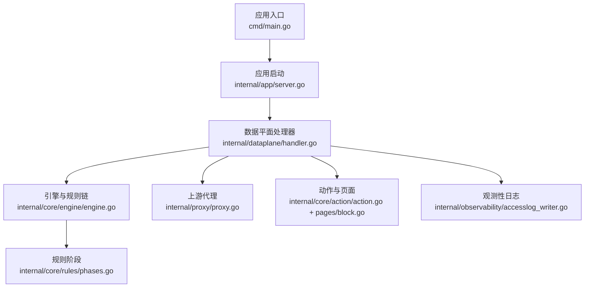
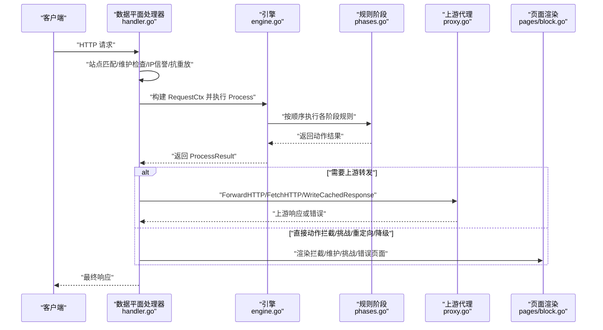
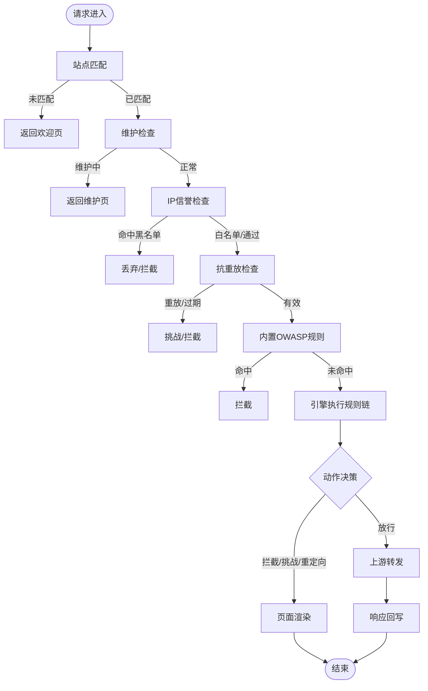
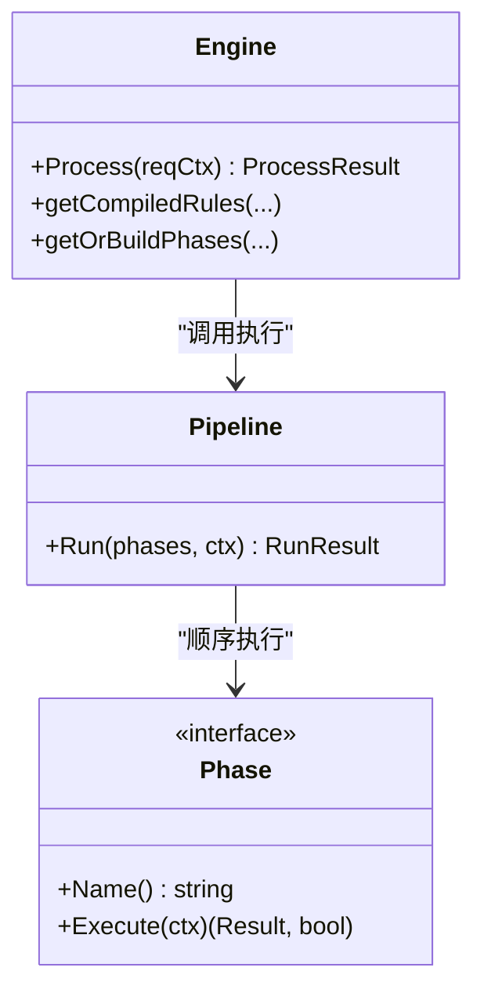
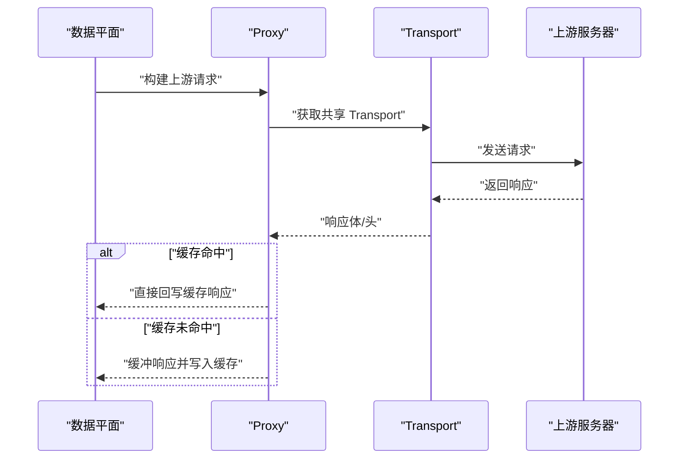
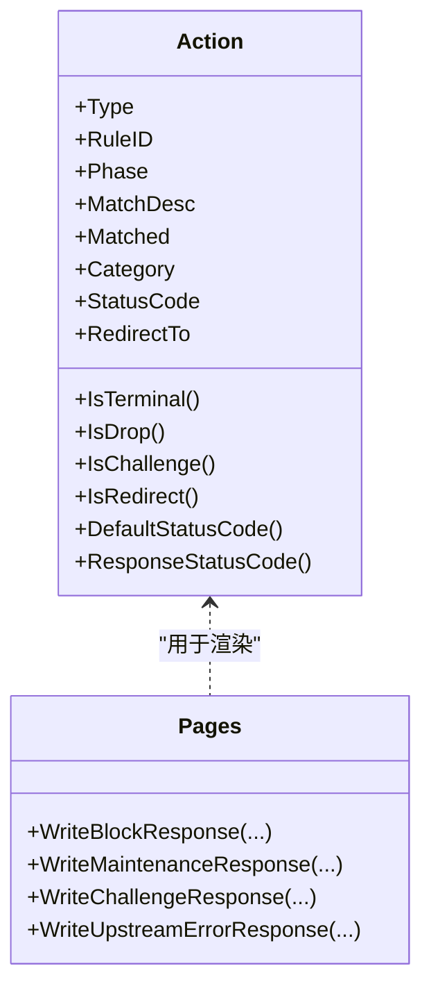
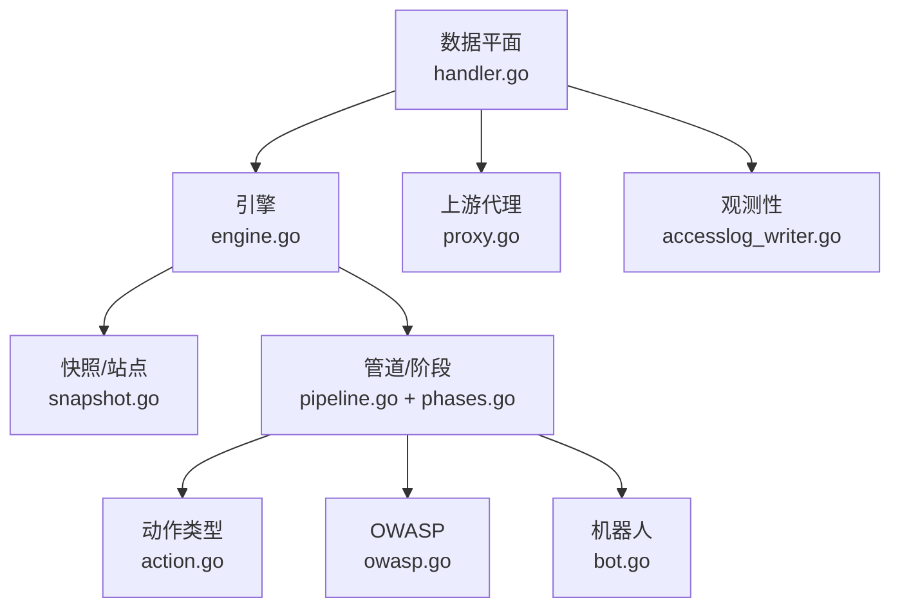

# 数据流分析

<cite>
**本文档引用的文件**
- [cmd/main.go](file://cmd/main.go)
- [internal/app/server.go](file://internal/app/server.go)
- [internal/dataplane/handler.go](file://internal/dataplane/handler.go)
- [internal/core/engine/engine.go](file://internal/core/engine/engine.go)
- [internal/core/pipeline/pipeline.go](file://internal/core/pipeline/pipeline.go)
- [internal/core/pipeline/pool.go](file://internal/core/pipeline/pool.go)
- [internal/core/sites/resolver.go](file://internal/core/sites/resolver.go)
- [internal/snapshot/snapshot.go](file://internal/snapshot/snapshot.go)
- [internal/proxy/proxy.go](file://internal/proxy/proxy.go)
- [internal/core/action/action.go](file://internal/core/action/action.go)
- [internal/core/rules/phases.go](file://internal/core/rules/phases.go)
- [internal/waf/owasp/owasp.go](file://internal/waf/owasp/owasp.go)
- [internal/waf/bot/bot.go](file://internal/waf/bot/bot.go)
- [internal/waf/challenge/chain.go](file://internal/waf/challenge/chain.go)
- [internal/waf/pages/block.go](file://internal/waf/pages/block.go)
- [internal/observability/accesslog_writer.go](file://internal/observability/accesslog_writer.go)
</cite>

## 目录
1. [简介](#简介)
2. [项目结构](#项目结构)
3. [核心组件](#核心组件)
4. [架构总览](#架构总览)
5. [详细组件分析](#详细组件分析)
6. [依赖关系分析](#依赖关系分析)
7. [性能考量](#性能考量)
8. [故障排查指南](#故障排查指南)
9. [结论](#结论)

## 简介
本文件面向 My-OpenWaf 的数据流分析，围绕“请求从进入系统到最终响应”的完整路径进行深入解析。内容涵盖站点匹配、维护门禁检查、WAF 规则链执行、动作决策、上游转发与响应回写等环节，重点解释每个处理阶段的数据转换、状态变化与错误处理机制，并指出关键决策点、潜在性能瓶颈与优化方向。

## 项目结构
My-OpenWaf 采用分层清晰的模块化设计：
- 应用入口与生命周期：cmd/main.go 启动 internal/app/server.go，后者负责初始化运行时、加载快照、构建监听器、注册路由与中间件。
- 数据平面（Dataplane）：internal/dataplane/handler.go 实现请求处理主流程，包含站点匹配、维护检查、WAF 执行、动作决策、上游转发与回写。
- 引擎与规则链：internal/core/engine/engine.go 负责组装规则链并执行；internal/core/rules/phases.go 定义各阶段规则；internal/core/pipeline 提供上下文与执行框架。
- 上游代理：internal/proxy/proxy.go 封装 HTTP/HTTPS 连接池、请求构建、响应回写与缓存策略。
- 动作与页面：internal/core/action/action.go 定义动作类型；internal/waf/pages/block.go 渲染拦截、维护、挑战等页面。
- 辅助能力：internal/waf/owasp/owasp.go、internal/waf/bot/bot.go、internal/waf/challenge/chain.go 提供 OWASP 检测、机器人识别与多步挑战。
- 观测性：internal/observability/accesslog_writer.go 负责访问日志的异步写入与批量提交。

图表来源
- [cmd/main.go:1-10](file://cmd/main.go#L1-L10)
- [internal/app/server.go:52-396](file://internal/app/server.go#L52-L396)
- [internal/dataplane/handler.go:69-800](file://internal/dataplane/handler.go#L69-L800)
- [internal/core/engine/engine.go:37-245](file://internal/core/engine/engine.go#L37-L245)
- [internal/core/rules/phases.go:57-800](file://internal/core/rules/phases.go#L57-L800)
- [internal/proxy/proxy.go:1-522](file://internal/proxy/proxy.go#L1-L522)
- [internal/core/action/action.go:1-176](file://internal/core/action/action.go#L1-L176)
- [internal/waf/pages/block.go:17-98](file://internal/waf/pages/block.go#L17-L98)
- [internal/observability/accesslog_writer.go:17-138](file://internal/observability/accesslog_writer.go#L17-L138)

章节来源
- [cmd/main.go:1-10](file://cmd/main.go#L1-L10)
- [internal/app/server.go:52-396](file://internal/app/server.go#L52-L396)

## 核心组件
- 数据平面处理器：负责站点匹配、维护检查、WAF 执行、动作决策、上游转发与响应回写。
- 引擎（Engine）：根据快照与站点配置构建规则链，执行规则并返回结果。
- 规则阶段（Phases）：ACL、签名、自定义、OWASP/CVE、机器人检测、速率限制、IP信誉、抗重放等。
- 上游代理（Proxy）：封装连接池、TLS 配置、请求构建、响应回写与缓存。
- 动作与页面：定义动作类型、默认状态码、挑战页面与拦截页面渲染。
- 观测性：统一写入器，异步批量写入访问日志，支持 Redis 缓冲与事务落库。

章节来源
- [internal/dataplane/handler.go:69-800](file://internal/dataplane/handler.go#L69-L800)
- [internal/core/engine/engine.go:37-245](file://internal/core/engine/engine.go#L37-L245)
- [internal/core/rules/phases.go:57-800](file://internal/core/rules/phases.go#L57-L800)
- [internal/proxy/proxy.go:1-522](file://internal/proxy/proxy.go#L1-L522)
- [internal/core/action/action.go:1-176](file://internal/core/action/action.go#L1-L176)
- [internal/waf/pages/block.go:17-98](file://internal/waf/pages/block.go#L17-L98)
- [internal/observability/accesslog_writer.go:17-138](file://internal/observability/accesslog_writer.go#L17-L138)

## 架构总览
下图展示从请求进入数据平面到响应返回的关键节点与数据流向：

图表来源
- [internal/dataplane/handler.go:69-800](file://internal/dataplane/handler.go#L69-L800)
- [internal/core/engine/engine.go:200-245](file://internal/core/engine/engine.go#L200-L245)
- [internal/core/rules/phases.go:57-800](file://internal/core/rules/phases.go#L57-L800)
- [internal/proxy/proxy.go:172-500](file://internal/proxy/proxy.go#L172-L500)
- [internal/waf/pages/block.go:17-98](file://internal/waf/pages/block.go#L17-L98)

## 详细组件分析

### 数据平面处理器（请求主流程）
- 站点匹配：基于监听绑定地址与 Host 头精确匹配，不命中则返回欢迎页。
- 维护模式：全局或站点级维护开关，直接返回维护页面。
- IP信誉：优先检查黑名单/白名单，匹配即按配置动作（拦截/丢弃）。
- 抗重放：对非静态资源路径生成/校验一次性随机数，重复或过期触发挑战或拦截。
- OWASP 内置规则：针对特定路径与协议违规的快速拦截。
- 规则链执行：将请求上下文交给引擎，引擎构建规则链并执行。
- 动作决策：根据规则链结果选择拦截、挑战、重定向、降级或放行。
- 上游转发：支持 HTTP/HTTPS、WebSocket、SSE；支持响应缓存与回写。
- 响应回写：清理 Server 头、处理空体错误页、记录访问日志与指标。

图表来源
- [internal/dataplane/handler.go:98-780](file://internal/dataplane/handler.go#L98-L780)

章节来源
- [internal/dataplane/handler.go:69-800](file://internal/dataplane/handler.go#L69-L800)

### 引擎与规则链
- 规则链构建：按快照与站点配置构建阶段链，包含 IP信誉、抗重放、ACL、OWASP/CVE、机器人、速率限制、签名、自定义等。
- 执行策略：pipeline.Run 顺序执行，遇到终端动作立即短路；挑战动作可延迟至最后，若后续更高优先级动作出现则覆盖。
- 缓存优化：规则编译与阶段链按快照版本与策略ID缓存，避免重复分配与构建。

图表来源
- [internal/core/engine/engine.go:37-245](file://internal/core/engine/engine.go#L37-L245)
- [internal/core/pipeline/pipeline.go:62-124](file://internal/core/pipeline/pipeline.go#L62-L124)
- [internal/core/rules/phases.go:57-800](file://internal/core/rules/phases.go#L57-L800)

章节来源
- [internal/core/engine/engine.go:37-245](file://internal/core/engine/engine.go#L37-L245)
- [internal/core/pipeline/pipeline.go:62-124](file://internal/core/pipeline/pipeline.go#L62-L124)
- [internal/core/rules/phases.go:57-800](file://internal/core/rules/phases.go#L57-L800)

### 上游代理与缓存
- 连接池与传输：按上游 TLS 配置复用 http.Transport，减少连接开销。
- 请求构建：复制头（剔除 Hop-by-Hop），注入 XFF/原始 Host 等出站信息。
- 响应回写：支持流式回写与缓冲回写；支持缓存命中/未命中分支。
- 缓存策略：GET 200 且无 Set-Cookie、Cache-Control 不含 private/no-store、Vary 允许时可缓存；缓存键包含方法、主机、路径、查询串等。

图表来源
- [internal/proxy/proxy.go:35-500](file://internal/proxy/proxy.go#L35-L500)

章节来源
- [internal/proxy/proxy.go:1-522](file://internal/proxy/proxy.go#L1-L522)

### 动作类型与页面渲染
- 动作类型：允许、拦截、观察、丢弃、挑战（含 CAPTCHA/盾/链）、重定向、速率限制、标签等；支持优先级比较与默认状态码映射。
- 页面渲染：拦截页、维护页、挑战页、上游错误页，支持模板与嵌入资源回退。

图表来源
- [internal/core/action/action.go:1-176](file://internal/core/action/action.go#L1-L176)
- [internal/waf/pages/block.go:17-98](file://internal/waf/pages/block.go#L17-L98)

章节来源
- [internal/core/action/action.go:1-176](file://internal/core/action/action.go#L1-L176)
- [internal/waf/pages/block.go:17-98](file://internal/waf/pages/block.go#L17-L98)

### OWASP 与机器人检测
- OWASP：按敏感度级别扫描路径、查询、头、主体目标，支持路径特判与协议违规检测；对文件上传与危险路径有专门规则。
- 机器人：两阶段检测（预筛+深度评分），结合地理、指纹、行为与 IP 信誉综合打分，动态决定拦截/挑战/观察。

章节来源
- [internal/waf/owasp/owasp.go:59-345](file://internal/waf/owasp/owasp.go#L59-L345)
- [internal/waf/bot/bot.go:175-333](file://internal/waf/bot/bot.go#L175-L333)
- [internal/core/rules/phases.go:374-552](file://internal/core/rules/phases.go#L374-L552)

### 多步挑战（Chain Challenge）
- 状态机：环境检测 → PoW → CAPTCHA，支持条件跳过与难度配置。
- 会话：Redis 或内存保存会话状态，逐步推进步骤并最终放行。

章节来源
- [internal/waf/challenge/chain.go:43-386](file://internal/waf/challenge/chain.go#L43-L386)

## 依赖关系分析
- 数据平面依赖引擎与规则链，引擎依赖快照与站点解析器。
- 规则链依赖动作类型、OWASP、机器人、速率限制、IP信誉、抗重放等子系统。
- 上游代理依赖连接池与传输配置，受站点 TLS 与上游配置影响。
- 观测性写入器独立于业务逻辑，通过协调器与 Redis 缓冲提升吞吐。

图表来源
- [internal/dataplane/handler.go:69-800](file://internal/dataplane/handler.go#L69-L800)
- [internal/core/engine/engine.go:37-245](file://internal/core/engine/engine.go#L37-L245)
- [internal/snapshot/snapshot.go:72-152](file://internal/snapshot/snapshot.go#L72-L152)
- [internal/core/pipeline/pipeline.go:50-124](file://internal/core/pipeline/pipeline.go#L50-L124)
- [internal/core/rules/phases.go:57-800](file://internal/core/rules/phases.go#L57-L800)
- [internal/core/action/action.go:1-176](file://internal/core/action/action.go#L1-L176)
- [internal/waf/owasp/owasp.go:1-800](file://internal/waf/owasp/owasp.go#L1-L800)
- [internal/waf/bot/bot.go:1-333](file://internal/waf/bot/bot.go#L1-L333)
- [internal/proxy/proxy.go:1-522](file://internal/proxy/proxy.go#L1-L522)
- [internal/observability/accesslog_writer.go:17-138](file://internal/observability/accesslog_writer.go#L17-L138)

章节来源
- [internal/dataplane/handler.go:69-800](file://internal/dataplane/handler.go#L69-L800)
- [internal/core/engine/engine.go:37-245](file://internal/core/engine/engine.go#L37-L245)
- [internal/snapshot/snapshot.go:72-152](file://internal/snapshot/snapshot.go#L72-L152)
- [internal/core/pipeline/pipeline.go:50-124](file://internal/core/pipeline/pipeline.go#L50-L124)
- [internal/core/rules/phases.go:57-800](file://internal/core/rules/phases.go#L57-L800)
- [internal/core/action/action.go:1-176](file://internal/core/action/action.go#L1-L176)
- [internal/waf/owasp/owasp.go:1-800](file://internal/waf/owasp/owasp.go#L1-L800)
- [internal/waf/bot/bot.go:1-333](file://internal/waf/bot/bot.go#L1-L333)
- [internal/proxy/proxy.go:1-522](file://internal/proxy/proxy.go#L1-L522)
- [internal/observability/accesslog_writer.go:17-138](file://internal/observability/accesslog_writer.go#L17-L138)

## 性能考量
- 上下文复用：pipeline.RequestCtx 使用 sync.Pool 复用，降低 GC 压力。
- 规则链缓存：引擎按快照版本与策略ID缓存编译后的规则与阶段链，避免重复构建。
- 连接池复用：按上游 TLS 配置缓存 http.Transport，减少握手与连接开销。
- 响应缓存：GET 200 且满足条件可缓存，命中直接回写，未命中再缓冲并写入缓存。
- 异步日志：访问日志写入器批量提交并支持 Redis 缓冲，降低数据库锁竞争。
- 关键优化点
  - 规则链构建成本高，需确保缓存命中率；快照变更时及时失效缓存。
  - 上游连接池大小与超时需结合业务并发与上游能力调优。
  - 缓存键策略与 Vary 控制需平衡准确性与命中率。
  - 观测性写入批大小与刷新周期需权衡实时性与吞吐。

章节来源
- [internal/core/pipeline/pool.go:1-43](file://internal/core/pipeline/pool.go#L1-L43)
- [internal/core/engine/engine.go:100-198](file://internal/core/engine/engine.go#L100-L198)
- [internal/proxy/proxy.go:35-108](file://internal/proxy/proxy.go#L35-L108)
- [internal/proxy/proxy.go:282-303](file://internal/proxy/proxy.go#L282-L303)
- [internal/observability/accesslog_writer.go:31-117](file://internal/observability/accesslog_writer.go#L31-L117)

## 故障排查指南
- 快照未加载：数据平面在快照为空时直接返回 503，检查初始化与热重载流程。
- 站点未匹配：核对监听绑定与 Host 头是否一致，确认通配符匹配规则。
- 维护模式：检查全局或站点级维护开关，确认状态码与页面模板。
- IP信誉拦截：查看动作类型与分类，确认黑名单/白名单与自动封禁配置。
- 抗重放失败：检查一次性随机数生成与过期策略，确认 Cookie 设置与 TTL。
- 规则链未命中：确认规则是否启用、敏感度级别与路径覆盖范围。
- 上游错误：区分 502/504，检查上游连通性、超时与健康状态；必要时回退到友好错误页。
- 观测性缺失：检查写入器缓冲区、Redis 连接与事务提交状态。

章节来源
- [internal/dataplane/handler.go:98-118](file://internal/dataplane/handler.go#L98-L118)
- [internal/dataplane/handler.go:475-487](file://internal/dataplane/handler.go#L475-L487)
- [internal/dataplane/handler.go:134-224](file://internal/dataplane/handler.go#L134-L224)
- [internal/dataplane/handler.go:256-356](file://internal/dataplane/handler.go#L256-L356)
- [internal/proxy/proxy.go:747-761](file://internal/proxy/proxy.go#L747-L761)
- [internal/observability/accesslog_writer.go:54-117](file://internal/observability/accesslog_writer.go#L54-L117)

## 结论
My-OpenWaf 的数据流以“数据平面处理器”为核心，串联站点匹配、维护检查、WAF 规则链与动作决策，并通过引擎与规则链实现高扩展性的安全策略执行。上游代理提供稳健的转发与缓存能力，页面渲染与观测性写入保障用户体验与可运维性。整体设计强调缓存与连接池复用、异步日志与批处理，兼顾性能与可观测性。建议在生产环境中持续关注快照变更、上游能力与缓存策略的协同优化。