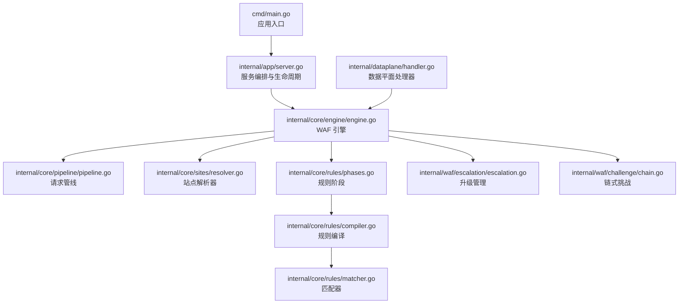
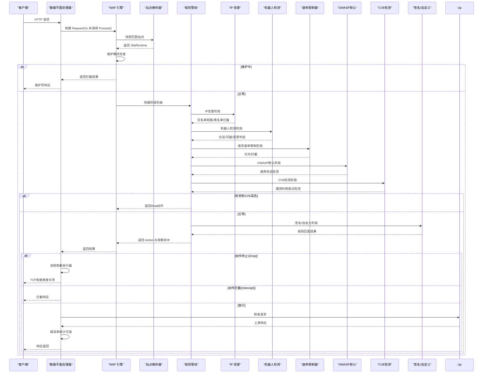
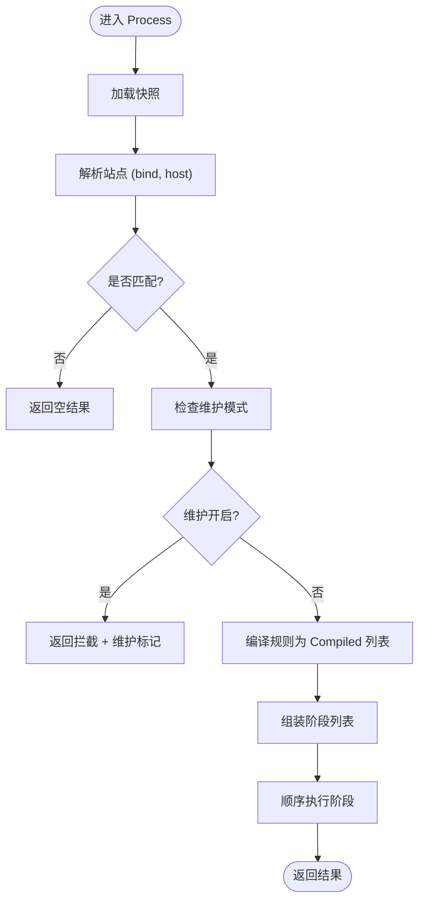
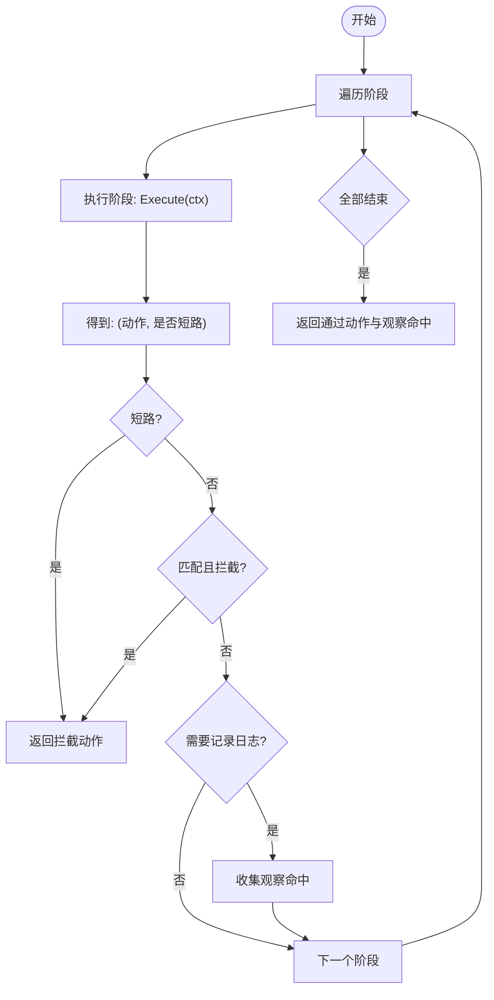
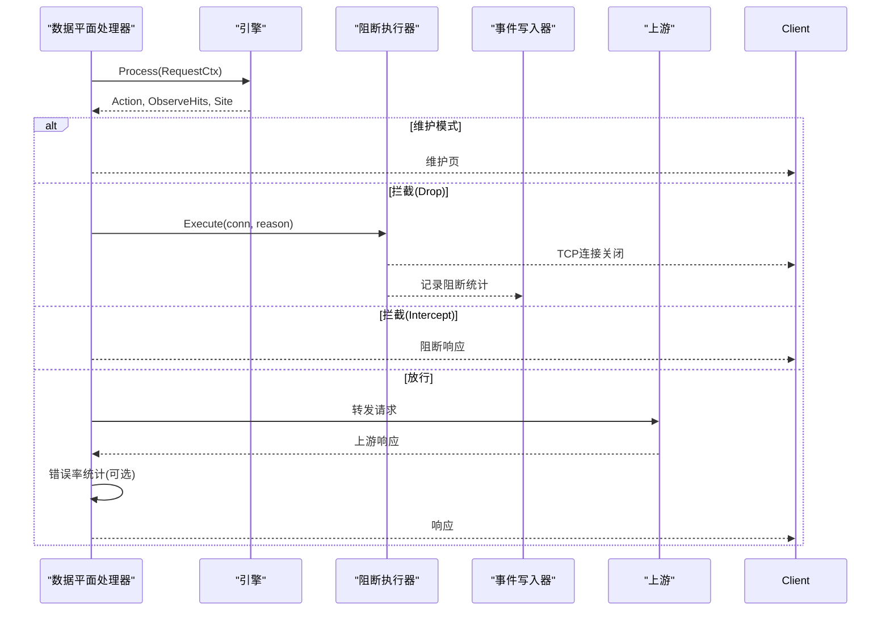
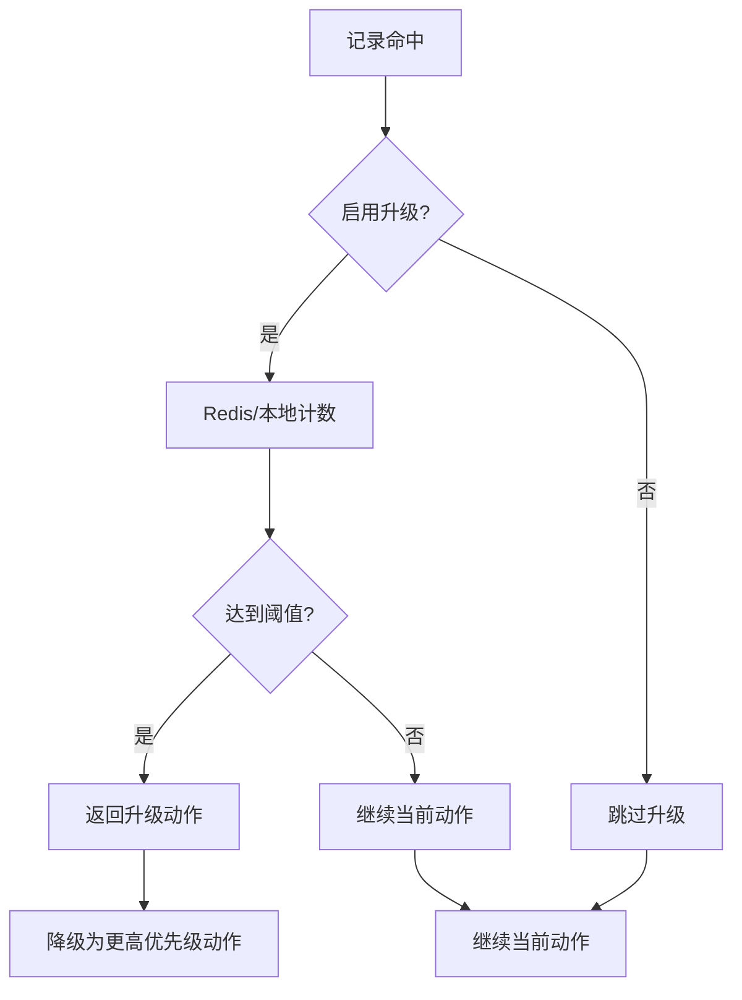
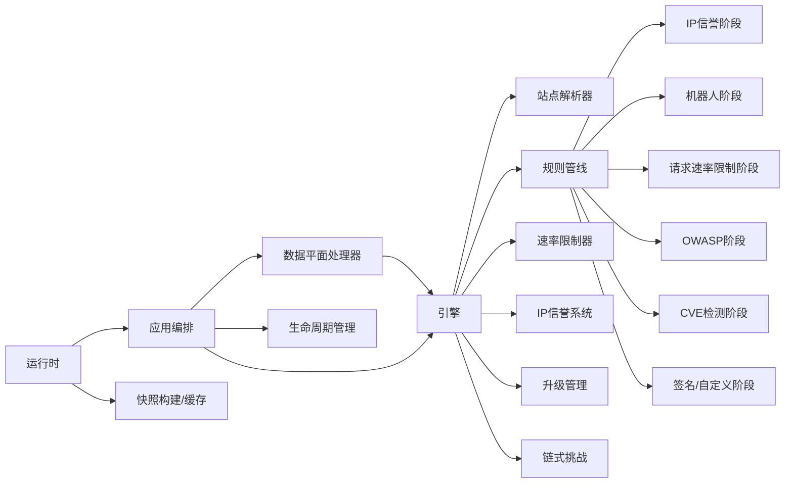

# WAF引擎集成

> [返回 系统架构设计](../系统架构设计.md)

<cite>
**本文档引用的文件**
- [internal/core/engine/engine.go](file://internal/core/engine/engine.go)
- [internal/core/pipeline/pipeline.go](file://internal/core/pipeline/pipeline.go)
- [internal/core/rules/phases.go](file://internal/core/rules/phases.go)
- [internal/core/rules/compiler.go](file://internal/core/rules/compiler.go)
- [internal/core/rules/matcher.go](file://internal/core/rules/matcher.go)
- [internal/core/action/action.go](file://internal/core/action/action.go)
- [internal/core/sites/resolver.go](file://internal/core/sites/resolver.go)
- [internal/dataplane/handler.go](file://internal/dataplane/handler.go)
- [internal/waf/escalation/escalation.go](file://internal/waf/escalation/escalation.go)
- [internal/waf/challenge/chain.go](file://internal/waf/challenge/chain.go)
- [internal/app/server.go](file://internal/app/server.go)
- [docs/WAF 引擎系统/引擎核心架构.md](file://docs/WAF 引擎系统/引擎核心架构.md)
- [docs/数据平面处理/数据平面处理.md](file://docs/数据平面处理/数据平面处理.md)
- [docs/WAF 引擎系统/规则管道设计/规则管道设计.md](file://docs/WAF 引擎系统/规则管道设计/规则管道设计.md)
</cite>

## 目录
1. [引言](#引言)
2. [项目结构](#项目结构)
3. [核心组件](#核心组件)
4. [架构总览](#架构总览)
5. [详细组件分析](#详细组件分析)
6. [依赖关系分析](#依赖关系分析)
7. [性能考量](#性能考量)
8. [故障排查指南](#故障排查指南)
9. [结论](#结论)
10. [附录](#附录)

## 引言
本文件面向 My-OpenWaf 的 WAF 引擎集成功能，系统性阐述引擎如何与数据平面处理器协作，包括规则流水线的执行机制、处理阶段的调度和动作结果的处理。文档从请求上下文构建到最终动作决策的完整过程进行深入分析，覆盖引擎如何处理观察命中、维护模式、错误率限制和升级机制，并说明引擎集成的关键接口、数据流转和性能考量，以及与上游代理的交互方式。

## 项目结构
My-OpenWaf 采用分层与模块化组织方式，WAF 引擎位于 internal/core 层，数据平面处理器位于 internal/dataplane 层，二者通过统一的请求上下文和动作结果进行集成：

**图表来源**
- [internal/app/server.go:33-280](file://internal/app/server.go#L33-L280)
- [internal/core/engine/engine.go:23-176](file://internal/core/engine/engine.go#L23-L176)
- [internal/core/pipeline/pipeline.go:9-66](file://internal/core/pipeline/pipeline.go#L9-L66)
- [internal/core/sites/resolver.go:18-31](file://internal/core/sites/resolver.go#L18-L31)
- [internal/core/rules/phases.go:34-569](file://internal/core/rules/phases.go#L34-L569)
- [internal/core/rules/compiler.go:27-55](file://internal/core/rules/compiler.go#L27-L55)
- [internal/core/rules/matcher.go:167-261](file://internal/core/rules/matcher.go#L167-L261)
- [internal/waf/escalation/escalation.go:32-147](file://internal/waf/escalation/escalation.go#L32-L147)
- [internal/waf/challenge/chain.go:43-386](file://internal/waf/challenge/chain.go#L43-L386)
- [internal/dataplane/handler.go:36-257](file://internal/dataplane/handler.go#L36-L257)

**章节来源**
- [internal/app/server.go:33-280](file://internal/app/server.go#L33-L280)
- [internal/core/engine/engine.go:15-176](file://internal/core/engine/engine.go#L15-L176)
- [internal/dataplane/handler.go:36-257](file://internal/dataplane/handler.go#L36-L257)

## 核心组件
- **WAF 引擎 Engine**：封装站点解析、维护模式检查、规则阶段执行与结果聚合，支持 CVE 检测、阻断执行器等扩展能力
- **规则引擎**：编译规则为可执行的 Compiled 结构，按阶段顺序执行
- **站点解析器 Resolver**：基于当前快照将 (bind, host) 映射到 SiteRuntime
- **动作系统 Action**：定义拦截、放行、观察、挑战等动作类型及其优先级
- **数据平面处理器**：在拦截后写入响应或转发至上游，处理错误率限制和升级机制
- **升级管理 Escalation**：基于命中次数的步骤升级机制，支持 Redis 分布式计数

**章节来源**
- [internal/core/engine/engine.go:15-176](file://internal/core/engine/engine.go#L15-L176)
- [internal/core/action/action.go:5-176](file://internal/core/action/action.go#L5-L176)
- [internal/core/sites/resolver.go:18-31](file://internal/core/sites/resolver.go#L18-L31)
- [internal/waf/escalation/escalation.go:32-147](file://internal/waf/escalation/escalation.go#L32-L147)
- [internal/dataplane/handler.go:36-257](file://internal/dataplane/handler.go#L36-L257)

## 架构总览
下图展示从 Hertz 监听器到引擎再到上游的完整链路，以及引擎内部的阶段执行顺序：

**图表来源**
- [internal/dataplane/handler.go:36-257](file://internal/dataplane/handler.go#L36-L257)
- [internal/core/engine/engine.go:57-129](file://internal/core/engine/engine.go#L57-L129)
- [internal/core/sites/resolver.go:18-31](file://internal/core/sites/resolver.go#L18-L31)
- [internal/core/rules/phases.go:305-358](file://internal/core/rules/phases.go#L305-L358)

## 详细组件分析

### 引擎 Process 执行流程
引擎的 Process 方法负责完整的请求处理流程，从快照加载到阶段执行再到结果返回：

**图表来源**
- [internal/core/engine/engine.go:57-129](file://internal/core/engine/engine.go#L57-L129)
- [internal/core/pipeline/pipeline.go:46-65](file://internal/core/pipeline/pipeline.go#L46-L65)

**章节来源**
- [internal/core/engine/engine.go:57-129](file://internal/core/engine/engine.go#L57-L129)
- [internal/core/pipeline/pipeline.go:9-65](file://internal/core/pipeline/pipeline.go#L9-L65)

### 规则阶段执行机制
规则阶段采用责任链模式，每个阶段按顺序执行，支持短路和观察命中收集：

**图表来源**
- [internal/core/pipeline/pipeline.go:46-65](file://internal/core/pipeline/pipeline.go#L46-L65)
- [internal/core/action/action.go:39-49](file://internal/core/action/action.go#L39-L49)

**章节来源**
- [internal/core/pipeline/pipeline.go:46-65](file://internal/core/pipeline/pipeline.go#L46-L65)
- [internal/core/action/action.go:39-49](file://internal/core/action/action.go#L39-L49)

### 数据平面处理器集成
数据平面处理器负责将引擎结果转换为实际的响应或转发：

**图表来源**
- [internal/dataplane/handler.go:36-257](file://internal/dataplane/handler.go#L36-L257)
- [internal/waf/escalation/escalation.go:52-106](file://internal/waf/escalation/escalation.go#L52-L106)

**章节来源**
- [internal/dataplane/handler.go:36-257](file://internal/dataplane/handler.go#L36-L257)
- [internal/waf/escalation/escalation.go:52-106](file://internal/waf/escalation/escalation.go#L52-L106)

### 升级机制与错误率限制
引擎集成了基于命中次数的升级机制和错误率限制功能：

**图表来源**
- [internal/waf/escalation/escalation.go:52-106](file://internal/waf/escalation/escalation.go#L52-L106)
- [internal/dataplane/handler.go:500-524](file://internal/dataplane/handler.go#L500-L524)

**章节来源**
- [internal/waf/escalation/escalation.go:52-106](file://internal/waf/escalation/escalation.go#L52-L106)
- [internal/dataplane/handler.go:500-524](file://internal/dataplane/handler.go#L500-L524)

## 依赖关系分析
引擎与各组件的依赖关系如下：

**图表来源**
- [internal/dataplane/handler.go:36-257](file://internal/dataplane/handler.go#L36-L257)
- [internal/core/engine/engine.go:57-129](file://internal/core/engine/engine.go#L57-L129)
- [internal/core/lifecycle/lifecycle.go:30-178](file://internal/core/lifecycle/lifecycle.go#L30-L178)
- [internal/core/runtime.go:27-80](file://internal/core/runtime.go#L27-L80)

**章节来源**
- [internal/core/engine/engine.go:15-176](file://internal/core/engine/engine.go#L15-L176)
- [internal/core/lifecycle/lifecycle.go:30-178](file://internal/core/lifecycle/lifecycle.go#L30-L178)
- [internal/core/runtime.go:27-80](file://internal/core/runtime.go#L27-L80)

## 性能考量
- **规则编译与缓存**：规则编译一次，按优先级排序；正则表达式缓存避免重复编译
- **请求上下文池化**：数据平面处理器使用对象池减少 GC 压力
- **固定窗口限流**：低内存占用，定时清理过期窗口；错误率统计在响应后进行，避免阻塞请求路径
- **IP 信誉**：白名单短路、黑名单拦截快速路径；自动封禁定期清理过期封禁
- **CVE检测并行化**：多检测器并行执行，使用WaitGroup收集结果，提升检测效率
- **升级管理分布式计数**：支持 Redis 分布式计数，避免单点瓶颈
- **链式挑战状态管理**：链式挑战使用 Redis 存储状态，支持跨节点共享

**章节来源**
- [internal/core/engine/engine.go:100-137](file://internal/core/engine/engine.go#L100-L137)
- [internal/core/pipeline/pool.go:5-43](file://internal/core/pipeline/pool.go#L5-L43)
- [internal/waf/escalation/escalation.go:58-100](file://internal/waf/escalation/escalation.go#L58-L100)
- [internal/waf/challenge/chain.go:344-386](file://internal/waf/challenge/chain.go#L344-L386)

## 故障排查指南
- **快照未加载**：数据平面处理器在快照为空时返回 503，检查运行时初始化与迁移
- **未知虚拟主机**：站点解析失败返回 404，确认监听绑定与 Host 头匹配
- **维护模式**：若返回拦截且标记为维护，检查全局或站点维护开关
- **拦截日志**：关注安全事件与访问日志中的规则 ID、阶段、分类与匹配描述
- **速率限制**：确认启用状态、窗口与上限配置；检查错误率统计是否按预期触发
- **IP 信誉**：核对白/黑名单与自动封禁阈值；查看活动封禁列表
- **升级机制**：检查 Redis 连接状态，确认计数器正常工作
- **链式挑战**：验证 Redis 配置，检查挑战状态存储与恢复
- **上游错误**：转发失败返回 502，检查上游地址与网络连通性

**章节来源**
- [internal/dataplane/handler.go:54-71](file://internal/dataplane/handler.go#L54-L71)
- [internal/core/engine/engine.go:69-81](file://internal/core/engine/engine.go#L69-L81)
- [internal/waf/escalation/escalation.go:52-106](file://internal/waf/escalation/escalation.go#L52-L106)
- [internal/waf/challenge/chain.go:344-386](file://internal/waf/challenge/chain.go#L344-L386)

## 结论
My-OpenWaf 的 WAF 引擎以"不可变快照 + 责任链规则管线"为核心设计，结合站点解析、速率限制、IP信誉、CVE检测、升级管理和链式挑战，形成高可用、可热重载、可观测的全方位安全防护体系。通过清晰的依赖注入与生命周期管理，引擎在保证性能的同时提供了灵活的扩展空间，能够有效处理观察命中、维护模式、错误率限制和升级机制等复杂场景。

## 附录

### 引擎初始化与依赖注入
应用入口通过入口函数启动运行时、构建快照、装配引擎与监听器，运行时打开数据库与可选 Redis，初始化缓存与快照持有者。

**章节来源**
- [internal/app/server.go:33-120](file://internal/app/server.go#L33-L120)
- [internal/core/runtime.go:27-80](file://internal/core/runtime.go#L27-L80)

### 配置选项
- 数据库：驱动、DSN、数据目录
- Redis：地址、密码、DB
- 管理端绑定：控制面监听地址
- 机器人检测：GeoIP 数据库路径、风险国家、数据中心/VPN ASN 列表、评分阈值
- CVE检测：CVE检测启用状态、CVE动作配置、自定义CVE规则

**章节来源**
- [internal/core/config.go:56-115](file://internal/core/config.go#L56-L115)

### 使用示例与最佳实践
- 在数据平面处理器中调用引擎：参考 [internal/dataplane/handler.go:106](file://internal/dataplane/handler.go#L106)
- 引擎评估已解析站点规则（测试辅助）：参考 [internal/core/engine/engine.go:132-145](file://internal/core/engine/engine.go#L132-L145)
- 最佳实践：将规则按阶段拆分，利用 ACL 快速短路；启用机器人检测与 OWASP 默认规则，结合业务场景调整敏感度；合理设置速率限制窗口与上限，避免误伤正常用户；定期维护 IP 黑/白名单，启用自动封禁应对持续攻击；启用CVE检测功能，定期更新CVE规则库；配置链式挑战，建立指纹数据库，提高自动化工具检测准确率；启用升级机制，对高危威胁实施逐步升级；使用热重载功能平滑更新配置，配合 Redis 分布式通知

**章节来源**
- [internal/dataplane/handler.go:106](file://internal/dataplane/handler.go#L106)
- [internal/core/engine/engine.go:132-145](file://internal/core/engine/engine.go#L132-L145)
- [internal/core/rules/phases.go:305-358](file://internal/core/rules/phases.go#L305-L358)