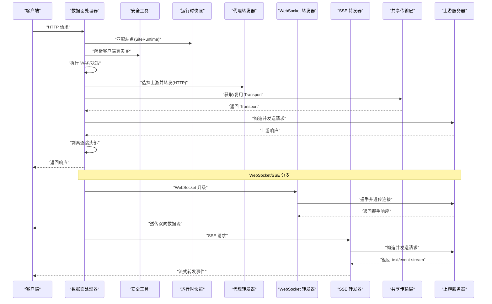
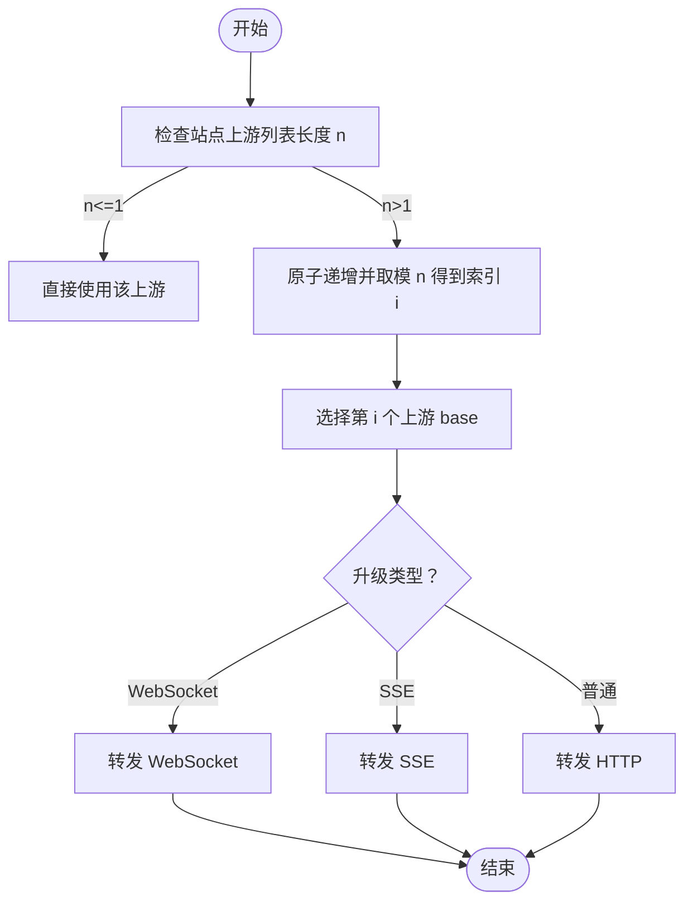
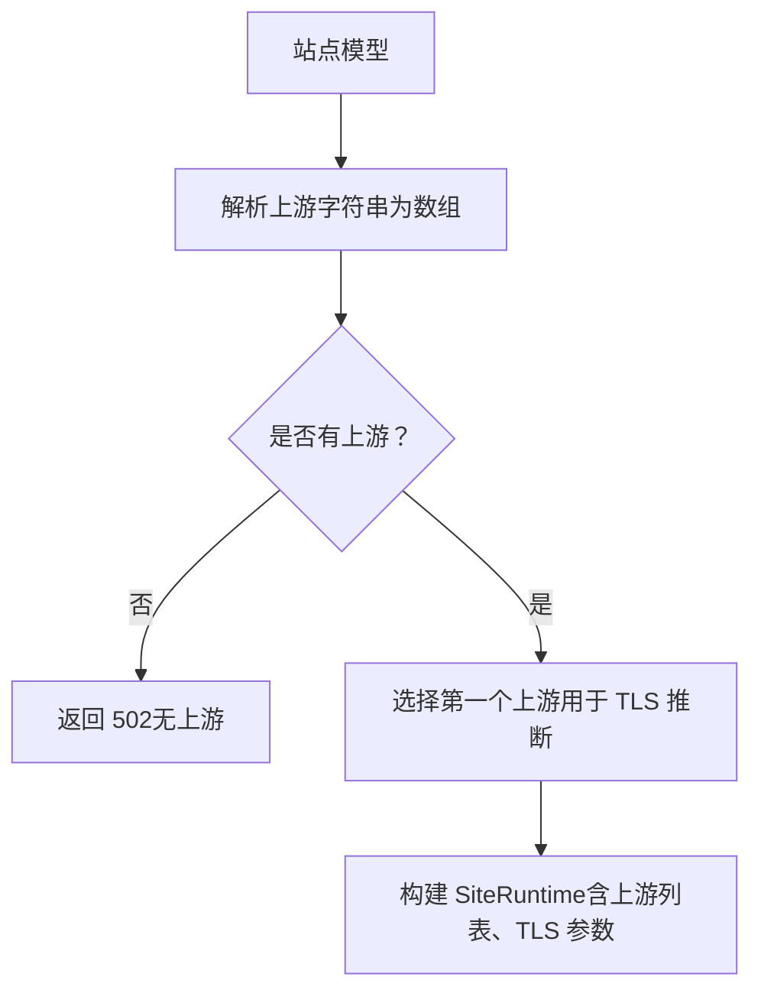
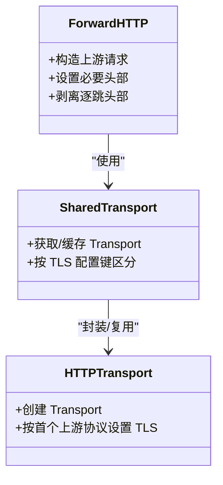
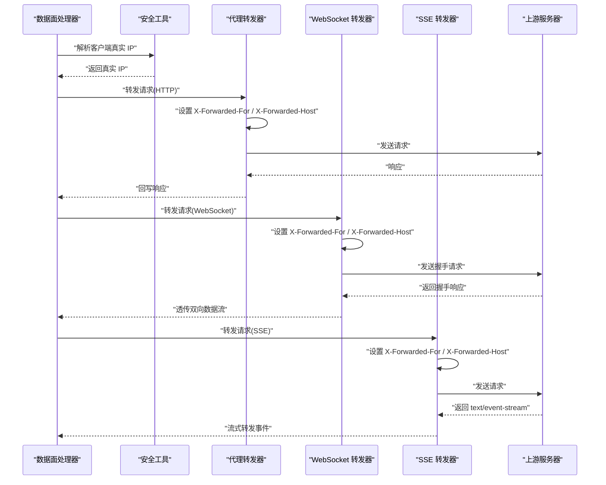
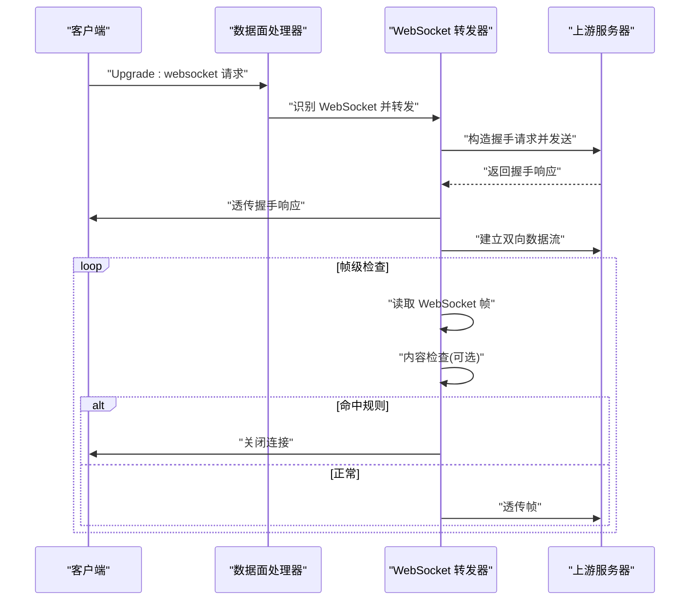
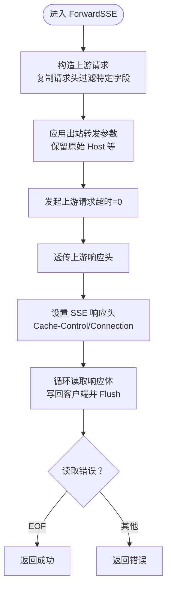
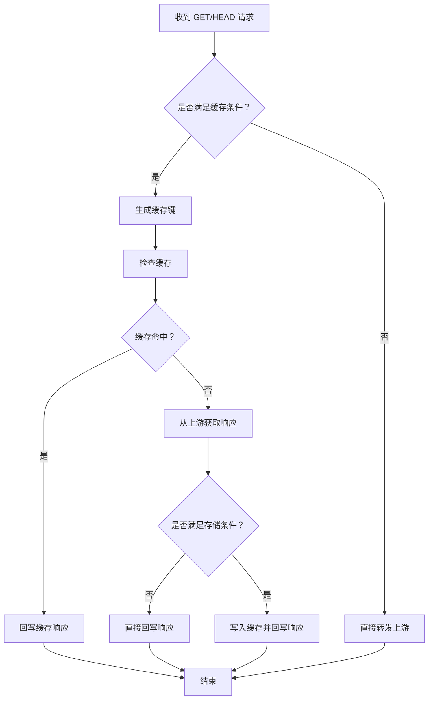
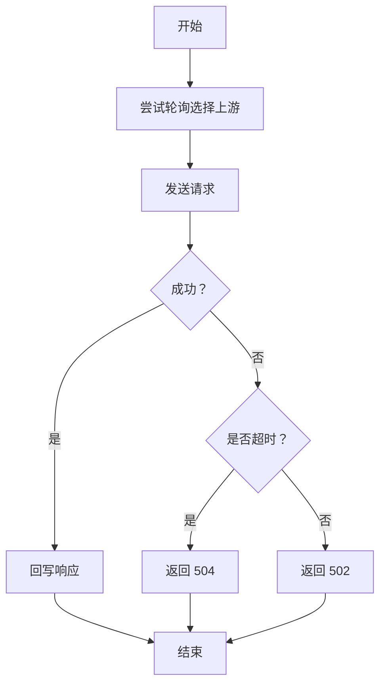
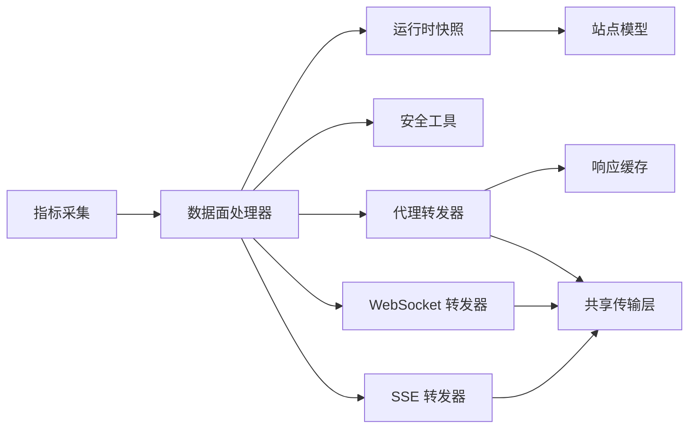

# 上游代理

<cite>
**本文引用的文件**
- [proxy.go](file://internal/proxy/proxy.go)
- [transport.go](file://internal/upstream/transport.go)
- [handler.go](file://internal/dataplane/handler.go)
- [snapshot.go](file://internal/snapshot/snapshot.go)
- [clientip.go](file://internal/security/clientip.go)
- [outbound.go](file://internal/security/outbound.go)
- [metrics.go](file://internal/observability/metrics.go)
- [sse.go](file://internal/dataplane/sse.go)
- [websocket.go](file://internal/dataplane/websocket.go)
- [response_cache.go](file://internal/cache/response_cache.go)
- [response_cache_test.go](file://internal/cache/response_cache_test.go)
- [Ristretto 缓存实现.md](file://docs/缓存与性能优化/Ristretto 缓存实现.md)
- [上游代理配置.md](file://docs/数据平面处理/上游代理配置.md)
</cite>

## 目录
1. [简介](#简介)
2. [项目结构](#项目结构)
3. [核心组件](#核心组件)
4. [架构总览](#架构总览)
5. [详细组件分析](#详细组件分析)
6. [依赖关系分析](#依赖关系分析)
7. [性能考量](#性能考量)
8. [故障排查指南](#故障排查指南)
9. [结论](#结论)
10. [附录](#附录)

## 简介
本文件面向运维与开发人员，系统性阐述 My-OpenWaf 项目的上游代理配置与实现机制，重点覆盖以下方面：
- HTTP 请求转发流程与负载均衡策略（轮询）
- WebSocket 升级处理与帧级内容检查
- SSE 事件推送的流式转发
- 上游服务器配置（URL 列表管理、TLS 设置）
- 传输层优化（连接池、超时、HTTP/2）
- 代理头部处理（X-Forwarded-For、X-Forwarded-Host、客户端 IP 传递）
- 响应缓存策略（缓存键生成、TTL 管理、命中策略）
- 错误处理与故障转移（当前实现为轮询失败即返回 502）
- 性能调优与监控最佳实践

## 项目结构
上游代理相关能力由数据面处理器、代理转发器、安全头处理、运行时快照与存储模型共同构成，前端负责站点与转发配置的录入。

```mermaid
graph TB
subgraph "数据面"
DP["数据面处理器<br/>Handler"]
PR["代理转发器<br/>ForwardHTTP"]
SSE["SSE 转发<br/>ForwardSSE"]
WS["WebSocket 转发<br/>ForwardWebSocket"]
RC["响应缓存<br/>ResponseCache"]
end
subgraph "安全与网络"
SEC["安全工具<br/>ResolveClientIP / ApplyOutboundForwarding"]
TR["传输层封装<br/>SharedTransport / HTTPTransport"]
end
subgraph "运行时与存储"
SNAP["运行时快照<br/>SiteRuntime / Snapshot"]
END
subgraph "监控"
MET["指标采集<br/>Metrics"]
end
FE["前端界面<br/>站点/转发配置"]
FE --> SNAP
SNAP --> DP
DP --> PR
DP --> SSE
DP --> WS
PR --> RC
PR --> TR
SSE --> TR
WS --> TR
SEC --> DP
SEC --> PR
SEC --> WS
MET --> DP
```

**图表来源**
- [handler.go:69-800](file://internal/dataplane/handler.go#L69-L800)
- [proxy.go:35-135](file://internal/proxy/proxy.go#L35-L135)
- [transport.go:12-28](file://internal/upstream/transport.go#L12-L28)
- [snapshot.go:25-70](file://internal/snapshot/snapshot.go#L25-L70)
- [clientip.go:12-49](file://internal/security/clientip.go#L12-L49)
- [outbound.go:8-16](file://internal/security/outbound.go#L8-L16)
- [metrics.go:13-126](file://internal/observability/metrics.go#L13-L126)
- [sse.go:18-99](file://internal/dataplane/sse.go#L18-L99)
- [websocket.go:31-93](file://internal/dataplane/websocket.go#L31-L93)
- [response_cache.go:29-208](file://internal/cache/response_cache.go#L29-L208)

**章节来源**
- [handler.go:69-800](file://internal/dataplane/handler.go#L69-L800)
- [proxy.go:35-135](file://internal/proxy/proxy.go#L35-L135)
- [transport.go:12-28](file://internal/upstream/transport.go#L12-L28)
- [snapshot.go:25-70](file://internal/snapshot/snapshot.go#L25-L70)
- [clientip.go:12-49](file://internal/security/clientip.go#L12-L49)
- [outbound.go:8-16](file://internal/security/outbound.go#L8-L16)
- [metrics.go:13-126](file://internal/observability/metrics.go#L13-L126)
- [sse.go:18-99](file://internal/dataplane/sse.go#L18-L99)
- [websocket.go:31-93](file://internal/dataplane/websocket.go#L31-L93)
- [response_cache.go:29-208](file://internal/cache/response_cache.go#L29-L208)

## 核心组件
- 数据面处理器：解析请求、匹配站点、执行 WAF、决定是否转发、进行轮询选择上游并调用转发器。
- 代理转发器：构造上游请求、设置必要头部、通过共享传输层发送请求、剥离"逐跳"头部并回写响应。
- WebSocket 转发器：处理 WebSocket 升级握手、透传连接并进行帧级内容检查。
- SSE 转发器：识别 SSE 请求、构造上游请求、流式转发文本事件流。
- 传输层封装：基于站点 TLS 配置缓存 http.Transport，支持 HTTP/2 与连接复用。
- 安全工具：解析客户端真实 IP（X-Forwarded-For 解析与可信网段判断）、设置出站 XFF/XFH。
- 运行时快照：聚合站点配置（含上游 URL 列表、TLS、转发参数）供数据面使用。
- 响应缓存：基于内存的 LRU-like 缓存，支持 TTL 管理与命中策略。
- 指标采集：记录请求、拦截、上游错误等指标，便于监控与告警。

**章节来源**
- [handler.go:69-800](file://internal/dataplane/handler.go#L69-L800)
- [proxy.go:35-135](file://internal/proxy/proxy.go#L35-L135)
- [transport.go:12-28](file://internal/upstream/transport.go#L12-L28)
- [snapshot.go:25-70](file://internal/snapshot/snapshot.go#L25-L70)
- [clientip.go:12-49](file://internal/security/clientip.go#L12-L49)
- [outbound.go:8-16](file://internal/security/outbound.go#L8-L16)
- [sse.go:18-99](file://internal/dataplane/sse.go#L18-L99)
- [websocket.go:31-93](file://internal/dataplane/websocket.go#L31-L93)
- [response_cache.go:29-208](file://internal/cache/response_cache.go#L29-L208)
- [metrics.go:13-126](file://internal/observability/metrics.go#L13-L126)

## 架构总览
下图展示一次典型请求从进入数据面到上游转发的关键路径与职责分工。



**图表来源**
- [handler.go:703-744](file://internal/dataplane/handler.go#L703-L744)
- [proxy.go:481-500](file://internal/proxy/proxy.go#L481-L500)
- [websocket.go:31-93](file://internal/dataplane/websocket.go#L31-L93)
- [sse.go:18-99](file://internal/dataplane/sse.go#L18-L99)
- [transport.go:12-28](file://internal/upstream/transport.go#L12-L28)

## 详细组件分析

### 负载均衡策略与轮询算法
- 策略：在站点配置存在多个上游 URL 时，采用简单轮询（round-robin）策略。
- 实现要点：
  - 使用原子计数器维护下一个上游索引。
  - 对上游数量取模，确保均匀分布。
  - WebSocket 与 SSE 分支走专用转发函数，但未见额外的健康检查或故障转移逻辑；当前行为是轮询失败即返回 502。
- 适用场景：多实例上游部署，无需复杂健康探测时的均衡策略。



**图表来源**
- [handler.go:708-710](file://internal/dataplane/handler.go#L708-L710)

**章节来源**
- [handler.go:708-710](file://internal/dataplane/handler.go#L708-L710)

### 上游服务器配置与 URL 列表管理
- 配置来源：站点模型包含上游 URL 字符串与 TLS 相关字段。
- Host 覆写：站点模型中的 `upstream_host` 负责发往上游的 `Host` 头，支持域名、域名:端口或 Go template；为空时回退到上游地址主机，若站点启用 `preserve_original_host`，则继续保留原始请求 Host 作为回退。
- 解析规则：
  - 将逗号分隔的字符串拆分为 URL 列表，并去除空白。
  - 若为空则不进行转发，返回 502。
- TLS 配置：
  - 当首个上游以 https 开头时，启用 TLS 并按站点配置设置 SNI、跳过校验与最小版本。
- 前端录入：
  - 站点创建/编辑界面支持多行输入上游地址，支持删除与新增。
  - 转发配置页面支持 XFF 模式、可信网段、保留原始 Host 等参数。



**图表来源**
- [snapshot.go:25-70](file://internal/snapshot/snapshot.go#L25-L70)
- [handler.go:703-706](file://internal/dataplane/handler.go#L703-L706)

**章节来源**
- [snapshot.go:25-70](file://internal/snapshot/snapshot.go#L25-L70)
- [handler.go:703-706](file://internal/dataplane/handler.go#L703-L706)

### 传输层优化：连接池、超时与资源复用
- 连接池与复用：
  - 通过共享传输层缓存 http.Transport，按 TLS 配置键值区分，避免重复创建。
  - 默认最大空闲连接与每主机空闲连接上限，空闲超时较长，有利于复用。
- 协议与安全：
  - 强制尝试 HTTP/2；当上游为 https 时，按站点配置设置 SNI、跳过校验与最小版本。
- 超时策略：
  - 普通 HTTP 转发设置固定超时；SSE 转发设置无超时（流式长连接）。
- 适用建议：
  - 在高并发场景适当提高空闲连接上限与超时阈值。
  - 对于长连接/流式场景（如 SSE），保持无超时或合理放宽。



**图表来源**
- [proxy.go:35-83](file://internal/proxy/proxy.go#L35-L83)
- [transport.go:12-28](file://internal/upstream/transport.go#L12-L28)
- [proxy.go:481-500](file://internal/proxy/proxy.go#L481-L500)

**章节来源**
- [proxy.go:35-83](file://internal/proxy/proxy.go#L35-L83)
- [transport.go:12-28](file://internal/upstream/transport.go#L12-L28)
- [proxy.go:481-500](file://internal/proxy/proxy.go#L481-L500)
- [sse.go:51-51](file://internal/dataplane/sse.go#L51)

### 代理头部处理：X-Forwarded-For 与客户端 IP 传递
- 入站 IP 解析：
  - 支持多种 XFF 模式，结合可信网段判断，决定采用直接连接 IP 或 X-Forwarded-For 中的最左 IP。
- 出站头部设置：
  - 在上游请求中设置 X-Forwarded-For 为解析出的真实客户端 IP。
  - 若站点开启保留原始 Host，则设置 X-Forwarded-Host。
  - 若站点配置了 `upstream_host`，则优先写入上游请求的 `Host` 头；`preserve_original_host` 不会覆盖这一值，只影响 `X-Forwarded-Host` 与未配置 `upstream_host` 时的回退行为。
- 影响范围：
  - 适用于普通 HTTP、WebSocket、SSE 的上游请求。



**图表来源**
- [clientip.go:12-49](file://internal/security/clientip.go#L12-L49)
- [outbound.go:8-16](file://internal/security/outbound.go#L8-L16)
- [proxy.go:129-155](file://internal/proxy/proxy.go#L129-L155)
- [websocket.go:95-127](file://internal/dataplane/websocket.go#L95-L127)
- [sse.go:36-49](file://internal/dataplane/sse.go#L36-L49)

**章节来源**
- [clientip.go:12-49](file://internal/security/clientip.go#L12-L49)
- [outbound.go:8-16](file://internal/security/outbound.go#L8-L16)
- [proxy.go:129-155](file://internal/proxy/proxy.go#L129-L155)
- [websocket.go:95-127](file://internal/dataplane/websocket.go#L95-L127)
- [sse.go:36-49](file://internal/dataplane/sse.go#L36-L49)

### WebSocket 升级处理与帧级检查
- 升级识别：基于 Upgrade 和 Connection 头部判断 WebSocket 请求。
- 握手处理：构造上游握手请求，设置必要的头部（排除逐跳头部），透传响应。
- 连接透传：使用 net.Pipe 建立双向管道，分别复制客户端与上游的数据流。
- 帧级检查：对文本/二进制帧进行内容检查，必要时中断连接。
- TLS 支持：支持 wss://，按站点配置设置 TLS 参数。
- 超时控制：握手超时 10 秒，连接建立后无超时限制。



**图表来源**
- [websocket.go:25-93](file://internal/dataplane/websocket.go#L25-L93)
- [websocket.go:129-171](file://internal/dataplane/websocket.go#L129-L171)

**章节来源**
- [websocket.go:25-93](file://internal/dataplane/websocket.go#L25-L93)
- [websocket.go:129-171](file://internal/dataplane/websocket.go#L129-L171)

### SSE 事件推送的流式转发
- 请求识别：基于 Accept 头部包含 "text/event-stream" 识别 SSE 请求。
- 请求构造：复制必要请求头（排除 Connection/Keep-Alive/Transfer-Encoding），设置出站头部。
- 转发策略：使用共享传输层，超时设为 0 以支持长连接。
- 响应处理：透传上游响应头，设置 Cache-Control 和 Connection 头，流式读取并写回客户端。
- 错误处理：正确处理 EOF 与各种读取错误，保证连接稳定关闭。



**图表来源**
- [sse.go:18-99](file://internal/dataplane/sse.go#L18-L99)

**章节来源**
- [sse.go:18-99](file://internal/dataplane/sse.go#L18-L99)

### 响应缓存策略与实现原理
- 缓存触发条件：仅对 GET/HEAD 请求且状态码为 200 且有非空响应体的请求进行缓存。
- 缓存键生成：基于方法、主机键、路径和查询字符串的 SHA-256 哈希，确保确定性。
- TTL 管理：支持站点级缓存规则，规则匹配时使用规则 TTL，否则使用默认 TTL。
- 命中策略：
  - MISS：从上游获取完整响应，满足缓存条件时写入缓存。
  - HIT：直接从缓存回写响应，包含状态码、内容类型和头部信息。
  - STALE：在上游错误时可使用过期条目进行回退。
- 头部处理：缓存时剥离逐跳头部，保留 Content-Encoding 等关键头部以便正确解码。
- 并发控制：使用 64 个分片的互斥锁减少热点竞争，支持原子开关与清理器。



**图表来源**
- [proxy.go:455-479](file://internal/proxy/proxy.go#L455-L479)
- [proxy.go:481-500](file://internal/proxy/proxy.go#L481-L500)
- [proxy.go:502-522](file://internal/proxy/proxy.go#L502-L522)
- [response_cache.go:60-71](file://internal/cache/response_cache.go#L60-L71)
- [response_cache.go:122-158](file://internal/cache/response_cache.go#L122-L158)

**章节来源**
- [proxy.go:455-479](file://internal/proxy/proxy.go#L455-L479)
- [proxy.go:481-500](file://internal/proxy/proxy.go#L481-L500)
- [proxy.go:502-522](file://internal/proxy/proxy.go#L502-L522)
- [response_cache.go:60-71](file://internal/cache/response_cache.go#L60-L71)
- [response_cache.go:122-158](file://internal/cache/response_cache.go#L122-L158)
- [response_cache_test.go:9-131](file://internal/cache/response_cache_test.go#L9-L131)

### 错误处理与故障转移
- 当前实现：
  - 未内置健康检查与自动故障转移；若上游不可达或发生错误，直接返回 502。
  - SSE 分支同样返回 502。
- 超时处理：根据错误类型区分 502/504，SSE 超时返回 504。
- 连接管理：WebSocket 使用 10 秒握手超时，SSE 无超时限制。
- 建议改进方向（概念性）：
  - 引入上游健康检查（如定期探测），将不可用节点暂时移出轮询。
  - 在轮询失败时重试其他节点，或降级至备用上游。
  - 对上游错误进行分类统计，结合指标触发告警。



**图表来源**
- [handler.go:747-751](file://internal/dataplane/handler.go#L747-L751)
- [sse.go:51-51](file://internal/dataplane/sse.go#L51-L51)

**章节来源**
- [handler.go:747-751](file://internal/dataplane/handler.go#L747-L751)
- [sse.go:51-51](file://internal/dataplane/sse.go#L51-L51)

## 依赖关系分析
- 数据面处理器依赖运行时快照匹配站点，依赖安全工具解析客户端 IP，依赖代理转发器完成上游请求。
- 代理转发器依赖共享传输层以复用连接，依赖安全工具设置出站头部。
- WebSocket/SSE 转发器直接使用共享传输层，独立于响应缓存。
- 响应缓存独立于上游转发，通过缓存键与 TTL 规则进行管理。
- 指标模块为数据面提供统一的指标采集入口。



**图表来源**
- [handler.go:69-800](file://internal/dataplane/handler.go#L69-L800)
- [proxy.go:35-135](file://internal/proxy/proxy.go#L35-L135)
- [snapshot.go:25-70](file://internal/snapshot/snapshot.go#L25-L70)
- [metrics.go:13-126](file://internal/observability/metrics.go#L13-L126)

**章节来源**
- [handler.go:69-800](file://internal/dataplane/handler.go#L69-L800)
- [proxy.go:35-135](file://internal/proxy/proxy.go#L35-L135)
- [snapshot.go:25-70](file://internal/snapshot/snapshot.go#L25-L70)
- [metrics.go:13-126](file://internal/observability/metrics.go#L13-L126)

## 性能考量
- 连接复用：通过共享传输层与合理的空闲连接策略，减少握手开销。
- 协议选择：优先使用 HTTP/2，提升多路复用与头部压缩收益。
- 负载均衡：在上游实例规模较大时，评估更精细的均衡策略与健康检查。
- 超时与流式：区分短连接与长连接场景，避免不必要的超时限制影响体验。
- 缓存优化：合理设置缓存 TTL 与内存上限，平衡命中率与内存占用。
- 监控：持续关注上游错误率、响应时间与连接池利用率，动态调整参数。

## 故障排查指南
- 无上游配置：站点未配置上游 URL 时，直接返回 502。请检查站点配置与前端录入。
- TLS 握手失败：确认上游 TLS 服务器名、证书与最小版本设置；必要时允许跳过校验进行临时验证。
- XFF 解析异常：检查 XFF 模式与可信网段配置，确保仅在可信代理之后设置 XFF。
- 上游不可达：当前实现会返回 502；建议结合监控与日志定位上游状态。
- WebSocket 连接问题：检查握手超时、TLS 配置与帧级内容检查规则。
- SSE 流式问题：确认 Accept 头部设置、超时配置与客户端连接状态。
- 缓存异常：检查缓存键生成、TTL 设置与内存限制，验证头部剥离逻辑。
- 指标核对：通过指标端点查看请求量、状态码分布与上游错误计数，辅助定位问题。

**章节来源**
- [handler.go:703-706](file://internal/dataplane/handler.go#L703-L706)
- [proxy.go:61-66](file://internal/proxy/proxy.go#L61-L66)
- [clientip.go:23-49](file://internal/security/clientip.go#L23-L49)
- [websocket.go:46-54](file://internal/dataplane/websocket.go#L46-L54)
- [sse.go:51-51](file://internal/dataplane/sse.go#L51-L51)
- [metrics.go:13-126](file://internal/observability/metrics.go#L13-L126)

## 结论
本项目提供了简洁可靠的上游代理能力：基于站点配置的多上游轮询、共享传输层连接复用、标准代理头部处理与基础监控指标。对于高可用与高性能需求，可在现有基础上扩展健康检查、故障转移与更精细的均衡策略，并配合完善的监控与告警体系，持续优化上游转发的稳定性与吞吐。

## 附录
- 关键实现位置参考：
  - 负载均衡与转发入口：[handler.go:708-710](file://internal/dataplane/handler.go#L708-L710)
  - 代理转发与头部处理：[proxy.go:481-500](file://internal/proxy/proxy.go#L481-L500)
  - 传输层封装与 TLS：[proxy.go:35-83](file://internal/proxy/proxy.go#L35-L83)、[transport.go:12-28](file://internal/upstream/transport.go#L12-L28)
  - WebSocket 转发与帧检查：[websocket.go:31-93](file://internal/dataplane/websocket.go#L31-L93)
  - SSE 转发：[sse.go:18-99](file://internal/dataplane/sse.go#L18-L99)
  - 响应缓存实现：[response_cache.go:29-208](file://internal/cache/response_cache.go#L29-L208)
  - 客户端 IP 解析与出站头部：[clientip.go:12-49](file://internal/security/clientip.go#L12-L49)、[outbound.go:8-16](file://internal/security/outbound.go#L8-L16)
  - 指标采集与导出：[metrics.go:13-126](file://internal/observability/metrics.go#L13-L126)
  - 缓存测试用例：[response_cache_test.go:1-131](file://internal/cache/response_cache_test.go#L1-L131)
  - 缓存性能优化建议：[Ristretto 缓存实现.md:344-372](file://docs/缓存与性能优化/Ristretto 缓存实现.md#L344-L372)
  - 上游代理配置说明：[上游代理配置.md:1-396](file://docs/数据平面处理/上游代理配置.md#L1-L396)
