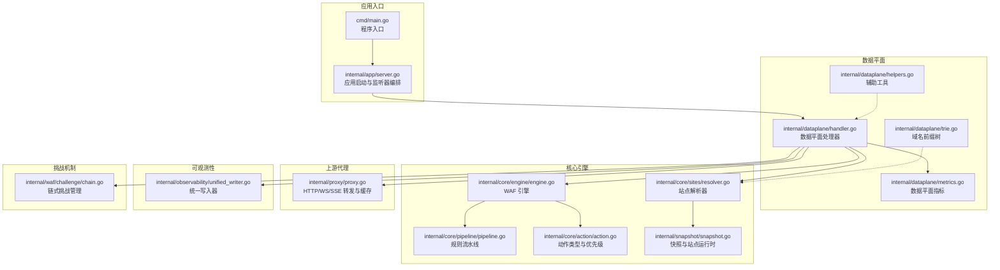
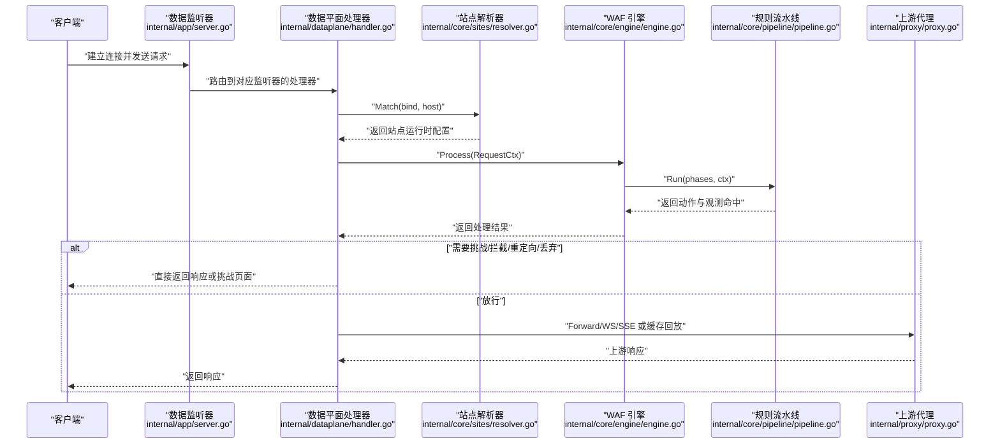
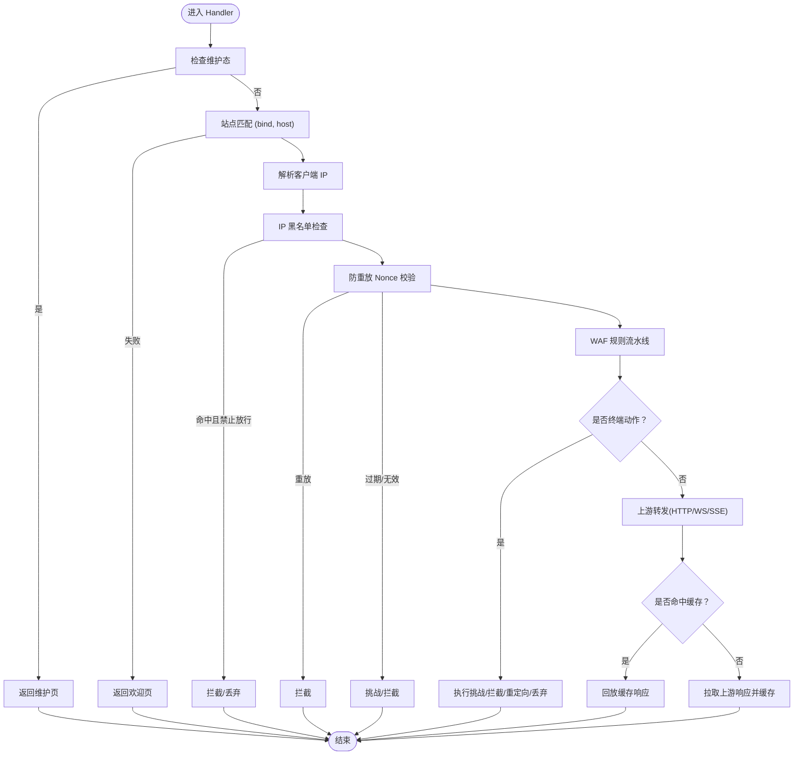
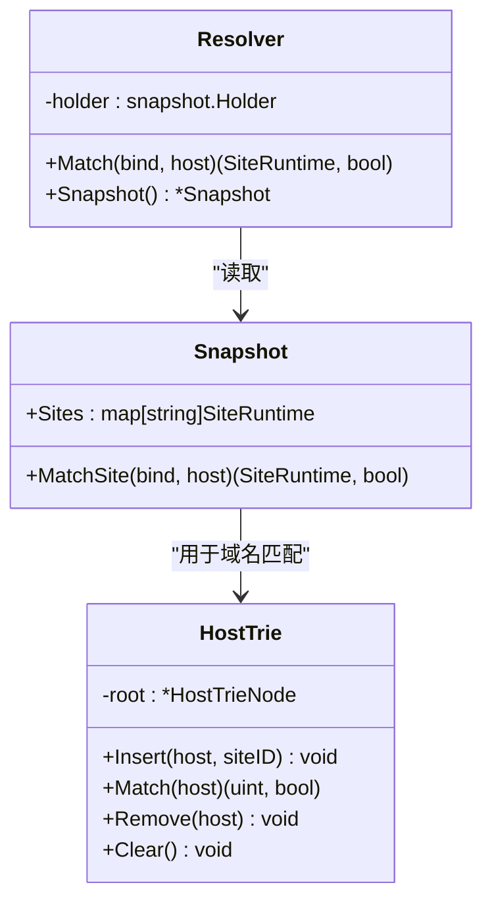
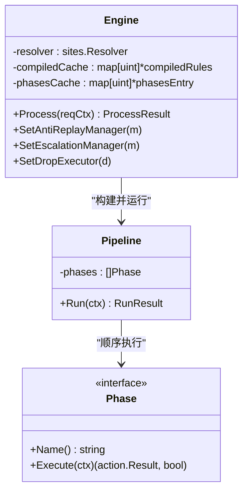
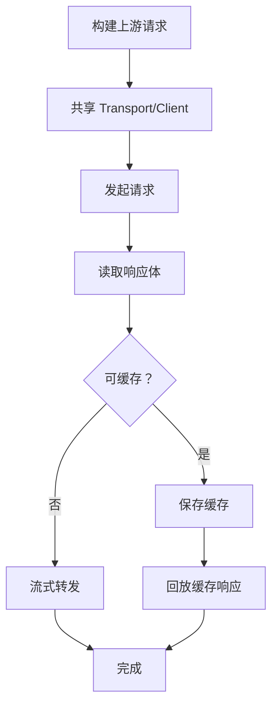
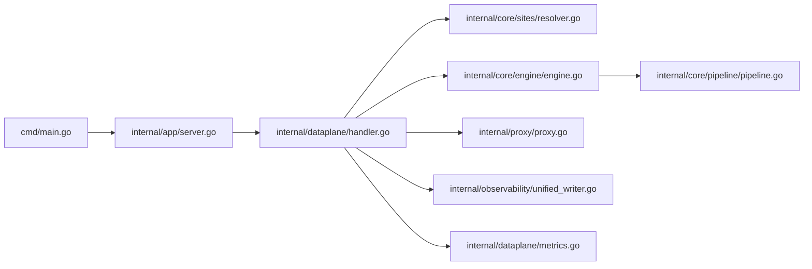

# 数据面设计

<cite>
**本文引用的文件**
- [cmd/main.go](file://cmd/main.go)
- [internal/app/server.go](file://internal/app/server.go)
- [internal/dataplane/handler.go](file://internal/dataplane/handler.go)
- [internal/dataplane/trie.go](file://internal/dataplane/trie.go)
- [internal/dataplane/helpers.go](file://internal/dataplane/helpers.go)
- [internal/core/snapshots/snapshot.go](file://internal/snapshot/snapshot.go)
- [internal/core/sites/resolver.go](file://internal/core/sites/resolver.go)
- [internal/core/engine/engine.go](file://internal/core/engine/engine.go)
- [internal/core/pipeline/pipeline.go](file://internal/core/pipeline/pipeline.go)
- [internal/core/action/action.go](file://internal/core/action/action.go)
- [internal/proxy/proxy.go](file://internal/proxy/proxy.go)
- [internal/dataplane/metrics.go](file://internal/dataplane/metrics.go)
- [internal/observability/unified_writer.go](file://internal/observability/unified_writer.go)
- [internal/waf/challenge/chain.go](file://internal/waf/challenge/chain.go)
</cite>

## 目录
1. [引言](#引言)
2. [项目结构](#项目结构)
3. [核心组件](#核心组件)
4. [架构总览](#架构总览)
5. [详细组件分析](#详细组件分析)
6. [依赖关系分析](#依赖关系分析)
7. [性能考量](#性能考量)
8. [故障排查指南](#故障排查指南)
9. [结论](#结论)
10. [附录](#附录)

## 引言
本文件面向 My-OpenWaf 的数据面（Data Plane），系统化阐述其架构理念与实现机制，重点覆盖以下方面：
- 按站点维度构建的监听器集合与热启动/热停止能力
- 请求处理全流程：从监听绑定、站点解析、WAF 引擎规则流水线、上游代理转发到响应返回
- 数据平面处理器（Handler）的工作原理与关键优化点
- WAF 引擎的处理机制、规则流水线执行过程
- 上游代理的转发逻辑与缓存策略
- 站点解析器与域名前缀树（Trie）匹配
- 如何实现高并发请求处理、保证处理效率与可观测性
- 数据面与控制面的协同方式（热重载、配置同步）

## 项目结构
My-OpenWaf 的数据面位于 internal/dataplane 与 internal/app 两个包中，配合 internal/core/* 提供引擎、规则、动作、流水线等核心能力；internal/proxy 提供上游转发与缓存；internal/observability 提供统一写入与指标。

图表来源
- [cmd/main.go:1-10](file://cmd/main.go#L1-L10)
- [internal/app/server.go:486-526](file://internal/app/server.go#L486-L526)
- [internal/dataplane/handler.go:68-780](file://internal/dataplane/handler.go#L68-L780)
- [internal/core/engine/engine.go:37-245](file://internal/core/engine/engine.go#L37-L245)
- [internal/core/pipeline/pipeline.go:50-124](file://internal/core/pipeline/pipeline.go#L50-L124)
- [internal/core/action/action.go:5-176](file://internal/core/action/action.go#L5-L176)
- [internal/snapshot/snapshot.go:72-118](file://internal/snapshot/snapshot.go#L72-L118)
- [internal/core/sites/resolver.go:7-32](file://internal/core/sites/resolver.go#L7-L32)
- [internal/proxy/proxy.go:481-522](file://internal/proxy/proxy.go#L481-L522)
- [internal/dataplane/metrics.go:8-133](file://internal/dataplane/metrics.go#L8-L133)
- [internal/observability/unified_writer.go:16-232](file://internal/observability/unified_writer.go#L16-L232)
- [internal/waf/challenge/chain.go:43-386](file://internal/waf/challenge/chain.go#L43-L386)

章节来源
- [cmd/main.go:1-10](file://cmd/main.go#L1-L10)
- [internal/app/server.go:52-396](file://internal/app/server.go#L52-L396)

## 核心组件
- 数据平面处理器（Handler）：封装维护态、WAF、拦截/丢弃、反向代理的完整处理链，负责站点解析、客户端 IP 解析、挑战/验证码/盾牌/链式挑战、错误率限制、日志与指标、上游转发与缓存。
- WAF 引擎（Engine）：按站点维度组织规则，构建规则流水线，执行多阶段规则匹配，支持 IP 黑名单、防重放、ACL、OWASP/CVE 并行检测、机器人评分、速率限制、签名与自定义规则。
- 规则流水线（Pipeline）：顺序执行各阶段，支持终端动作短路（Drop/Intercept/Challenge/Redirect/RateLimit），挑战动作延迟至最后评估。
- 站点解析器（Resolver）与域名前缀树（Trie）：基于 (bind, host) 快速匹配站点运行时配置，支持通配符匹配。
- 上游代理（Proxy）：HTTP/WS/SSE 转发、连接池复用、边缘缓存、响应体缓冲与回放、头部清洗。
- 统一写入器（Unified Writer）：异步批量写入安全事件、访问日志、丢弃事件与机器人评分，单事务提交，降低锁竞争。
- 指标（Metrics）：原子计数器与环形窗口统计 QPS、状态码分布、WAF 观测/拦截、内置命中、独立 IP 与攻击 IP 数。

章节来源
- [internal/dataplane/handler.go:68-780](file://internal/dataplane/handler.go#L68-L780)
- [internal/core/engine/engine.go:37-245](file://internal/core/engine/engine.go#L37-L245)
- [internal/core/pipeline/pipeline.go:50-124](file://internal/core/pipeline/pipeline.go#L50-L124)
- [internal/core/sites/resolver.go:7-32](file://internal/core/sites/resolver.go#L7-L32)
- [internal/dataplane/trie.go:9-121](file://internal/dataplane/trie.go#L9-L121)
- [internal/proxy/proxy.go:481-522](file://internal/proxy/proxy.go#L481-L522)
- [internal/observability/unified_writer.go:16-232](file://internal/observability/unified_writer.go#L16-L232)
- [internal/dataplane/metrics.go:8-133](file://internal/dataplane/metrics.go#L8-L133)

## 架构总览
数据面以“按站点维度的监听器集合”为核心，每个监听器绑定一个 bind 地址，内部通过站点解析器与域名前缀树完成精确或通配符匹配，随后进入 WAF 引擎规则流水线，根据结果决定拦截/丢弃/挑战/重定向/放行，最终将请求转发至上游或直接返回响应。整个过程贯穿统一写入器与指标系统，确保可观测性与性能。

图表来源
- [internal/app/server.go:486-526](file://internal/app/server.go#L486-L526)
- [internal/dataplane/handler.go:68-780](file://internal/dataplane/handler.go#L68-L780)
- [internal/core/sites/resolver.go:18-26](file://internal/core/sites/resolver.go#L18-L26)
- [internal/core/engine/engine.go:200-245](file://internal/core/engine/engine.go#L200-L245)
- [internal/core/pipeline/pipeline.go:78-118](file://internal/core/pipeline/pipeline.go#L78-L118)
- [internal/proxy/proxy.go:481-522](file://internal/proxy/proxy.go#L481-L522)

## 详细组件分析

### 数据平面处理器（Handler）
- 维护态优先：若全局或站点维护态开启，直接返回维护页。
- 站点解析：基于 (bind, host) 从快照中匹配站点运行时，支持通配符。
- 客户端 IP 解析：依据 XFF 模式与可信 CIDR 解析真实客户端 IP，并记录指标。
- IP 黑名单/白名单：若命中黑名单且动作允许，立即执行拦截或 TCP 丢弃。
- 防重放（Nonce）：对非静态资源路径在首次访问下发随机 Nonce Cookie，并校验后续请求的 Nonce，支持过期/重复/无效三种分支。
- 内置路径检测：针对特定路径与内容特征进行快速拦截。
- 规则流水线：构造 RequestCtx，调用引擎执行，支持观测命中与错误率限制。
- 动作处理：挑战（含 CAPTCHA/盾牌/链式挑战）、拦截、重定向、丢弃，均记录安全事件与访问日志。
- 上游转发：支持 HTTP/WS/SSE；HTTP 支持边缘响应缓存，命中则回放，未命中则拉取并按策略缓存。
- 后处理：空响应兜底、Server 头清理、指标统计、异步记录应用路由资源。

图表来源
- [internal/dataplane/handler.go:68-780](file://internal/dataplane/handler.go#L68-L780)

章节来源
- [internal/dataplane/handler.go:68-780](file://internal/dataplane/handler.go#L68-L780)

### 站点解析器与域名前缀树
- 站点解析器：基于快照 Holder 加载当前快照，提供 Match(bind, host) 返回站点运行时。
- 域名前缀树：支持精确匹配与通配符（*.example.com），域名标签反转存储，IP 地址作为单一节点避免错误拆分；支持插入、删除、清空与线程安全匹配。
- 快照：不可变视图，MatchSite 先精确匹配 bind+host，再尝试通配符匹配，最后返回未匹配。

图表来源
- [internal/core/sites/resolver.go:7-32](file://internal/core/sites/resolver.go#L7-L32)
- [internal/dataplane/trie.go:9-121](file://internal/dataplane/trie.go#L9-L121)
- [internal/snapshot/snapshot.go:72-118](file://internal/snapshot/snapshot.go#L72-L118)

章节来源
- [internal/core/sites/resolver.go:7-32](file://internal/core/sites/resolver.go#L7-L32)
- [internal/dataplane/trie.go:9-121](file://internal/dataplane/trie.go#L9-L121)
- [internal/snapshot/snapshot.go:72-118](file://internal/snapshot/snapshot.go#L72-L118)

### WAF 引擎与规则流水线
- 引擎职责：加载站点规则、构建规则流水线、执行流水线、返回动作与观测命中；支持 IP 黑名单、防重放、ACL、OWASP/CVE 并行、机器人评分、速率限制、签名与自定义规则。
- 流水线：顺序执行各阶段，终端动作优先级 Drop > Intercept > RateLimit > Challenge/Captcha/Shield/Chain > Redirect；挑战动作延迟评估，后续更高优先级动作可覆盖。
- 缓存：按快照修订号与策略 ID 缓存已编译规则与阶段链，避免每请求重复分配与编译。

图表来源
- [internal/core/engine/engine.go:37-245](file://internal/core/engine/engine.go#L37-L245)
- [internal/core/pipeline/pipeline.go:50-124](file://internal/core/pipeline/pipeline.go#L50-L124)

章节来源
- [internal/core/engine/engine.go:37-245](file://internal/core/engine/engine.go#L37-L245)
- [internal/core/pipeline/pipeline.go:50-124](file://internal/core/pipeline/pipeline.go#L50-L124)

### 上游代理与缓存
- 连接池与客户端复用：按 TLS 配置键值缓存 http.Transport 与 http.Client，减少连接开销与握手成本。
- 请求构建：保留原始路径与查询串，过滤 Hop-by-Hop 头部，注入出站转发头。
- 响应处理：支持 HTTP 流式转发与缓冲响应回放；边缘缓存仅对 GET/HEAD 200 且满足条件的响应生效；支持 Vary 与 Set-Cookie 策略。
- WS/SSE：专用转发函数，保持长连接语义。

图表来源
- [internal/proxy/proxy.go:481-522](file://internal/proxy/proxy.go#L481-L522)

章节来源
- [internal/proxy/proxy.go:481-522](file://internal/proxy/proxy.go#L481-L522)

### 挑战与阻断机制
- CAPTCHA/盾牌/链式挑战：根据站点保护配置选择挑战类型，链式挑战支持环境指纹、PoW 与 CAPTCHA 的组合步骤，步骤可按条件启用。
- 丢弃（Drop）：当启用时，对 Drop 动作直接关闭 TCP 连接，不返回 HTTP 响应，适合高风险场景。
- 挑战 Cookie：已通过挑战验证的客户端可获得带签名的挑战通过 Cookie，绕过后续挑战。

章节来源
- [internal/waf/challenge/chain.go:43-386](file://internal/waf/challenge/chain.go#L43-L386)
- [internal/dataplane/handler.go:492-497](file://internal/dataplane/handler.go#L492-L497)

### 监控与可观测性
- 统一写入器：将安全事件、访问日志、丢弃事件与机器人评分写入 Redis 列表与数据库事务，固定周期批量提交，降低锁竞争。
- 指标：原子计数器统计请求数、状态码分布、WAF 观测/拦截、内置命中、独立 IP 与攻击 IP，环形窗口统计近 1/5 秒 QPS。

章节来源
- [internal/observability/unified_writer.go:16-232](file://internal/observability/unified_writer.go#L16-L232)
- [internal/dataplane/metrics.go:8-133](file://internal/dataplane/metrics.go#L8-L133)

## 依赖关系分析
- 应用入口通过 internal/app/server.go 启动，按快照中的站点运行时构建数据监听器（buildDataServer），每个监听器绑定一个 bind 地址，使用 Hertz 服务器承载数据平面处理器。
- 数据平面处理器依赖站点解析器与快照，调用 WAF 引擎执行规则流水线，再根据结果选择挑战/拦截/重定向/丢弃或上游转发。
- 上游代理依赖共享连接池与客户端，结合边缘缓存提升吞吐与延迟表现。
- 统一写入器与指标分别服务于可观测性与性能监控。

图表来源
- [cmd/main.go:1-10](file://cmd/main.go#L1-L10)
- [internal/app/server.go:486-526](file://internal/app/server.go#L486-L526)
- [internal/dataplane/handler.go:68-780](file://internal/dataplane/handler.go#L68-L780)
- [internal/core/sites/resolver.go:7-32](file://internal/core/sites/resolver.go#L7-L32)
- [internal/core/engine/engine.go:37-245](file://internal/core/engine/engine.go#L37-L245)
- [internal/core/pipeline/pipeline.go:50-124](file://internal/core/pipeline/pipeline.go#L50-L124)
- [internal/proxy/proxy.go:481-522](file://internal/proxy/proxy.go#L481-L522)
- [internal/observability/unified_writer.go:16-232](file://internal/observability/unified_writer.go#L16-L232)
- [internal/dataplane/metrics.go:8-133](file://internal/dataplane/metrics.go#L8-L133)

章节来源
- [internal/app/server.go:486-526](file://internal/app/server.go#L486-L526)
- [internal/dataplane/handler.go:68-780](file://internal/dataplane/handler.go#L68-L780)

## 性能考量
- 连接与传输复用：共享 http.Transport 与 http.Client，按 TLS 配置键缓存，减少连接与握手开销。
- 规则与阶段链缓存：按快照修订号与策略 ID 缓存已编译规则与阶段链，避免每请求重复分配与编译。
- 边缘响应缓存：仅对 GET/HEAD 200 且满足条件的响应缓存，命中即回放，未命中则缓冲拉取并按策略缓存。
- 原子指标与环形窗口：使用原子计数器与环形窗口统计 QPS，避免锁竞争与内存膨胀。
- 统一写入器批处理：固定周期批量写入数据库，降低锁竞争与 IO 压力。
- 非阻塞通道：安全事件/访问日志/丢弃事件/机器人评分写入大缓冲通道，非阻塞发送，降低热路径 CPU 开销。

[本节为通用性能指导，无需具体文件引用]

## 故障排查指南
- 维护态导致请求被拦截：检查全局或站点维护态配置，确认返回维护页。
- 站点未匹配：核对 (bind, host) 是否在快照中存在精确或通配符匹配项。
- IP 黑名单拦截：检查 IP 黑名单列表与自动封禁配置，确认动作类型（拦截/丢弃）。
- 防重放失败：确认客户端是否携带有效 Nonce Cookie，检查过期/重复/无效分支的处理逻辑。
- 挑战未生效：确认 CAPTCHA/盾牌/链式挑战开关与超时配置，检查挑战通过 Cookie 是否正确下发与验证。
- 上游 502/504：检查上游地址配置、网络连通性与超时设置，查看错误页渲染与日志。
- 指标异常：检查指标统计逻辑与时间窗口，确认 QPS、状态码分布与 WAF 命中情况。

章节来源
- [internal/dataplane/handler.go:475-487](file://internal/dataplane/handler.go#L475-L487)
- [internal/snapshot/snapshot.go:94-118](file://internal/snapshot/snapshot.go#L94-L118)
- [internal/dataplane/metrics.go:82-96](file://internal/dataplane/metrics.go#L82-L96)

## 结论
My-OpenWaf 的数据面以“按站点维度的监听器集合”为基础，通过站点解析器与域名前缀树实现高效匹配，借助 WAF 引擎与规则流水线完成多阶段规则检测，结合上游代理与边缘缓存实现高并发与低延迟的请求处理。统一写入器与指标系统保障了可观测性与性能监控。数据面与控制面通过快照与热重载协同，实现配置变更的平滑过渡与监听器的动态增删改。

[本节为总结性内容，无需具体文件引用]

## 附录
- 监听器热管理：应用启动时按快照生成监听器，后续通过 reconcileListeners 比较期望与实际，自动增删与重启受影响监听器，确保配置漂移时的正确性。
- TLS 终止：监听器可配置 TLS，支持站点证书与 SNI 证书，按最小/最大 TLS 版本与 ALPN 协商。
- 配置同步：通过 Redis 发布订阅实现跨节点配置同步，触发热重载与监听器重建。

章节来源
- [internal/app/server.go:253-311](file://internal/app/server.go#L253-L311)
- [internal/app/server.go:486-526](file://internal/app/server.go#L486-L526)
- [internal/app/server.go:528-587](file://internal/app/server.go#L528-L587)