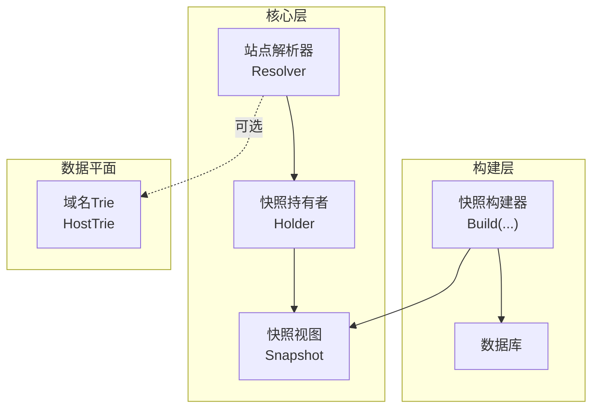
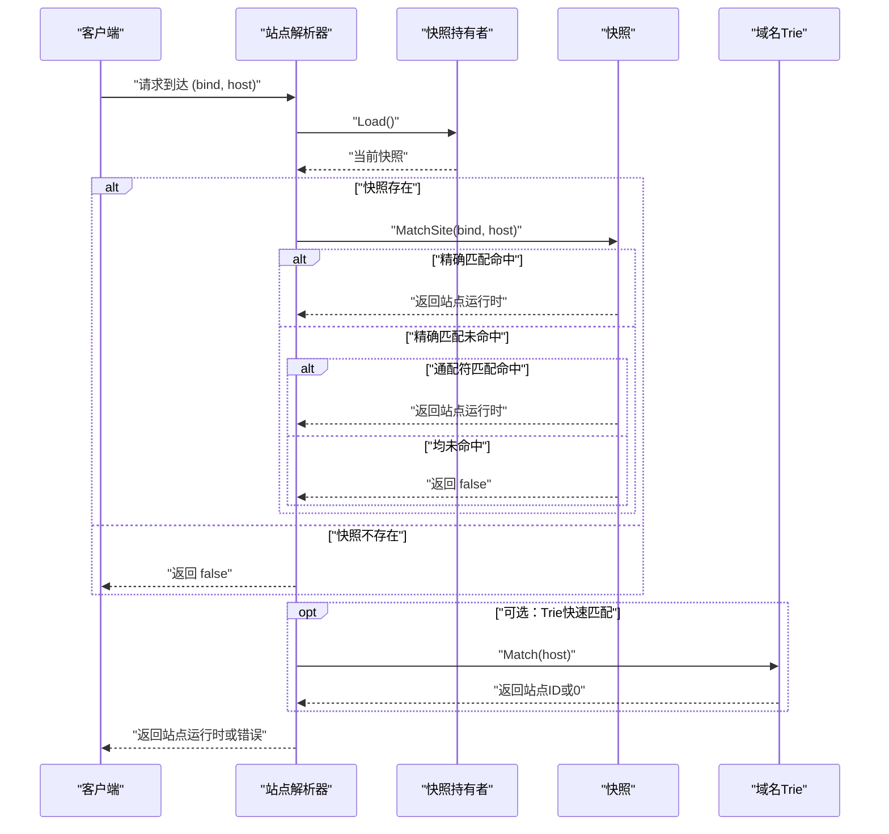
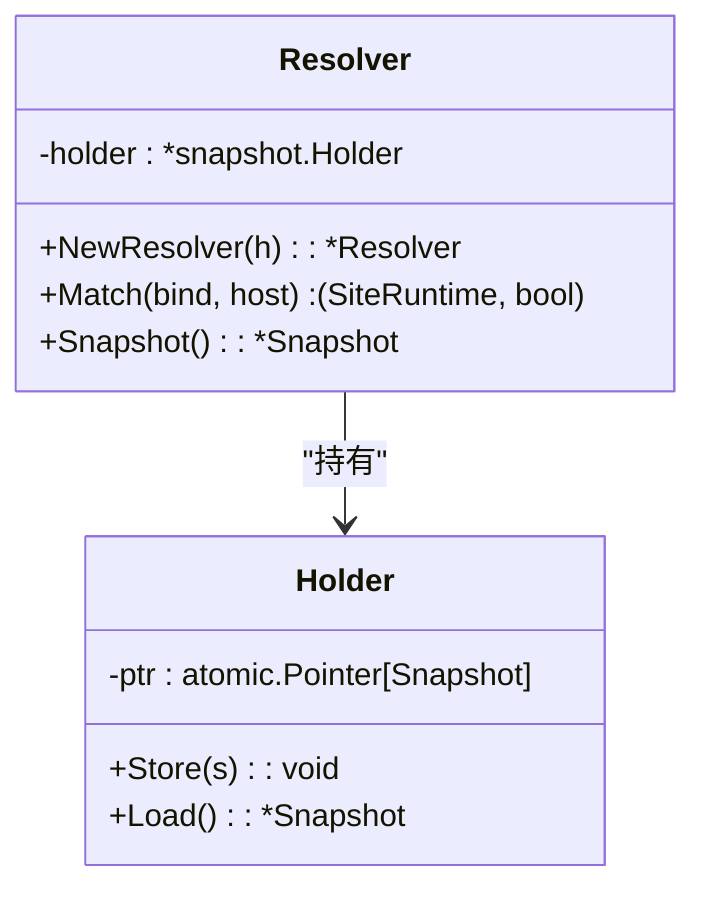
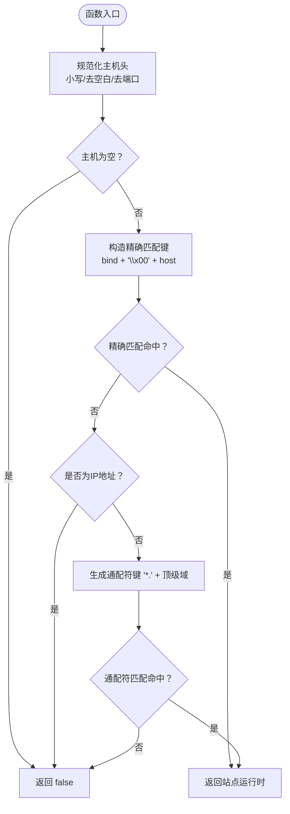
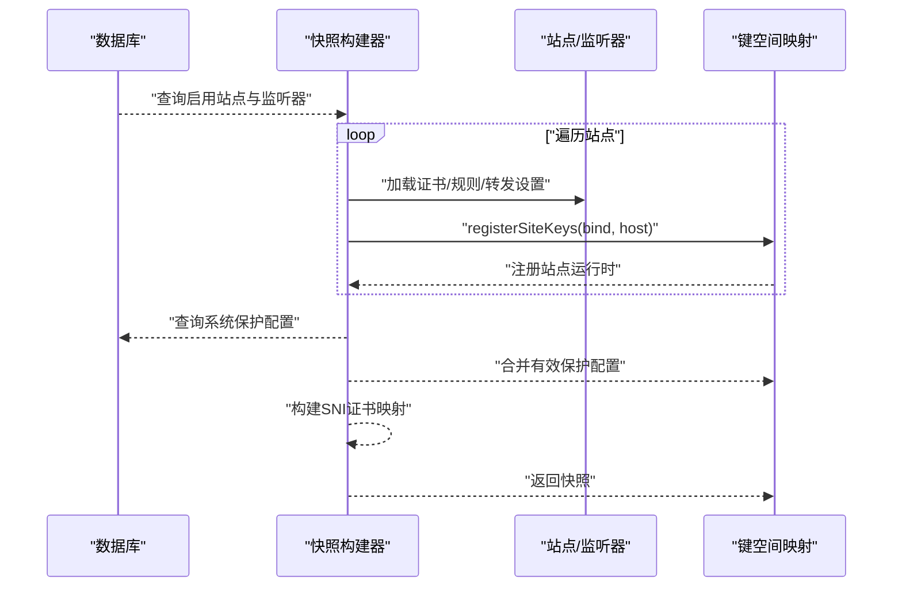
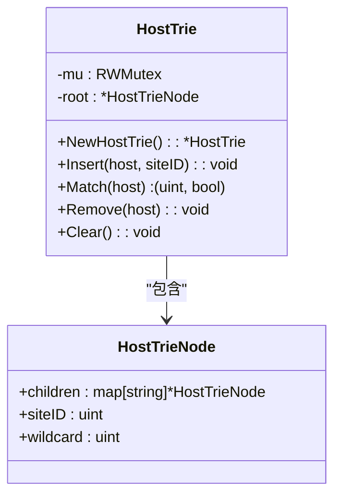
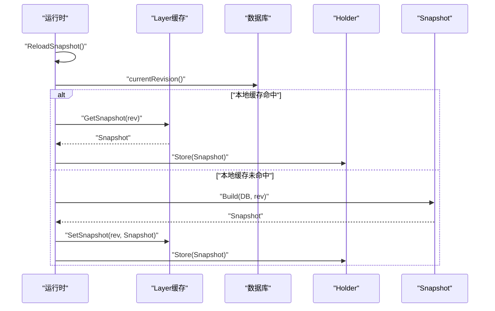
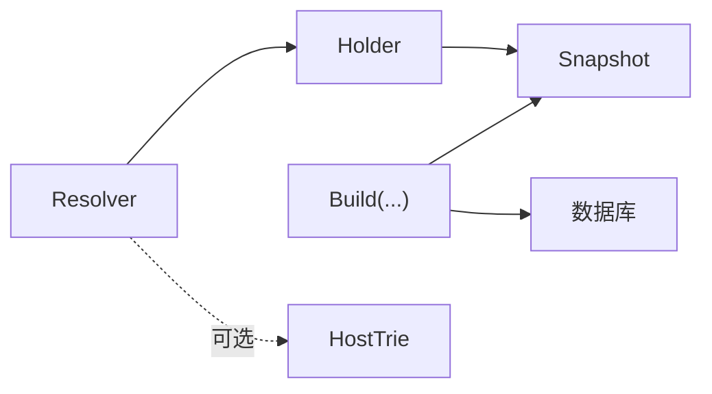

# 站点解析器

<cite>
**本文档引用的文件**
- [resolver.go](file://internal/core/sites/resolver.go)
- [snapshot.go](file://internal/snapshot/snapshot.go)
- [build.go](file://internal/snapshot/build.go)
- [trie.go](file://internal/dataplane/trie.go)
- [runtime.go](file://internal/core/runtime.go)
- [request flow.md](file://docs/数据平面处理/请求处理流程.md)
- [Ristretto 缓存实现.md](file://docs/缓存与性能优化/Ristretto 缓存实现.md)
- [性能优化策略.md](file://docs/缓存与性能优化/性能优化策略.md)
- [故障排除.md](file://docs/故障排除.md)
</cite>

## 目录
1. [简介](#简介)
2. [项目结构](#项目结构)
3. [核心组件](#核心组件)
4. [架构总览](#架构总览)
5. [详细组件分析](#详细组件分析)
6. [依赖分析](#依赖分析)
7. [性能考虑](#性能考虑)
8. [故障排查指南](#故障排查指南)
9. [结论](#结论)

## 简介
本文件聚焦 My-OpenWaf 的站点解析器，系统阐述其如何基于绑定地址与主机头信息进行站点匹配，包括快照系统的使用、站点匹配算法、性能优化策略（Trie 树与快速查找机制）、默认站点与通配符匹配、优先级排序，以及配置选项、调试方法与高并发表现。

## 项目结构
站点解析器位于核心层，围绕快照（Snapshot）提供只读视图，解析器通过原子指针持有当前快照，实现零拷贝的读路径与无锁匹配。快照构建器负责从数据库装载站点、监听器、证书与规则，并生成键空间映射；数据平面层提供基于 Trie 的域名匹配能力，作为可选的高性能替代方案。

**图表来源**
- [resolver.go:1-32](file://internal/core/sites/resolver.go#L1-L32)
- [snapshot.go:72-84](file://internal/snapshot/snapshot.go#L72-L84)
- [build.go:17-210](file://internal/snapshot/build.go#L17-L210)
- [trie.go:16-21](file://internal/dataplane/trie.go#L16-L21)

**章节来源**
- [resolver.go:1-32](file://internal/core/sites/resolver.go#L1-L32)
- [snapshot.go:72-84](file://internal/snapshot/snapshot.go#L72-L84)
- [build.go:17-210](file://internal/snapshot/build.go#L17-L210)
- [trie.go:16-21](file://internal/dataplane/trie.go#L16-L21)

## 核心组件
- 站点解析器（Resolver）
  - 作用：接收 (bind, host) 对，通过当前快照进行站点匹配。
  - 特性：仅读取快照，不修改状态；支持空快照返回 false。
- 快照（Snapshot）
  - 作用：不可变配置视图，提供站点映射与匹配逻辑。
  - 关键方法：MatchSite(bind, host)、NormalizeMatchHost(host)、isIPAddress(host)。
- 快照持有者（Holder）
  - 作用：通过原子指针保存当前快照，支持无锁读取。
- 快照构建器（Build）
  - 作用：从数据库加载站点、监听器、证书、规则，生成键空间映射与 SNI 证书映射。
- 域名 Trie（HostTrie）
  - 作用：线程安全的域名到站点 ID 的映射，支持通配符匹配，优先级为精确匹配 > 通配符匹配。

**章节来源**
- [resolver.go:7-31](file://internal/core/sites/resolver.go#L7-L31)
- [snapshot.go:25-84](file://internal/snapshot/snapshot.go#L25-L84)
- [snapshot.go:94-143](file://internal/snapshot/snapshot.go#L94-L143)
- [build.go:17-210](file://internal/snapshot/build.go#L17-L210)
- [trie.go:9-21](file://internal/dataplane/trie.go#L9-L21)

## 架构总览
站点解析器的匹配流程分为两阶段：先在快照中进行精确匹配，再进行通配符匹配；若两者均未命中，则判定为未匹配到站点。请求处理流程图展示了从读取 Host 头到构造键、精确匹配、通配符匹配与最终返回站点运行时的过程。

**图表来源**
- [resolver.go:18-31](file://internal/core/sites/resolver.go#L18-L31)
- [snapshot.go:94-118](file://internal/snapshot/snapshot.go#L94-L118)
- [request flow.md:120-143](file://docs/数据平面处理/请求处理流程.md#L120-L143)

**章节来源**
- [resolver.go:18-31](file://internal/core/sites/resolver.go#L18-L31)
- [snapshot.go:94-118](file://internal/snapshot/snapshot.go#L94-L118)
- [request flow.md:120-143](file://docs/数据平面处理/请求处理流程.md#L120-L143)

## 详细组件分析

### 解析器类与职责
- Resolver
  - 字段：holder *snapshot.Holder
  - 方法：NewResolver、Match(bind, host)、Snapshot()
  - 行为：加载当前快照，委托快照执行匹配；若快照为空返回 false。
- Holder
  - 字段：ptr atomic.Pointer[Snapshot]
  - 方法：Store(s)、Load()
  - 行为：原子存储与读取快照，实现零拷贝读路径。

**图表来源**
- [resolver.go:9-31](file://internal/core/sites/resolver.go#L9-L31)
- [snapshot.go:145-152](file://internal/snapshot/snapshot.go#L145-L152)

**章节来源**
- [resolver.go:9-31](file://internal/core/sites/resolver.go#L9-L31)
- [snapshot.go:145-152](file://internal/snapshot/snapshot.go#L145-L152)

### 快照匹配算法
- 输入规范化
  - NormalizeMatchHost(host)：小写化、去空白、剥离端口（仅当端口为纯数字时）。
  - isIPAddress(host)：判断是否为 IP 地址（IPv4/IPv6）。
- 键空间设计
  - SiteMapKey(bind, host)：使用 NUL 分隔 bind 与 host，统一小写与去空白。
- 匹配顺序
  1) 精确匹配：键为 SiteMapKey(bind, normalizedHost)。
  2) 通配符匹配：仅对非 IP 域名有效，生成 "*." + 域名后缀，再进行精确匹配。
  3) 未命中：返回 false。
- 关键约束
  - 跨绑定回退被禁止：MatchSite 在同一 bind 内部匹配，不会跨绑定回退。
  - 多主机支持：registerSiteKeys 将站点的逗号分隔主机逐一注册，支持通配符混用。

**图表来源**
- [snapshot.go:94-118](file://internal/snapshot/snapshot.go#L94-L118)
- [snapshot.go:120-138](file://internal/snapshot/snapshot.go#L120-L138)
- [snapshot.go:140-143](file://internal/snapshot/snapshot.go#L140-L143)
- [build.go:258-271](file://internal/snapshot/build.go#L258-L271)

**章节来源**
- [snapshot.go:94-118](file://internal/snapshot/snapshot.go#L94-L118)
- [snapshot.go:120-138](file://internal/snapshot/snapshot.go#L120-L138)
- [snapshot.go:140-143](file://internal/snapshot/snapshot.go#L140-L143)
- [build.go:258-271](file://internal/snapshot/build.go#L258-L271)

### 快照构建与键注册
- 构建流程
  - 从数据库加载启用的站点与监听器，合并证书与规则，生成 SiteRuntime。
  - 为每个站点的每个监听器组合生成 bind 与主机的键映射。
  - 注册 SNI 证书映射，支持按监听器绑定与主机名匹配。
- 键注册规则
  - registerSiteKeys：遍历站点主机列表（支持逗号分隔与通配符），规范化后注册到键空间。
  - 去重策略：若键已存在则跳过，保留首次注册的站点。
- 应用路由规则
  - 为每个站点编译应用路由规则，注入到 SiteRuntime。

**图表来源**
- [build.go:17-210](file://internal/snapshot/build.go#L17-L210)
- [build.go:258-271](file://internal/snapshot/build.go#L258-L271)

**章节来源**
- [build.go:17-210](file://internal/snapshot/build.go#L17-L210)
- [build.go:258-271](file://internal/snapshot/build.go#L258-L271)

### Trie 树匹配（可选高性能路径）
- 数据结构
  - HostTrieNode：包含子节点映射、精确匹配站点 ID、通配符匹配站点 ID。
  - HostTrie：根节点、读写锁、反向标签存储（域名反转、IP 作为单节点）。
- 插入与匹配
  - Insert：支持通配符（*.example.com），去除前缀后按标签插入。
  - Match：优先精确匹配，若无精确子节点则检查通配符子节点 "*"，返回最佳通配符匹配。
- 线程安全
  - 插入使用互斥锁，匹配使用读写锁，读路径开销低。

**图表来源**
- [trie.go:9-21](file://internal/dataplane/trie.go#L9-L21)
- [trie.go:30-66](file://internal/dataplane/trie.go#L30-L66)
- [trie.go:68-121](file://internal/dataplane/trie.go#L68-L121)

**章节来源**
- [trie.go:9-21](file://internal/dataplane/trie.go#L9-L21)
- [trie.go:30-66](file://internal/dataplane/trie.go#L30-L66)
- [trie.go:68-121](file://internal/dataplane/trie.go#L68-L121)

### 默认站点与通配符匹配
- 默认站点
  - 快照未提供“默认站点”字段；未命中时返回 false，由上层决定后续行为（例如回退至任意同绑定站点或返回 404/444）。
- 通配符匹配
  - 仅对非 IP 域名有效，生成 "*." + 顶级域进行精确匹配。
  - 支持多主机站点中的通配符混用，键注册时分别登记。
- 优先级排序
  - 精确匹配优先于通配符匹配；同一层级下按注册顺序保留首个站点。

**章节来源**
- [snapshot.go:106-114](file://internal/snapshot/snapshot.go#L106-L114)
- [build.go:258-271](file://internal/snapshot/build.go#L258-L271)

### 快照系统与热重载
- 快照不可变性
  - Snapshot 结构体不可变，通过 Holder 的原子指针进行切换，读路径零拷贝、无锁。
- 修订号与缓存
  - currentRevision 从数据库表获取当前修订号，用于缓存键与版本控制。
  - Layer 与 Snapshot 协作，先查本地缓存命中则直接使用，否则构建后写入缓存。
- 重载流程
  - ReloadSnapshot：计算修订号 → 本地缓存查询 → 构建新快照 → 写入缓存 → 原子存储新快照。

**图表来源**
- [runtime.go:82-99](file://internal/core/runtime.go#L82-L99)
- [Ristretto 缓存实现.md:281-302](file://docs/缓存与性能优化/Ristretto 缓存实现.md#L281-L302)

**章节来源**
- [runtime.go:82-99](file://internal/core/runtime.go#L82-L99)
- [Ristretto 缓存实现.md:265-302](file://docs/缓存与性能优化/Ristretto 缓存实现.md#L265-L302)

## 依赖分析
- 解析器依赖快照持有者，快照持有者依赖原子指针实现无锁读取。
- 快照构建器依赖数据库、应用路由编译器与存储层，生成键空间映射与 SNI 证书映射。
- 数据平面的 Trie 与解析器解耦，可作为可选加速路径，提升高并发场景下的域名匹配性能。

**图表来源**
- [resolver.go:1-32](file://internal/core/sites/resolver.go#L1-L32)
- [snapshot.go:72-84](file://internal/snapshot/snapshot.go#L72-L84)
- [build.go:17-210](file://internal/snapshot/build.go#L17-L210)
- [trie.go:16-21](file://internal/dataplane/trie.go#L16-L21)

**章节来源**
- [resolver.go:1-32](file://internal/core/sites/resolver.go#L1-L32)
- [snapshot.go:72-84](file://internal/snapshot/snapshot.go#L72-L84)
- [build.go:17-210](file://internal/snapshot/build.go#L17-L210)
- [trie.go:16-21](file://internal/dataplane/trie.go#L16-L21)

## 性能考虑
- 读路径优化
  - 快照不可变 + 原子指针切换，读路径零拷贝、无锁，适合高并发场景。
  - Trie 树匹配在域名维度上具有 O(L) 时间复杂度（L 为标签长度），读路径使用读写锁，降低热点竞争。
- 写路径优化
  - 快照构建在后台进行，通过修订号与缓存层避免重复构建。
  - Layer 缓存命中后直接使用，减少数据库与构建开销。
- 资源复用
  - 对象池与分片锁（如响应缓存）降低 GC 压力与锁竞争。
- I/O 优化
  - RedisKV 默认超时控制，避免阻塞主流程；Trie 与快照均为内存操作，无网络往返。

**章节来源**
- [性能优化策略.md:180-242](file://docs/缓存与性能优化/性能优化策略.md#L180-L242)
- [性能优化策略.md:384-400](file://docs/缓存与性能优化/性能优化策略.md#L384-L400)
- [Ristretto 缓存实现.md:265-302](file://docs/缓存与性能优化/Ristretto 缓存实现.md#L265-L302)

## 故障排查指南
- 常见问题定位
  - 未匹配到站点：检查 Host 头是否包含端口、是否为 IP 地址、是否跨绑定匹配。
  - 跨绑定误匹配：确认 MatchSite 在同一绑定内匹配，不会跨绑定回退。
  - 多主机未生效：确认站点主机字段逗号分隔与通配符格式正确，且未被去重覆盖。
- 调试方法
  - 查看日志级别与输出：支持 DEBUG/INFO/WARN/ERROR，结合 section 标签定位模块。
  - 使用 /status 与 /metrics：核对 revision、sites、listeners 与错误趋势。
- 配置与环境
  - 确认数据库驱动与 DSN、Redis 配置、管理员绑定地址等环境变量设置正确。

**章节来源**
- [故障排除.md:298-328](file://docs/故障排除.md#L298-L328)
- [snapshot_test.go:20-50](file://internal/snapshot/snapshot_test.go#L20-L50)
- [snapshot_test.go:52-64](file://internal/snapshot/snapshot_test.go#L52-L64)
- [snapshot_test.go:133-150](file://internal/snapshot/snapshot_test.go#L133-L150)

## 结论
站点解析器通过快照系统与原子指针实现高并发下的稳定与高效匹配，结合 Trie 树可进一步优化域名匹配性能。其匹配算法严格限定在同一绑定范围内，支持精确匹配与通配符匹配，并通过缓存与热重载机制保障配置变更的平滑过渡。配合完善的日志与监控体系，可在生产环境中可靠运行并快速定位问题。