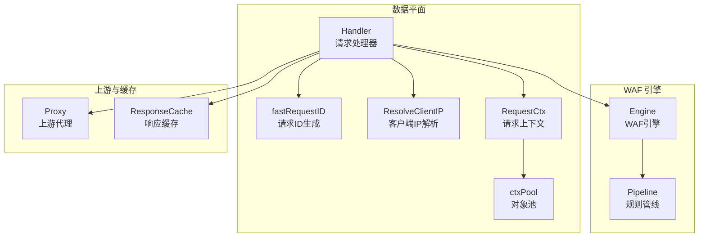
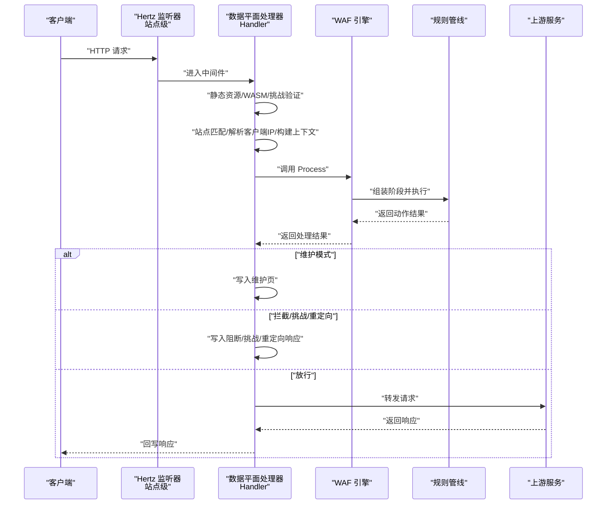
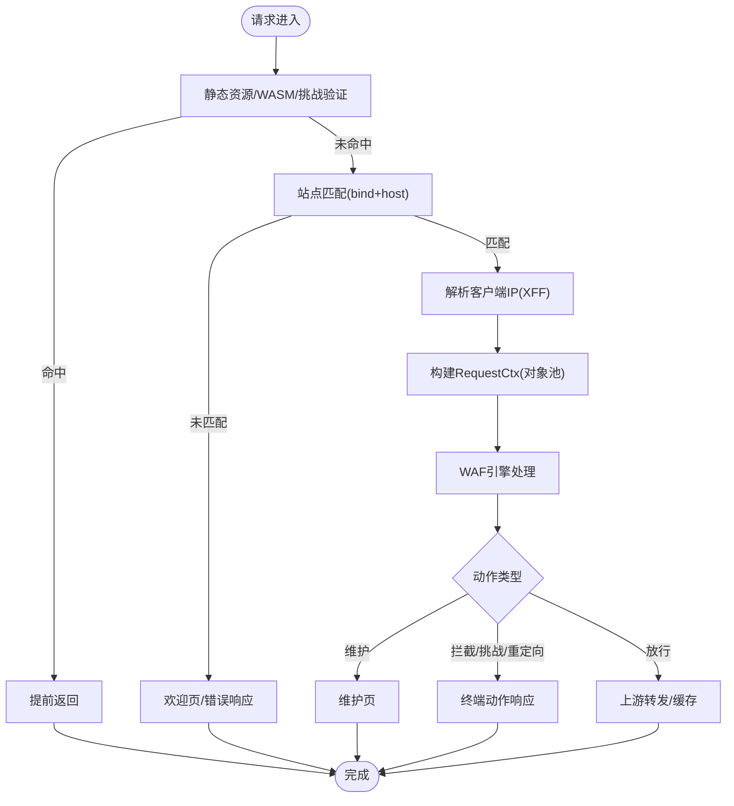
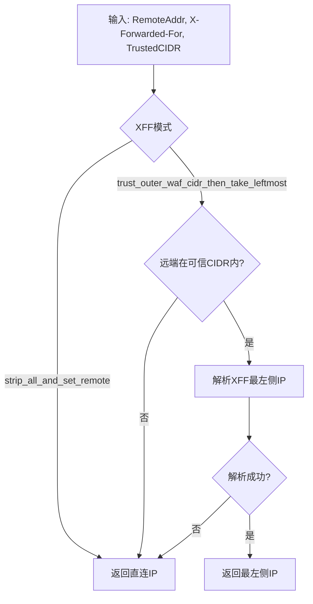
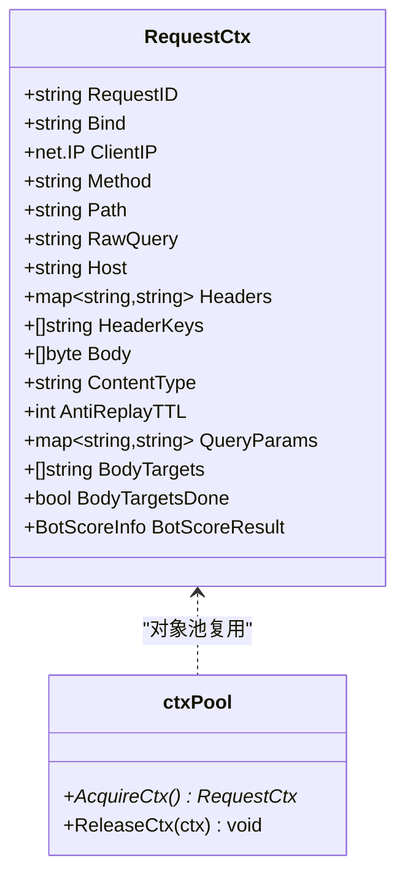
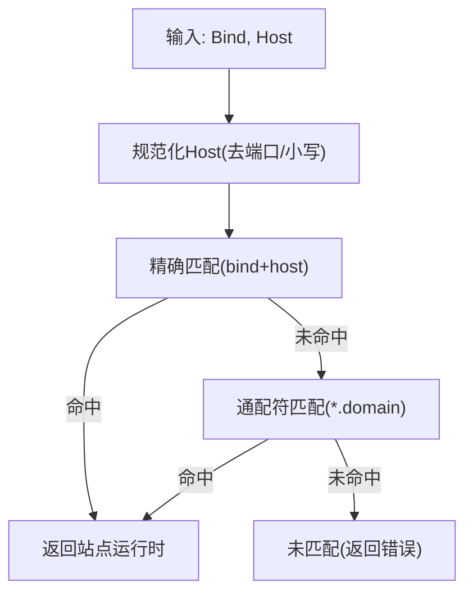
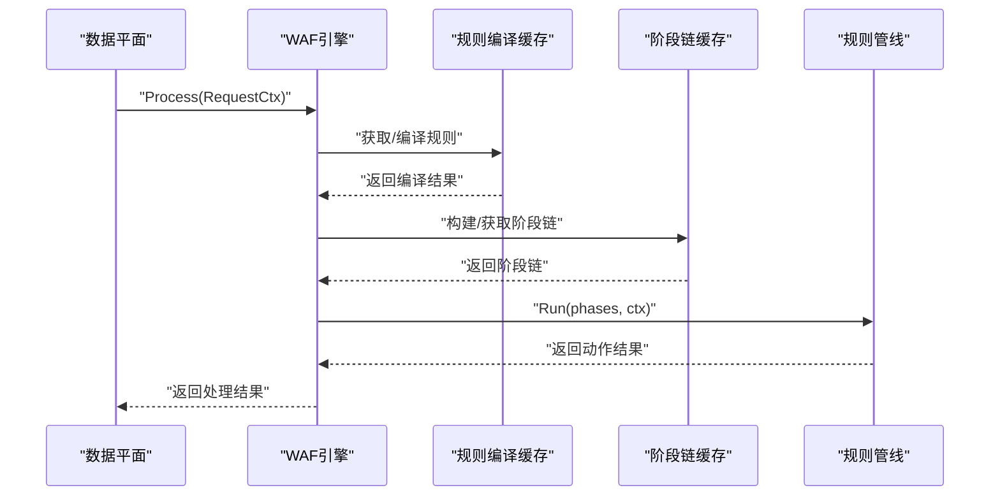
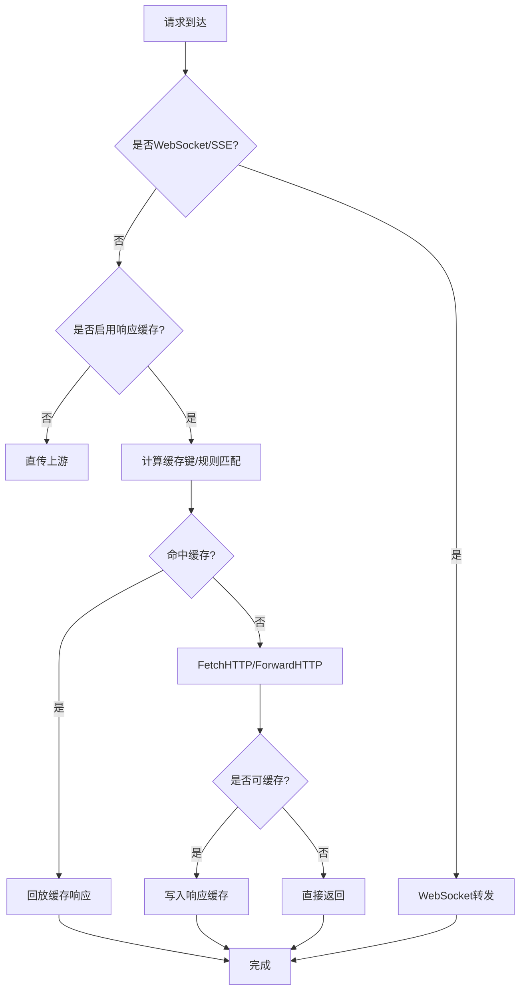
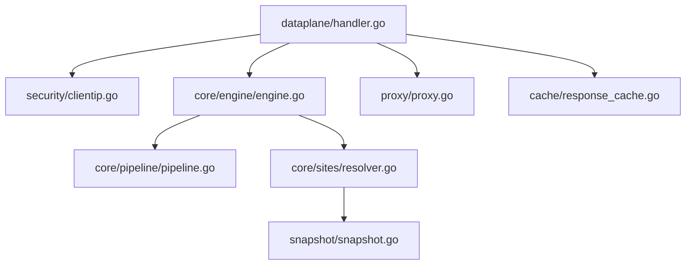

# 请求处理器

<cite>
**本文档引用的文件**
- [handler.go](file://internal/dataplane/handler.go)
- [reqid.go](file://internal/dataplane/reqid.go)
- [clientip.go](file://internal/security/clientip.go)
- [engine.go](file://internal/core/engine/engine.go)
- [pipeline.go](file://internal/core/pipeline/pipeline.go)
- [pool.go](file://internal/core/pipeline/pool.go)
- [proxy.go](file://internal/proxy/proxy.go)
- [resolver.go](file://internal/core/sites/resolver.go)
- [snapshot.go](file://internal/snapshot/snapshot.go)
- [Ristretto 缓存实现.md](file://docs/缓存与性能优化/Ristretto 缓存实现.md)
- [请求处理流程.md](file://docs/数据平面处理/请求处理流程.md)
- [客户端 IP 获取.md](file://docs/安全机制/客户端 IP 获取.md)
</cite>

## 目录
1. [简介](#简介)
2. [项目结构](#项目结构)
3. [核心组件](#核心组件)
4. [架构概览](#架构概览)
5. [详细组件分析](#详细组件分析)
6. [依赖关系分析](#依赖关系分析)
7. [性能考虑](#性能考虑)
8. [故障排除指南](#故障排除指南)
9. [结论](#结论)

## 简介
本文件面向 My-OpenWaf 的请求处理器，系统性阐述其在高并发场景下的请求生命周期管理、客户端 IP 解析、请求 ID 生成与请求上下文构建机制。文档同时覆盖静态资源处理、挑战验证、维护模式检查、站点匹配等关键流程，并深入分析性能优化策略（对象池、原子操作、连接池、缓存与内存分配优化），辅以流程图与关键代码示例路径，帮助读者在理解实现细节的同时掌握在高并发环境下的最佳实践。

## 项目结构
请求处理器位于数据平面层，围绕 Hertz 中间件模式组织，负责：
- 静态资源与挑战验证的前置处理
- 客户端 IP 解析与 XFF 模式处理
- 请求上下文构建与对象池复用
- WAF 引擎处理与动作决策
- 上游转发与响应缓存
- 访问日志与安全事件记录

**图表来源**
- [handler.go:69-1177](file://internal/dataplane/handler.go#L69-L1177)
- [reqid.go:29-38](file://internal/dataplane/reqid.go#L29-L38)
- [clientip.go:12-49](file://internal/security/clientip.go#L12-L49)
- [pipeline.go:9-65](file://internal/core/pipeline/pipeline.go#L9-L65)
- [pool.go:5-42](file://internal/core/pipeline/pool.go#L5-L42)
- [engine.go:200-245](file://internal/core/engine/engine.go#L200-L245)
- [proxy.go:45-108](file://internal/proxy/proxy.go#L45-L108)

**章节来源**
- [handler.go:69-1177](file://internal/dataplane/handler.go#L69-L1177)
- [reqid.go:29-38](file://internal/dataplane/reqid.go#L29-L38)
- [clientip.go:12-49](file://internal/security/clientip.go#L12-L49)
- [pipeline.go:9-65](file://internal/core/pipeline/pipeline.go#L9-L65)
- [pool.go:5-42](file://internal/core/pipeline/pool.go#L5-L42)
- [engine.go:200-245](file://internal/core/engine/engine.go#L200-L245)
- [proxy.go:45-108](file://internal/proxy/proxy.go#L45-L108)

## 核心组件
- 请求处理器 Handler：Hertz 中间件入口，串联静态资源、挑战验证、站点匹配、WAF 处理、上游转发与缓存。
- 请求 ID 生成 fastRequestID：基于原子计数器与进程前缀，生成短小唯一的请求 ID，避免系统调用与 UUID 开销。
- 客户端 IP 解析 ResolveClientIP：支持 strip_all_and_set_remote 与 trust_outer_waf_cidr_then_take_leftmost 两种 XFF 模式，结合可信 CIDR 判定。
- 请求上下文 RequestCtx：承载请求元数据与可复用字段，配合对象池减少 GC 压力。
- WAF 引擎 Engine：编译并缓存规则，构建阶段链，执行规则管线并返回动作结果。
- 上游代理 Proxy：连接池与客户端缓存、响应缓冲与边缘缓存策略。
- 站点解析器 Resolver 与快照 Snapshot：基于原子指针的不可变快照，支持 bind+host 精确匹配与通配符匹配。

**章节来源**
- [handler.go:69-1177](file://internal/dataplane/handler.go#L69-L1177)
- [reqid.go:29-38](file://internal/dataplane/reqid.go#L29-L38)
- [clientip.go:12-49](file://internal/security/clientip.go#L12-L49)
- [pipeline.go:9-65](file://internal/core/pipeline/pipeline.go#L9-L65)
- [engine.go:200-245](file://internal/core/engine/engine.go#L200-L245)
- [resolver.go:18-26](file://internal/core/sites/resolver.go#L18-L26)
- [snapshot.go:94-118](file://internal/snapshot/snapshot.go#L94-L118)

## 架构概览
下图展示一次请求从进入站点监听器到最终响应的关键交互，涵盖静态资源、挑战验证、站点匹配、WAF 处理、上游转发与缓存。

**图表来源**
- [handler.go:75-1177](file://internal/dataplane/handler.go#L75-L1177)
- [engine.go:200-245](file://internal/core/engine/engine.go#L200-L245)
- [pipeline.go:78-118](file://internal/core/pipeline/pipeline.go#L78-L118)

**章节来源**
- [handler.go:75-1177](file://internal/dataplane/handler.go#L75-L1177)
- [engine.go:200-245](file://internal/core/engine/engine.go#L200-L245)
- [pipeline.go:78-118](file://internal/core/pipeline/pipeline.go#L78-L118)

## 详细组件分析

### 请求生命周期管理
- 静态资源与挑战验证前置：优先处理 WASM 资产与挑战验证端点，避免进入 WAF 流水线。
- 维护模式检查：全局或站点级维护模式直接返回维护页。
- WAF 处理：调用 Engine.Process，执行规则管线，支持观察命中与终端动作。
- 上游转发：根据请求类型（HTTP/WebSocket/SSE）与缓存策略决定直传或缓存回放。
- 日志与事件：统一记录访问日志、安全事件与丢弃事件，支持异步写入。

**图表来源**
- [handler.go:75-1177](file://internal/dataplane/handler.go#L75-L1177)
- [engine.go:200-245](file://internal/core/engine/engine.go#L200-L245)

**章节来源**
- [handler.go:75-1177](file://internal/dataplane/handler.go#L75-L1177)
- [engine.go:200-245](file://internal/core/engine/engine.go#L200-L245)

### 客户端IP解析与XFF处理
- 模式支持：strip_all_and_set_remote（始终信任直连 IP，忽略 X-Forwarded-For）与 trust_outer_waf_cidr_then_take_leftmost（仅当远端在可信 CIDR 内时信任 XFF 左侧 IP）。
- 可信 CIDR 解析：支持逗号、换行、分号分隔，单个 IP 或 CIDR 均可。
- 回退策略：若 X-Forwarded-For 缺失或解析失败，回退到远端直连 IP。
- 性能要点：线性扫描与 CIDR 判定开销小，GeoIP 查询存在锁竞争，建议缓存与批量查询。

**图表来源**
- [clientip.go:12-49](file://internal/security/clientip.go#L12-L49)

**章节来源**
- [clientip.go:12-49](file://internal/security/clientip.go#L12-L49)
- [客户端 IP 获取.md:132-138](file://docs/安全机制/客户端 IP 获取.md#L132-L138)

### 请求ID生成与请求上下文构建
- 请求ID生成：进程启动时生成随机前缀，结合原子自增计数器形成唯一短 ID，避免系统调用与 UUID 开销。
- 请求上下文：RequestCtx 包含请求标识、绑定地址、客户端IP、方法、路径、原始查询、主机、头部、Body、内容类型等；通过对象池 Acquire/Release 复用，减少 GC 压力。
- 头部缓存：一次性转换常用字段（方法、UA、路径），降低多次转换带来的分配与拷贝。

**图表来源**
- [pipeline.go:9-65](file://internal/core/pipeline/pipeline.go#L9-L65)
- [pool.go:5-42](file://internal/core/pipeline/pool.go#L5-L42)
- [reqid.go:29-38](file://internal/dataplane/reqid.go#L29-L38)

**章节来源**
- [reqid.go:29-38](file://internal/dataplane/reqid.go#L29-L38)
- [pipeline.go:9-65](file://internal/core/pipeline/pipeline.go#L9-L65)
- [pool.go:5-42](file://internal/core/pipeline/pool.go#L5-L42)

### 站点匹配与维护模式检查
- 匹配策略：先精确匹配 bind+host，再尝试通配符（如 *.example.com），最后回退到同绑定地址下的任意站点。
- 绑定地址与 TLS：每个站点拥有独立监听器实例，支持 TLS 终止与 SNI 映射。
- 维护模式：全局或站点级维护模式直接返回拦截动作，WAF 引擎在处理前即进行维护门禁检查。

**图表来源**
- [snapshot.go:94-118](file://internal/snapshot/snapshot.go#L94-L118)
- [resolver.go:18-26](file://internal/core/sites/resolver.go#L18-L26)

**章节来源**
- [snapshot.go:94-118](file://internal/snapshot/snapshot.go#L94-L118)
- [resolver.go:18-26](file://internal/core/sites/resolver.go#L18-L26)
- [请求处理流程.md:110-117](file://docs/数据平面处理/请求处理流程.md#L110-L117)

### WAF处理流程与规则管线
- 规则编译与缓存：按快照修订号与策略ID缓存编译后的规则，避免重复编译。
- 阶段链构建：根据站点配置与保护策略构建阶段链（IP信誉、反重放、ACL、OWASP/CVE、机器人检测、速率限制、签名与自定义规则）。
- 管线执行：支持挑战动作延迟（后续阶段仍执行），最终根据优先级决定是否挑战或拦截。

**图表来源**
- [engine.go:98-198](file://internal/core/engine/engine.go#L98-L198)
- [pipeline.go:78-118](file://internal/core/pipeline/pipeline.go#L78-L118)

**章节来源**
- [engine.go:98-198](file://internal/core/engine/engine.go#L98-L198)
- [pipeline.go:78-118](file://internal/core/pipeline/pipeline.go#L78-L118)

### 上游转发与响应缓存
- 连接池与客户端缓存：按 TLS 配置键缓存 http.Transport 与 http.Client，提升并发效率。
- 响应缓存：基于规则匹配与 HTTP/头部约束判断是否缓存，支持边缘缓存回放与响应缓冲。
- WebSocket/SSE：分别走专用转发路径，避免与常规 HTTP 缓存混用。

**图表来源**
- [proxy.go:45-108](file://internal/proxy/proxy.go#L45-L108)
- [proxy.go:172-197](file://internal/proxy/proxy.go#L172-L197)
- [proxy.go:455-479](file://internal/proxy/proxy.go#L455-L479)

**章节来源**
- [proxy.go:45-108](file://internal/proxy/proxy.go#L45-L108)
- [proxy.go:172-197](file://internal/proxy/proxy.go#L172-L197)
- [proxy.go:455-479](file://internal/proxy/proxy.go#L455-L479)

## 依赖关系分析
- Handler 依赖：安全模块（ResolveClientIP）、WAF 引擎（Engine）、代理模块（Proxy）、缓存模块（ResponseCache）、站点解析（Resolver/Snapshot）。
- 引擎内部：规则编译缓存与阶段链缓存，避免每次请求重复昂贵的编译与构建。
- 上游代理：连接池与客户端缓存，减少连接建立与 TLS 握手开销。

**图表来源**
- [handler.go:69-1177](file://internal/dataplane/handler.go#L69-L1177)
- [clientip.go:12-49](file://internal/security/clientip.go#L12-L49)
- [engine.go:200-245](file://internal/core/engine/engine.go#L200-L245)
- [pipeline.go:78-118](file://internal/core/pipeline/pipeline.go#L78-L118)
- [resolver.go:18-26](file://internal/core/sites/resolver.go#L18-L26)
- [snapshot.go:94-118](file://internal/snapshot/snapshot.go#L94-L118)
- [proxy.go:45-108](file://internal/proxy/proxy.go#L45-L108)

**章节来源**
- [handler.go:69-1177](file://internal/dataplane/handler.go#L69-L1177)
- [engine.go:200-245](file://internal/core/engine/engine.go#L200-L245)
- [resolver.go:18-26](file://internal/core/sites/resolver.go#L18-L26)
- [snapshot.go:94-118](file://internal/snapshot/snapshot.go#L94-L118)
- [proxy.go:45-108](file://internal/proxy/proxy.go#L45-L108)

## 性能考虑
- 对象池与内存：RequestCtx 来自对象池，减少 GC 压力；Body 扫描上限控制，避免内存滥用。
- 原子操作：请求 ID 生成使用原子计数器，避免系统调用；快照使用原子指针交换，读路径零拷贝。
- 连接复用：上游传输层连接池按 TLS 配置键缓存，提升并发效率。
- 异步事件：安全事件异步批处理，避免阻塞热路径。
- 指标采样：按需记录访问、拦截、攻击 IP、内置命中等指标，便于观测与告警。
- 速率限制：固定窗口计数，带清理协程，避免内存膨胀。
- 缓存策略：响应缓存与边缘缓存结合，减少上游压力；Ristretto 快照缓存与响应缓存配合，提升整体吞吐。

**章节来源**
- [pool.go:5-42](file://internal/core/pipeline/pool.go#L5-L42)
- [reqid.go:29-38](file://internal/dataplane/reqid.go#L29-L38)
- [proxy.go:45-108](file://internal/proxy/proxy.go#L45-L108)
- [Ristretto 缓存实现.md:199-217](file://docs/缓存与性能优化/Ristretto 缓存实现.md#L199-L217)

## 故障排除指南
- 静态资源未命中：确认路径前缀与静态资源解析逻辑，检查 WASM 资产端点。
- 挑战验证失败：检查验证码/Shield/Chain 管理器配置与会话参数，确认 Cookie 设置。
- 站点未匹配：核对 bind 与 host 的规范化与通配符匹配规则，确认快照中站点映射。
- 客户端 IP 异常：检查 XFF 模式与可信 CIDR 配置，确认代理链是否正确传递头部。
- 上游超时/502：检查上游 URL、TLS 配置与连接池状态，确认错误页面渲染。
- 缓存命中异常：核对缓存键生成规则、TTL 与头部约束，确认边缘缓存策略。

**章节来源**
- [handler.go:820-843](file://internal/dataplane/handler.go#L820-L843)
- [handler.go:1051-1158](file://internal/dataplane/handler.go#L1051-L1158)
- [snapshot.go:94-118](file://internal/snapshot/snapshot.go#L94-L118)
- [clientip.go:12-49](file://internal/security/clientip.go#L12-L49)
- [proxy.go:481-500](file://internal/proxy/proxy.go#L481-L500)
- [Ristretto 缓存实现.md:374-396](file://docs/缓存与性能优化/Ristretto 缓存实现.md#L374-L396)

## 结论
My-OpenWaf 的请求处理器通过清晰的中间件分层、高效的对象池与原子操作、完善的站点匹配与 WAF 规则管线，以及连接池与响应缓存策略，在高并发场景下实现了低延迟与高吞吐。静态资源与挑战验证的前置处理、客户端 IP 的灵活 XFF 解析、请求上下文的轻量化构建，以及异步事件与指标采样，共同构成了稳定可靠的请求处理闭环。建议在生产环境中持续监控缓存命中率、内存使用与上游延迟，结合业务特征调优参数以获得最佳性能。