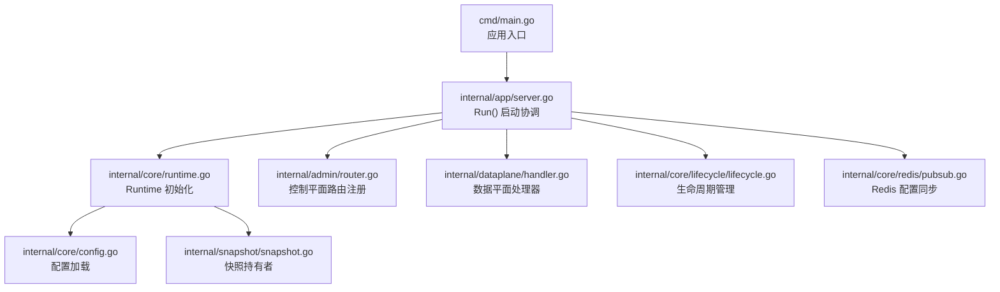
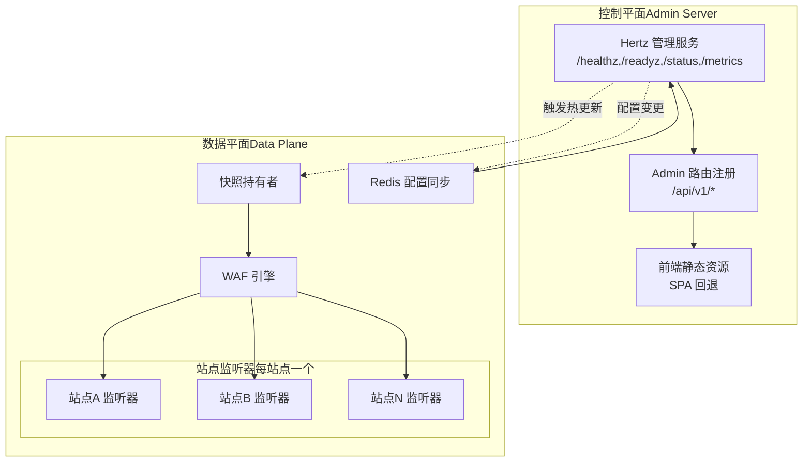
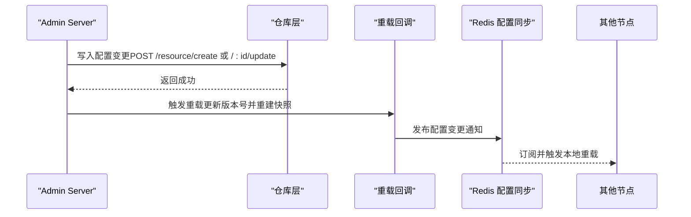
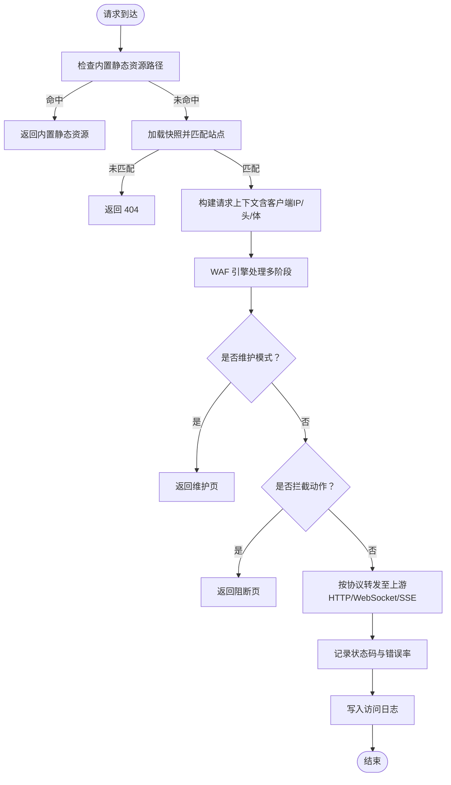
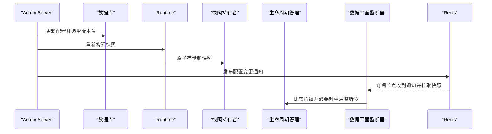
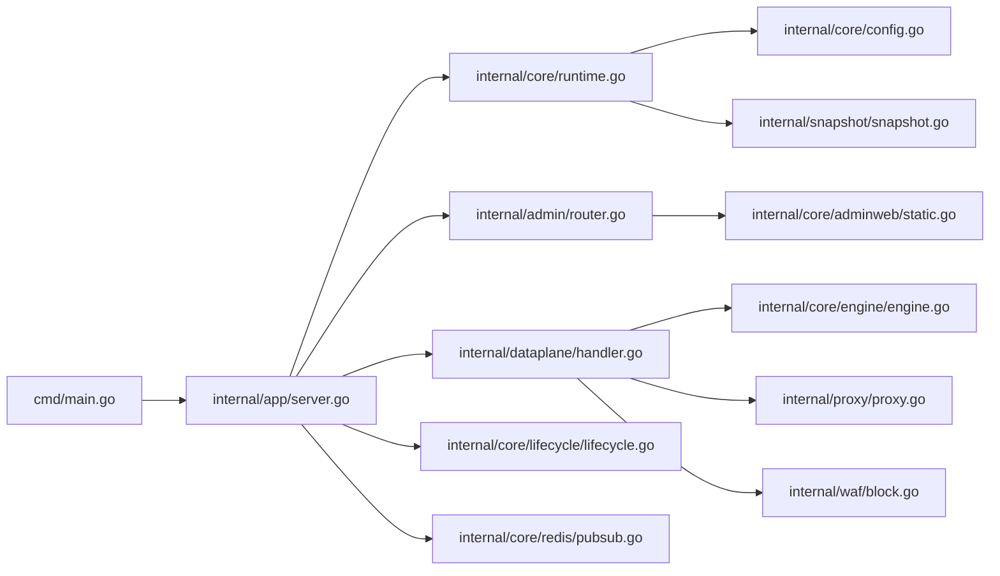
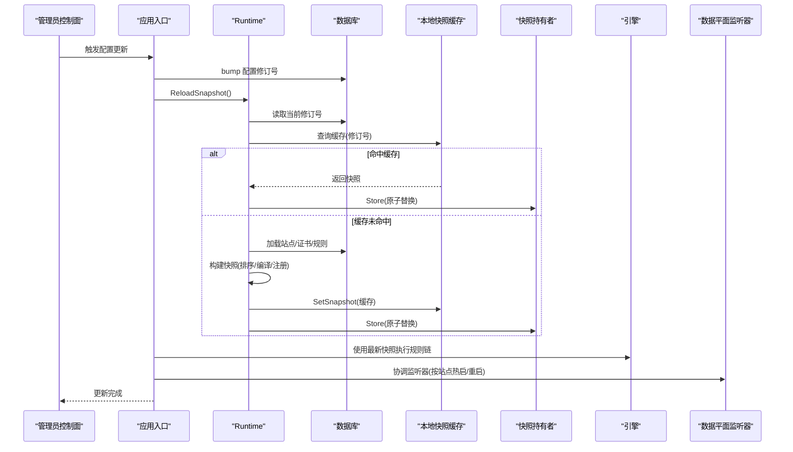

# 系统架构设计

本模块系统性阐述 My-OpenWaf 的系统架构设计，涵盖控制面与数据面的分离理念、双服务器架构、快照模式、热重载机制以及各核心组件的协作关系。文档按子系统划分为**架构总览**、**控制面**、**数据面**与**核心机制**四大主题，帮助读者从整体到局部理解系统的数据流、组件交互与性能设计。

<cite>
**本文档引用的文件**
- [cmd/main.go](file://cmd/main.go)
- [internal/app/server.go](file://internal/app/server.go)
- [internal/core/config.go](file://internal/core/config.go)
- [internal/core/runtime.go](file://internal/core/runtime.go)
- [internal/snapshot/snapshot.go](file://internal/snapshot/snapshot.go)
- [internal/snapshot/build.go](file://internal/snapshot/build.go)
- [internal/core/engine/engine.go](file://internal/core/engine/engine.go)
- [internal/dataplane/handler.go](file://internal/dataplane/handler.go)
- [internal/core/lifecycle/lifecycle.go](file://internal/core/lifecycle/lifecycle.go)
- [internal/core/redis/pubsub.go](file://internal/core/redis/pubsub.go)
- [internal/cache/layer.go](file://internal/cache/layer.go)
- [docs/架构设计/双服务器架构详解.md](file://docs/架构设计/双服务器架构详解.md)
- [docs/架构设计/快照模式实现.md](file://docs/架构设计/快照模式实现.md)
- [docs/架构设计/组件关系图.md](file://docs/架构设计/组件关系图.md)
- [docs/配置管理系统/热重载系统.md](file://docs/配置管理系统/热重载系统.md)
</cite>

> **子页面分类索引**

### 架构总览
- [组件关系图](./组件关系图.md) — 通过类图与交互图梳理运行时、引擎、流水线、数据平面与上游代理的组件协作关系
- [数据流分析](./数据流分析.md) — 解析请求从进入系统到最终响应的完整处理路径，涵盖站点匹配、WAF 规则链、动作决策与上游转发

### 控制面
- [控制面设计](./控制面设计.md) — 阐述管理端口、路由注册、中间件体系、健康检查与生命周期管理的设计与实现

### 数据面
- [数据面设计](./数据面设计/数据面设计.md) — 数据面整体架构概述，包括按站点维度的监听器集合、请求处理全流程与数据面/控制面协同
- [请求处理器](./数据面设计/请求处理器.md) — 请求生命周期管理、客户端 IP 解析、请求上下文构建与对象池复用机制
- [站点解析器](./数据面设计/站点解析器.md) — 基于绑定地址与主机头的站点匹配算法，含 Trie 树加速与快照热重载
- [WAF 引擎集成](./数据面设计/WAF引擎集成.md) — WAF 引擎与数据平面的集成方式，包括规则流水线、阶段调度与动作决策
- [上游代理](./数据面设计/上游代理.md) — HTTP/WebSocket/SSE 转发、轮询负载均衡、连接池复用、代理头部处理与响应缓存策略
- [WebSocket 处理](./数据面设计/WebSocket处理.md) — WebSocket 协议升级、双向数据传输、帧级检查与 WAF 集成
- [SSE 事件推送](./数据面设计/SSE事件推送.md) — SSE 流式转发机制、事件写入器缓冲批处理与前端实时事件展示

### 核心机制
- [快照机制](./快照机制.md) — 不可变配置快照、原子指针切换、版本号驱动的热重载与跨节点同步
- [缓存与性能优化](./缓存与性能优化.md) — Ristretto 进程内缓存、响应缓存、Redis 分布式 KV 与限流，以及对象池与指标监控

## 目录
1. [简介](#简介)
2. [项目结构](#项目结构)
3. [核心组件](#核心组件)
4. [架构总览](#架构总览)
5. [详细组件分析](#详细组件分析)
6. [依赖关系分析](#依赖关系分析)
7. [性能考量](#性能考量)
8. [故障排查指南](#故障排查指南)
9. [结论](#结论)
10. [附录](#附录)

## 简介
本文件系统性阐述 My-OpenWaf 的系统架构设计，重点围绕控制面与数据面的分离理念、双服务器架构的工作原理与优势、快照模式的不可变性与热重载机制展开。通过对核心组件（运行时、快照、引擎、数据平面处理器、生命周期管理、Redis 配置同步）的深入分析，解释数据流向与组件交互关系，并提供架构决策的技术考量、性能权衡与可扩展性设计建议。

## 项目结构
My-OpenWaf 采用命令行入口启动，随后在运行时初始化核心子系统：数据库、可选 Redis、缓存层、快照持有者等。应用入口通过 server.Run() 协调控制平面与数据平面服务实例，分别挂载管理路由与监听器，并通过生命周期管理器统一启动与优雅关闭。

**图示来源**
- [cmd/main.go:1-10](file://cmd/main.go#L1-L10)
- [internal/app/server.go:33-280](file://internal/app/server.go#L33-L280)
- [internal/core/runtime.go:27-80](file://internal/core/runtime.go#L27-L80)
- [internal/core/config.go:31-66](file://internal/core/config.go#L31-L66)
- [internal/snapshot/snapshot.go:98-105](file://internal/snapshot/snapshot.go#L98-L105)
- [internal/core/lifecycle/lifecycle.go:47-178](file://internal/core/lifecycle/lifecycle.go#L47-L178)
- [internal/core/redis/pubsub.go:21-77](file://internal/core/redis/pubsub.go#L21-L77)

**章节来源**
- [cmd/main.go:1-10](file://cmd/main.go#L1-L10)
- [internal/app/server.go:33-280](file://internal/app/server.go#L33-L280)

## 核心组件
- 运行时环境（Runtime）
  - 负责打开数据库与可选 Redis，初始化缓存层与快照持有者，提供全局配置访问。
- 快照（Snapshot）
  - 不可变的运行时视图，包含站点映射、保护配置、默认阻断页与 SNI 证书等，通过原子指针切换实现热更新。
- 引擎（Engine）
  - 组织 WAF 处理流水线，按阶段执行规则匹配与动作决策，支持观察命中记录与维护模式短路。
- 数据平面处理器（DataPlane Handler）
  - 每个监听器使用统一中间件，负责静态资源、维护模式、WAF 拦截、上游转发与错误率统计。
- 控制平面路由器（Admin Router）
  - 提供认证、站点/证书/策略/规则/设置/事件/仪表盘等管理接口，支持前端静态资源回退。
- 生命周期管理（Lifecycle Manager）
  - 统一管理多个 Hertz 服务器的启动、停止与信号处理，支持按站点指纹检测配置漂移并热重启。
- Redis 配置同步（ConfigSync）
  - 基于 Redis 发布/订阅的分布式配置变更通知，确保多节点一致。

**章节来源**
- [internal/core/runtime.go:17-80](file://internal/core/runtime.go#L17-L80)
- [internal/snapshot/snapshot.go:52-105](file://internal/snapshot/snapshot.go#L52-L105)
- [internal/core/engine/engine.go:15-146](file://internal/core/engine/engine.go#L15-L146)
- [internal/dataplane/handler.go:26-257](file://internal/dataplane/handler.go#L26-L257)
- [internal/core/lifecycle/lifecycle.go:30-178](file://internal/core/lifecycle/lifecycle.go#L30-L178)
- [internal/core/redis/pubsub.go:13-77](file://internal/core/redis/pubsub.go#L13-L77)

## 架构总览
My-OpenWaf 将控制平面与数据平面解耦：
- 控制平面（Admin Server）
  - 监听管理端口，提供 REST API 与前端静态资源托管，负责配置变更与系统管理。
- 数据平面（Data Plane）
  - 每个站点绑定地址对应一个独立监听器，共享引擎与快照，实现按站点粒度的启停与热更新。

**图示来源**
- [internal/app/server.go:245-280](file://internal/app/server.go#L245-L280)
- [internal/dataplane/handler.go:37-257](file://internal/dataplane/handler.go#L37-L257)
- [internal/core/redis/pubsub.go:33-68](file://internal/core/redis/pubsub.go#L33-L68)

## 详细组件分析

### 控制平面（Admin Server）设计
- 职责
  - 健康检查与状态查询
  - 系统指标导出（Prometheus 兼容）
  - 管理 API：站点、证书、策略、规则、设置、事件、仪表盘、API Key 等
  - 前端静态资源托管与 SPA 回退
- 关键点
  - 使用 Hertz 注册健康与指标端点
  - 通过依赖注入将仓库、重载回调、静态资源目录、JWT 密钥与指标对象传入
  - 所有更新/删除操作采用 POST + 特定后缀语义，简化反向代理与 CORS 配置
  - 前端静态资源通过嵌入或磁盘覆盖两种方式解析，未命中 API 的路径回退到前端页面

**图示来源**
- [internal/admin/router.go:54-137](file://internal/admin/router.go#L54-L137)
- [internal/app/server.go:203-243](file://internal/app/server.go#L203-L243)
- [internal/core/redis/pubsub.go:33-68](file://internal/core/redis/pubsub.go#L33-L68)

**章节来源**
- [internal/admin/router.go:19-137](file://internal/admin/router.go#L19-L137)
- [internal/app/server.go:245-280](file://internal/app/server.go#L245-L280)

### 数据平面（Data Plane）设计
- 职责
  - 静态资源与内部工具页分发
  - 维护模式短路
  - WAF 规则链评估与拦截
  - 上游 HTTP/WebSocket/SSE 转发
  - 错误率统计与访问日志
- 关键点
  - 每个站点绑定地址创建独立监听器，支持 TLS 终止与 SNI 证书
  - 请求进入后从快照中解析站点，提取客户端 IP、头信息、Body（限制大小）等
  - 引擎按阶段执行：IP 名单、ACL、机器人检测、请求速率限制、OWASP 规则、签名与自定义规则
  - 若命中拦截动作，直接返回阻断页；否则根据协议类型选择 HTTP/WebSocket/SSE 转发
  - 支持错误率统计（4xx/5xx），用于后续限流

**图示来源**
- [internal/dataplane/handler.go:37-257](file://internal/dataplane/handler.go#L37-L257)
- [internal/core/engine/engine.go:44-106](file://internal/core/engine/engine.go#L44-L106)

**章节来源**
- [internal/dataplane/handler.go:26-257](file://internal/dataplane/handler.go#L26-L257)
- [internal/core/engine/engine.go:15-146](file://internal/core/engine/engine.go#L15-L146)

### 配置同步与一致性保障
- 快照驱动
  - 配置变更通过版本号递增与快照重建实现原子切换，数据平面读取时仅需原子指针读取
- 分布式通知
  - 控制平面在重载完成后通过 Redis 发布"reload"消息；其他节点订阅后拉取最新快照并热更新监听器
- 配置漂移检测
  - 为每个站点监听器生成指纹（包含绑定地址、TLS 开关、最小/最大 TLS 版本、ALPN、证书内容等），当指纹变化时触发重启

**图示来源**
- [internal/app/server.go:203-243](file://internal/app/server.go#L203-L243)
- [internal/core/runtime.go:82-99](file://internal/core/runtime.go#L82-L99)
- [internal/core/lifecycle/lifecycle.go:133-201](file://internal/app/server.go#L133-L201)
- [internal/core/redis/pubsub.go:33-68](file://internal/core/redis/pubsub.go#L33-L68)

**章节来源**
- [internal/app/server.go:203-243](file://internal/app/server.go#L203-L243)
- [internal/core/runtime.go:82-99](file://internal/core/runtime.go#L82-L99)
- [internal/core/lifecycle/lifecycle.go:133-201](file://internal/app/server.go#L133-L201)
- [internal/core/redis/pubsub.go:13-77](file://internal/core/redis/pubsub.go#L13-L77)

### 站点级监听器与热启停
- 每个启用且配置有效的站点都会创建独立监听器实例，名称包含站点 ID 与绑定地址
- 通过指纹比较检测配置漂移（如绑定地址、TLS 开关、证书变更），自动移除旧监听器并启动新的
- 支持按站点启停，便于灰度与故障隔离

**章节来源**
- [internal/app/server.go:133-201](file://internal/app/server.go#L133-L201)
- [internal/app/server.go:282-308](file://internal/app/server.go#L282-L308)
- [internal/app/server.go:434-457](file://internal/app/server.go#L434-L457)

## 依赖关系分析

**图示来源**
- [cmd/main.go:1-10](file://cmd/main.go#L1-L10)
- [internal/app/server.go:33-280](file://internal/app/server.go#L33-L280)
- [internal/core/runtime.go:17-80](file://internal/core/runtime.go#L17-L80)
- [internal/core/config.go:10-66](file://internal/core/config.go#L10-L66)
- [internal/snapshot/snapshot.go:52-105](file://internal/snapshot/snapshot.go#L52-L105)
- [internal/dataplane/handler.go:26-257](file://internal/dataplane/handler.go#L26-L257)
- [internal/core/engine/engine.go:15-146](file://internal/core/engine/engine.go#L15-L146)
- [internal/core/lifecycle/lifecycle.go:30-178](file://internal/core/lifecycle/lifecycle.go#L30-L178)
- [internal/core/redis/pubsub.go:13-77](file://internal/core/redis/pubsub.go#L13-L77)

**章节来源**
- [cmd/main.go:1-10](file://cmd/main.go#L1-L10)
- [internal/app/server.go:33-280](file://internal/app/server.go#L33-L280)

## 性能考量
- 快照不可变与原子切换
  - 降低数据平面读路径的锁竞争，提升并发性能
- 请求上下文池化
  - 减少 GC 压力，提高吞吐
- 上游连接复用
  - 基于 TLS 配置的传输池，减少连接建立开销
- 限流与错误率统计
  - 在响应后进行错误率统计，避免影响请求路径延迟
- 按站点监听器
  - 将负载隔离到不同监听器，便于水平扩展与资源配额控制

## 故障排查指南
- 控制平面
  - 健康检查失败：确认数据库与 Redis 可达性，检查 AdminBind 配置
  - API 返回 404：确认路由前缀与静态资源回退逻辑
- 数据平面
  - 503：快照未加载或站点未匹配，检查配置与重载流程
  - 404：站点未匹配，检查 Host 与绑定地址
  - 502：上游未配置或上游错误，检查站点上游配置与网络连通性
- 配置同步
  - 多节点不一致：检查 Redis 是否可用，确认发布/订阅通道是否正常
- 日志与指标
  - 启用详细日志，结合 X-Request-ID 定位问题；通过 Prometheus 指标观察 QPS、错误率与拦截数

**章节来源**
- [internal/admin/router.go:41-41](file://internal/admin/router.go#L41-L41)
- [internal/dataplane/handler.go:56-59](file://internal/dataplane/handler.go#L56-L59)
- [internal/dataplane/handler.go:202-205](file://internal/dataplane/handler.go#L202-L205)
- [internal/core/redis/pubsub.go:33-68](file://internal/core/redis/pubsub.go#L33-L68)

## 结论
My-OpenWaf 的双服务器架构通过控制平面与数据平面的清晰分离，实现了管理与防护的高内聚低耦合。控制平面专注配置与可观测性，数据平面专注高性能实时处理。快照与 Redis 同步机制确保了配置变更的一致性与可追溯性；按站点监听器的设计提升了可扩展性与可维护性。整体架构在性能、可靠性与运维效率之间取得了良好平衡。

## 附录

### 快照模式实现与热重载机制
- 不可变快照与原子指针切换
  - 快照持有者使用原子指针保存 Snapshot 指针，读路径无需锁，写路径仅在重载时短暂阻塞
- 快照构建与缓存
  - 通过修订号驱动构建流程，进程内 ristretto 缓存命中可避免重复构建
- 监听器协调与跨节点同步
  - 按站点维度重建监听器，检测配置漂移并热重启受影响实例；通过 Redis 发布订阅触发其他节点重载

**图示来源**
- [internal/app/server.go:215-255](file://internal/app/server.go#L215-L255)
- [internal/core/runtime.go:82-99](file://internal/core/runtime.go#L82-L99)
- [internal/cache/layer.go:40-64](file://internal/cache/layer.go#L40-L64)
- [internal/snapshot/build.go:14-143](file://internal/snapshot/build.go#L14-L143)

**章节来源**
- [internal/snapshot/snapshot.go:98-105](file://internal/snapshot/snapshot.go#L98-L105)
- [internal/snapshot/build.go:14-143](file://internal/snapshot/build.go#L14-L143)
- [internal/core/runtime.go:82-99](file://internal/core/runtime.go#L82-L99)
- [internal/cache/layer.go:40-64](file://internal/cache/layer.go#L40-L64)
- [internal/app/server.go:215-255](file://internal/app/server.go#L215-L255)

### 双服务器架构工作原理与优势
- 控制面与数据面分离
  - 控制面负责配置与管理，数据面负责实时流量处理，职责清晰，降低耦合
- 每站点独立监听器
  - 将负载隔离到不同监听器，便于水平扩展与资源配额控制
- 快照驱动的热重载
  - 基于原子指针切换与进程内缓存，实现零停机热更新
- 分布式配置同步
  - 通过 Redis Pub/Sub 实现多节点一致性，避免共享序列化快照带来的网络与反序列化成本

**章节来源**
- [docs/架构设计/双服务器架构详解.md:98-124](file://docs/架构设计/双服务器架构详解.md#L98-L124)
- [docs/架构设计/快照模式实现.md:105-132](file://docs/架构设计/快照模式实现.md#L105-L132)
- [docs/配置管理系统/热重载系统.md:104-123](file://docs/配置管理系统/热重载系统.md#L104-L123)
