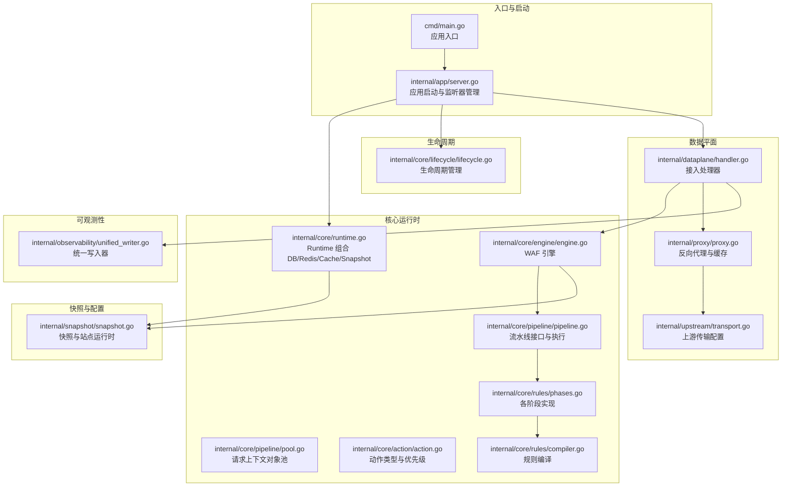
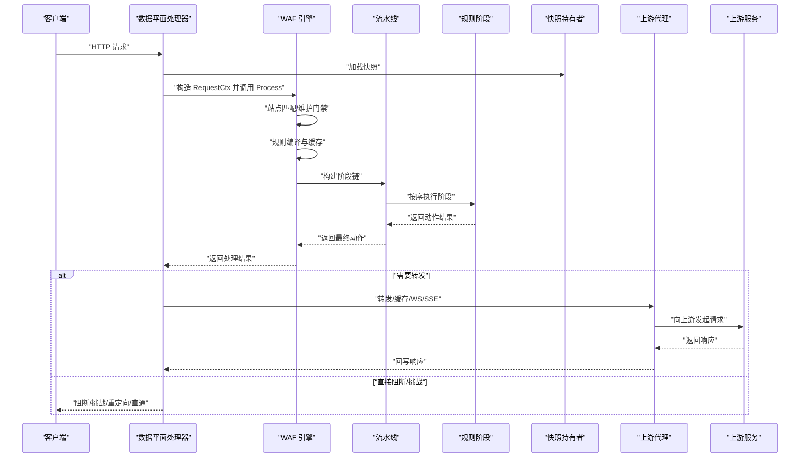
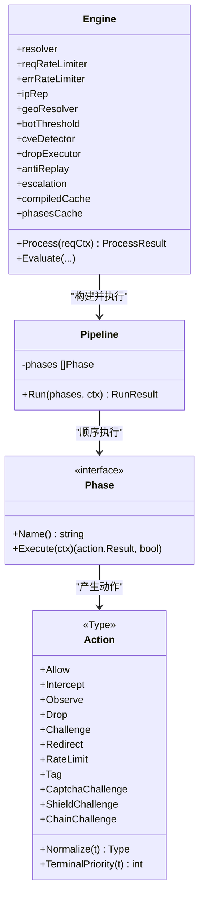
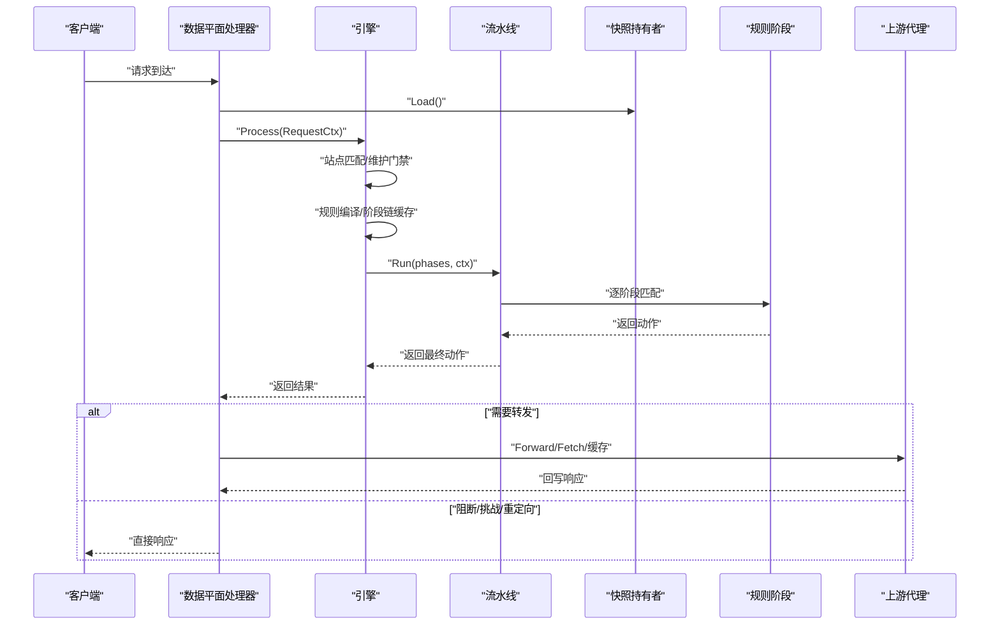
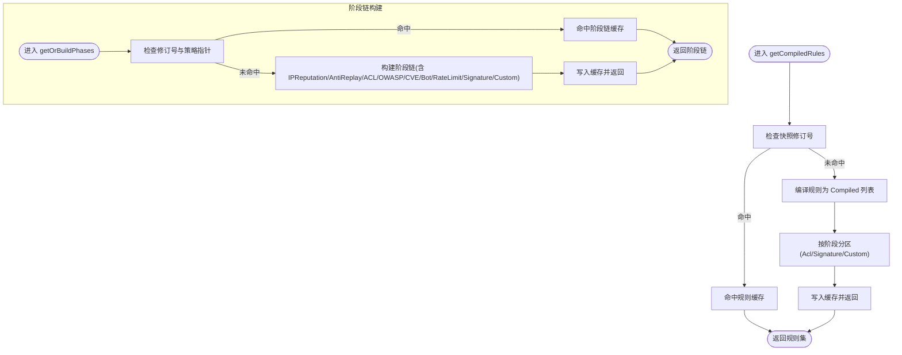
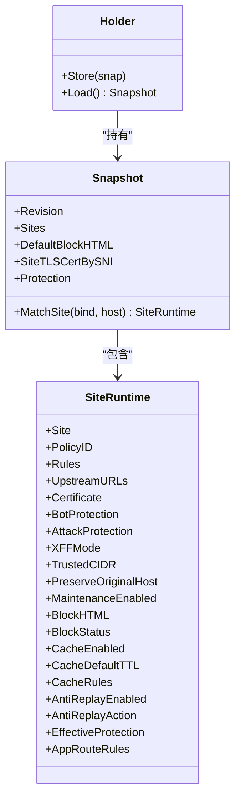
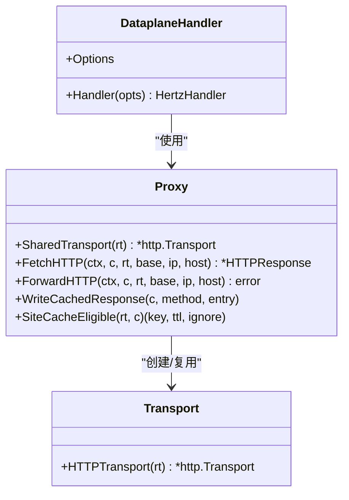
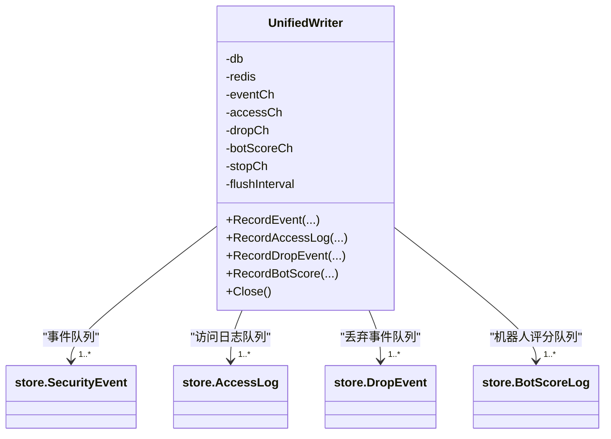
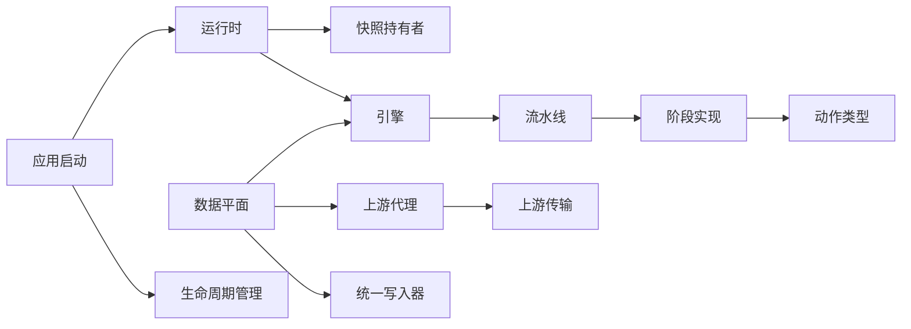

# 组件关系图

<cite>
**本文引用的文件**
- [cmd/main.go](file://cmd/main.go)
- [internal/app/server.go](file://internal/app/server.go)
- [internal/core/runtime.go](file://internal/core/runtime.go)
- [internal/core/engine/engine.go](file://internal/core/engine/engine.go)
- [internal/core/pipeline/pipeline.go](file://internal/core/pipeline/pipeline.go)
- [internal/core/pipeline/pool.go](file://internal/core/pipeline/pool.go)
- [internal/core/action/action.go](file://internal/core/action/action.go)
- [internal/core/rules/compiler.go](file://internal/core/rules/compiler.go)
- [internal/core/rules/phases.go](file://internal/core/rules/phases.go)
- [internal/snapshot/snapshot.go](file://internal/snapshot/snapshot.go)
- [internal/dataplane/handler.go](file://internal/dataplane/handler.go)
- [internal/upstream/transport.go](file://internal/upstream/transport.go)
- [internal/proxy/proxy.go](file://internal/proxy/proxy.go)
- [internal/observability/unified_writer.go](file://internal/observability/unified_writer.go)
- [internal/core/lifecycle/lifecycle.go](file://internal/core/lifecycle/lifecycle.go)
</cite>

## 目录
1. [引言](#引言)
2. [项目结构](#项目结构)
3. [核心组件](#核心组件)
4. [架构总览](#架构总览)
5. [详细组件分析](#详细组件分析)
6. [依赖分析](#依赖分析)
7. [性能考量](#性能考量)
8. [故障排查指南](#故障排查指南)
9. [结论](#结论)
10. [附录](#附录)

## 引言
本文件面向 My-OpenWaf 的架构与组件关系，聚焦于“运行时与快照的关系”、“引擎与流水线的依赖”、“数据平面与上游代理的协作”三大主题，系统化梳理核心组件的职责边界、数据传递与控制流方向，并通过类图与交互图展示组件间的协作机制，帮助开发者快速理解整体架构。

## 项目结构
My-OpenWaf 采用分层清晰的模块化组织：入口程序负责启动应用；核心层提供运行时、引擎、规则编译与执行流水线；数据平面负责请求接入、挑战与阻断、以及与上游的转发；可观测性层统一写入数据库与 Redis；生命周期管理器协调多监听器的启停与热更新。

**图表来源**
- [cmd/main.go:1-10](file://cmd/main.go#L1-L10)
- [internal/app/server.go:52-396](file://internal/app/server.go#L52-L396)
- [internal/core/runtime.go:17-127](file://internal/core/runtime.go#L17-L127)
- [internal/core/engine/engine.go:1-308](file://internal/core/engine/engine.go#L1-L308)
- [internal/core/pipeline/pipeline.go:1-124](file://internal/core/pipeline/pipeline.go#L1-L124)
- [internal/core/pipeline/pool.go:1-43](file://internal/core/pipeline/pool.go#L1-L43)
- [internal/core/action/action.go:1-176](file://internal/core/action/action.go#L1-L176)
- [internal/core/rules/compiler.go:1-91](file://internal/core/rules/compiler.go#L1-L91)
- [internal/core/rules/phases.go:1-800](file://internal/core/rules/phases.go#L1-L800)
- [internal/snapshot/snapshot.go:1-152](file://internal/snapshot/snapshot.go#L1-L152)
- [internal/dataplane/handler.go:1-1177](file://internal/dataplane/handler.go#L1-L1177)
- [internal/upstream/transport.go:1-29](file://internal/upstream/transport.go#L1-L29)
- [internal/proxy/proxy.go:1-522](file://internal/proxy/proxy.go#L1-L522)
- [internal/observability/unified_writer.go:1-232](file://internal/observability/unified_writer.go#L1-L232)
- [internal/core/lifecycle/lifecycle.go:1-178](file://internal/core/lifecycle/lifecycle.go#L1-L178)

**章节来源**
- [cmd/main.go:1-10](file://cmd/main.go#L1-L10)
- [internal/app/server.go:52-396](file://internal/app/server.go#L52-L396)

## 核心组件
- 应用入口与启动
  - 入口函数仅调用应用层 Run，完成初始化、监听器构建与启动。
- 运行时 Runtime
  - 组合数据库、可选 Redis、缓存层与快照持有者，提供统一的资源入口。
- 引擎 Engine
  - 负责站点解析、规则编译与缓存、流水线构建与执行、动作决策与可观测性记录。
- 流水线 Pipeline
  - 定义阶段接口与顺序执行逻辑，支持短路与挑战延迟策略。
- 规则编译与阶段
  - 将持久化规则编译为可执行的 Compiled 规则，并提供 ACL、签名、自定义、OWASP/CVE、机器人、速率限制、IP信誉等阶段实现。
- 快照 Snapshot
  - 不可变视图，原子指针切换，承载站点映射、全局保护配置与 TLS 证书。
- 数据平面 Dataplane
  - 接入处理器，负责维护门禁、WAF 决策、挑战/阻断、与上游代理转发及缓存。
- 上游代理与传输
  - 提供共享传输与客户端缓存，屏蔽上游 TLS/HTTP2 细节。
- 统一写入器
  - 将安全事件、访问日志、丢弃事件、机器人评分异步聚合写入数据库与 Redis。
- 生命周期管理
  - 协调多个 Hertz 监听器的注册、启动、重启与优雅关闭。

**章节来源**
- [internal/core/runtime.go:17-127](file://internal/core/runtime.go#L17-L127)
- [internal/core/engine/engine.go:1-308](file://internal/core/engine/engine.go#L1-L308)
- [internal/core/pipeline/pipeline.go:1-124](file://internal/core/pipeline/pipeline.go#L1-L124)
- [internal/core/rules/compiler.go:1-91](file://internal/core/rules/compiler.go#L1-L91)
- [internal/core/rules/phases.go:1-800](file://internal/core/rules/phases.go#L1-L800)
- [internal/snapshot/snapshot.go:1-152](file://internal/snapshot/snapshot.go#L1-L152)
- [internal/dataplane/handler.go:1-1177](file://internal/dataplane/handler.go#L1-L1177)
- [internal/upstream/transport.go:1-29](file://internal/upstream/transport.go#L1-L29)
- [internal/proxy/proxy.go:1-522](file://internal/proxy/proxy.go#L1-L522)
- [internal/observability/unified_writer.go:1-232](file://internal/observability/unified_writer.go#L1-L232)
- [internal/core/lifecycle/lifecycle.go:1-178](file://internal/core/lifecycle/lifecycle.go#L1-L178)

## 架构总览
下图展示运行时与快照、引擎与流水线、数据平面与上游代理的关键交互路径与数据流向。

**图表来源**
- [internal/dataplane/handler.go:69-800](file://internal/dataplane/handler.go#L69-L800)
- [internal/core/engine/engine.go:200-245](file://internal/core/engine/engine.go#L200-L245)
- [internal/core/pipeline/pipeline.go:78-118](file://internal/core/pipeline/pipeline.go#L78-L118)
- [internal/proxy/proxy.go:172-500](file://internal/proxy/proxy.go#L172-L500)
- [internal/snapshot/snapshot.go:94-118](file://internal/snapshot/snapshot.go#L94-L118)

## 详细组件分析

### 类图：引擎、流水线与动作
该类图刻画引擎、流水线、阶段与动作的核心关系，体现解耦与可扩展性。

**图表来源**
- [internal/core/engine/engine.go:37-60](file://internal/core/engine/engine.go#L37-L60)
- [internal/core/engine/engine.go:200-245](file://internal/core/engine/engine.go#L200-L245)
- [internal/core/pipeline/pipeline.go:50-65](file://internal/core/pipeline/pipeline.go#L50-L65)
- [internal/core/pipeline/pipeline.go:50-54](file://internal/core/pipeline/pipeline.go#L50-L54)
- [internal/core/action/action.go:5-26](file://internal/core/action/action.go#L5-L26)
- [internal/core/action/action.go:74-77](file://internal/core/action/action.go#L74-L77)

**章节来源**
- [internal/core/engine/engine.go:1-308](file://internal/core/engine/engine.go#L1-L308)
- [internal/core/pipeline/pipeline.go:1-124](file://internal/core/pipeline/pipeline.go#L1-L124)
- [internal/core/action/action.go:1-176](file://internal/core/action/action.go#L1-L176)

### 交互图：请求在数据平面与引擎中的流转
该图展示从接入到决策再到上游转发或阻断的完整流程。

**图表来源**
- [internal/dataplane/handler.go:98-420](file://internal/dataplane/handler.go#L98-L420)
- [internal/core/engine/engine.go:200-245](file://internal/core/engine/engine.go#L200-L245)
- [internal/core/pipeline/pipeline.go:78-118](file://internal/core/pipeline/pipeline.go#L78-L118)
- [internal/proxy/proxy.go:172-500](file://internal/proxy/proxy.go#L172-L500)

**章节来源**
- [internal/dataplane/handler.go:1-1177](file://internal/dataplane/handler.go#L1-L1177)
- [internal/core/engine/engine.go:1-308](file://internal/core/engine/engine.go#L1-L308)
- [internal/core/pipeline/pipeline.go:1-124](file://internal/core/pipeline/pipeline.go#L1-L124)
- [internal/proxy/proxy.go:1-522](file://internal/proxy/proxy.go#L1-L522)

### 交互图：规则编译与阶段执行
该图为规则编译、阶段构建与执行的内部流程，突出缓存与预编译优化。

**图表来源**
- [internal/core/engine/engine.go:98-198](file://internal/core/engine/engine.go#L98-L198)
- [internal/core/rules/compiler.go:29-59](file://internal/core/rules/compiler.go#L29-L59)

**章节来源**
- [internal/core/engine/engine.go:98-198](file://internal/core/engine/engine.go#L98-L198)
- [internal/core/rules/compiler.go:1-91](file://internal/core/rules/compiler.go#L1-L91)

### 类图：快照与站点运行时
快照是不可变视图，通过原子指针切换实现零停机热更新；站点运行时封装每站点的规则、上游、TLS、保护策略等。

**图表来源**
- [internal/snapshot/snapshot.go:72-84](file://internal/snapshot/snapshot.go#L72-L84)
- [internal/snapshot/snapshot.go:25-70](file://internal/snapshot/snapshot.go#L25-L70)
- [internal/snapshot/snapshot.go:145-152](file://internal/snapshot/snapshot.go#L145-L152)

**章节来源**
- [internal/snapshot/snapshot.go:1-152](file://internal/snapshot/snapshot.go#L1-L152)

### 类图：数据平面与上游代理
数据平面负责接入、挑战、阻断与转发；上游代理负责连接池、TLS 配置与请求转发。

**图表来源**
- [internal/dataplane/handler.go:35-48](file://internal/dataplane/handler.go#L35-L48)
- [internal/proxy/proxy.go:35-83](file://internal/proxy/proxy.go#L35-L83)
- [internal/proxy/proxy.go:172-500](file://internal/proxy/proxy.go#L172-L500)
- [internal/upstream/transport.go:12-28](file://internal/upstream/transport.go#L12-L28)

**章节来源**
- [internal/dataplane/handler.go:1-1177](file://internal/dataplane/handler.go#L1-L1177)
- [internal/proxy/proxy.go:1-522](file://internal/proxy/proxy.go#L1-L522)
- [internal/upstream/transport.go:1-29](file://internal/upstream/transport.go#L1-L29)

### 类图：统一写入器与可观测性
统一写入器以通道缓冲与定时批量事务写入，降低数据库锁竞争，同时支持 Redis 实时推送。

**图表来源**
- [internal/observability/unified_writer.go:16-52](file://internal/observability/unified_writer.go#L16-L52)
- [internal/observability/unified_writer.go:113-155](file://internal/observability/unified_writer.go#L113-L155)

**章节来源**
- [internal/observability/unified_writer.go:1-232](file://internal/observability/unified_writer.go#L1-L232)

## 依赖分析
- 组件内聚与耦合
  - 引擎与流水线通过接口解耦，阶段实现独立，便于扩展新阶段。
  - 数据平面与引擎通过 Options 注入依赖，保持接入层与核心处理的分离。
  - 上游代理与传输抽象，避免在数据平面直接处理网络细节。
- 直接与间接依赖
  - 引擎依赖快照持有者、规则编译器、动作类型、速率限制、IP信誉、CVE检测、机器人评分、丢弃执行器、抗重放与升级管理器。
  - 数据平面依赖引擎、统一写入器、响应缓存、挑战管理器、记录资源仓库。
  - 运行时依赖数据库、Redis、缓存层与快照构建。
- 循环依赖
  - 代码层面未见循环导入；阶段实现通过接口与工厂方法注入，避免强耦合。
- 外部依赖与集成点
  - Hertz 作为 Web 框架；Redis 用于分布式状态与实时推送；SQLite/GORM 用于持久化；TLS 配置与 SNI 证书管理。

**图表来源**
- [internal/app/server.go:52-396](file://internal/app/server.go#L52-L396)
- [internal/core/runtime.go:17-127](file://internal/core/runtime.go#L17-L127)
- [internal/core/engine/engine.go:1-308](file://internal/core/engine/engine.go#L1-L308)
- [internal/core/pipeline/pipeline.go:1-124](file://internal/core/pipeline/pipeline.go#L1-L124)
- [internal/core/rules/phases.go:1-800](file://internal/core/rules/phases.go#L1-L800)
- [internal/core/action/action.go:1-176](file://internal/core/action/action.go#L1-L176)
- [internal/dataplane/handler.go:1-1177](file://internal/dataplane/handler.go#L1-L1177)
- [internal/proxy/proxy.go:1-522](file://internal/proxy/proxy.go#L1-L522)
- [internal/upstream/transport.go:1-29](file://internal/upstream/transport.go#L1-L29)
- [internal/observability/unified_writer.go:1-232](file://internal/observability/unified_writer.go#L1-L232)
- [internal/core/lifecycle/lifecycle.go:1-178](file://internal/core/lifecycle/lifecycle.go#L1-L178)

**章节来源**
- [internal/app/server.go:52-396](file://internal/app/server.go#L52-L396)
- [internal/core/runtime.go:17-127](file://internal/core/runtime.go#L17-L127)
- [internal/core/engine/engine.go:1-308](file://internal/core/engine/engine.go#L1-L308)
- [internal/core/pipeline/pipeline.go:1-124](file://internal/core/pipeline/pipeline.go#L1-L124)
- [internal/core/rules/phases.go:1-800](file://internal/core/rules/phases.go#L1-L800)
- [internal/core/action/action.go:1-176](file://internal/core/action/action.go#L1-L176)
- [internal/dataplane/handler.go:1-1177](file://internal/dataplane/handler.go#L1-L1177)
- [internal/proxy/proxy.go:1-522](file://internal/proxy/proxy.go#L1-L522)
- [internal/upstream/transport.go:1-29](file://internal/upstream/transport.go#L1-L29)
- [internal/observability/unified_writer.go:1-232](file://internal/observability/unified_writer.go#L1-L232)
- [internal/core/lifecycle/lifecycle.go:1-178](file://internal/core/lifecycle/lifecycle.go#L1-L178)

## 性能考量
- 对象池与缓存
  - 请求上下文通过 sync.Pool 复用，减少 GC 压力。
  - 引擎对规则编译结果与阶段链进行基于快照修订号的缓存，避免重复计算。
- 并发与批处理
  - 统一写入器以固定周期批量提交，降低数据库锁竞争。
- 连接与传输
  - 上游传输与客户端实例按 TLS 配置键缓存复用，提升连接复用率与吞吐。
- 速率限制与缓存
  - 本地/Redis 速率限制器按策略动态配置；边缘响应缓存按站点规则与头部条件启用。

[本节为通用性能讨论，不直接分析具体文件]

## 故障排查指南
- 快照未生效或热更新失败
  - 检查运行时 ReloadSnapshot 是否成功，确认缓存命中与快照指针切换。
- 请求被错误阻断或挑战
  - 查看数据平面日志与统一写入器记录的安全事件，核对动作类型与阶段来源。
- 上游转发异常
  - 检查上游传输配置（SNI、跳过校验、最小 TLS 版本）与连接池状态。
- 监听器无法启动或漂移重启
  - 关注生命周期管理器的标签指纹与重建逻辑，确认绑定与 TLS 配置变更。

**章节来源**
- [internal/core/runtime.go:82-99](file://internal/core/runtime.go#L82-L99)
- [internal/observability/unified_writer.go:97-155](file://internal/observability/unified_writer.go#L97-L155)
- [internal/upstream/transport.go:12-28](file://internal/upstream/transport.go#L12-L28)
- [internal/core/lifecycle/lifecycle.go:30-178](file://internal/core/lifecycle/lifecycle.go#L30-L178)

## 结论
My-OpenWaf 通过“快照驱动的不可变视图 + 引擎+流水线的规则执行 + 数据平面的接入与转发”的架构，实现了高可用、可扩展且可观测的 WAF 系统。引擎与流水线的解耦设计、规则编译与阶段链的缓存机制、以及统一写入器的批处理策略，共同保障了在高并发场景下的稳定与性能。数据平面与上游代理的清晰边界，使得接入与转发逻辑易于演进与维护。

## 附录
- 关键接口与职责
  - Engine.Process：统一调度站点解析、规则编译、阶段链构建与执行。
  - Pipeline.Run：顺序执行阶段，支持挑战延迟与短路。
  - Dataplane.Handler：接入层决策与转发。
  - Proxy.SharedTransport/FetchHTTP/ForwardHTTP：上游连接与转发。
  - UnifiedWriter：可观测性数据的异步聚合写入。

[本节为概要总结，不直接分析具体文件]