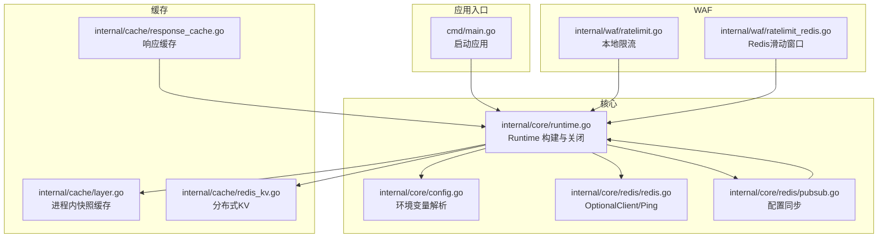
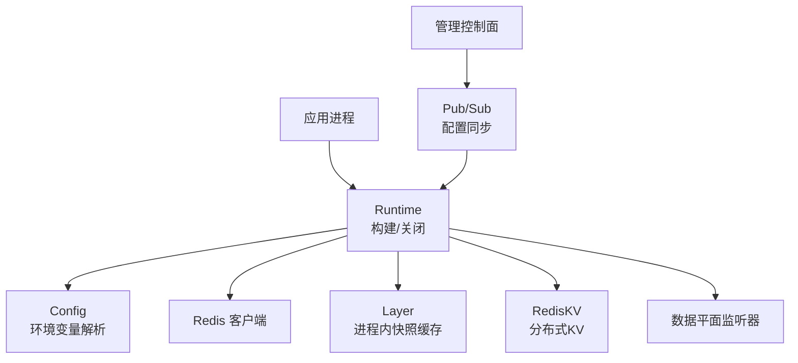
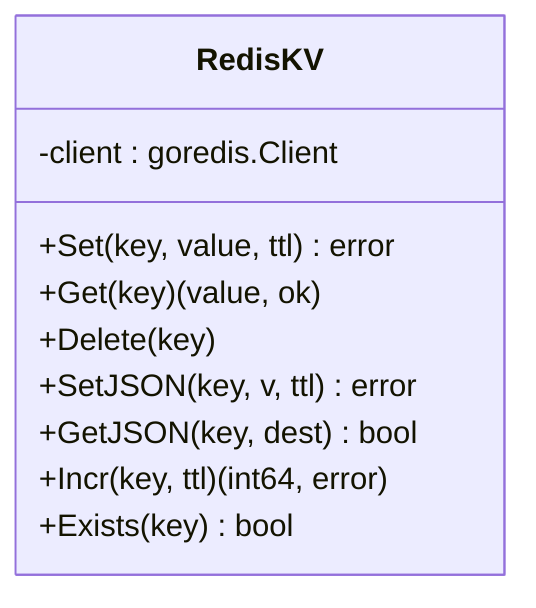
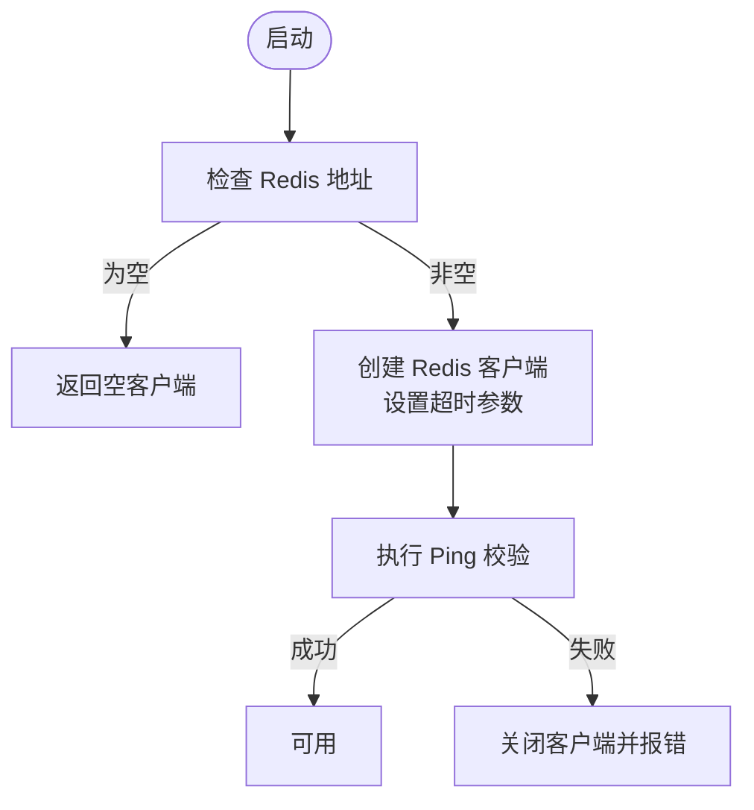
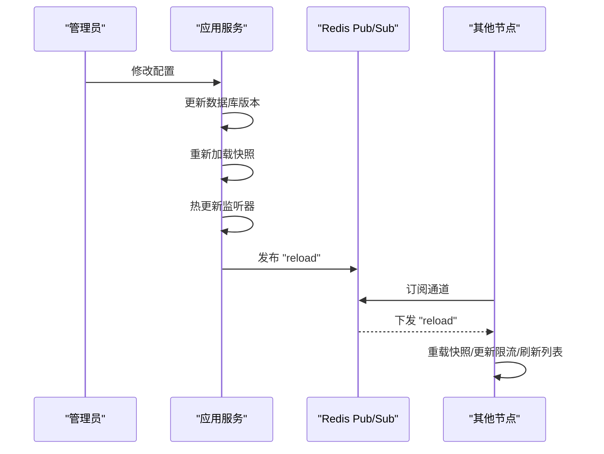
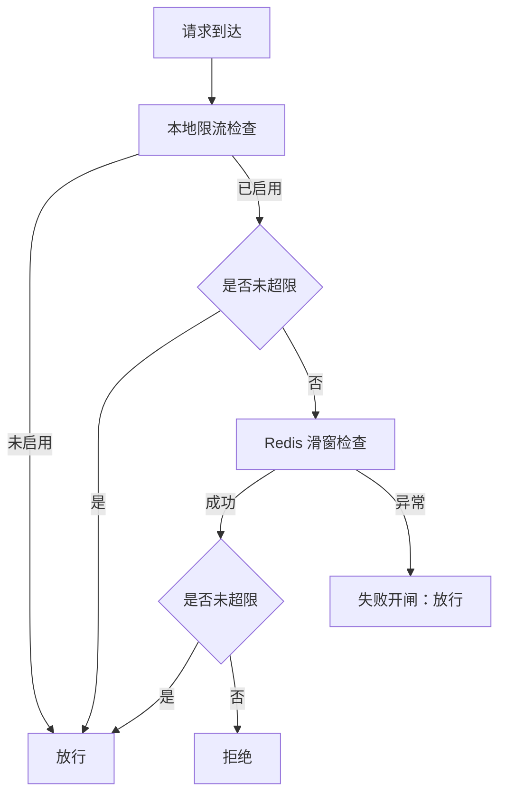
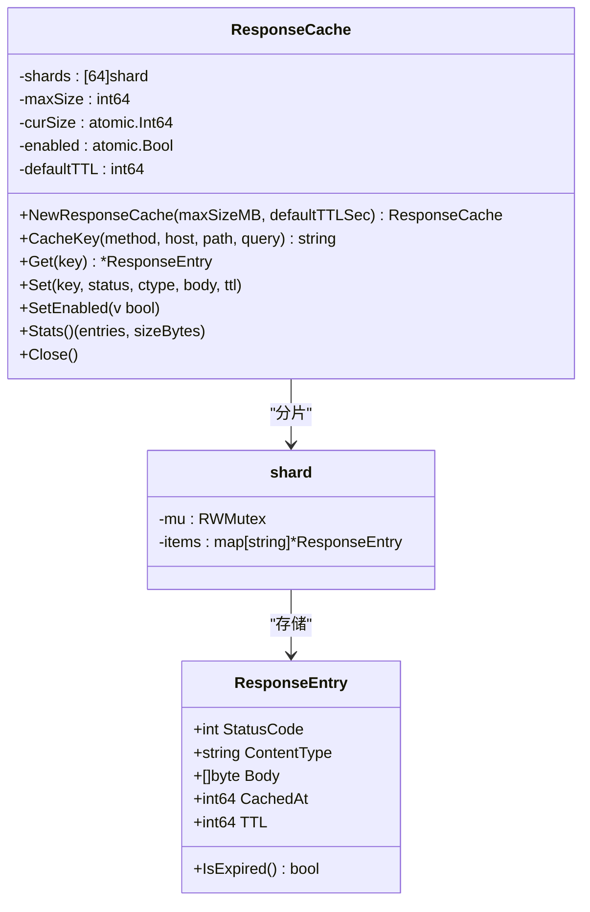
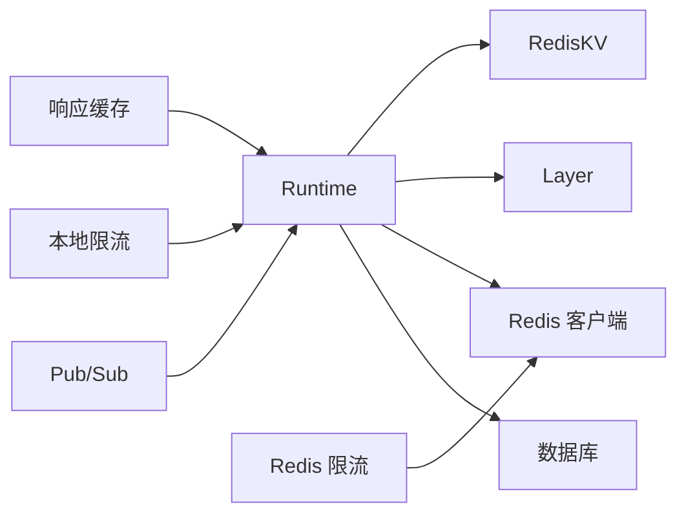

# Redis 集成与分布式缓存

<cite>
**本文档引用的文件**
- [main.go](file://cmd/main.go)
- [server.go](file://internal/app/server.go)
- [runtime.go](file://internal/core/runtime.go)
- [config.go](file://internal/core/config.go)
- [redis.go](file://internal/core/redis/redis.go)
- [pubsub.go](file://internal/core/redis/pubsub.go)
- [redis_kv.go](file://internal/cache/redis_kv.go)
- [layer.go](file://internal/cache/layer.go)
- [response_cache.go](file://internal/cache/response_cache.go)
- [ratelimit.go](file://internal/waf/ratelimit.go)
- [ratelimit_redis.go](file://internal/waf/ratelimit_redis.go)
</cite>

## 目录
1. [简介](#简介)
2. [项目结构](#项目结构)
3. [核心组件](#核心组件)
4. [架构总览](#架构总览)
5. [详细组件分析](#详细组件分析)
6. [依赖关系分析](#依赖关系分析)
7. [性能考虑](#性能考虑)
8. [故障排查指南](#故障排查指南)
9. [结论](#结论)

## 简介
本文件系统性阐述 My-OpenWaf 中的 Redis 集成与分布式缓存实现，重点覆盖：
- RedisKV 分布式键值存储：跨节点状态共享、数据序列化机制
- 连接池与客户端配置：连接数管理、超时设置、错误处理
- 分布式缓存一致性：缓存失效传播、更新同步、冲突处理
- WAF 场景应用：速率限制计数器、API 响应缓存、会话存储
- 配置优化与性能监控建议

## 项目结构
围绕 Redis 的关键模块分布如下：
- 核心运行时与配置：负责加载环境变量、构建 Redis 客户端、初始化缓存层
- Redis 工具：可选客户端创建、Ping 检测、发布订阅（配置热更新）
- 缓存层：进程内快照缓存（Ristretto）与分布式 KV（RedisKV）
- WAF 速率限制：本地固定窗口与 Redis 滑动窗口两种实现
- 前端控制面：通过 Redis Pub/Sub 实现多节点配置同步

**图表来源**
- [main.go:1-10](file://cmd/main.go#L1-L10)
- [runtime.go:27-80](file://internal/core/runtime.go#L27-L80)
- [config.go:92-150](file://internal/core/config.go#L92-L150)
- [redis.go:17-38](file://internal/core/redis/redis.go#L17-L38)
- [pubsub.go:21-77](file://internal/core/redis/pubsub.go#L21-L77)
- [layer.go:27-64](file://internal/cache/layer.go#L27-L64)
- [redis_kv.go:23-112](file://internal/cache/redis_kv.go#L23-L112)
- [response_cache.go:41-163](file://internal/cache/response_cache.go#L41-L163)
- [ratelimit.go:24-117](file://internal/waf/ratelimit.go#L24-L117)
- [ratelimit_redis.go:24-89](file://internal/waf/ratelimit_redis.go#L24-L89)

**章节来源**
- [main.go:1-10](file://cmd/main.go#L1-L10)
- [runtime.go:27-80](file://internal/core/runtime.go#L27-L80)
- [config.go:92-150](file://internal/core/config.go#L92-L150)
- [redis.go:17-38](file://internal/core/redis/redis.go#L17-L38)
- [pubsub.go:21-77](file://internal/core/redis/pubsub.go#L21-L77)
- [layer.go:27-64](file://internal/cache/layer.go#L27-L64)
- [redis_kv.go:23-112](file://internal/cache/redis_kv.go#L23-L112)
- [response_cache.go:41-163](file://internal/cache/response_cache.go#L41-L163)
- [ratelimit.go:24-117](file://internal/waf/ratelimit.go#L24-L117)
- [ratelimit_redis.go:24-89](file://internal/waf/ratelimit_redis.go#L24-L89)

## 核心组件
- Redis 客户端与配置
  - 可选客户端创建：根据环境变量决定是否启用 Redis
  - 超时配置：拨号、读、写超时均在客户端层面设定
  - 连接检测：启动时执行 Ping 校验
- RedisKV 分布式键值存储
  - 键前缀隔离命名空间
  - 字节与 JSON 两套接口，支持 TTL
  - 原子自增与存在性检查
- 进程内快照缓存（Layer）
  - Ristretto 实现，仅缓存不可变快照对象
  - 与 RedisKV 解耦，避免将快照序列化到 Redis
- 响应缓存（ResponseCache）
  - 内存 LRU-like 结构，分片互斥降低竞争
  - 基于 SHA-256 的确定性键生成
  - 后台清理过期条目
- 配置同步（Pub/Sub）
  - 发布“配置变更”事件，订阅端触发本地快照重载
- 速率限制
  - 本地固定窗口：内存窗口表，后台清理过期窗口
  - Redis 滑动窗口：Lua 脚本原子计数，失败开闸降级

**章节来源**
- [redis.go:17-38](file://internal/core/redis/redis.go#L17-L38)
- [redis_kv.go:13-112](file://internal/cache/redis_kv.go#L13-L112)
- [layer.go:19-64](file://internal/cache/layer.go#L19-L64)
- [response_cache.go:25-163](file://internal/cache/response_cache.go#L25-L163)
- [pubsub.go:13-77](file://internal/core/redis/pubsub.go#L13-L77)
- [ratelimit.go:9-117](file://internal/waf/ratelimit.go#L9-L117)
- [ratelimit_redis.go:12-89](file://internal/waf/ratelimit_redis.go#L12-L89)

## 架构总览
下图展示 Redis 在系统中的角色与交互路径：运行时初始化 Redis 客户端，构建进程内缓存与分布式 KV；前端控制面通过 Pub/Sub 触发多节点配置同步；WAF 侧分别使用本地与 Redis 限流。

**图表来源**
- [runtime.go:27-80](file://internal/core/runtime.go#L27-L80)
- [config.go:92-150](file://internal/core/config.go#L92-L150)
- [redis.go:17-38](file://internal/core/redis/redis.go#L17-L38)
- [layer.go:27-64](file://internal/cache/layer.go#L27-L64)
- [redis_kv.go:23-112](file://internal/cache/redis_kv.go#L23-L112)
- [pubsub.go:21-77](file://internal/core/redis/pubsub.go#L21-L77)
- [server.go:122-255](file://internal/app/server.go#L122-L255)

**章节来源**
- [runtime.go:27-80](file://internal/core/runtime.go#L27-L80)
- [server.go:122-255](file://internal/app/server.go#L122-L255)

## 详细组件分析

### RedisKV 组件分析
RedisKV 提供跨节点共享的状态存储能力，用于：
- 速率限制元数据（Redis 滑动窗口）
- API 响应缓存（待扩展）
- IP 黑名单同步等

**图表来源**
- [redis_kv.go:13-112](file://internal/cache/redis_kv.go#L13-L112)

实现要点：
- 键名统一加前缀以隔离命名空间
- 所有 Redis 操作均带上下文超时，防止阻塞
- JSON 接口基于标准库序列化，便于跨语言互通
- 原子自增结合 Expire，确保计数器生命周期可控

**章节来源**
- [redis_kv.go:13-112](file://internal/cache/redis_kv.go#L13-L112)

### Redis 客户端与连接池配置
- 可选客户端：当地址为空时返回空指针，避免无意义连接
- 超时设置：拨号、读、写超时均为常量配置
- Ping 校验：启动阶段验证连通性，失败则关闭并报错
- 连接池：由 go-redis 底层维护，默认池大小与复用策略

**图表来源**
- [redis.go:17-38](file://internal/core/redis/redis.go#L17-L38)

**章节来源**
- [redis.go:17-38](file://internal/core/redis/redis.go#L17-L38)
- [runtime.go:49-70](file://internal/core/runtime.go#L49-L70)

### 配置同步（Redis Pub/Sub）
- 发布者：管理员操作后触发发布“reload”消息
- 订阅者：各节点监听通道，收到后重载快照并热更新监听器
- 失败处理：发布失败记录告警日志，不影响主流程

**图表来源**
- [pubsub.go:33-68](file://internal/core/redis/pubsub.go#L33-L68)
- [server.go:215-255](file://internal/app/server.go#L215-L255)

**章节来源**
- [pubsub.go:33-68](file://internal/core/redis/pubsub.go#L33-L68)
- [server.go:215-255](file://internal/app/server.go#L215-L255)

### 速率限制组件对比
- 本地限流（固定窗口）
  - 优点：低延迟、零外部依赖
  - 缺点：单机状态，无法跨节点共享
- Redis 限流（滑动窗口）
  - 优点：跨节点一致、更精确
  - 缺点：网络往返、Lua 脚本执行开销
  - 失败开闸：Redis 异常时允许请求通过，保障可用性

**图表来源**
- [ratelimit.go:48-92](file://internal/waf/ratelimit.go#L48-L92)
- [ratelimit_redis.go:67-85](file://internal/waf/ratelimit_redis.go#L67-L85)

**章节来源**
- [ratelimit.go:48-92](file://internal/waf/ratelimit.go#L48-L92)
- [ratelimit_redis.go:67-85](file://internal/waf/ratelimit_redis.go#L67-L85)

### 响应缓存（ResponseCache）
- 设计目标：对安全请求（如 GET）进行内存缓存，减少上游压力
- 关键特性：
  - 分片互斥锁降低热点竞争
  - SHA-256 确定性键，方法+主机+路径+查询参与计算
  - 默认 TTL 与逐条上限控制内存占用
  - 后台定时清理过期条目

**图表来源**
- [response_cache.go:25-163](file://internal/cache/response_cache.go#L25-L163)

**章节来源**
- [response_cache.go:25-163](file://internal/cache/response_cache.go#L25-L163)

## 依赖关系分析
- 运行时依赖
  - Runtime 负责组装 DB、Redis、缓存层与快照持有者
  - 启动时校验 Redis 连通性，失败直接退出
- 组件耦合
  - RedisKV 与 Redis 客户端强耦合，但对外暴露简洁接口
  - Layer 与 RedisKV 解耦，避免将快照对象序列化到 Redis
  - Pub/Sub 作为跨节点同步的桥接，不侵入业务逻辑
- WAF 与缓存
  - 本地限流与 Redis 限流并存，按需切换
  - 响应缓存为纯内存实现，不依赖 Redis

**图表来源**
- [runtime.go:27-80](file://internal/core/runtime.go#L27-L80)
- [redis_kv.go:23-112](file://internal/cache/redis_kv.go#L23-L112)
- [layer.go:27-64](file://internal/cache/layer.go#L27-L64)
- [pubsub.go:21-77](file://internal/core/redis/pubsub.go#L21-L77)
- [ratelimit.go:24-117](file://internal/waf/ratelimit.go#L24-L117)
- [ratelimit_redis.go:24-89](file://internal/waf/ratelimit_redis.go#L24-L89)

**章节来源**
- [runtime.go:27-80](file://internal/core/runtime.go#L27-L80)
- [redis_kv.go:23-112](file://internal/cache/redis_kv.go#L23-L112)
- [layer.go:27-64](file://internal/cache/layer.go#L27-L64)
- [pubsub.go:21-77](file://internal/core/redis/pubsub.go#L21-L77)
- [ratelimit.go:24-117](file://internal/waf/ratelimit.go#L24-L117)
- [ratelimit_redis.go:24-89](file://internal/waf/ratelimit_redis.go#L24-L89)

## 性能考虑
- 连接与超时
  - 客户端超时参数已内置，建议结合 Redis 部署延迟调优
  - 若网络抖动较大，可适当放宽读/写超时
- 命令批量化
  - RedisKV 自增使用管道合并命令，减少 RTT
- 缓存命中率
  - 响应缓存采用分片互斥与后台清理，建议合理设置默认 TTL 与最大容量
  - 对大体积响应谨慎缓存，避免内存压力
- 限流精度与成本
  - Redis 滑窗脚本原子性强，但每次请求一次 Lua 执行与 ZSET 操作
  - 本地限流适合低延迟场景；跨节点一致性需求高时优先 Redis 限流
- 配置同步
  - Pub/Sub 仅传递“reload”信号，实际负载为快照重载与监听器热更新

[本节为通用性能建议，无需特定文件引用]

## 故障排查指南
- Redis 不可用
  - 现象：启动阶段 Ping 失败或运行中连接中断
  - 处理：检查地址、密码、DB 号；确认网络连通；查看日志
  - 参考
    - [redis.go:33-38](file://internal/core/redis/redis.go#L33-L38)
    - [runtime.go:54-59](file://internal/core/runtime.go#L54-L59)
- 限流异常
  - Redis 限流失败开闸：若 Redis 脚本执行失败，请求被允许，需关注 Redis 健康
  - 本地限流：检查窗口清理协程是否正常运行
  - 参考
    - [ratelimit_redis.go:80-85](file://internal/waf/ratelimit_redis.go#L80-L85)
    - [ratelimit.go:98-116](file://internal/waf/ratelimit.go#L98-L116)
- 配置不同步
  - 现象：修改配置后其他节点未生效
  - 处理：确认 Pub/Sub 通道名称与订阅是否正确；检查发布/订阅日志
  - 参考
    - [pubsub.go:33-68](file://internal/core/redis/pubsub.go#L33-L68)
    - [server.go:239-255](file://internal/app/server.go#L239-L255)
- 响应缓存问题
  - 现象：命中率低或内存占用异常
  - 处理：调整默认 TTL、最大容量；检查键生成是否包含必要参数
  - 参考
    - [response_cache.go:56-76](file://internal/cache/response_cache.go#L56-L76)
    - [response_cache.go:142-162](file://internal/cache/response_cache.go#L142-L162)

**章节来源**
- [redis.go:33-38](file://internal/core/redis/redis.go#L33-L38)
- [runtime.go:54-59](file://internal/core/runtime.go#L54-L59)
- [ratelimit_redis.go:80-85](file://internal/waf/ratelimit_redis.go#L80-L85)
- [ratelimit.go:98-116](file://internal/waf/ratelimit.go#L98-L116)
- [pubsub.go:33-68](file://internal/core/redis/pubsub.go#L33-L68)
- [server.go:239-255](file://internal/app/server.go#L239-L255)
- [response_cache.go:56-76](file://internal/cache/response_cache.go#L56-L76)
- [response_cache.go:142-162](file://internal/cache/response_cache.go#L142-L162)

## 结论
本项目通过清晰的模块划分实现了 Redis 的稳健集成：
- 运行时与配置解耦，支持可选启用
- RedisKV 提供跨节点共享状态的统一抽象
- Layer 与 RedisKV 分离，避免快照对象冗余序列化
- Pub/Sub 实现了多节点配置的近实时同步
- 限流策略兼顾本地与 Redis 两种模式，满足不同一致性与延迟要求
- 响应缓存以内存为主，提升静态资源访问效率

建议在生产环境中结合监控指标持续优化超时与容量参数，并针对 Redis 部署质量（网络、持久化、慢查询）进行专项治理。