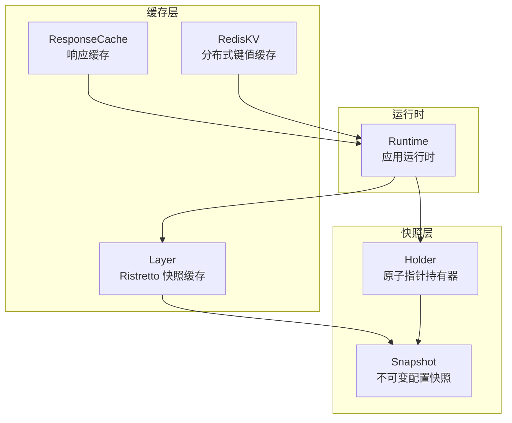
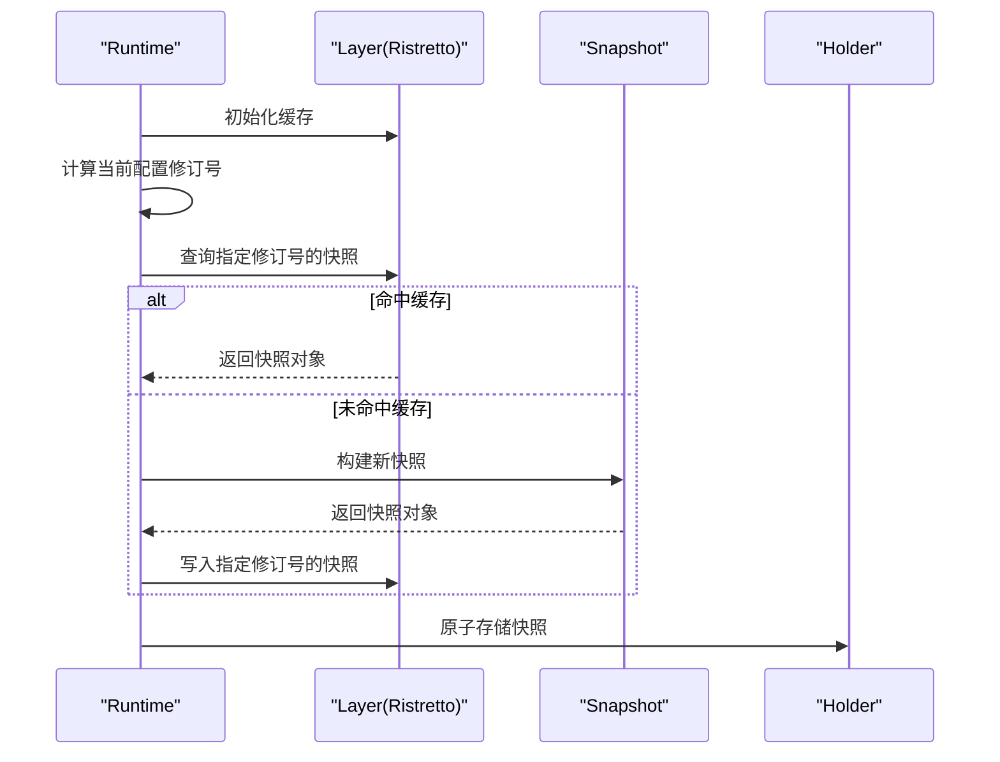
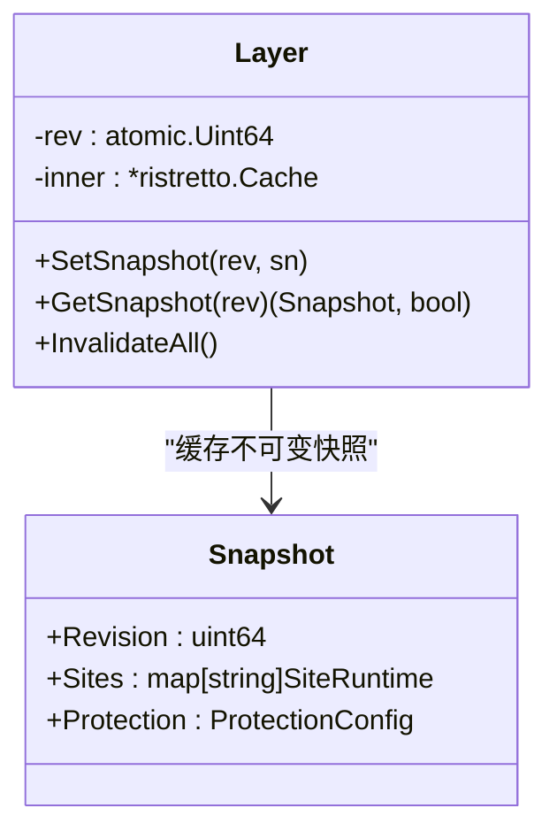
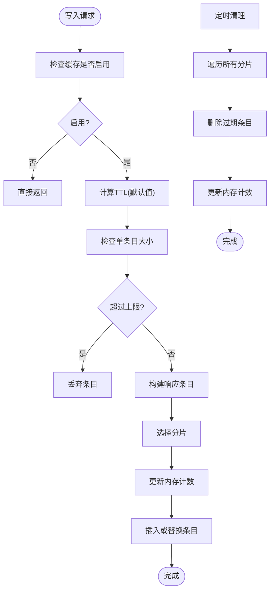
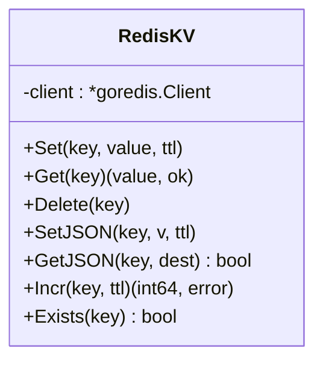
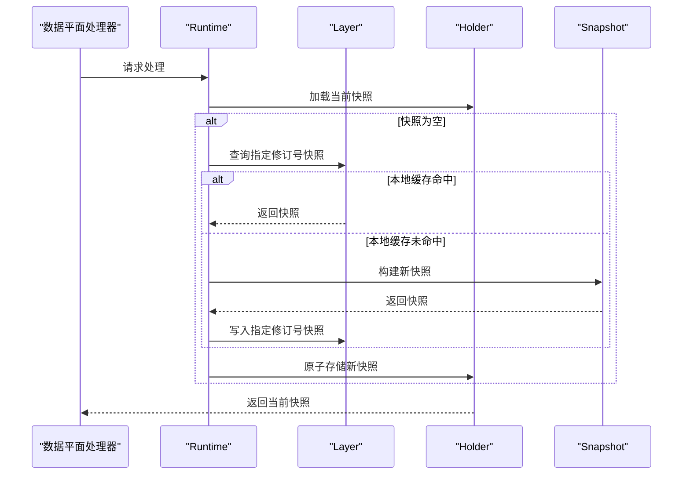
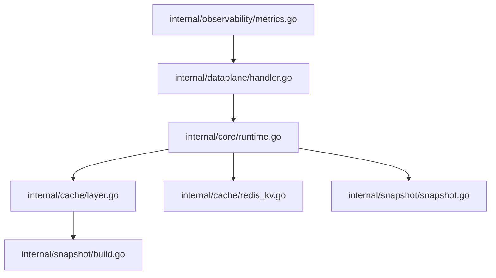

# Ristretto 缓存实现

<cite>
**本文档引用的文件**
- [layer.go](file://internal/cache/layer.go)
- [response_cache.go](file://internal/cache/response_cache.go)
- [response_cache_test.go](file://internal/cache/response_cache_test.go)
- [redis_kv.go](file://internal/cache/redis_kv.go)
- [snapshot.go](file://internal/snapshot/snapshot.go)
- [build.go](file://internal/snapshot/build.go)
- [runtime.go](file://internal/core/runtime.go)
- [handler.go](file://internal/dataplane/handler.go)
- [metrics.go](file://internal/observability/metrics.go)
</cite>

## 目录
1. [简介](#简介)
2. [项目结构](#项目结构)
3. [核心组件](#核心组件)
4. [架构概览](#架构概览)
5. [详细组件分析](#详细组件分析)
6. [依赖关系分析](#依赖关系分析)
7. [性能考虑](#性能考虑)
8. [故障排除指南](#故障排除指南)
9. [结论](#结论)
10. [附录](#附录)

## 简介

本文件详细分析 My-OpenWaf 项目中的 Ristretto 缓存实现，重点涵盖以下方面：

- 本地进程缓存的设计原理：基于原子指针管理、内存成本控制与缓存键设计
- Ristretto 配置参数的作用：NumCounters、MaxCost、BufferItems 的优化策略
- 快照缓存的实现细节：缓存失效机制、清理策略与并发安全性
- 缓存性能调优指南：内存使用优化与命中率提升方法
- 实际使用示例与最佳实践建议

## 项目结构

该缓存系统主要位于 internal/cache 包中，配合 internal/snapshot 提供不可变配置快照的本地缓存，并通过 internal/core/runtime 进行集成。

**图表来源**
- [layer.go:19-64](file://internal/cache/layer.go#L19-L64)
- [response_cache.go:25-34](file://internal/cache/response_cache.go#L25-L34)
- [redis_kv.go:13-21](file://internal/cache/redis_kv.go#L13-L21)
- [snapshot.go:52-105](file://internal/snapshot/snapshot.go#L52-L105)
- [runtime.go:17-25](file://internal/core/runtime.go#L17-L25)

**章节来源**
- [layer.go:1-65](file://internal/cache/layer.go#L1-L65)
- [response_cache.go:1-163](file://internal/cache/response_cache.go#L1-L163)
- [redis_kv.go:1-113](file://internal/cache/redis_kv.go#L1-L113)
- [snapshot.go:1-105](file://internal/snapshot/snapshot.go#L1-L105)
- [runtime.go:1-127](file://internal/core/runtime.go#L1-L127)

## 核心组件

本节深入分析三个关键组件：Layer（Ristretto 快照缓存）、ResponseCache（响应缓存）与 RedisKV（分布式键值缓存），并解释它们如何协同工作。

- Layer（Ristretto 快照缓存）
  - 使用 Ristretto 作为底层缓存引擎，配置 NumCounters、MaxCost、BufferItems
  - 通过原子指针管理快照版本，键设计为 "snapshot:<revision>"
  - 支持设置、获取与清空缓存操作

- ResponseCache（响应缓存）
  - 基于分片互斥锁的 LRU-like 响应缓存，用于安全请求（如 GET）
  - 支持 TTL 过期、内存大小限制、禁用开关与统计查询
  - 清理器定期扫描过期条目并释放内存

- RedisKV（分布式键值缓存）
  - 提供跨节点共享状态的 Redis 后端，如速率限制计数器、API 响应缓存等
  - 封装通用的 Set/Get/Delete/SetJSON/GetJSON/Incr/Exists 操作

**章节来源**
- [layer.go:27-48](file://internal/cache/layer.go#L27-L48)
- [response_cache.go:41-54](file://internal/cache/response_cache.go#L41-L54)
- [redis_kv.go:23-29](file://internal/cache/redis_kv.go#L23-L29)

## 架构概览

下图展示了缓存系统的整体交互流程，从运行时初始化到快照加载与缓存使用。

**图表来源**
- [runtime.go:82-99](file://internal/core/runtime.go#L82-L99)
- [layer.go:42-59](file://internal/cache/layer.go#L42-L59)
- [snapshot.go:14-143](file://internal/snapshot/build.go#L14-L143)

## 详细组件分析

### Layer 组件分析（Ristretto 快照缓存）

Layer 是基于 Ristretto 的进程内快照缓存，负责缓存不可变配置快照。其设计要点如下：

- 原子指针管理
  - 使用 atomic.Uint64 存储当前快照修订号
  - 通过原子方式更新缓存键，确保并发安全

- Ristretto 配置参数
  - NumCounters：估算键数量，影响 LRU 近似精度与内存占用
  - MaxCost：缓存最大成本（字节），用于内存成本控制
  - BufferItems：内部缓冲项数量，平衡写入吞吐与延迟

- 键设计
  - 固定前缀 "snapshot" + 修订号，保证键的唯一性与可预测性
  - 通过 Wait() 确保写入完成后再返回，避免竞态条件

- 并发安全性
  - Ristretto 内部已处理并发读写
  - 外层通过原子操作维护修订号一致性

**图表来源**
- [layer.go:22-25](file://internal/cache/layer.go#L22-L25)
- [layer.go:42-48](file://internal/cache/layer.go#L42-L48)
- [snapshot.go:52-64](file://internal/snapshot/snapshot.go#L52-L64)

**章节来源**
- [layer.go:19-64](file://internal/cache/layer.go#L19-L64)
- [snapshot.go:52-105](file://internal/snapshot/snapshot.go#L52-L105)

### ResponseCache 组件分析（响应缓存）

ResponseCache 提供进程内的响应缓存，适用于安全请求（如 GET）。其核心特性包括：

- 分片互斥锁
  - 使用 64 个分片，按键哈希选择分片，降低热点竞争
  - 读路径使用 RLock，写路径使用 Lock，平衡并发性能

- 内存成本控制
  - maxSize：总内存上限（字节）
  - curSize：当前已用内存，原子更新
  - 单条目过大（超过 maxSize/10）直接丢弃，防止内存碎片化

- TTL 与过期清理
  - 默认 TTL 可配置；TTL<=0 时使用默认值
  - cleaner 定时器每 60 秒扫描一次，删除过期条目并更新内存计数

- 并发安全与统计
  - enabled 标志位支持动态启用/禁用
  - Stats 提供条目数量与内存使用量统计

**图表来源**
- [response_cache.go:94-122](file://internal/cache/response_cache.go#L94-L122)
- [response_cache.go:142-162](file://internal/cache/response_cache.go#L142-L162)

**章节来源**
- [response_cache.go:25-163](file://internal/cache/response_cache.go#L25-L163)
- [response_cache_test.go:5-79](file://internal/cache/response_cache_test.go#L5-L79)

### RedisKV 组件分析（分布式键值缓存）

RedisKV 提供跨节点共享的状态存储，与 Layer 的本地快照缓存互补：

- 键空间隔离
  - 所有键统一添加前缀 "openwaf:"，避免与其他应用冲突

- 常用操作
  - Set/Get/Delete：字节级存储
  - SetJSON/GetJSON：JSON 序列化封装
  - Incr：原子自增并设置过期时间
  - Exists：存在性检查

- 并发与超时
  - 每次操作使用 1 秒超时上下文，避免阻塞
  - 管道执行 Incr 与 Expire，保证原子性

**图表来源**
- [redis_kv.go:19-21](file://internal/cache/redis_kv.go#L19-L21)
- [redis_kv.go:31-112](file://internal/cache/redis_kv.go#L31-L112)

**章节来源**
- [redis_kv.go:13-113](file://internal/cache/redis_kv.go#L13-L113)

### 快照缓存的实现细节

快照缓存是不可变配置的本地副本，通过 Layer 与 Snapshot 协作实现高效访问：

- 不可变性与原子交换
  - Snapshot 结构体不可变，通过 Holder 的原子指针进行切换
  - 切换过程零拷贝，读路径无锁

- 键设计与版本控制
  - 键格式："snapshot:<revision>"
  - 通过运行时计算当前修订号，避免重复构建

- 缓存失效与清理
  - Layer 提供 InvalidateAll 清空整个缓存
  - ResponseCache 的 cleaner 负责响应缓存的过期清理

**图表来源**
- [runtime.go:82-99](file://internal/core/runtime.go#L82-L99)
- [layer.go:42-59](file://internal/cache/layer.go#L42-L59)
- [snapshot.go:14-143](file://internal/snapshot/build.go#L14-L143)

**章节来源**
- [runtime.go:82-99](file://internal/core/runtime.go#L82-L99)
- [layer.go:40-64](file://internal/cache/layer.go#L40-L64)
- [snapshot.go:52-105](file://internal/snapshot/snapshot.go#L52-L105)

## 依赖关系分析

缓存系统各组件之间的依赖关系如下：

**图表来源**
- [runtime.go:17-25](file://internal/core/runtime.go#L17-L25)
- [layer.go:10-17](file://internal/cache/layer.go#L10-L17)
- [redis_kv.go:3-9](file://internal/cache/redis_kv.go#L3-L9)
- [snapshot.go:3-9](file://internal/snapshot/snapshot.go#L3-L9)
- [handler.go:36-34](file://internal/dataplane/handler.go#L36-L34)
- [metrics.go:13-23](file://internal/observability/metrics.go#L13-L23)

**章节来源**
- [runtime.go:17-25](file://internal/core/runtime.go#L17-L25)
- [layer.go:10-17](file://internal/cache/layer.go#L10-L17)
- [redis_kv.go:3-9](file://internal/cache/redis_kv.go#L3-L9)
- [snapshot.go:3-9](file://internal/snapshot/snapshot.go#L3-L9)
- [handler.go:36-34](file://internal/dataplane/handler.go#L36-L34)
- [metrics.go:13-23](file://internal/observability/metrics.go#L13-L23)

## 性能考虑

针对 Ristretto 缓存与响应缓存的性能优化，建议从以下维度入手：

- Ristretto 参数调优
  - NumCounters：建议设置为预期键数量的 10-100 倍，以提高 LRU 近似精度；过高会增加内存占用
  - MaxCost：根据快照对象大小与数量估算，预留 20%-50% 缓冲；过小会导致频繁驱逐
  - BufferItems：写入高并发场景可适当增大，平衡延迟与吞吐

- 内存成本控制
  - Layer：快照对象不可变，内存占用相对稳定；通过合理的 MaxCost 控制总内存
  - ResponseCache：合理设置 maxSize 与单条目上限，避免大体积响应导致内存压力

- 并发与锁竞争
  - ResponseCache 的分片设计有效降低热点竞争；确保分片数量与键分布匹配
  - 对于高频写入场景，可考虑减少单条目大小或缩短默认 TTL

- 命中率提升
  - 快照缓存：修订号变化频率低，命中率通常较高；避免频繁重建快照
  - 响应缓存：对热点资源设置较长 TTL，结合缓存键确定性避免重复计算

- 清理策略
  - ResponseCache 的 cleaner 每 60 秒运行一次，适合中等规模部署；大规模场景可考虑更短周期
  - RedisKV 的键通常由业务逻辑设置 TTL，注意避免过期风暴

**章节来源**
- [layer.go:29-33](file://internal/cache/layer.go#L29-L33)
- [response_cache.go:42-54](file://internal/cache/response_cache.go#L42-L54)
- [response_cache.go:142-162](file://internal/cache/response_cache.go#L142-L162)

## 故障排除指南

- 快照缓存未命中
  - 检查修订号是否正确计算，确认 Layer 的键格式为 "snapshot:<revision>"
  - 确认 runtime.ReloadSnapshot 流程是否成功写入缓存

- 响应缓存命中异常
  - 验证 CacheKey 的输入参数（方法、主机、路径、查询）是否一致
  - 检查 TTL 设置与默认 TTL 是否符合预期

- 内存使用异常
  - 监控 ResponseCache 的 Stats 输出，确认 curSize 与 maxSize 的比例
  - 检查是否存在单条目过大导致被丢弃的情况

- 并发问题
  - 确保读写路径使用正确的互斥锁策略（RLock/RWMutex）
  - 避免在热路径上进行不必要的序列化/反序列化

**章节来源**
- [response_cache_test.go:5-79](file://internal/cache/response_cache_test.go#L5-L79)
- [layer.go:42-59](file://internal/cache/layer.go#L42-L59)
- [response_cache.go:78-91](file://internal/cache/response_cache.go#L78-L91)

## 结论

本项目中的缓存体系通过 Layer（Ristretto 快照缓存）、ResponseCache（响应缓存）与 RedisKV（分布式键值缓存）三者协作，实现了高性能、低延迟的本地缓存与跨节点共享状态管理。通过合理的参数配置、内存成本控制与并发优化，能够在高并发场景下保持稳定的性能表现。建议在生产环境中持续监控缓存命中率与内存使用情况，并根据业务特征调整相关参数以获得最佳效果。

## 附录

### 实际使用示例与最佳实践

- 快照缓存使用
  - 在应用启动时初始化 Layer，并在每次配置变更后调用 ReloadSnapshot
  - 通过 Holder 原子交换快照，确保读路径零拷贝

- 响应缓存使用
  - 对 GET 等安全请求使用 ResponseCache，设置合理的 maxSize 与 defaultTTL
  - 使用 CacheKey 生成确定性键，避免重复计算

- RedisKV 使用
  - 对跨节点共享的状态（如速率限制计数器）使用 RedisKV
  - 注意键前缀与 TTL 策略，避免与其他应用冲突

- 监控与指标
  - 结合 observability/metrics 提供的计数器，跟踪缓存命中与未命中情况
  - 定期检查内存使用与清理效果，及时调整参数

**章节来源**
- [runtime.go:82-99](file://internal/core/runtime.go#L82-L99)
- [response_cache.go:56-67](file://internal/cache/response_cache.go#L56-L67)
- [redis_kv.go:11-112](file://internal/cache/redis_kv.go#L11-L112)
- [metrics.go:13-49](file://internal/observability/metrics.go#L13-L49)