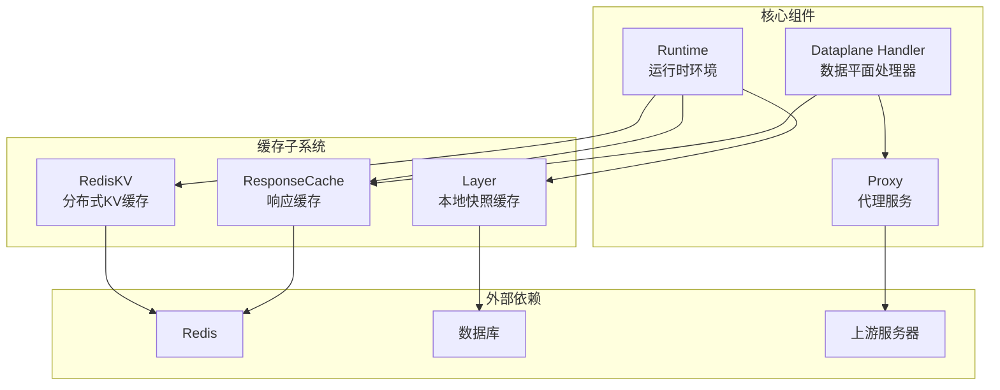
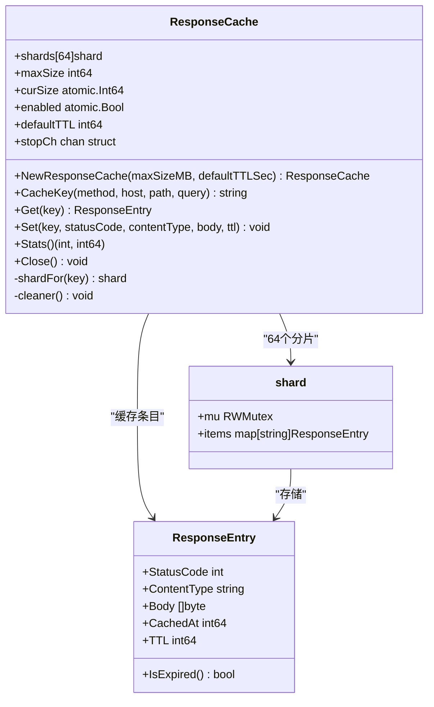
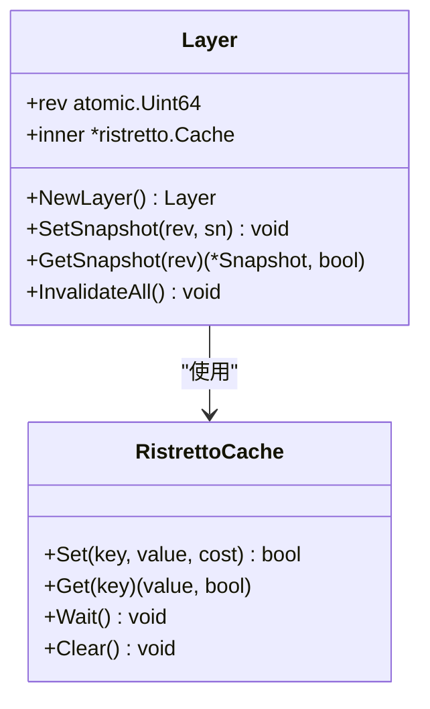
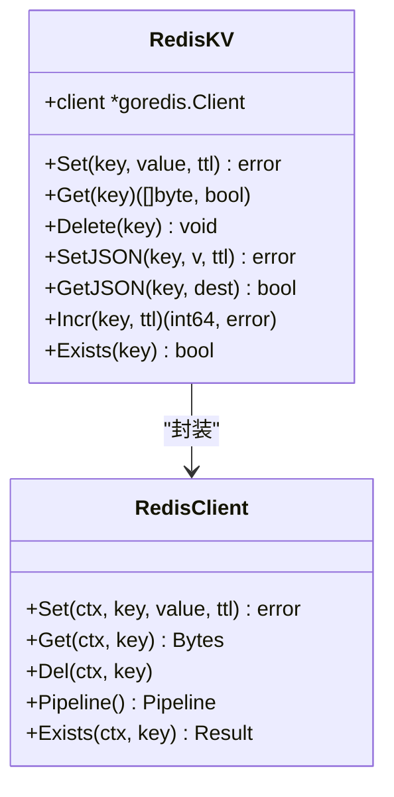
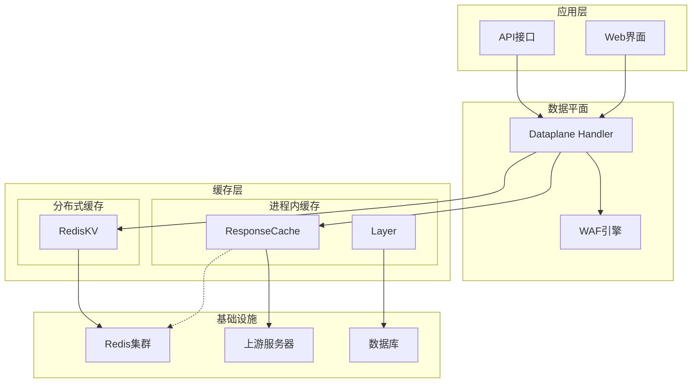
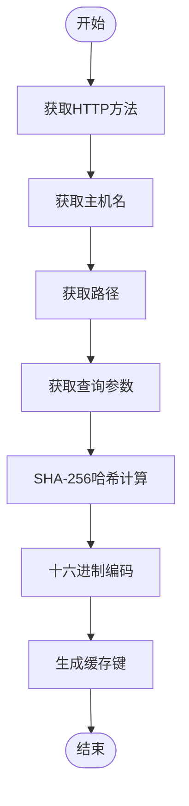
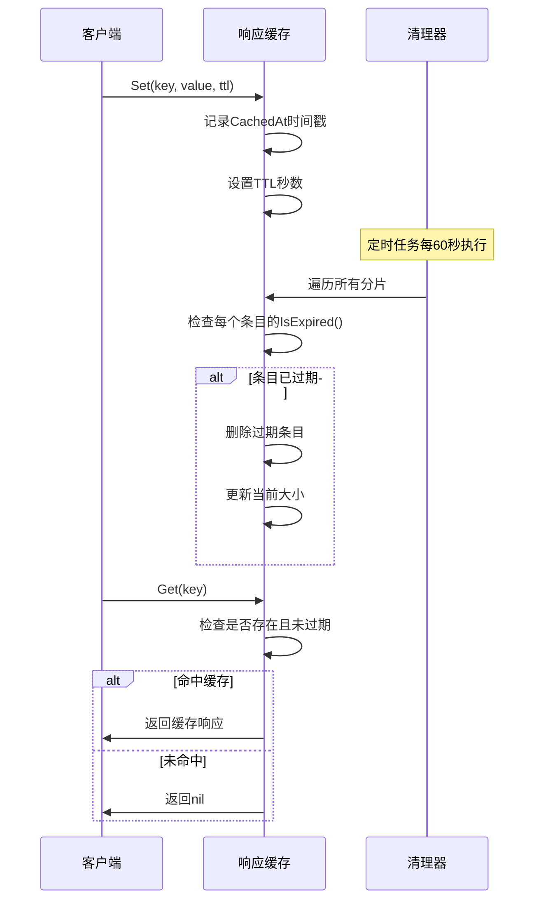
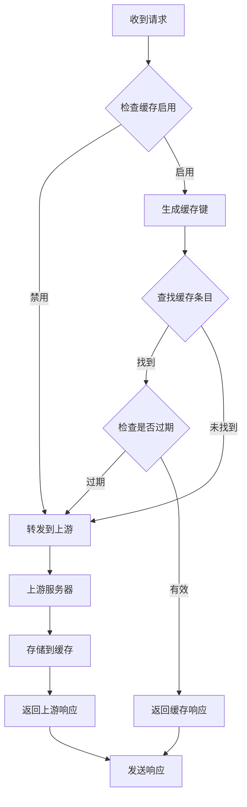
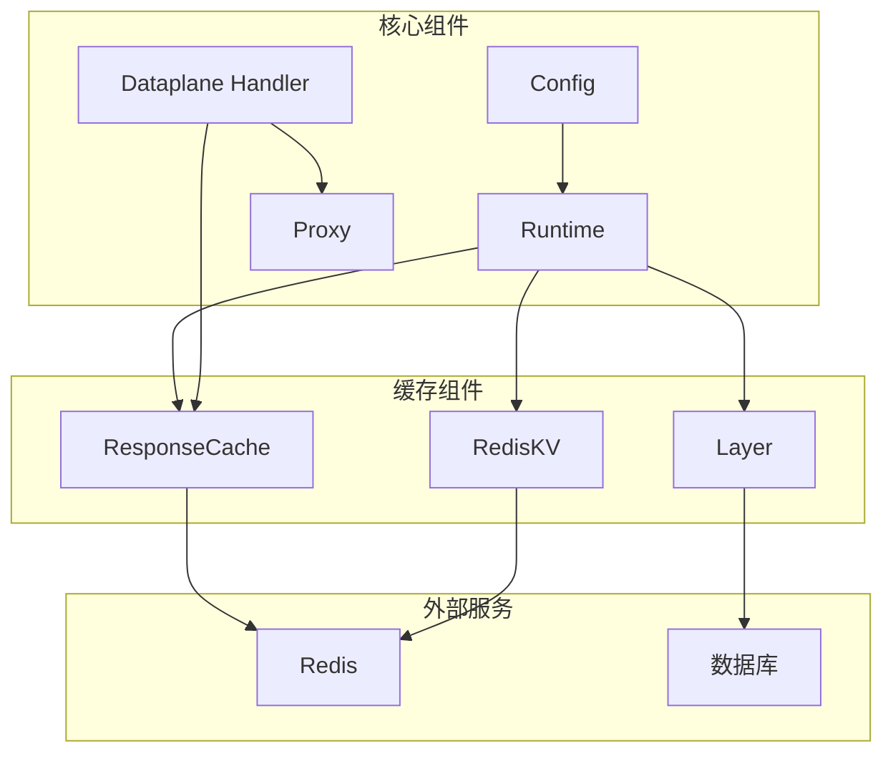

# 响应缓存机制

<cite>
**本文档引用的文件**
- [response_cache.go](file://internal/cache/response_cache.go)
- [layer.go](file://internal/cache/layer.go)
- [redis_kv.go](file://internal/cache/redis_kv.go)
- [response_cache_test.go](file://internal/cache/response_cache_test.go)
- [runtime.go](file://internal/core/runtime.go)
- [handler.go](file://internal/dataplane/handler.go)
- [proxy.go](file://internal/proxy/proxy.go)
- [config.go](file://internal/core/config.go)
</cite>

## 目录
1. [简介](#简介)
2. [项目结构](#项目结构)
3. [核心组件](#核心组件)
4. [架构概览](#架构概览)
5. [详细组件分析](#详细组件分析)
6. [依赖分析](#依赖分析)
7. [性能考虑](#性能考虑)
8. [故障排除指南](#故障排除指南)
9. [结论](#结论)
10. [附录](#附录)

## 简介

My-OpenWaf 项目实现了多层次的响应缓存机制，旨在提升系统性能并减少上游服务器负载。该缓存系统采用内存分片锁设计，支持智能过期管理，并提供了完整的分布式协调能力。

缓存系统主要包含三个层次：
- **进程内响应缓存**：基于内存的快速响应缓存，专门用于安全请求（如 GET 请求）
- **本地快照缓存**：使用 Ristretto 实现的进程内配置快照缓存
- **分布式键值缓存**：基于 Redis 的跨节点共享状态缓存

## 项目结构

缓存相关代码主要位于 `internal/cache` 目录中，采用模块化设计：

**图表来源**
- [response_cache.go:1-163](file://internal/cache/response_cache.go#L1-L163)
- [layer.go:1-65](file://internal/cache/layer.go#L1-L65)
- [redis_kv.go:1-113](file://internal/cache/redis_kv.go#L1-L113)

**章节来源**
- [response_cache.go:1-163](file://internal/cache/response_cache.go#L1-L163)
- [layer.go:1-65](file://internal/cache/layer.go#L1-L65)
- [redis_kv.go:1-113](file://internal/cache/redis_kv.go#L1-L113)

## 核心组件

### 响应缓存 ResponseCache

ResponseCache 是缓存系统的核心组件，采用内存分片锁设计以减少锁竞争：

**图表来源**
- [response_cache.go:11-163](file://internal/cache/response_cache.go#L11-L163)

### 本地快照缓存 Layer

Layer 提供进程内的配置快照缓存，使用 Ristretto 作为底层存储：

**图表来源**
- [layer.go:19-65](file://internal/cache/layer.go#L19-L65)

### 分布式键值缓存 RedisKV

RedisKV 提供跨节点共享的状态缓存，支持多种数据类型操作：

**图表来源**
- [redis_kv.go:13-113](file://internal/cache/redis_kv.go#L13-L113)

**章节来源**
- [response_cache.go:25-163](file://internal/cache/response_cache.go#L25-L163)
- [layer.go:19-65](file://internal/cache/layer.go#L19-L65)
- [redis_kv.go:13-113](file://internal/cache/redis_kv.go#L13-L113)

## 架构概览

缓存系统采用分层架构设计，每层都有明确的职责分工：

**图表来源**
- [handler.go:37-310](file://internal/dataplane/handler.go#L37-L310)
- [runtime.go:17-79](file://internal/core/runtime.go#L17-L79)

## 详细组件分析

### 缓存键生成策略

缓存键采用 SHA-256 哈希算法生成，确保唯一性和确定性：

**图表来源**
- [response_cache.go:56-67](file://internal/cache/response_cache.go#L56-L67)

缓存键包含以下关键要素：
- **HTTP方法**：区分不同类型的请求
- **主机名**：支持多站点配置
- **路径**：区分不同资源
- **查询参数**：区分相同路径的不同参数组合

### 过期时间管理

缓存系统采用基于时间戳的过期机制：

**图表来源**
- [response_cache.go:78-162](file://internal/cache/response_cache.go#L78-L162)

### 内存使用控制

系统通过多种机制控制内存使用：

1. **最大容量限制**：单个条目大小不超过总容量的10%
2. **原子计数器**：实时跟踪当前缓存大小
3. **分片锁**：64个分片减少锁竞争
4. **自动清理**：后台定时清理过期条目

### 缓存命中处理流程

**图表来源**
- [response_cache.go:78-122](file://internal/cache/response_cache.go#L78-L122)
- [handler.go:254-277](file://internal/dataplane/handler.go#L254-L277)

**章节来源**
- [response_cache.go:56-162](file://internal/cache/response_cache.go#L56-L162)
- [handler.go:254-277](file://internal/dataplane/handler.go#L254-L277)

## 依赖分析

缓存系统与核心组件的依赖关系：

**图表来源**
- [runtime.go:17-79](file://internal/core/runtime.go#L17-L79)
- [handler.go:37-310](file://internal/dataplane/handler.go#L37-L310)

**章节来源**
- [runtime.go:17-79](file://internal/core/runtime.go#L17-L79)
- [handler.go:37-310](file://internal/dataplane/handler.go#L37-L310)

## 性能考虑

### 并发性能优化

1. **分片锁设计**：64个独立分片减少锁竞争
2. **读写分离**：读操作使用 RLock，写操作使用 Lock
3. **原子操作**：使用 atomic.Int64 和 atomic.Bool 减少锁开销

### 内存效率优化

1. **容量限制**：防止单个大响应占用过多内存
2. **自动清理**：定期清理过期条目释放内存
3. **精确计数**：实时跟踪内存使用量

### 网络性能优化

1. **连接池复用**：上游连接复用减少建立连接的开销
2. **传输层优化**：HTTP/2 支持和连接保活
3. **头部过滤**：自动过滤不必要的代理头部

## 故障排除指南

### 常见问题诊断

1. **缓存不生效**
   - 检查缓存是否启用：`SetEnabled(true)`
   - 验证缓存键生成是否正确
   - 确认 TTL 设置是否合理

2. **内存使用过高**
   - 检查最大容量配置
   - 监控清理器运行状态
   - 分析热点键分布

3. **性能问题**
   - 检查分片锁竞争情况
   - 监控缓存命中率
   - 分析上游响应时间

### 监控指标

系统提供以下监控指标：

| 指标名称 | 描述 | 数据类型 |
|---------|------|----------|
| entries | 缓存条目数量 | int |
| sizeBytes | 当前缓存大小 | int64 |
| cache_hit | 缓存命中次数 | counter |
| cache_miss | 缓存未命中次数 | counter |
| cache_expired | 过期条目数量 | gauge |

### 配置调优建议

1. **内存配置**
   - 建议缓存大小为可用内存的 20-30%
   - 根据业务流量调整默认 TTL

2. **性能调优**
   - 增加分片数量以减少锁竞争
   - 调整清理频率平衡内存和 CPU 使用

3. **可靠性保障**
   - 设置合理的超时时间
   - 配置健康检查机制
   - 监控错误率和响应时间

**章节来源**
- [response_cache_test.go:5-78](file://internal/cache/response_cache_test.go#L5-L78)
- [config.go:74-183](file://internal/core/config.go#L74-L183)

## 结论

My-OpenWaf 的响应缓存机制通过多层次设计实现了高性能、高可靠性的缓存服务。系统采用先进的并发控制技术和智能过期管理，能够有效提升系统性能并降低上游服务器负载。

关键优势包括：
- **高性能**：分片锁设计减少锁竞争
- **可扩展**：支持水平扩展和分布式部署
- **易维护**：清晰的架构设计和完善的监控
- **可靠性**：自动清理和健康检查机制

通过合理的配置和监控，该缓存系统能够满足生产环境的各种需求。

## 附录

### 配置选项

| 配置项 | 类型 | 默认值 | 描述 |
|--------|------|--------|------|
| cache_max_size_mb | int | 100 | 缓存最大容量（MB） |
| cache_default_ttl_sec | int | 300 | 默认过期时间（秒） |
| cache_shard_count | int | 64 | 分片数量 |
| cache_cleanup_interval | int | 60 | 清理间隔（秒） |

### 最佳实践

1. **缓存键设计**
   - 确保缓存键的唯一性和稳定性
   - 包含所有影响响应内容的参数
   - 避免缓存键过长

2. **TTL 设置**
   - 根据内容更新频率设置合适的 TTL
   - 对于频繁更新的内容使用较短 TTL
   - 对于静态内容使用较长 TTL

3. **内存管理**
   - 定期监控缓存使用情况
   - 设置合理的容量上限
   - 监控清理器运行状态

4. **性能优化**
   - 根据硬件配置调整分片数量
   - 监控缓存命中率
   - 定期评估缓存效果