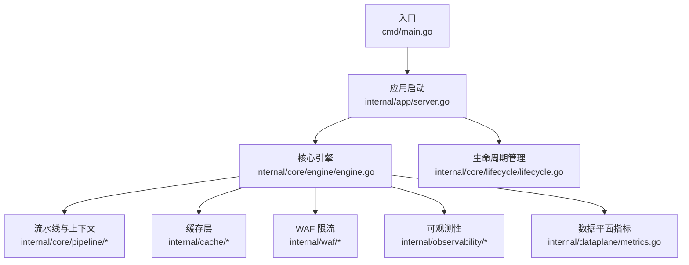
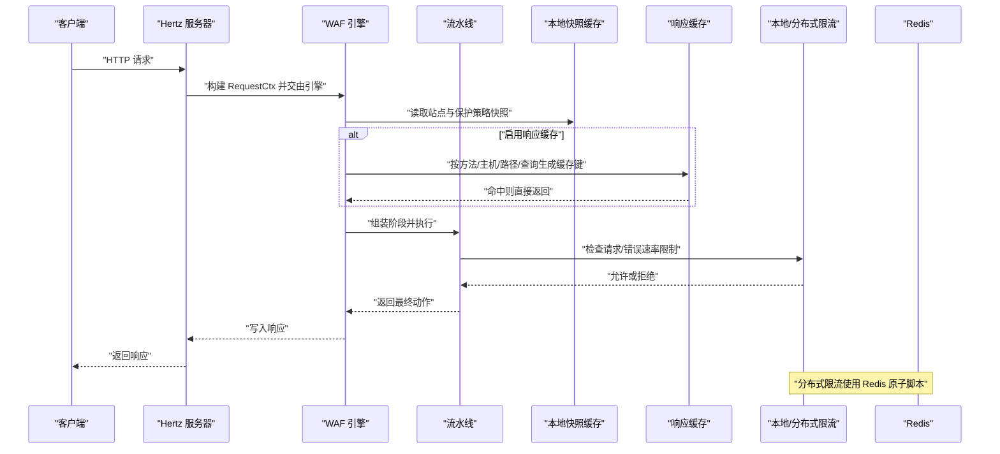
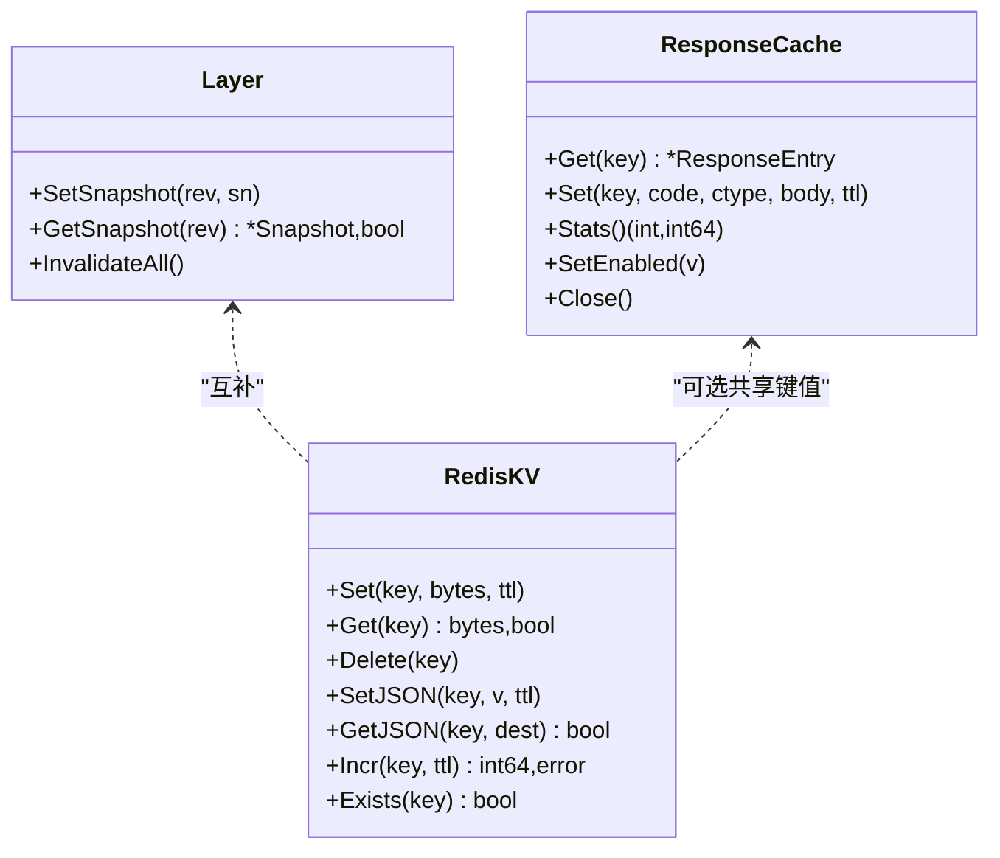
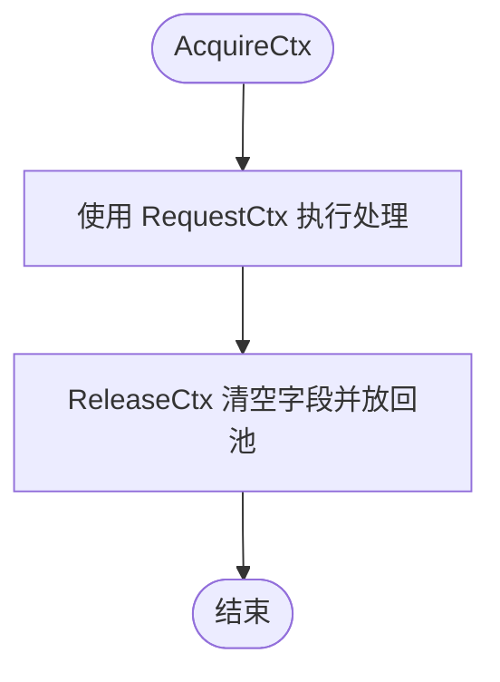
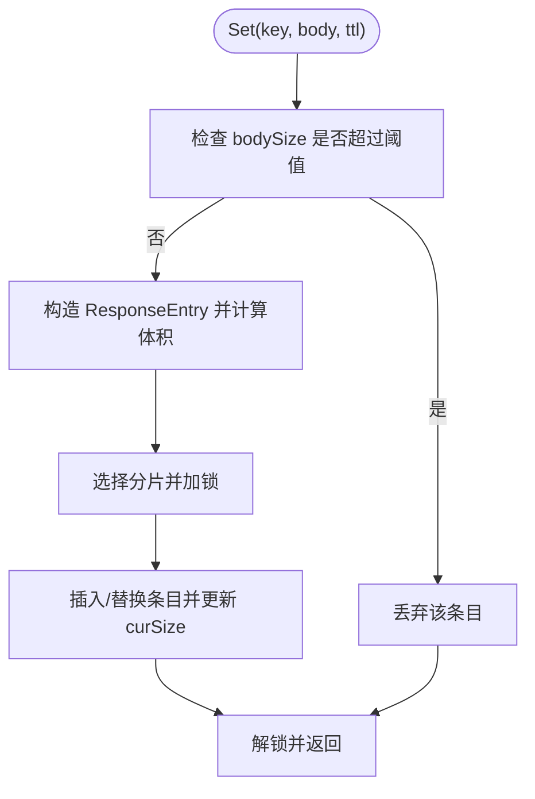
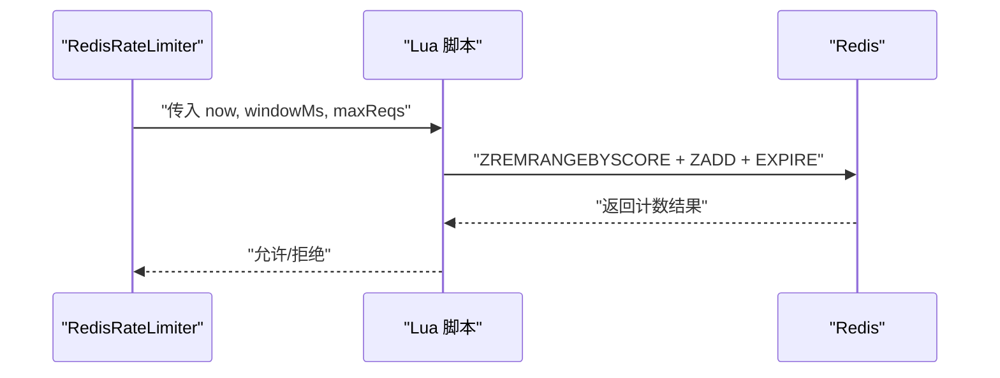
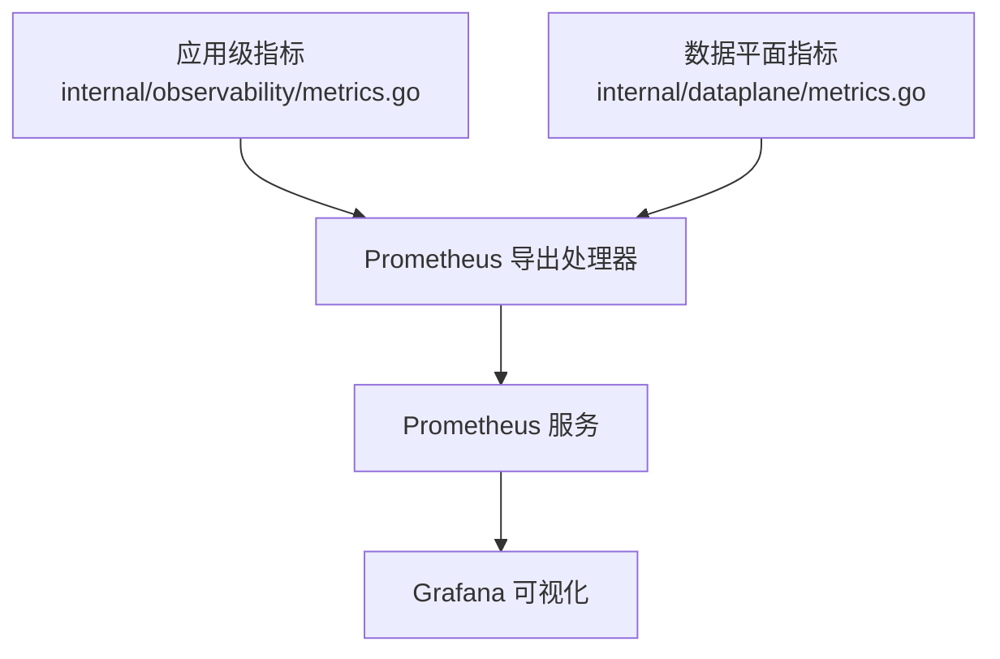
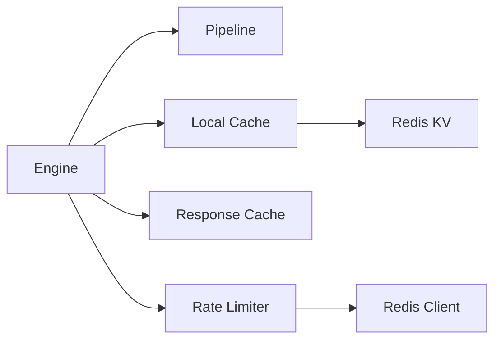

# 性能优化策略

<cite>
**本文档引用的文件**
- [main.go](file://cmd/main.go)
- [layer.go](file://internal/cache/layer.go)
- [redis_kv.go](file://internal/cache/redis_kv.go)
- [response_cache.go](file://internal/cache/response_cache.go)
- [pool.go](file://internal/core/pipeline/pool.go)
- [pipeline.go](file://internal/core/pipeline/pipeline.go)
- [engine.go](file://internal/core/engine/engine.go)
- [ratelimit.go](file://internal/waf/ratelimit.go)
- [ratelimit_redis.go](file://internal/waf/ratelimit_redis.go)
- [redis.go](file://internal/core/redis/redis.go)
- [metrics.go](file://internal/observability/metrics.go)
- [metrics.go](file://internal/dataplane/metrics.go)
- [lifecycle.go](file://internal/core/lifecycle/lifecycle.go)
</cite>

## 目录
1. [简介](#简介)
2. [项目结构](#项目结构)
3. [核心组件](#核心组件)
4. [架构总览](#架构总览)
5. [详细组件分析](#详细组件分析)
6. [依赖分析](#依赖分析)
7. [性能考虑](#性能考虑)
8. [故障排查指南](#故障排查指南)
9. [结论](#结论)
10. [附录](#附录)

## 简介
本文件面向性能优化主题，系统梳理并解释本项目的多层缓存架构（本地缓存与分布式缓存协同）、并发处理优化（goroutine 管理、资源复用与锁优化）、内存管理优化（对象池、GC 调优与内存泄漏预防）、I/O 性能优化（连接复用、批量与异步处理），以及性能监控指标体系（关键指标定义、监控工具使用与瓶颈识别方法）。内容以代码为依据，辅以可视化图示，帮助读者快速定位优化点并落地实践。

## 项目结构
项目采用分层模块化组织：入口程序负责启动应用；核心引擎负责请求处理流水线；缓存子系统提供本地与分布式两级缓存；WAF 子系统实现规则匹配与限流；可观测性模块提供指标采集与导出；生命周期管理模块负责服务器的优雅启停与信号处理。

图表来源
- [main.go:1-10](file://cmd/main.go#L1-L10)
- [engine.go:1-176](file://internal/core/engine/engine.go#L1-L176)
- [pipeline.go:1-71](file://internal/core/pipeline/pipeline.go#L1-L71)
- [layer.go:1-65](file://internal/cache/layer.go#L1-L65)
- [ratelimit.go:1-117](file://internal/waf/ratelimit.go#L1-L117)
- [metrics.go:1-126](file://internal/observability/metrics.go#L1-L126)
- [metrics.go:1-136](file://internal/dataplane/metrics.go#L1-L136)
- [lifecycle.go:1-178](file://internal/core/lifecycle/lifecycle.go#L1-L178)

章节来源
- [main.go:1-10](file://cmd/main.go#L1-L10)

## 核心组件
- 多层缓存架构
  - 本地快照缓存：基于 ristretto 的进程内缓存，用于存放不可变配置快照，避免序列化到 Redis。
  - 分布式键值缓存：基于 Redis 的 KV 缓存，用于跨节点共享状态（如响应缓存、速率限制元数据、IP 黑名单同步等）。
  - 响应缓存：针对安全 GET 请求的内存级 LRU 风格缓存，带分片互斥与后台清理器。
- 并发处理
  - 请求上下文对象池：通过 sync.Pool 复用 RequestCtx，降低 GC 压力。
  - 流水线阶段执行：顺序执行各阶段，命中高优先级结果时短路返回。
- 内存管理
  - 对象池：集中管理热点对象分配与回收。
  - 响应缓存：记录当前缓存体积，超过阈值的条目直接丢弃，防止单条过大导致内存膨胀。
- I/O 优化
  - Redis 客户端：统一超时配置，避免阻塞；分布式限流使用 Lua 原子脚本实现滑动窗口。
  - 连接复用：Hertz 服务器与 Redis 客户端均支持连接池与复用。
- 监控指标
  - 应用级指标：请求总量、拦截数、观测命中、缓存命中/未命中、上游错误、运行时内存与 goroutine 数等。
  - 数据平面指标：QPS 窗口统计、状态码分布、唯一 IP 与攻击 IP 统计等。

章节来源
- [layer.go:1-65](file://internal/cache/layer.go#L1-L65)
- [redis_kv.go:1-113](file://internal/cache/redis_kv.go#L1-L113)
- [response_cache.go:1-163](file://internal/cache/response_cache.go#L1-L163)
- [pool.go:1-37](file://internal/core/pipeline/pool.go#L1-L37)
- [pipeline.go:1-71](file://internal/core/pipeline/pipeline.go#L1-L71)
- [ratelimit.go:1-117](file://internal/waf/ratelimit.go#L1-L117)
- [ratelimit_redis.go:1-89](file://internal/waf/ratelimit_redis.go#L1-L89)
- [redis.go:1-39](file://internal/core/redis/redis.go#L1-L39)
- [metrics.go:1-126](file://internal/observability/metrics.go#L1-L126)
- [metrics.go:1-136](file://internal/dataplane/metrics.go#L1-L136)

## 架构总览
下图展示请求从进入引擎到完成处理的关键路径，以及缓存与限流在不同层级的协作方式。

图表来源
- [engine.go:57-129](file://internal/core/engine/engine.go#L57-L129)
- [pipeline.go:46-70](file://internal/core/pipeline/pipeline.go#L46-L70)
- [layer.go:42-59](file://internal/cache/layer.go#L42-L59)
- [response_cache.go:78-122](file://internal/cache/response_cache.go#L78-L122)
- [ratelimit.go:48-92](file://internal/waf/ratelimit.go#L48-L92)
- [ratelimit_redis.go:47-85](file://internal/waf/ratelimit_redis.go#L47-L85)
- [redis_kv.go:31-112](file://internal/cache/redis_kv.go#L31-L112)

## 详细组件分析

### 多层缓存架构设计与协同
- 设计理念
  - 本地快照缓存：存放不可变配置快照，避免跨节点序列化与传输开销。
  - 分布式 KV 缓存：存放跨节点共享的状态（如速率限制计数器、响应缓存键值、IP 黑名单等）。
  - 响应缓存：对安全 GET 请求进行内存级缓存，减少上游压力与延迟。
- 协同机制
  - 快照更新通过 Redis Pub/Sub 触发节点重载，不直接在节点间共享快照对象。
  - 响应缓存命中时直接返回，未命中再发起上游请求，并将响应写回缓存。
  - 速率限制元数据通过分布式 KV 或 Redis 原子脚本实现跨节点一致性。

图表来源
- [layer.go:19-64](file://internal/cache/layer.go#L19-L64)
- [redis_kv.go:13-112](file://internal/cache/redis_kv.go#L13-L112)
- [response_cache.go:25-162](file://internal/cache/response_cache.go#L25-L162)

章节来源
- [layer.go:1-65](file://internal/cache/layer.go#L1-L65)
- [redis_kv.go:1-113](file://internal/cache/redis_kv.go#L1-L113)
- [response_cache.go:1-163](file://internal/cache/response_cache.go#L1-L163)

### 并发处理优化：goroutine 管理、资源复用与锁优化
- goroutine 管理
  - 生命周期管理器统一启动/停止多个服务，支持优雅关闭与信号处理。
  - 启动时将每个服务器放入独立 goroutine，避免阻塞。
- 资源复用
  - 请求上下文对象池：预分配 Header 映射容量，减少扩容与 GC。
  - Redis 客户端默认启用超时，避免长时间阻塞。
- 锁优化
  - 响应缓存采用 64 个分片互斥，降低热点竞争。
  - 本地限流使用全局互斥保护窗口表，同时最小化临界区时间。

图表来源
- [pool.go:14-36](file://internal/core/pipeline/pool.go#L14-L36)

章节来源
- [lifecycle.go:123-177](file://internal/core/lifecycle/lifecycle.go#L123-L177)
- [pool.go:1-37](file://internal/core/pipeline/pool.go#L1-L37)
- [response_cache.go:28-76](file://internal/cache/response_cache.go#L28-L76)
- [ratelimit.go:10-34](file://internal/waf/ratelimit.go#L10-L34)

### 内存管理优化：对象池、GC 调优与内存泄漏预防
- 对象池
  - RequestCtx 使用 sync.Pool 复用，避免频繁分配与 GC 抖动。
- GC 调优
  - 响应缓存记录当前体积，超过阈值的条目直接丢弃，防止单条过大导致内存膨胀。
  - 提供后台清理器定期扫描过期条目，释放内存。
- 泄漏预防
  - RequestCtx 归还前清空所有字段与映射，确保无残留引用。
  - 响应缓存删除条目后同步更新当前体积，避免计数偏差。

图表来源
- [response_cache.go:94-122](file://internal/cache/response_cache.go#L94-L122)

章节来源
- [pool.go:1-37](file://internal/core/pipeline/pool.go#L1-L37)
- [response_cache.go:1-163](file://internal/cache/response_cache.go#L1-L163)

### I/O 性能优化：连接复用、批量与异步处理
- 连接复用
  - Redis 客户端默认启用超时控制，避免阻塞；Hertz 服务器支持连接池与复用。
- 批量与原子操作
  - 分布式限流使用 Lua 脚本实现滑动窗口计数，保证原子性与低延迟。
  - RedisKV 支持管道化命令（如 Incr）提升吞吐。
- 异步处理
  - 响应缓存与本地限流的后台清理器以定时器异步运行，不影响请求主路径。

图表来源
- [ratelimit_redis.go:47-85](file://internal/waf/ratelimit_redis.go#L47-L85)

章节来源
- [redis.go:17-30](file://internal/core/redis/redis.go#L17-L30)
- [ratelimit_redis.go:1-89](file://internal/waf/ratelimit_redis.go#L1-L89)
- [redis_kv.go:93-101](file://internal/cache/redis_kv.go#L93-L101)

### 性能监控指标体系
- 关键指标
  - 应用级：请求总数、拦截总数、观测命中、内置规则命中、缓存命中/未命中、上游错误、运行时 goroutine 数、heap alloc、sys、GC pause。
  - 数据平面：QPS（1s/5s）、状态码分布（2xx/4xx/5xx）、唯一 IP、攻击 IP。
- 指标来源
  - Prometheus 文本格式导出处理器，聚合运行时与业务指标。
  - 数据平面指标维护环形缓冲与原子计数器，提供近实时 QPS 计算。
- 工具使用
  - 将 /metrics 接口接入 Prometheus 抓取，结合 Grafana 可视化。
- 瓶颈识别
  - 通过 goroutine 数与内存指标判断是否存在协程泄漏或内存增长异常。
  - 通过缓存命中率与上游错误率评估缓存与上游健康度。

图表来源
- [metrics.go:51-125](file://internal/observability/metrics.go#L51-L125)
- [metrics.go:37-135](file://internal/dataplane/metrics.go#L37-L135)

章节来源
- [metrics.go:1-126](file://internal/observability/metrics.go#L1-L126)
- [metrics.go:1-136](file://internal/dataplane/metrics.go#L1-L136)

## 依赖分析
- 组件耦合
  - 引擎依赖流水线、站点解析器、WAF 组件与缓存层；缓存层与 RedisKV 独立但可配合使用。
  - 限流器可本地或分布式，分布式依赖 Redis 客户端。
- 外部依赖
  - Redis 客户端、Hertz 服务器、ristretto 缓存库。
- 循环依赖
  - 当前模块划分清晰，未见循环导入迹象。

图表来源
- [engine.go:15-37](file://internal/core/engine/engine.go#L15-L37)
- [layer.go:19-38](file://internal/cache/layer.go#L19-L38)
- [redis_kv.go:19-29](file://internal/cache/redis_kv.go#L19-L29)
- [ratelimit.go:9-17](file://internal/waf/ratelimit.go#L9-L17)
- [redis.go:17-30](file://internal/core/redis/redis.go#L17-L30)

章节来源
- [engine.go:1-176](file://internal/core/engine/engine.go#L1-L176)
- [redis.go:1-39](file://internal/core/redis/redis.go#L1-L39)

## 性能考虑
- 缓存策略
  - 本地快照缓存避免跨节点序列化；分布式 KV 仅存放共享状态；响应缓存针对安全 GET 请求。
  - 建议根据流量特征调整响应缓存最大体积与默认 TTL，平衡命中率与内存占用。
- 并发与锁
  - 分片互斥显著降低热点竞争；保持临界区最小化，避免在锁内进行耗时操作。
  - 对于高频路径，尽量使用原子变量与只读共享状态。
- 内存与 GC
  - 通过对象池与分片互斥降低分配与锁竞争；及时清理过期条目，避免内存膨胀。
  - 监控 heap alloc 与 goroutine 数，发现异常及时排查。
- I/O 与网络
  - Redis 超时与连接池配置需与后端能力匹配；分布式限流使用原子脚本保证一致性。
  - 对批量写入场景使用管道化命令，减少往返开销。
- 监控与告警
  - 建议对缓存命中率、QPS、上游错误率、内存与 goroutine 数设置阈值告警。
  - 结合日志与追踪，定位慢请求与异常路径。

## 故障排查指南
- 缓存相关
  - 命中率低：检查缓存键生成逻辑与 TTL 设置；确认响应缓存是否启用且体积充足。
  - 内存增长：检查响应缓存是否清理及时；确认未出现单条超大响应导致体积阈值触发。
- 限流相关
  - 分布式限流失败：检查 Redis 连接与超时配置；关注 Lua 脚本执行错误（当前实现为“失败放行”）。
  - 本地限流积压：检查窗口大小与最大请求数设置，必要时拆分键空间。
- 监控缺失
  - /metrics 无法访问：确认 Prometheus 处理器已注册；检查导出格式与抓取端配置。
- 优雅停机
  - 服务无法正常退出：检查生命周期管理器的信号处理与服务器 Shutdown 超时设置。

章节来源
- [response_cache.go:142-162](file://internal/cache/response_cache.go#L142-L162)
- [ratelimit_redis.go:79-85](file://internal/waf/ratelimit_redis.go#L79-L85)
- [metrics.go:51-125](file://internal/observability/metrics.go#L51-L125)
- [lifecycle.go:170-177](file://internal/core/lifecycle/lifecycle.go#L170-L177)

## 结论
本项目在缓存、并发、内存与 I/O 方面均采用了成熟且高效的优化手段：多层缓存架构清晰分离本地与分布式职责；对象池与分片互斥有效降低 GC 与锁竞争；分布式限流通过原子脚本保障一致性；监控指标覆盖应用与数据平面，便于快速定位瓶颈。建议在生产环境中结合业务特征持续调优缓存体积与 TTL、限流参数，并完善告警与巡检流程。

## 附录
- 关键实现参考路径
  - 本地快照缓存：[layer.go:27-64](file://internal/cache/layer.go#L27-L64)
  - 分布式 KV：[redis_kv.go:23-112](file://internal/cache/redis_kv.go#L23-L112)
  - 响应缓存：[response_cache.go:41-162](file://internal/cache/response_cache.go#L41-L162)
  - 请求上下文对象池：[pool.go:5-36](file://internal/core/pipeline/pool.go#L5-L36)
  - 流水线执行：[pipeline.go:46-70](file://internal/core/pipeline/pipeline.go#L46-L70)
  - 引擎处理链：[engine.go:57-129](file://internal/core/engine/engine.go#L57-L129)
  - 本地限流：[ratelimit.go:24-116](file://internal/waf/ratelimit.go#L24-L116)
  - 分布式限流：[ratelimit_redis.go:22-85](file://internal/waf/ratelimit_redis.go#L22-L85)
  - Redis 客户端封装：[redis.go:17-30](file://internal/core/redis/redis.go#L17-L30)
  - 应用级指标导出：[metrics.go:51-125](file://internal/observability/metrics.go#L51-L125)
  - 数据平面指标：[metrics.go:37-135](file://internal/dataplane/metrics.go#L37-L135)
  - 优雅启停：[lifecycle.go:123-177](file://internal/core/lifecycle/lifecycle.go#L123-L177)