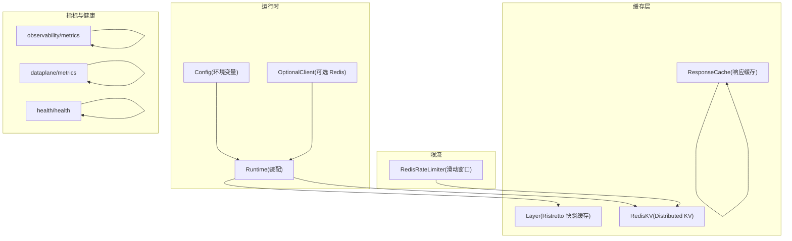
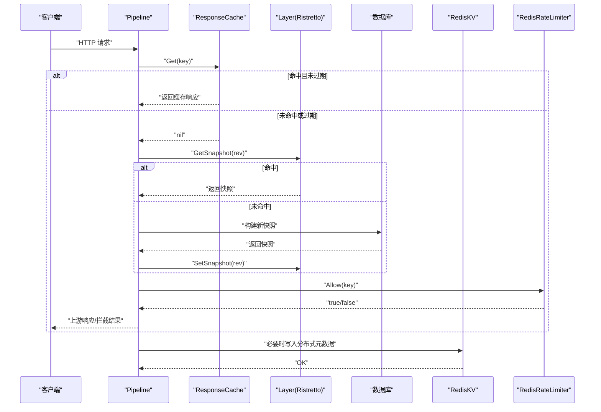
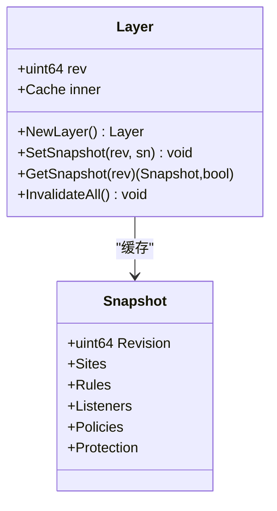
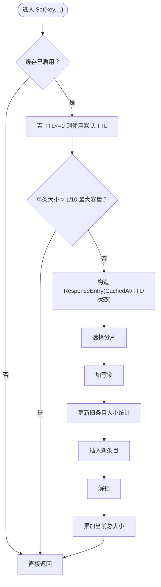
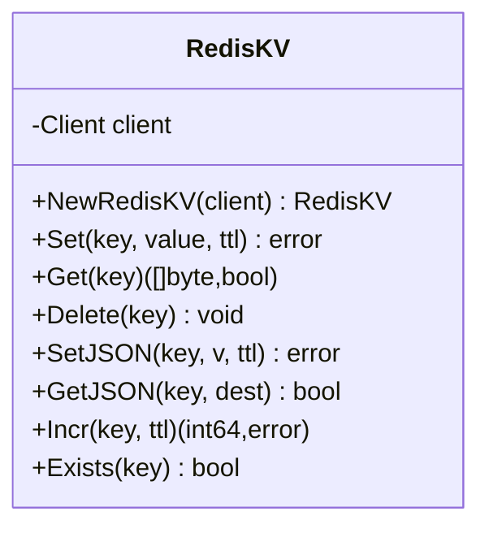
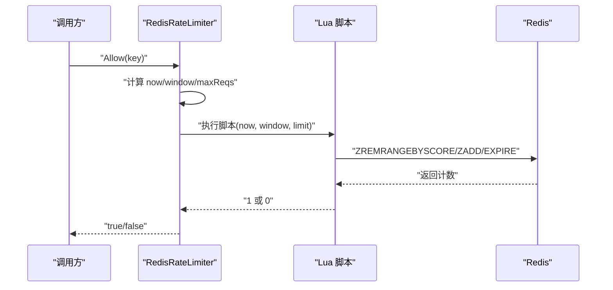
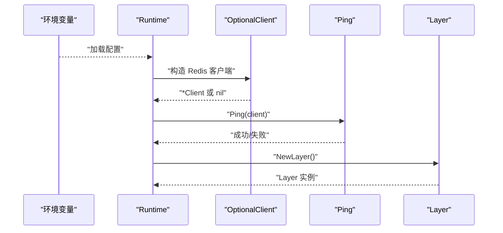
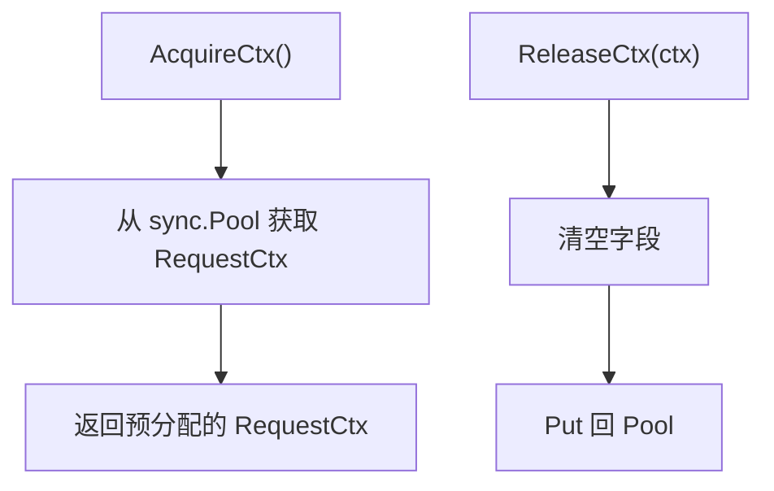
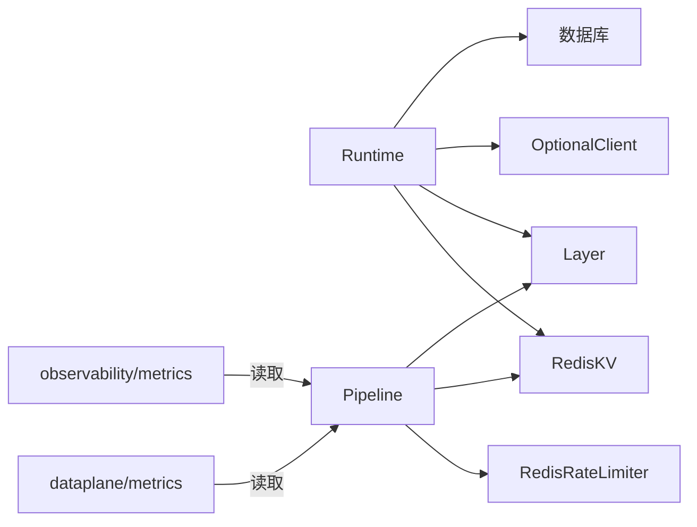

# 缓存与性能优化

<cite>
**本文引用的文件**
- [layer.go](file://internal/cache/layer.go)
- [redis_kv.go](file://internal/cache/redis_kv.go)
- [response_cache.go](file://internal/cache/response_cache.go)
- [ratelimit_redis.go](file://internal/waf/ratelimit_redis.go)
- [redis.go](file://internal/core/redis/redis.go)
- [runtime.go](file://internal/core/runtime.go)
- [pool.go](file://internal/core/pipeline/pool.go)
- [config.go](file://internal/core/config.go)
- [health.go](file://internal/core/health/health.go)
- [metrics.go（可观测性）](file://internal/observability/metrics.go)
- [metrics.go（数据平面）](file://internal/dataplane/metrics.go)
- [pipeline.go](file://internal/core/pipeline/pipeline.go)
- [response_cache_test.go](file://internal/cache/response_cache_test.go)
</cite>

## 目录
1. [简介](#简介)
2. [项目结构](#项目结构)
3. [核心组件](#核心组件)
4. [架构总览](#架构总览)
5. [详细组件分析](#详细组件分析)
6. [依赖分析](#依赖分析)
7. [性能考虑](#性能考虑)
8. [故障排除指南](#故障排除指南)
9. [结论](#结论)
10. [附录](#附录)

## 简介
本文件聚焦于系统中的缓存与性能优化实践，涵盖以下主题：
- Ristretto 进程内缓存：快照缓存的设计、内存管理与近似 LRU 行为
- Redis 集成：连接配置、分布式 KV、序列化与分布式缓存策略
- 响应缓存：缓存键设计、过期策略、命中率优化与后台清理
- 性能优化：并发处理、资源复用（对象池）、延迟优化
- 缓存一致性：失效、更新传播与数据同步
- 监控指标与调优：请求/命中/错误计数、QPS、内存与 goroutine 指标
- 最佳实践与故障排除

## 项目结构
与缓存和性能相关的关键模块分布如下：
- internal/cache：进程内快照缓存、响应缓存、Redis 分布式 KV
- internal/waf：分布式限流（基于 Redis 的滑动窗口）
- internal/core/redis：可选 Redis 客户端构造与连通性检查
- internal/core/runtime：运行时装配（数据库、Redis、缓存层）
- internal/core/pipeline：请求上下文对象池，降低 GC 压力
- internal/observability 与 internal/dataplane：指标收集与导出
- internal/core/health：健康检查与状态接口

图表来源
- [layer.go:1-65](file://internal/cache/layer.go#L1-L65)
- [response_cache.go:1-163](file://internal/cache/response_cache.go#L1-L163)
- [redis_kv.go:1-113](file://internal/cache/redis_kv.go#L1-L113)
- [ratelimit_redis.go:1-89](file://internal/waf/ratelimit_redis.go#L1-L89)
- [redis.go:1-39](file://internal/core/redis/redis.go#L1-L39)
- [runtime.go:1-127](file://internal/core/runtime.go#L1-L127)
- [metrics.go（可观测性）:1-126](file://internal/observability/metrics.go#L1-L126)
- [metrics.go（数据平面）:1-135](file://internal/dataplane/metrics.go#L1-L135)
- [health.go:1-95](file://internal/core/health/health.go#L1-L95)

章节来源
- [layer.go:1-65](file://internal/cache/layer.go#L1-L65)
- [response_cache.go:1-163](file://internal/cache/response_cache.go#L1-L163)
- [redis_kv.go:1-113](file://internal/cache/redis_kv.go#L1-L113)
- [ratelimit_redis.go:1-89](file://internal/waf/ratelimit_redis.go#L1-L89)
- [redis.go:1-39](file://internal/core/redis/redis.go#L1-L39)
- [runtime.go:1-127](file://internal/core/runtime.go#L1-L127)
- [metrics.go（可观测性）:1-126](file://internal/observability/metrics.go#L1-L126)
- [metrics.go（数据平面）:1-135](file://internal/dataplane/metrics.go#L1-L135)
- [health.go:1-95](file://internal/core/health/health.go#L1-L95)

## 核心组件
- Layer（Ristretto 快照缓存）：进程内缓存不可变配置快照，避免重复构建；通过原子指针持有，读取零锁开销
- ResponseCache（响应缓存）：针对安全请求（如 GET）的内存缓存，支持分片互斥、默认 TTL、后台清理
- RedisKV（分布式 KV）：基于 Redis 的跨节点共享状态存储（限流计数器、响应缓存元数据等），提供 JSON 序列化与管道操作
- RedisRateLimiter（分布式限流）：基于 Redis Lua 脚本的滑动窗口限流，支持动态重配置
- OptionalClient（Redis 客户端）：按配置可选启用 Redis，提供超时与连通性检查
- 对象池（pipeline/pool.go）：复用请求上下文，减少 GC 压力
- 指标系统：/metrics 导出与健康检查接口，覆盖请求总量、命中/未命中、错误、QPS、内存与 goroutine 等

章节来源
- [layer.go:19-65](file://internal/cache/layer.go#L19-L65)
- [response_cache.go:25-163](file://internal/cache/response_cache.go#L25-L163)
- [redis_kv.go:13-113](file://internal/cache/redis_kv.go#L13-L113)
- [ratelimit_redis.go:12-89](file://internal/waf/ratelimit_redis.go#L12-L89)
- [redis.go:17-39](file://internal/core/redis/redis.go#L17-L39)
- [pool.go:5-37](file://internal/core/pipeline/pool.go#L5-L37)
- [metrics.go（可观测性）:13-126](file://internal/observability/metrics.go#L13-L126)
- [metrics.go（数据平面）:1-135](file://internal/dataplane/metrics.go#L1-L135)

## 架构总览
系统采用“进程内缓存 + 分布式 KV + 可选 Redis”的混合架构：
- 进程内：Ristretto 快照缓存用于不可变配置；响应缓存用于上游安全响应
- 分布式：RedisKV 提供跨节点共享状态；RedisRateLimiter 实现跨节点限流
- 运行时装配：根据环境变量决定是否启用 Redis，并进行连通性校验
- 指标与健康：统一导出 Prometheus 指标与健康状态

图表来源
- [response_cache.go:78-91](file://internal/cache/response_cache.go#L78-L91)
- [layer.go:42-59](file://internal/cache/layer.go#L42-L59)
- [runtime.go:82-99](file://internal/core/runtime.go#L82-L99)
- [ratelimit_redis.go:67-85](file://internal/waf/ratelimit_redis.go#L67-L85)
- [redis_kv.go:31-84](file://internal/cache/redis_kv.go#L31-L84)

## 详细组件分析

### Ristretto 快照缓存（Layer）
- 设计目标：对不可变配置快照进行进程内缓存，避免重复构建；跨节点通过 Redis Pub/Sub 触发 DB 重载，不直接共享序列化后的快照
- 关键点：
  - 使用 Ristretto，配置 NumCounters、MaxCost、BufferItems 控制内存与命中行为
  - 键命名规则：以固定前缀拼接版本号，确保不同版本隔离
  - 写入后 Wait 确保落盘完成，提升一致性感知
- 复杂度与性能：
  - 查询为 O(1) 级别（哈希表）
  - 清理通过 Clear 支持全量失效

图表来源
- [layer.go:19-65](file://internal/cache/layer.go#L19-L65)

章节来源
- [layer.go:19-65](file://internal/cache/layer.go#L19-L65)

### 响应缓存（ResponseCache）
- 目标：对安全请求（如 GET）的上游响应进行内存缓存，降低上游压力与延迟
- 设计要点：
  - 分片互斥：64 个分片，按 key 哈希选择分片，降低热点竞争
  - 缓存键：由方法、Host、Path、Query 经 SHA-256 生成确定性键
  - 过期策略：每个条目记录 CachedAt 与 TTL，后台定时清理过期项
  - 内存控制：限制最大容量，单条过大直接丢弃；更新时原子统计当前大小
  - 开关控制：可动态启停，便于运维调优
- 性能特征：
  - Get/Set 为 O(1)，读路径仅加读锁
  - 后台清理周期 60 秒，平衡内存与 CPU 占用

图表来源
- [response_cache.go:93-122](file://internal/cache/response_cache.go#L93-L122)

章节来源
- [response_cache.go:25-163](file://internal/cache/response_cache.go#L25-L163)
- [response_cache_test.go:5-79](file://internal/cache/response_cache_test.go#L5-L79)

### Redis 分布式 KV（RedisKV）
- 用途：跨节点共享状态（限流计数、响应缓存元数据、IP 黑名单同步等）
- 特性：
  - 前缀命名空间 openwaf:，避免冲突
  - 提供 Set/Get/Delete/Exists 基础操作
  - JSON 序列化/反序列化封装
  - 原子自增与 TTL 设置（Pipeline 执行）
  - 超时控制（默认 1 秒），防止阻塞
- 数据序列化：JSON 用于复杂结构；字节切片用于二进制数据

图表来源
- [redis_kv.go:13-113](file://internal/cache/redis_kv.go#L13-L113)

章节来源
- [redis_kv.go:13-113](file://internal/cache/redis_kv.go#L13-L113)

### 分布式限流（RedisRateLimiter）
- 策略：滑动窗口（Sorted Set + Lua），窗口内请求数不超过阈值
- 动态配置：支持运行时调整窗口与阈值，原子更新
- 容错：Redis 异常时“宽松放行”（fail-open），保障可用性
- 键空间：带前缀的命名空间，避免冲突

图表来源
- [ratelimit_redis.go:47-85](file://internal/waf/ratelimit_redis.go#L47-L85)

章节来源
- [ratelimit_redis.go:12-89](file://internal/waf/ratelimit_redis.go#L12-L89)

### 运行时装配与 Redis 连接
- 可选 Redis：当配置中地址为空时返回 nil，表示禁用 Redis
- 连通性检查：Ping 成功后才启用
- 快照重载：先查本地 Layer，命中则直接使用；否则从数据库构建并写入 Layer

图表来源
- [runtime.go:27-80](file://internal/core/runtime.go#L27-L80)
- [redis.go:17-39](file://internal/core/redis/redis.go#L17-L39)

章节来源
- [runtime.go:27-80](file://internal/core/runtime.go#L27-L80)
- [redis.go:17-39](file://internal/core/redis/redis.go#L17-L39)

### 并发与资源复用（对象池）
- 请求上下文对象池：预分配 Header 映射，减少频繁分配与 GC 压力
- 生命周期：AcquireCtx 获取，ReleaseCtx 归还前清空字段

图表来源
- [pool.go:5-37](file://internal/core/pipeline/pool.go#L5-L37)

章节来源
- [pool.go:5-37](file://internal/core/pipeline/pool.go#L5-L37)

## 依赖分析
- 组件耦合：
  - Runtime 将数据库、Redis、Layer、RedisKV 组装到一起
  - Pipeline 在执行链路中可能访问 Layer 与 RedisKV
  - 指标模块独立于业务逻辑，仅读取状态并导出
- 外部依赖：
  - Ristretto：进程内缓存
  - go-redis：Redis 客户端与 Lua 脚本
  - Hertz：HTTP 服务器与指标导出

图表来源
- [runtime.go:17-80](file://internal/core/runtime.go#L17-L80)
- [pipeline.go:1-66](file://internal/core/pipeline/pipeline.go#L1-L66)
- [metrics.go（可观测性）:13-126](file://internal/observability/metrics.go#L13-L126)
- [metrics.go（数据平面）:1-135](file://internal/dataplane/metrics.go#L1-L135)

章节来源
- [runtime.go:17-80](file://internal/core/runtime.go#L17-L80)
- [pipeline.go:1-66](file://internal/core/pipeline/pipeline.go#L1-L66)
- [metrics.go（可观测性）:13-126](file://internal/observability/metrics.go#L13-L126)
- [metrics.go（数据平面）:1-135](file://internal/dataplane/metrics.go#L1-L135)

## 性能考虑
- 并发与锁：
  - ResponseCache 使用分片读写锁，显著降低热点竞争
  - Layer 使用 Ristretto 的内部并发安全机制
- 资源复用：
  - 对象池减少 GC 压力，适合高并发请求路径
- 延迟优化：
  - Layer 与 ResponseCache 读路径为 O(1)，避免网络往返
  - RedisKV 默认 1 秒超时，避免阻塞主流程
- 内存管理：
  - Layer MaxCost 与 BufferItems 控制内存占用与命中率
  - ResponseCache 限制最大容量与单条大小，防止内存膨胀
- 分布式一致性：
  - 限流使用 Lua 原子脚本，保证窗口内计数正确
  - 快照通过版本号隔离，避免跨节点共享序列化对象

[本节为通用性能讨论，无需列出具体文件来源]

## 故障排除指南
- Redis 不可用：
  - 现象：限流/分布式 KV 操作失败
  - 排查：确认环境变量配置、网络连通性、Ping 结果
  - 参考
    - [redis.go:17-39](file://internal/core/redis/redis.go#L17-L39)
    - [runtime.go:49-59](file://internal/core/runtime.go#L49-L59)
- 缓存命中率低：
  - 检查缓存键是否稳定（方法/Host/Path/Query 是否一致）
  - 检查 TTL 是否过短或被后台清理频繁删除
  - 参考
    - [response_cache.go:56-67](file://internal/cache/response_cache.go#L56-L67)
    - [response_cache.go:142-162](file://internal/cache/response_cache.go#L142-L162)
- 内存占用过高：
  - 调整 Layer MaxCost 与 BufferItems
  - 调整 ResponseCache 最大容量与默认 TTL
  - 参考
    - [layer.go:28-37](file://internal/cache/layer.go#L28-L37)
    - [response_cache.go:42-54](file://internal/cache/response_cache.go#L42-L54)
- 指标异常：
  - 通过 /metrics 与 /status 检查请求总量、命中/未命中、错误、QPS、内存与 goroutine 数
  - 参考
    - [metrics.go（可观测性）:51-126](file://internal/observability/metrics.go#L51-L126)
    - [metrics.go（数据平面）:83-135](file://internal/dataplane/metrics.go#L83-L135)
    - [health.go:62-95](file://internal/core/health/health.go#L62-L95)

章节来源
- [redis.go:17-39](file://internal/core/redis/redis.go#L17-L39)
- [runtime.go:49-59](file://internal/core/runtime.go#L49-L59)
- [response_cache.go:56-67](file://internal/cache/response_cache.go#L56-L67)
- [response_cache.go:142-162](file://internal/cache/response_cache.go#L142-L162)
- [layer.go:28-37](file://internal/cache/layer.go#L28-L37)
- [response_cache.go:42-54](file://internal/cache/response_cache.go#L42-L54)
- [metrics.go（可观测性）:51-126](file://internal/observability/metrics.go#L51-L126)
- [metrics.go（数据平面）:83-135](file://internal/dataplane/metrics.go#L83-L135)
- [health.go:62-95](file://internal/core/health/health.go#L62-L95)

## 结论
本系统在缓存与性能方面采取了“进程内 + 分布式”的分层策略：
- 进程内缓存（Ristretto 与响应缓存）提供低延迟、高吞吐的读路径
- 分布式 KV 与限流保障多节点一致性与全局策略
- 对象池与合理的内存/超时参数控制，有效降低 GC 压力与延迟
- 指标体系完善，便于持续观测与调优

[本节为总结，无需列出具体文件来源]

## 附录
- 缓存配置最佳实践
  - Layer：根据快照大小与访问频率调整 NumCounters 与 MaxCost；BufferItems 适配写入峰值
  - ResponseCache：最大容量按内存预算设定；默认 TTL 与单条上限结合业务特征调参
  - RedisKV：合理设置 TTL 与键前缀；对热点键增加命名空间区分
  - RedisRateLimiter：窗口与阈值按 QPS 与突发流量调优；异常时允许宽松放行
- 缓存一致性建议
  - 快照通过版本号隔离，避免跨节点共享序列化对象
  - 限流使用 Lua 原子脚本，确保跨节点计数一致
  - 健康检查与状态接口用于快速定位问题

[本节为通用建议，无需列出具体文件来源]