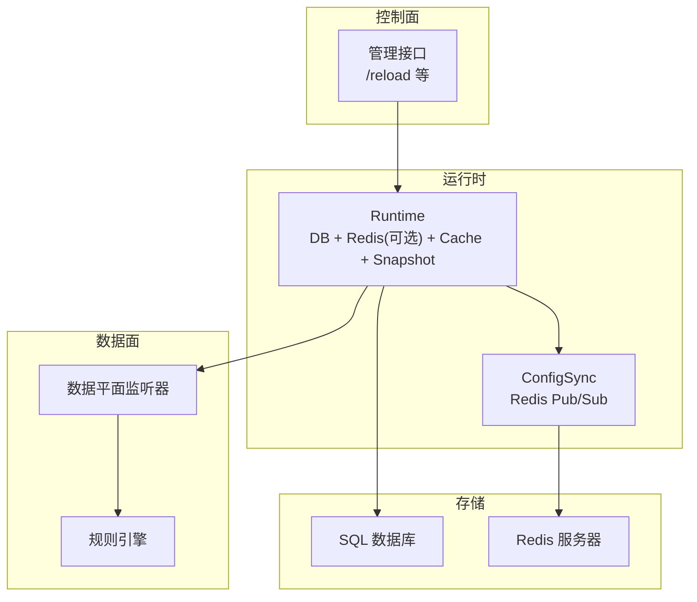
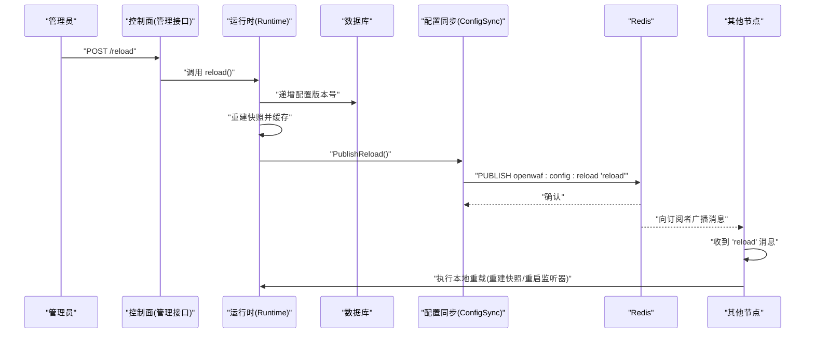
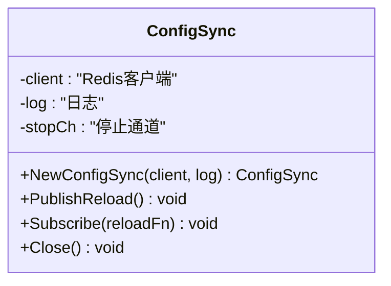
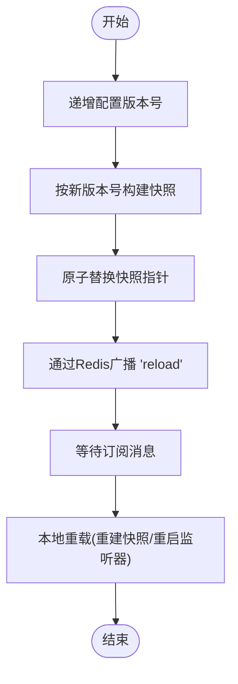
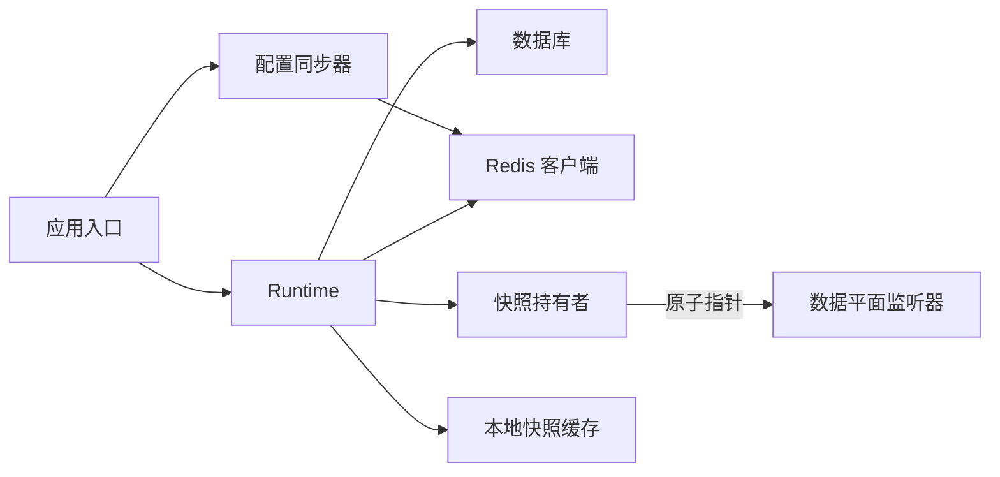
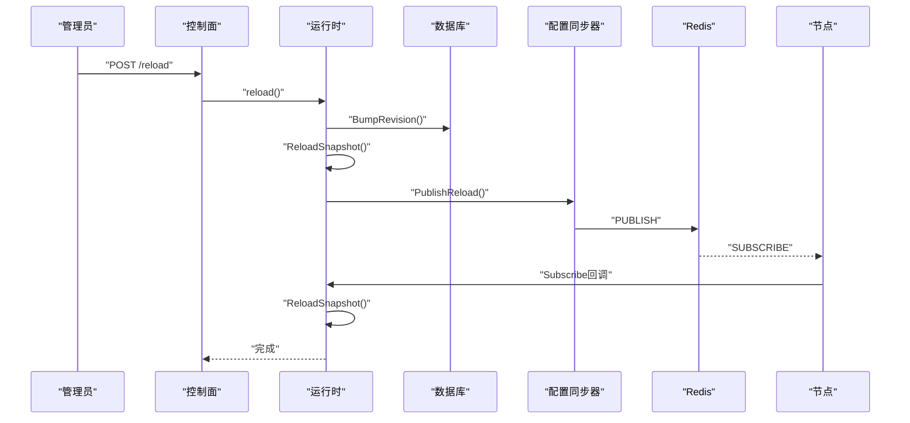

# 分布式同步机制

<cite>
**本文档引用的文件**
- [pubsub.go](file://internal/core/redis/pubsub.go)
- [redis.go](file://internal/core/redis/redis.go)
- [server.go](file://internal/app/server.go)
- [config.go](file://internal/core/config.go)
- [runtime.go](file://internal/core/runtime.go)
- [snapshot.go](file://internal/snapshot/snapshot.go)
- [lifecycle.go](file://internal/core/lifecycle/lifecycle.go)
- [metrics.go](file://internal/observability/metrics.go)
- [health.go](file://internal/core/health/health.go)
- [故障排除.md](file://docs/故障排除.md)
- [分布式同步机制.md](file://docs/配置管理系统/分布式同步机制.md)
</cite>

## 目录
1. [引言](#引言)
2. [项目结构](#项目结构)
3. [核心组件](#核心组件)
4. [架构总览](#架构总览)
5. [详细组件分析](#详细组件分析)
6. [依赖关系分析](#依赖关系分析)
7. [性能考虑](#性能考虑)
8. [故障排查指南](#故障排查指南)
9. [结论](#结论)
10. [附录](#附录)

## 引言
本文件系统性阐述 My-OpenWaf 的分布式同步机制，重点围绕 Redis Pub/Sub 通信协议在多节点间传播配置变更事件，以及与之配套的一致性保障、冲突解决策略、节点发现与连接管理、部署配置与网络拓扑设计、同步延迟监控与性能调优等主题。当前代码库实现了基于 Redis 的配置热重载同步：当管理员通过控制面修改配置时，触发数据库版本号递增与快照重建，并通过 Redis Pub/Sub 广播“reload”事件，其他节点订阅后执行相同的本地重载流程，从而实现跨节点的最终一致性。

## 项目结构
该系统采用分层架构：应用入口负责初始化运行时（数据库、可选 Redis、缓存层、快照持有者），业务引擎与数据平面监听器在运行时加载的快照驱动行为；控制面提供管理接口，写入数据库并触发同步；可观测性模块提供健康检查与指标导出。

图表来源
- [server.go:35-305](file://internal/app/server.go#L35-L305)
- [runtime.go:27-79](file://internal/core/runtime.go#L27-L79)
- [pubsub.go:13-77](file://internal/core/redis/pubsub.go#L13-L77)

章节来源
- [server.go:35-305](file://internal/app/server.go#L35-L305)
- [runtime.go:27-79](file://internal/core/runtime.go#L27-L79)

## 核心组件
- Redis Pub/Sub 配置同步器：封装发布/订阅逻辑，频道为固定字符串，消息体为预定义负载，用于通知节点重新加载配置。
- 运行时环境：负责从环境变量加载配置，打开数据库与可选 Redis 客户端，构建本地快照缓存与分布式 KV 缓存。
- 快照与原子切换：不可变快照对象通过原子指针进行切换，确保读路径无锁且一致。
- 生命周期管理：统一管理多个 Hertz 服务器实例的启动、停止与信号处理。
- 指标与健康检查：提供 /metrics 与 /healthz、/readyz 接口，便于监控与编排系统探测。

章节来源
- [pubsub.go:13-77](file://internal/core/redis/pubsub.go#L13-L77)
- [runtime.go:27-79](file://internal/core/runtime.go#L27-L79)
- [snapshot.go:52-105](file://internal/snapshot/snapshot.go#L52-L105)
- [lifecycle.go:30-178](file://internal/core/lifecycle/lifecycle.go#L30-L178)
- [metrics.go:13-126](file://internal/observability/metrics.go#L13-L126)
- [health.go:14-95](file://internal/core/health/health.go#L14-L95)

## 架构总览
下图展示了从控制面到数据面的完整同步链路：管理员调用 /reload 后，数据库版本号递增并重建快照，随后通过 Redis Pub/Sub 广播“reload”，其他节点收到事件后执行相同流程，最终所有节点的快照与监听器保持一致。

图表来源
- [server.go:220-260](file://internal/app/server.go#L220-L260)
- [pubsub.go:33-68](file://internal/core/redis/pubsub.go#L33-L68)

## 详细组件分析

### Redis Pub/Sub 通信协议
- 频道命名：固定使用频道名，避免动态频道导致的路由复杂度。
- 发布流程：带超时上下文发布消息，失败记录告警日志。
- 订阅流程：后台协程持续监听频道，收到特定负载后触发本地重载回调。
- 停止机制：通过关闭内部通道触发订阅者优雅退出并关闭连接。

图表来源
- [pubsub.go:15-31](file://internal/core/redis/pubsub.go#L15-L31)

章节来源
- [pubsub.go:13-77](file://internal/core/redis/pubsub.go#L13-L77)

### 一致性保证机制
- 版本号递增：每次配置变更先递增数据库中的配置版本号，作为后续快照构建的依据。
- 快照重建：根据最新版本号构建不可变快照，并通过原子指针替换，确保读路径一致性。
- 最终一致性模型：通过 Redis Pub/Sub 广播“reload”事件，其他节点在收到事件后执行本地重载，达到跨节点最终一致。
- 消息确认与重传：当前实现未显式实现消息确认与重传，发布侧仅记录失败日志；订阅侧依赖 Redis 的默认可靠性与网络重连能力。

图表来源
- [server.go:220-260](file://internal/app/server.go#L220-L260)
- [runtime.go:82-99](file://internal/core/runtime.go#L82-L99)
- [snapshot.go:98-105](file://internal/snapshot/snapshot.go#L98-L105)

章节来源
- [server.go:220-260](file://internal/app/server.go#L220-L260)
- [runtime.go:82-99](file://internal/core/runtime.go#L82-L99)
- [snapshot.go:52-105](file://internal/snapshot/snapshot.go#L52-L105)

### 冲突解决策略
- 时间戳比较：当前未实现基于时间戳的冲突检测与仲裁。
- 优先级仲裁：未实现基于优先级的仲裁机制。
- 合并算法：未实现配置合并算法，采用“最后写入获胜”的最终一致性模型。
- 建议：若未来需要更强的一致性，可在发布侧携带版本号或时间戳，在订阅侧比较并丢弃过期事件，或引入序列化队列以保证顺序。

章节来源
- [pubsub.go:33-68](file://internal/core/redis/pubsub.go#L33-L68)
- [server.go:220-260](file://internal/app/server.go#L220-L260)

### 节点发现与连接管理
- 集群成员管理：未实现节点主动注册/发现，依赖 Redis Pub/Sub 的广播特性实现事件分发。
- 故障检测：通过 Redis 客户端的 Ping 与超时控制进行基本可用性检测；未实现专门的节点心跳/失联检测。
- 自动重连：Redis 客户端具备内置重连能力，结合订阅循环可实现断线重连；发布侧失败仅记录日志，不进行重试。
- 建议：可引入节点元数据键空间与定期心跳，或在控制面维护节点列表，以增强可观测性与容错。

章节来源
- [redis.go:17-39](file://internal/core/redis/redis.go#L17-L39)
- [runtime.go:27-79](file://internal/core/runtime.go#L27-L79)
- [pubsub.go:47-68](file://internal/core/redis/pubsub.go#L47-L68)

### 分布式部署配置示例与网络拓扑
- Redis 地址配置：通过环境变量注入 Redis 地址、密码与数据库索引。
- 控制面绑定：通过环境变量设置管理接口监听地址。
- 网络拓扑建议：
  - 所有节点共享同一 Redis 实例或集群，确保 Pub/Sub 互通。
  - 控制面与数据面分离，控制面负责写入与广播，数据面负责读取快照与转发流量。
  - 使用负载均衡器将请求分发至各数据面节点，节点内按站点维度热启/重启监听器。

章节来源
- [config.go:74-102](file://internal/core/config.go#L74-L102)
- [config.go:113-182](file://internal/core/config.go#L113-L182)
- [server.go:267-284](file://internal/app/server.go#L267-L284)

### 同步延迟监控与性能调优
- 指标采集：提供 /metrics 接口输出请求总量、阻断次数、缓存命中/未命中、上游错误、运行时内存与 goroutine 数等指标。
- 健康检查：/healthz 返回存活状态，/readyz 返回就绪状态，/status 返回运行时信息与快照版本。
- 性能调优建议：
  - 调整 Redis 超时参数（连接、读、写）以适配网络环境。
  - 控制快照重建频率，避免频繁广播导致的抖动。
  - 在高并发场景下，确保 Redis 与数据库的资源充足，避免成为瓶颈。

章节来源
- [metrics.go:13-126](file://internal/observability/metrics.go#L13-L126)
- [health.go:14-95](file://internal/core/health/health.go#L14-L95)

## 依赖关系分析
- 运行时依赖 Redis 客户端与数据库，构建本地快照缓存与分布式 KV 缓存。
- 应用入口在启动时创建配置同步器，若 Redis 可用则启用 Pub/Sub 订阅。
- 快照为不可变对象，通过原子指针进行切换，读路径零锁。
- 生命周期管理器统一协调多个 Hertz 服务器的生命周期。

图表来源
- [runtime.go:27-79](file://internal/core/runtime.go#L27-L79)
- [server.go:127-131](file://internal/app/server.go#L127-L131)
- [snapshot.go:98-105](file://internal/snapshot/snapshot.go#L98-L105)

章节来源
- [runtime.go:27-79](file://internal/core/runtime.go#L27-L79)
- [server.go:127-131](file://internal/app/server.go#L127-L131)
- [snapshot.go:98-105](file://internal/snapshot/snapshot.go#L98-L105)

## 性能考虑
- Redis Pub/Sub：适合低频配置广播，高频事件建议评估内存与网络开销。
- 快照缓存：本地 ristretto 缓存提升重建效率，避免重复构建。
- 监听器热重载：按站点粒度重启监听器，减少停机窗口。
- 指标与健康检查：轻量级实现，便于集成 Prometheus 与容器编排系统。

## 故障排查指南
- Redis 不可用：运行时初始化阶段会进行 Ping 检查，失败会返回错误并关闭客户端；检查 Redis 地址、认证与网络连通性。
- Pub/Sub 不生效：确认 Redis 地址正确、频道名称一致；查看发布侧日志中"发布失败"的告警。
- 快照未更新：检查数据库版本号是否递增、本地快照缓存是否命中、快照指针是否成功替换。
- 监听器未重启：确认订阅回调是否执行、生命周期管理器是否正确注册与启动对应监听器。

章节来源
- [redis.go:32-39](file://internal/core/redis/redis.go#L32-L39)
- [pubsub.go:33-43](file://internal/core/redis/pubsub.go#L33-L43)
- [runtime.go:82-99](file://internal/core/runtime.go#L82-L99)
- [lifecycle.go:138-149](file://internal/core/lifecycle/lifecycle.go#L138-L149)

## 结论
My-OpenWaf 当前的分布式同步机制以 Redis Pub/Sub 为核心，通过"版本号递增 + 快照重建 + 广播通知"的组合实现跨节点的最终一致性。该方案简单可靠、易于部署，适合中小规模集群与低频配置变更场景。对于更高一致性需求或更复杂的冲突场景，可考虑引入版本仲裁、序列化队列或专用协调服务。

## 附录

### 关键流程时序图：控制面触发与节点响应

图表来源
- [server.go:220-260](file://internal/app/server.go#L220-L260)
- [pubsub.go:33-68](file://internal/core/redis/pubsub.go#L33-L68)

### Redis 连接配置与通道命名规范
- Redis 连接配置
  - 地址：MY_OPENWAF_REDIS_ADDR
  - 密码：MY_OPENWAF_REDIS_PASSWORD
  - 数据库索引：MY_OPENWAF_REDIS_DB
  - 超时参数：拨号超时 5s，读超时 3s，写超时 3s
- 通道命名规范
  - 固定频道名："openwaf:config:reload"
  - 通道格式：openwaf:config:reload
  - 消息负载：固定字符串 "reload"

章节来源
- [redis.go:17-39](file://internal/core/redis/redis.go#L17-L39)
- [pubsub.go:11](file://internal/core/redis/pubsub.go#L11)

### 消息格式与处理流程
- 发布消息格式
  - 频道：openwaf:config:reload
  - 负载：reload
  - 超时：2秒
- 订阅消息处理
  - 监听固定频道
  - 匹配负载为 "reload"
  - 执行本地重载回调
  - 错误记录并继续监听

章节来源
- [pubsub.go:33-68](file://internal/core/redis/pubsub.go#L33-L68)

### 环境变量配置模板
- 数据库配置
  - MY_OPENWAF_DB_DRIVER：sqlite | mysql | postgres
  - MY_OPENWAF_DSN：数据库连接串
  - MY_OPENWAF_DATA：数据目录
- Redis 配置
  - MY_OPENWAF_REDIS_ADDR：Redis 地址
  - MY_OPENWAF_REDIS_PASSWORD：Redis 密码
  - MY_OPENWAF_REDIS_DB：Redis 数据库索引
- 管理端配置
  - MY_OPENWAF_ADMIN_BIND：管理端绑定地址
  - MY_OPENWAF_ADMIN_STATIC_DIR：静态资源目录

章节来源
- [config.go:74-102](file://internal/core/config.go#L74-L102)
- [config.go:113-182](file://internal/core/config.go#L113-L182)