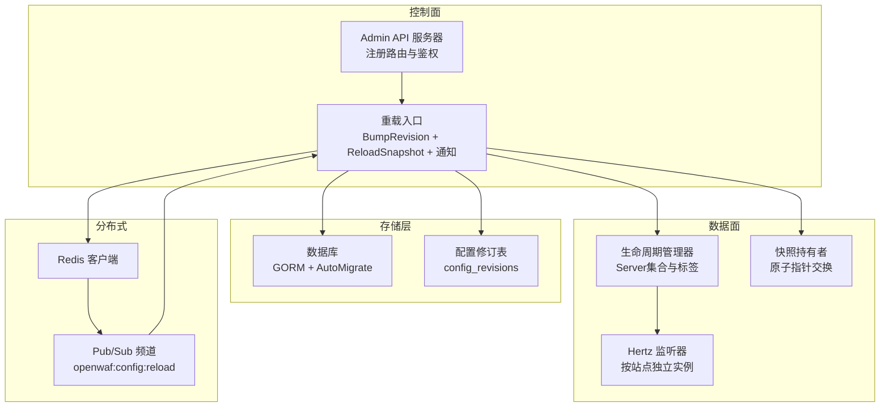
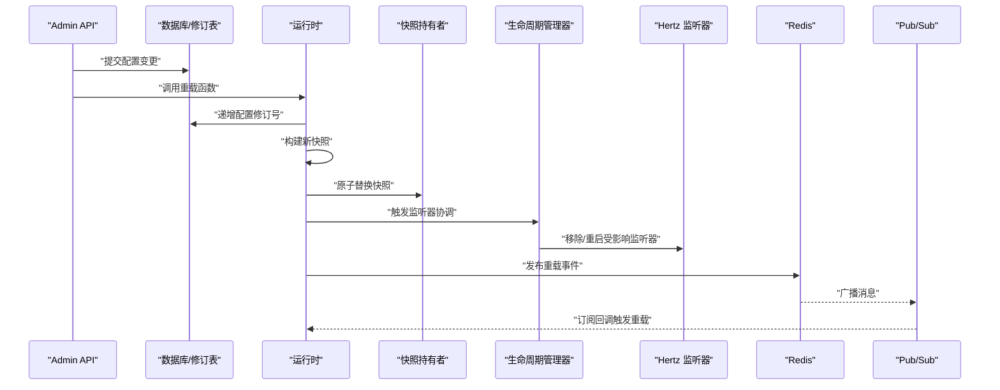
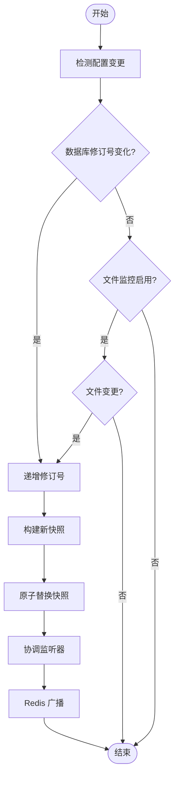
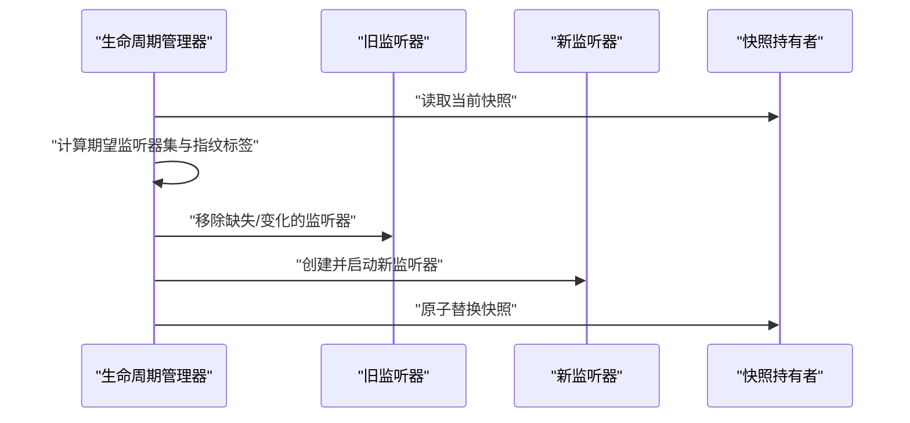
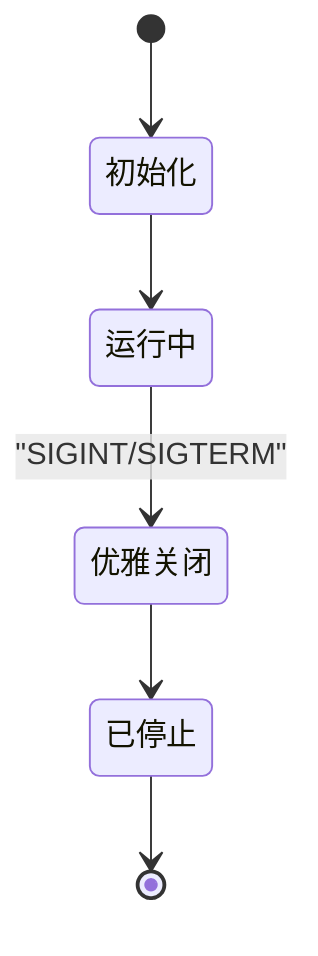
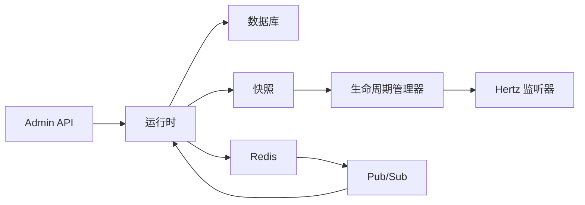

# 热重载系统

<cite>
**本文引用的文件**
- [cmd/main.go](file://cmd/main.go)
- [internal/app/server.go](file://internal/app/server.go)
- [internal/core/config.go](file://internal/core/config.go)
- [internal/core/config_validate.go](file://internal/core/config_validate.go)
- [internal/core/runtime.go](file://internal/core/runtime.go)
- [internal/core/lifecycle/lifecycle.go](file://internal/core/lifecycle/lifecycle.go)
- [internal/core/redis/pubsub.go](file://internal/core/redis/pubsub.go)
- [internal/snapshot/snapshot.go](file://internal/snapshot/snapshot.go)
- [internal/store/migrate.go](file://internal/store/migrate.go)
- [internal/store/migrations/v2_single_site.go](file://internal/store/migrations/v2_single_site.go)
- [CLAUDE.md](file://CLAUDE.md)
</cite>

## 目录
1. [简介](#简介)
2. [项目结构](#项目结构)
3. [核心组件](#核心组件)
4. [架构总览](#架构总览)
5. [详细组件分析](#详细组件分析)
6. [依赖分析](#依赖分析)
7. [性能考虑](#性能考虑)
8. [故障排除指南](#故障排除指南)
9. [结论](#结论)
10. [附录](#附录)

## 简介
本文件系统性阐述 My-OpenWaf 的热重载体系，覆盖配置变更检测机制（文件监控、数据库变更通知与 Redis Pub/Sub 事件）、平滑切换算法（新旧配置验证、服务状态检查与流量迁移策略）、回滚机制（错误检测、自动回滚触发与手动干预）、生命周期管理（启动顺序、优雅关闭与资源清理），并提供配置示例、性能影响分析与最佳实践建议。

## 项目结构
热重载相关能力由“控制面”（Admin API）与“数据面”（多站点监听器）协同完成：
- 控制面负责接收配置变更请求，触发重载流程并广播通知。
- 数据面根据快照（Snapshot）动态增删站点级监听器，实现按需重启与零停机切换。
- Redis Pub/Sub 用于跨节点同步配置变更，保证多实例一致性。

图表来源
- [internal/app/server.go:215-255](file://internal/app/server.go#L215-L255)
- [internal/core/runtime.go:82-99](file://internal/core/runtime.go#L82-L99)
- [internal/store/migrate.go:35-51](file://internal/store/migrate.go#L35-L51)
- [internal/core/redis/pubsub.go:33-68](file://internal/core/redis/pubsub.go#L33-L68)

章节来源
- [cmd/main.go:1-10](file://cmd/main.go#L1-L10)
- [CLAUDE.md:80-87](file://CLAUDE.md#L80-L87)

## 核心组件
- 配置与运行时
  - 配置加载与校验：从环境变量解析数据库、Redis、Admin 绑定等参数，并进行基本合法性检查。
  - 运行时初始化：打开数据库与可选 Redis，构建缓存层与快照持有者。
- 快照与原子切换
  - 快照构建：基于当前配置修订号从数据库构建不可变快照。
  - 原子替换：通过原子指针交换实现读路径零锁。
- 生命周期管理
  - 多服务器编排：统一注册、启动、优雅关闭与信号等待。
  - 配置漂移检测：为每个监听器生成指纹标签，变化时移除旧实例并启动新实例。
- 分布式通知
  - Redis Pub/Sub：发布/订阅配置重载事件，跨节点保持一致。

章节来源
- [internal/core/config.go:92-151](file://internal/core/config.go#L92-L151)
- [internal/core/config_validate.go:9-47](file://internal/core/config_validate.go#L9-L47)
- [internal/core/runtime.go:27-80](file://internal/core/runtime.go#L27-L80)
- [internal/snapshot/snapshot.go:52-105](file://internal/snapshot/snapshot.go#L52-L105)
- [internal/core/lifecycle/lifecycle.go:30-178](file://internal/core/lifecycle/lifecycle.go#L30-L178)
- [internal/core/redis/pubsub.go:13-77](file://internal/core/redis/pubsub.go#L13-L77)

## 架构总览
热重载以“控制面变更 → 数据面感知 → 快照重建 → 监听器热切换”的闭环实现：

图表来源
- [internal/app/server.go:215-255](file://internal/app/server.go#L215-L255)
- [internal/core/runtime.go:82-99](file://internal/core/runtime.go#L82-L99)
- [internal/store/migrate.go:35-51](file://internal/store/migrate.go#L35-L51)
- [internal/core/redis/pubsub.go:33-68](file://internal/core/redis/pubsub.go#L33-L68)

## 详细组件分析

### 配置变更检测机制
- 数据库变更通知
  - 通过递增配置修订号（config_revisions）作为变更信号，数据面轮询或订阅该值以触发重载。
  - 修订号持久化于数据库，确保进程重启后仍能正确识别最新版本。
- Redis Pub/Sub 事件处理
  - 发布端：重载成功后向频道发送“reload”消息。
  - 订阅端：后台协程监听频道，收到消息即触发本地重载流程。
  - 超时与容错：发布/订阅均设置超时，失败时记录告警但不影响主流程。
- 文件监控
  - 当前实现未见文件系统监控逻辑；如需支持文件驱动的配置变更，可在 Admin API 或外部工具侧扩展文件变更检测并触发重载。

图表来源
- [internal/store/migrate.go:35-51](file://internal/store/migrate.go#L35-L51)
- [internal/core/runtime.go:82-99](file://internal/core/runtime.go#L82-L99)
- [internal/core/redis/pubsub.go:33-68](file://internal/core/redis/pubsub.go#L33-L68)

章节来源
- [internal/store/migrate.go:35-51](file://internal/store/migrate.go#L35-L51)
- [internal/core/redis/pubsub.go:33-68](file://internal/core/redis/pubsub.go#L33-L68)

### 平滑切换算法
- 新旧配置验证
  - 配置加载阶段先进行合法性校验，避免无效配置进入运行时。
  - 快照构建阶段以修订号为粒度，确保同一修订号的重复构建命中本地缓存。
- 服务状态检查
  - 监听器协调函数遍历当前快照中的站点，计算每个站点监听器的指纹标签。
  - 若标签变化或实例缺失，则移除旧实例并启动新实例，保证只影响受影响站点。
- 流量迁移策略
  - 采用“按站点独立监听器”的设计，仅重启受影响的 Hertz 实例，避免全站中断。
  - 通过原子指针交换快照，读路径无锁，写路径仅在重载时短暂阻塞。

图表来源
- [internal/app/server.go:145-213](file://internal/app/server.go#L145-L213)
- [internal/snapshot/snapshot.go:98-105](file://internal/snapshot/snapshot.go#L98-L105)

章节来源
- [internal/app/server.go:145-213](file://internal/app/server.go#L145-L213)
- [internal/snapshot/snapshot.go:98-105](file://internal/snapshot/snapshot.go#L98-L105)

### 回滚机制实现
- 错误检测
  - 重载流程在每一步均返回错误，若任一步失败则终止本次重载。
  - Redis 广播发生在成功路径，失败时不发布消息，避免误导其他节点。
- 自动回滚触发
  - 当前实现未内置自动回滚到上一快照的逻辑；若需要，可在失败时恢复旧快照并重新广播。
- 手动干预选项
  - 通过 Admin API 触发重载，若出现异常，可暂停变更并修复问题后再次提交。
  - 建议在生产环境配合灰度发布与健康检查，降低风险。

章节来源
- [internal/app/server.go:215-255](file://internal/app/server.go#L215-L255)

### 生命周期管理
- 启动顺序
  - 初始化运行时（配置/DB/Redis/缓存/快照）→ 自动迁移与默认种子 → 构建初始快照 → 创建 WAF 引擎与限流器/信誉/GeoIP → 注册 Admin 路由 → 启动站点监听器 → 等待信号。
- 优雅关闭
  - 收到信号后，按超时上限逐个关闭各服务器，确保在窗口内释放资源。
- 资源清理
  - 关闭 Redis 客户端与底层 SQL 连接，释放缓存与快照持有的内存。

图表来源
- [internal/core/lifecycle/lifecycle.go:170-178](file://internal/core/lifecycle/lifecycle.go#L170-L178)
- [internal/core/runtime.go:113-127](file://internal/core/runtime.go#L113-L127)

章节来源
- [internal/core/lifecycle/lifecycle.go:30-178](file://internal/core/lifecycle/lifecycle.go#L30-L178)
- [internal/core/runtime.go:113-127](file://internal/core/runtime.go#L113-L127)

## 依赖分析
- 组件耦合
  - 控制面与数据面通过“修订号 + 快照 + Pub/Sub”解耦，变更传播低耦合、高可靠。
  - 监听器协调依赖快照与指纹标签，避免全局重启。
- 外部依赖
  - Redis 用于跨节点通知；Hertz 用于高性能监听；GORM 用于数据持久化；Ristretto 用于本地缓存。

图表来源
- [internal/app/server.go:215-255](file://internal/app/server.go#L215-L255)
- [internal/core/runtime.go:27-80](file://internal/core/runtime.go#L27-L80)
- [internal/core/redis/pubsub.go:13-77](file://internal/core/redis/pubsub.go#L13-L77)

章节来源
- [internal/app/server.go:215-255](file://internal/app/server.go#L215-L255)
- [internal/core/runtime.go:27-80](file://internal/core/runtime.go#L27-L80)
- [internal/core/redis/pubsub.go:13-77](file://internal/core/redis/pubsub.go#L13-L77)

## 性能考虑
- 快照与原子指针
  - 读路径零锁，写路径仅在重载时短暂阻塞，适合高并发场景。
- 本地缓存
  - 同修订号快照命中本地缓存，减少数据库与序列化开销。
- 监听器隔离
  - 按站点独立重启，避免全站重启带来的抖动。
- Redis 通知
  - 发布/订阅带超时，失败不阻塞主流程；建议在高吞吐场景下评估频道负载。

章节来源
- [internal/core/runtime.go:82-99](file://internal/core/runtime.go#L82-L99)
- [internal/snapshot/snapshot.go:98-105](file://internal/snapshot/snapshot.go#L98-L105)
- [internal/core/redis/pubsub.go:33-68](file://internal/core/redis/pubsub.go#L33-L68)

## 故障排除指南
- 重载失败
  - 检查数据库连接与权限，确认修订号表存在且可写。
  - 查看 Admin 日志与数据面日志，定位具体失败步骤。
- 监听器未生效
  - 确认监听器指纹标签是否变化；若未变化，可能因快照未更新或协调逻辑未触发。
  - 检查 Admin 绑定地址与防火墙策略。
- Redis 通知异常
  - 确认 Redis 地址与认证信息正确；查看发布/订阅超时与告警日志。
- 配置漂移导致频繁重启
  - 检查指纹标签生成逻辑，避免微小差异引发不必要的重启。

章节来源
- [internal/store/migrate.go:35-51](file://internal/store/migrate.go#L35-L51)
- [internal/app/server.go:145-213](file://internal/app/server.go#L145-L213)
- [internal/core/redis/pubsub.go:33-68](file://internal/core/redis/pubsub.go#L33-L68)

## 结论
本热重载系统通过“修订号 + 快照 + Pub/Sub + 独立监听器”的组合，在保证一致性的同时实现了最小化停机与高可用。建议在生产环境中结合健康检查、灰度发布与告警策略，进一步提升稳定性与可观测性。

## 附录

### 热重载配置示例
- 环境变量（示例）
  - MY_OPENWAF_DB_DRIVER=sqlite
  - MY_OPENWAF_DSN=./data/waf.db
  - MY_OPENWAF_ADMIN_BIND=:9443
  - MY_OPENWAF_REDIS_ADDR=127.0.0.1:6379
- Admin API 变更流程
  - 提交配置变更 → 调用重载接口 → 观察日志与指标 → 如异常回滚或修复后重试。

章节来源
- [CLAUDE.md:66-77](file://CLAUDE.md#L66-L77)
- [internal/app/server.go:268-278](file://internal/app/server.go#L268-L278)