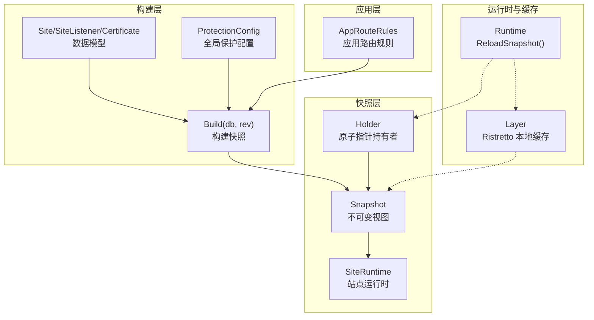
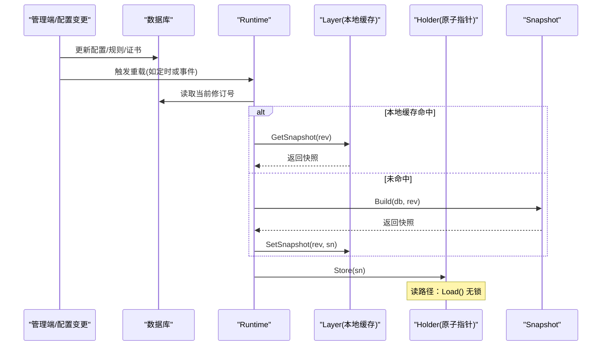
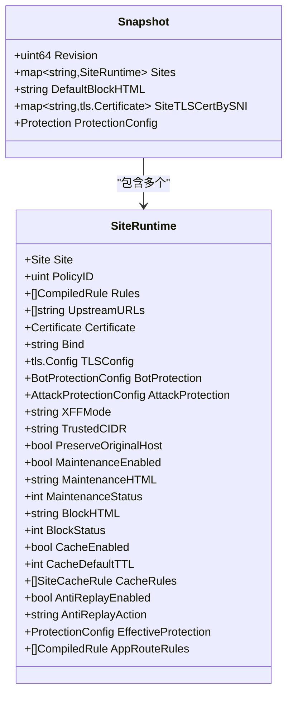
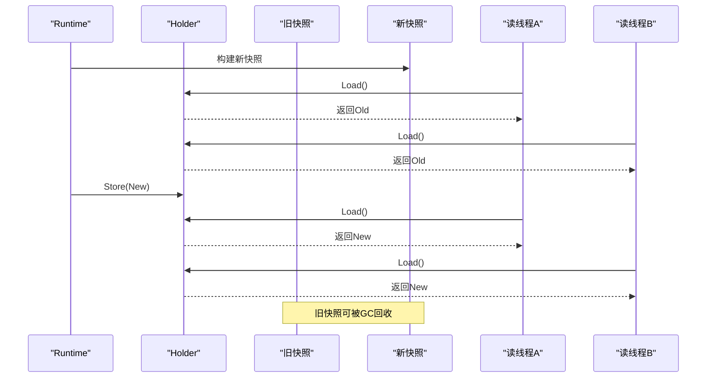
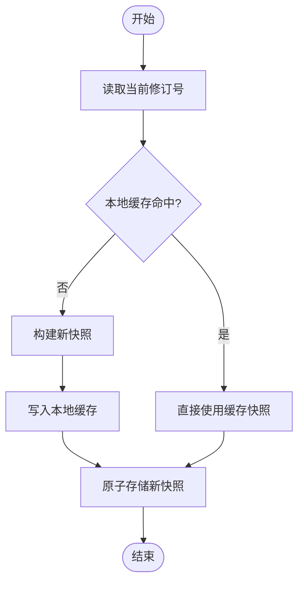
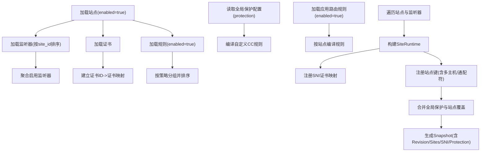
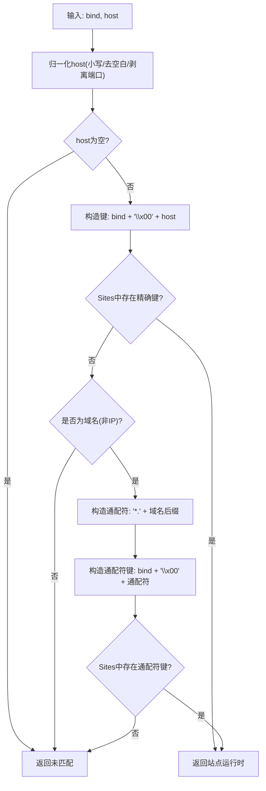
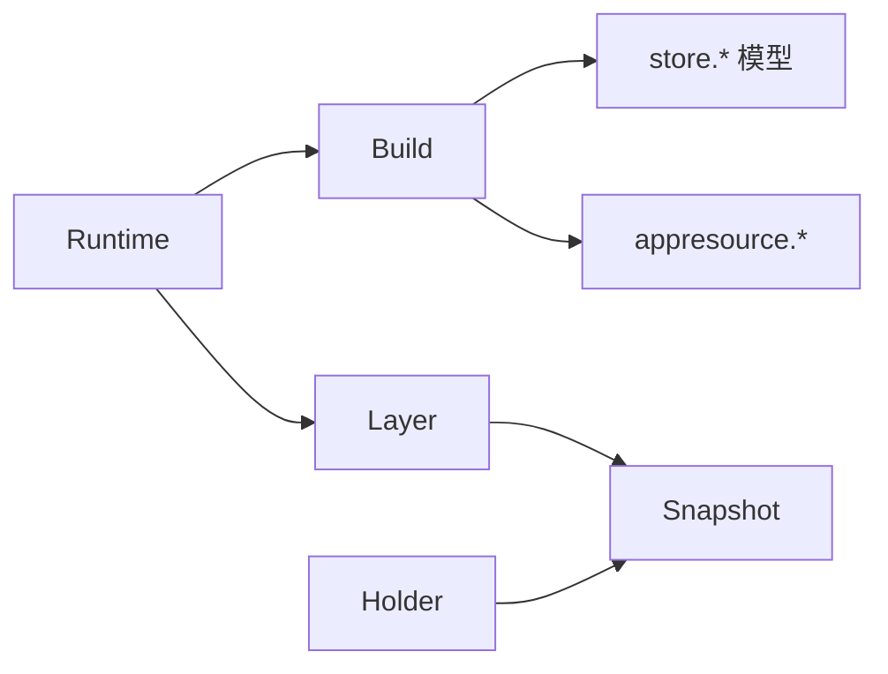

# 配置快照机制

> [返回 配置管理系统](配置管理系统.md)

<cite>
**本文引用的文件**
- [internal/snapshot/snapshot.go](file://internal/snapshot/snapshot.go)
- [internal/snapshot/build.go](file://internal/snapshot/build.go)
- [internal/snapshot/snapshot_test.go](file://internal/snapshot/snapshot_test.go)
- [internal/core/runtime.go](file://internal/core/runtime.go)
- [internal/cache/layer.go](file://internal/cache/layer.go)
- [internal/store/site.go](file://internal/store/site.go)
- [internal/store/certificate.go](file://internal/store/certificate.go)
- [internal/store/policy.go](file://internal/store/policy.go)
- [internal/appresource/material.go](file://internal/appresource/material.go)
- [docs/架构设计/快照模式实现.md](file://docs/架构设计/快照模式实现.md)
- [docs/缓存与性能优化/Ristretto 缓存实现.md](file://docs/缓存与性能优化/Ristretto 缓存实现.md)
</cite>

## 目录
1. [引言](#引言)
2. [项目结构](#项目结构)
3. [核心组件](#核心组件)
4. [架构总览](#架构总览)
5. [详细组件分析](#详细组件分析)
6. [依赖分析](#依赖分析)
7. [性能考量](#性能考量)
8. [故障排查指南](#故障排查指南)
9. [结论](#结论)
10. [附录](#附录)

## 引言
本文件系统化阐述 OpenWAF 的“配置快照机制”，重点覆盖以下方面：
- 不可变快照对象的设计与实现细节：结构体字段、站点运行时映射、SNI 证书映射、全局保护配置。
- 原子指针切换机制：如何通过原子操作实现零锁争用的读路径。
- 版本管理策略：配置修订号的作用与单调递增保证。
- 快照构建流程：从数据库加载到最终快照生成的完整步骤。
- 高并发场景下的性能优势与使用建议。

## 项目结构
围绕“配置快照”的关键模块与文件如下：
- 快照定义与读取：internal/snapshot/snapshot.go
- 快照构建：internal/snapshot/build.go
- 运行时与热重载：internal/core/runtime.go
- 本地快照缓存：internal/cache/layer.go
- 数据模型：internal/store/site.go、internal/store/certificate.go、internal/store/policy.go
- 应用路由规则材料：internal/appresource/material.go
- 文档参考：docs/架构设计/快照模式实现.md、docs/缓存与性能优化/Ristretto 缓存实现.md

图表来源
- [internal/snapshot/snapshot.go:72-84](file://internal/snapshot/snapshot.go#L72-L84)
- [internal/snapshot/build.go:17-210](file://internal/snapshot/build.go#L17-L210)
- [internal/core/runtime.go:82-99](file://internal/core/runtime.go#L82-L99)
- [internal/cache/layer.go:19-65](file://internal/cache/layer.go#L19-L65)

章节来源
- [internal/snapshot/snapshot.go:1-152](file://internal/snapshot/snapshot.go#L1-L152)
- [internal/snapshot/build.go:1-605](file://internal/snapshot/build.go#L1-L605)
- [internal/core/runtime.go:1-127](file://internal/core/runtime.go#L1-L127)
- [internal/cache/layer.go:1-65](file://internal/cache/layer.go#L1-L65)

## 核心组件
- 不可变快照 Snapshot：包含修订号、站点映射、默认封禁页 HTML、按 SNI 映射的证书、全局保护配置。
- 站点运行时 SiteRuntime：封装站点、策略、规则、上游地址、证书、转发设置、维护/封禁页、缓存规则、反重放、有效保护配置、应用路由规则等。
- 快照持有者 Holder：通过原子指针保存 Snapshot 指针，提供 Store/Load 方法，实现零锁争用的读路径。
- 构建器 Build：从数据库加载站点、监听器、证书、规则、应用路由规则、全局保护配置，组装 Snapshot。
- 运行时 Runtime：负责计算当前修订号、查询本地缓存、构建并存储快照。
- 本地缓存 Layer：基于 Ristretto 的进程内快照缓存，键格式为 “snapshot:<revision>”。

章节来源
- [internal/snapshot/snapshot.go:72-84](file://internal/snapshot/snapshot.go#L72-L84)
- [internal/snapshot/snapshot.go:25-70](file://internal/snapshot/snapshot.go#L25-L70)
- [internal/snapshot/snapshot.go:145-152](file://internal/snapshot/snapshot.go#L145-L152)
- [internal/snapshot/build.go:17-210](file://internal/snapshot/build.go#L17-L210)
- [internal/core/runtime.go:82-99](file://internal/core/runtime.go#L82-L99)
- [internal/cache/layer.go:19-65](file://internal/cache/layer.go#L19-L65)

## 架构总览
下图展示了快照机制在系统中的位置与交互：

图表来源
- [internal/core/runtime.go:82-99](file://internal/core/runtime.go#L82-L99)
- [internal/cache/layer.go:42-59](file://internal/cache/layer.go#L42-L59)
- [internal/snapshot/build.go:17-210](file://internal/snapshot/build.go#L17-L210)
- [internal/snapshot/snapshot.go:145-152](file://internal/snapshot/snapshot.go#L145-L152)

章节来源
- [docs/架构设计/快照模式实现.md:229-269](file://docs/架构设计/快照模式实现.md#L229-L269)
- [docs/缓存与性能优化/Ristretto 缓存实现.md:265-312](file://docs/缓存与性能优化/Ristretto 缓存实现.md#L265-L312)

## 详细组件分析

### 不可变快照对象与站点运行时映射
- Snapshot 字段
  - Revision：快照修订号，用于版本控制与缓存键。
  - Sites：站点键到 SiteRuntime 的映射，键由 bind 与规范化后的 host 组合而成。
  - DefaultBlockHTML：默认封禁页 HTML（当前快照中初始化为空）。
  - SiteTLSCertBySNI：按 SNI 映射的 TLS 证书，键格式包含 bind 与小写 host。
  - Protection：全局保护配置，作为默认保护基线。
- SiteRuntime 字段
  - Site：原始站点模型。
  - PolicyID、Rules：策略 ID 与编译后的规则列表。
  - UpstreamURLs：解析后的上游地址数组。
  - Certificate：站点证书（若存在）。
  - Bind/TLSConfig：监听绑定与 TLS 配置。
  - BotProtection/AttackProtection：机器人与攻击防护配置。
  - XFFMode/TrustedCIDR/PreserveOriginalHost：转发设置。
  - Maintenance*/BlockHTML/BlockStatus：站点级维护与封禁页。
  - CacheEnabled/CacheDefaultTTL/CacheRules：站点级响应缓存规则。
  - AntiReplayEnabled/Action：反重放开关与动作。
  - EffectiveProtection：站点级有效保护配置（合并全局与站点覆盖）。
  - AppRouteRules：按站点编译的应用路由规则。

图表来源
- [internal/snapshot/snapshot.go:72-84](file://internal/snapshot/snapshot.go#L72-L84)
- [internal/snapshot/snapshot.go:25-70](file://internal/snapshot/snapshot.go#L25-L70)

章节来源
- [internal/snapshot/snapshot.go:72-84](file://internal/snapshot/snapshot.go#L72-L84)
- [internal/snapshot/snapshot.go:25-70](file://internal/snapshot/snapshot.go#L25-L70)

### 原子指针切换机制与零锁争用读路径
- Holder 使用原子指针保存 Snapshot 指针，Store/Load 仅做指针级别的原子交换。
- 读路径：Resolver/Engine 通过 Load 获取当前快照，无需加锁；写路径：Runtime 构建新快照后 Store，旧快照交由 GC 回收。
- 切换为 O(1) 操作，保证读路径零争用、零阻塞，实现“零停机”切换。

图表来源
- [internal/snapshot/snapshot.go:145-152](file://internal/snapshot/snapshot.go#L145-L152)
- [docs/架构设计/快照模式实现.md:233-239](file://docs/架构设计/快照模式实现.md#L233-L239)

章节来源
- [internal/snapshot/snapshot.go:145-152](file://internal/snapshot/snapshot.go#L145-L152)
- [docs/架构设计/快照模式实现.md:229-269](file://docs/架构设计/快照模式实现.md#L229-L269)

### 版本管理策略：修订号与单调递增
- 当前修订号通过数据库表 config_revisions 的单行记录维护，首次不存在则创建。
- 修订号用于：
  - 本地快照缓存键：snapshot:<revision>，避免重复构建。
  - 快照版本标识：Snapshot.Revision。
- 保证策略：
  - 仅在成功构建后才 Store 新快照，确保读路径始终可见一致的快照。
  - 通过缓存命中优先策略，减少数据库与构建压力。

图表来源
- [internal/core/runtime.go:82-99](file://internal/core/runtime.go#L82-L99)
- [internal/cache/layer.go:42-59](file://internal/cache/layer.go#L42-L59)

章节来源
- [internal/core/runtime.go:101-111](file://internal/core/runtime.go#L101-L111)
- [internal/cache/layer.go:40-48](file://internal/cache/layer.go#L40-L48)

### 快照构建流程：从数据库到最终快照
- 步骤概览
  1) 读取启用的站点与监听器，按站点聚合启用的监听器。
  2) 读取全部证书，建立按 ID 的证书映射。
  3) 读取启用的规则，按策略分组并排序。
  4) 读取全局保护配置（SystemSettings 中的 protection 键），编译自定义 CC 规则。
  5) 读取应用路由规则并按站点编译。
  6) 遍历站点与监听器，构建 SiteRuntime：
     - 解析上游地址、编译规则、构建机器人/攻击防护配置、转发设置、缓存规则。
     - 若站点证书存在，生成 TLS 配置，并为每个主机名注册 SNI 证书映射。
     - 将站点注册到站点映射（支持多主机与通配符）。
  7) 合并全局保护配置与站点覆盖，得到每个站点的有效保护配置。
  8) 生成 Snapshot，包含修订号、站点映射、SNI 证书映射、全局保护配置。

图表来源
- [internal/snapshot/build.go:17-210](file://internal/snapshot/build.go#L17-L210)

章节来源
- [internal/snapshot/build.go:17-210](file://internal/snapshot/build.go#L17-L210)

### 站点匹配与键设计
- 站点键：bind + "\x00" + 小写且去空白的 host。
- SNI 键：固定前缀 + bind + "\x00" + 小写且去空白的 SNI。
- 匹配逻辑：
  1) 先尝试精确匹配 bind+host；
  2) 若非 IP 且 host 含点，则尝试通配符匹配（如 *.<domain>）；
  3) 未匹配返回 false。
- 归一化 host：小写、去空白、剥离端口（当端口为纯数字时）。

图表来源
- [internal/snapshot/snapshot.go:86-138](file://internal/snapshot/snapshot.go#L86-L138)

章节来源
- [internal/snapshot/snapshot.go:86-138](file://internal/snapshot/snapshot.go#L86-L138)

### SNI 证书映射与站点 TLS 配置
- 证书来源：站点监听器关联的证书 ID，若存在则加载证书并生成 tls.Certificate。
- TLS 配置：最小 TLS 版本、证书列表等。
- SNI 映射：为监听器 Host 字段中的每个主机名注册 SNI -> 证书映射，键包含 bind 与小写 host。

章节来源
- [internal/snapshot/build.go:146-164](file://internal/snapshot/build.go#L146-L164)
- [internal/store/certificate.go:9-19](file://internal/store/certificate.go#L9-L19)

### 全局保护配置与站点覆盖合并
- 全局保护配置来自 SystemSettings 的 protection 键，解析为 ProtectionConfig。
- 站点覆盖：站点字段（如 OWASPEnabled、OWASPSensitivity、CVEEnabled、RateLimit 等）叠加到全局配置上，nil 或 false 表示继承全局。
- 合并结果写入 SiteRuntime.EffectiveProtection，供引擎使用。

章节来源
- [internal/snapshot/build.go:594-604](file://internal/snapshot/build.go#L594-L604)
- [internal/snapshot/build.go:212-256](file://internal/snapshot/build.go#L212-L256)

### 应用路由规则与站点规则编译
- 应用路由规则：按站点加载并编译为运行时规则集，注入到 SiteRuntime.AppRouteRules。
- 规则编译：将规则 DSL 转换为轻量级 CompiledRule，包含 Kind/Arg/Action/Priority 等。

章节来源
- [internal/snapshot/build.go:68-78](file://internal/snapshot/build.go#L68-L78)
- [internal/snapshot/build.go:315-328](file://internal/snapshot/build.go#L315-L328)
- [internal/appresource/material.go:19-40](file://internal/appresource/material.go#L19-L40)

### 测试验证点
- 站点匹配：跨 bind 不应回退、多主机与通配符匹配正确、端口剥离与大小写不敏感。
- 注册键：重复键保留第一个站点、多主机注册正确。
- 自定义 CC 规则：启用标志、条件组合、复合规则、动作归一化。
- 上游地址解析：支持数组与逗号分隔两种格式。
- 缓存规则解析：前缀/后缀/包含/正则、大小写不敏感、路径标准化。

章节来源
- [internal/snapshot/snapshot_test.go:20-150](file://internal/snapshot/snapshot_test.go#L20-L150)
- [internal/snapshot/snapshot_test.go:152-290](file://internal/snapshot/snapshot_test.go#L152-L290)
- [internal/snapshot/snapshot_test.go:292-390](file://internal/snapshot/snapshot_test.go#L292-L390)

## 依赖分析
- 组件耦合
  - Build 依赖 store 模型（Site/SiteListener/Certificate/Rule/ProtectionConfig）、appresource（应用路由规则编译）。
  - Runtime 依赖数据库与缓存层，协调快照构建与原子存储。
  - Holder 仅依赖标准库原子包，保持极低耦合。
- 外部依赖
  - 数据库驱动（GORM）用于读取配置。
  - Ristretto 用于本地快照缓存。
  - 标准库 crypto/tls 用于证书加载与 TLS 配置。

图表来源
- [internal/snapshot/build.go:3-15](file://internal/snapshot/build.go#L3-L15)
- [internal/core/runtime.go:17-25](file://internal/core/runtime.go#L17-L25)
- [internal/cache/layer.go:10-17](file://internal/cache/layer.go#L10-L17)
- [internal/snapshot/snapshot.go:145-152](file://internal/snapshot/snapshot.go#L145-L152)

章节来源
- [internal/snapshot/build.go:3-15](file://internal/snapshot/build.go#L3-L15)
- [internal/core/runtime.go:17-25](file://internal/core/runtime.go#L17-L25)
- [internal/cache/layer.go:10-17](file://internal/cache/layer.go#L10-L17)

## 性能考量
- 不可变性与零锁读路径：快照不可变，读路径 Load() 无锁，适合高并发场景。
- 原子指针切换：O(1) 指针交换，无拷贝，零停机切换。
- 本地缓存：Ristretto 进程内缓存，按修订号键缓存，避免重复构建。
- 规则编译：预编译规则与应用路由规则，降低运行时匹配开销。
- 建议
  - 控制快照更新频率，利用修订号避免重复构建。
  - 合理设置 Ristretto 参数（NumCounters/MaxCost/BufferItems）以平衡内存与吞吐。
  - 将站点与监听器数量控制在合理范围，避免站点映射过大导致查找成本上升。

## 故障排查指南
- 快照未生效
  - 检查 Runtime.ReloadSnapshot 是否成功执行，确认修订号变化。
  - 查看本地缓存是否命中，必要时清空缓存后重试。
- 站点未匹配
  - 确认 host 是否包含端口，归一化逻辑会剥离纯数字端口。
  - 检查站点键是否正确注册（bind + "\x00" + host），注意大小写与空白。
- SNI 证书未加载
  - 确认站点监听器证书 ID 存在且证书/私钥有效。
  - 检查监听器 Host 字段是否包含目标主机名。
- 保护配置未生效
  - 确认 SystemSettings 中 protection 键存在且可解析。
  - 检查站点覆盖字段是否正确设置（nil/false 表示继承）。

章节来源
- [internal/core/runtime.go:82-99](file://internal/core/runtime.go#L82-L99)
- [internal/cache/layer.go:61-65](file://internal/cache/layer.go#L61-L65)
- [internal/snapshot/snapshot.go:86-138](file://internal/snapshot/snapshot.go#L86-L138)
- [internal/snapshot/build.go:146-164](file://internal/snapshot/build.go#L146-L164)
- [internal/snapshot/build.go:594-604](file://internal/snapshot/build.go#L594-L604)

## 结论
配置快照机制通过“不可变快照 + 原子指针切换 + 本地缓存”的组合，在 OpenWAF 中实现了高并发、低延迟、零停机的配置热重载。该机制以 Revision 为纽带串联起数据库、构建器、缓存与运行时，既保证了读路径的极致性能，又提供了灵活的站点与保护配置管理能力。

## 附录
- 关键数据模型
  - Site：站点配置（监听、TLS、转发、防护等）。
  - SiteListener：站点监听器。
  - Certificate：站点证书与私钥。
  - Rule/Policy：规则与策略。
- 应用路由规则材料
  - Material：用于应用路由匹配与记录的 HTTP 字段集合。

章节来源
- [internal/store/site.go:16-81](file://internal/store/site.go#L16-L81)
- [internal/store/site.go:109-123](file://internal/store/site.go#L109-L123)
- [internal/store/certificate.go:9-19](file://internal/store/certificate.go#L9-L19)
- [internal/store/policy.go:61-77](file://internal/store/policy.go#L61-L77)
- [internal/appresource/material.go:19-40](file://internal/appresource/material.go#L19-L40)