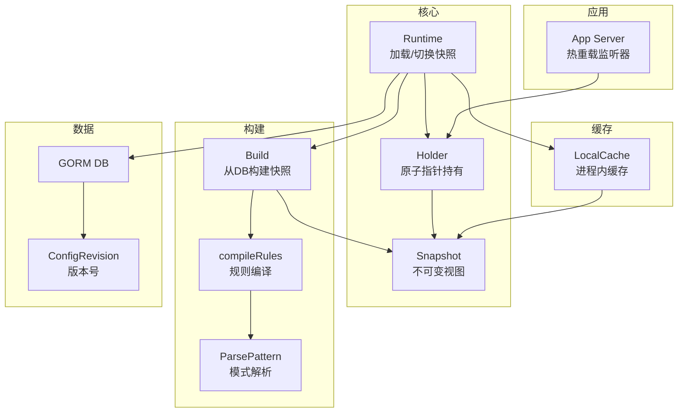
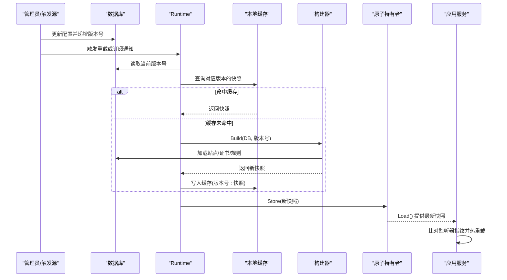
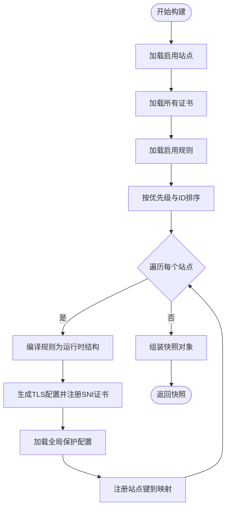
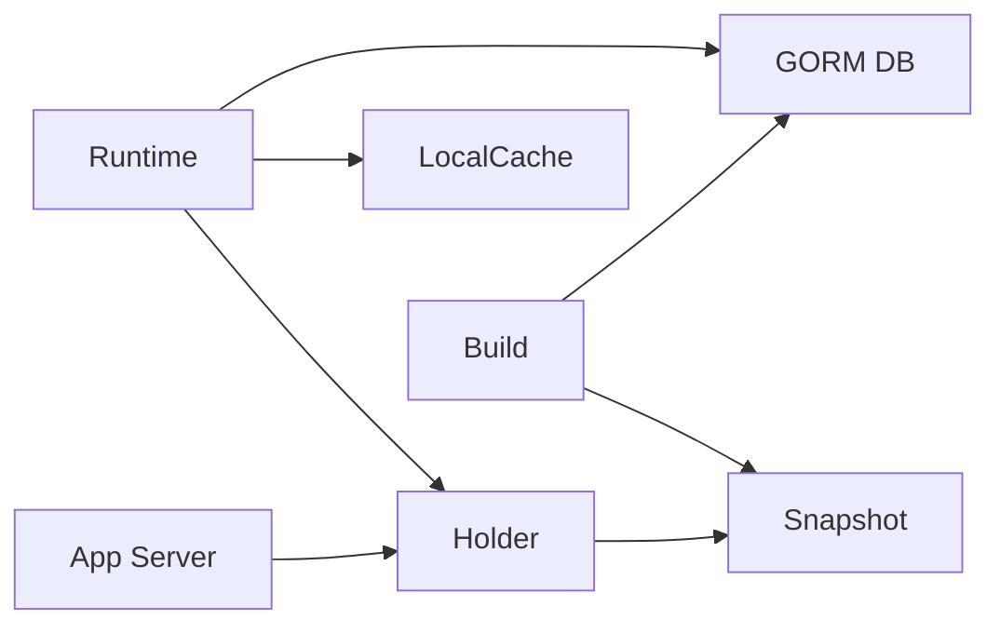

# 配置快照机制

<cite>
**本文引用的文件**
- [internal/snapshot/snapshot.go](file://internal/snapshot/snapshot.go)
- [internal/snapshot/build.go](file://internal/snapshot/build.go)
- [internal/cache/layer.go](file://internal/cache/layer.go)
- [internal/core/runtime.go](file://internal/core/runtime.go)
- [internal/app/server.go](file://internal/app/server.go)
- [internal/store/models.go](file://internal/store/models.go)
- [internal/store/migrate.go](file://internal/store/migrate.go)
- [internal/core/config.go](file://internal/core/config.go)
- [internal/cache/response_cache.go](file://internal/cache/response_cache.go)
</cite>

## 目录
1. [简介](#简介)
2. [项目结构](#项目结构)
3. [核心组件](#核心组件)
4. [架构总览](#架构总览)
5. [详细组件分析](#详细组件分析)
6. [依赖分析](#依赖分析)
7. [性能考量](#性能考量)
8. [故障排查指南](#故障排查指南)
9. [结论](#结论)
10. [附录](#附录)

## 简介
本文件系统性阐述 My-OpenWaf 的“配置快照机制”。该机制通过不可变配置对象与原子指针切换，实现零停机配置更新与平滑过渡；通过版本号（revision）与本地缓存，确保高并发下的安全一致性；通过数据库驱动的快照构建流程，完成从规则、站点、证书到保护策略的完整序列化与校验。

## 项目结构
围绕配置快照的关键模块分布如下：
- 快照定义与匹配：internal/snapshot/snapshot.go
- 快照构建与规则编译：internal/snapshot/build.go
- 进程内快照缓存：internal/cache/layer.go
- 运行时加载与原子切换：internal/core/runtime.go
- 应用启动与监听器热重载：internal/app/server.go
- 数据模型与版本控制：internal/store/models.go、internal/store/migrate.go
- 全局配置与默认值：internal/core/config.go
- 其他缓存参考：internal/cache/response_cache.go

图表来源
- [internal/core/runtime.go:82-99](file://internal/core/runtime.go#L82-L99)
- [internal/snapshot/build.go:14-143](file://internal/snapshot/build.go#L14-L143)
- [internal/snapshot/snapshot.go:52-105](file://internal/snapshot/snapshot.go#L52-L105)
- [internal/cache/layer.go:19-64](file://internal/cache/layer.go#L19-L64)
- [internal/store/migrate.go:35-51](file://internal/store/migrate.go#L35-L51)
- [internal/app/server.go:139-200](file://internal/app/server.go#L139-L200)

章节来源
- [internal/snapshot/snapshot.go:1-105](file://internal/snapshot/snapshot.go#L1-L105)
- [internal/snapshot/build.go:1-214](file://internal/snapshot/build.go#L1-L214)
- [internal/cache/layer.go:1-65](file://internal/cache/layer.go#L1-L65)
- [internal/core/runtime.go:17-127](file://internal/core/runtime.go#L17-L127)
- [internal/app/server.go:1-200](file://internal/app/server.go#L1-L200)
- [internal/store/models.go:237-393](file://internal/store/models.go#L237-L393)
- [internal/store/migrate.go:1-51](file://internal/store/migrate.go#L1-L51)

## 核心组件
- 不可变快照对象：包含站点映射、默认封禁页、按 SNI 的证书映射以及全局保护配置。该对象在构建完成后不再修改，保证读路径的线程安全与高性能。
- 原子持有者：通过原子指针保存当前快照，任何读取方均可无锁安全访问。
- 构建器：从数据库加载启用的站点、证书与规则，编译为轻量运行时规则，并生成快照。
- 进程内缓存：以版本号为键缓存快照，避免重复构建。
- 版本管理：通过配置修订表维护递增版本号，作为快照键与缓存键的一部分。

章节来源
- [internal/snapshot/snapshot.go:52-105](file://internal/snapshot/snapshot.go#L52-L105)
- [internal/snapshot/build.go:14-143](file://internal/snapshot/build.go#L14-L143)
- [internal/cache/layer.go:40-64](file://internal/cache/layer.go#L40-L64)
- [internal/store/migrate.go:35-51](file://internal/store/migrate.go#L35-L51)

## 架构总览
下图展示从数据库到快照再到应用的数据流与控制流：

图表来源
- [internal/core/runtime.go:82-99](file://internal/core/runtime.go#L82-L99)
- [internal/cache/layer.go:50-59](file://internal/cache/layer.go#L50-L59)
- [internal/snapshot/build.go:14-143](file://internal/snapshot/build.go#L14-L143)
- [internal/app/server.go:139-200](file://internal/app/server.go#L139-L200)

## 详细组件分析

### 不可变快照与内存布局
- 快照字段包含：版本号、站点映射、默认封禁页、按 SNI 的证书映射、全局保护配置。这些字段构成一个整体的只读视图，适合多 goroutine 并发读取。
- 站点运行时对象包含：站点元信息、策略 ID、编译后的规则列表、上游地址、证书、TLS 配置、防护策略、转发设置、维护与封禁页面等。这些字段均来自数据库的持久化结构，构建后保持不变。
- 匹配逻辑：提供基于绑定地址与 Host 的精确匹配、通配符匹配与回退匹配，确保路由决策稳定可靠。

章节来源
- [internal/snapshot/snapshot.go:52-105](file://internal/snapshot/snapshot.go#L52-L105)
- [internal/snapshot/snapshot.go:21-50](file://internal/snapshot/snapshot.go#L21-L50)
- [internal/snapshot/snapshot.go:74-96](file://internal/snapshot/snapshot.go#L74-L96)

### 原子指针切换机制
- 原子持有者封装了原子指针，提供 Store 与 Load 方法，用于零拷贝地切换当前快照。
- 切换过程是 O(1) 的指针替换，不涉及锁竞争，读取端无需同步即可获得一致视图。
- 与缓存配合：先查缓存命中再构建，避免重复构建；构建完成后写入缓存并原子切换，确保后续请求直接命中缓存。

章节来源
- [internal/snapshot/snapshot.go:98-105](file://internal/snapshot/snapshot.go#L98-L105)
- [internal/core/runtime.go:82-99](file://internal/core/runtime.go#L82-L99)
- [internal/cache/layer.go:42-48](file://internal/cache/layer.go#L42-L48)

### 版本管理策略
- 版本号来源：配置修订表记录当前版本号，每次触发重载时先递增版本号，再基于新版本号构建快照。
- 键设计：本地缓存键由固定前缀与版本号拼接而成，确保不同版本的快照互不冲突。
- 历史保留：当前实现仅保留最新版本的快照；如需历史回滚，可在上层增加额外的版本索引与清理策略。

章节来源
- [internal/store/migrate.go:35-51](file://internal/store/migrate.go#L35-L51)
- [internal/cache/layer.go:40-48](file://internal/cache/layer.go#L40-L48)
- [internal/store/models.go:237-242](file://internal/store/models.go#L237-L242)

### 快照构建过程
- 数据加载：查询启用的站点、全部证书、启用的规则，并按策略分组排序。
- 规则编译：将规则 DSL 解析为轻量运行时结构，包含阶段、动作、优先级与参数。
- TLS 处理：根据站点证书生成 TLS 配置，并注册 SNI 证书映射。
- 保护配置：从系统设置中加载全局保护配置（如限流、OWASP 敏感度、自动封禁等）。
- 完整性检查：构建过程中对空上游地址进行过滤，对无效证书进行跳过处理，保证快照可用性。

图表来源
- [internal/snapshot/build.go:14-143](file://internal/snapshot/build.go#L14-L143)
- [internal/snapshot/build.go:165-201](file://internal/snapshot/build.go#L165-L201)

章节来源
- [internal/snapshot/build.go:14-143](file://internal/snapshot/build.go#L14-L143)
- [internal/snapshot/build.go:165-201](file://internal/snapshot/build.go#L165-L201)

### API 使用示例（路径指引）
- 创建/刷新快照
  - 触发重载：调用运行时重载方法，内部会先读取当前版本号，再尝试从缓存获取，若未命中则构建新快照并写入缓存，最后原子切换。
  - 参考路径：[internal/core/runtime.go:82-99](file://internal/core/runtime.go#L82-L99)
- 查询当前快照
  - 读取当前快照：通过原子持有者加载最新快照，随后可进行站点匹配与路由决策。
  - 参考路径：[internal/snapshot/snapshot.go:103-105](file://internal/snapshot/snapshot.go#L103-L105)
- 销毁/失效缓存
  - 清空本地缓存：清空整个本地快照缓存，强制后续请求重新构建。
  - 参考路径：[internal/cache/layer.go:61-64](file://internal/cache/layer.go#L61-L64)

章节来源
- [internal/core/runtime.go:82-99](file://internal/core/runtime.go#L82-L99)
- [internal/snapshot/snapshot.go:103-105](file://internal/snapshot/snapshot.go#L103-L105)
- [internal/cache/layer.go:61-64](file://internal/cache/layer.go#L61-L64)

### 与应用层的集成
- 启动阶段：初始化运行时、自动迁移、种子数据、首次构建并加载快照。
- 热重载：当收到配置变更通知或手动触发时，递增版本号、构建新快照、切换并热重载数据平面监听器。
- 监听器重建：根据快照中的站点信息与指纹对比，动态增删或重启监听器，确保配置变更即时生效。

章节来源
- [internal/app/server.go:33-120](file://internal/app/server.go#L33-L120)
- [internal/app/server.go:139-200](file://internal/app/server.go#L139-L200)
- [internal/app/server.go:203-225](file://internal/app/server.go#L203-L225)

## 依赖分析
- 组件耦合
  - Runtime 依赖数据库、本地缓存与快照持有者，负责版本号读取与原子切换。
  - 快照构建器依赖数据库与规则解析工具，输出不可变快照。
  - 应用层依赖快照持有者进行路由与监听器管理。
- 外部依赖
  - 数据库：GORM 访问站点、证书、规则与系统设置。
  - 缓存：Ristretto 提供进程内键值缓存。
  - TLS：标准库证书处理与配置。

图表来源
- [internal/core/runtime.go:17-80](file://internal/core/runtime.go#L17-L80)
- [internal/cache/layer.go:19-38](file://internal/cache/layer.go#L19-L38)
- [internal/snapshot/build.go:14-143](file://internal/snapshot/build.go#L14-L143)
- [internal/app/server.go:124-131](file://internal/app/server.go#L124-L131)

章节来源
- [internal/core/runtime.go:17-80](file://internal/core/runtime.go#L17-L80)
- [internal/cache/layer.go:19-38](file://internal/cache/layer.go#L19-L38)
- [internal/snapshot/build.go:14-143](file://internal/snapshot/build.go#L14-L143)
- [internal/app/server.go:124-131](file://internal/app/server.go#L124-L131)

## 性能考量
- 读路径优化
  - 不可变快照与原子指针切换避免锁竞争，读取开销极低。
  - 本地缓存命中后直接返回，避免数据库与构建开销。
- 写路径优化
  - 构建过程批量加载与排序，减少多次往返。
  - 规则编译采用轻量结构，降低内存占用。
- 缓存策略
  - 进程内缓存使用 Ristretto，具备高效的键值存储与淘汰策略。
  - 建议结合业务流量特征调整缓存容量与计数器规模。
- 其他参考
  - 响应缓存（非快照）采用分片与后台清理，可作为缓存治理参考。

章节来源
- [internal/cache/layer.go:27-38](file://internal/cache/layer.go#L27-L38)
- [internal/cache/response_cache.go:25-54](file://internal/cache/response_cache.go#L25-L54)
- [internal/cache/response_cache.go:142-162](file://internal/cache/response_cache.go#L142-L162)

## 故障排查指南
- 快照构建失败
  - 检查数据库连接与权限，确认站点、证书与规则表存在且可读。
  - 关注构建器中的错误返回路径，定位具体加载阶段。
  - 参考路径：[internal/snapshot/build.go:14-143](file://internal/snapshot/build.go#L14-L143)
- 版本号异常
  - 确认配置修订表存在且可 FirstOrCreate 成功，必要时手动初始化。
  - 参考路径：[internal/store/migrate.go:35-51](file://internal/store/migrate.go#L35-L51)
- 监听器未热重载
  - 检查应用层的监听器重建逻辑是否执行，确认指纹比较与标签更新正确。
  - 参考路径：[internal/app/server.go:139-200](file://internal/app/server.go#L139-L200)
- 缓存未命中
  - 确认版本号是否递增，缓存键格式是否一致，以及缓存是否被意外清空。
  - 参考路径：[internal/cache/layer.go:40-64](file://internal/cache/layer.go#L40-L64)

章节来源
- [internal/snapshot/build.go:14-143](file://internal/snapshot/build.go#L14-L143)
- [internal/store/migrate.go:35-51](file://internal/store/migrate.go#L35-L51)
- [internal/app/server.go:139-200](file://internal/app/server.go#L139-L200)
- [internal/cache/layer.go:40-64](file://internal/cache/layer.go#L40-L64)

## 结论
该配置快照机制通过“不可变对象 + 原子指针 + 版本号 + 本地缓存”的组合，实现了高可用、零停机的配置更新与平滑过渡。构建流程严谨，覆盖站点、证书、规则与保护策略，满足生产环境对一致性与性能的要求。建议在生产环境中结合监控与告警，持续观察缓存命中率与构建耗时，以进一步优化性能与稳定性。

## 附录
- 全局配置项与默认值
  - 参考路径：[internal/core/config.go:56-78](file://internal/core/config.go#L56-L78)
- 数据模型与保护配置
  - 参考路径：[internal/store/models.go:93-147](file://internal/store/models.go#L93-L147)
  - 参考路径：[internal/store/models.go:244-313](file://internal/store/models.go#L244-L313)