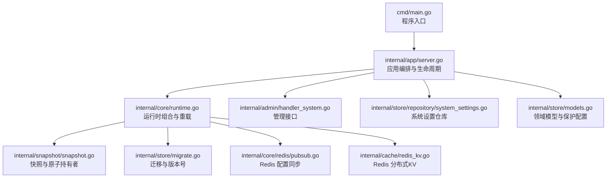
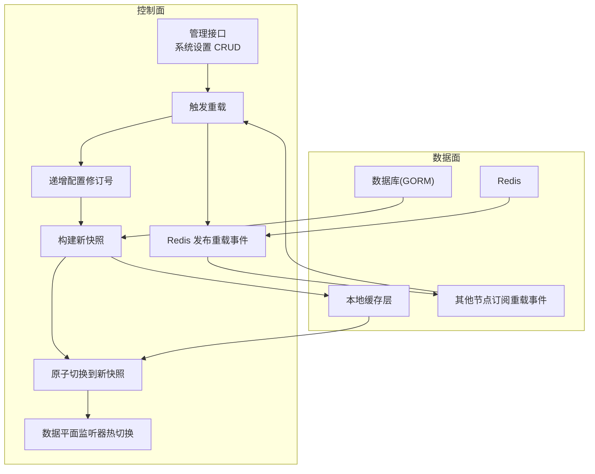
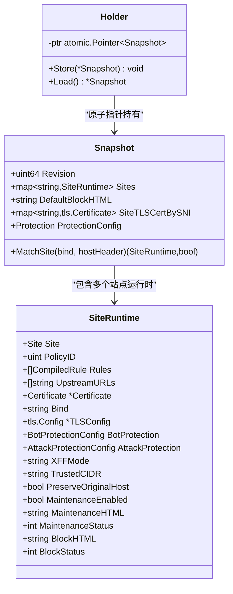
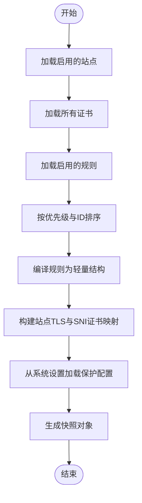
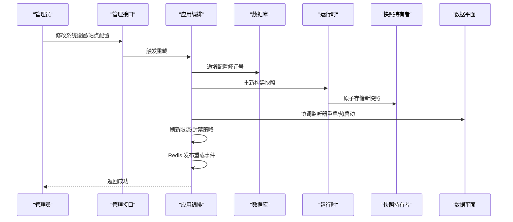
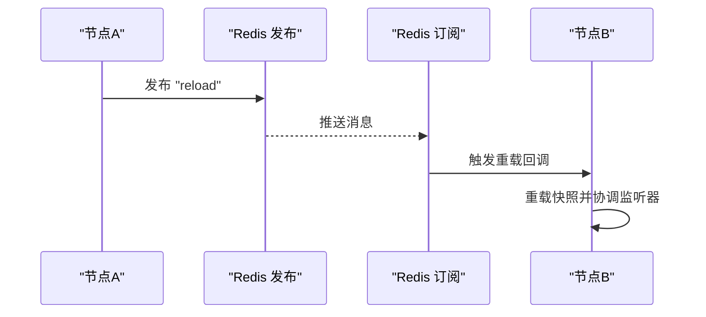
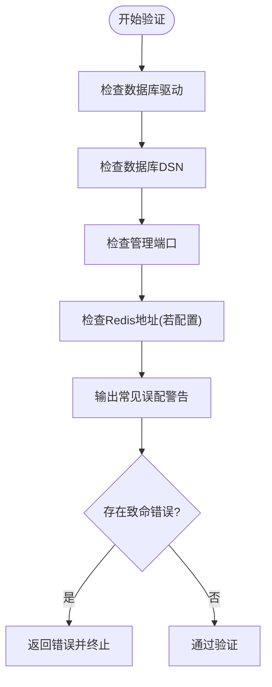
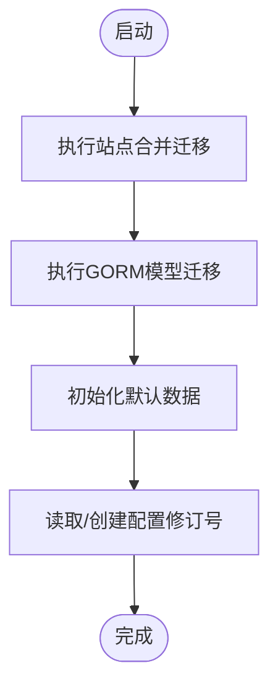
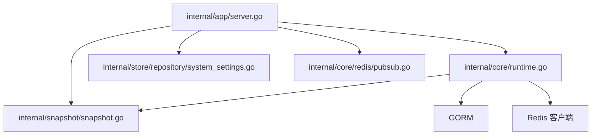

# 配置管理系统

<cite>
**本文档引用的文件**
- [cmd/main.go](file://cmd/main.go)
- [internal/app/server.go](file://internal/app/server.go)
- [internal/core/config.go](file://internal/core/config.go)
- [internal/core/config_validate.go](file://internal/core/config_validate.go)
- [internal/core/runtime.go](file://internal/core/runtime.go)
- [internal/core/redis/pubsub.go](file://internal/core/redis/pubsub.go)
- [internal/cache/redis_kv.go](file://internal/cache/redis_kv.go)
- [internal/cache/response_cache.go](file://internal/cache/response_cache.go)
- [internal/snapshot/snapshot.go](file://internal/snapshot/snapshot.go)
- [internal/snapshot/build.go](file://internal/snapshot/build.go)
- [internal/store/models.go](file://internal/store/models.go)
- [internal/store/migrate.go](file://internal/store/migrate.go)
- [internal/store/migrations/v2_single_site.go](file://internal/store/migrations/v2_single_site.go)
- [internal/store/repository/system_settings.go](file://internal/store/repository/system_settings.go)
- [internal/admin/handler_system.go](file://internal/admin/handler_system.go)
</cite>

## 目录
1. [简介](#简介)
2. [项目结构](#项目结构)
3. [核心组件](#核心组件)
4. [架构总览](#架构总览)
5. [详细组件分析](#详细组件分析)
6. [依赖分析](#依赖分析)
7. [性能考虑](#性能考虑)
8. [故障排除指南](#故障排除指南)
9. [结论](#结论)
10. [附录](#附录)

## 简介
本文件为 My-OpenWaf 配置管理系统的综合技术文档，围绕以下主题展开：配置快照机制（不可变对象、原子指针切换、版本管理）、热重载实现（变更检测、平滑切换与回滚策略）、分布式同步（Redis Pub/Sub 通信、一致性与冲突解决）、配置验证体系（数据格式与业务规则校验）、迁移管理（数据库迁移、配置升级与向后兼容）、配置模板与最佳实践、以及备份、恢复与故障排除方法。文档面向不同层次读者，既提供高层架构视图，也包含代码级细节与可视化图表。

## 项目结构
系统采用分层与功能模块化组织方式：
- 入口与应用编排：cmd/main.go 调用 internal/app/server.go 启动服务，负责运行时初始化、监听器协调、热重载与分布式同步。
- 核心配置与运行时：internal/core 提供配置加载、验证、运行时组合（DB、Redis、缓存、快照持有者）。
- 快照与数据平面：internal/snapshot 定义不可变快照与构建逻辑；internal/app/server.go 将快照用于数据平面监听器的热启动与重启。
- 存储与迁移：internal/store 定义领域模型、系统设置、保护配置等，并提供自动迁移与版本号管理。
- 缓存与分布式共享状态：internal/cache 提供本地响应缓存与 Redis 分布式键值缓存。
- Redis 配置同步：internal/core/redis/pubsub.go 实现跨节点配置重载通知。
- 管理控制面：internal/admin 提供系统设置的增删改查与触发重载的接口。

**图表来源**
- [cmd/main.go:1-10](file://cmd/main.go#L1-L10)
- [internal/app/server.go:1-465](file://internal/app/server.go#L1-L465)
- [internal/core/runtime.go:1-127](file://internal/core/runtime.go#L1-L127)
- [internal/snapshot/snapshot.go:1-105](file://internal/snapshot/snapshot.go#L1-L105)
- [internal/store/migrate.go:1-49](file://internal/store/migrate.go#L1-L49)
- [internal/core/redis/pubsub.go:1-77](file://internal/core/redis/pubsub.go#L1-L77)
- [internal/cache/redis_kv.go:1-113](file://internal/cache/redis_kv.go#L1-L113)
- [internal/admin/handler_system.go:1-162](file://internal/admin/handler_system.go#L1-L162)
- [internal/store/repository/system_settings.go:1-44](file://internal/store/repository/system_settings.go#L1-L44)
- [internal/store/models.go:1-350](file://internal/store/models.go#L1-L350)

**章节来源**
- [cmd/main.go:1-10](file://cmd/main.go#L1-L10)
- [internal/app/server.go:33-280](file://internal/app/server.go#L33-L280)

## 核心组件
- 配置对象与环境变量解析：从环境变量读取数据库驱动、DSN、数据目录、Redis 连接参数、管理端绑定地址等，提供默认值与路径推导。
- 配置验证：在启动前进行驱动类型、DSN、管理端口、Redis 地址等合法性检查，并输出常见误配警告。
- 运行时组合：封装 DB、Redis、缓存层、快照持有者，提供重载快照能力。
- 快照与原子持有：不可变快照对象，通过原子指针进行安全切换；支持站点匹配、SNI 证书映射与全局保护配置。
- 系统设置与保护配置：以 JSON 形式存储在 SystemSettings 中，提供默认值与规范化处理。
- 自动迁移与版本号：先执行站点合并迁移，再进行 GORM 模型迁移；维护配置修订号，作为快照版本依据。
- Redis 分布式同步：发布/订阅通道通知其他节点重载配置，实现跨节点一致性。
- 管理接口：提供系统设置的查询、创建、更新、删除与触发重载的 API。

**章节来源**
- [internal/core/config.go:1-67](file://internal/core/config.go#L1-L67)
- [internal/core/config_validate.go:1-48](file://internal/core/config_validate.go#L1-L48)
- [internal/core/runtime.go:17-127](file://internal/core/runtime.go#L17-L127)
- [internal/snapshot/snapshot.go:52-105](file://internal/snapshot/snapshot.go#L52-L105)
- [internal/store/models.go:149-350](file://internal/store/models.go#L149-L350)
- [internal/store/migrate.go:9-49](file://internal/store/migrate.go#L9-L49)
- [internal/core/redis/pubsub.go:13-77](file://internal/core/redis/pubsub.go#L13-L77)
- [internal/admin/handler_system.go:12-162](file://internal/admin/handler_system.go#L12-L162)

## 架构总览
系统采用“快照驱动 + 原子切换 + 热重载 + 分布式同步”的设计：
- 数据源：数据库（GORM）承载站点、规则、系统设置等配置。
- 快照构建：从数据库构建不可变快照，包含站点运行时信息、SNI 证书映射与全局保护配置。
- 原子切换：通过原子指针在进程内安全切换快照，确保读路径零锁争用。
- 热重载：管理员修改系统设置或站点配置后，递增配置修订号，重建快照，热切换并协调数据平面监听器；同时通过 Redis 发布重载事件，其他节点同步重载。
- 缓存与共享：本地响应缓存提升读性能；Redis 分布式 KV 支持跨节点共享状态（非快照序列化）。

**图表来源**
- [internal/app/server.go:203-243](file://internal/app/server.go#L203-L243)
- [internal/core/runtime.go:82-111](file://internal/core/runtime.go#L82-L111)
- [internal/core/redis/pubsub.go:33-68](file://internal/core/redis/pubsub.go#L33-L68)
- [internal/store/migrate.go:32-48](file://internal/store/migrate.go#L32-L48)

## 详细组件分析

### 配置快照机制
- 不可变配置对象：快照为不可变结构，包含站点映射、默认阻断页、按 SNI 的证书映射与全局保护配置。
- 原子指针切换：通过原子指针保存当前快照，读路径直接加载，写路径仅在重载时替换，避免锁竞争。
- 版本管理：使用数据库中的配置修订号作为快照版本，重载时先递增再构建新快照，确保版本单调递增。

**图表来源**
- [internal/snapshot/snapshot.go:52-105](file://internal/snapshot/snapshot.go#L52-L105)
- [internal/snapshot/snapshot.go:21-50](file://internal/snapshot/snapshot.go#L21-L50)

**章节来源**
- [internal/snapshot/snapshot.go:52-105](file://internal/snapshot/snapshot.go#L52-L105)
- [internal/snapshot/build.go:14-143](file://internal/snapshot/build.go#L14-L143)

### 快照构建流程
- 从数据库加载启用的站点与证书，构建站点运行时对象。
- 加载启用的规则并按策略分组排序，编译为轻量规则。
- 解析上游 URL 列表，构建 TLS 配置与 SNI 证书映射。
- 从系统设置加载全局保护配置，生成快照对象。

**图表来源**
- [internal/snapshot/build.go:14-143](file://internal/snapshot/build.go#L14-L143)

**章节来源**
- [internal/snapshot/build.go:14-143](file://internal/snapshot/build.go#L14-L143)

### 热重载实现机制
- 变更检测：管理员通过管理接口修改系统设置或站点配置后，调用重载函数。
- 平滑切换：重载函数先递增配置修订号，再构建新快照，最后原子切换；同时刷新速率限制器、IP 黑名单/白名单与自动封禁策略，并协调数据平面监听器。
- 回滚策略：当前实现未提供显式回滚；可通过降低修订号并重载旧快照的方式实现“回退”（需谨慎操作）。

**图表来源**
- [internal/admin/handler_system.go:28-91](file://internal/admin/handler_system.go#L28-L91)
- [internal/app/server.go:203-243](file://internal/app/server.go#L203-L243)
- [internal/core/runtime.go:82-111](file://internal/core/runtime.go#L82-L111)

**章节来源**
- [internal/admin/handler_system.go:28-91](file://internal/admin/handler_system.go#L28-L91)
- [internal/app/server.go:203-243](file://internal/app/server.go#L203-L243)
- [internal/core/runtime.go:82-111](file://internal/core/runtime.go#L82-L111)

### 分布式同步机制
- Redis Pub/Sub 通信：发布/订阅通道 openwaf:config:reload 用于通知其他节点重载配置。
- 一致性保证：通过配置修订号与原子快照切换，确保节点间最终一致；重载事件仅触发“重载”，不传输快照内容。
- 冲突解决：当前实现未检测或处理并发重载冲突；建议在上层控制面增加幂等与去重策略（如基于时间戳或事件序号）。

**图表来源**
- [internal/core/redis/pubsub.go:33-68](file://internal/core/redis/pubsub.go#L33-L68)
- [internal/app/server.go:227-243](file://internal/app/server.go#L227-L243)

**章节来源**
- [internal/core/redis/pubsub.go:13-77](file://internal/core/redis/pubsub.go#L13-L77)
- [internal/app/server.go:227-243](file://internal/app/server.go#L227-L243)

### 配置验证系统
- 数据格式验证：检查数据库驱动是否为 sqlite/mysql/postgres；校验数据库 DSN 非空；校验管理端口与 Redis 地址格式。
- 业务规则检查：对常见误配给出警告（如 SQLite 驱动却使用 MySQL DSN 字符串、绑定知名端口等）。
- 错误处理：致命错误直接阻止启动；警告记录日志但允许继续。

**图表来源**
- [internal/core/config_validate.go:11-47](file://internal/core/config_validate.go#L11-L47)

**章节来源**
- [internal/core/config_validate.go:9-48](file://internal/core/config_validate.go#L9-L48)

### 迁移管理机制
- 数据库迁移：先执行站点合并迁移（将 Listener 与 ForwardingProfile 合并入 Site），再进行 GORM 模型迁移。
- 配置升级：通过维护配置修订号，确保每次变更都有唯一版本；重载时读取最新修订号构建快照。
- 向后兼容：模型字段与动作值提供兼容映射（如动作 block/log_only 映射为 intercept/observe），保证历史数据可用。

**图表来源**
- [internal/store/migrate.go:9-30](file://internal/store/migrate.go#L9-L30)
- [internal/store/migrations/v2_single_site.go:16-49](file://internal/store/migrations/v2_single_site.go#L16-L49)

**章节来源**
- [internal/store/migrate.go:9-49](file://internal/store/migrate.go#L9-L49)
- [internal/store/migrations/v2_single_site.go:10-189](file://internal/store/migrations/v2_single_site.go#L10-L189)
- [internal/store/models.go:66-76](file://internal/store/models.go#L66-L76)

### 配置模板与最佳实践
- 环境变量模板
  - 数据库：MY_OPENWAF_DB_DRIVER、MY_OPENWAF_DB 或 MY_OPENWAF_DSN、MY_OPENWAF_DATA
  - Redis：MY_OPENWAF_REDIS_ADDR、MY_OPENWAF_REDIS_PASSWORD、MY_OPENWAF_REDIS_DB
  - 管理端：MY_OPENWAF_ADMIN_BIND、MY_OPENWAF_ADMIN_STATIC_DIR
  - JWT 密钥：MY_OPENWAF_JWT_SECRET（可选）
- 最佳实践
  - 使用独立的非标准端口暴露管理端，避免与业务端口冲突。
  - 在生产中为 Redis 配置密码与最小权限 DB。
  - 通过管理接口进行配置变更，触发重载后再发布到其他节点。
  - 对关键系统设置（如保护配置）变更前先在测试环境验证。

**章节来源**
- [internal/core/config.go:31-66](file://internal/core/config.go#L31-L66)
- [internal/core/config_validate.go:25-46](file://internal/core/config_validate.go#L25-L46)

### 备份、恢复与故障排除
- 备份
  - 数据库备份：根据所选驱动（sqlite/mysql/postgres）执行相应备份策略。
  - 快照版本：利用配置修订号作为版本标识，便于回溯。
- 恢复
  - 数据库恢复后，确保迁移脚本已执行；必要时手动调整修订号并重载。
- 故障排除
  - 启动失败：检查配置验证输出的警告与错误，修正驱动、DSN、端口与 Redis 地址。
  - 重载失败：查看重载回调日志，确认数据库连接、迁移与快照构建过程。
  - 分布式不同步：检查 Redis 连接与 Pub/Sub 通道，确认发布/订阅两端均正常。

**章节来源**
- [internal/core/config_validate.go:11-47](file://internal/core/config_validate.go#L11-L47)
- [internal/core/redis/pubsub.go:33-68](file://internal/core/redis/pubsub.go#L33-L68)
- [internal/store/migrate.go:32-48](file://internal/store/migrate.go#L32-L48)

## 依赖分析
- 组件耦合
  - 应用编排依赖运行时、快照、仓库与 Redis 同步模块。
  - 快照构建依赖数据库与系统设置。
  - 管理接口依赖仓库与重载回调。
- 外部依赖
  - GORM 用于数据库访问与迁移。
  - Redis 客户端用于分布式 KV 与 Pub/Sub。
  - Hertz 用于数据平面监听器与管理接口。

**图表来源**
- [internal/app/server.go:18-31](file://internal/app/server.go#L18-L31)
- [internal/core/runtime.go:17-25](file://internal/core/runtime.go#L17-L25)

**章节来源**
- [internal/app/server.go:18-31](file://internal/app/server.go#L18-L31)
- [internal/core/runtime.go:17-25](file://internal/core/runtime.go#L17-L25)

## 性能考虑
- 快照不可变与原子切换：读路径零锁争用，适合高并发场景。
- 本地响应缓存：减少重复上游请求，降低延迟与带宽消耗。
- Redis 分布式 KV：适用于跨节点共享状态（非快照序列化），避免重复序列化与网络开销。
- 监听器热启动：按站点粒度启动/重启，避免全量重启带来的停机窗口。

[本节为通用性能讨论，无需特定文件来源]

## 故障排除指南
- 启动阶段
  - 配置验证失败：修正驱动、DSN、端口与 Redis 地址。
  - 数据库迁移失败：检查迁移脚本与权限，确保目标数据库可达。
- 运行阶段
  - 重载失败：查看重载回调日志，定位数据库或快照构建问题。
  - 分布式不同步：确认 Redis 连通性与订阅通道，排查发布/订阅异常。
- 监控与可观测性
  - 使用健康检查与指标端点，结合日志定位问题根因。

**章节来源**
- [internal/core/config_validate.go:11-47](file://internal/core/config_validate.go#L11-L47)
- [internal/app/server.go:203-243](file://internal/app/server.go#L203-L243)
- [internal/core/redis/pubsub.go:33-68](file://internal/core/redis/pubsub.go#L33-L68)

## 结论
本配置管理系统通过“不可变快照 + 原子切换 + 热重载 + 分布式同步”的架构，在保证高并发读取性能的同时，实现了配置变更的平滑过渡与跨节点一致性。配合完善的验证、迁移与监控机制，系统具备良好的可运维性与扩展性。建议在生产环境中进一步增强分布式冲突处理与回滚能力，并持续完善配置模板与最佳实践文档。

## 附录
- 关键模型与配置
  - 系统设置与保护配置：以 JSON 存储在 SystemSettings 中，提供默认值与规范化处理。
  - 领域模型：站点、规则、策略、证书、系统设置等，支持自动迁移与版本管理。
- 快速参考
  - 环境变量：数据库驱动与 DSN、Redis 参数、管理端绑定、JWT 密钥等。
  - 管理接口：系统设置 CRUD 与触发重载。

**章节来源**
- [internal/store/models.go:149-350](file://internal/store/models.go#L149-L350)
- [internal/store/repository/system_settings.go:15-43](file://internal/store/repository/system_settings.go#L15-L43)
- [internal/core/config.go:31-66](file://internal/core/config.go#L31-L66)