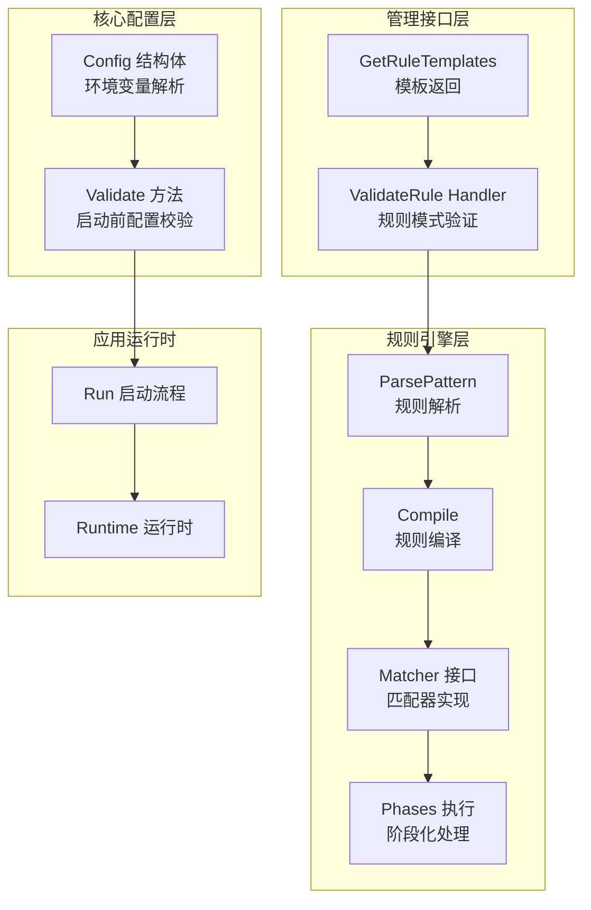
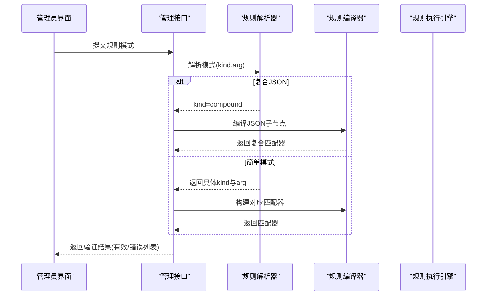
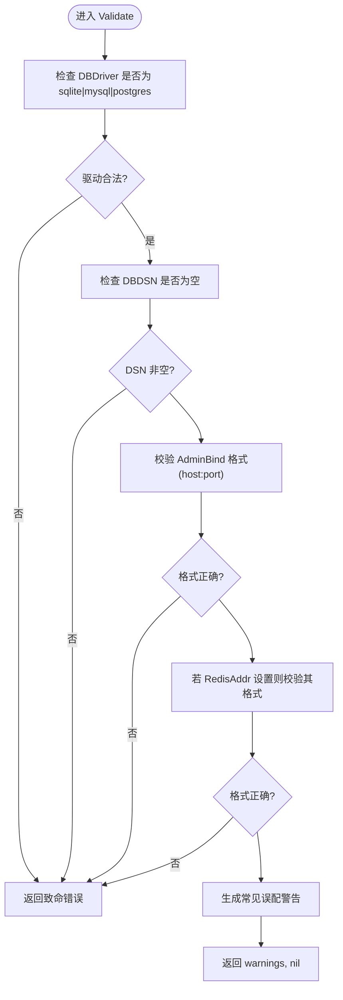
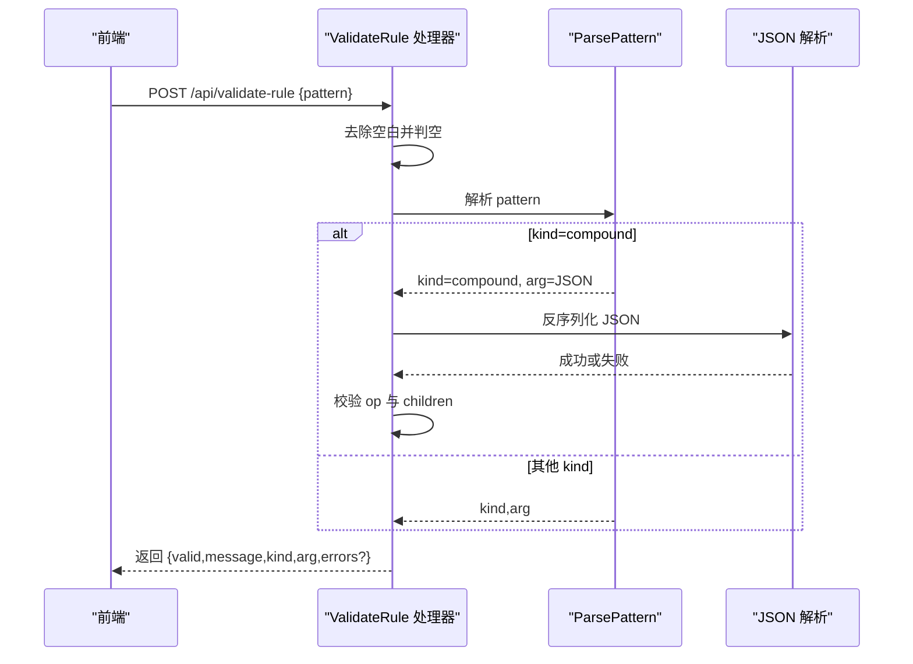
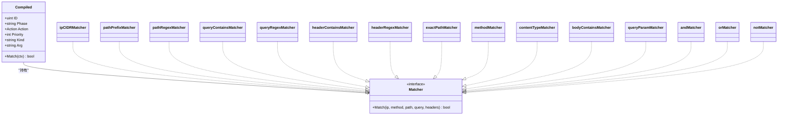
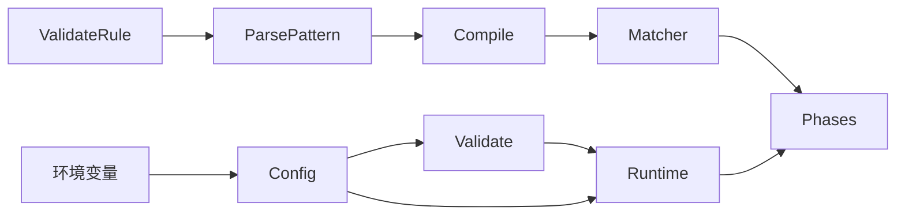

# 配置验证系统

<cite>
**本文档引用的文件**
- [config_validate.go](file://internal/core/config_validate.go)
- [config_validate_test.go](file://internal/core/config_validate_test.go)
- [config.go](file://internal/core/config.go)
- [handler_rule_validate.go](file://internal/admin/handler_rule_validate.go)
- [compiler.go](file://internal/core/rules/compiler.go)
- [matcher.go](file://internal/core/rules/matcher.go)
- [phases.go](file://internal/core/rules/phases.go)
- [errors.go](file://internal/pkg/errors/errors.go)
- [server.go](file://internal/app/server.go)
- [runtime.go](file://internal/core/runtime.go)
- [api.ts](file://frontend/lib/api.ts)
- [crud-page.tsx](file://frontend/components/crud-page.tsx)
</cite>

## 目录
1. [简介](#简介)
2. [项目结构](#项目结构)
3. [核心组件](#核心组件)
4. [架构总览](#架构总览)
5. [详细组件分析](#详细组件分析)
6. [依赖关系分析](#依赖关系分析)
7. [性能考虑](#性能考虑)
8. [故障排除指南](#故障排除指南)
9. [结论](#结论)
10. [附录](#附录)

## 简介
本文件系统性地梳理了 My-OpenWaf 的配置验证体系，覆盖以下方面：
- 数据格式验证规则：字段类型检查、长度限制、格式匹配
- 业务规则验证逻辑：依赖关系检查、约束条件验证、互斥规则处理
- 错误处理机制：验证失败响应、错误分类与用户友好提示
- 验证器设计模式：可扩展验证规则、自定义验证器与批量验证
- 实际示例与常见场景：数据库驱动、监听地址、规则模式等
- 性能优化与调试技巧：正则缓存、编译期预处理、日志与监控

该系统在启动前对核心配置进行严格校验，并在运行时对规则模式进行即时验证，确保系统安全、稳定与可维护。

## 项目结构
围绕配置验证的核心模块分布如下：
- 核心配置与验证：internal/core/config.go、internal/core/config_validate.go
- 规则编译与匹配：internal/core/rules/compiler.go、internal/core/rules/matcher.go、internal/core/rules/phases.go
- 规则验证接口：internal/admin/handler_rule_validate.go
- 错误类型与通用错误处理：internal/pkg/errors/errors.go
- 应用启动与运行时：internal/app/server.go、internal/core/runtime.go
- 前端调用与错误展示：frontend/lib/api.ts、frontend/components/crud-page.tsx

图表来源
- [config.go:75-102](file://internal/core/config.go#L75-L102)
- [config_validate.go:9-47](file://internal/core/config_validate.go#L9-L47)
- [compiler.go:27-55](file://internal/core/rules/compiler.go#L27-L55)
- [matcher.go:167-261](file://internal/core/rules/matcher.go#L167-L261)
- [phases.go:34-94](file://internal/core/rules/phases.go#L34-L94)
- [handler_rule_validate.go:32-98](file://internal/admin/handler_rule_validate.go#L32-L98)
- [server.go:35-305](file://internal/app/server.go#L35-L305)

章节来源
- [config.go:75-102](file://internal/core/config.go#L75-L102)
- [config_validate.go:9-47](file://internal/core/config_validate.go#L9-L47)
- [compiler.go:27-55](file://internal/core/rules/compiler.go#L27-L55)
- [matcher.go:167-261](file://internal/core/rules/matcher.go#L167-L261)
- [phases.go:34-94](file://internal/core/rules/phases.go#L34-L94)
- [handler_rule_validate.go:32-98](file://internal/admin/handler_rule_validate.go#L32-L98)
- [server.go:35-305](file://internal/app/server.go#L35-L305)

## 核心组件
本节聚焦于配置验证系统的关键构件及其职责。

- 配置结构与默认值
  - Config 定义了数据库驱动、DSN、数据目录、Redis、管理绑定地址、CVE/Bot/Drop 等配置项，并提供从环境变量加载的工厂函数。
  - 默认配置通过 DefaultBotConfig、DefaultDropConfig 提供生产可用的合理缺省值。

- 启动前配置验证
  - Validate 对数据库驱动、DSN、管理绑定地址、Redis 地址进行格式与合法性检查；对常见误配给出非致命警告（如 SQLite 与 MySQL DSN 混用、绑定到 80/443）。

- 规则模式验证
  - ValidateRule 处理前端提交的规则模式，支持简单前缀模式与复合 JSON 条件；对空模式、无效格式、JSON 结构与运算符进行校验，并返回结构化的验证结果。

- 规则编译与匹配
  - ParsePattern 将字符串规则解析为 kind 与 arg；Compile 将持久化规则转换为排序后的编译后规则；Matcher 接口及其实现完成具体匹配逻辑；Phases 将规则按阶段执行。

- 错误类型与处理
  - 内置错误常量与 ValidationError 类型用于统一错误表达；前端 API 层对 401/403/429 等状态码进行统一处理与用户提示。

章节来源
- [config.go:75-102](file://internal/core/config.go#L75-L102)
- [config_validate.go:9-47](file://internal/core/config_validate.go#L9-L47)
- [handler_rule_validate.go:13-98](file://internal/admin/handler_rule_validate.go#L13-L98)
- [compiler.go:27-82](file://internal/core/rules/compiler.go#L27-L82)
- [matcher.go:11-261](file://internal/core/rules/matcher.go#L11-L261)
- [phases.go:34-94](file://internal/core/rules/phases.go#L34-L94)
- [errors.go:5-26](file://internal/pkg/errors/errors.go#L5-L26)

## 架构总览
配置验证贯穿“启动前”和“运行时”两个阶段：
- 启动前：Validate 在应用启动前对核心配置进行严格校验，避免因配置错误导致运行失败。
- 运行时：ValidateRule 在管理接口中即时校验规则模式，确保规则合法且可被编译执行。
- 编译期：ParsePattern/Compile 将规则转换为高性能的 Matcher 列表，提升匹配效率。
- 执行期：Phases 按阶段顺序执行规则，结合缓存与限流策略保障性能。

图表来源
- [handler_rule_validate.go:32-98](file://internal/admin/handler_rule_validate.go#L32-L98)
- [compiler.go:57-82](file://internal/core/rules/compiler.go#L57-L82)
- [matcher.go:167-261](file://internal/core/rules/matcher.go#L167-L261)

## 详细组件分析

### 启动前配置验证（Config.Validate）
- 字段类型检查
  - 数据库驱动必须为 sqlite/mysql/postgres 之一。
  - 管理绑定地址必须符合 host:port 格式。
  - Redis 地址若设置，同样要求 host:port 格式。
- 长度限制与格式匹配
  - DSN 必须非空。
  - 使用 net.SplitHostPort 进行地址格式校验。
- 业务规则与互斥
  - 当驱动为 sqlite 且 DSN 看起来像 MySQL/Postgres 的 DSN 时，发出警告。
  - 绑定到 80 或 443 时发出安全警告。
- 错误处理
  - 非致命警告通过返回值 warnings 聚合；致命错误直接返回。
  - 测试覆盖了多种非法输入与边界情况。

图表来源
- [config_validate.go:9-47](file://internal/core/config_validate.go#L9-L47)

章节来源
- [config_validate.go:9-47](file://internal/core/config_validate.go#L9-L47)
- [config_validate_test.go:5-101](file://internal/core/config_validate_test.go#L5-L101)

### 规则模式验证（ValidateRule）
- 输入与输出
  - 请求体包含 pattern 字段；响应体包含 valid、message、kind、arg、errors 等字段。
- 校验流程
  - 去除空白字符后判断是否为空。
  - 调用 ParsePattern 获取 kind 与 arg。
  - 若 kind 为 compound，则尝试解析 JSON 并校验结构（op 必须为 and/or/not，children 必须存在）。
  - 返回结构化结果，便于前端展示。
- 互斥与约束
  - 仅当复合规则满足结构约束时才视为有效；否则返回错误列表。

图表来源
- [handler_rule_validate.go:32-98](file://internal/admin/handler_rule_validate.go#L32-L98)
- [compiler.go:57-82](file://internal/core/rules/compiler.go#L57-L82)

章节来源
- [handler_rule_validate.go:13-98](file://internal/admin/handler_rule_validate.go#L13-L98)

### 规则编译与匹配（Compiler/Matcher/Phases）
- 规则解析
  - ParsePattern 支持复合 JSON 与多种前缀模式（如 block_ip、block_path、block_header 等），并自动识别复合条件。
- 规则编译
  - Compile 过滤启用规则，解析 kind/arg，构建对应 Matcher，并按优先级排序。
- 匹配器实现
  - 提供 IP/CIDR、路径前缀/正则、查询参数/正则、头部匹配、方法、内容类型、复合逻辑（and/or/not）等匹配器。
  - 正则表达式采用缓存机制，避免重复编译带来的性能损耗。
- 执行阶段
  - Phases 将规则按 acl/signature/custom/rate_limit/ip_reputation/bot_detection/owasp_default/cve_detection 等阶段执行，支持短路与终端动作。

图表来源
- [compiler.go:11-55](file://internal/core/rules/compiler.go#L11-L55)
- [matcher.go:11-261](file://internal/core/rules/matcher.go#L11-L261)

章节来源
- [compiler.go:27-82](file://internal/core/rules/compiler.go#L27-L82)
- [matcher.go:167-261](file://internal/core/rules/matcher.go#L167-L261)
- [phases.go:34-94](file://internal/core/rules/phases.go#L34-L94)

### 错误处理与用户反馈
- 后端错误类型
  - 内置错误常量与 ValidationError 结构体，便于统一错误表达与序列化。
- 前端错误处理
  - API 封装对 401/403/429 等状态码进行统一处理，抛出可读错误消息，避免泄露敏感信息。
  - CRUD 页面组件支持字段级描述、占位符与异步选项加载，提升用户体验。

章节来源
- [errors.go:5-26](file://internal/pkg/errors/errors.go#L5-L26)
- [api.ts:48-88](file://frontend/lib/api.ts#L48-L88)
- [crud-page.tsx:28-70](file://frontend/components/crud-page.tsx#L28-L70)

## 依赖关系分析
- 配置层依赖
  - Config 依赖环境变量解析与默认配置工厂。
  - Validate 依赖网络与字符串工具进行格式校验。
- 规则层依赖
  - ParsePattern 依赖字符串处理与 JSON 解析。
  - Compile 依赖存储模型与动作类型。
  - Matcher 依赖正则与网络库，同时内置正则缓存。
- 接口层依赖
  - ValidateRule 依赖规则解析器与 JSON 解析。
- 应用层依赖
  - Run 在启动前调用 Validate，随后初始化运行时与各子系统。

图表来源
- [config.go:113-182](file://internal/core/config.go#L113-L182)
- [config_validate.go:9-47](file://internal/core/config_validate.go#L9-L47)
- [handler_rule_validate.go:32-98](file://internal/admin/handler_rule_validate.go#L32-L98)
- [compiler.go:27-55](file://internal/core/rules/compiler.go#L27-L55)
- [matcher.go:167-261](file://internal/core/rules/matcher.go#L167-L261)
- [phases.go:34-94](file://internal/core/rules/phases.go#L34-L94)
- [server.go:35-305](file://internal/app/server.go#L35-L305)

章节来源
- [config.go:113-182](file://internal/core/config.go#L113-L182)
- [config_validate.go:9-47](file://internal/core/config_validate.go#L9-L47)
- [handler_rule_validate.go:32-98](file://internal/admin/handler_rule_validate.go#L32-L98)
- [compiler.go:27-55](file://internal/core/rules/compiler.go#L27-L55)
- [matcher.go:167-261](file://internal/core/rules/matcher.go#L167-L261)
- [phases.go:34-94](file://internal/core/rules/phases.go#L34-L94)
- [server.go:35-305](file://internal/app/server.go#L35-L305)

## 性能考虑
- 正则缓存
  - 正则表达式编译结果缓存于内存，避免重复编译开销，提升规则匹配性能。
- 编译期优化
  - 规则在编译阶段构建 Matcher 并排序，执行阶段只需按序匹配，减少运行时判断成本。
- 执行阶段短路
  - 某些阶段（如 ACL）命中 Allow 后可短路跳过后续阶段，降低整体延迟。
- 限流与速率控制
  - 运行时集成请求/错误速率限制器，防止突发流量导致系统过载。
- 日志与可观测性
  - 启动与热重载过程记录关键信息，便于定位配置漂移与监听器重启原因。

章节来源
- [matcher.go:278-296](file://internal/core/rules/matcher.go#L278-L296)
- [compiler.go:48-54](file://internal/core/rules/compiler.go#L48-L54)
- [phases.go:40-52](file://internal/core/rules/phases.go#L40-L52)
- [server.go:150-218](file://internal/app/server.go#L150-L218)

## 故障排除指南
- 启动失败（致命错误）
  - 数据库驱动不被支持、DSN 为空、管理绑定地址格式错误、Redis 地址格式错误。
  - 解决：修正环境变量或配置文件中的对应字段。
- 启动警告（非致命）
  - SQLite 驱动与 MySQL/Postgres DSN 不一致、绑定到 80/443。
  - 解决：调整驱动与 DSN 或更换非标准端口。
- 规则验证失败
  - 空模式、无效前缀、复合 JSON 结构不合法（op 非 and/or/not、缺少 children）。
  - 解决：根据返回的错误列表逐项修正。
- 前端错误处理
  - 401：会话失效，触发刷新令牌或跳转登录页。
  - 403：权限不足，提示需要更高权限。
  - 429：请求过于频繁，等待冷却后再试。
- 调试技巧
  - 启用详细日志，观察启动与热重载日志，定位配置漂移与监听器重启原因。
  - 使用规则模板快速构造合法规则，再逐步调整参数。
  - 对复杂正则使用缓存机制，避免频繁编译导致的性能问题。

章节来源
- [config_validate.go:9-47](file://internal/core/config_validate.go#L9-L47)
- [handler_rule_validate.go:32-98](file://internal/admin/handler_rule_validate.go#L32-L98)
- [api.ts:48-88](file://frontend/lib/api.ts#L48-L88)

## 结论
本配置验证系统通过“启动前严格校验 + 运行时即时验证 + 编译期优化 + 执行期短路”的多层保障，确保系统在部署与运行阶段均保持高可靠性与高性能。规则验证接口提供了清晰的错误反馈与模板支持，前端通过统一的错误处理与 UI 组件提升了用户体验。建议在生产环境中：
- 严格遵循启动前配置校验规则；
- 使用规则模板与即时验证功能；
- 关注正则缓存与编译排序带来的性能收益；
- 借助日志与可观测性工具进行持续监控与排障。

## 附录
- 常见验证场景示例
  - 数据库驱动：sqlite/mysql/postgres
  - 管理绑定：:9443、:8443 等非标准端口
  - Redis 地址：localhost:6379
  - 规则模式：block_ip:192.168.1.0/24、block_path:/admin、复合 JSON 条件
- 最佳实践
  - 在 CI 中加入启动前配置校验测试；
  - 对复杂规则进行分步验证与单元测试；
  - 合理设置速率限制与告警阈值；
  - 使用模板与示例减少手写错误。