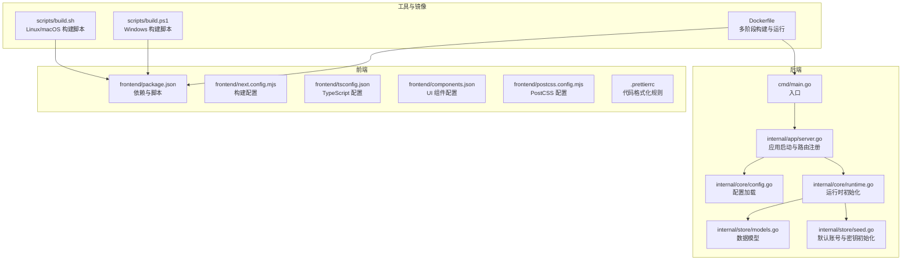
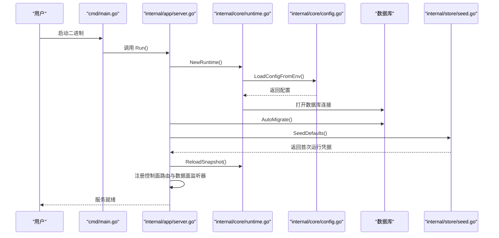
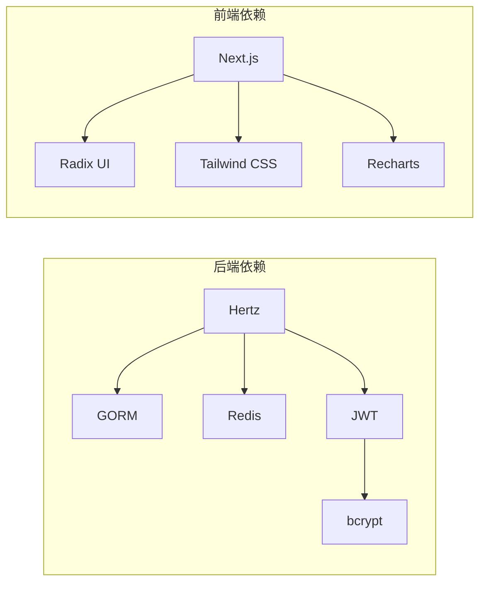

# 快速开始

<cite>
**本文引用的文件**
- [README.md](file://README.md)
- [go.mod](file://go.mod)
- [Dockerfile](file://Dockerfile)
- [cmd/main.go](file://cmd/main.go)
- [internal/app/server.go](file://internal/app/server.go)
- [internal/core/config.go](file://internal/core/config.go)
- [internal/core/runtime.go](file://internal/core/runtime.go)
- [internal/store/models.go](file://internal/store/models.go)
- [internal/store/seed.go](file://internal/store/seed.go)
- [scripts/build.sh](file://scripts/build.sh)
- [scripts/build.ps1](file://scripts/build.ps1)
- [frontend/package.json](file://frontend/package.json)
- [frontend/next.config.mjs](file://frontend/next.config.mjs)
- [frontend/tsconfig.json](file://frontend/tsconfig.json)
- [frontend/components.json](file://frontend/components.json)
- [frontend/postcss.config.mjs](file://frontend/postcss.config.mjs)
- [frontend/.prettierrc](file://frontend/.prettierrc)
</cite>

## 目录
1. [简介](#简介)
2. [项目结构](#项目结构)
3. [核心组件](#核心组件)
4. [架构总览](#架构总览)
5. [详细组件分析](#详细组件分析)
6. [依赖关系分析](#依赖关系分析)
7. [性能考虑](#性能考虑)
8. [故障排除指南](#故障排除指南)
9. [结论](#结论)
10. [附录](#附录)

## 简介
本指南面向首次接触 My-OpenWaf 的用户，帮助你在最短时间内完成安装、构建与运行，并通过 Docker 实现一键部署。文档覆盖以下内容：
- 环境准备与依赖安装（Go、Node.js、数据库）
- 本地开发环境搭建（后端、前端、数据库初始化）
- 构建流程（脚本与手动命令）
- 启动运行与首次登录
- Docker 镜像构建与容器运行
- 基本配置项与首次使用指引
- 常见问题与排障建议

## 项目结构
My-OpenWaf 采用前后端分离的二进制可执行程序：后端由 Go 编写并通过 Hertz 框架提供控制面与数据面服务；前端基于 Next.js 构建静态资源并嵌入到后端二进制中。

图表来源
- [cmd/main.go:1-10](file://cmd/main.go#L1-L10)
- [internal/app/server.go:1-490](file://internal/app/server.go#L1-L490)
- [internal/core/config.go:1-183](file://internal/core/config.go#L1-L183)
- [internal/core/runtime.go:1-127](file://internal/core/runtime.go#L1-L127)
- [internal/store/models.go:1-456](file://internal/store/models.go#L1-L456)
- [internal/store/seed.go:1-68](file://internal/store/seed.go#L1-L68)
- [scripts/build.sh:1-11](file://scripts/build.sh#L1-L11)
- [scripts/build.ps1:1-18](file://scripts/build.ps1#L1-L18)
- [frontend/package.json:1-45](file://frontend/package.json#L1-L45)
- [frontend/next.config.mjs:1-12](file://frontend/next.config.mjs#L1-L12)
- [frontend/tsconfig.json:1-45](file://frontend/tsconfig.json#L1-L45)
- [frontend/components.json:1-26](file://frontend/components.json#L1-L26)
- [frontend/postcss.config.mjs:1-9](file://frontend/postcss.config.mjs#L1-L9)
- [frontend/.prettierrc:1-12](file://frontend/.prettierrc#L1-L12)
- [Dockerfile:1-36](file://Dockerfile#L1-L36)

章节来源
- [README.md:1-1](file://README.md#L1-L1)
- [go.mod:1-58](file://go.mod#L1-L58)
- [Dockerfile:1-36](file://Dockerfile#L1-L36)
- [cmd/main.go:1-10](file://cmd/main.go#L1-L10)
- [internal/app/server.go:1-490](file://internal/app/server.go#L1-L490)
- [internal/core/config.go:1-183](file://internal/core/config.go#L1-L183)
- [internal/core/runtime.go:1-127](file://internal/core/runtime.go#L1-L127)
- [internal/store/models.go:1-456](file://internal/store/models.go#L1-L456)
- [internal/store/seed.go:1-68](file://internal/store/seed.go#L1-L68)
- [scripts/build.sh:1-11](file://scripts/build.sh#L1-L11)
- [scripts/build.ps1:1-18](file://scripts/build.ps1#L1-L18)
- [frontend/package.json:1-45](file://frontend/package.json#L1-L45)
- [frontend/next.config.mjs:1-12](file://frontend/next.config.mjs#L1-L12)
- [frontend/tsconfig.json:1-45](file://frontend/tsconfig.json#L1-L45)
- [frontend/components.json:1-26](file://frontend/components.json#L1-L26)
- [frontend/postcss.config.mjs:1-9](file://frontend/postcss.config.mjs#L1-L9)
- [frontend/.prettierrc:1-12](file://frontend/.prettierrc#L1-L12)

## 核心组件
- 应用入口与启动
  - 入口函数位于后端根目录，调用内部应用模块启动服务。
  - 参考路径：[cmd/main.go:7-9](file://cmd/main.go#L7-L9)
- 运行时与配置
  - 运行时负责打开数据库、可选 Redis、缓存层与快照持有者。
  - 配置从环境变量加载，支持 SQLite、MySQL、Postgres 数据库驱动切换。
  - 参考路径：[internal/core/runtime.go:27-80](file://internal/core/runtime.go#L27-L80)、[internal/core/config.go:113-182](file://internal/core/config.go#L113-L182)
- 控制面与数据面
  - 控制面提供健康检查、就绪检查、状态查询与指标导出。
  - 数据面按站点维度动态热启监听器，支持 TLS 终止与 SNI 证书。
  - 参考路径：[internal/app/server.go:267-305](file://internal/app/server.go#L267-L305)、[internal/app/server.go:352-376](file://internal/app/server.go#L352-L376)
- 默认数据与凭据
  - 首次运行自动创建默认 API 密钥与管理员账户，仅在控制台显示一次。
  - 参考路径：[internal/store/seed.go:13-61](file://internal/store/seed.go#L13-L61)
- 前端构建与嵌入
  - 前端使用 Next.js 构建静态产物，复制到后端嵌入目录参与最终二进制。
  - 参考路径：[frontend/next.config.mjs:2-9](file://frontend/next.config.mjs#L2-L9)、[scripts/build.sh:4-7](file://scripts/build.sh#L4-L7)、[scripts/build.ps1:5-11](file://scripts/build.ps1#L5-L11)

章节来源
- [cmd/main.go:1-10](file://cmd/main.go#L1-L10)
- [internal/core/runtime.go:1-127](file://internal/core/runtime.go#L1-L127)
- [internal/core/config.go:1-183](file://internal/core/config.go#L1-L183)
- [internal/app/server.go:1-490](file://internal/app/server.go#L1-L490)
- [internal/store/seed.go:1-68](file://internal/store/seed.go#L1-L68)
- [frontend/next.config.mjs:1-12](file://frontend/next.config.mjs#L1-L12)
- [scripts/build.sh:1-11](file://scripts/build.sh#L1-L11)
- [scripts/build.ps1:1-18](file://scripts/build.ps1#L1-L18)

## 架构总览
下图展示从进程启动到服务可用的关键流程，包括配置加载、数据库迁移、默认数据注入、快照构建与监听器热启。

图表来源
- [cmd/main.go:7-9](file://cmd/main.go#L7-L9)
- [internal/app/server.go:35-75](file://internal/app/server.go#L35-L75)
- [internal/core/runtime.go:27-80](file://internal/core/runtime.go#L27-L80)
- [internal/core/config.go:113-182](file://internal/core/config.go#L113-L182)
- [internal/store/seed.go:13-61](file://internal/store/seed.go#L13-L61)

## 详细组件分析

### 安装与环境准备
- Go 环境
  - 版本要求：参考模块定义中的 Go 版本。
  - 参考路径：[go.mod:3](file://go.mod#L3)
- 前端依赖
  - Node.js 与包管理器用于构建 Next.js 前端。
  - 参考路径：[frontend/package.json:6-12](file://frontend/package.json#L6-L12)
- 数据库
  - 支持 SQLite、MySQL、Postgres。默认使用 SQLite 文件存储于数据目录。
  - 参考路径：[internal/core/config.go:75-102](file://internal/core/config.go#L75-L102)、[internal/core/config.go:113-124](file://internal/core/config.go#L113-L124)

章节来源
- [go.mod:1-58](file://go.mod#L1-L58)
- [frontend/package.json:1-45](file://frontend/package.json#L1-L45)
- [internal/core/config.go:1-183](file://internal/core/config.go#L1-L183)

### 本地开发环境搭建
- 步骤概览
  1) 准备 Go 与 Node.js 环境
  2) 安装前端依赖
  3) 构建前端静态资源
  4) 生成后端二进制
  5) 初始化数据库并运行
- 前端安装与构建
  - 使用包管理器安装依赖并构建静态资源。
  - 参考路径：[frontend/package.json:6-12](file://frontend/package.json#L6-L12)、[frontend/next.config.mjs:2-9](file://frontend/next.config.mjs#L2-L9)
- 后端构建
  - Linux/macOS：使用构建脚本自动复制前端产物并编译后端。
  - Windows：使用 PowerShell 脚本完成相同流程。
  - 参考路径：[scripts/build.sh:4-10](file://scripts/build.sh#L4-L10)、[scripts/build.ps1:5-15](file://scripts/build.ps1#L5-L15)
- 数据库初始化
  - 启动后自动执行数据库迁移与默认数据注入。
  - 参考路径：[internal/app/server.go:46-56](file://internal/app/server.go#L46-L56)、[internal/store/seed.go:13-61](file://internal/store/seed.go#L13-L61)

章节来源
- [frontend/package.json:1-45](file://frontend/package.json#L1-L45)
- [frontend/next.config.mjs:1-12](file://frontend/next.config.mjs#L1-L12)
- [scripts/build.sh:1-11](file://scripts/build.sh#L1-L11)
- [scripts/build.ps1:1-18](file://scripts/build.ps1#L1-L18)
- [internal/app/server.go:1-75](file://internal/app/server.go#L1-L75)
- [internal/store/seed.go:1-68](file://internal/store/seed.go#L1-L68)

### 构建过程
- 多阶段构建（推荐）
  - 使用 Dockerfile 进行多阶段构建：前端构建、后端编译、运行时镜像。
  - 参考路径：[Dockerfile:1-36](file://Dockerfile#L1-L36)
- 手动构建（不推荐）
  - 分别构建前端与后端，再将前端产物复制到嵌入目录。
  - 参考路径：[scripts/build.sh:4-10](file://scripts/build.sh#L4-L10)、[scripts/build.ps1:5-15](file://scripts/build.ps1#L5-L15)

章节来源
- [Dockerfile:1-36](file://Dockerfile#L1-L36)
- [scripts/build.sh:1-11](file://scripts/build.sh#L1-L11)
- [scripts/build.ps1:1-18](file://scripts/build.ps1#L1-L18)

### 启动运行与首次使用
- 启动方式
  - 直接运行已构建的二进制文件。
  - 参考路径：[cmd/main.go:7-9](file://cmd/main.go#L7-L9)
- 首次运行提示
  - 控制台会打印管理员用户名与密码（仅显示一次）。
  - 参考路径：[internal/app/server.go:57-70](file://internal/app/server.go#L57-L70)
- 登录与初始配置
  - 使用控制台输出的凭据登录后台，创建站点、监听器与防护策略。
  - 参考路径：[internal/store/seed.go:38-58](file://internal/store/seed.go#L38-L58)

章节来源
- [cmd/main.go:1-10](file://cmd/main.go#L1-L10)
- [internal/app/server.go:51-70](file://internal/app/server.go#L51-L70)
- [internal/store/seed.go:1-68](file://internal/store/seed.go#L1-L68)

### Docker 部署方案
- 镜像构建
  - 使用多阶段构建，前端在独立阶段构建，后端在 Go 基础镜像中编译，最终运行在 Alpine。
  - 参考路径：[Dockerfile:1-36](file://Dockerfile#L1-L36)
- 运行参数
  - 默认暴露控制面端口，使用 SQLite 存储于 /app/data。
  - 可通过环境变量调整数据库驱动、DSN、数据目录与控制面绑定地址。
  - 参考路径：[Dockerfile:26-29](file://Dockerfile#L26-L29)、[internal/core/config.go:113-182](file://internal/core/config.go#L113-L182)
- 卷挂载
  - 建议将 /app/data 挂载到持久化存储以保存数据库文件。
  - 参考路径：[Dockerfile:24-25](file://Dockerfile#L24-L25)

章节来源
- [Dockerfile:1-36](file://Dockerfile#L1-L36)
- [internal/core/config.go:113-182](file://internal/core/config.go#L113-L182)

### 基本配置示例
- 环境变量（常用）
  - MY_OPENWAF_DB_DRIVER：数据库驱动（sqlite/mysql/postgres，默认 sqlite）
  - MY_OPENWAF_DSN 或 MY_OPENWAF_DB：数据库连接串或文件路径
  - MY_OPENWAF_DATA：SQLite 文件所在目录（默认 ./data）
  - MY_OPENWAF_ADMIN_BIND：控制面监听地址（默认 :9443）
  - MY_OPENWAF_REDIS_ADDR/PASSWORD/DB：Redis 地址与认证
  - MY_OPENWAF_GEOIP_DB：GeoIP 数据库路径（Bot 识别）
  - MY_OPENWAF_BOT_THRESHOLD：Bot 评分阈值
  - MY_OPENWAF_DROP_ENABLED/BOT_THRESHOLD：TCP Drop 策略
  - MY_OPENWAF_ADMIN_STATIC_DIR：本地开发时指定静态资源目录
- 参考路径：[internal/core/config.go:113-182](file://internal/core/config.go#L113-L182)

章节来源
- [internal/core/config.go:1-183](file://internal/core/config.go#L1-L183)

### 首次使用指南
- 登录后台
  - 使用首次运行提示中的管理员凭据登录。
  - 参考路径：[internal/app/server.go:57-70](file://internal/app/server.go#L57-L70)
- 创建站点与监听器
  - 在“站点”页面添加站点，设置监听地址与上游目标。
  - 参考路径：[internal/store/models.go:94-148](file://internal/store/models.go#L94-L148)
- 配置防护策略
  - 在“防护”页面启用 OWASP、速率限制、机器人检测等策略。
  - 参考路径：[internal/store/models.go:245-318](file://internal/store/models.go#L245-L318)
- 查看安全事件
  - 在“安全事件”页面查看拦截记录与统计。
  - 参考路径：[internal/store/models.go:212-236](file://internal/store/models.go#L212-L236)

章节来源
- [internal/app/server.go:51-70](file://internal/app/server.go#L51-L70)
- [internal/store/models.go:1-456](file://internal/store/models.go#L1-L456)

## 依赖关系分析
- 后端依赖
  - Web 框架：Hertz
  - ORM：GORM（SQLite/MySQL/Postgres）
  - 缓存：Ristretto（内存缓存）、Redis（分布式缓存/同步）
  - 加解密：bcrypt、JWT
  - 参考路径：[go.mod:5-16](file://go.mod#L5-L16)
- 前端依赖
  - 框架：Next.js
  - UI：Radix UI、Tailwind CSS、Lucide 图标
  - 可视化：Recharts
  - 参考路径：[frontend/package.json:14-29](file://frontend/package.json#L14-L29)

图表来源
- [go.mod:5-16](file://go.mod#L5-L16)
- [frontend/package.json:14-29](file://frontend/package.json#L14-L29)

章节来源
- [go.mod:1-58](file://go.mod#L1-L58)
- [frontend/package.json:1-45](file://frontend/package.json#L1-L45)

## 性能考虑
- 内存缓存
  - 使用 Ristretto 作为内存缓存层，提升热点数据访问性能。
  - 参考路径：[internal/core/runtime.go:61-64](file://internal/core/runtime.go#L61-L64)
- 分布式缓存与同步
  - 可选 Redis 作为分布式缓存与配置同步通道，支持多节点热重载。
  - 参考路径：[internal/core/runtime.go:67-70](file://internal/core/runtime.go#L67-L70)、[internal/app/server.go:244-260](file://internal/app/server.go#L244-L260)
- 数据库驱动选择
  - SQLite 适合单机演示；生产建议使用 MySQL/Postgres 并配置连接池。
  - 参考路径：[internal/core/config.go:75-102](file://internal/core/config.go#L75-L102)

## 故障排除指南
- 数据库无法连接
  - 检查数据库驱动与 DSN 是否正确，确认数据目录权限。
  - 参考路径：[internal/core/config.go:113-124](file://internal/core/config.go#L113-L124)、[internal/core/runtime.go:41-48](file://internal/core/runtime.go#L41-L48)
- Redis 连接失败
  - 检查地址、密码与数据库编号是否匹配。
  - 参考路径：[internal/core/runtime.go:49-59](file://internal/core/runtime.go#L49-L59)
- 前端静态资源缺失
  - 确保构建脚本已将 out 目录复制到嵌入目录。
  - 参考路径：[scripts/build.sh:6-7](file://scripts/build.sh#L6-L7)、[scripts/build.ps1:10-11](file://scripts/build.ps1#L10-L11)
- 首次运行凭据未显示
  - 确认数据库迁移与默认数据注入流程已执行。
  - 参考路径：[internal/app/server.go:46-56](file://internal/app/server.go#L46-L56)、[internal/store/seed.go:13-61](file://internal/store/seed.go#L13-L61)
- 控制面端口占用
  - 修改 MY_OPENWAF_ADMIN_BIND 或释放端口。
  - 参考路径：[internal/core/config.go:133-136](file://internal/core/config.go#L133-L136)、[Dockerfile:29](file://Dockerfile#L29)

章节来源
- [internal/core/config.go:113-182](file://internal/core/config.go#L113-L182)
- [internal/core/runtime.go:1-127](file://internal/core/runtime.go#L1-L127)
- [internal/app/server.go:1-75](file://internal/app/server.go#L1-L75)
- [internal/store/seed.go:1-68](file://internal/store/seed.go#L1-L68)
- [scripts/build.sh:1-11](file://scripts/build.sh#L1-L11)
- [scripts/build.ps1:1-18](file://scripts/build.ps1#L1-L18)
- [Dockerfile:1-36](file://Dockerfile#L1-L36)

## 结论
通过本指南，你可以在本地或容器环境中快速完成 My-OpenWaf 的安装、构建与运行。建议优先使用 Docker 方案以获得一致的部署体验；生产场景请根据需要切换数据库驱动并配置 Redis 以实现高可用与热重载能力。

## 附录
- 关键文件索引
  - 后端入口：[cmd/main.go:7-9](file://cmd/main.go#L7-L9)
  - 应用启动：[internal/app/server.go:35-75](file://internal/app/server.go#L35-L75)
  - 配置加载：[internal/core/config.go:113-182](file://internal/core/config.go#L113-L182)
  - 运行时初始化：[internal/core/runtime.go:27-80](file://internal/core/runtime.go#L27-L80)
  - 默认数据注入：[internal/store/seed.go:13-61](file://internal/store/seed.go#L13-L61)
  - 前端构建配置：[frontend/next.config.mjs:2-9](file://frontend/next.config.mjs#L2-L9)
  - 构建脚本：[scripts/build.sh:4-10](file://scripts/build.sh#L4-L10)、[scripts/build.ps1:5-15](file://scripts/build.ps1#L5-L15)
  - Dockerfile：[Dockerfile:1-36](file://Dockerfile#L1-L36)