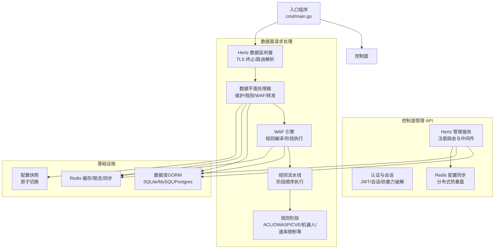
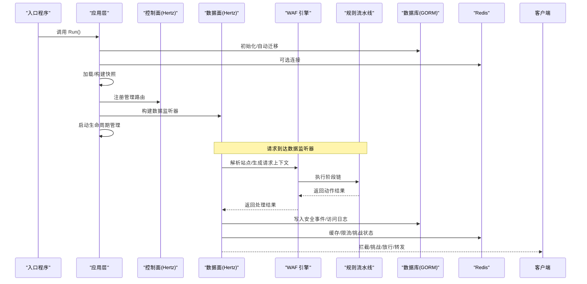
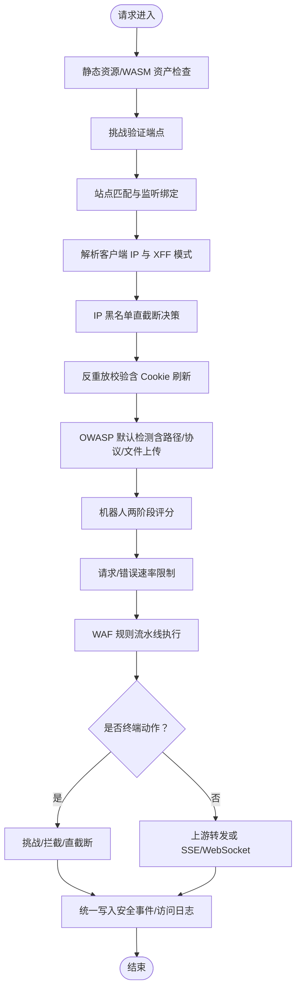
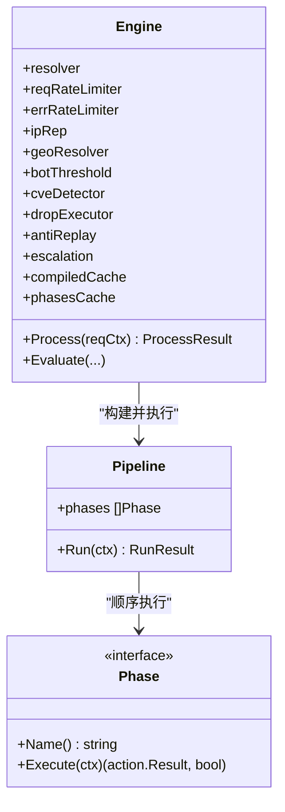
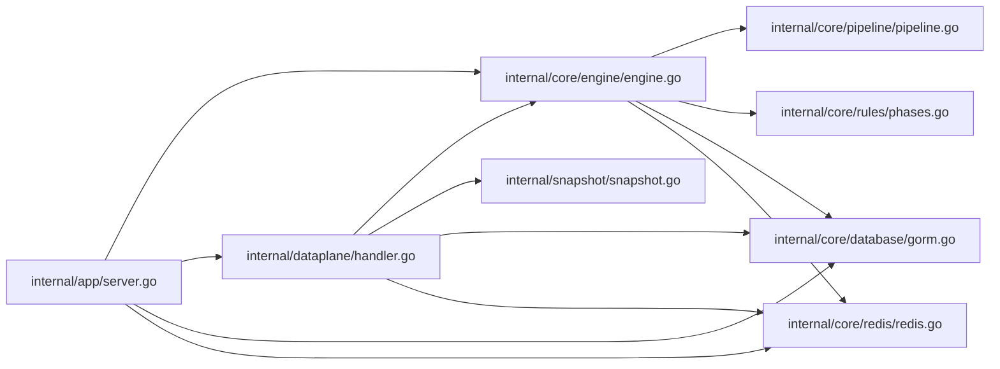

# 技术架构

<cite>
**本文引用的文件**
- [cmd/main.go](file://cmd/main.go)
- [internal/app/server.go](file://internal/app/server.go)
- [internal/core/engine/engine.go](file://internal/core/engine/engine.go)
- [internal/core/pipeline/pipeline.go](file://internal/core/pipeline/pipeline.go)
- [internal/core/rules/phases.go](file://internal/core/rules/phases.go)
- [internal/dataplane/handler.go](file://internal/dataplane/handler.go)
- [internal/snapshot/snapshot.go](file://internal/snapshot/snapshot.go)
- [internal/core/config.go](file://internal/core/config.go)
- [internal/core/database/gorm.go](file://internal/core/database/gorm.go)
- [internal/core/redis/redis.go](file://internal/core/redis/redis.go)
- [internal/waf/antireplay/antireplay.go](file://internal/waf/antireplay/antireplay.go)
- [internal/waf/bot/bot.go](file://internal/waf/bot/bot.go)
- [internal/waf/ratelimit/ratelimit.go](file://internal/waf/ratelimit/ratelimit.go)
- [go.mod](file://go.mod)
- [Dockerfile](file://Dockerfile)
</cite>

## 目录
1. [引言](#引言)
2. [项目结构](#项目结构)
3. [核心组件](#核心组件)
4. [架构总览](#架构总览)
5. [详细组件分析](#详细组件分析)
6. [依赖分析](#依赖分析)
7. [性能考量](#性能考量)
8. [故障排查指南](#故障排查指南)
9. [结论](#结论)
10. [附录](#附录)

## 引言
本技术架构文档面向 My-OpenWaf 项目的开发者与运维人员，系统阐述系统的整体架构设计、核心组件关系与数据流向。文档重点解释控制面（管理 API）与数据面（请求处理）的分层理念，说明各模块职责划分与交互方式，并给出从入口程序到数据平面处理器的完整处理链。同时，文档对关键技术选型（如 Hertz 框架、GORM ORM、Redis 缓存等）进行说明，分析其应用场景与优势；最后提供架构扩展性与性能优化建议，帮助读者理解系统的可扩展能力与优化空间。

## 项目结构
My-OpenWaf 采用“控制面 + 数据面”的双服务器架构：控制面负责管理 API、认证鉴权、规则下发与热重载；数据面负责实际请求的拦截、放行、挑战与转发。应用通过入口程序启动，内部初始化运行时环境、加载快照、构建监听器与处理链，随后进入生命周期管理与信号等待。

**图表来源**
- [cmd/main.go:1-10](file://cmd/main.go#L1-L10)
- [internal/app/server.go:352-396](file://internal/app/server.go#L352-L396)
- [internal/dataplane/handler.go:69-800](file://internal/dataplane/handler.go#L69-L800)
- [internal/core/engine/engine.go:37-245](file://internal/core/engine/engine.go#L37-L245)
- [internal/core/pipeline/pipeline.go:50-124](file://internal/core/pipeline/pipeline.go#L50-L124)
- [internal/core/database/gorm.go:24-61](file://internal/core/database/gorm.go#L24-L61)
- [internal/core/redis/redis.go:17-39](file://internal/core/redis/redis.go#L17-L39)

**章节来源**
- [cmd/main.go:1-10](file://cmd/main.go#L1-L10)
- [internal/app/server.go:52-396](file://internal/app/server.go#L52-L396)

## 核心组件
- 入口程序：负责调用应用层 Run 初始化并启动控制面与数据面服务。
- 应用层（控制面 + 数据面）：完成运行时初始化、数据库迁移、种子数据、快照加载、监听器热增删、统一写入器、事件归档、指标采集、健康检查、生命周期管理等。
- 数据平面处理器：实现维护模式、IP 黑名单直截断、反重放校验、OWASP/CVE 默认检测、机器人两阶段评分、速率限制、挑战/拦截/放行、上游转发与缓存命中逻辑。
- WAF 引擎：按站点规则编译与缓存、构建阶段链、执行流水线、返回动作结果。
- 规则流水线与阶段：定义阶段接口与执行语义，支持短路、挑战延迟、观察日志等。
- 配置与快照：不可变快照持有器，支持原子切换与站点匹配。
- 关键基础设施：GORM 数据库抽象、Redis 客户端与可选配置同步、限流器与反重放管理器。

**章节来源**
- [internal/app/server.go:52-396](file://internal/app/server.go#L52-L396)
- [internal/dataplane/handler.go:69-800](file://internal/dataplane/handler.go#L69-L800)
- [internal/core/engine/engine.go:37-245](file://internal/core/engine/engine.go#L37-L245)
- [internal/core/pipeline/pipeline.go:50-124](file://internal/core/pipeline/pipeline.go#L50-L124)
- [internal/snapshot/snapshot.go:72-152](file://internal/snapshot/snapshot.go#L72-L152)

## 架构总览
My-OpenWaf 的架构以“控制面 + 数据面”为核心，控制面负责配置与状态管理，数据面负责请求处理与转发。两者通过快照与 Redis 实现解耦与热重载。

**图表来源**
- [cmd/main.go:7-9](file://cmd/main.go#L7-L9)
- [internal/app/server.go:352-396](file://internal/app/server.go#L352-L396)
- [internal/dataplane/handler.go:389-421](file://internal/dataplane/handler.go#L389-L421)
- [internal/core/engine/engine.go:200-245](file://internal/core/engine/engine.go#L200-L245)
- [internal/core/pipeline/pipeline.go:78-118](file://internal/core/pipeline/pipeline.go#L78-L118)

## 详细组件分析

### 控制面（管理 API）
- 负责健康检查、就绪检查、状态查询、指标导出。
- 注册管理 API 路由，提供认证与会话管理、令牌签发、防暴力破解、CVE 推送管理、升级策略配置、缓存读取等。
- 支持通过 Redis 进行分布式配置同步，实现多节点热重载。

**章节来源**
- [internal/app/server.go:352-371](file://internal/app/server.go#L352-L371)
- [internal/app/server.go:336-349](file://internal/app/server.go#L336-L349)

### 数据面（请求处理）
- 数据监听器基于 Hertz，默认启用 URI 原始路径、禁用预解析表单等参数，确保与上游一致。
- 处理器实现：维护模式、IP 黑名单直截断（支持 TCP RST）、反重放校验、OWASP/CVE 默认检测、机器人两阶段评分、速率限制、挑战/拦截/放行、上游转发与响应缓存。
- 统一写入器将安全事件与访问日志批量写入数据库，降低锁竞争。

**图表来源**
- [internal/dataplane/handler.go:75-780](file://internal/dataplane/handler.go#L75-L780)

**章节来源**
- [internal/dataplane/handler.go:69-800](file://internal/dataplane/handler.go#L69-L800)

### WAF 引擎与规则流水线
- 引擎负责：站点解析、规则编译与缓存、阶段链构建与缓存、维护模式判断、流水线执行。
- 规则流水线：阶段接口定义执行语义，支持短路（拦截/直截断）、挑战延迟（后续阶段仍执行）、观察日志收集。
- 阶段实现：ACL（允许/拦截）、OWASP 默认检测、CVE 检测、机器人评分、请求速率限制、IP 黑名单、反重放等。

**图表来源**
- [internal/core/engine/engine.go:37-245](file://internal/core/engine/engine.go#L37-L245)
- [internal/core/pipeline/pipeline.go:50-124](file://internal/core/pipeline/pipeline.go#L50-L124)
- [internal/core/rules/phases.go:57-800](file://internal/core/rules/phases.go#L57-L800)

**章节来源**
- [internal/core/engine/engine.go:98-198](file://internal/core/engine/engine.go#L98-L198)
- [internal/core/pipeline/pipeline.go:78-118](file://internal/core/pipeline/pipeline.go#L78-L118)
- [internal/core/rules/phases.go:57-372](file://internal/core/rules/phases.go#L57-L372)

### 配置与快照
- 快照为不可变视图，通过原子指针切换，避免并发读写问题。
- 支持站点精确匹配与通配符匹配，支持 SNI 证书映射。
- 配置来源于系统设置与站点配置合并，保护策略在运行时可热更新。

**章节来源**
- [internal/snapshot/snapshot.go:72-152](file://internal/snapshot/snapshot.go#L72-L152)
- [internal/app/server.go:320-334](file://internal/app/server.go#L320-L334)

### 关键技术选型与优势
- Hertz 框架：高性能、零拷贝、内置连接池与传输器，适合高并发数据面处理；控制面与数据面均采用 Hertz，统一生态。
- GORM ORM：支持 SQLite/MySQL/Postgres，连接池与预编译语句优化，SQLite 使用 WAL、超时与缓存参数提升并发与稳定性。
- Redis：用于限流、挑战状态、配置同步与响应缓存，Lua 原子操作保障一致性。
- 反重放：基于 HMAC 时间戳与一次性标识，结合本地与 Redis 的内存与持久化校验，兼顾性能与一致性。
- 机器人两阶段评分：先快速预筛，再深度评分，结合 GeoIP 与 IP 黑名单阈值控制，降低误判与提升准确性。

**章节来源**
- [go.mod:5-17](file://go.mod#L5-L17)
- [internal/core/database/gorm.go:24-61](file://internal/core/database/gorm.go#L24-L61)
- [internal/core/redis/redis.go:17-39](file://internal/core/redis/redis.go#L17-L39)
- [internal/waf/antireplay/antireplay.go:33-136](file://internal/waf/antireplay/antireplay.go#L33-L136)
- [internal/waf/bot/bot.go:175-333](file://internal/waf/bot/bot.go#L175-L333)

## 依赖分析
- 模块内聚与耦合：控制面与数据面通过快照与 Redis 解耦；数据面内部通过引擎与流水线解耦。
- 外部依赖：Hertz、GORM、Redis、MaxMind、Ristretto 等；通过 go.mod 明确版本与间接依赖。
- 循环依赖：未见直接循环导入；跨包依赖通过接口与共享类型（如 RequestCtx、action.Result）传递。

**图表来源**
- [internal/app/server.go:52-396](file://internal/app/server.go#L52-L396)
- [internal/core/engine/engine.go:37-245](file://internal/core/engine/engine.go#L37-L245)
- [internal/dataplane/handler.go:69-800](file://internal/dataplane/handler.go#L69-L800)
- [internal/core/pipeline/pipeline.go:50-124](file://internal/core/pipeline/pipeline.go#L50-L124)
- [internal/core/rules/phases.go:1-800](file://internal/core/rules/phases.go#L1-L800)
- [internal/snapshot/snapshot.go:72-152](file://internal/snapshot/snapshot.go#L72-L152)
- [internal/core/database/gorm.go:24-61](file://internal/core/database/gorm.go#L24-L61)
- [internal/core/redis/redis.go:17-39](file://internal/core/redis/redis.go#L17-L39)

**章节来源**
- [go.mod:5-17](file://go.mod#L5-L17)
- [internal/app/server.go:52-396](file://internal/app/server.go#L52-L396)

## 性能考量
- 连接与传输：Hertz 默认传输器与连接复用减少系统调用；URI 原始路径与禁用预解析表单避免上游差异。
- 数据库：SQLite 使用 WAL、超时与缓存参数；非 SQLite 设置最大打开/空闲连接与生命周期；GORM 预编译语句与跳过默认事务减少开销。
- 缓存：统一写入器单协程批量写入，降低锁竞争；响应缓存与查询计数缓存减少数据库压力。
- 流水线：阶段链缓存与规则编译缓存，按快照修订号与策略 ID 缓存，避免重复计算。
- 限流与反重放：本地 + Redis 组合，Lua 原子校验，降低网络往返与一致性成本。
- 并发清理：限流器后台定时清理过期窗口，释放内存。

**章节来源**
- [internal/app/server.go:107-114](file://internal/app/server.go#L107-L114)
- [internal/core/database/gorm.go:49-94](file://internal/core/database/gorm.go#L49-L94)
- [internal/core/engine/engine.go:100-137](file://internal/core/engine/engine.go#L100-L137)
- [internal/waf/antireplay/antireplay.go:102-121](file://internal/waf/antireplay/antireplay.go#L102-L121)
- [internal/waf/ratelimit/ratelimit.go:108-126](file://internal/waf/ratelimit/ratelimit.go#L108-L126)

## 故障排查指南
- 首次运行凭据：首次启动打印管理员用户名/密码与 API Token，注意遮蔽显示。
- 快照加载失败：检查数据库迁移与种子数据，确认快照构建成功。
- 监听器绑定失败：检查监听地址与 TLS 配置，确保证书有效且 SNI 映射正确。
- Redis 不可用：若未配置 Redis，部分功能（限流、挑战状态、配置同步）降级为本地实现。
- 维护模式：全局或站点维护开启时，直接拦截请求并返回维护页面。
- 速率限制：检查请求/错误窗口与阈值配置，确认限流器已启用。
- 反重放：核对 Cookie 与时间戳，确认新 Cookie 已刷新；检查 Redis 是否可用。
- 上游错误：关注 502/504，检查上游可达性与超时设置。

**章节来源**
- [internal/app/server.go:68-87](file://internal/app/server.go#L68-L87)
- [internal/app/server.go:89-92](file://internal/app/server.go#L89-L92)
- [internal/app/server.go:490-526](file://internal/app/server.go#L490-L526)
- [internal/dataplane/handler.go:475-487](file://internal/dataplane/handler.go#L475-L487)
- [internal/waf/ratelimit/ratelimit.go:50-56](file://internal/waf/ratelimit/ratelimit.go#L50-L56)
- [internal/waf/antireplay/antireplay.go:78-121](file://internal/waf/antireplay/antireplay.go#L78-L121)

## 结论
My-OpenWaf 采用清晰的控制面与数据面分层设计，通过快照与 Redis 实现配置热重载与分布式一致性；数据面以 Hertz 为核心，结合 GORM 与 Redis 提供高性能与可扩展的数据访问与缓存能力。WAF 引擎以规则流水线为核心，支持多阶段并行与短路、挑战延迟与观察日志，满足复杂防护需求。整体架构具备良好的扩展性与可观测性，便于在生产环境中稳定运行与持续演进。

## 附录
- 配置项概览：数据库驱动与 DSN、Redis 连接、管理端口、CVE 与机器人、直截断策略等，均可通过环境变量配置。
- Docker 镜像：前端构建产物嵌入后端，运行时默认 SQLite，暴露管理端口，支持挂载数据目录。

**章节来源**
- [internal/core/config.go:74-182](file://internal/core/config.go#L74-L182)
- [Dockerfile:19-36](file://Dockerfile#L19-L36)